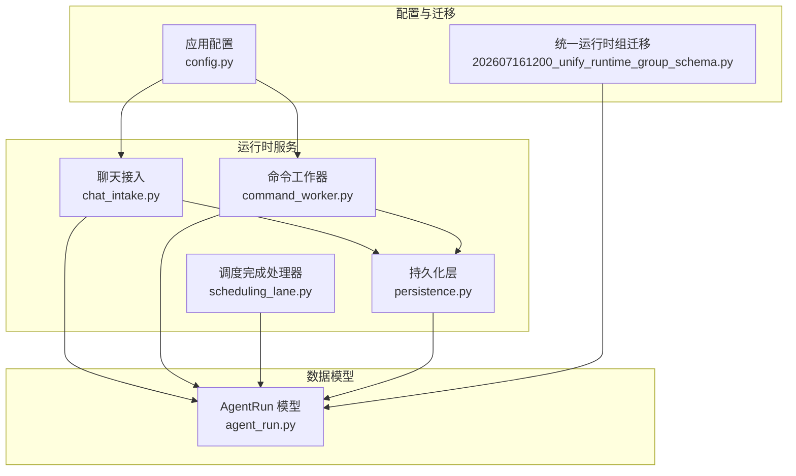
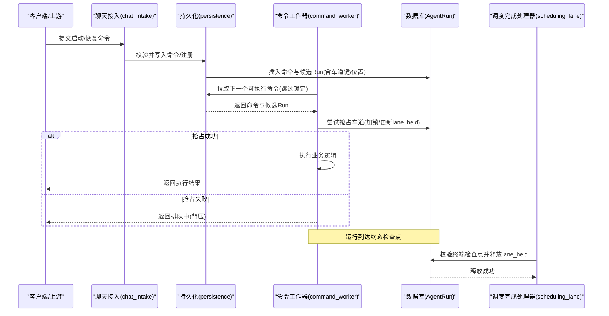
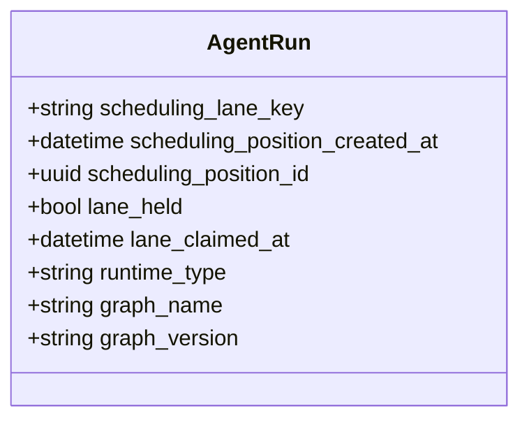
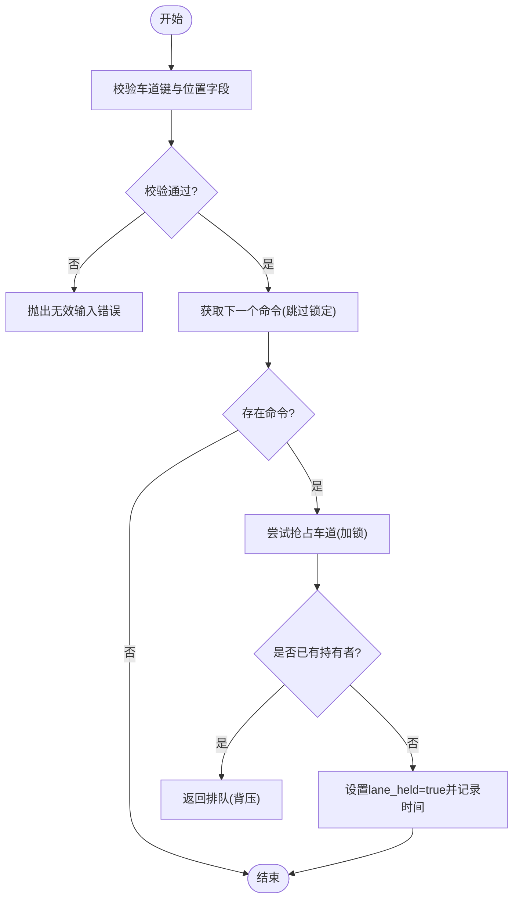
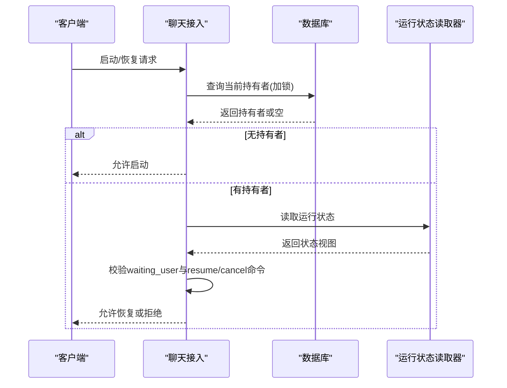
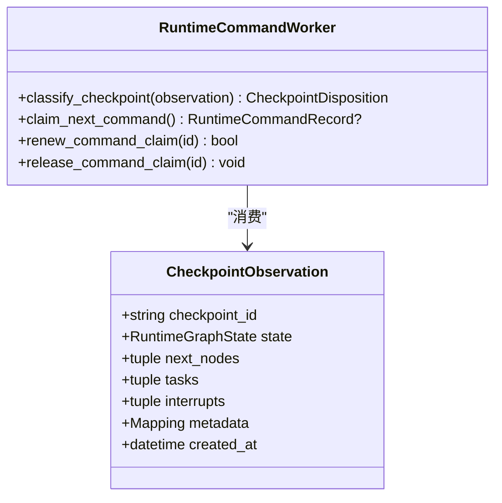
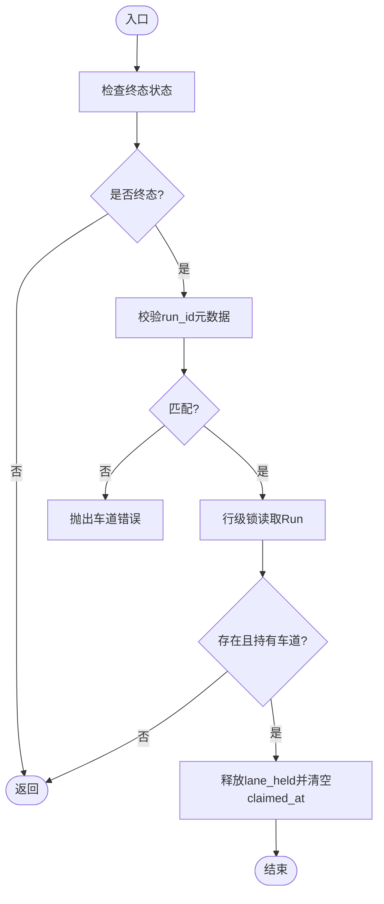
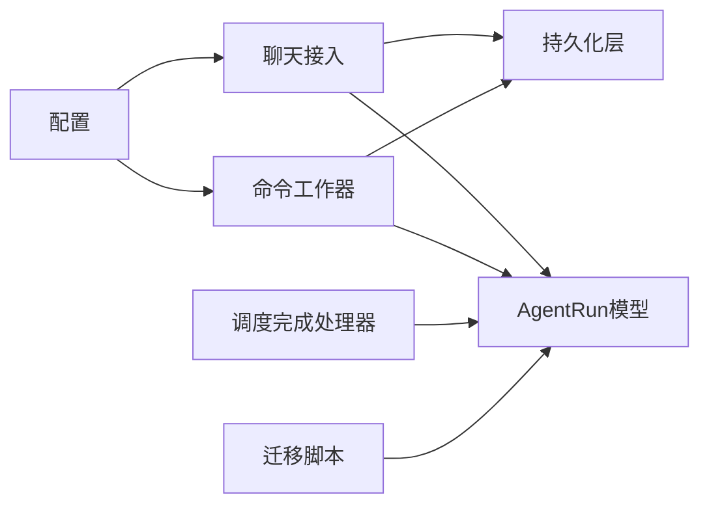

# 调度车道

<cite>
**本文引用的文件**   
- [scheduling_lane.py](file://backend/app/services/agent_runtime/scheduling_lane.py)
- [agent_run.py](file://backend/app/models/agent_run.py)
- [chat_intake.py](file://backend/app/services/agent_runtime/chat_intake.py)
- [persistence.py](file://backend/app/services/agent_runtime/persistence.py)
- [command_worker.py](file://backend/app/services/agent_runtime/command_worker.py)
- [config.py](file://backend/app/config.py)
- [202607161200_unify_runtime_group_schema.py](file://backend/alembic/versions/202607161200_unify_runtime_group_schema.py)
</cite>

## 目录
1. [简介](#简介)
2. [项目结构](#项目结构)
3. [核心组件](#核心组件)
4. [架构总览](#架构总览)
5. [详细组件分析](#详细组件分析)
6. [依赖关系分析](#依赖关系分析)
7. [性能与容量规划](#性能与容量规划)
8. [故障排查指南](#故障排查指南)
9. [结论](#结论)
10. [附录：扩展与最佳实践](#附录扩展与最佳实践)

## 简介
本技术文档围绕 Clawith 的“调度车道”系统展开，系统性阐述其概念设计、资源隔离机制、流量控制策略、生命周期管理、动态调整算法、容量规划、多车道协调、优先级路由、背压处理、配置管理、监控指标收集与性能调优。同时提供扩展开发、自定义路由策略与故障隔离的最佳实践，帮助读者从整体到细节全面掌握该子系统的设计与实现。

## 项目结构
调度车道能力主要分布在后端服务的 agent_runtime 子系统中，涉及模型定义、持久化、命令工作器、聊天接入、配置以及数据库迁移等模块。下图概览了关键文件及其职责边界。

图表来源
- [chat_intake.py:220-419](file://backend/app/services/agent_runtime/chat_intake.py#L220-L419)
- [command_worker.py:1-200](file://backend/app/services/agent_runtime/command_worker.py#L1-L200)
- [scheduling_lane.py:1-71](file://backend/app/services/agent_runtime/scheduling_lane.py#L1-L71)
- [persistence.py:173-632](file://backend/app/services/agent_runtime/persistence.py#L173-L632)
- [agent_run.py:130-195](file://backend/app/models/agent_run.py#L130-L195)
- [config.py:130-268](file://backend/app/config.py#L130-L268)
- [202607161200_unify_runtime_group_schema.py:191-221](file://backend/alembic/versions/202607161200_unify_runtime_group_schema.py#L191-L221)

章节来源
- [chat_intake.py:220-419](file://backend/app/services/agent_runtime/chat_intake.py#L220-L419)
- [command_worker.py:1-200](file://backend/app/services/agent_runtime/command_worker.py#L1-L200)
- [scheduling_lane.py:1-71](file://backend/app/services/agent_runtime/scheduling_lane.py#L1-L71)
- [persistence.py:173-632](file://backend/app/services/agent_runtime/persistence.py#L173-L632)
- [agent_run.py:130-195](file://backend/app/models/agent_run.py#L130-L195)
- [config.py:130-268](file://backend/app/config.py#L130-L268)
- [202607161200_unify_runtime_group_schema.py:191-221](file://backend/alembic/versions/202607161200_unify_runtime_group_schema.py#L191-L221)

## 核心组件
- 调度完成处理器（SchedulingLaneCompletionHandler）
  - 负责在权威终端检查点时释放被占用的车道锁，确保只有合法且一致的终态才能解除占用。
- 聊天接入（ChatIntake）
  - 维护直聊线程的车道持有者，校验并发与状态一致性，防止重复启动或非法恢复。
- 持久化层（Persistence）
  - 提供车道抢占、位置排序、唯一性约束与输入校验，保证队列顺序与互斥执行。
- 命令工作器（CommandWorker）
  - 基于检查点的可靠命令投递与重试，结合线程锁与声明式 TTL 进行背压与幂等控制。
- 数据模型（AgentRun）
  - 通过字段与索引/约束表达车道键、位置、持有者与时间戳，支撑有序并发与公平调度。
- 配置（Settings）
  - 暴露并发度、声明周期、扫描间隔等参数，用于容量与吞吐调优。

章节来源
- [scheduling_lane.py:1-71](file://backend/app/services/agent_runtime/scheduling_lane.py#L1-L71)
- [chat_intake.py:220-419](file://backend/app/services/agent_runtime/chat_intake.py#L220-L419)
- [persistence.py:173-632](file://backend/app/services/agent_runtime/persistence.py#L173-L632)
- [command_worker.py:1-200](file://backend/app/services/agent_runtime/command_worker.py#L1-L200)
- [agent_run.py:130-195](file://backend/app/models/agent_run.py#L130-L195)
- [config.py:130-268](file://backend/app/config.py#L130-L268)

## 架构总览
调度车道的核心思想是：将同一“逻辑通道”的任务组织为有序队列，并通过“车道键”实现资源隔离；每个时刻仅允许一个运行实例持有并执行该车道任务，其他请求进入等待队列，按位置顺序排队。当运行达到终态时，由权威检查点触发释放车道，从而形成稳定的背压与公平调度。

图表来源
- [chat_intake.py:220-419](file://backend/app/services/agent_runtime/chat_intake.py#L220-L419)
- [persistence.py:586-632](file://backend/app/services/agent_runtime/persistence.py#L586-L632)
- [command_worker.py:1-200](file://backend/app/services/agent_runtime/command_worker.py#L1-L200)
- [scheduling_lane.py:1-71](file://backend/app/services/agent_runtime/scheduling_lane.py#L1-L71)
- [agent_run.py:130-195](file://backend/app/models/agent_run.py#L130-L195)

## 详细组件分析

### 数据模型与约束（AgentRun）
- 关键字段
  - scheduling_lane_key：车道键，标识同一逻辑通道的任务集合
  - scheduling_position_created_at / scheduling_position_id：队列位置信息，保障 FIFO
  - lane_held / lane_claimed_at：车道持有标志与抢占时间
- 约束与索引
  - 唯一约束：在同一车道键下，仅允许一个 lane_held=true 的记录
  - 条件索引：加速按车道键与位置排序的查询
  - CheckConstraint：保证车道键与位置字段的一致性

图表来源
- [agent_run.py:130-195](file://backend/app/models/agent_run.py#L130-L195)
- [202607161200_unify_runtime_group_schema.py:191-221](file://backend/alembic/versions/202607161200_unify_runtime_group_schema.py#L191-L221)

章节来源
- [agent_run.py:130-195](file://backend/app/models/agent_run.py#L130-L195)
- [202607161200_unify_runtime_group_schema.py:191-221](file://backend/alembic/versions/202607161200_unify_runtime_group_schema.py#L191-L221)

### 持久化层（Persistence）
- 输入校验
  - 车道键与两个位置字段必须成对出现，否则拒绝
  - delivery_target 类型校验
- 抢占逻辑
  - 使用 with_for_update(skip_locked=True) 获取下一个待处理命令
  - 针对 start 命令，若目标 Run 未持有车道，则尝试抢占；若已有持有者则返回失败以触发排队
- 复杂度与性能
  - 单次事务内完成读取-判断-更新，避免竞态
  - 利用条件索引减少扫描范围

图表来源
- [persistence.py:173-188](file://backend/app/services/agent_runtime/persistence.py#L173-L188)
- [persistence.py:586-632](file://backend/app/services/agent_runtime/persistence.py#L586-L632)

章节来源
- [persistence.py:173-188](file://backend/app/services/agent_runtime/persistence.py#L173-L188)
- [persistence.py:586-632](file://backend/app/services/agent_runtime/persistence.py#L586-L632)

### 聊天接入（ChatIntake）
- 直聊天线程车道持有者检测
  - 通过精确匹配 tenant/agent/session/user/source/runtime/thread/lane_key 与 lane_held=true 来定位当前持有者
  - 若发现多个持有者，直接报错，确保强一致
- 准入与恢复校验
  - 需要 checkpoint-backed 的运行状态读取器参与校验
  - 对于 waiting_user 状态，要求存在 resume 命令且未被取消
  - 恢复时需严格比对 correlation_id，防止乱序或串扰

图表来源
- [chat_intake.py:220-419](file://backend/app/services/agent_runtime/chat_intake.py#L220-L419)

章节来源
- [chat_intake.py:220-419](file://backend/app/services/agent_runtime/chat_intake.py#L220-L419)

### 命令工作器（CommandWorker）
- 基于检查点的可靠投递
  - 分类检查点状态（not_started/runnable/waiting/terminal/inconsistent），决定下一步动作
  - 支持重试、幂等与撤销，避免重复执行
- 线程锁与声明周期
  - 使用线程锁串行化冲突 Run，配合 claim TTL/RENEW 实现心跳续期
  - 与持久化层协作，确保抢占与释放原子性

图表来源
- [command_worker.py:1-200](file://backend/app/services/agent_runtime/command_worker.py#L1-L200)

章节来源
- [command_worker.py:1-200](file://backend/app/services/agent_runtime/command_worker.py#L1-L200)

### 调度完成处理器（SchedulingLaneCompletionHandler）
- 仅在权威终端检查点释放车道
  - 校验 lifecycle.status 为终态
  - 校验 metadata.clawith_run_id 与 RunRegistry 一致
  - 使用行级锁读取并更新 lane_held=false，清空 claimed_at

图表来源
- [scheduling_lane.py:1-71](file://backend/app/services/agent_runtime/scheduling_lane.py#L1-L71)

章节来源
- [scheduling_lane.py:1-71](file://backend/app/services/agent_runtime/scheduling_lane.py#L1-L71)

## 依赖关系分析
- 组件耦合
  - ChatIntake 依赖 Persistence 与 AgentRun 模型，确保直聊天线程的独占性
  - CommandWorker 依赖 Persistence 与 AgentRun，实现命令拉取与抢占
  - SchedulingLaneCompletionHandler 依赖 AgentRun 与数据库会话，确保终态释放
- 外部依赖
  - 配置 Settings 影响并发度、TTL、扫描频率等
  - 迁移脚本定义了约束与索引，保障数据一致性

图表来源
- [chat_intake.py:220-419](file://backend/app/services/agent_runtime/chat_intake.py#L220-L419)
- [persistence.py:173-632](file://backend/app/services/agent_runtime/persistence.py#L173-L632)
- [command_worker.py:1-200](file://backend/app/services/agent_runtime/command_worker.py#L1-L200)
- [scheduling_lane.py:1-71](file://backend/app/services/agent_runtime/scheduling_lane.py#L1-L71)
- [agent_run.py:130-195](file://backend/app/models/agent_run.py#L130-L195)
- [config.py:130-268](file://backend/app/config.py#L130-L268)
- [202607161200_unify_runtime_group_schema.py:191-221](file://backend/alembic/versions/202607161200_unify_runtime_group_schema.py#L191-L221)

章节来源
- [chat_intake.py:220-419](file://backend/app/services/agent_runtime/chat_intake.py#L220-L419)
- [persistence.py:173-632](file://backend/app/services/agent_runtime/persistence.py#L173-L632)
- [command_worker.py:1-200](file://backend/app/services/agent_runtime/command_worker.py#L1-L200)
- [scheduling_lane.py:1-71](file://backend/app/services/agent_runtime/scheduling_lane.py#L1-L71)
- [agent_run.py:130-195](file://backend/app/models/agent_run.py#L130-L195)
- [config.py:130-268](file://backend/app/config.py#L130-L268)
- [202607161200_unify_runtime_group_schema.py:191-221](file://backend/alembic/versions/202607161200_unify_runtime_group_schema.py#L191-L221)

## 性能与容量规划
- 并发与吞吐
  - AGENT_RUNTIME_COMMAND_CONCURRENCY：单进程内命令并发上限，需结合 CPU/IO 特性调优
  - 扫描间隔（如异步工具轮询、交付扫描）：影响延迟与负载平衡
- 声明周期与可靠性
  - CLAIM_TTL_SECONDS / CLAIM_RENEW_SECONDS：心跳续期策略，避免僵尸任务
  - MAX_ATTEMPTS：最大重试次数，平衡稳定性与资源占用
- 容量规划建议
  - 根据峰值 QPS 与平均处理时长估算所需 worker 数量
  - 关注数据库锁竞争与索引命中率，必要时拆分车道键粒度
  - 监控 lane_held 持有时间与队列长度，识别瓶颈

章节来源
- [config.py:130-268](file://backend/app/config.py#L130-L268)

## 故障排查指南
- 常见问题
  - 多持有者冲突：直聊天线程检测到多个 lane_held=true，需检查并发写入与锁释放路径
  - 恢复关联不匹配：resume 的 correlation_id 不一致，确认上游幂等键与状态同步
  - 抢占失败导致排队：确认是否存在活跃持有者或更早位置任务
  - 终端检查点不一致：metadata.run_id 不匹配，检查检查点来源与 RunRegistry
- 定位步骤
  - 查看 AgentRun 的 lane_held、lane_claimed_at、scheduling_position_* 字段
  - 检查命令表中的 status 与 attempt_count
  - 核对检查点分类结果与 next_nodes/tasks/interrupts 一致性

章节来源
- [chat_intake.py:220-419](file://backend/app/services/agent_runtime/chat_intake.py#L220-L419)
- [persistence.py:173-188](file://backend/app/services/agent_runtime/persistence.py#L173-L188)
- [command_worker.py:1-200](file://backend/app/services/agent_runtime/command_worker.py#L1-L200)
- [scheduling_lane.py:1-71](file://backend/app/services/agent_runtime/scheduling_lane.py#L1-L71)

## 结论
调度车道系统通过“车道键+位置+持有者”的组合，实现了严格的资源隔离与公平调度。借助检查点驱动的权威状态与数据库级锁，系统在并发场景下保持强一致性与高可用性。合理的配置与监控能够进一步提升吞吐与稳定性，满足复杂业务场景下的需求。

## 附录：扩展与最佳实践
- 扩展开发
  - 新增车道类型：在持久化层增加校验与抢占逻辑，确保与现有约束兼容
  - 自定义路由策略：基于 tenant/agent/session 维度组合车道键，实现租户/会话级隔离
  - 背压增强：结合命令重试与消费者速率限制，避免上游过载
- 监控指标
  - 队列长度、抢占成功率、持有者存活时间、终态释放耗时
  - 检查点分类分布、重试率、失败原因码
- 故障隔离
  - 按车道键划分故障域，限制扩散范围
  - 对异常 Run 快速降级与隔离，保留审计日志以便回溯

[本节为通用指导，无需特定文件引用]