# RBAC权限控制

<cite>
**本文引用的文件**   
- [permissions.py](file://backend/app/core/permissions.py)
- [security.py](file://backend/app/core/security.py)
- [user.py](file://backend/app/models/user.py)
- [org.py](file://backend/app/models/org.py)
- [agent.py](file://backend/app/models/agent.py)
- [workspace.py](file://backend/app/models/workspace.py)
- [auth.py](file://backend/app/api/auth.py)
- [auth_provider.py](file://backend/app/services/auth_provider.py)
</cite>

## 目录
1. [简介](#简介)
2. [项目结构](#项目结构)
3. [核心组件](#核心组件)
4. [架构总览](#架构总览)
5. [详细组件分析](#详细组件分析)
6. [依赖关系分析](#依赖关系分析)
7. [性能考量](#性能考量)
8. [故障排查指南](#故障排查指南)
9. [结论](#结论)
10. [附录](#附录)

## 简介
本文件为 Clawith 的基于角色的访问控制（RBAC）系统提供权威文档。内容涵盖：
- 角色模型与层级、组织与租户隔离、Agent 权限策略
- 用户角色分配、权限验证流程、动态权限检查
- 组织层级权限、工作空间权限、Agent 间权限
- 权限审计、冲突解决、迁移策略
- 扩展权限模型、自定义规则、外部身份提供商集成

## 项目结构
Clawith 后端采用分层架构，权限相关代码集中在 core、models、api、services 等模块：
- core: 安全与权限核心能力（JWT、鉴权依赖、RBAC 判定）
- models: 领域模型（User、Identity、OrgMember、Agent、AgentPermission、Workspace 等）
- api: 认证与授权入口（登录、注册、SSO、租户切换）
- services: 身份提供商适配（OAuth/SSO）、注册服务、平台服务等

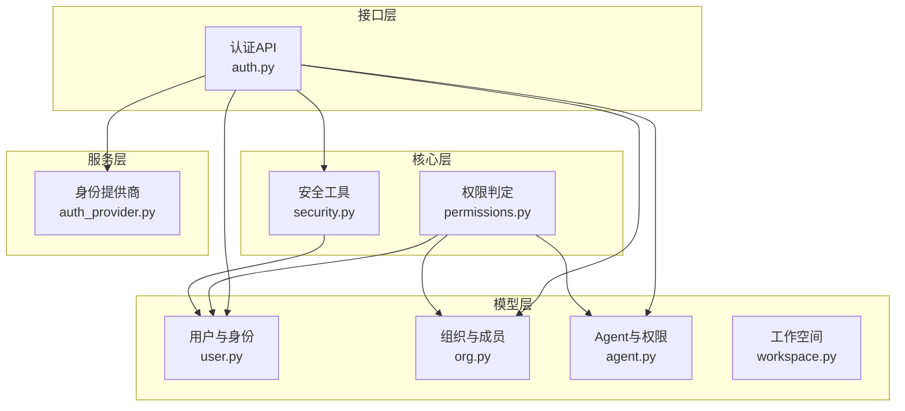

**图表来源** 
- [permissions.py:1-554](file://backend/app/core/permissions.py#L1-L554)
- [security.py:1-227](file://backend/app/core/security.py#L1-L227)
- [user.py:1-119](file://backend/app/models/user.py#L1-L119)
- [org.py:1-98](file://backend/app/models/org.py#L1-L98)
- [agent.py:1-235](file://backend/app/models/agent.py#L1-L235)
- [workspace.py:1-108](file://backend/app/models/workspace.py#L1-L108)
- [auth.py:1-800](file://backend/app/api/auth.py#L1-L800)
- [auth_provider.py:1-800](file://backend/app/services/auth_provider.py#L1-L800)

**章节来源**
- [permissions.py:1-554](file://backend/app/core/permissions.py#L1-L554)
- [security.py:1-227](file://backend/app/core/security.py#L1-L227)
- [user.py:1-119](file://backend/app/models/user.py#L1-L119)
- [org.py:1-98](file://backend/app/models/org.py#L1-L98)
- [agent.py:1-235](file://backend/app/models/agent.py#L1-L235)
- [workspace.py:1-108](file://backend/app/models/workspace.py#L1-L108)
- [auth.py:1-800](file://backend/app/api/auth.py#L1-L800)
- [auth_provider.py:1-800](file://backend/app/services/auth_provider.py#L1-L800)

## 核心组件
- 角色与层级
  - 角色枚举：member、agent_admin、org_admin、platform_admin
  - 角色层级用于接口级权限校验（require_role）
- 租户与组织隔离
  - User.tenant_id 限定资源范围
  - OrgMember 与部门路径支持组织维度可见性
- Agent 访问模式
  - company：公司内非私有 Agent 可被同租户活跃用户使用
  - private：仅创建者可用
  - custom：默认使用开放，但管理权限需显式授予
- 权限粒度
  - use：任务/聊天/工具/技能/工作空间只读或执行
  - manage：完整管理权限（配置、删除、关系管理等）

**章节来源**
- [security.py:207-227](file://backend/app/core/security.py#L207-L227)
- [user.py:74-78](file://backend/app/models/user.py#L74-L78)
- [agent.py:115-123](file://backend/app/models/agent.py#L115-L123)
- [agent.py:162-179](file://backend/app/models/agent.py#L162-L179)

## 架构总览
下图展示从请求进入鉴权到权限判定的关键路径：

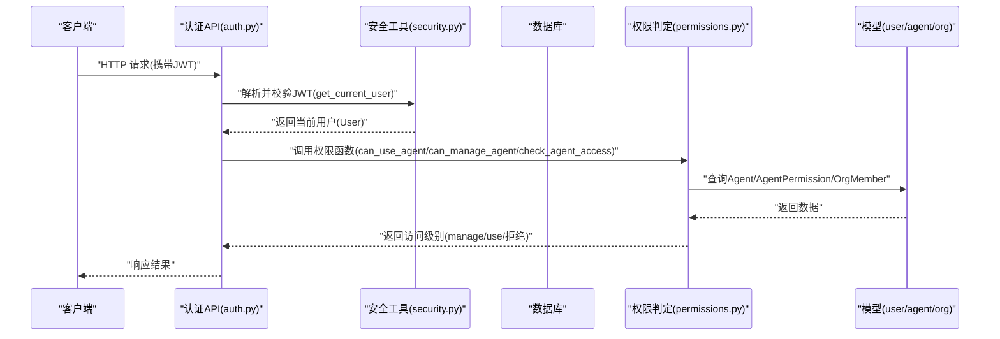

**图表来源** 
- [auth.py:1-800](file://backend/app/api/auth.py#L1-L800)
- [security.py:153-205](file://backend/app/core/security.py#L153-L205)
- [permissions.py:481-519](file://backend/app/core/permissions.py#L481-L519)
- [agent.py:162-179](file://backend/app/models/agent.py#L162-L179)
- [org.py:64-98](file://backend/app/models/org.py#L64-L98)
- [user.py:52-119](file://backend/app/models/user.py#L52-L119)

## 详细组件分析

### 角色与鉴权依赖
- 角色层级定义与 require_role 工厂函数用于接口级权限拦截
- get_current_user/get_authenticated_user 负责 JWT 解码与用户加载
- 平台管理员标识 identity.is_platform_admin 可与角色叠加判断

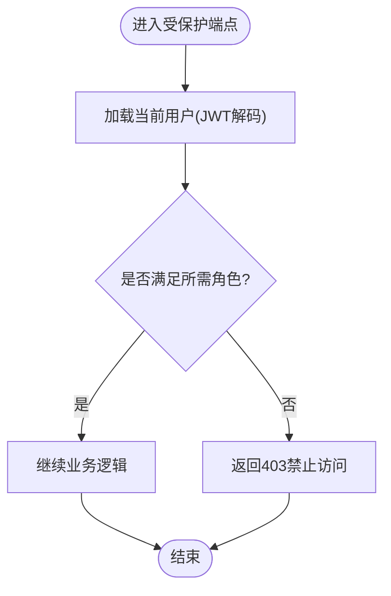

**图表来源** 
- [security.py:207-227](file://backend/app/core/security.py#L207-L227)
- [security.py:153-205](file://backend/app/core/security.py#L153-L205)

**章节来源**
- [security.py:207-227](file://backend/app/core/security.py#L207-L227)
- [security.py:153-205](file://backend/app/core/security.py#L153-L205)

### 用户与组织模型
- Identity：全局唯一身份（邮箱/用户名/手机号），跨租户共享
- User：租户内成员，包含角色、状态、配额等
- OrgMember：来自身份提供商的组织成员，关联部门与路径

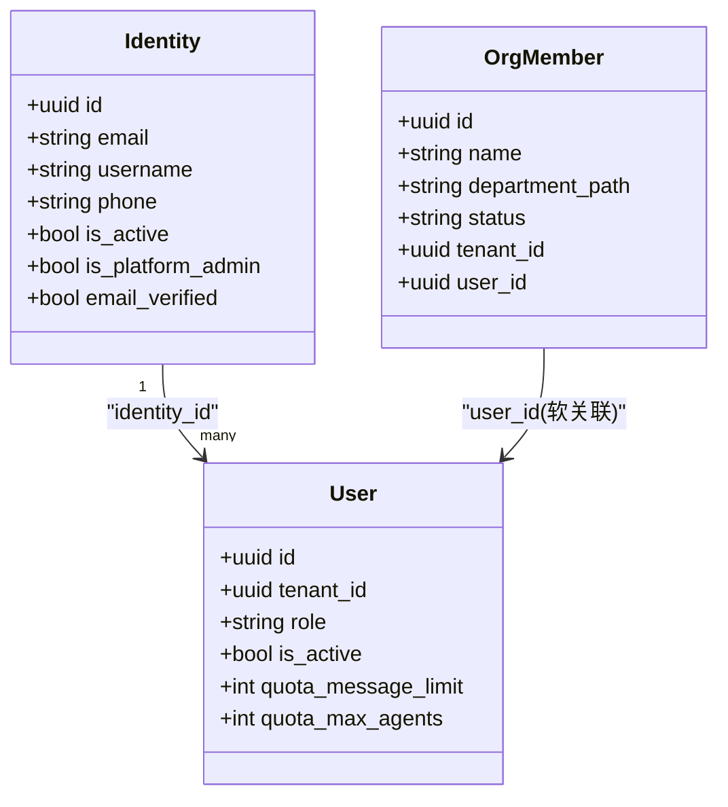

**图表来源** 
- [user.py:16-119](file://backend/app/models/user.py#L16-L119)
- [org.py:34-63](file://backend/app/models/org.py#L34-L63)

**章节来源**
- [user.py:16-119](file://backend/app/models/user.py#L16-L119)
- [org.py:34-63](file://backend/app/models/org.py#L34-L63)

### Agent 与权限模型
- Agent：数字员工实例，含访问模式(access_mode)、状态、过期控制、自主策略等
- AgentPermission：对 Agent 的细粒度授权（scope_type: company/department/user；access_level: use/manage）

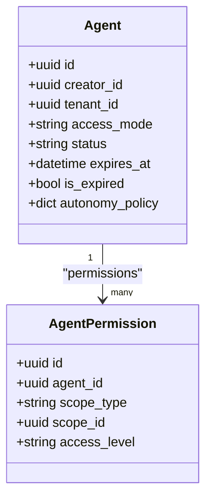

**图表来源** 
- [agent.py:19-160](file://backend/app/models/agent.py#L19-L160)
- [agent.py:162-179](file://backend/app/models/agent.py#L162-L179)

**章节来源**
- [agent.py:19-160](file://backend/app/models/agent.py#L19-L160)
- [agent.py:162-179](file://backend/app/models/agent.py#L162-L179)

### 权限判定核心流程
- can_use_agent_static：无DB快速判定（创建者、租户匹配、access_mode）
- can_use_agent：结合 AgentPermission 的use权限
- can_manage_agent：结合 AgentPermission 的manage权限
- check_agent_access：统一入口，返回访问级别或抛出异常

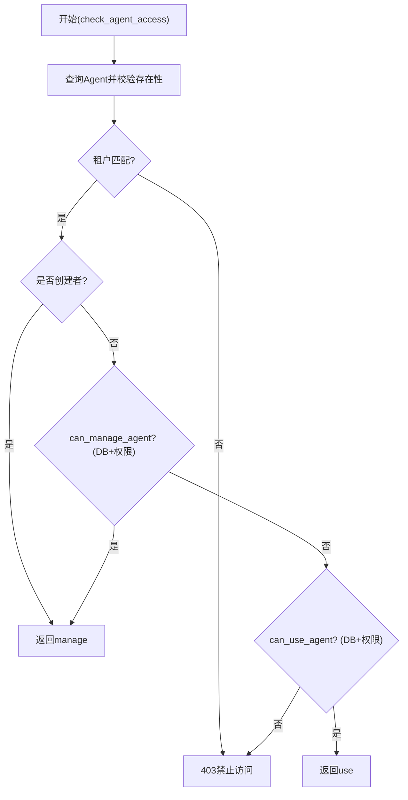

**图表来源** 
- [permissions.py:481-519](file://backend/app/core/permissions.py#L481-L519)
- [permissions.py:65-93](file://backend/app/core/permissions.py#L65-L93)
- [permissions.py:95-129](file://backend/app/core/permissions.py#L95-L129)

**章节来源**
- [permissions.py:481-519](file://backend/app/core/permissions.py#L481-L519)
- [permissions.py:65-93](file://backend/app/core/permissions.py#L65-L93)
- [permissions.py:95-129](file://backend/app/core/permissions.py#L95-L129)

### 组织与成员可见性
- evaluate_roster_human_visibility：根据source_agent.access_mode与authorized_custom_human决定可见性与联系能力
- evaluate_human_relationship_status：校验成员状态、租户一致性、平台用户对Agent的访问级别

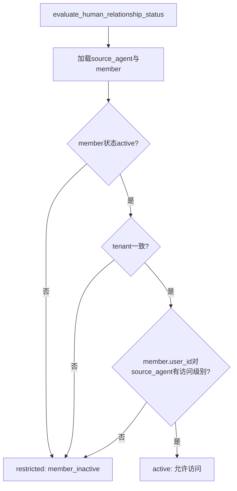

**图表来源** 
- [permissions.py:432-479](file://backend/app/core/permissions.py#L432-L479)
- [org.py:64-98](file://backend/app/models/org.py#L64-L98)

**章节来源**
- [permissions.py:432-479](file://backend/app/core/permissions.py#L432-L479)
- [org.py:64-98](file://backend/app/models/org.py#L64-L98)

### Agent 间关系与可见性
- evaluate_roster_agent_visibility：按source/target的access_mode与租户匹配决定可见性与联系能力
- evaluate_agent_relationship_status：校验目标可用性、租户一致性、创建者权限、target.access_mode

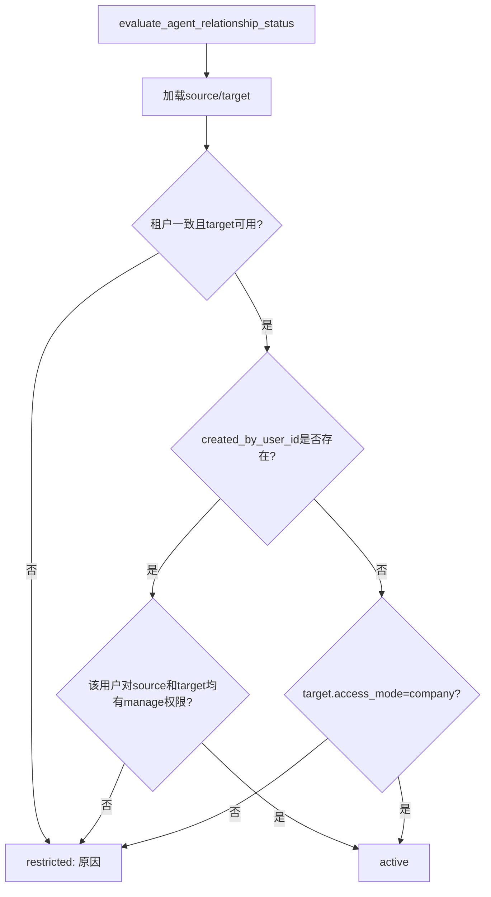

**图表来源** 
- [permissions.py:352-430](file://backend/app/core/permissions.py#L352-L430)

**章节来源**
- [permissions.py:352-430](file://backend/app/core/permissions.py#L352-L430)

### 工作空间权限
- WorkspaceFileRevision：记录文件变更历史（scope_type: agent/group）
- WorkspaceEditLock：短时编辑锁（防并发冲突）

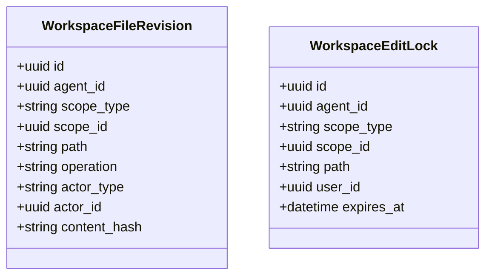

**图表来源** 
- [workspace.py:28-108](file://backend/app/models/workspace.py#L28-L108)

**章节来源**
- [workspace.py:28-108](file://backend/app/models/workspace.py#L28-L108)

### 认证与多租户切换
- login/register/sso：生成JWT，支持多租户选择与切换
- switch_tenant：校验成员资格与租户状态，签发新令牌并重定向

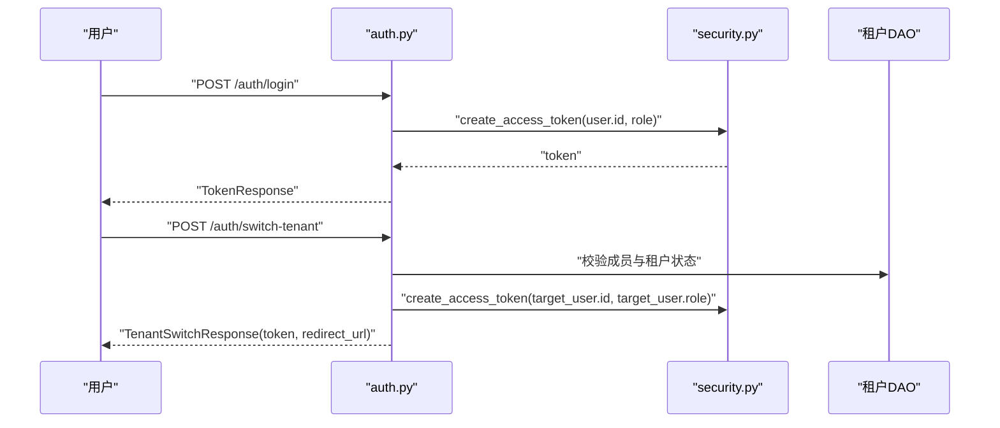

**图表来源** 
- [auth.py:422-543](file://backend/app/api/auth.py#L422-L543)
- [auth.py:748-793](file://backend/app/api/auth.py#L748-L793)
- [security.py:128-151](file://backend/app/core/security.py#L128-L151)

**章节来源**
- [auth.py:422-543](file://backend/app/api/auth.py#L422-L543)
- [auth.py:748-793](file://backend/app/api/auth.py#L748-L793)
- [security.py:128-151](file://backend/app/core/security.py#L128-L151)

### 外部身份提供商集成
- BaseAuthProvider：抽象出授权URL、code换token、获取用户信息、find_or_create_user
- 具体实现：Feishu、DingTalk、WeCom、Google Workspace、Microsoft Teams（占位）

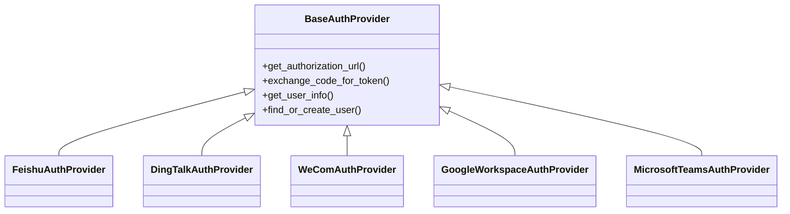

**图表来源** 
- [auth_provider.py:44-165](file://backend/app/services/auth_provider.py#L44-L165)
- [auth_provider.py:273-348](file://backend/app/services/auth_provider.py#L273-L348)
- [auth_provider.py:350-433](file://backend/app/services/auth_provider.py#L350-L433)
- [auth_provider.py:435-635](file://backend/app/services/auth_provider.py#L435-L635)
- [auth_provider.py:637-756](file://backend/app/services/auth_provider.py#L637-L756)
- [auth_provider.py:758-772](file://backend/app/services/auth_provider.py#L758-L772)

**章节来源**
- [auth_provider.py:44-165](file://backend/app/services/auth_provider.py#L44-L165)
- [auth_provider.py:273-348](file://backend/app/services/auth_provider.py#L273-L348)
- [auth_provider.py:350-433](file://backend/app/services/auth_provider.py#L350-L433)
- [auth_provider.py:435-635](file://backend/app/services/auth_provider.py#L435-L635)
- [auth_provider.py:637-756](file://backend/app/services/auth_provider.py#L637-L756)
- [auth_provider.py:758-772](file://backend/app/services/auth_provider.py#L758-L772)

## 依赖关系分析
- 权限判定依赖模型：Agent、AgentPermission、OrgMember、User
- 安全依赖：JWT解码、密码哈希、AES加解密
- API依赖：认证路由与安全依赖、租户与服务层

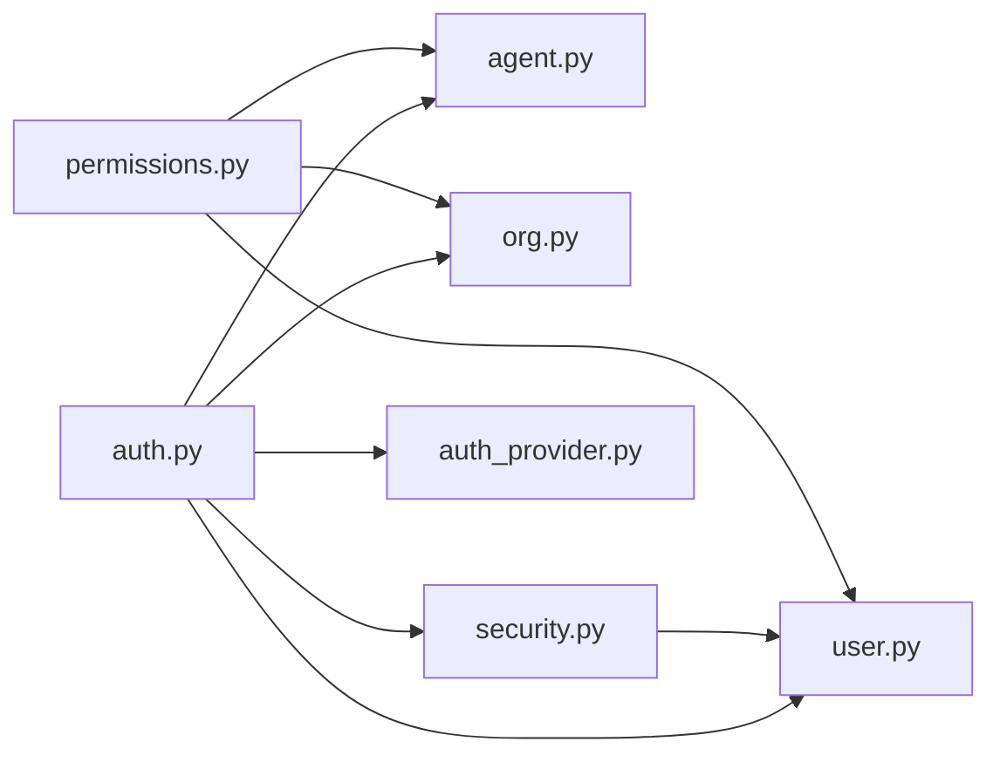

**图表来源** 
- [permissions.py:1-554](file://backend/app/core/permissions.py#L1-L554)
- [security.py:1-227](file://backend/app/core/security.py#L1-L227)
- [auth.py:1-800](file://backend/app/api/auth.py#L1-L800)
- [auth_provider.py:1-800](file://backend/app/services/auth_provider.py#L1-L800)

**章节来源**
- [permissions.py:1-554](file://backend/app/core/permissions.py#L1-L554)
- [security.py:1-227](file://backend/app/core/security.py#L1-L227)
- [auth.py:1-800](file://backend/app/api/auth.py#L1-L800)
- [auth_provider.py:1-800](file://backend/app/services/auth_provider.py#L1-L800)

## 性能考量
- 静态快速判定：can_use_agent_static避免不必要的DB查询
- 异步IO：所有DB操作使用AsyncSession，避免阻塞事件循环
- CPU密集型操作：bcrypt哈希通过线程池执行，防止阻塞
- 索引优化：Agent、OrgMember、User等表的关键字段建立索引（如tenant_id、deleted_at、path等）

[本节为通用指导，不直接分析具体文件]

## 故障排查指南
- 常见错误码
  - 401 未授权：JWT无效/过期、用户不存在或未激活
  - 403 禁止访问：租户不一致、无use/manage权限、成员inactive
  - 404 未找到：Agent不存在或被软删除
- 排查步骤
  - 检查JWT载荷中的sub与role
  - 确认User.tenant_id与Agent.tenant_id一致
  - 查看Agent.access_mode与AgentPermission记录
  - 检查成员状态与部门路径
  - 关注日志中的trace_id与错误详情

**章节来源**
- [security.py:141-173](file://backend/app/core/security.py#L141-L173)
- [permissions.py:481-519](file://backend/app/core/permissions.py#L481-L519)
- [permissions.py:432-479](file://backend/app/core/permissions.py#L432-L479)

## 结论
Clawith 的 RBAC 系统以“租户隔离 + 角色层级 + Agent 访问模式 + 细粒度权限”为核心，提供了灵活而安全的权限控制机制。通过统一的权限判定函数与清晰的模型设计，系统能够支撑复杂的组织协作与 Agent 生态。建议在生产环境中结合审计日志、定期权限审查与自动化迁移脚本，确保权限策略的一致性与可演进性。

[本节为总结性内容，不直接分析具体文件]

## 附录

### 最佳实践与安全建议
- 最小权限原则：优先授予 use，仅在必要时授予 manage
- 定期清理：移除不再需要的 AgentPermission 记录
- 强密码与双因素：结合外部身份提供商启用 MFA
- 审计与监控：记录权限变更与敏感操作，设置告警阈值
- 密钥管理：JWT_SECRET_KEY、AES密钥等集中管理与轮换

[本节为通用指导，不直接分析具体文件]

### 权限审计与冲突解决
- 审计要点：谁在何时对哪个 Agent 进行了何种操作
- 冲突场景：同一用户同时拥有 use 与 manage 时，以 manage 为准
- 解决策略：明确优先级（creator > admin > explicit permission），记录决策依据

[本节为通用指导，不直接分析具体文件]

### 权限迁移策略
- 版本化迁移：使用 Alembic 管理 schema 变更
- 灰度发布：先小范围试点，再全量推广
- 回滚预案：保留旧数据快照，支持快速回滚

[本节为通用指导，不直接分析具体文件]

### 扩展权限模型与自定义规则
- 新增 scope_type：如 team、project，需在 AgentPermission 中扩展枚举
- 自定义判定：在 permissions.py 中添加新的判定函数，并在 API 层调用
- 外部系统集成：通过 auth_provider.py 扩展新的身份提供商

[本节为通用指导，不直接分析具体文件]