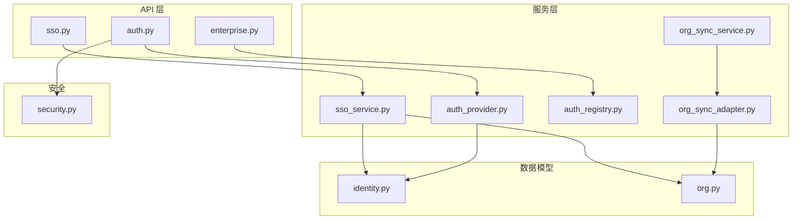
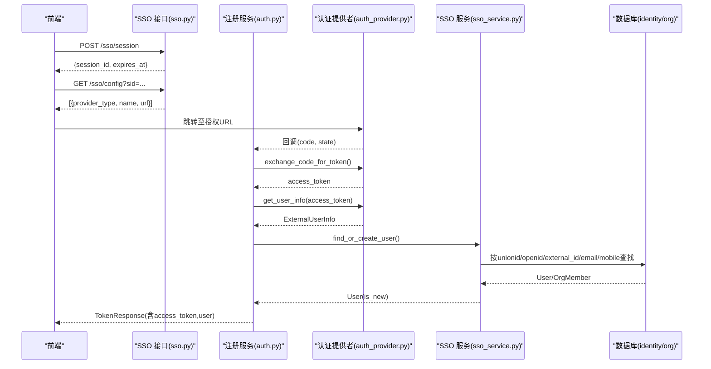
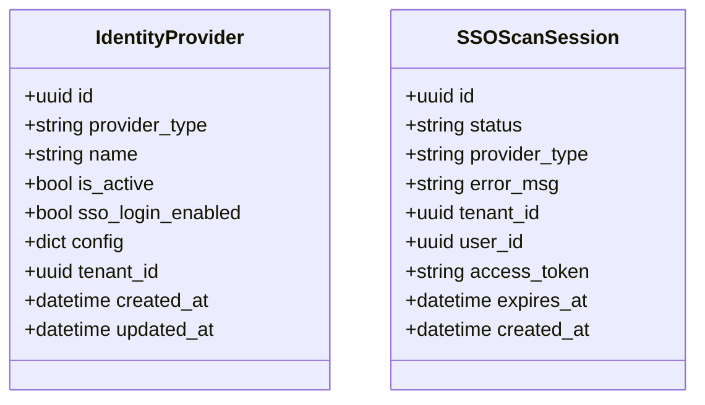
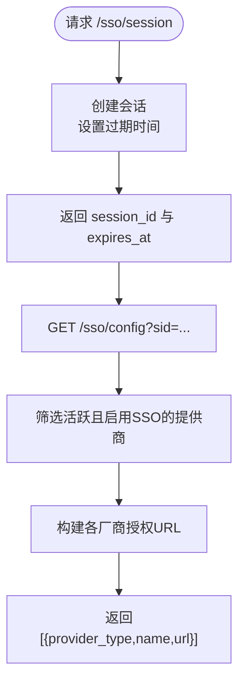
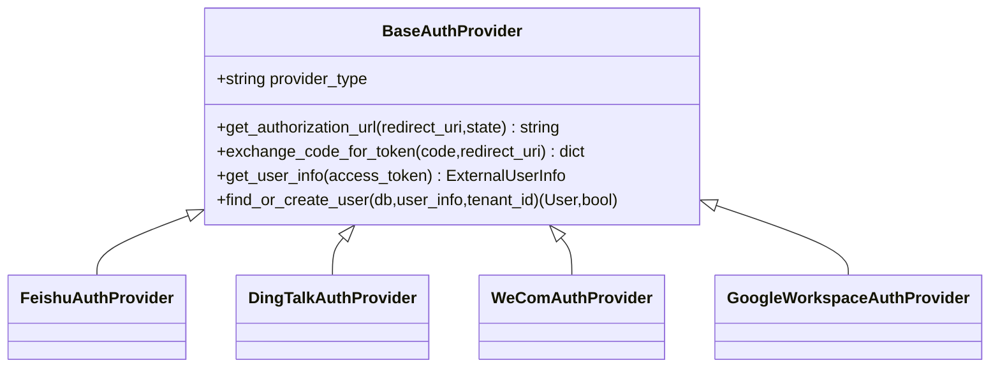
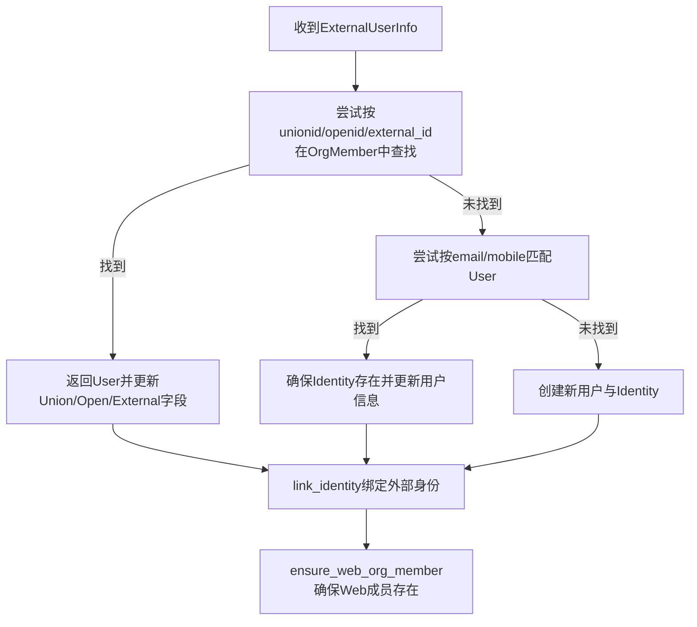
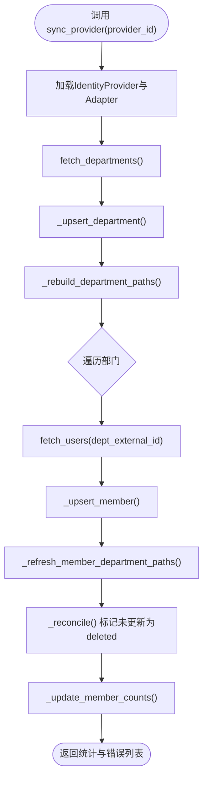
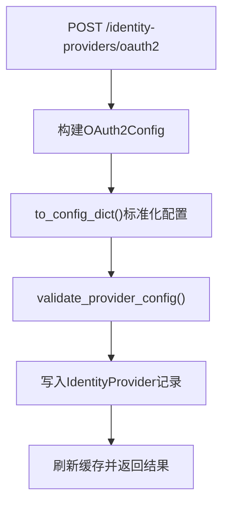
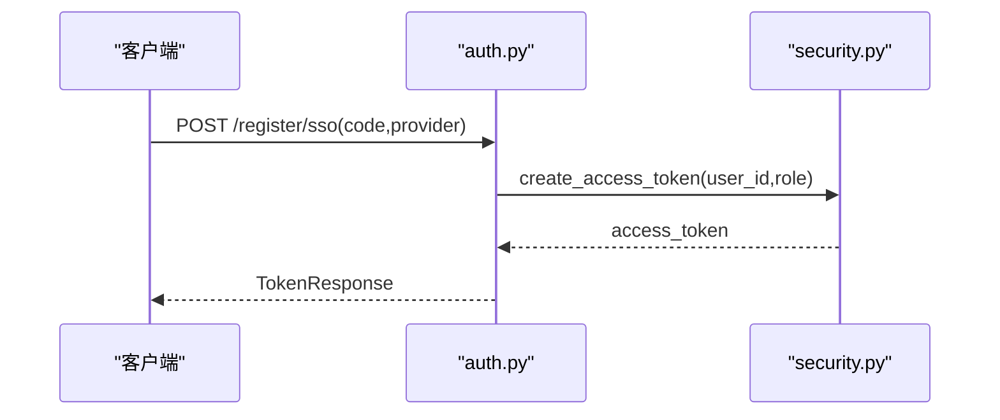
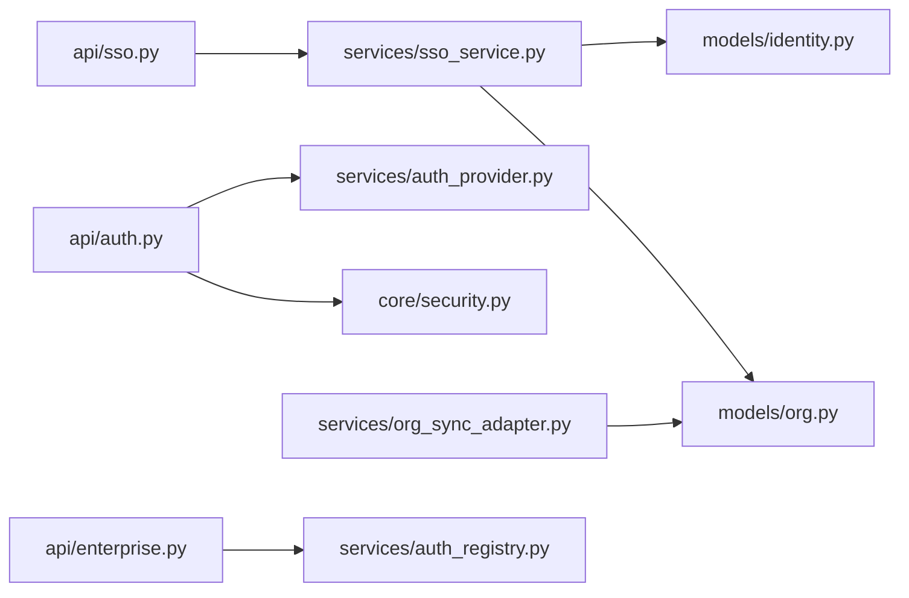

# SSO单点登录

<cite>
**本文引用的文件**   
- [backend/app/api/sso.py](file://backend/app/api/sso.py)
- [backend/app/services/sso_service.py](file://backend/app/services/sso_service.py)
- [backend/app/services/auth_provider.py](file://backend/app/services/auth_provider.py)
- [backend/app/services/auth_registry.py](file://backend/app/services/auth_registry.py)
- [backend/app/models/identity.py](file://backend/app/models/identity.py)
- [backend/app/models/org.py](file://backend/app/models/org.py)
- [backend/app/api/enterprise.py](file://backend/app/api/enterprise.py)
- [backend/app/services/org_sync_adapter.py](file://backend/app/services/org_sync_adapter.py)
- [backend/app/services/org_sync_service.py](file://backend/app/services/org_sync_service.py)
- [backend/app/core/security.py](file://backend/app/core/security.py)
- [backend/app/api/auth.py](file://backend/app/api/auth.py)
</cite>

## 目录
1. [简介](#简介)
2. [项目结构](#项目结构)
3. [核心组件](#核心组件)
4. [架构总览](#架构总览)
5. [详细组件分析](#详细组件分析)
6. [依赖关系分析](#依赖关系分析)
7. [性能考虑](#性能考虑)
8. [故障排查指南](#故障排查指南)
9. [结论](#结论)
10. [附录](#附录)

## 简介
本文件为 Clawith 的单点登录（SSO）集成系统提供完整的技术与使用文档。内容涵盖：
- 支持的协议与身份提供商：OAuth2、OpenID Connect，以及飞书、钉钉、企业微信、Google Workspace 等具体实现
- 身份提供商配置与管理（含 OAuth2 简化配置）
- 用户同步机制、属性映射、组（部门）同步策略
- LDAP/Active Directory 对接说明与扩展建议
- 常见身份提供商的配置要点与安全注意事项
- 安全配置、证书管理、会话管理等安全考量
- 如何扩展新的 SSO 协议与自定义身份提供商适配器

## 项目结构
后端围绕 FastAPI 路由与服务层组织 SSO 能力：
- API 层：sso.py、auth.py、enterprise.py 暴露 SSO 会话、注册、回调、身份提供商管理等接口
- 服务层：sso_service.py 负责用户匹配、租户关联、身份绑定；auth_provider.py 定义统一认证提供者抽象与各厂商实现；org_sync_adapter.py 与 org_sync_service.py 负责组织架构同步
- 数据模型：identity.py 存储 IdentityProvider、SSOScanSession；org.py 存储 OrgDepartment、OrgMember
- 安全：core/security.py 提供 JWT、密码哈希、访问令牌校验等

**图表来源** 
- [backend/app/api/sso.py:1-160](file://backend/app/api/sso.py#L1-L160)
- [backend/app/services/sso_service.py:1-576](file://backend/app/services/sso_service.py#L1-L576)
- [backend/app/services/auth_provider.py:1-800](file://backend/app/services/auth_provider.py#L1-L800)
- [backend/app/services/auth_registry.py:1-230](file://backend/app/services/auth_registry.py#L1-L230)
- [backend/app/models/identity.py:1-67](file://backend/app/models/identity.py#L1-L67)
- [backend/app/models/org.py:1-98](file://backend/app/models/org.py#L1-L98)
- [backend/app/core/security.py:1-227](file://backend/app/core/security.py#L1-L227)

**章节来源**
- [backend/app/api/sso.py:1-160](file://backend/app/api/sso.py#L1-L160)
- [backend/app/api/auth.py:1-800](file://backend/app/api/auth.py#L1-L800)
- [backend/app/api/enterprise.py:1243-1583](file://backend/app/api/enterprise.py#L1243-L1583)
- [backend/app/services/sso_service.py:1-576](file://backend/app/services/sso_service.py#L1-L576)
- [backend/app/services/auth_provider.py:1-800](file://backend/app/services/auth_provider.py#L1-L800)
- [backend/app/services/auth_registry.py:1-230](file://backend/app/services/auth_registry.py#L1-L230)
- [backend/app/models/identity.py:1-67](file://backend/app/models/identity.py#L1-L67)
- [backend/app/models/org.py:1-98](file://backend/app/models/org.py#L1-L98)
- [backend/app/core/security.py:1-227](file://backend/app/core/security.py#L1-L227)

## 核心组件
- 身份提供商模型与枚举：IdentityProvider、AuthProviderType、SSOScanSession
- SSO 会话与配置接口：创建扫描会话、获取可用提供商授权链接
- 统一认证提供者框架：BaseAuthProvider 及飞书、钉钉、企业微信、Google Workspace 等实现
- 用户匹配与租户关联：按邮箱/手机号/外部 ID 匹配用户，自动关联租户
- 组织架构同步：部门与成员同步、路径重建、成员计数聚合、软删除 reconcile
- 安全与令牌：JWT 生成与校验、密码哈希、角色权限控制

**章节来源**
- [backend/app/models/identity.py:1-67](file://backend/app/models/identity.py#L1-L67)
- [backend/app/api/sso.py:1-160](file://backend/app/api/sso.py#L1-L160)
- [backend/app/services/auth_provider.py:1-800](file://backend/app/services/auth_provider.py#L1-L800)
- [backend/app/services/sso_service.py:1-576](file://backend/app/services/sso_service.py#L1-L576)
- [backend/app/services/org_sync_adapter.py:1-800](file://backend/app/services/org_sync_adapter.py#L1-L800)
- [backend/app/core/security.py:1-227](file://backend/app/core/security.py#L1-L227)

## 架构总览
下图展示从前端发起 SSO 登录到用户落库的端到端流程，包括会话创建、授权链接获取、回调处理、用户匹配与绑定、以及 Web 成员保障。

**图表来源** 
- [backend/app/api/sso.py:1-160](file://backend/app/api/sso.py#L1-L160)
- [backend/app/api/auth.py:256-302](file://backend/app/api/auth.py#L256-L302)
- [backend/app/services/auth_provider.py:98-164](file://backend/app/services/auth_provider.py#L98-L164)
- [backend/app/services/sso_service.py:183-226](file://backend/app/services/sso_service.py#L183-L226)

## 详细组件分析

### 身份提供商模型与会话
- IdentityProvider：记录 provider_type、名称、是否启用、是否允许 SSO 登录、配置 JSON、租户隔离
- SSOScanSession：二维码扫码登录临时会话，包含状态、过期时间、token、用户上下文

**图表来源** 
- [backend/app/models/identity.py:26-67](file://backend/app/models/identity.py#L26-L67)

**章节来源**
- [backend/app/models/identity.py:1-67](file://backend/app/models/identity.py#L1-L67)

### SSO 会话与配置接口
- 创建 SSO 会话：返回 session_id 与过期时间
- 查询会话状态：轮询 authorized/completed/expired，成功后附带 access_token 与用户信息
- 获取可用 SSO 提供商：根据 session 的 tenant_id 过滤活跃且启用 SSO 登录的提供商，并生成各厂商授权 URL

**图表来源** 
- [backend/app/api/sso.py:16-159](file://backend/app/api/sso.py#L16-L159)

**章节来源**
- [backend/app/api/sso.py:1-160](file://backend/app/api/sso.py#L1-L160)

### 统一认证提供者框架与厂商实现
- BaseAuthProvider：定义授权 URL、换 token、取用户信息、find_or_create_user 等标准方法
- 厂商实现：
  - FeishuAuthProvider：飞书 OIDC
  - DingTalkAuthProvider：钉钉新 OAuth2
  - WeComAuthProvider：企业微信扫码登录与敏感字段获取
  - GoogleWorkspaceAuthProvider：Google Workspace SSO（支持管理员授权 scope）
- 注册表 AuthProviderRegistry：按 provider_type 与 tenant_id 缓存实例，避免重复构造

**图表来源** 
- [backend/app/services/auth_provider.py:44-164](file://backend/app/services/auth_provider.py#L44-L164)
- [backend/app/services/auth_provider.py:273-348](file://backend/app/services/auth_provider.py#L273-L348)
- [backend/app/services/auth_provider.py:350-433](file://backend/app/services/auth_provider.py#L350-L433)
- [backend/app/services/auth_provider.py:435-635](file://backend/app/services/auth_provider.py#L435-L635)
- [backend/app/services/auth_provider.py:637-756](file://backend/app/services/auth_provider.py#L637-L756)
- [backend/app/services/auth_registry.py:27-88](file://backend/app/services/auth_registry.py#L27-L88)

**章节来源**
- [backend/app/services/auth_provider.py:1-800](file://backend/app/services/auth_provider.py#L1-L800)
- [backend/app/services/auth_registry.py:1-230](file://backend/app/services/auth_registry.py#L1-L230)

### 用户匹配、租户关联与身份绑定
- match_user_by_email/match_user_by_mobile：优先通过 Identity 关联 User，再回退到 Identity 匹配
- auto_associate_tenant：基于邮箱域名或租户名模糊匹配
- resolve_user_identity：通过 OrgMember 的 unionid/openid/external_id 解析用户
- link_identity：将外部身份与平台用户绑定，必要时创建 OrgMember shell，并被动填充头像/邮箱/手机等

**图表来源** 
- [backend/app/services/sso_service.py:28-83](file://backend/app/services/sso_service.py#L28-L83)
- [backend/app/services/sso_service.py:183-226](file://backend/app/services/sso_service.py#L183-L226)
- [backend/app/services/sso_service.py:328-445](file://backend/app/services/sso_service.py#L328-L445)
- [backend/app/services/auth_provider.py:98-164](file://backend/app/services/auth_provider.py#L98-L164)

**章节来源**
- [backend/app/services/sso_service.py:1-576](file://backend/app/services/sso_service.py#L1-L576)
- [backend/app/services/auth_provider.py:98-164](file://backend/app/services/auth_provider.py#L98-L164)

### 组织架构同步（部门与成员）
- BaseOrgSyncAdapter：统一的 sync_org_structure 流程，包含部门 upsert、成员 upsert、路径重建、reconcile（标记未更新的为 deleted）、成员计数聚合
- 厂商适配：FeishuOrgSyncAdapter、GoogleWorkspaceOrgSyncAdapter 等
- OrgSyncService：按 provider_id 触发同步，加载对应 adapter 并执行

**图表来源** 
- [backend/app/services/org_sync_adapter.py:232-329](file://backend/app/services/org_sync_adapter.py#L232-L329)
- [backend/app/services/org_sync_adapter.py:453-518](file://backend/app/services/org_sync_adapter.py#L453-L518)
- [backend/app/services/org_sync_adapter.py:539-680](file://backend/app/services/org_sync_adapter.py#L539-L680)
- [backend/app/services/org_sync_adapter.py:331-416](file://backend/app/services/org_sync_adapter.py#L331-L416)
- [backend/app/services/org_sync_service.py:11-48](file://backend/app/services/org_sync_service.py#L11-L48)

**章节来源**
- [backend/app/services/org_sync_adapter.py:1-800](file://backend/app/services/org_sync_adapter.py#L1-L800)
- [backend/app/services/org_sync_service.py:1-49](file://backend/app/services/org_sync_service.py#L1-L49)

### 身份提供商配置管理（含 OAuth2 简化配置）
- enterprise.py 提供创建/更新/删除 IdentityProvider 的接口
- OAuth2Config：以 app_id/app_secret/authorize_url/token_url/user_info_url/scope 友好字段创建 OAuth2 提供商，内部转换为兼容命名
- sso_login_enabled：开启后该提供商可用于 SSO 登录；IP 模式下仅允许一个租户启用 SSO

**图表来源** 
- [backend/app/api/enterprise.py:1243-1281](file://backend/app/api/enterprise.py#L1243-L1281)
- [backend/app/api/enterprise.py:1407-1456](file://backend/app/api/enterprise.py#L1407-L1456)
- [backend/app/api/enterprise.py:1540-1583](file://backend/app/services/auth_registry.py#L1540-L1583)

**章节来源**
- [backend/app/api/enterprise.py:1243-1583](file://backend/app/api/enterprise.py#L1243-L1583)

### 安全与令牌管理
- security.py 提供 JWT 生成/解码、密码哈希、角色检查依赖
- 登录成功返回 access_token，后续请求携带 Bearer 令牌进行鉴权
- 支持多租户切换时重定向并携带 token

**图表来源** 
- [backend/app/api/auth.py:256-302](file://backend/app/api/auth.py#L256-L302)
- [backend/app/core/security.py:128-151](file://backend/app/core/security.py#L128-L151)

**章节来源**
- [backend/app/core/security.py:1-227](file://backend/app/core/security.py#L1-L227)
- [backend/app/api/auth.py:1-800](file://backend/app/api/auth.py#L1-L800)

## 依赖关系分析
- API 层依赖服务层：sso.py -> sso_service.py；auth.py -> auth_provider.py；enterprise.py -> auth_registry.py
- 服务层依赖数据模型：sso_service.py -> identity.py、org.py；org_sync_adapter.py -> org.py
- 安全模块被认证流程广泛使用

**图表来源** 
- [backend/app/api/sso.py:1-160](file://backend/app/api/sso.py#L1-L160)
- [backend/app/api/auth.py:1-800](file://backend/app/api/auth.py#L1-L800)
- [backend/app/api/enterprise.py:1243-1583](file://backend/app/api/enterprise.py#L1243-L1583)
- [backend/app/services/sso_service.py:1-576](file://backend/app/services/sso_service.py#L1-L576)
- [backend/app/services/auth_provider.py:1-800](file://backend/app/services/auth_provider.py#L1-L800)
- [backend/app/services/auth_registry.py:1-230](file://backend/app/services/auth_registry.py#L1-L230)
- [backend/app/models/identity.py:1-67](file://backend/app/models/identity.py#L1-L67)
- [backend/app/models/org.py:1-98](file://backend/app/models/org.py#L1-L98)
- [backend/app/core/security.py:1-227](file://backend/app/core/security.py#L1-L227)

**章节来源**
- [backend/app/api/sso.py:1-160](file://backend/app/api/sso.py#L1-L160)
- [backend/app/api/auth.py:1-800](file://backend/app/api/auth.py#L1-L800)
- [backend/app/api/enterprise.py:1243-1583](file://backend/app/api/enterprise.py#L1243-L1583)
- [backend/app/services/sso_service.py:1-576](file://backend/app/services/sso_service.py#L1-L576)
- [backend/app/services/auth_provider.py:1-800](file://backend/app/services/auth_provider.py#L1-L800)
- [backend/app/services/auth_registry.py:1-230](file://backend/app/services/auth_registry.py#L1-L230)
- [backend/app/models/identity.py:1-67](file://backend/app/models/identity.py#L1-L67)
- [backend/app/models/org.py:1-98](file://backend/app/models/org.py#L1-L98)
- [backend/app/core/security.py:1-227](file://backend/app/core/security.py#L1-L227)

## 性能考虑
- 组织同步采用批量 upsert 与子事务隔离，减少锁竞争与失败影响范围
- 成员计数聚合通过 SQL 子查询与递归计算，避免 N+1 查询
- 认证提供者实例通过注册表缓存，降低频繁构造开销
- JWT 密码哈希使用线程池异步执行，避免阻塞事件循环

[本节为通用指导，不直接分析具体文件]

## 故障排查指南
- SSO 登录失败
  - 检查回调地址与授权 URL 是否正确生成（参考 sso.py 中的回调拼接逻辑）
  - 确认提供商已启用 sso_login_enabled 且处于活跃状态
  - 查看日志中关于 scope 缺失或权限不足的错误（如钉钉 Contact.User.Read）
- 用户无法匹配
  - 核对 unionid/openid/external_id 是否一致；检查 OrgMember 是否存在
  - 若通过 email/mobile 匹配，确认 Identity 与 User 的关联关系
- 组织同步异常
  - 检查 adapter 的 fetch_departments/fetch_users 是否返回有效数据
  - 查看 reconcile 是否将未更新记录标记为 deleted
  - 关注 member_count 聚合是否正确更新
- 安全相关
  - 确认 JWT 密钥与算法配置正确
  - 检查 IP 白名单与回调域配置是否符合厂商要求（如企业微信需 IP 白名单）

**章节来源**
- [backend/app/api/sso.py:1-160](file://backend/app/api/sso.py#L1-L160)
- [backend/app/services/auth_provider.py:350-433](file://backend/app/services/auth_provider.py#L350-L433)
- [backend/app/services/org_sync_adapter.py:232-329](file://backend/app/services/org_sync_adapter.py#L232-L329)
- [backend/app/core/security.py:128-151](file://backend/app/core/security.py#L128-L151)

## 结论
Clawith 的 SSO 体系以统一抽象为核心，结合灵活的租户隔离与丰富的厂商实现，提供了可扩展、可维护的企业级单点登录能力。通过标准化的用户匹配与身份绑定流程，以及与组织架构同步的无缝衔接，既满足即时登录体验，又保证组织数据的准确性与一致性。安全层面通过 JWT、密码哈希与严格的权限控制，确保整体链路的安全可靠。

[本节为总结性内容，不直接分析具体文件]

## 附录

### 支持的协议与身份提供商
- 协议：OAuth2、OpenID Connect
- 厂商实现：飞书、钉钉、企业微信、Google Workspace、Google、GitHub、Microsoft Teams（预留）

**章节来源**
- [backend/app/models/identity.py:14-24](file://backend/app/models/identity.py#L14-L24)
- [backend/app/services/auth_provider.py:273-756](file://backend/app/services/auth_provider.py#L273-L756)

### 身份提供商配置要点
- OAuth2 简化配置：app_id/app_secret/authorize_url/token_url/user_info_url/scope
- Google Workspace：支持管理员授权 scope，用于组织同步与 SSO
- 企业微信：需配置 corp_id、agent_id，敏感字段需 user_ticket 与 IP 白名单
- 钉钉：需包含 Contact.User.Read 等必要 scope

**章节来源**
- [backend/app/api/enterprise.py:1243-1281](file://backend/app/api/enterprise.py#L1243-L1281)
- [backend/app/services/auth_provider.py:637-756](file://backend/app/services/auth_provider.py#L637-L756)
- [backend/app/services/auth_provider.py:435-635](file://backend/app/services/auth_provider.py#L435-L635)
- [backend/app/services/auth_provider.py:350-433](file://backend/app/services/auth_provider.py#L350-L433)

### 用户同步与属性映射
- 外部标识：unionid/openid/external_id 作为唯一键
- 属性映射：name、email、avatar_url、mobile 等字段在首次登录或同步时填充
- 部门路径：基于内部部门树重建 path，成员 department_path 随之更新

**章节来源**
- [backend/app/services/sso_service.py:235-301](file://backend/app/services/sso_service.py#L235-L301)
- [backend/app/services/org_sync_adapter.py:507-518](file://backend/app/services/org_sync_adapter.py#L507-L518)
- [backend/app/services/org_sync_adapter.py:520-538](file://backend/app/services/org_sync_adapter.py#L520-L538)

### LDAP/Active Directory 对接建议
- 当前代码未内置 LDAP/AD 适配器，可通过以下方式扩展：
  - 新增 Provider Type 与 Adapter：参照 org_sync_adapter.py 的 BaseOrgSyncAdapter 实现 fetch_departments/fetch_users
  - 新增 Auth Provider：参照 auth_provider.py 的 BaseAuthProvider 实现 OAuth2/OIDC 或 LDAP 直连
  - 在 registry 中注册新类型，并在 enterprise.py 中增加相应配置入口

[本节为概念性扩展建议，不直接分析具体文件]

### 安全配置与证书管理
- JWT：使用强密钥与合适算法，合理设置过期时间
- 密码哈希：bcrypt 异步执行，避免阻塞
- 回调域与 IP 白名单：按厂商要求配置（企业微信需 IP 白名单）
- 敏感字段：user_ticket 等临时凭证仅在需要时获取，避免长期保存

**章节来源**
- [backend/app/core/security.py:128-151](file://backend/app/core/security.py#L128-L151)
- [backend/app/services/auth_provider.py:435-635](file://backend/app/services/auth_provider.py#L435-L635)

### 会话管理与多租户切换
- SSO 会话：短生命周期，扫码登录后一次性返回 token 与用户信息
- 多租户切换：支持返回 redirect_url 并携带 token，便于跨域切换

**章节来源**
- [backend/app/api/sso.py:32-71](file://backend/app/api/sso.py#L32-L71)
- [backend/app/api/auth.py:748-792](file://backend/app/api/auth.py#L748-L792)