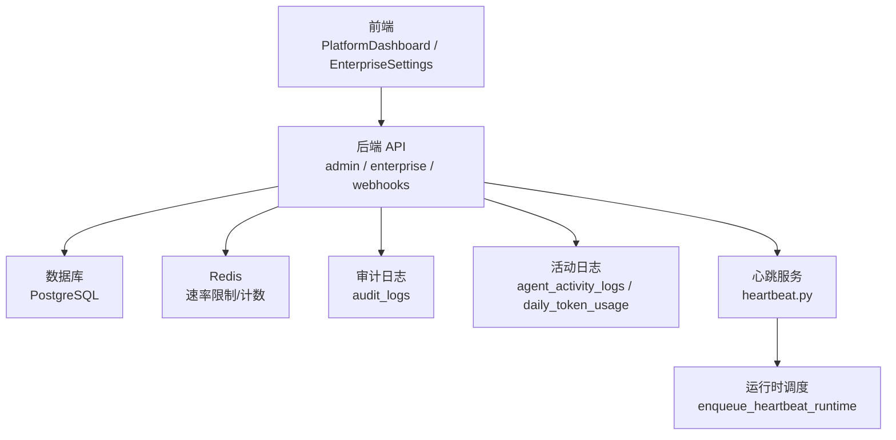
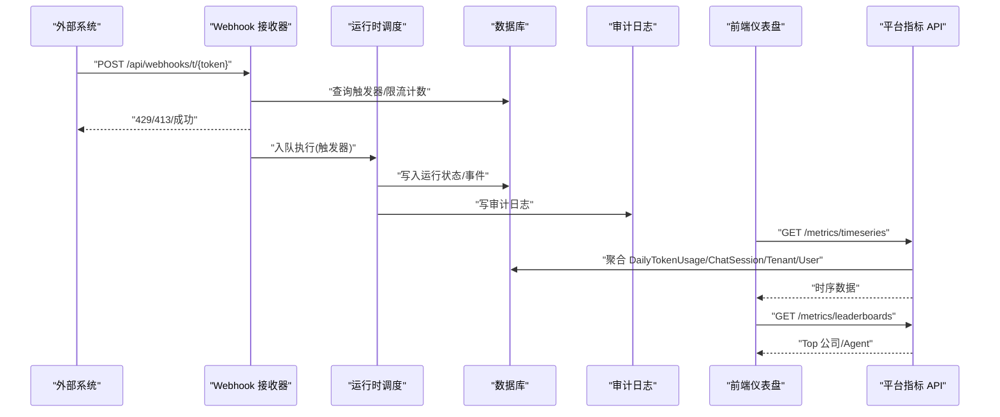
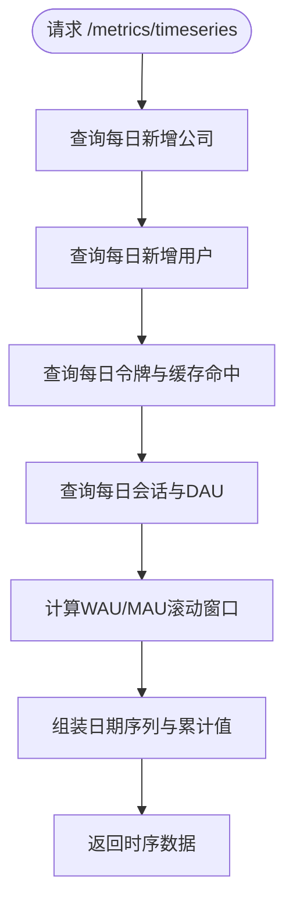
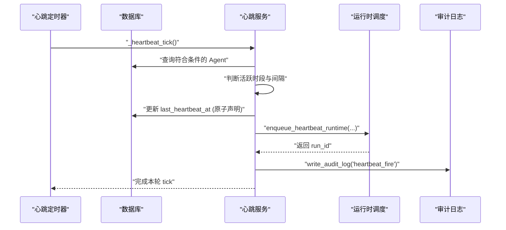
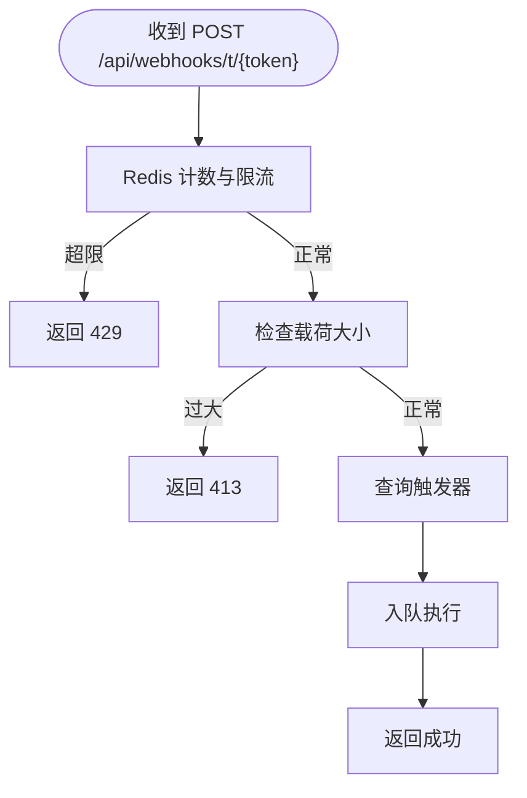
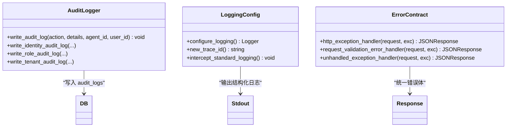
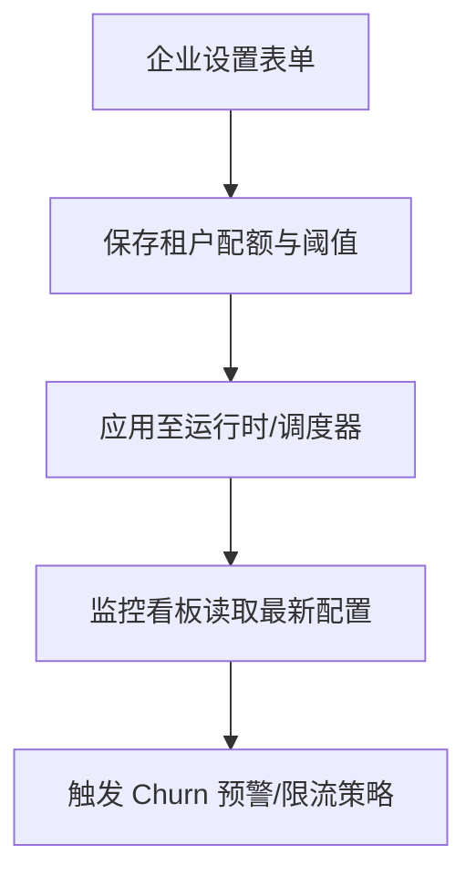
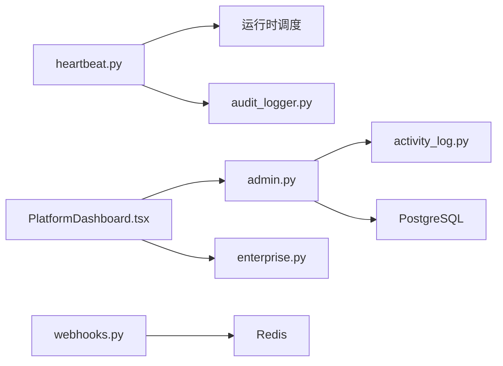

# 企业监控告警

<cite>
**本文引用的文件**   
- [backend/app/core/logging_config.py](file://backend/app/core/logging_config.py)
- [backend/app/services/heartbeat.py](file://backend/app/services/heartbeat.py)
- [backend/app/api/admin.py](file://backend/app/api/admin.py)
- [backend/app/models/activity_log.py](file://backend/app/models/activity_log.py)
- [backend/app/services/audit_logger.py](file://backend/app/services/audit_logger.py)
- [backend/app/api/webhooks.py](file://backend/app/api/webhooks.py)
- [backend/app/api/enterprise.py](file://backend/app/api/enterprise.py)
- [frontend/src/pages/PlatformDashboard.tsx](file://frontend/src/pages/PlatformDashboard.tsx)
- [frontend/src/pages/EnterpriseSettings.tsx](file://frontend/src/pages/EnterpriseSettings.tsx)
- [backend/app/core/error_contract.py](file://backend/app/core/error_contract.py)
</cite>

## 目录
1. [简介](#简介)
2. [项目结构](#项目结构)
3. [核心组件](#核心组件)
4. [架构总览](#架构总览)
5. [详细组件分析](#详细组件分析)
6. [依赖关系分析](#依赖关系分析)
7. [性能考量](#性能考量)
8. [故障排查指南](#故障排查指南)
9. [结论](#结论)
10. [附录](#附录)

## 简介
本文件为 Clawith 企业监控告警系统的权威文档，面向平台管理员与运维工程师。内容覆盖：
- 监控指标体系：平台级时序指标、令牌用量、会话与活跃度（DAU/WAU/MAU）、Churn 预警等
- 告警规则配置：心跳触发、Webhook 速率限制、系统健康检查、错误追踪
- 通知渠道管理：审计日志、后台任务通知、企业设置中的配额与阈值
- 健康监控与性能采集：服务可用性探测、延迟统计、缓存命中率
- 日志聚合与错误追踪：统一日志格式、Trace ID、结构化错误体
- 可视化与报表：平台仪表盘、排行榜、趋势图、审计日志浏览
- 扩展能力：新增指标、自定义告警规则、接入第三方监控系统（如 Grafana）

## 项目结构
后端以 FastAPI 为核心，提供监控指标 API、审计日志、Webhook 接收、企业级配置；前端通过平台仪表盘与企业设置页展示指标与审计记录。关键路径：
- 指标与时序数据：admin 接口聚合 DailyTokenUsage、ChatSession、Tenant、User 等模型
- 心跳与后台任务：heartbeat 服务周期性扫描并触发 Agent 运行
- 审计日志：audit_logger 写入 audit_logs，前端 EnterpriseSettings 展示
- Webhook 集成：webhooks 端点对外暴露，支持速率限制与签名校验
- 错误与可观测性：error_contract 统一错误体，logging_config 统一日志格式与 Trace ID

**图表来源**
- [backend/app/api/admin.py:212-411](file://backend/app/api/admin.py#L212-L411)
- [backend/app/api/enterprise.py:668-691](file://backend/app/api/enterprise.py#L668-L691)
- [backend/app/api/webhooks.py:1-79](file://backend/app/api/webhooks.py#L1-L79)
- [backend/app/services/heartbeat.py:185-350](file://backend/app/services/heartbeat.py#L185-L350)
- [backend/app/models/activity_log.py:1-57](file://backend/app/models/activity_log.py#L1-L57)
- [backend/app/services/audit_logger.py:178-215](file://backend/app/services/audit_logger.py#L178-L215)

**章节来源**
- [backend/app/api/admin.py:212-411](file://backend/app/api/admin.py#L212-L411)
- [backend/app/api/enterprise.py:668-691](file://backend/app/api/enterprise.py#L668-L691)
- [backend/app/api/webhooks.py:1-79](file://backend/app/api/webhooks.py#L1-L79)
- [backend/app/services/heartbeat.py:185-350](file://backend/app/services/heartbeat.py#L185-L350)
- [backend/app/models/activity_log.py:1-57](file://backend/app/models/activity_log.py#L1-L57)
- [backend/app/services/audit_logger.py:178-215](file://backend/app/services/audit_logger.py#L178-L215)

## 核心组件
- 平台指标时序 API：按日聚合公司、用户、令牌、会话、DAU/WAU/MAU 等指标，供前端折线图使用
- 心跳服务：定时扫描满足条件的 Agent，构造指令与上下文，入队运行时执行，并写审计日志
- 审计日志服务：后台任务安全写入 audit_logs，避免 ORM 外键解析问题
- Webhook 接收器：外部事件入口，具备速率限制、载荷大小限制、签名校验
- 统一日志与 Trace ID：loguru 配置输出带 trace_id 的结构化日志，屏蔽噪音日志
- 错误契约：HTTP 异常统一封装，返回包含 code、message、trace_id、retryable 的标准错误体

**章节来源**
- [backend/app/api/admin.py:212-411](file://backend/app/api/admin.py#L212-L411)
- [backend/app/services/heartbeat.py:185-350](file://backend/app/services/heartbeat.py#L185-L350)
- [backend/app/services/audit_logger.py:178-215](file://backend/app/services/audit_logger.py#L178-L215)
- [backend/app/api/webhooks.py:1-79](file://backend/app/api/webhooks.py#L1-L79)
- [backend/app/core/logging_config.py:61-79](file://backend/app/core/logging_config.py#L61-L79)
- [backend/app/core/error_contract.py:158-228](file://backend/app/core/error_contract.py#L158-L228)

## 架构总览
下图展示了从外部事件到指标采集、审计记录与前端可视化的完整链路。

**图表来源**
- [backend/app/api/webhooks.py:1-79](file://backend/app/api/webhooks.py#L1-L79)
- [backend/app/api/admin.py:212-411](file://backend/app/api/admin.py#L212-L411)
- [backend/app/services/audit_logger.py:178-215](file://backend/app/services/audit_logger.py#L178-L215)

## 详细组件分析

### 平台指标与时序采集
- 指标范围
  - 每日新增公司、用户、会话
  - 每日令牌消耗与缓存命中（tokens_used、cache_read_tokens）
  - DAU/WAU/MAU 滚动窗口统计
  - 累计总量与比率（缓存命中率）
- 数据来源
  - DailyTokenUsage：按天聚合的令牌用量
  - ChatSession：会话创建时间与用户去重
  - Tenant/User：注册与活跃统计
- 前端展示
  - PlatformDashboard 拉取时序与排行榜，渲染折线图与表格

**图表来源**
- [backend/app/api/admin.py:212-411](file://backend/app/api/admin.py#L212-L411)
- [backend/app/models/activity_log.py:35-57](file://backend/app/models/activity_log.py#L35-L57)

**章节来源**
- [backend/app/api/admin.py:212-411](file://backend/app/api/admin.py#L212-L411)
- [frontend/src/pages/PlatformDashboard.tsx:159-184](file://frontend/src/pages/PlatformDashboard.tsx#L159-L184)
- [backend/app/models/activity_log.py:35-57](file://backend/app/models/activity_log.py#L35-L57)

### 心跳监控与自动巡检
- 功能要点
  - 每 60 秒扫描启用了心跳且处于 running/idle 状态的 Agent
  - 基于活跃时段与间隔策略决定是否触发
  - 构建指令与上下文（最近活动、未读通知），入队运行时执行
  - 记录 heartbeat_fire/heartbeat_tick/heartbeat_error 审计日志
- 配置项
  - heartbeat_enabled、heartbeat_interval_minutes、heartbeat_active_hours
  - 租户时区与过期控制

**图表来源**
- [backend/app/services/heartbeat.py:185-350](file://backend/app/services/heartbeat.py#L185-L350)
- [backend/app/services/audit_logger.py:178-215](file://backend/app/services/audit_logger.py#L178-L215)

**章节来源**
- [backend/app/services/heartbeat.py:185-350](file://backend/app/services/heartbeat.py#L185-L350)
- [backend/app/services/audit_logger.py:178-215](file://backend/app/services/audit_logger.py#L178-L215)

### Webhook 监控与速率限制
- 安全与限流
  - 每 token 每分钟最多 5 次（全局硬上限 60/min）
  - 最大载荷 64KB
  - 可选 HMAC 签名校验（由调用方实现）
- 处理流程
  - 记录命中次数（Redis ZSET）
  - 查找已启用触发器并路由执行
  - 失败或超限返回相应状态码

**图表来源**
- [backend/app/api/webhooks.py:1-79](file://backend/app/api/webhooks.py#L1-L79)

**章节来源**
- [backend/app/api/webhooks.py:1-79](file://backend/app/api/webhooks.py#L1-L79)

### 审计日志与错误追踪
- 审计日志
  - 后台任务通过 write_audit_log 写入 audit_logs，字段包括 action、details、agent_id、user_id、created_at
  - 前端 EnterpriseSettings 提供过滤（后台动作 vs 其他动作）与分页展示
- 错误追踪
  - error_contract 将 HTTP 异常统一为结构化错误体，包含 code、message、trace_id、retryable
  - logging_config 注入 trace_id 并屏蔽噪音日志，便于跨服务关联

**图表来源**
- [backend/app/services/audit_logger.py:178-215](file://backend/app/services/audit_logger.py#L178-L215)
- [backend/app/core/logging_config.py:61-79](file://backend/app/core/logging_config.py#L61-L79)
- [backend/app/core/error_contract.py:158-228](file://backend/app/core/error_contract.py#L158-L228)

**章节来源**
- [backend/app/services/audit_logger.py:178-215](file://backend/app/services/audit_logger.py#L178-L215)
- [backend/app/core/logging_config.py:61-79](file://backend/app/core/logging_config.py#L61-L79)
- [backend/app/core/error_contract.py:158-228](file://backend/app/core/error_contract.py#L158-L228)
- [frontend/src/pages/EnterpriseSettings.tsx:427-541](file://frontend/src/pages/EnterpriseSettings.tsx#L427-L541)

### 企业级配置与阈值管理
- 企业设置中可配置
  - 默认最大触发器数量、最小轮询间隔下限、Webhook 速率上限
  - 心跳相关参数（interval、active hours）
- 看板增强
  - Churn 预警：消费超过阈值但长时间无活动的租户列表
  - 排行榜：Top 公司与 Top Agent 令牌消耗

**图表来源**
- [backend/app/api/enterprise.py:814-847](file://backend/app/api/enterprise.py#L814-L847)
- [backend/app/api/admin.py:530-572](file://backend/app/api/admin.py#L530-L572)

**章节来源**
- [backend/app/api/enterprise.py:814-847](file://backend/app/api/enterprise.py#L814-L847)
- [backend/app/api/admin.py:530-572](file://backend/app/api/admin.py#L530-L572)
- [frontend/src/pages/PlatformDashboard.tsx:349-371](file://frontend/src/pages/PlatformDashboard.tsx#L349-L371)

## 依赖关系分析
- 模块耦合
  - admin 接口强依赖 activity_log 模型与数据库聚合函数
  - heartbeat 服务依赖运行时调度与审计日志
  - webhooks 依赖 Redis 进行速率限制
  - 前端 Dashboard/EnterpriseSettings 依赖后端 API 获取数据
- 潜在循环依赖
  - 通过延迟导入与异步会话避免启动期循环依赖
- 外部依赖
  - PostgreSQL、Redis、loguru、FastAPI、SQLAlchemy

**图表来源**
- [backend/app/api/admin.py:212-411](file://backend/app/api/admin.py#L212-L411)
- [backend/app/services/heartbeat.py:185-350](file://backend/app/services/heartbeat.py#L185-L350)
- [backend/app/api/webhooks.py:1-79](file://backend/app/api/webhooks.py#L1-L79)
- [frontend/src/pages/PlatformDashboard.tsx:159-184](file://frontend/src/pages/PlatformDashboard.tsx#L159-L184)

**章节来源**
- [backend/app/api/admin.py:212-411](file://backend/app/api/admin.py#L212-L411)
- [backend/app/services/heartbeat.py:185-350](file://backend/app/services/heartbeat.py#L185-L350)
- [backend/app/api/webhooks.py:1-79](file://backend/app/api/webhooks.py#L1-L79)
- [frontend/src/pages/PlatformDashboard.tsx:159-184](file://frontend/src/pages/PlatformDashboard.tsx#L159-L184)

## 性能考量
- 指标查询优化
  - 使用 SQL 窗口函数计算 WAU/MAU，减少多次往返
  - 对常用字段建立索引（tenant_id、agent_id、date、created_at）
- 心跳与审计
  - 原子声明避免重复触发；审计写入采用原始 SQL 提升吞吐
- Webhook 限流
  - Redis ZSET 滑动窗口计数，O(log N) 插入与清理
- 日志与错误
  - loguru 异步队列输出，避免阻塞主线程；统一错误体减少调试成本

[本节为通用指导，不直接分析具体文件]

## 故障排查指南
- 常见问题定位
  - 心跳未触发：检查 heartbeat_enabled、interval、active_hours、租户时区与过期时间
  - Webhook 被限流：确认 token 频率与全局上限；检查载荷大小与签名
  - 指标缺失：核对 DailyTokenUsage 是否按时聚合；检查 ChatSession/Tenant/User 数据源
  - 审计日志缺失：查看 audit_logger 写入异常；确认数据库权限
- 错误追踪
  - 使用 trace_id 串联请求与日志；在 error_contract 的错误体中定位 stage 与 retryable
  - 前端控制台与后端日志结合，快速复现问题

**章节来源**
- [backend/app/services/heartbeat.py:185-350](file://backend/app/services/heartbeat.py#L185-L350)
- [backend/app/api/webhooks.py:1-79](file://backend/app/api/webhooks.py#L1-L79)
- [backend/app/core/error_contract.py:158-228](file://backend/app/core/error_contract.py#L158-L228)
- [backend/app/core/logging_config.py:61-79](file://backend/app/core/logging_config.py#L61-L79)

## 结论
Clawith 的企业监控告警体系以“指标采集—审计记录—可视化展示”为主线，结合心跳巡检与 Webhook 集成，形成闭环的可观测性与自动化响应能力。通过统一的日志与错误契约，提升了排障效率与系统稳定性。建议在生产环境持续完善指标维度、细化告警阈值，并对接外部监控系统（如 Prometheus/Grafana）以实现更强大的趋势分析与容量规划。

[本节为总结，不直接分析具体文件]

## 附录
- 扩展监控指标
  - 新增 DailyTokenUsage 类似表，定义唯一约束与聚合逻辑
  - 在 admin 接口增加新的聚合查询，并在前端 Dashboard 展示
- 自定义告警规则
  - 在 heartbeat 或独立调度器中增加条件判断，触发通知或降级策略
  - 使用 audit_logger 记录规则命中与结果
- 集成第三方监控系统
  - 暴露 /metrics/prometheus 端点（OpenMetrics 格式）
  - 将 Redis 计数与数据库聚合结果导出至 Prometheus，Grafana 可视化

[本节为概念性内容，不直接分析具体文件]