# 企业级功能

<cite>
**本文引用的文件**   
- [backend/app/models/tenant.py](file://backend/app/models/tenant.py)
- [backend/app/models/user.py](file://backend/app/models/user.py)
- [backend/app/models/org.py](file://backend/app/models/org.py)
- [backend/app/models/audit.py](file://backend/app/models/audit.py)
- [backend/app/models/identity.py](file://backend/app/models/identity.py)
- [backend/app/core/permissions.py](file://backend/app/core/permissions.py)
- [backend/app/services/quota_guard.py](file://backend/app/services/quota_guard.py)
- [backend/app/services/sso_service.py](file://backend/app/services/sso_service.py)
- [backend/app/api/sso.py](file://backend/app/api/sso.py)
- [backend/app/services/org_sync_service.py](file://backend/app/services/org_sync_service.py)
- [backend/app/services/org_sync_adapter.py](file://backend/app/services/org_sync_adapter.py)
- [backend/app/services/enterprise_sync.py](file://backend/app/services/enterprise_sync.py)
- [backend/app/api/enterprise.py](file://backend/app/api/enterprise.py)
- [backend/app/services/audit_logger.py](file://backend/app/services/audit_logger.py)
- [backend/app/core/security.py](file://backend/app/core/security.py)
</cite>

## 目录
1. [简介](#简介)
2. [项目结构](#项目结构)
3. [核心组件](#核心组件)
4. [架构总览](#架构总览)
5. [详细组件分析](#详细组件分析)
6. [依赖关系分析](#依赖关系分析)
7. [性能与可扩展性](#性能与可扩展性)
8. [故障排查指南](#故障排查指南)
9. [结论](#结论)
10. [附录：配置与合规清单](#附录配置与合规清单)

## 简介
本文件面向Clawith的企业级能力，系统性阐述多租户隔离、RBAC权限模型、审计日志、使用配额管理、审批工作流、组织架构同步、SSO/LDAP与企业目录集成等关键特性。同时提供安全配置建议、合规要求、监控告警、性能优化与灾难恢复实践，以及扩展权限模型与集成现有企业系统的指导。

## 项目结构
后端采用FastAPI路由+服务层+数据模型的典型分层：
- 路由层：企业功能API（如企业设置、LLM池、审批、审计）集中在 enterprise.py；SSO入口在 sso.py
- 服务层：SSO服务、组织同步、企业信息发布、配额守卫、审计写入等
- 模型层：租户、用户、身份提供者、组织部门/成员、审计日志、企业信息等
- 核心工具：权限判定、安全认证与加密

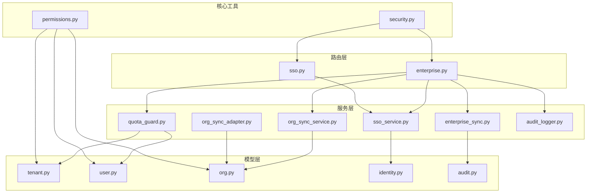

**图表来源** 
- [backend/app/api/enterprise.py](file://backend/app/api/enterprise.py)
- [backend/app/api/sso.py](file://backend/app/api/sso.py)
- [backend/app/services/sso_service.py](file://backend/app/services/sso_service.py)
- [backend/app/services/org_sync_service.py](file://backend/app/services/org_sync_service.py)
- [backend/app/services/org_sync_adapter.py](file://backend/app/services/org_sync_adapter.py)
- [backend/app/services/enterprise_sync.py](file://backend/app/services/enterprise_sync.py)
- [backend/app/services/quota_guard.py](file://backend/app/services/quota_guard.py)
- [backend/app/services/audit_logger.py](file://backend/app/services/audit_logger.py)
- [backend/app/models/tenant.py](file://backend/app/models/tenant.py)
- [backend/app/models/user.py](file://backend/app/models/user.py)
- [backend/app/models/org.py](file://backend/app/models/org.py)
- [backend/app/models/identity.py](file://backend/app/models/identity.py)
- [backend/app/models/audit.py](file://backend/app/models/audit.py)
- [backend/app/core/permissions.py](file://backend/app/core/permissions.py)
- [backend/app/core/security.py](file://backend/app/core/security.py)

**章节来源**
- [backend/app/api/enterprise.py](file://backend/app/api/enterprise.py)
- [backend/app/api/sso.py](file://backend/app/api/sso.py)
- [backend/app/services/sso_service.py](file://backend/app/services/sso_service.py)
- [backend/app/services/org_sync_service.py](file://backend/app/services/org_sync_service.py)
- [backend/app/services/org_sync_adapter.py](file://backend/app/services/org_sync_adapter.py)
- [backend/app/services/enterprise_sync.py](file://backend/app/services/enterprise_sync.py)
- [backend/app/services/quota_guard.py](file://backend/app/services/quota_guard.py)
- [backend/app/services/audit_logger.py](file://backend/app/services/audit_logger.py)
- [backend/app/models/tenant.py](file://backend/app/models/tenant.py)
- [backend/app/models/user.py](file://backend/app/models/user.py)
- [backend/app/models/org.py](file://backend/app/models/org.py)
- [backend/app/models/identity.py](file://backend/app/models/identity.py)
- [backend/app/models/audit.py](file://backend/app/models/audit.py)
- [backend/app/core/permissions.py](file://backend/app/core/permissions.py)
- [backend/app/core/security.py](file://backend/app/core/security.py)

## 核心组件
- 多租户隔离：以Tenant为边界，所有资源（用户、Agent、LLM模型、组织成员等）均通过tenant_id进行隔离与过滤
- RBAC权限：基于User.role与Identity平台管理员标记，结合Agent访问模式（company/private/custom）与显式授权表实现细粒度控制
- 审计日志：统一AuditLog记录关键操作，支持按租户与Agent维度查询
- 配额管理：会话消息配额、Agent LLM调用配额、Agent创建上限、心跳间隔下限等
- 审批工作流：L3自主操作的ApprovalRequest状态机与审批接口
- 组织同步：基于Provider的OrgSyncService与适配器框架，拉取部门与成员并维护路径与计数
- SSO与企业目录：统一的SSO会话与回调，支持飞书、钉钉、企微、Google Workspace等；通过OrgMember与Identity关联

**章节来源**
- [backend/app/models/tenant.py](file://backend/app/models/tenant.py)
- [backend/app/models/user.py](file://backend/app/models/user.py)
- [backend/app/models/org.py](file://backend/app/models/org.py)
- [backend/app/models/audit.py](file://backend/app/models/audit.py)
- [backend/app/models/identity.py](file://backend/app/models/identity.py)
- [backend/app/core/permissions.py](file://backend/app/core/permissions.py)
- [backend/app/services/quota_guard.py](file://backend/app/services/quota_guard.py)
- [backend/app/services/org_sync_service.py](file://backend/app/services/org_sync_service.py)
- [backend/app/services/org_sync_adapter.py](file://backend/app/services/org_sync_adapter.py)
- [backend/app/services/sso_service.py](file://backend/app/services/sso_service.py)
- [backend/app/api/sso.py](file://backend/app/api/sso.py)
- [backend/app/api/enterprise.py](file://backend/app/api/enterprise.py)

## 架构总览
下图展示企业级功能的端到端交互：前端或外部系统通过API进入路由层，路由调用服务层完成业务逻辑，服务层读写模型并通过事件/存储机制与Agent或其他子系统协作。

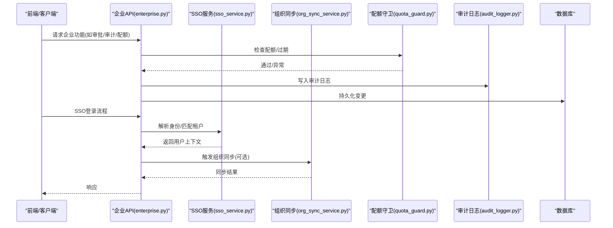

**图表来源** 
- [backend/app/api/enterprise.py](file://backend/app/api/enterprise.py)
- [backend/app/services/sso_service.py](file://backend/app/services/sso_service.py)
- [backend/app/services/org_sync_service.py](file://backend/app/services/org_sync_service.py)
- [backend/app/services/quota_guard.py](file://backend/app/services/quota_guard.py)
- [backend/app/services/audit_logger.py](file://backend/app/services/audit_logger.py)

## 详细组件分析

### 多租户架构设计
- Tenant模型定义租户基础信息与默认配额、时区、A2A开关、默认LLM模型等
- 所有资源（User、OrgMember、Agent、LLMModel等）均包含tenant_id，并在查询中强制作用域过滤
- SSO可通过域名提示自动匹配租户

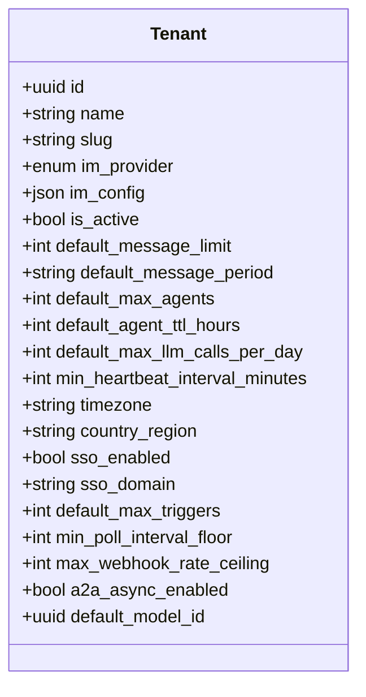

**图表来源** 
- [backend/app/models/tenant.py](file://backend/app/models/tenant.py)

**章节来源**
- [backend/app/models/tenant.py](file://backend/app/models/tenant.py)
- [backend/app/services/sso_service.py](file://backend/app/services/sso_service.py)

### RBAC权限控制系统
- 角色体系：platform_admin、org_admin、agent_admin、member；Identity可具备平台管理员标记
- Agent访问模式：company、private、custom；custom需显式授权
- 权限判定函数覆盖“能否使用Agent”“能否管理Agent”“可见性评估”“关系有效性”等

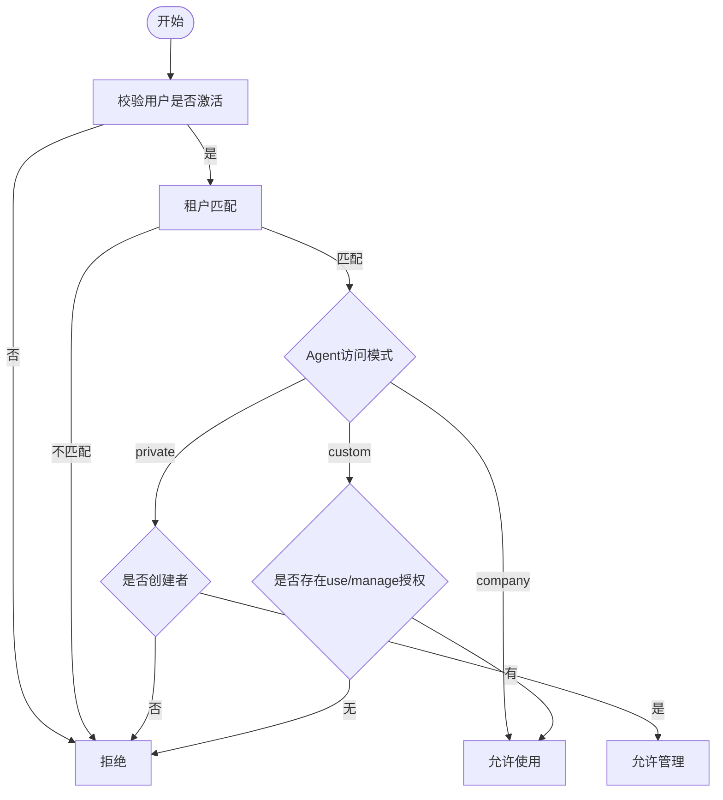

**图表来源** 
- [backend/app/core/permissions.py](file://backend/app/core/permissions.py)

**章节来源**
- [backend/app/core/permissions.py](file://backend/app/core/permissions.py)
- [backend/app/models/user.py](file://backend/app/models/user.py)
- [backend/app/models/org.py](file://backend/app/models/org.py)

### 审计日志机制
- AuditLog记录动作、详情、IP、时间戳，支持按租户与Agent筛选
- audit_logger提供标准化写入方法，避免后台任务中的ORM问题
- 企业API对关键操作（如删除LLM模型）自动写入审计

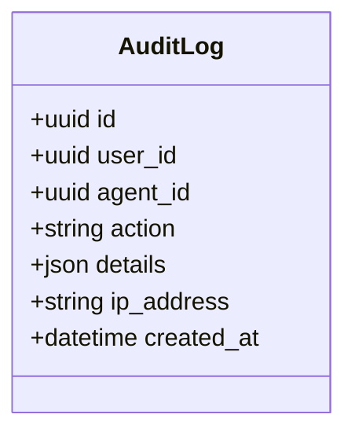

**图表来源** 
- [backend/app/models/audit.py](file://backend/app/models/audit.py)
- [backend/app/services/audit_logger.py](file://backend/app/services/audit_logger.py)
- [backend/app/api/enterprise.py](file://backend/app/api/enterprise.py)

**章节来源**
- [backend/app/models/audit.py](file://backend/app/models/audit.py)
- [backend/app/services/audit_logger.py](file://backend/app/services/audit_logger.py)
- [backend/app/api/enterprise.py](file://backend/app/api/enterprise.py)

### 使用配额管理
- 会话消息配额：按周期重置，管理员豁免
- Agent LLM调用配额：按日重置
- Agent创建配额：限制非管理员用户的Agent数量
- 心跳下限：租户级最小心跳间隔，批量修正Agent配置

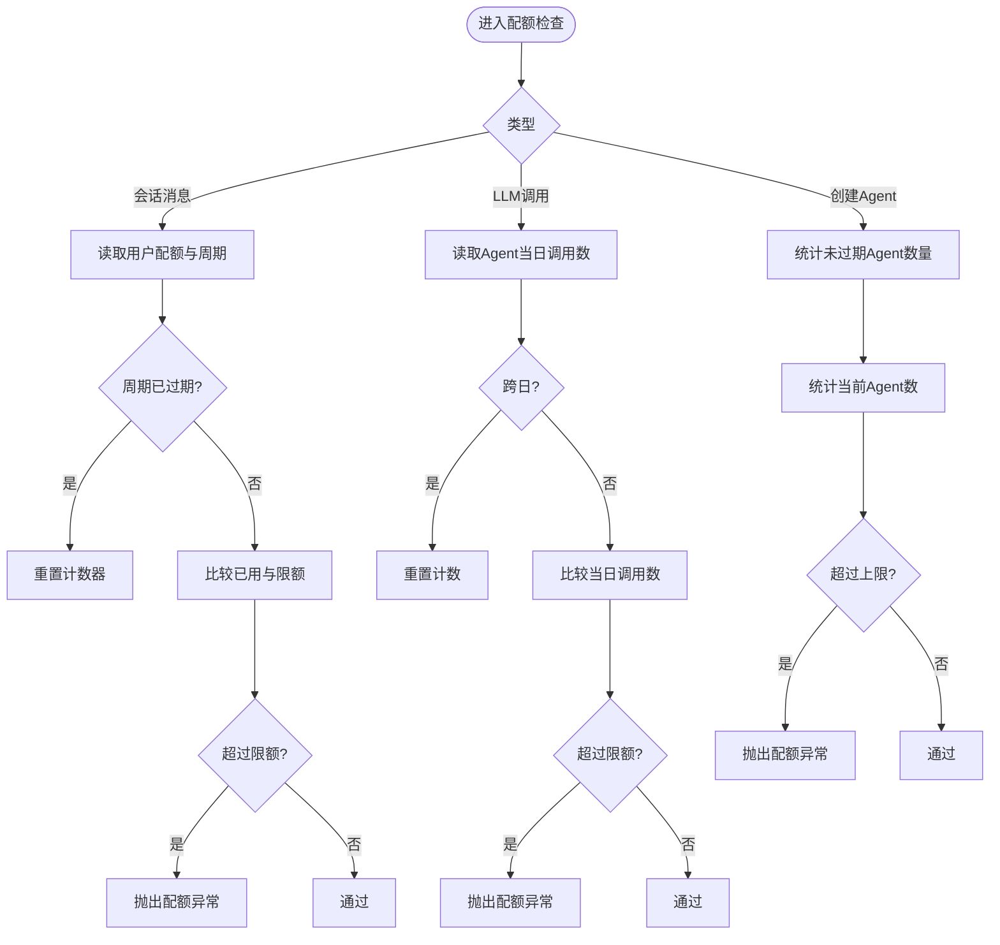

**图表来源** 
- [backend/app/services/quota_guard.py](file://backend/app/services/quota_guard.py)

**章节来源**
- [backend/app/services/quota_guard.py](file://backend/app/services/quota_guard.py)

### 审批工作流
- ApprovalRequest记录动作类型、详情、状态（pending/approved/rejected）、处理人与时间
- 企业API提供列表与决议接口，支持按租户与作用域过滤

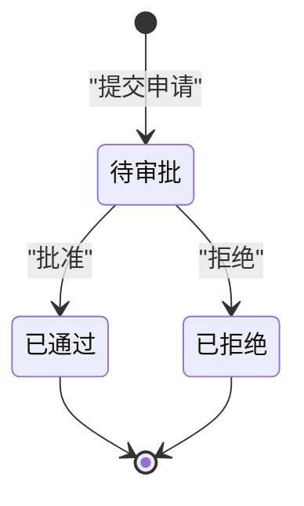

**图表来源** 
- [backend/app/models/audit.py](file://backend/app/models/audit.py)
- [backend/app/api/enterprise.py](file://backend/app/api/enterprise.py)

**章节来源**
- [backend/app/models/audit.py](file://backend/app/models/audit.py)
- [backend/app/api/enterprise.py](file://backend/app/api/enterprise.py)

### 组织架构同步
- OrgSyncService根据IdentityProvider选择适配器，执行部门与成员同步
- 适配器框架统一抽象fetch_departments/fetch_users，内部维护department_path、member_count、reconcile与增量更新
- 支持飞书、钉钉、企微等提供商

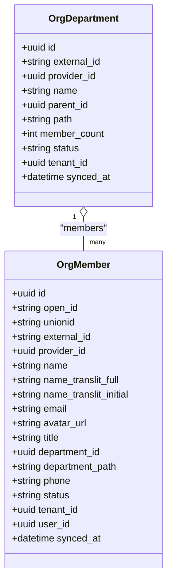

**图表来源** 
- [backend/app/models/org.py](file://backend/app/models/org.py)
- [backend/app/services/org_sync_service.py](file://backend/app/services/org_sync_service.py)
- [backend/app/services/org_sync_adapter.py](file://backend/app/services/org_sync_adapter.py)

**章节来源**
- [backend/app/models/org.py](file://backend/app/models/org.py)
- [backend/app/services/org_sync_service.py](file://backend/app/services/org_sync_service.py)
- [backend/app/services/org_sync_adapter.py](file://backend/app/services/org_sync_adapter.py)

### SSO与企业目录集成
- SSO会话：创建/状态轮询/扫码标记/配置获取
- SSO服务：邮箱/手机号匹配、自动租户识别、外部身份解析与绑定、去重检测、启用校验（含IP冲突策略）
- 企业目录：通过OrgMember与IdentityProvider关联，支持被动资料填充与UnionID/OpenID映射

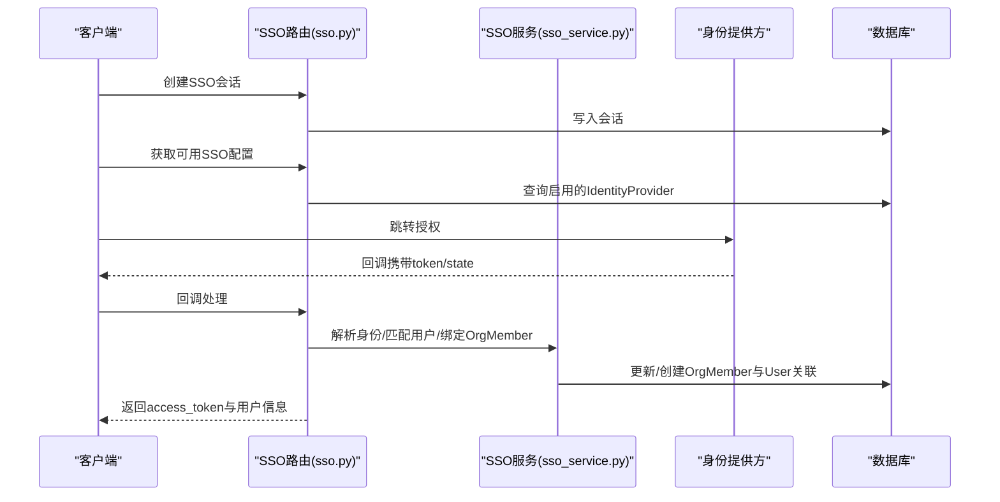

**图表来源** 
- [backend/app/api/sso.py](file://backend/app/api/sso.py)
- [backend/app/services/sso_service.py](file://backend/app/services/sso_service.py)
- [backend/app/models/identity.py](file://backend/app/models/identity.py)

**章节来源**
- [backend/app/api/sso.py](file://backend/app/api/sso.py)
- [backend/app/services/sso_service.py](file://backend/app/services/sso_service.py)
- [backend/app/models/identity.py](file://backend/app/models/identity.py)

### 企业信息发布与Agent同步
- EnterpriseInfo版本化存储，按visible_roles控制可见范围
- 通过Redis Pub/Sub通知在线Agent，Agent拉取最新内容落盘

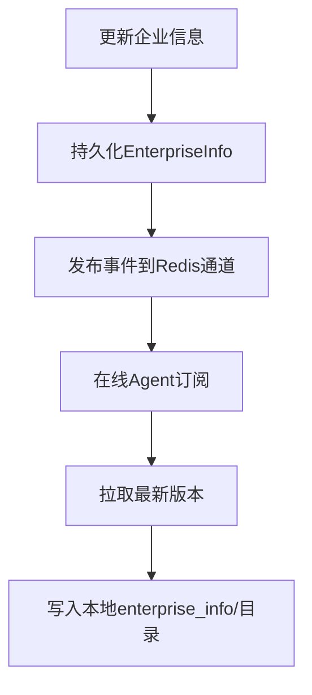

**图表来源** 
- [backend/app/services/enterprise_sync.py](file://backend/app/services/enterprise_sync.py)
- [backend/app/models/audit.py](file://backend/app/models/audit.py)

**章节来源**
- [backend/app/services/enterprise_sync.py](file://backend/app/services/enterprise_sync.py)
- [backend/app/models/audit.py](file://backend/app/models/audit.py)

## 依赖关系分析
- 路由层依赖服务层，服务层依赖模型层与核心工具
- 权限模块强耦合于User/Org/Agent模型，确保访问控制一致性
- SSO服务依赖IdentityProvider与OrgMember，保障身份与组织数据的统一
- 配额守卫依赖User/Agent/Tenant，保证用量与租户策略一致

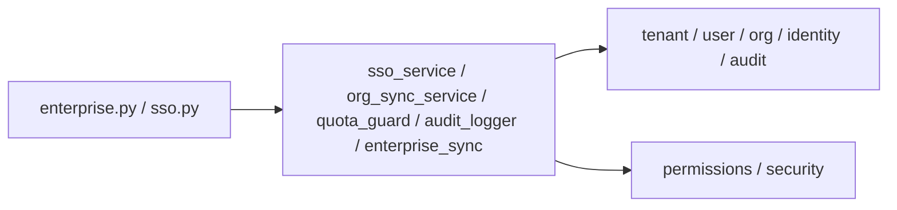

**图表来源** 
- [backend/app/api/enterprise.py](file://backend/app/api/enterprise.py)
- [backend/app/api/sso.py](file://backend/app/api/sso.py)
- [backend/app/services/sso_service.py](file://backend/app/services/sso_service.py)
- [backend/app/services/org_sync_service.py](file://backend/app/services/org_sync_service.py)
- [backend/app/services/quota_guard.py](file://backend/app/services/quota_guard.py)
- [backend/app/services/audit_logger.py](file://backend/app/services/audit_logger.py)
- [backend/app/services/enterprise_sync.py](file://backend/app/services/enterprise_sync.py)
- [backend/app/models/tenant.py](file://backend/app/models/tenant.py)
- [backend/app/models/user.py](file://backend/app/models/user.py)
- [backend/app/models/org.py](file://backend/app/models/org.py)
- [backend/app/models/identity.py](file://backend/app/models/identity.py)
- [backend/app/models/audit.py](file://backend/app/models/audit.py)
- [backend/app/core/permissions.py](file://backend/app/core/permissions.py)
- [backend/app/core/security.py](file://backend/app/core/security.py)

**章节来源**
- [backend/app/api/enterprise.py](file://backend/app/api/enterprise.py)
- [backend/app/api/sso.py](file://backend/app/api/sso.py)
- [backend/app/services/sso_service.py](file://backend/app/services/sso_service.py)
- [backend/app/services/org_sync_service.py](file://backend/app/services/org_sync_service.py)
- [backend/app/services/quota_guard.py](file://backend/app/services/quota_guard.py)
- [backend/app/services/audit_logger.py](file://backend/app/services/audit_logger.py)
- [backend/app/services/enterprise_sync.py](file://backend/app/services/enterprise_sync.py)
- [backend/app/models/tenant.py](file://backend/app/models/tenant.py)
- [backend/app/models/user.py](file://backend/app/models/user.py)
- [backend/app/models/org.py](file://backend/app/models/org.py)
- [backend/app/models/identity.py](file://backend/app/models/identity.py)
- [backend/app/models/audit.py](file://backend/app/models/audit.py)
- [backend/app/core/permissions.py](file://backend/app/core/permissions.py)
- [backend/app/core/security.py](file://backend/app/core/security.py)

## 性能与可扩展性
- 索引与查询优化：对用户、组织成员、审计日志等高频字段建立索引；使用selectinload避免N+1
- 异步与并发：SSO回调、组织同步、企业信息发布均采用异步IO；bcrypt哈希使用线程池避免阻塞事件循环
- 缓存与事件：企业信息发布通过Redis Pub/Sub降低实时同步开销；SSO会话短生命周期减少锁竞争
- 批处理与幂等：组织同步采用嵌套事务与reconcile策略，避免重复写入与脏数据
- 扩展点：OrgSyncAdapter抽象便于新增企业目录供应商；SSO服务支持更多AuthProviderType

[本节为通用指导，不直接分析具体文件]

## 故障排查指南
- 权限问题：确认用户角色、Agent访问模式与显式授权；检查租户匹配与创建者关系
- 配额超限：查看用户/Agent配额与周期重置逻辑；确认管理员豁免与心跳下限
- 审计缺失：检查audit_logger写入是否被异常捕获；确认action枚举与details序列化
- SSO失败：核对IdentityProvider配置、回调URL、state校验与IP冲突策略；查看SSO会话状态
- 组织同步错误：关注部分失败时的reconcile跳过；检查unionid/openid/external_id映射规则

**章节来源**
- [backend/app/core/permissions.py](file://backend/app/core/permissions.py)
- [backend/app/services/quota_guard.py](file://backend/app/services/quota_guard.py)
- [backend/app/services/audit_logger.py](file://backend/app/services/audit_logger.py)
- [backend/app/services/sso_service.py](file://backend/app/services/sso_service.py)
- [backend/app/services/org_sync_adapter.py](file://backend/app/services/org_sync_adapter.py)

## 结论
Clawith的企业级能力围绕多租户隔离、RBAC权限、审计与配额、审批与工作流、组织同步与SSO构建，形成完整的企业治理闭环。通过清晰的层次划分与可扩展的服务抽象，既满足大型组织的管控需求，又保持对第三方系统与未来能力的良好兼容。

[本节为总结，不直接分析具体文件]

## 附录：配置与合规清单
- 安全配置
  - JWT密钥与算法、令牌有效期
  - AES密钥用于敏感字段加密（如API Key）
  - bcrypt哈希线程池大小与超时
  - SSO回调URL与白名单域名/IP
- 合规要求
  - 审计日志保留策略与不可篡改
  - 个人身份信息最小化采集与脱敏展示
  - 数据跨境与租户隔离策略
- 监控告警
  - 配额超限、SSO失败率、组织同步错误率、审计写入失败
  - Agent心跳低于租户下限告警
- 灾难恢复
  - 数据库备份与回滚策略
  - Redis事件丢失补偿机制
  - 组织同步幂等与断点续跑

[本节为通用指导，不直接分析具体文件]