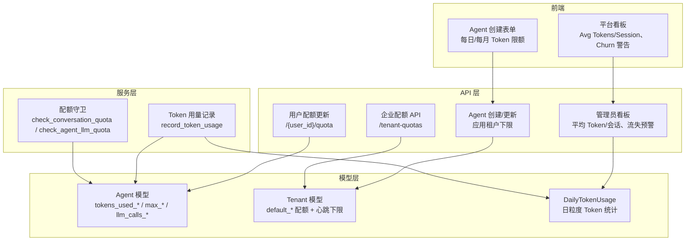
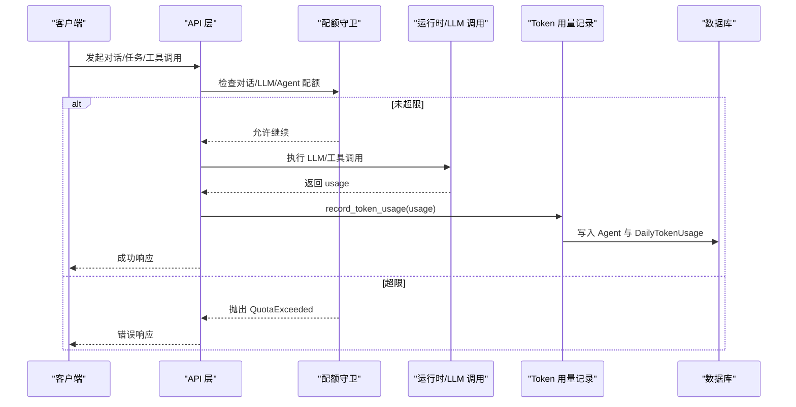
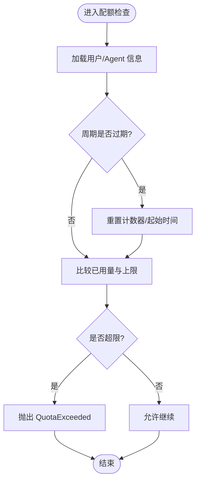
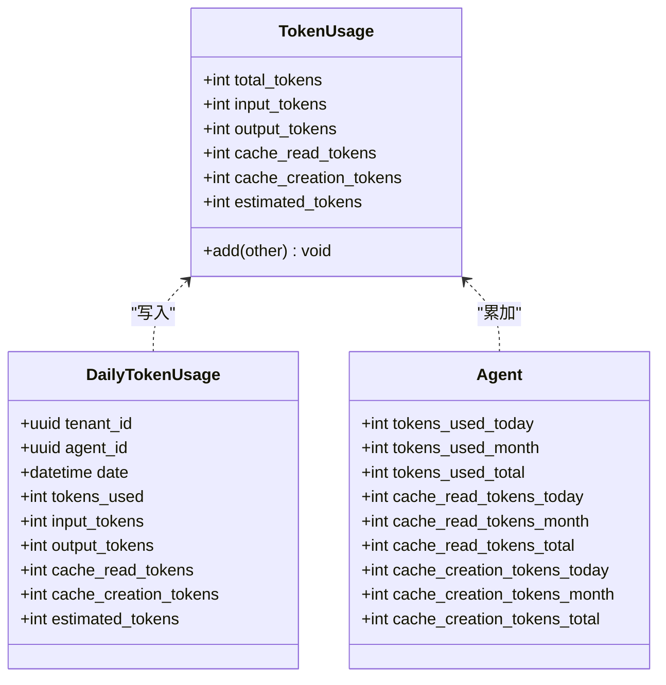
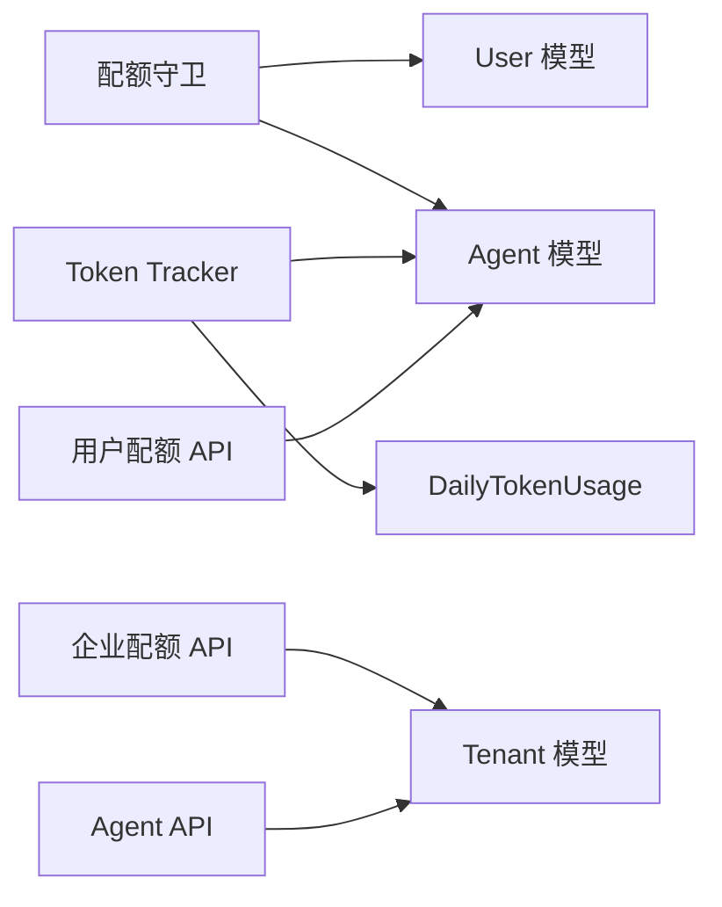

# 使用配额管理

<cite>
**本文引用的文件**   
- [quota_guard.py](file://backend/app/services/quota_guard.py)
- [token_tracker.py](file://backend/app/services/token_tracker.py)
- [agent.py](file://backend/app/models/agent.py)
- [tenant.py](file://backend/app/models/tenant.py)
- [activity_log.py](file://backend/app/models/activity_log.py)
- [enterprise.py](file://backend/app/api/enterprise.py)
- [agents.py](file://backend/app/api/agents.py)
- [users.py](file://backend/app/api/users.py)
- [admin.py](file://backend/app/api/admin.py)
- [002_add_quota_fields.py](file://backend/alembic/versions/002_add_quota_fields.py)
- [049_default_permanent_agent_quotas.py](file://backend/alembic/versions/049_default_permanent_agent_quotas.py)
- [050_add_token_cache_usage_fields.py](file://backend/alembic/versions/050_add_token_cache_usage_fields.py)
- [PlatformDashboard.tsx](file://frontend/src/pages/PlatformDashboard.tsx)
- [AgentCreate.tsx](file://frontend/src/pages/AgentCreate.tsx)
</cite>

## 目录
1. [简介](#简介)
2. [项目结构](#项目结构)
3. [核心组件](#核心组件)
4. [架构总览](#架构总览)
5. [详细组件分析](#详细组件分析)
6. [依赖关系分析](#依赖关系分析)
7. [性能与扩展性](#性能与扩展性)
8. [故障排查指南](#故障排查指南)
9. [结论](#结论)
10. [附录：API 与最佳实践](#附录api-与最佳实践)

## 简介
本文件系统化梳理 Clawith 的“使用配额管理系统”，覆盖以下关键主题：
- 配额类型定义：对话次数、Agent LLM 调用次数、Token 用量（含缓存）、触发器限制、心跳频率下限等。
- 配额计算策略：周期重置、累计计数、按租户/用户/Agent 维度聚合。
- 配额限制执行机制：前置校验、超限异常、后台强制策略（如心跳下限）。
- 监控与报表：每日 Token 用量统计、平台看板指标、流失预警。
- API 接口与配置：租户级默认配额、用户级配额调整、Agent 创建/更新时的配额约束。
- 扩展能力：新增配额类型、自定义规则、动态调整与审计追踪。

## 项目结构
配额相关代码主要分布在后端服务层、模型层、API 层以及前端展示层：
- 服务层：配额守卫（对话、LLM 调用、Agent 过期、心跳下限）与 Token 用量记录。
- 模型层：Agent/Tenant/User 的配额字段，DailyTokenUsage 日粒度统计。
- API 层：租户配额查询/更新、用户配额更新、Agent 创建/更新时应用租户下限。
- 前端：平台看板指标、Agent 创建表单中的 Token 限额输入。

图表来源
- [quota_guard.py:1-266](file://backend/app/services/quota_guard.py#L1-L266)
- [token_tracker.py:1-246](file://backend/app/services/token_tracker.py#L1-L246)
- [agent.py:80-235](file://backend/app/models/agent.py#L80-L235)
- [tenant.py:1-73](file://backend/app/models/tenant.py#L1-L73)
- [activity_log.py:1-57](file://backend/app/models/activity_log.py#L1-L57)
- [enterprise.py:754-827](file://backend/app/api/enterprise.py#L754-L827)
- [agents.py:431-476](file://backend/app/api/agents.py#L431-L476)
- [users.py:17-216](file://backend/app/api/users.py#L17-L216)
- [admin.py:449-572](file://backend/app/api/admin.py#L449-L572)
- [PlatformDashboard.tsx:349-484](file://frontend/src/pages/PlatformDashboard.tsx#L349-L484)
- [AgentCreate.tsx:509-527](file://frontend/src/pages/AgentCreate.tsx#L509-L527)

章节来源
- [quota_guard.py:1-266](file://backend/app/services/quota_guard.py#L1-L266)
- [token_tracker.py:1-246](file://backend/app/services/token_tracker.py#L1-L246)
- [agent.py:80-235](file://backend/app/models/agent.py#L80-L235)
- [tenant.py:1-73](file://backend/app/models/tenant.py#L1-L73)
- [activity_log.py:1-57](file://backend/app/models/activity_log.py#L1-L57)
- [enterprise.py:754-827](file://backend/app/api/enterprise.py#L754-L827)
- [agents.py:431-476](file://backend/app/api/agents.py#L431-L476)
- [users.py:17-216](file://backend/app/api/users.py#L17-L216)
- [admin.py:449-572](file://backend/app/api/admin.py#L449-L572)
- [PlatformDashboard.tsx:349-484](file://frontend/src/pages/PlatformDashboard.tsx#L349-L484)
- [AgentCreate.tsx:509-527](file://frontend/src/pages/AgentCreate.tsx#L509-L527)

## 核心组件
- 配额守卫（Quota Guard）
  - 对话配额：按用户维度检查并递增消息配额，支持周期重置（永久/日/周/月），管理员豁免。
  - Agent LLM 调用配额：按 Agent 维度检查每日 LLM 调用上限，自动按日重置。
  - Agent 过期控制：到期后标记为已过期并停止心跳。
  - 心跳下限强制：按租户最小间隔对现有 Agent 进行批量校正。
- Token 用量追踪（Token Tracker）
  - 统一解析多厂商 usage 数据（OpenAI/Anthropic/Gemini），归一化为 TokenUsage。
  - 写入 Agent 的今日/本月/总计 Token 与缓存读写计数，同时写入 DailyTokenUsage 用于报表。
- 模型与配置
  - Agent：Token 限额（日/月）、已用计数、重置时间、缓存计数、上下文窗口、最大工具轮次、每日 LLM 调用上限等。
  - Tenant：新用户默认配额、心跳下限、触发器限制、Webhook 速率上限等。
  - DailyTokenUsage：按天聚合的 Token 用量明细，支撑报表与成本分析。
- API 与前端
  - 企业配额 API：获取/更新租户默认配额，支持心跳下限强制生效。
  - 用户配额 API：管理员可调整用户的消息配额、Agent 数量上限、TTL 等。
  - Agent 创建/更新：继承租户默认值并应用下限约束。
  - 前端看板：展示平均 Token/会话、留存率、流失预警；Agent 创建页提供 Token 限额输入。

章节来源
- [quota_guard.py:1-266](file://backend/app/services/quota_guard.py#L1-L266)
- [token_tracker.py:1-246](file://backend/app/services/token_tracker.py#L1-L246)
- [agent.py:80-235](file://backend/app/models/agent.py#L80-L235)
- [tenant.py:1-73](file://backend/app/models/tenant.py#L1-L73)
- [activity_log.py:1-57](file://backend/app/models/activity_log.py#L1-L57)
- [enterprise.py:754-827](file://backend/app/api/enterprise.py#L754-L827)
- [users.py:17-216](file://backend/app/api/users.py#L17-L216)
- [agents.py:431-476](file://backend/app/api/agents.py#L431-L476)
- [PlatformDashboard.tsx:349-484](file://frontend/src/pages/PlatformDashboard.tsx#L349-L484)
- [AgentCreate.tsx:509-527](file://frontend/src/pages/AgentCreate.tsx#L509-L527)

## 架构总览
配额系统采用“前置校验 + 后置记录”的双阶段模式：
- 前置校验：在关键路径（对话、LLM 调用、Agent 创建）调用配额守卫，超限抛出 QuotaExceeded。
- 后置记录：所有 LLM 调用结束后通过 Token Tracker 归一化 usage 并持久化到 Agent 与 DailyTokenUsage。
- 租户策略：租户默认配额作为新对象的基线，并在创建/更新时应用下限约束（如心跳下限）。
- 报表与分析：基于 DailyTokenUsage 与 ChatSession 统计生成平台看板指标与流失预警。

图表来源
- [quota_guard.py:1-266](file://backend/app/services/quota_guard.py#L1-L266)
- [token_tracker.py:1-246](file://backend/app/services/token_tracker.py#L1-L246)
- [agents.py:431-476](file://backend/app/api/agents.py#L431-L476)
- [enterprise.py:754-827](file://backend/app/api/enterprise.py#L754-L827)

## 详细组件分析

### 配额守卫（Quota Guard）
- 对话配额
  - 检查用户剩余消息配额，支持周期重置（daily/weekly/monthly/permanent）。
  - 管理员角色豁免。
  - 超限抛出 QuotaExceeded（quota_type="conversation"）。
- Agent LLM 调用配额
  - 按 Agent 维度检查每日 LLM 调用上限，自动按日重置。
  - 超限抛出 QuotaExceeded（quota_type="agent_llm"）。
- Agent 过期控制
  - 若 expires_at 到达或 is_expired 为真，则标记状态并禁止继续使用。
- 心跳下限强制
  - 根据租户 min_heartbeat_interval_minutes 对现有 Agent 进行批量校正。

图表来源
- [quota_guard.py:1-266](file://backend/app/services/quota_guard.py#L1-L266)

章节来源
- [quota_guard.py:1-266](file://backend/app/services/quota_guard.py#L1-L266)

### Token 用量追踪（Token Tracker）
- 多厂商 usage 解析
  - OpenAI/Anthropic/Gemini 格式兼容，提取 input/output/total/cached tokens。
- 归一化与累加
  - 将 usage 转换为 TokenUsage，累加至 Agent 的今日/本月/总计字段。
  - 写入 DailyTokenUsage 表，按 agent_id+date 去重合并。
- 容错与日志
  - 独立 DB 会话避免干扰调用方事务；失败时记录警告日志。

图表来源
- [token_tracker.py:1-246](file://backend/app/services/token_tracker.py#L1-L246)
- [activity_log.py:1-57](file://backend/app/models/activity_log.py#L1-L57)
- [agent.py:80-235](file://backend/app/models/agent.py#L80-L235)

章节来源
- [token_tracker.py:1-246](file://backend/app/services/token_tracker.py#L1-L246)
- [activity_log.py:1-57](file://backend/app/models/activity_log.py#L1-L57)
- [agent.py:80-235](file://backend/app/models/agent.py#L80-L235)

### 模型与配置（Agent/Tenant/DailyTokenUsage）
- Agent
  - Token 限额：max_tokens_per_day、max_tokens_per_month。
  - 用量累计：tokens_used_today/month/total，缓存读写计数。
  - 重置时间：last_daily_reset、last_monthly_reset。
  - 上下文窗口：context_window_size。
  - 工具轮次：max_tool_rounds。
  - 触发器限制：max_triggers、min_poll_interval_min、webhook_rate_limit。
  - 过期控制：expires_at、is_expired。
  - 每日 LLM 调用上限：max_llm_calls_per_day、llm_calls_today、llm_calls_reset_at。
- Tenant
  - 默认配额：default_message_limit、default_message_period、default_max_agents、default_agent_ttl_hours、default_max_llm_calls_per_day。
  - 心跳下限：min_heartbeat_interval_minutes。
  - 触发器限制：default_max_triggers、min_poll_interval_floor、max_webhook_rate_ceiling。
- DailyTokenUsage
  - 按天聚合 tokens_used/input/output/cache 计数，支撑报表与成本分析。

章节来源
- [agent.py:80-235](file://backend/app/models/agent.py#L80-L235)
- [tenant.py:1-73](file://backend/app/models/tenant.py#L1-L73)
- [activity_log.py:1-57](file://backend/app/models/activity_log.py#L1-L57)

### API 与前端集成
- 企业配额 API
  - GET /tenant-quotas：获取租户默认配额与心跳下限。
  - PATCH /tenant-quotas：更新租户默认配额，支持心跳下限强制生效。
- 用户配额 API
  - PATCH /{user_id}/quota：管理员调整用户消息配额、Agent 数量上限、TTL。
- Agent 创建/更新
  - 继承租户默认值并应用下限约束（如心跳下限、触发器限制）。
- 前端看板
  - 平台看板显示平均 Token/会话、留存率、流失预警。
  - Agent 创建表单提供每日/每月 Token 限额输入。

章节来源
- [enterprise.py:754-827](file://backend/app/api/enterprise.py#L754-L827)
- [users.py:17-216](file://backend/app/api/users.py#L17-L216)
- [agents.py:431-476](file://backend/app/api/agents.py#L431-L476)
- [PlatformDashboard.tsx:349-484](file://frontend/src/pages/PlatformDashboard.tsx#L349-L484)
- [AgentCreate.tsx:509-527](file://frontend/src/pages/AgentCreate.tsx#L509-L527)

## 依赖关系分析
- 耦合与内聚
  - 配额守卫与模型强耦合（读取 User/Agent 字段），但职责单一，内聚良好。
  - Token Tracker 与 ActivityLog 解耦，仅通过 DAO 写入，便于扩展。
- 外部依赖
  - SQLAlchemy 异步会话、PostgreSQL UPSERT（on_conflict_do_update）。
  - 多厂商 LLM usage 格式兼容。
- 潜在循环依赖
  - 服务层通过延迟导入模型，避免循环依赖。

图表来源
- [quota_guard.py:1-266](file://backend/app/services/quota_guard.py#L1-L266)
- [token_tracker.py:1-246](file://backend/app/services/token_tracker.py#L1-L246)
- [enterprise.py:754-827](file://backend/app/api/enterprise.py#L754-L827)
- [agents.py:431-476](file://backend/app/api/agents.py#L431-L476)
- [users.py:17-216](file://backend/app/api/users.py#L17-L216)

章节来源
- [quota_guard.py:1-266](file://backend/app/services/quota_guard.py#L1-L266)
- [token_tracker.py:1-246](file://backend/app/services/token_tracker.py#L1-L246)
- [enterprise.py:754-827](file://backend/app/api/enterprise.py#L754-L827)
- [agents.py:431-476](file://backend/app/api/agents.py#L431-L476)
- [users.py:17-216](file://backend/app/api/users.py#L17-L216)

## 性能与扩展性
- 性能特性
  - 配额检查为轻量 DB 读操作，适合高频调用。
  - Token 记录使用独立会话与 UPSERT，避免阻塞主事务。
- 优化建议
  - 热点行（Agent/Tenant）增加索引以加速查询。
  - 对 DailyTokenUsage 按日期分区以提升历史查询性能。
  - 配额检查可引入本地缓存（如 Redis）降低 DB 压力。
- 扩展能力
  - 新增配额类型：在配额守卫中增加检查函数，在相应 API 入口调用。
  - 自定义规则：通过 Tenant 默认值与 Agent 覆盖实现灵活策略。
  - 动态调整：通过 PATCH /tenant-quotas 与 /{user_id}/quota 实时生效。

[本节为通用指导，不直接分析具体文件]

## 故障排查指南
- 常见错误
  - QuotaExceeded：配额超限，检查对应维度的已用量与上限。
  - AgentExpired：Agent 已过期，检查 expires_at 与 is_expired。
  - Token 记录失败：查看日志警告，确认 DB 连接与权限。
- 排查步骤
  - 确认租户默认配额与用户/Agent 覆盖值。
  - 检查 DailyTokenUsage 是否正确写入。
  - 验证心跳下限与触发器限制是否被正确应用。

章节来源
- [quota_guard.py:1-266](file://backend/app/services/quota_guard.py#L1-L266)
- [token_tracker.py:1-246](file://backend/app/services/token_tracker.py#L1-L246)

## 结论
Clawith 的配额管理系统通过清晰的职责划分与稳健的数据流设计，实现了多维度、可配置的配额控制与统计。结合租户默认策略、用户/Agent 覆盖、以及前台看板与报表，能够满足从个人到企业级的资源管控需求。未来可通过缓存、分区与更细粒度的配额类型进一步扩展。

[本节为总结，不直接分析具体文件]

## 附录：API 与最佳实践

### 配额配置 API
- 获取租户配额
  - GET /tenant-quotas
  - 返回：default_message_limit、default_message_period、default_max_agents、default_agent_ttl_hours、default_max_llm_calls_per_day、min_heartbeat_interval_minutes、default_max_triggers、min_poll_interval_floor、max_webhook_rate_ceiling。
- 更新租户配额
  - PATCH /tenant-quotas
  - 支持：同上字段更新，并强制心跳下限生效。
- 更新用户配额
  - PATCH /{user_id}/quota
  - 支持：quota_message_limit、quota_message_period、quota_max_agents、quota_agent_ttl_hours。

章节来源
- [enterprise.py:754-827](file://backend/app/api/enterprise.py#L754-L827)
- [users.py:17-216](file://backend/app/api/users.py#L17-L216)

### 最佳实践
- 合理设置租户默认配额，避免过高或过低。
- 为新 Agent 设置合理的 Token 限额与 LLM 调用上限。
- 定期查看平台看板指标，识别高消耗与流失风险。
- 使用缓存命中统计优化 Token 成本。
- 通过心跳下限与触发器限制控制资源占用。

[本节为通用指导，不直接分析具体文件]

### 迁移与版本变更
- 添加配额字段（用户/Agent/Tenant）
- 默认永久 Agent 配额与更高每日 LLM 调用
- 添加 Token 缓存用量字段

章节来源
- [002_add_quota_fields.py:1-40](file://backend/alembic/versions/002_add_quota_fields.py#L1-L40)
- [049_default_permanent_agent_quotas.py:1-32](file://backend/alembic/versions/049_default_permanent_agent_quotas.py#L1-L32)
- [050_add_token_cache_usage_fields.py:1-20](file://backend/alembic/versions/050_add_token_cache_usage_fields.py#L1-L20)