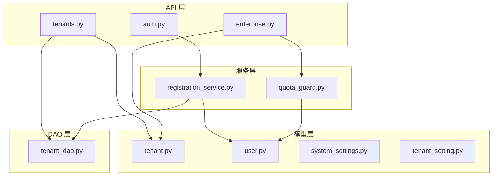
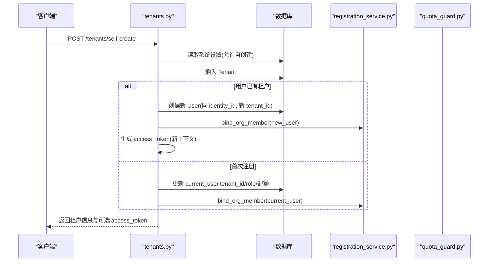
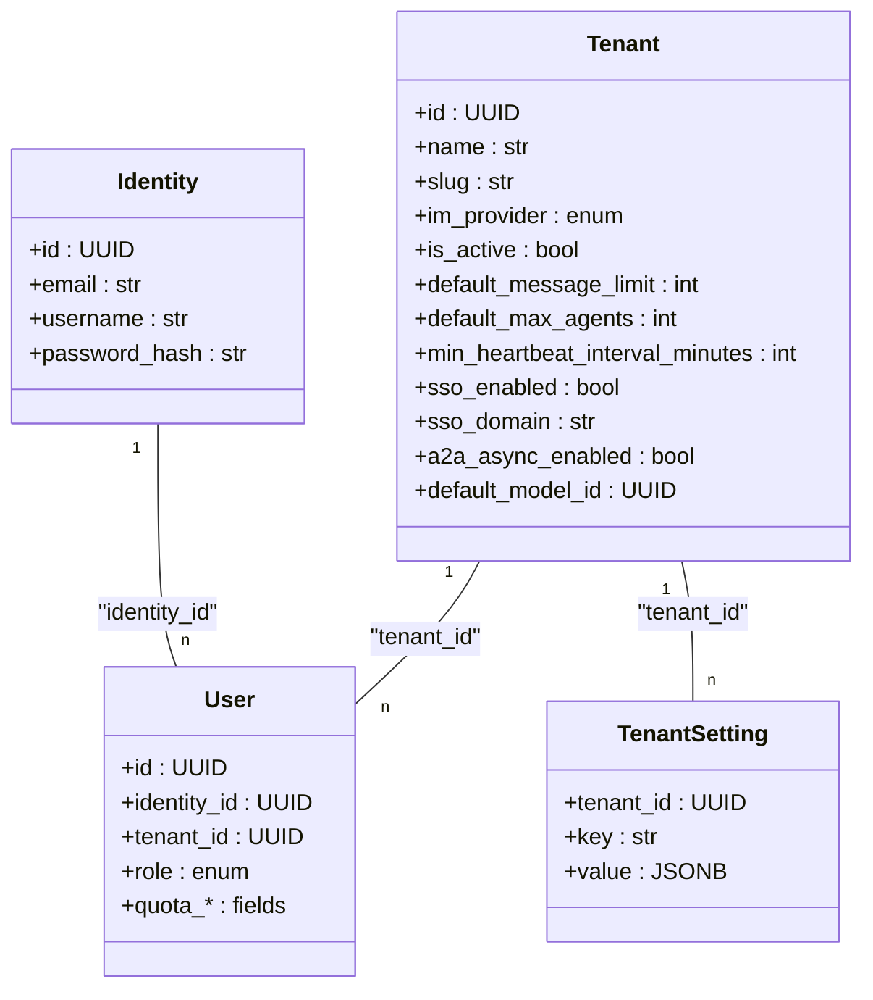
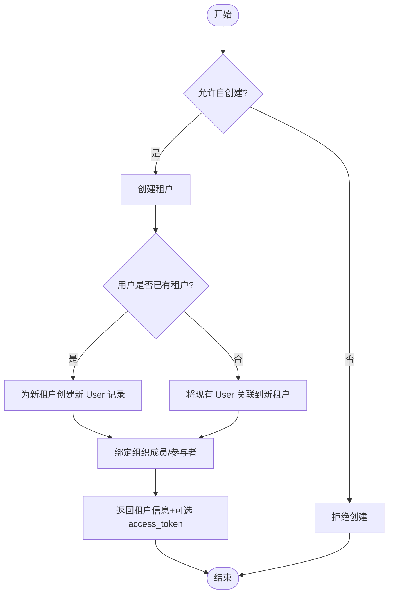
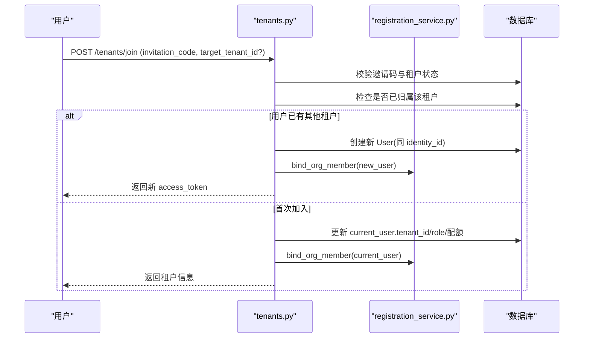
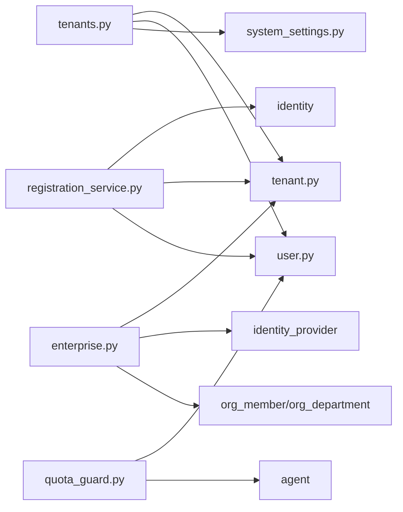

# 多租户管理

<cite>
**本文引用的文件**   
- [backend/app/api/tenants.py](file://backend/app/api/tenants.py)
- [backend/app/models/tenant.py](file://backend/app/models/tenant.py)
- [backend/app/dao/tenant_dao.py](file://backend/app/dao/tenant_dao.py)
- [backend/app/models/tenant_setting.py](file://backend/app/models/tenant_setting.py)
- [backend/app/services/quota_guard.py](file://backend/app/services/quota_guard.py)
- [backend/app/core/permissions.py](file://backend/app/core/permissions.py)
- [backend/app/api/enterprise.py](file://backend/app/api/enterprise.py)
- [backend/app/services/registration_service.py](file://backend/app/services/registration_service.py)
- [backend/app/api/auth.py](file://backend/app/api/auth.py)
- [backend/app/models/system_settings.py](file://backend/app/models/system_settings.py)
- [backend/app/models/user.py](file://backend/app/models/user.py)
- [backend/alembic/versions/013_multi_tenant_registration.py](file://backend/alembic/versions/013_multi_tenant_registration.py)
</cite>

## 目录
1. [简介](#简介)
2. [项目结构](#项目结构)
3. [核心组件](#核心组件)
4. [架构总览](#架构总览)
5. [详细组件分析](#详细组件分析)
6. [依赖关系分析](#依赖关系分析)
7. [性能与隔离特性](#性能与隔离特性)
8. [故障排查指南](#故障排查指南)
9. [结论](#结论)
10. [附录：API 参考](#附录api-参考)

## 简介
本文件面向 Clawi th 的多租户管理系统，系统性阐述多租户架构设计、数据隔离策略、租户生命周期管理、配额与权限控制、资源分配机制、租户间通信限制、监控与可观测性、以及扩展与企业目录集成方案。文档同时提供租户管理的 API 接口说明，帮助平台管理员与企业客户快速落地多租户能力。

## 项目结构
后端采用 FastAPI + SQLAlchemy（异步）分层架构：
- API 层：路由与请求校验（如 tenants.py、auth.py、enterprise.py）
- 模型层：领域实体（如 tenant.py、user.py、system_settings.py、tenant_setting.py）
- DAO 层：数据访问封装（如 tenant_dao.py）
- 服务层：业务编排与跨模块协作（如 registration_service.py、quota_guard.py）
- 迁移脚本：数据库演进（如 alembic 版本）

**图表来源** 
- [backend/app/api/tenants.py:1-120](file://backend/app/api/tenants.py#L1-L120)
- [backend/app/models/tenant.py:1-73](file://backend/app/models/tenant.py#L1-L73)
- [backend/app/dao/tenant_dao.py:1-44](file://backend/app/dao/tenant_dao.py#L1-L44)
- [backend/app/services/registration_service.py:1-120](file://backend/app/services/registration_service.py#L1-L120)
- [backend/app/services/quota_guard.py:1-120](file://backend/app/services/quota_guard.py#L1-L120)

**章节来源**
- [backend/app/api/tenants.py:1-120](file://backend/app/api/tenants.py#L1-L120)
- [backend/app/models/tenant.py:1-73](file://backend/app/models/tenant.py#L1-L73)
- [backend/app/dao/tenant_dao.py:1-44](file://backend/app/dao/tenant_dao.py#L1-L44)
- [backend/app/services/registration_service.py:1-120](file://backend/app/services/registration_service.py#L1-L120)
- [backend/app/services/quota_guard.py:1-120](file://backend/app/services/quota_guard.py#L1-L120)

## 核心组件
- 租户模型与配置：定义租户边界、默认配额、时区、SSO、A2A 开关等
- 租户设置键值表：用于稀疏的租户级自定义配置
- 用户与身份：全局 Identity + 租户内 User，角色与配额继承自租户
- 注册服务：按邮箱域名识别租户、创建/绑定用户、处理邀请码与多组织切换
- 配额守卫：会话消息限额、Agent LLM 调用限额、心跳频率下限等
- 权限系统：RBAC + 目录可见性，确保租户内资源隔离与访问控制
- 企业设置：租户配额更新、SSO 自动域分配、平台级开关

**章节来源**
- [backend/app/models/tenant.py:1-73](file://backend/app/models/tenant.py#L1-L73)
- [backend/app/models/tenant_setting.py:1-31](file://backend/app/models/tenant_setting.py#L1-L31)
- [backend/app/models/user.py:1-119](file://backend/app/models/user.py#L1-L119)
- [backend/app/services/registration_service.py:1-200](file://backend/app/services/registration_service.py#L1-L200)
- [backend/app/services/quota_guard.py:1-266](file://backend/app/services/quota_guard.py#L1-L266)
- [backend/app/core/permissions.py:1-200](file://backend/app/core/permissions.py#L1-L200)
- [backend/app/api/enterprise.py:729-847](file://backend/app/api/enterprise.py#L729-L847)

## 架构总览
多租户以“租户”为隔离边界，所有资源通过 tenant_id 进行强约束；用户通过 identity_id 跨租户复用，但每个租户拥有独立的 User 记录与角色、配额。注册流程支持按邮箱域名自动识别租户，或基于邀请码加入；平台管理员可统一管控租户开关与配额。

**图表来源** 
- [backend/app/api/tenants.py:152-237](file://backend/app/api/tenants.py#L152-L237)
- [backend/app/services/registration_service.py:156-198](file://backend/app/services/registration_service.py#L156-L198)

**章节来源**
- [backend/app/api/tenants.py:152-237](file://backend/app/api/tenants.py#L152-L237)
- [backend/app/services/registration_service.py:156-198](file://backend/app/services/registration_service.py#L156-L198)

## 详细组件分析

### 数据隔离策略
- 模型级隔离：所有关键实体均包含 tenant_id，查询强制限定当前租户范围
- 用户隔离：同一 identity_id 可在多个租户存在独立 User 记录，角色与配额各自独立
- 工具与 Agent 可见性：通过访问模式（company/private/custom）与权限表实现细粒度隔离
- 存储键隔离：Logo 等资源使用规范化 key（含 tenant_id），避免跨租户冲突

**图表来源** 
- [backend/app/models/tenant.py:1-73](file://backend/app/models/tenant.py#L1-L73)
- [backend/app/models/user.py:1-119](file://backend/app/models/user.py#L1-L119)
- [backend/app/models/tenant_setting.py:1-31](file://backend/app/models/tenant_setting.py#L1-L31)

**章节来源**
- [backend/app/models/tenant.py:1-73](file://backend/app/models/tenant.py#L1-L73)
- [backend/app/models/user.py:1-119](file://backend/app/models/user.py#L1-L119)
- [backend/app/models/tenant_setting.py:1-31](file://backend/app/models/tenant_setting.py#L1-L31)

### 租户生命周期管理
- 创建：支持自创建（受系统设置控制）与邀请码加入；首次用户可成为 org_admin
- 激活/停用：通过 is_active 控制租户可用性
- 删除：严格外键顺序级联删除，确保数据一致性并返回 fallback_tenant_id
- 注销与回收：结合 Agent TTL、LLM 日限额、心跳下限等实现资源回收

**图表来源** 
- [backend/app/api/tenants.py:152-237](file://backend/app/api/tenants.py#L152-L237)
- [backend/app/api/tenants.py:253-373](file://backend/app/api/tenants.py#L253-L373)

**章节来源**
- [backend/app/api/tenants.py:152-237](file://backend/app/api/tenants.py#L152-L237)
- [backend/app/api/tenants.py:253-373](file://backend/app/api/tenants.py#L253-L373)
- [backend/alembic/versions/013_multi_tenant_registration.py:1-57](file://backend/alembic/versions/013_multi_tenant_registration.py#L1-L57)

### 租户配置管理
- 基础配置：名称、slug、IM 提供商、时区、国家地区、SSO、A2A 开关、默认模型
- 配额默认值：消息限额、周期、最大 Agent 数、Agent TTL、LLM 日调用上限、心跳下限、触发器限制
- 自定义配置：通过 tenant_settings 键值对存储（如 github_token、clawhub_key）
- 平台开关：allow_self_create_company、SSO 自定义域名重定向等

**章节来源**
- [backend/app/models/tenant.py:1-73](file://backend/app/models/tenant.py#L1-L73)
- [backend/app/models/tenant_setting.py:1-31](file://backend/app/models/tenant_setting.py#L1-L31)
- [backend/app/models/system_settings.py:1-21](file://backend/app/models/system_settings.py#L1-L21)
- [backend/app/api/tenants.py:376-387](file://backend/app/api/tenants.py#L376-L387)

### 租户注册流程与多组织切换
- 邮箱域名识别：根据 email 后缀匹配 sso_domain 定位租户
- 邀请码加入：校验有效性、使用次数、目标租户锁定（专用链接）
- 多组织切换：若用户已属于某租户，加入新租户时创建新的 User 记录并返回新 access_token 供前端切换上下文

**图表来源** 
- [backend/app/api/tenants.py:253-373](file://backend/app/api/tenants.py#L253-L373)
- [backend/app/services/registration_service.py:156-198](file://backend/app/services/registration_service.py#L156-L198)

**章节来源**
- [backend/app/api/tenants.py:253-373](file://backend/app/api/tenants.py#L253-L373)
- [backend/app/services/registration_service.py:156-198](file://backend/app/services/registration_service.py#L156-L198)

### 资源分配机制
- 默认配额继承：新用户从租户默认配额字段继承消息限额、周期、最大 Agent 数、Agent TTL、LLM 日调用上限
- 心跳下限：租户级 min_heartbeat_interval_minutes 会强制回写至现有 Agent，防止过快心跳
- 触发器与 Webhook 速率：租户级 default_max_triggers、min_poll_interval_floor、max_webhook_rate_ceiling

**章节来源**
- [backend/app/models/tenant.py:30-56](file://backend/app/models/tenant.py#L30-L56)
- [backend/app/services/quota_guard.py:211-254](file://backend/app/services/quota_guard.py#L211-L254)
- [backend/app/api/enterprise.py:779-826](file://backend/app/api/enterprise.py#L779-L826)

### 租户间通信限制
- 同租户限制：Agent 间可见性与调用需满足 same tenant_id；跨租户直接通信被拒绝
- 访问模式：private/company/custom 决定可见性与授权方式；custom 需显式权限
- A2A 异步开关：租户级 a2a_async_enabled 控制是否允许异步通知/任务委派

**章节来源**
- [backend/app/core/permissions.py:30-62](file://backend/app/core/permissions.py#L30-L62)
- [backend/app/core/permissions.py:149-180](file://backend/app/core/permissions.py#L149-L180)
- [backend/app/models/tenant.py:54-56](file://backend/app/models/tenant.py#L54-L56)

### 租户级别权限控制
- 角色体系：platform_admin、org_admin、agent_admin、member
- 平台管理员：可查看所有租户、修改租户配置（除 SSO 专属字段由租户自身管理）
- 组织管理员：仅能管理自己的租户，包括 Logo、配额、SSO 配置
- 资源访问：Agent 与人类成员的可见性基于 RBAC 与目录规则

**章节来源**
- [backend/app/api/tenants.py:74-91](file://backend/app/api/tenants.py#L74-L91)
- [backend/app/api/tenants.py:549-578](file://backend/app/api/tenants.py#L549-L578)
- [backend/app/core/permissions.py:258-260](file://backend/app/core/permissions.py#L258-L260)

### 配额管理与监控
- 会话消息配额：按周期重置，超限抛出 QuotaExceeded
- Agent LLM 调用配额：按日重置，超限抛出 QuotaExceeded
- 心跳下限：租户级强制生效，影响运行成本
- Token 用量统计：按租户聚合 tokens_used、cache_read、cache_creation 指标

**章节来源**
- [backend/app/services/quota_guard.py:30-83](file://backend/app/services/quota_guard.py#L30-L83)
- [backend/app/services/quota_guard.py:121-174](file://backend/app/services/quota_guard.py#L121-L174)
- [backend/app/api/tenants.py:488-525](file://backend/app/api/tenants.py#L488-L525)

### 扩展与企业目录集成
- 企业目录：通过 IdentityProvider 与 OrgMember/OrgDepartment 同步组织成员与部门
- SSO 集成：支持 OAuth2 等多类型提供商，租户级启用与域名自动分配（IP/域名模式）
- 平台级开关：allow_self_create_company、SSO 自定义域名重定向等

**章节来源**
- [backend/app/api/enterprise.py:1118-1157](file://backend/app/api/enterprise.py#L1118-L1157)
- [backend/app/api/enterprise.py:1427-1457](file://backend/app/api/enterprise.py#L1427-L1457)
- [backend/app/services/registration_service.py:55-61](file://backend/app/services/registration_service.py#L55-L61)

## 依赖关系分析
- API 层依赖模型与 DAO：tenants.py 依赖 Tenant、User、SystemSetting；enterprise.py 依赖 Tenant、IdentityProvider、OrgMember
- 服务层协调跨模块：registration_service.py 协调 identity、tenant、user、org_member、participant
- 配额守卫依赖用户与 Agent 模型，执行计数与阈值判断

**图表来源** 
- [backend/app/api/tenants.py:1-120](file://backend/app/api/tenants.py#L1-L120)
- [backend/app/api/enterprise.py:729-847](file://backend/app/api/enterprise.py#L729-L847)
- [backend/app/services/registration_service.py:1-120](file://backend/app/services/registration_service.py#L1-L120)
- [backend/app/services/quota_guard.py:1-120](file://backend/app/services/quota_guard.py#L1-L120)

**章节来源**
- [backend/app/api/tenants.py:1-120](file://backend/app/api/tenants.py#L1-L120)
- [backend/app/api/enterprise.py:729-847](file://backend/app/api/enterprise.py#L729-L847)
- [backend/app/services/registration_service.py:1-120](file://backend/app/services/registration_service.py#L1-L120)
- [backend/app/services/quota_guard.py:1-120](file://backend/app/services/quota_guard.py#L1-L120)

## 性能与隔离特性
- 查询隔离：所有查询强制绑定 tenant_id，避免跨租户数据泄露
- 索引优化：slug、sso_domain、tenant_id 等关键字段建立索引提升检索性能
- 资源回收：Agent TTL、LLM 日限额、心跳下限共同降低长期占用与成本
- 可观测性：TraceId 中间件注入请求追踪，便于问题定位与性能分析

[本节为通用指导，不直接分析具体文件]

## 故障排查指南
- 无法创建租户：检查 allow_self_create_company 系统设置与用户角色
- 加入失败：验证邀请码有效性、使用次数、目标租户锁定
- 配额超限：查看用户/Agent 的配额字段与周期重置逻辑
- 心跳告警：确认租户 min_heartbeat_interval_minutes 与 Agent 实际间隔
- SSO 异常：核对 sso_enabled、sso_domain 与平台 public_base_url 模式（IP/域名）

**章节来源**
- [backend/app/api/tenants.py:168-176](file://backend/app/api/tenants.py#L168-L176)
- [backend/app/api/tenants.py:264-287](file://backend/app/api/tenants.py#L264-L287)
- [backend/app/services/quota_guard.py:30-83](file://backend/app/services/quota_guard.py#L30-L83)
- [backend/app/api/enterprise.py:1118-1157](file://backend/app/api/enterprise.py#L1118-L1157)

## 结论
Clawith 的多租户架构以租户为隔离边界，结合严格的 RBAC、目录可见性与配额控制，实现了安全、可控、可扩展的企业级多租户能力。通过灵活的注册流程、SSO 集成与租户级配置，平台既能满足标准化交付，也能适配复杂企业场景。建议在生产环境强化审计日志、监控告警与容量规划，持续优化性能与稳定性。

[本节为总结，不直接分析具体文件]

## 附录：API 参考

### 租户管理 API（部分）
- POST /tenants/self-create：自创建公司（受系统设置控制）
- POST /tenants/join：通过邀请码加入公司（支持专用链接锁定）
- GET /tenants/registration-config：获取注册配置（是否允许自创建）
- GET /tenants/resolve-by-domain：按域名解析租户（SSO 子域名或 sso_domain）
- GET /tenants/me：获取当前用户的租户信息
- GET /tenants/{tenant_id}/logo：获取租户 Logo
- POST /tenants/{tenant_id}/logo：上传租户 Logo（正方形 PNG/JPEG/WebP，≤1MB）
- DELETE /tenants/{tenant_id}/logo：删除租户 Logo
- PUT /tenants/{tenant_id}：更新租户设置（org_admin/platform_admin 权限）
- DELETE /tenants/{tenant_id}：删除租户及全部数据（严格外键顺序）
- PUT /tenants/{tenant_id}/assign-user/{user_id}：为用户分配租户与角色（platform_admin）

**章节来源**
- [backend/app/api/tenants.py:152-237](file://backend/app/api/tenants.py#L152-L237)
- [backend/app/api/tenants.py:253-373](file://backend/app/api/tenants.py#L253-L373)
- [backend/app/api/tenants.py:376-387](file://backend/app/api/tenants.py#L376-L387)
- [backend/app/api/tenants.py:392-456](file://backend/app/api/tenants.py#L392-L456)
- [backend/app/api/tenants.py:470-486](file://backend/app/api/tenants.py#L470-L486)
- [backend/app/api/tenants.py:581-653](file://backend/app/api/tenants.py#L581-L653)
- [backend/app/api/tenants.py:549-578](file://backend/app/api/tenants.py#L549-L578)
- [backend/app/api/tenants.py:687-800](file://backend/app/api/tenants.py#L687-L800)
- [backend/app/api/tenants.py:656-683](file://backend/app/api/tenants.py#L656-L683)

### 企业设置与配额 API（部分）
- GET /enterprise/tenant-quotas：获取租户配额默认值与心跳设置
- PATCH /enterprise/tenant-quotas：更新租户配额默认值（admin），并强制心跳下限
- GET /enterprise/identity-providers：列出租户的身份提供商（受权限控制）

**章节来源**
- [backend/app/api/enterprise.py:754-776](file://backend/app/api/enterprise.py#L754-L776)
- [backend/app/api/enterprise.py:779-826](file://backend/app/api/enterprise.py#L779-L826)
- [backend/app/api/enterprise.py:1201-1212](file://backend/app/api/enterprise.py#L1201-L1212)

### 认证与注册（相关）
- GET /auth/registration-config：获取注册要求（是否需要邀请码）
- POST /auth/register/init：初始化注册（创建/查找 Identity 与 User）

**章节来源**
- [backend/app/api/auth.py:46-50](file://backend/app/api/auth.py#L46-L50)
- [backend/app/api/auth.py:138-200](file://backend/app/api/auth.py#L138-L200)