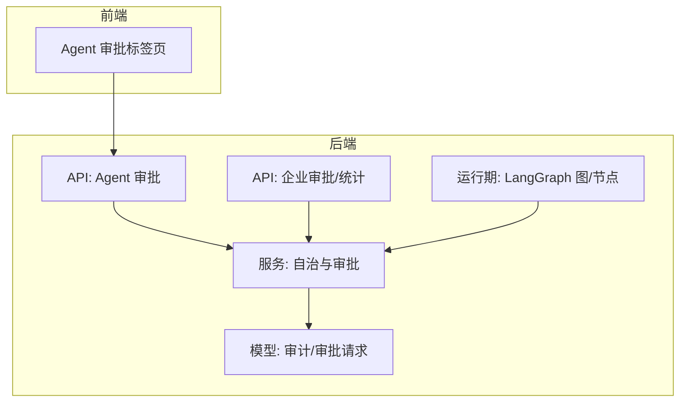
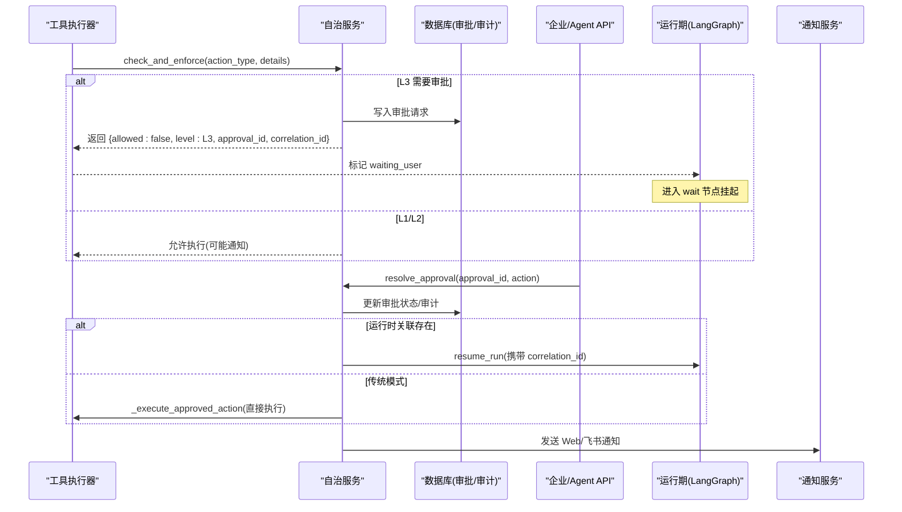
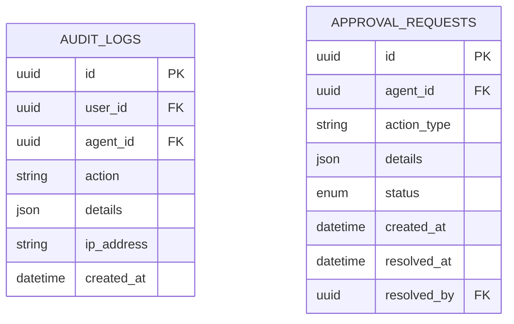
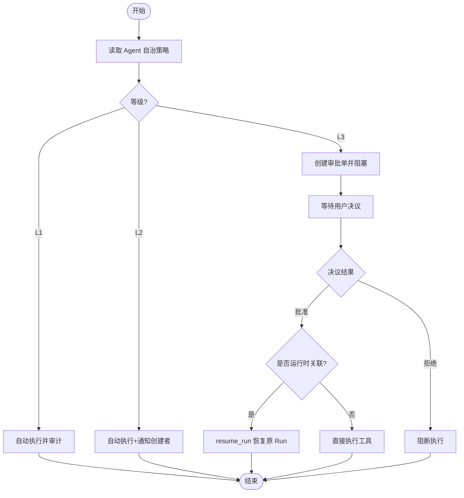
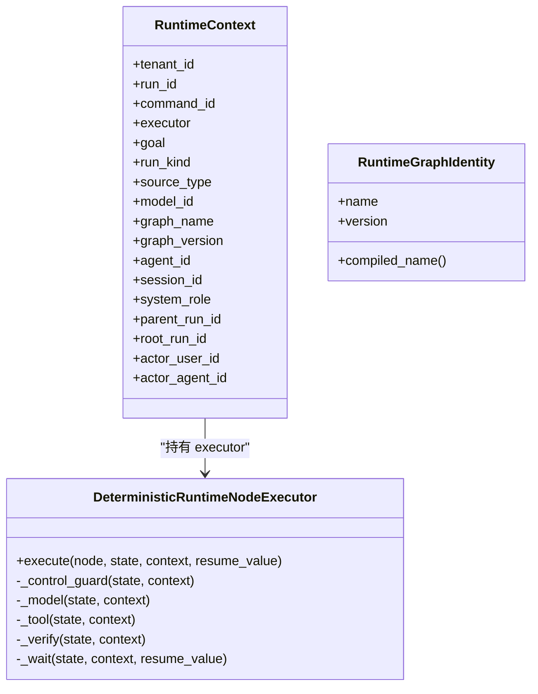
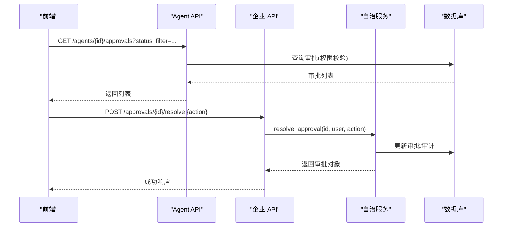
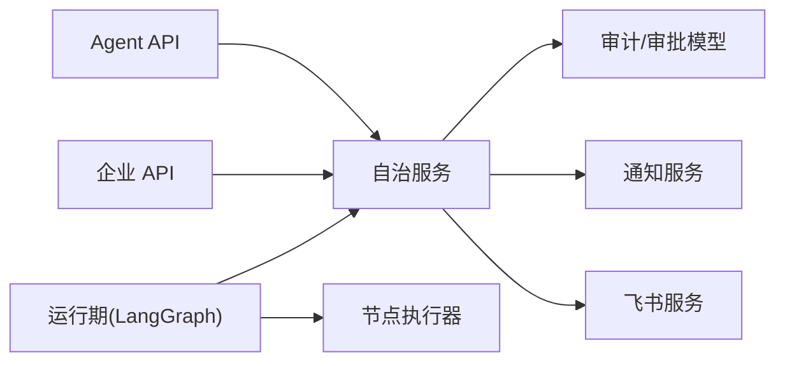

# 审批工作流

<cite>
**本文引用的文件**   
- [backend/app/models/audit.py](file://backend/app/models/audit.py)
- [backend/app/services/autonomy_service.py](file://backend/app/services/autonomy_service.py)
- [backend/app/api/agents.py](file://backend/app/api/agents.py)
- [backend/app/api/enterprise.py](file://backend/app/api/enterprise.py)
- [backend/app/api/advanced.py](file://backend/app/api/advanced.py)
- [backend/app/services/agent_runtime/tool_step_service.py](file://backend/app/services/agent_runtime/tool_step_service.py)
- [backend/app/services/agent_runtime/node_executor.py](file://backend/app/services/agent_runtime/node_executor.py)
- [backend/app/services/agent_runtime/graph.py](file://backend/app/services/agent_runtime/graph.py)
- [backend/app/services/agent_runtime/state.py](file://backend/app/services/agent_runtime/state.py)
- [frontend/src/pages/agent-detail/tabs/ApprovalsTab.tsx](file://frontend/src/pages/agent-detail/tabs/ApprovalsTab.tsx)
</cite>

## 目录
1. [简介](#简介)
2. [项目结构](#项目结构)
3. [核心组件](#核心组件)
4. [架构总览](#架构总览)
5. [详细组件分析](#详细组件分析)
6. [依赖关系分析](#依赖关系分析)
7. [性能与可扩展性](#性能与可扩展性)
8. [故障排查指南](#故障排查指南)
9. [结论](#结论)
10. [附录：API 参考](#附录api-参考)

## 简介
本文件为 Clawith 审批工作流系统的技术文档，聚焦于“自治边界 + 审批”的运行时机制。系统通过三级自治策略（L1/L2/L3）控制 Agent 执行敏感操作，并在 L3 级别引入人工审批；同时提供企业级审批列表、审批决议、审计日志与统计面板，以及前端审批待办视图。该设计天然支持“多级审批”“会签审批”“条件分支”等复杂场景的扩展路径。

## 项目结构
- 后端服务层
  - 模型层：审计与审批请求持久化
  - 服务层：自治边界检查、审批创建与决议、通知与飞书卡片
  - API 层：Agent 维度与企业维度的审批查询与处理、统计接口
  - 运行期：LangGraph 驱动的确定性图执行、节点编排、等待恢复
- 前端界面
  - Agent 详情页中的“审批”标签页，展示待处理与已处理审批并支持状态筛选

图表来源
- [backend/app/models/audit.py](file://backend/app/models/audit.py)
- [backend/app/services/autonomy_service.py](file://backend/app/services/autonomy_service.py)
- [backend/app/api/agents.py](file://backend/app/api/agents.py)
- [backend/app/api/enterprise.py](file://backend/app/api/enterprise.py)
- [backend/app/services/agent_runtime/graph.py](file://backend/app/services/agent_runtime/graph.py)
- [frontend/src/pages/agent-detail/tabs/ApprovalsTab.tsx](file://frontend/src/pages/agent-detail/tabs/ApprovalsTab.tsx)

章节来源
- [backend/app/models/audit.py](file://backend/app/models/audit.py)
- [backend/app/services/autonomy_service.py](file://backend/app/services/autonomy_service.py)
- [backend/app/api/agents.py](file://backend/app/api/agents.py)
- [backend/app/api/enterprise.py](file://backend/app/api/enterprise.py)
- [backend/app/services/agent_runtime/graph.py](file://backend/app/services/agent_runtime/graph.py)
- [frontend/src/pages/agent-detail/tabs/ApprovalsTab.tsx](file://frontend/src/pages/agent-detail/tabs/ApprovalsTab.tsx)

## 核心组件
- 审批请求模型
  - 记录 agent_id、action_type、details、status、created_at、resolved_at、resolved_by 等字段，用于持久化 L3 审批单。
- 自治与审批服务
  - 根据 Agent 的 autonomy_policy 判定 L1/L2/L3；L3 时生成审批单并阻塞执行；支持“运行时关联”以恢复原 Run。
  - 决议后按场景直接执行工具或恢复原 Run，并发送通知（Web/飞书）。
- API 路由
  - Agent 维度：列出某 Agent 的审批、提交批准/拒绝。
  - 企业维度：按租户范围列出审批、统一决议、审计日志与统计。
- 运行期集成
  - 工具执行阶段遇到 L3 审批时返回“等待用户”意图，进入 wait 节点；审批通过后由调度器恢复对应 Run。

章节来源
- [backend/app/models/audit.py](file://backend/app/models/audit.py)
- [backend/app/services/autonomy_service.py](file://backend/app/services/autonomy_service.py)
- [backend/app/api/agents.py](file://backend/app/api/agents.py)
- [backend/app/api/enterprise.py](file://backend/app/api/enterprise.py)
- [backend/app/services/agent_runtime/tool_step_service.py](file://backend/app/services/agent_runtime/tool_step_service.py)
- [backend/app/services/agent_runtime/node_executor.py](file://backend/app/services/agent_runtime/node_executor.py)
- [backend/app/services/agent_runtime/graph.py](file://backend/app/services/agent_runtime/graph.py)

## 架构总览
下图展示了从“工具调用触发自治检查”到“审批创建/决议/恢复执行”的端到端流程。

图表来源
- [backend/app/services/autonomy_service.py](file://backend/app/services/autonomy_service.py)
- [backend/app/api/agents.py](file://backend/app/api/agents.py)
- [backend/app/api/enterprise.py](file://backend/app/api/enterprise.py)
- [backend/app/services/agent_runtime/tool_step_service.py](file://backend/app/services/agent_runtime/tool_step_service.py)
- [backend/app/services/agent_runtime/node_executor.py](file://backend/app/services/agent_runtime/node_executor.py)
- [backend/app/services/agent_runtime/graph.py](file://backend/app/services/agent_runtime/graph.py)

## 详细组件分析

### 数据模型：审计与审批请求
- 审计日志：记录所有关键操作的轨迹，便于追溯与合规。
- 审批请求：承载 L3 审批上下文（动作类型、详情、状态、时间戳、处理人）。

图表来源
- [backend/app/models/audit.py](file://backend/app/models/audit.py)

章节来源
- [backend/app/models/audit.py](file://backend/app/models/audit.py)

### 自治边界与审批服务
- 三级自治策略
  - L1：自动执行并记录审计。
  - L2：自动执行并通知创建者（Web/飞书）。
  - L3：创建审批单并阻塞执行，直到被批准或拒绝。
- 运行时关联恢复
  - 当 details.runtime_scope 包含 run_id、tool_call_id 时，使用确定性 ID 关联审批与原始 Run；决议后通过 resume_run 精确恢复。
- 决议后的执行
  - 若为运行时关联：恢复原 Run。
  - 否则：直接调用工具执行器执行被批准的 Action。

图表来源
- [backend/app/services/autonomy_service.py](file://backend/app/services/autonomy_service.py)

章节来源
- [backend/app/services/autonomy_service.py](file://backend/app/services/autonomy_service.py)

### 运行期节点与等待恢复
- 节点类型
  - control_guard、compact、model、tool、verify、wait、terminal。
- 等待与恢复
  - 工具执行阶段若需要 L3 审批，则返回 waiting_user 意图，进入 wait 节点；审批通过后通过 resume_value 恢复。
- 确定性流转
  - 基于 checkpoint 中的 lifecycle 决定下一步路由，确保可重放与一致性。

图表来源
- [backend/app/services/agent_runtime/state.py](file://backend/app/services/agent_runtime/state.py)
- [backend/app/services/agent_runtime/node_executor.py](file://backend/app/services/agent_runtime/node_executor.py)
- [backend/app/services/agent_runtime/graph.py](file://backend/app/services/agent_runtime/graph.py)

章节来源
- [backend/app/services/agent_runtime/node_executor.py](file://backend/app/services/agent_runtime/node_executor.py)
- [backend/app/services/agent_runtime/graph.py](file://backend/app/services/agent_runtime/graph.py)
- [backend/app/services/agent_runtime/state.py](file://backend/app/services/agent_runtime/state.py)

### API：Agent 与企业审批
- Agent 维度
  - 列出某 Agent 的审批（仅创建者或管理员可见），支持按状态过滤。
  - 提交批准/拒绝，调用自治服务完成状态更新与后续处理。
- 企业维度
  - 按租户范围列出审批，批量加载 Agent 名称，支持按状态过滤。
  - 统一决议接口，返回标准化响应体。
  - 审计日志查询（管理员）、企业统计（含审批数量）。

图表来源
- [backend/app/api/agents.py](file://backend/app/api/agents.py)
- [backend/app/api/enterprise.py](file://backend/app/api/enterprise.py)
- [backend/app/services/autonomy_service.py](file://backend/app/services/autonomy_service.py)

章节来源
- [backend/app/api/agents.py](file://backend/app/api/agents.py)
- [backend/app/api/enterprise.py](file://backend/app/api/enterprise.py)

### 前端：审批标签页
- 展示待处理与已处理审批，按状态着色显示。
- 支持按状态筛选，点击可跳转至审批详情或相关页面。

章节来源
- [frontend/src/pages/agent-detail/tabs/ApprovalsTab.tsx](file://frontend/src/pages/agent-detail/tabs/ApprovalsTab.tsx)

## 依赖关系分析
- 模块耦合
  - 自治服务依赖模型（审批/审计）、通知服务、飞书通道配置。
  - 运行期通过 executor 抽象解耦具体节点实现，便于扩展。
  - API 层对自治服务进行封装，屏蔽业务细节。
- 外部依赖
  - LangGraph 作为图引擎，提供断点、恢复与重试能力。
  - 数据库用于持久化审批与审计。
  - 飞书用于消息与审批卡片推送。

图表来源
- [backend/app/services/autonomy_service.py](file://backend/app/services/autonomy_service.py)
- [backend/app/api/agents.py](file://backend/app/api/agents.py)
- [backend/app/api/enterprise.py](file://backend/app/api/enterprise.py)
- [backend/app/services/agent_runtime/node_executor.py](file://backend/app/services/agent_runtime/node_executor.py)
- [backend/app/services/agent_runtime/graph.py](file://backend/app/services/agent_runtime/graph.py)

章节来源
- [backend/app/services/autonomy_service.py](file://backend/app/services/autonomy_service.py)
- [backend/app/api/agents.py](file://backend/app/api/agents.py)
- [backend/app/api/enterprise.py](file://backend/app/api/enterprise.py)
- [backend/app/services/agent_runtime/node_executor.py](file://backend/app/services/agent_runtime/node_executor.py)
- [backend/app/services/agent_runtime/graph.py](file://backend/app/services/agent_runtime/graph.py)

## 性能与可扩展性
- 性能特性
  - 确定性图执行与 checkpoint 保证可重放与幂等恢复。
  - 工具执行具备重试策略（如安全读的最大重试次数）。
  - 审计与审批查询支持分页与索引优化（created_at 索引）。
- 可扩展建议
  - 新增节点类型：在节点执行器中注册新节点，并在图中添加边与路由。
  - 自定义审批规则：扩展自治策略映射（例如按租户/角色/资源维度动态计算等级）。
  - 多级审批与会签：在自治服务中增加审批层级与会签计数逻辑，结合运行时恢复实现串行/并行审批。
  - 外部审批系统集成：通过通知与回调机制对接第三方审批平台，将决议回写至本地审批表并触发 resume_run。

[本节为通用指导，不直接分析具体文件]

## 故障排查指南
- 常见问题定位
  - 审批未恢复：检查 details.runtime_scope 是否包含有效的 run_id、tool_call_id 与 correlation_id。
  - 权限错误：确认调用者为 Agent 创建者或平台管理员。
  - 通知失败：核查飞书渠道配置与成员 external_id/open_id。
  - 运行期卡住：查看 wait 节点的 waiting_request 与 resume_value 是否正确传递。
- 日志与审计
  - 通过审计日志追踪自治检查与审批决议过程。
  - 企业统计接口可用于快速评估审批积压情况。

章节来源
- [backend/app/services/autonomy_service.py](file://backend/app/services/autonomy_service.py)
- [backend/app/api/enterprise.py](file://backend/app/api/enterprise.py)
- [backend/app/services/agent_runtime/tool_step_service.py](file://backend/app/services/agent_runtime/tool_step_service.py)
- [backend/app/services/agent_runtime/node_executor.py](file://backend/app/services/agent_runtime/node_executor.py)

## 结论
Clawith 的审批工作流以“自治边界 + 审批”为核心，结合 LangGraph 的确定性图执行与 checkpoint 机制，实现了高可靠、可恢复、可观测的审批闭环。当前版本已覆盖 L1/L2/L3 策略、运行时关联恢复、企业级审批管理与审计统计。未来可在多级审批、会签、条件分支与外部系统集成方面进一步扩展，以满足更复杂的业务流程需求。

[本节为总结性内容，不直接分析具体文件]

## 附录：API 参考
- Agent 审批
  - 获取 Agent 审批列表：GET /agents/{agent_id}/approvals?status_filter=...
  - 提交审批决议：POST /agents/{agent_id}/approvals/{approval_id}/resolve
- 企业审批与统计
  - 获取租户审批列表：GET /approvals?tenant_id=...&status_filter=...
  - 统一审批决议：POST /approvals/{approval_id}/resolve
  - 审计日志查询：GET /audit-logs?agent_id=...&tenant_id=...&limit=...
  - 企业统计：GET /stats?tenant_id=...

章节来源
- [backend/app/api/agents.py](file://backend/app/api/agents.py)
- [backend/app/api/enterprise.py](file://backend/app/api/enterprise.py)
- [backend/app/api/advanced.py](file://backend/app/api/advanced.py)