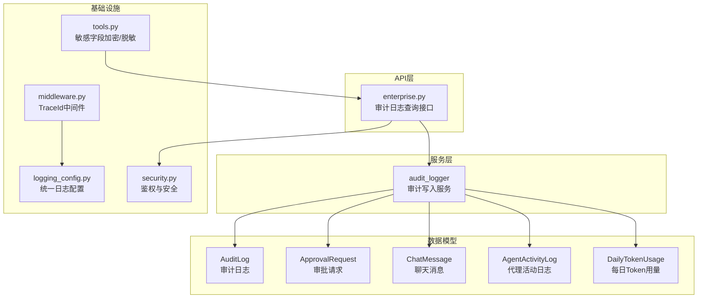
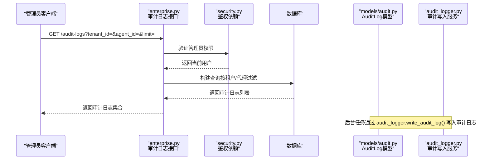
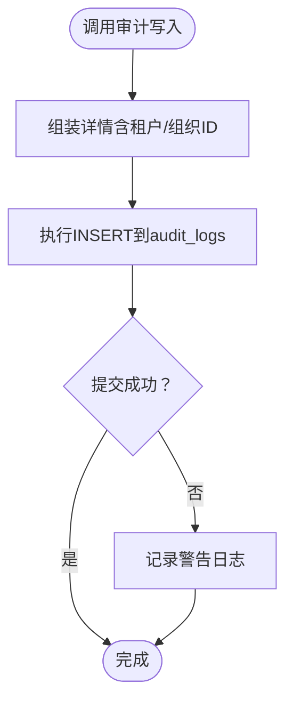
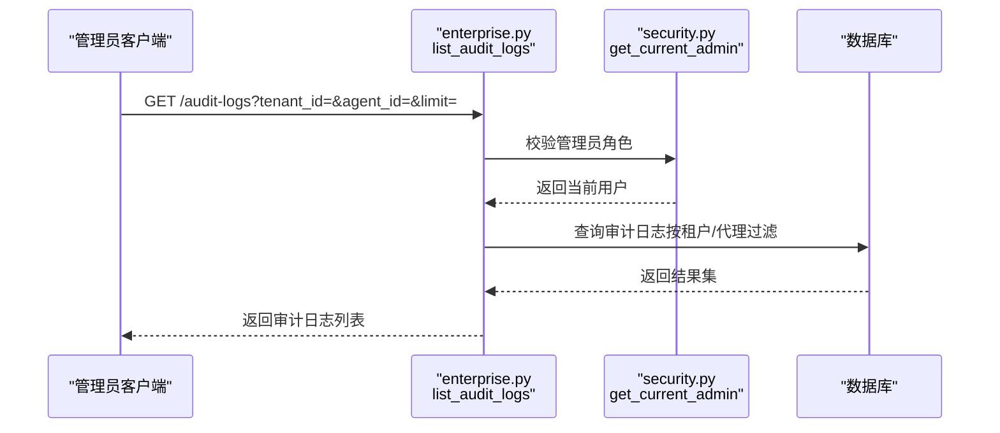
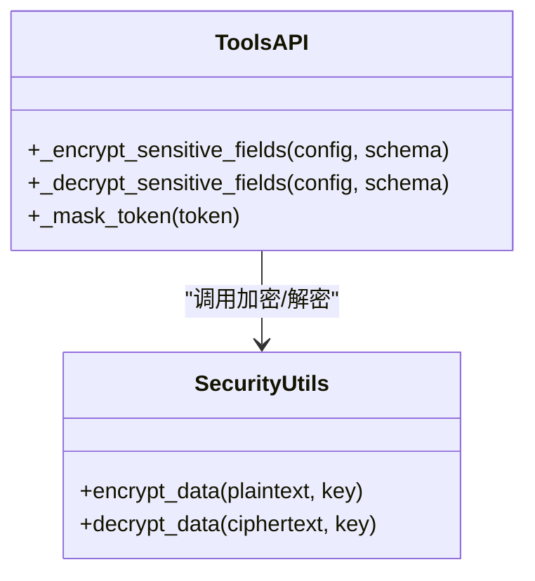
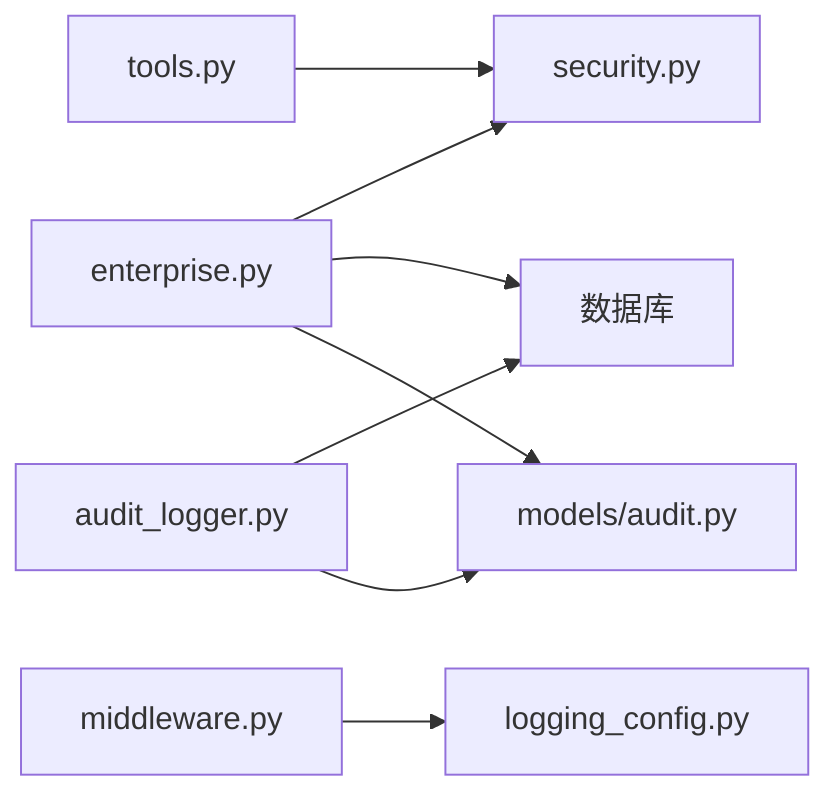

# 审计日志

<cite>
**本文引用的文件**   
- [backend/app/models/audit.py](file://backend/app/models/audit.py)
- [backend/app/services/audit_logger.py](file://backend/app/services/audit_logger.py)
- [backend/app/api/enterprise.py](file://backend/app/api/enterprise.py)
- [backend/app/core/logging_config.py](file://backend/app/core/logging_config.py)
- [backend/app/core/middleware.py](file://backend/app/core/middleware.py)
- [backend/app/core/security.py](file://backend/app/core/security.py)
- [backend/app/api/tools.py](file://backend/app/api/tools.py)
- [backend/app/models/activity_log.py](file://backend/app/models/activity_log.py)
</cite>

## 目录
1. [引言](#引言)
2. [项目结构](#项目结构)
3. [核心组件](#核心组件)
4. [架构总览](#架构总览)
5. [详细组件分析](#详细组件分析)
6. [依赖关系分析](#依赖关系分析)
7. [性能考量](#性能考量)
8. [故障排查指南](#故障排查指南)
9. [结论](#结论)
10. [附录](#附录)

## 引言
本文件为 Clawith 审计日志系统的技术文档，面向产品、研发与合规团队。内容涵盖设计原则、日志级别与分类、敏感信息脱敏策略、操作/访问/系统审计记录方式、存储与查询接口、导出能力、合规性支持（GDPR、SOX）、日志分析与告警、异常检测、规则定制与扩展、以及第三方系统集成方案。

## 项目结构
审计日志相关代码主要分布在以下模块：
- 数据模型层：审计日志、审批请求、聊天消息、企业信息等实体定义
- 服务层：统一的审计写入工具，提供多种场景的审计写入方法
- API 层：面向管理员的审计日志查询接口
- 基础设施：统一日志配置、请求追踪中间件、安全与鉴权
- 活动日志：数字员工行为记录与每日 Token 用量聚合

图表来源 
- [backend/app/models/audit.py:13-89](file://backend/app/models/audit.py#L13-L89)
- [backend/app/models/activity_log.py:13-57](file://backend/app/models/activity_log.py#L13-L57)
- [backend/app/services/audit_logger.py:16-215](file://backend/app/services/audit_logger.py#L16-L215)
- [backend/app/api/enterprise.py:670-689](file://backend/app/api/enterprise.py#L670-L689)
- [backend/app/core/logging_config.py:61-79](file://backend/app/core/logging_config.py#L61-L79)
- [backend/app/core/middleware.py:12-53](file://backend/app/core/middleware.py#L12-L53)
- [backend/app/core/security.py:153-204](file://backend/app/core/security.py#L153-L204)
- [backend/app/api/tools.py:140-339](file://backend/app/api/tools.py#L140-L339)

章节来源
- [backend/app/models/audit.py:13-89](file://backend/app/models/audit.py#L13-L89)
- [backend/app/models/activity_log.py:13-57](file://backend/app/models/activity_log.py#L13-L57)
- [backend/app/services/audit_logger.py:16-215](file://backend/app/services/audit_logger.py#L16-L215)
- [backend/app/api/enterprise.py:670-689](file://backend/app/api/enterprise.py#L670-L689)
- [backend/app/core/logging_config.py:61-79](file://backend/app/core/logging_config.py#L61-L79)
- [backend/app/core/middleware.py:12-53](file://backend/app/core/middleware.py#L12-L53)
- [backend/app/core/security.py:153-204](file://backend/app/core/security.py#L153-L204)
- [backend/app/api/tools.py:140-339](file://backend/app/api/tools.py#L140-L339)

## 核心组件
- 审计日志模型（AuditLog）：记录用户/代理的操作动作、上下文详情、IP 与时间戳，作为全量操作审计的核心表。
- 审批请求模型（ApprovalRequest）：用于高自主度操作的审批流状态跟踪。
- 聊天消息模型（ChatMessage）：统一聊天底座的会话消息记录，便于对话审计与回溯。
- 代理活动日志（AgentActivityLog）：记录数字员工的动作类型、摘要与详情，支撑操作审计与行为分析。
- 每日 Token 用量（DailyTokenUsage）：按天聚合的 Token 消耗指标，用于成本与使用趋势分析。
- 审计写入服务（audit_logger）：封装标准审计动作枚举与写入逻辑，支持身份、角色、租户等场景。
- 审计查询接口（enterprise.py）：管理员可基于租户与代理维度分页查询审计日志。
- 统一日志配置（logging_config）：集中式 loguru 配置，注入 trace_id，屏蔽噪音日志。
- 请求追踪中间件（middleware）：注入并透传 X-Trace-Id，记录请求耗时与状态码。
- 安全与鉴权（security）：JWT、密码哈希、角色校验，保障审计数据的访问控制。
- 敏感字段处理（tools.py）：对配置中的敏感键进行加密存储与展示脱敏。

章节来源
- [backend/app/models/audit.py:13-89](file://backend/app/models/audit.py#L13-L89)
- [backend/app/models/activity_log.py:13-57](file://backend/app/models/activity_log.py#L13-L57)
- [backend/app/services/audit_logger.py:16-215](file://backend/app/services/audit_logger.py#L16-L215)
- [backend/app/api/enterprise.py:670-689](file://backend/app/api/enterprise.py#L670-L689)
- [backend/app/core/logging_config.py:61-79](file://backend/app/core/logging_config.py#L61-L79)
- [backend/app/core/middleware.py:12-53](file://backend/app/core/middleware.py#L12-L53)
- [backend/app/core/security.py:153-204](file://backend/app/core/security.py#L153-L204)
- [backend/app/api/tools.py:140-339](file://backend/app/api/tools.py#L140-L339)

## 架构总览
审计日志系统采用“写入服务 + 数据模型 + API 查询”的分层架构，结合统一日志与追踪中间件，形成端到端的可观测性与合规性能力。

图表来源 
- [backend/app/api/enterprise.py:670-689](file://backend/app/api/enterprise.py#L670-L689)
- [backend/app/core/security.py:153-204](file://backend/app/core/security.py#L153-L204)
- [backend/app/models/audit.py:13-89](file://backend/app/models/audit.py#L13-L89)
- [backend/app/services/audit_logger.py:68-215](file://backend/app/services/audit_logger.py#L68-L215)

## 详细组件分析

### 数据模型与存储策略
- AuditLog：包含 id、user_id、agent_id、action、details（JSON）、ip_address、created_at。适合操作审计与访问审计。
- ApprovalRequest：包含 agent_id、action_type、details、status、resolved_by、resolved_at，支撑高自主度操作的审批闭环。
- ChatMessage：包含 role、content、conversation_id、participant_id、thinking、mentions，支撑对话审计与回溯。
- AgentActivityLog：包含 action_type（枚举）、summary、detail_json、related_id、created_at，支撑代理行为审计。
- DailyTokenUsage：按 tenant_id、agent_id、date 聚合 tokens_used/input_tokens/output_tokens/cache_read_tokens/cache_creation_tokens/estimated_tokens，支撑用量统计。

存储策略要点：
- 使用 PostgreSQL JSON/JSONB 存储非结构化详情，提升扩展性。
- created_at 带时区，便于跨时区审计与合规报告。
- 关键索引：created_at、agent_id、conversation_id 等，优化查询性能。

章节来源
- [backend/app/models/audit.py:13-89](file://backend/app/models/audit.py#L13-L89)
- [backend/app/models/activity_log.py:13-57](file://backend/app/models/activity_log.py#L13-L57)

### 审计写入服务与日志级别
- 标准动作枚举（AuditAction）：覆盖认证、身份、用户、租户、角色、组织同步、代理生命周期等。
- 写入函数：write_audit_log、write_identity_audit_log、write_role_audit_log、write_tenant_audit_log，均通过 _write_log 统一落库。
- 错误隔离：写入失败仅记录警告，不中断调用方业务。
- 日志级别：审计写入本身使用 loguru 输出警告；业务日志由 logging_config 统一格式与过滤。

图表来源 
- [backend/app/services/audit_logger.py:68-215](file://backend/app/services/audit_logger.py#L68-L215)

章节来源
- [backend/app/services/audit_logger.py:16-215](file://backend/app/services/audit_logger.py#L16-L215)
- [backend/app/core/logging_config.py:61-79](file://backend/app/core/logging_config.py#L61-L79)

### 审计查询接口与权限控制
- 接口：GET /audit-logs，支持按 tenant_id、agent_id、limit 过滤。
- 权限：仅管理员可访问，依赖 security.get_current_admin。
- 数据范围：按租户隔离，仅返回该租户下代理的审计日志。

图表来源 
- [backend/app/api/enterprise.py:670-689](file://backend/app/api/enterprise.py#L670-L689)
- [backend/app/core/security.py:199-204](file://backend/app/core/security.py#L199-L204)

章节来源
- [backend/app/api/enterprise.py:670-689](file://backend/app/api/enterprise.py#L670-L689)
- [backend/app/core/security.py:199-204](file://backend/app/core/security.py#L199-L204)

### 敏感信息脱敏策略
- 工具配置敏感字段：在更新与读取流程中，对敏感键进行加密存储与展示脱敏。
- 展示脱敏：对外暴露的 API 响应中，对密钥类字段进行掩码处理（如保留后四位）。
- 加密存储：使用 AES 对称加密，结合 IV 与 Base64 编码，确保存储安全。

图表来源 
- [backend/app/api/tools.py:140-339](file://backend/app/api/tools.py#L140-L339)
- [backend/app/core/security.py:54-123](file://backend/app/core/security.py#L54-L123)

章节来源
- [backend/app/api/tools.py:140-339](file://backend/app/api/tools.py#L140-L339)
- [backend/app/core/security.py:54-123](file://backend/app/core/security.py#L54-L123)

### 操作审计、访问审计、系统审计
- 操作审计：通过 AuditAction 枚举与 write_* 系列函数记录用户/代理的关键操作（创建、更新、删除、启动、停止等）。
- 访问审计：通过 middleware.TraceIdMiddleware 记录 HTTP 请求路径、客户端 IP、状态码与耗时，结合 logging_config 统一格式。
- 系统审计：服务启动、触发器执行、心跳等事件通过 audit_logger 写入审计日志，便于系统级回溯。

章节来源
- [backend/app/services/audit_logger.py:16-215](file://backend/app/services/audit_logger.py#L16-L215)
- [backend/app/core/middleware.py:12-53](file://backend/app/core/middleware.py#L12-L53)
- [backend/app/core/logging_config.py:61-79](file://backend/app/core/logging_config.py#L61-L79)

### 日志存储策略与查询接口
- 存储：PostgreSQL，使用 JSON/JSONB 存储详情，created_at 带时区，关键列建立索引。
- 查询：enterprise.py 提供 /audit-logs 接口，支持租户与代理维度过滤，限制返回数量。
- 导出：当前未实现直接导出功能，可通过外部 ETL 或数据库直连导出 CSV/JSON。

章节来源
- [backend/app/models/audit.py:13-89](file://backend/app/models/audit.py#L13-L89)
- [backend/app/api/enterprise.py:670-689](file://backend/app/api/enterprise.py#L670-L689)

### 合规性要求支持（GDPR、SOX）
- GDPR：支持最小化采集（details 按需记录）、可删除（审计日志可归档或删除）、可追溯（trace_id 贯穿请求链路）。
- SOX：强权限控制（仅管理员可访问审计日志）、不可篡改（审计日志只增不改）、完整轨迹（操作人、时间、IP、详情）。
- 建议：增加数据保留策略（如 180 天滚动清理）、导出审计报表（CSV/Excel）以满足内审与外审需求。

[本节为概念性说明，不直接分析具体文件]

### 日志分析工具、告警规则、异常检测
- 分析工具：建议使用 ELK/ClickHouse 等日志平台，基于 created_at、action、agent_id、user_id 进行多维分析。
- 告警规则：针对 login_failed、identity_delete、role_revoke 等高敏动作设置阈值告警。
- 异常检测：基于 DailyTokenUsage 的突增检测、AgentActivityLog 的错误频率监控。

[本节为概念性说明，不直接分析具体文件]

### 定制审计规则、扩展日志格式、集成第三方日志系统
- 定制规则：在 audit_logger.AuditAction 中新增枚举，并在业务入口调用对应 write_* 函数。
- 扩展格式：details 字段为 JSON，可按需扩展键值对，保持向后兼容。
- 第三方集成：通过 logging_config 将标准日志接入 loguru，并可对接外部日志服务（如阿里云日志、Sentry）。

章节来源
- [backend/app/services/audit_logger.py:16-215](file://backend/app/services/audit_logger.py#L16-L215)
- [backend/app/core/logging_config.py:61-79](file://backend/app/core/logging_config.py#L61-L79)

## 依赖关系分析
审计日志系统依赖关系如下：
- API 层依赖安全鉴权与数据库访问
- 服务层依赖数据库会话与 SQL 执行
- 数据模型依赖 SQLAlchemy ORM
- 基础设施依赖 loguru 与 ContextVar 传递 trace_id

图表来源 
- [backend/app/api/enterprise.py:670-689](file://backend/app/api/enterprise.py#L670-L689)
- [backend/app/core/security.py:153-204](file://backend/app/core/security.py#L153-L204)
- [backend/app/models/audit.py:13-89](file://backend/app/models/audit.py#L13-L89)
- [backend/app/services/audit_logger.py:68-215](file://backend/app/services/audit_logger.py#L68-L215)
- [backend/app/core/middleware.py:12-53](file://backend/app/core/middleware.py#L12-L53)
- [backend/app/core/logging_config.py:61-79](file://backend/app/core/logging_config.py#L61-L79)
- [backend/app/api/tools.py:140-339](file://backend/app/api/tools.py#L140-L339)

章节来源
- [backend/app/api/enterprise.py:670-689](file://backend/app/api/enterprise.py#L670-L689)
- [backend/app/core/security.py:153-204](file://backend/app/core/security.py#L153-L204)
- [backend/app/models/audit.py:13-89](file://backend/app/models/audit.py#L13-L89)
- [backend/app/services/audit_logger.py:68-215](file://backend/app/services/audit_logger.py#L68-L215)
- [backend/app/core/middleware.py:12-53](file://backend/app/core/middleware.py#L12-L53)
- [backend/app/core/logging_config.py:61-79](file://backend/app/core/logging_config.py#L61-L79)
- [backend/app/api/tools.py:140-339](file://backend/app/api/tools.py#L140-L339)

## 性能考量
- 写入性能：使用 raw SQL 插入避免 ORM 解析开销，适合高并发后台任务。
- 查询性能：created_at、agent_id、conversation_id 等索引优化常见查询路径。
- 日志吞吐：loguru 异步队列与 backtrace 开启，注意生产环境合理配置队列大小与丢弃策略。
- 内存占用：details JSON 字段可能较大，建议定期归档与压缩。

[本节为通用指导，不直接分析具体文件]

## 故障排查指南
- 审计写入失败：检查数据库连接与权限，查看 audit_logger 的警告日志。
- 审计日志缺失：确认业务入口是否调用 write_* 函数，检查事务提交。
- 权限问题：确认调用者角色是否为管理员，检查 security.get_current_admin。
- 敏感字段泄露：检查 tools.py 的加密与脱敏逻辑是否正确应用。

章节来源
- [backend/app/services/audit_logger.py:186-215](file://backend/app/services/audit_logger.py#L186-L215)
- [backend/app/core/security.py:199-204](file://backend/app/core/security.py#L199-L204)
- [backend/app/api/tools.py:140-339](file://backend/app/api/tools.py#L140-L339)

## 结论
Clawith 审计日志系统以清晰的分层架构、标准化的动作枚举、严格的权限控制与灵活的 JSON 详情字段，满足操作、访问与系统审计的核心需求。结合统一日志配置与追踪中间件，具备可扩展的合规性与可观测性能力。建议后续增强导出功能、数据保留策略与告警规则，以更好地支持 GDPR、SOX 等法规要求。

[本节为总结性内容，不直接分析具体文件]

## 附录
- 常用审计动作枚举：login、login_failed、logout、sso_login、sso_login_failed、identity_bind、identity_unbind、identity_create、identity_delete、user_create、user_update、user_delete、user_activate、user_deactivate、tenant_create、tenant_update、tenant_delete、tenant_join、tenant_leave、role_assign、role_revoke、role_create、role_update、role_delete、org_sync、org_department_create、org_department_update、org_member_create、org_member_update、agent_create、agent_update、agent_delete、agent_start、agent_stop。
- 审计日志字段：id、user_id、agent_id、action、details、ip_address、created_at。
- 活动日志字段：id、agent_id、action_type、summary、detail_json、related_id、created_at。
- 每日 Token 用量字段：id、tenant_id、agent_id、date、tokens_used、input_tokens、output_tokens、cache_read_tokens、cache_creation_tokens、estimated_tokens、created_at、updated_at。

章节来源
- [backend/app/services/audit_logger.py:16-215](file://backend/app/services/audit_logger.py#L16-L215)
- [backend/app/models/audit.py:13-89](file://backend/app/models/audit.py#L13-L89)
- [backend/app/models/activity_log.py:13-57](file://backend/app/models/activity_log.py#L13-L57)