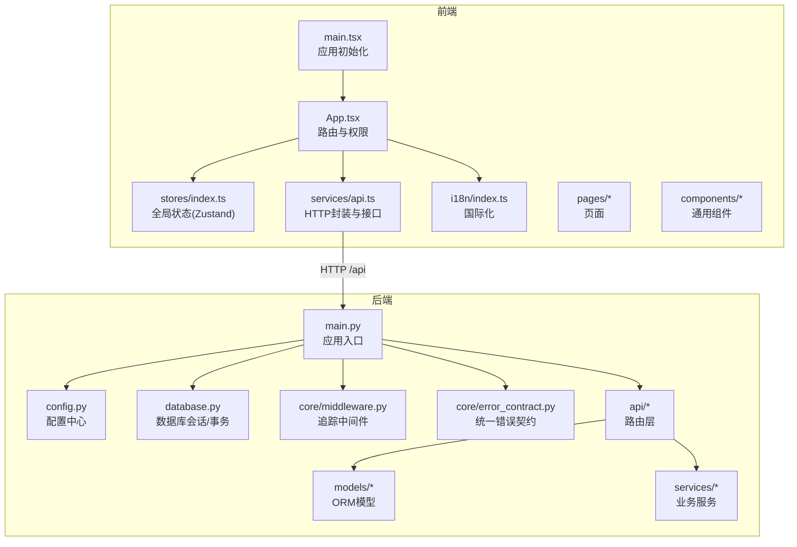
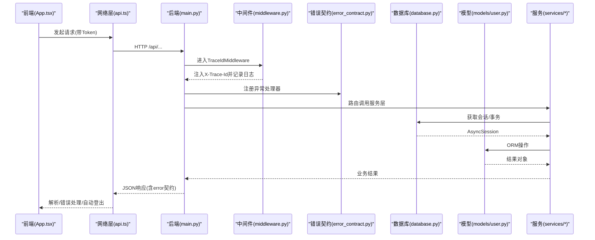
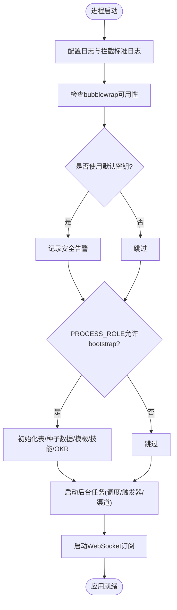
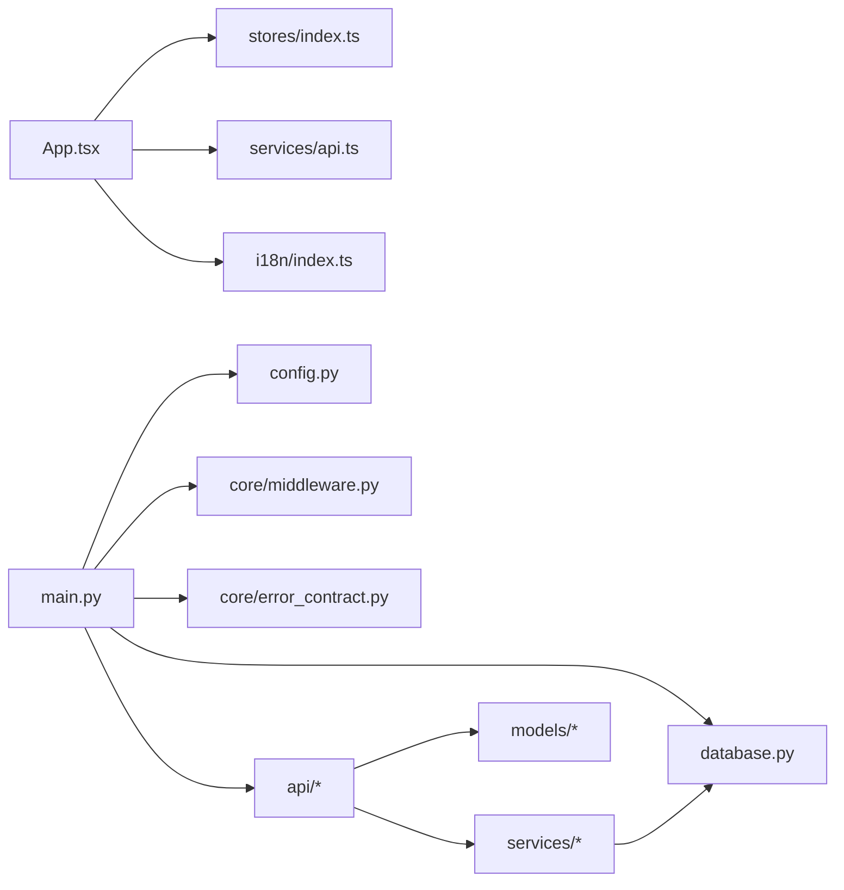

# 代码结构说明

<cite>
**本文引用的文件**   
- [backend/app/main.py](file://backend/app/main.py)
- [backend/app/config.py](file://backend/app/config.py)
- [backend/app/database.py](file://backend/app/database.py)
- [backend/app/core/middleware.py](file://backend/app/core/middleware.py)
- [backend/app/core/error_contract.py](file://backend/app/core/error_contract.py)
- [backend/app/api/auth.py](file://backend/app/api/auth.py)
- [backend/app/models/user.py](file://backend/app/models/user.py)
- [frontend/src/main.tsx](file://frontend/src/main.tsx)
- [frontend/src/App.tsx](file://frontend/src/App.tsx)
- [frontend/src/stores/index.ts](file://frontend/src/stores/index.ts)
- [frontend/src/services/api.ts](file://frontend/src/services/api.ts)
- [frontend/src/i18n/index.ts](file://frontend/src/i18n/index.ts)
</cite>

## 目录
1. [简介](#简介)
2. [项目结构](#项目结构)
3. [核心组件](#核心组件)
4. [架构总览](#架构总览)
5. [详细组件分析](#详细组件分析)
6. [依赖关系分析](#依赖关系分析)
7. [性能考虑](#性能考虑)
8. [故障排查指南](#故障排查指南)
9. [结论](#结论)
10. [附录](#附录)

## 简介
本文件面向开发者，系统化梳理 Clawith 项目的代码结构与组织方式，覆盖后端 FastAPI 应用（api、models、services、core 等模块职责）与前端 React 应用（pages、components、stores、i18n 等）。文档重点解释：
- 核心入口文件的作用与启动流程
- 前后端模块间的依赖关系与数据流向
- 命名规范、文件组织原则与分层架构
- 常见问题的定位与排障建议

## 项目结构
Clawith 采用前后端分离的仓库布局：
- backend：FastAPI 后端服务，包含 API 路由、领域模型、服务层、核心基础设施（配置、数据库、中间件、错误契约等）
- frontend：React + TypeScript 前端应用，包含页面、组件、状态管理、国际化、网络请求封装等
- deploy/helm：部署与容器编排相关配置
- 其他根级脚本与文档

图表来源
- [backend/app/main.py:1-120](file://backend/app/main.py#L1-L120)
- [backend/app/config.py:79-120](file://backend/app/config.py#L79-L120)
- [backend/app/database.py:14-22](file://backend/app/database.py#L14-L22)
- [backend/app/core/middleware.py:12-30](file://backend/app/core/middleware.py#L12-L30)
- [backend/app/core/error_contract.py:224-229](file://backend/app/core/error_contract.py#L224-L229)
- [frontend/src/main.tsx:17-37](file://frontend/src/main.tsx#L17-L37)
- [frontend/src/App.tsx:272-306](file://frontend/src/App.tsx#L272-L306)
- [frontend/src/stores/index.ts:15-34](file://frontend/src/stores/index.ts#L15-34)
- [frontend/src/services/api.ts:11-45](file://frontend/src/services/api.ts#L11-L45)
- [frontend/src/i18n/index.ts:7-28](file://frontend/src/i18n/index.ts#L7-L28)

章节来源
- [backend/app/main.py:1-120](file://backend/app/main.py#L1-L120)
- [frontend/src/main.tsx:17-37](file://frontend/src/main.tsx#L17-L37)

## 核心组件
- 后端入口与生命周期
  - main.py 定义 FastAPI 应用实例、注册中间件、挂载所有 API Router、健康检查与版本接口；lifespan 钩子负责日志、数据库表初始化、种子数据、后台任务（调度器、触发器、渠道连接器等）、WebSocket 订阅等。
- 配置中心
  - config.py 使用 Pydantic Settings 集中管理环境变量与默认值，提供 get_settings() 缓存与沙箱配置构造。
- 数据库与事务
  - database.py 提供异步引擎、会话工厂、Base 声明式基类、get_db 依赖注入与 transaction 上下文管理器，支持跨调用链共享会话。
- 中间件与错误契约
  - core/middleware.py 实现 TraceIdMiddleware，注入并透传 X-Trace-Id，记录请求耗时与响应码。
  - core/error_contract.py 统一 HTTP 异常、校验异常与未处理异常的返回体结构，保证 trace_id 一致性与安全字段输出。
- 认证路由示例
  - api/auth.py 展示鉴权、注册、多租户切换等典型路由与依赖注入模式。
- ORM 模型示例
  - models/user.py 定义 Identity 与 User 实体及关联关系，体现多租户与身份解耦设计。
- 前端入口与路由
  - main.tsx 初始化 i18n、主题、错误边界、查询客户端、路由与 Provider 树。
  - App.tsx 定义受保护路由、企业设置访问控制、通知栏逻辑与懒加载页面。
- 前端状态管理
  - stores/index.ts 使用 Zustand 维护用户认证与应用 UI 状态，持久化 token 与侧边栏折叠态。
- 前端网络层
  - services/api.ts 封装 fetch 请求、上传进度、统一错误解析、自动登出与 Token 注入。
- 前端国际化
  - i18n/index.ts 基于 i18next 配置语言检测、资源与回退策略。

章节来源
- [backend/app/main.py:352-471](file://backend/app/main.py#L352-L471)
- [backend/app/config.py:79-120](file://backend/app/config.py#L79-L120)
- [backend/app/database.py:30-42](file://backend/app/database.py#L30-L42)
- [backend/app/core/middleware.py:12-30](file://backend/app/core/middleware.py#L12-L30)
- [backend/app/core/error_contract.py:224-229](file://backend/app/core/error_contract.py#L224-L229)
- [backend/app/api/auth.py:43-50](file://backend/app/api/auth.py#L43-L50)
- [backend/app/models/user.py:16-50](file://backend/app/models/user.py#L16-L50)
- [frontend/src/main.tsx:17-37](file://frontend/src/main.tsx#L17-L37)
- [frontend/src/App.tsx:272-306](file://frontend/src/App.tsx#L272-L306)
- [frontend/src/stores/index.ts:15-34](file://frontend/src/stores/index.ts#L15-34)
- [frontend/src/services/api.ts:11-45](file://frontend/src/services/api.ts#L11-L45)
- [frontend/src/i18n/index.ts:7-28](file://frontend/src/i18n/index.ts#L7-L28)

## 架构总览
整体采用“前端 SPA + 后端 REST/WebSocket”的分层架构：
- 前端通过 services/api.ts 发起 HTTP 请求，携带 Bearer Token，统一错误处理与自动登出
- 后端由 main.py 统一挂载路由，中间件贯穿请求链路，错误契约保障一致的响应结构
- 数据层通过 database.py 的异步会话与事务管理，配合 models/* 的 ORM 映射
- 业务逻辑下沉至 services/*，按领域划分（如 agent_runtime、llm、storage_runtime、sandbox 等）

图表来源
- [frontend/src/App.tsx:272-306](file://frontend/src/App.tsx#L272-L306)
- [frontend/src/services/api.ts:11-45](file://frontend/src/services/api.ts#L11-L45)
- [backend/app/main.py:352-471](file://backend/app/main.py#L352-L471)
- [backend/app/core/middleware.py:12-30](file://backend/app/core/middleware.py#L12-L30)
- [backend/app/core/error_contract.py:224-229](file://backend/app/core/error_contract.py#L224-L229)
- [backend/app/database.py:30-42](file://backend/app/database.py#L30-L42)
- [backend/app/models/user.py:16-50](file://backend/app/models/user.py#L16-L50)

## 详细组件分析

### 后端入口与生命周期（main.py）
- 应用实例与中间件
  - 创建 FastAPI 实例，注册错误处理器、TraceIdMiddleware、CORS
  - 挂载大量 API Router，统一前缀 settings.API_PREFIX
- 生命周期钩子 lifespan
  - 初始化日志、环境安全检查（默认密钥警告）
  - 根据 PROCESS_ROLE 决定是否执行 bootstrap（建表、种子数据、模板/技能/OKR Agent 初始化）
  - 启动后台任务：调度器、触发器、各渠道连接器（飞书、钉钉、企微、微信、Discord）
  - 启动 ss-local SOCKS5 代理（可选，用于 Discord）
  - 启动 WebSocket 实时通道订阅
- 健康检查与版本接口
  - /api/health 返回运行状态与版本
  - /api/version 读取构建版本与提交哈希

图表来源
- [backend/app/main.py:121-195](file://backend/app/main.py#L121-L195)
- [backend/app/main.py:283-350](file://backend/app/main.py#L283-L350)
- [backend/app/main.py:473-513](file://backend/app/main.py#L473-L513)

章节来源
- [backend/app/main.py:121-195](file://backend/app/main.py#L121-L195)
- [backend/app/main.py:283-350](file://backend/app/main.py#L283-L350)
- [backend/app/main.py:473-513](file://backend/app/main.py#L473-L513)

### 配置中心（config.py）
- 使用 BaseSettings 集中管理环境变量，涵盖数据库、Redis、JWT、存储、Agent Runtime、沙箱、代理等
- 提供 get_settings() 缓存与 get_sandbox_config() 构造沙箱配置
- 内置容器检测、路径推断、版本读取等辅助函数

章节来源
- [backend/app/config.py:79-120](file://backend/app/config.py#L79-L120)
- [backend/app/config.py:244-268](file://backend/app/config.py#L244-L268)

### 数据库与事务（database.py）
- 异步引擎与会话工厂，池大小与溢出配置
- get_db 依赖注入，自动 commit/rollback
- transaction 上下文管理器支持嵌套复用会话

章节来源
- [backend/app/database.py:14-22](file://backend/app/database.py#L14-L22)
- [backend/app/database.py:30-42](file://backend/app/database.py#L30-L42)
- [backend/app/database.py:47-79](file://backend/app/database.py#L47-L79)

### 中间件与错误契约（middleware.py, error_contract.py）
- TraceIdMiddleware：从请求头提取或生成 trace_id，写入 request.state，并在响应头回写，记录请求/响应日志
- 错误契约：统一 HTTPException、RequestValidationError、未捕获异常的返回体结构，确保 trace_id 一致性，屏蔽敏感信息

章节来源
- [backend/app/core/middleware.py:12-30](file://backend/app/core/middleware.py#L12-L30)
- [backend/app/core/error_contract.py:224-229](file://backend/app/core/error_contract.py#L224-L229)
- [backend/app/core/error_contract.py:158-181](file://backend/app/core/error_contract.py#L158-L181)
- [backend/app/core/error_contract.py:184-202](file://backend/app/core/error_contract.py#L184-L202)
- [backend/app/core/error_contract.py:205-221](file://backend/app/core/error_contract.py#L205-L221)

### 认证路由示例（api/auth.py）
- 路由前缀 /auth，标签 auth
- 提供注册、登录、邮箱验证、密码重置、多租户切换等接口
- 使用依赖注入获取当前用户、事务上下文、DAO 层

章节来源
- [backend/app/api/auth.py:43-50](file://backend/app/api/auth.py#L43-L50)
- [backend/app/api/auth.py:114-136](file://backend/app/api/auth.py#L114-L136)

### ORM 模型示例（models/user.py）
- Identity：全局身份（邮箱/用户名/手机号），平台管理员标记，邮箱验证状态
- User：租户内成员，角色、配额、头像、职位等，关联 Identity 并通过 association_proxy 兼容旧字段

章节来源
- [backend/app/models/user.py:16-50](file://backend/app/models/user.py#L16-L50)
- [backend/app/models/user.py:52-119](file://backend/app/models/user.py#L52-L119)

### 前端入口与路由（main.tsx, App.tsx）
- main.tsx：初始化 i18n、主题、错误边界、QueryClient、BrowserRouter、Provider 树
- App.tsx：定义受保护路由、企业设置访问控制、通知栏、懒加载页面与路由映射

章节来源
- [frontend/src/main.tsx:17-37](file://frontend/src/main.tsx#L17-L37)
- [frontend/src/App.tsx:272-306](file://frontend/src/App.tsx#L272-L306)

### 前端状态管理（stores/index.ts）
- useAuthStore：维护 user、token，提供 setAuth、logout、isAuthenticated
- useAppStore：侧边栏折叠、选中 Agent ID，持久化到 localStorage

章节来源
- [frontend/src/stores/index.ts:15-34](file://frontend/src/stores/index.ts#L15-34)
- [frontend/src/stores/index.ts:43-53](file://frontend/src/stores/index.ts#L43-L53)

### 前端网络层（services/api.ts）
- request：统一 fetch 封装，自动注入 Authorization，401 自动登出，错误解析
- uploadFileWithProgress：XMLHttpRequest 上传进度回调，超时与取消处理
- 各业务 API 模块：authApi、agentApi、taskApi、fileApi、enterpriseApi、experienceApi 等

章节来源
- [frontend/src/services/api.ts:11-45](file://frontend/src/services/api.ts#L11-L45)
- [frontend/src/services/api.ts:78-128](file://frontend/src/services/api.ts#L78-L128)
- [frontend/src/services/api.ts:131-163](file://frontend/src/services/api.ts#L131-L163)

### 前端国际化（i18n/index.ts）
- 基于 i18next，配置 zh/en 资源，本地存储检测语言，回退 en

章节来源
- [frontend/src/i18n/index.ts:7-28](file://frontend/src/i18n/index.ts#L7-L28)

## 依赖关系分析
- 前端依赖
  - App.tsx 依赖 stores/index.ts（认证状态）、services/api.ts（HTTP 接口）、i18n/index.ts（国际化）
  - services/api.ts 依赖 types 与 apiError 工具
- 后端依赖
  - main.py 依赖 config.py、core/*、api/*、services/*、database.py
  - api/* 依赖 models/*、dao/*、services/*、database.py
  - services/* 依赖 database.py、models/*、外部系统（邮件、渠道、LLM、存储等）

图表来源
- [frontend/src/App.tsx:272-306](file://frontend/src/App.tsx#L272-L306)
- [frontend/src/stores/index.ts:15-34](file://frontend/src/stores/index.ts#L15-34)
- [frontend/src/services/api.ts:11-45](file://frontend/src/services/api.ts#L11-L45)
- [frontend/src/i18n/index.ts:7-28](file://frontend/src/i18n/index.ts#L7-L28)
- [backend/app/main.py:352-471](file://backend/app/main.py#L352-L471)
- [backend/app/config.py:79-120](file://backend/app/config.py#L79-L120)
- [backend/app/core/middleware.py:12-30](file://backend/app/core/middleware.py#L12-L30)
- [backend/app/core/error_contract.py:224-229](file://backend/app/core/error_contract.py#L224-L229)
- [backend/app/database.py:14-22](file://backend/app/database.py#L14-L22)

章节来源
- [backend/app/main.py:352-471](file://backend/app/main.py#L352-L471)
- [frontend/src/App.tsx:272-306](file://frontend/src/App.tsx#L272-L306)

## 性能考虑
- 后端
  - 数据库连接池：pool_size=20，max_overflow=10，避免连接耗尽
  - 异步会话与事务：减少阻塞，提升并发能力
  - 中间件与错误处理：轻量且尽早失败，避免不必要的 IO
  - 后台任务：调度器、触发器、渠道连接器独立启动，降低主线程压力
- 前端
  - 懒加载页面：按需加载，减小首屏体积
  - QueryClient 配置：减少重复请求，关闭窗口聚焦刷新
  - 上传进度：使用 XMLHttpRequest 提供实时反馈，提升用户体验

[本节为通用指导，不直接分析具体文件]

## 故障排查指南
- 追踪 ID 缺失或不一致
  - 检查 TraceIdMiddleware 是否正确注入 X-Trace-Id
  - 确认上游是否传递合法 trace_id（长度与字符集限制）
- 认证失败与自动登出
  - 前端 services/api.ts 在 401 时清除 token 并跳转登录
  - 检查后端 JWT 配置与过期时间
- 数据库事务异常
  - 使用 transaction 上下文确保 commit/rollback 正确
  - 检查 get_db 依赖注入是否在路由中正确使用
- 错误响应不一致
  - 确认已注册错误处理器，统一返回 error 对象结构
  - 检查自定义 HTTPException 的 detail 字段是否符合契约

章节来源
- [backend/app/core/middleware.py:12-30](file://backend/app/core/middleware.py#L12-L30)
- [frontend/src/services/api.ts:25-41](file://frontend/src/services/api.ts#L25-L41)
- [backend/app/database.py:30-42](file://backend/app/database.py#L30-L42)
- [backend/app/core/error_contract.py:224-229](file://backend/app/core/error_contract.py#L224-L229)

## 结论
Clawith 采用清晰的分层与模块化设计：
- 后端以 main.py 为入口，统一中间件、错误契约与路由挂载，services/* 承载复杂业务，models/* 与 database.py 提供稳定数据层
- 前端以 App.tsx 为中心，结合 stores、services、i18n 形成可维护的 SPA
- 通过统一的错误契约与追踪 ID，提升可观测性与排障效率
- 建议在新增功能时遵循现有命名与分层约定，保持高内聚低耦合

[本节为总结性内容，不直接分析具体文件]

## 附录
- 命名规范
  - 后端：模块小写下划线，类名大驼峰，函数/变量小写或下划线
  - 前端：组件大驼峰，hooks/useXxx，stores 使用 create 命名，services 按领域分组
- 文件组织原则
  - 后端：api（路由）、models（ORM）、services（业务）、core（基础设施）、schemas（请求/响应模型）
  - 前端：pages（页面）、components（组件）、stores（状态）、services（网络）、i18n（国际化）、utils（工具）
- 代码分层架构
  - 表现层（UI/路由）→ 服务层（业务逻辑）→ 数据层（ORM/DAO）→ 基础设施（配置/中间件/错误契约）

[本节为通用指导，不直接分析具体文件]