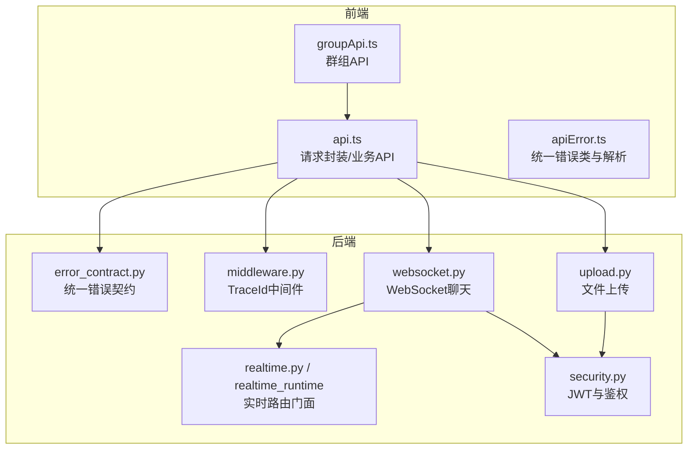
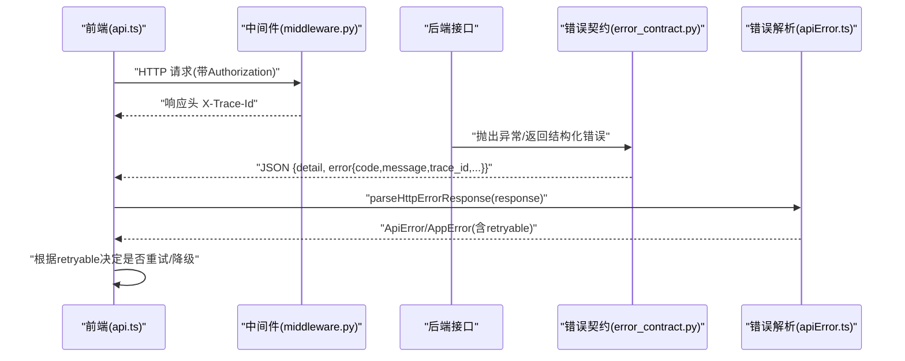
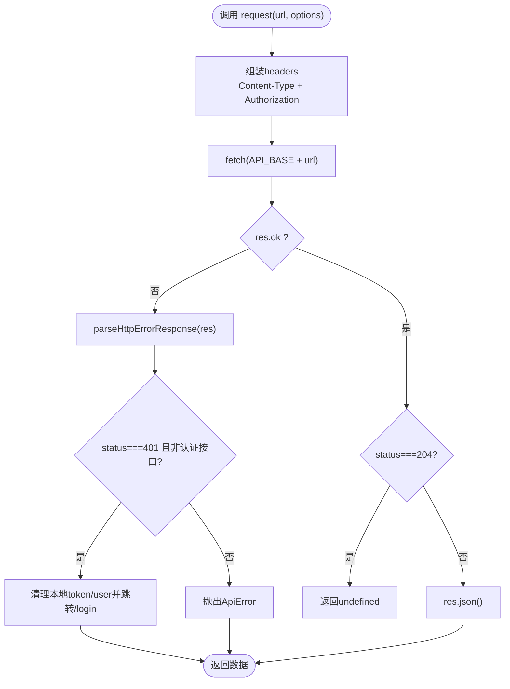
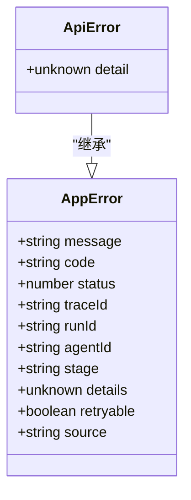
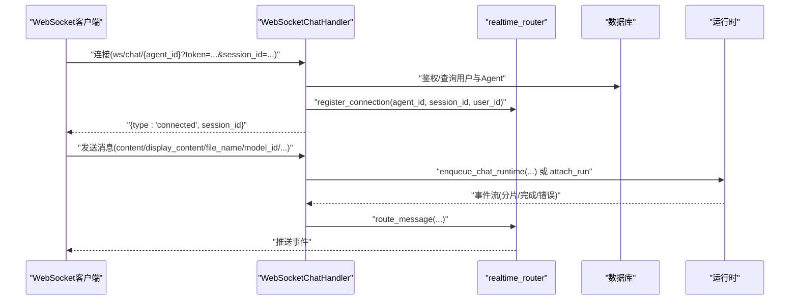
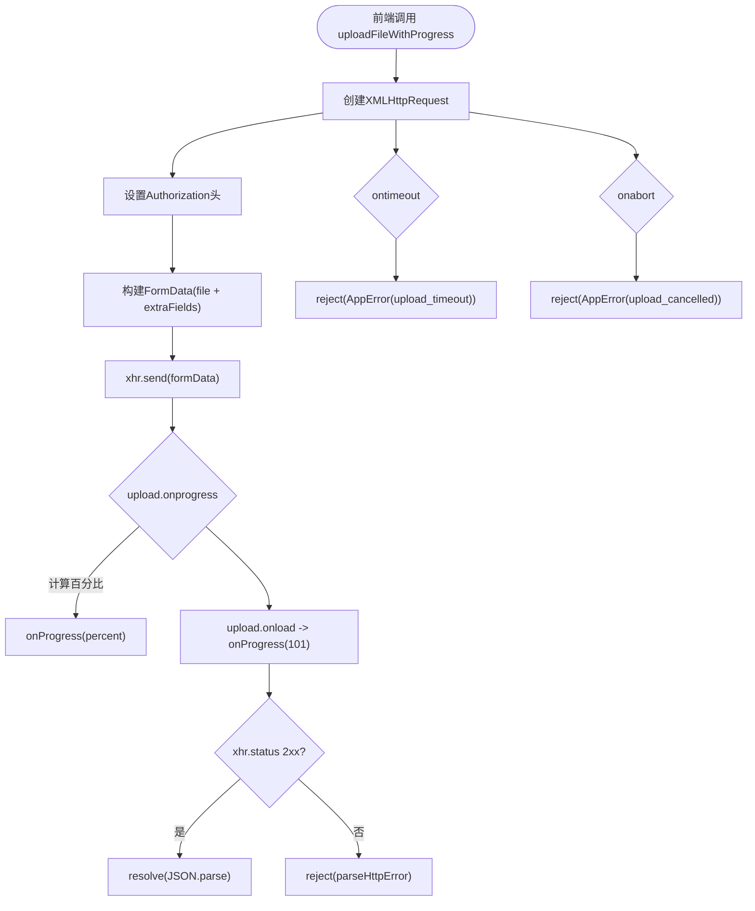
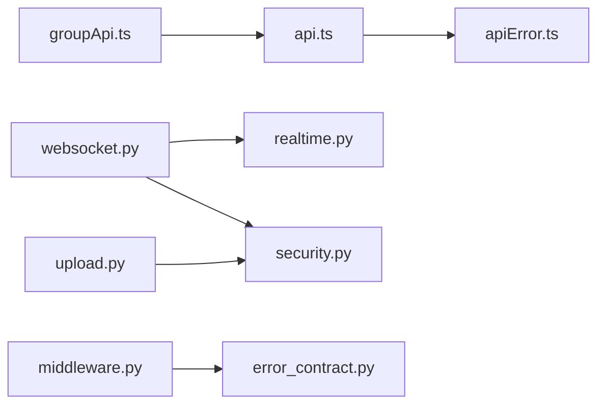

# API集成

<cite>
**本文引用的文件**   
- [frontend/src/services/api.ts](file://frontend/src/services/api.ts)
- [frontend/src/services/apiError.ts](file://frontend/src/services/apiError.ts)
- [backend/app/core/error_contract.py](file://backend/app/core/error_contract.py)
- [backend/app/core/middleware.py](file://backend/app/core/middleware.py)
- [backend/app/api/websocket.py](file://backend/app/api/websocket.py)
- [backend/app/api/upload.py](file://backend/app/api/upload.py)
- [backend/app/services/realtime.py](file://backend/app/services/realtime.py)
- [backend/app/services/realtime_runtime/__init__.py](file://backend/app/services/realtime_runtime/__init__.py)
- [backend/app/core/security.py](file://backend/app/core/security.py)
- [frontend/src/services/groupApi.ts](file://frontend/src/services/groupApi.ts)
</cite>

## 目录
1. [简介](#简介)
2. [项目结构](#项目结构)
3. [核心组件](#核心组件)
4. [架构总览](#架构总览)
5. [详细组件分析](#详细组件分析)
6. [依赖关系分析](#依赖关系分析)
7. [性能考虑](#性能考虑)
8. [故障排查指南](#故障排查指南)
9. [结论](#结论)
10. [附录](#附录)

## 简介
本文件系统化梳理Clawith项目的API集成规范，覆盖前后端HTTP请求封装、错误处理、重试机制、WebSocket实时通信与消息推送、文件上传下载与进度监控、断点续传策略、API版本管理、请求拦截与响应处理。重点聚焦前端API客户端设计、统一错误处理、以及后端统一的错误契约与中间件链路。

## 项目结构
- 前端API层
  - 通用请求封装：统一鉴权头、错误解析、自动登出、上传进度等
  - 业务模块API：认证、租户、智能体、任务、文件、技能、触发器、凭据、企业知识库、经验库、组织等
  - 群组API：会话、成员、消息、工作区文件、运行状态等
- 后端能力
  - 统一错误契约：标准化错误对象、TraceId透传、校验错误、未捕获异常保护
  - 中间件：请求追踪、日志记录、响应头注入
  - WebSocket聊天：连接管理、权限校验、会话恢复、事件流、取消与重连
  - 文件上传：多格式文本提取、图片Base64、存储路径规范化
  - 实时路由：跨连接的消息分发、在线状态、订阅发布前缀

**图表来源** 
- [frontend/src/services/api.ts:1-651](file://frontend/src/services/api.ts#L1-L651)
- [frontend/src/services/apiError.ts:1-204](file://frontend/src/services/apiError.ts#L1-L204)
- [backend/app/core/error_contract.py:1-229](file://backend/app/core/error_contract.py#L1-L229)
- [backend/app/core/middleware.py:1-53](file://backend/app/core/middleware.py#L1-L53)
- [backend/app/api/websocket.py:1-800](file://backend/app/api/websocket.py#L1-L800)
- [backend/app/api/upload.py:1-175](file://backend/app/api/upload.py#L1-L175)
- [backend/app/services/realtime.py:1-20](file://backend/app/services/realtime.py#L1-L20)
- [backend/app/services/realtime_runtime/__init__.py:1-16](file://backend/app/services/realtime_runtime/__init__.py#L1-L16)
- [backend/app/core/security.py:1-227](file://backend/app/core/security.py#L1-L227)

**章节来源**
- [frontend/src/services/api.ts:1-651](file://frontend/src/services/api.ts#L1-L651)
- [frontend/src/services/apiError.ts:1-204](file://frontend/src/services/apiError.ts#L1-L204)
- [backend/app/core/error_contract.py:1-229](file://backend/app/core/error_contract.py#L1-L229)
- [backend/app/core/middleware.py:1-53](file://backend/app/core/middleware.py#L1-L53)
- [backend/app/api/websocket.py:1-800](file://backend/app/api/websocket.py#L1-L800)
- [backend/app/api/upload.py:1-175](file://backend/app/api/upload.py#L1-L175)
- [backend/app/services/realtime.py:1-20](file://backend/app/services/realtime.py#L1-L20)
- [backend/app/services/realtime_runtime/__init__.py:1-16](file://backend/app/services/realtime_runtime/__init__.py#L1-L16)
- [backend/app/core/security.py:1-227](file://backend/app/core/security.py#L1-L227)
- [frontend/src/services/groupApi.ts:1-245](file://frontend/src/services/groupApi.ts#L1-L245)

## 核心组件
- 前端请求封装（request/fetchJson）
  - 统一设置Content-Type与Authorization头
  - 网络异常统一归一化为AppError
  - 401自动清理本地凭证并跳转登录（排除认证接口）
  - 204无内容直接返回undefined
- 统一错误体系（AppError/ApiError）
  - 标准化code、message、status、traceId、retryable等字段
  - HTTP错误体解析兼容新旧结构（canonical error与legacy detail）
  - 未知错误归一化，便于上层统一处理
- 后端统一错误契约
  - 构建标准错误对象（包含code、message、trace_id、可选上下文）
  - 注册HTTP异常、请求校验异常、未捕获异常的处理器
  - 通过X-Trace-Id贯穿请求链路
- 中间件追踪
  - 从请求头读取或生成trace_id，写入response头
  - 记录请求/响应耗时与关键信息
- WebSocket聊天
  - 连接建立、鉴权、Agent访问控制、模型加载、会话选择与历史加载
  - 消息循环、取消、attach_run重连、运行时事件流
  - 基于realtime_router的按agent/session/user路由
- 文件上传
  - 支持文本/办公文档/图片等多类型，自动提取文本或生成data URL
  - 存储键规范化与冲突命名处理，大小限制与截断
- 实时路由门面
  - 提供PRESENCE_TTL_SECONDS、PUBSUB_PREFIX、RealtimeRouter实例
  - 供WS与其他实时场景复用

**章节来源**
- [frontend/src/services/api.ts:1-128](file://frontend/src/services/api.ts#L1-L128)
- [frontend/src/services/apiError.ts:1-204](file://frontend/src/services/apiError.ts#L1-L204)
- [backend/app/core/error_contract.py:1-229](file://backend/app/core/error_contract.py#L1-L229)
- [backend/app/core/middleware.py:1-53](file://backend/app/core/middleware.py#L1-L53)
- [backend/app/api/websocket.py:1-240](file://backend/app/api/websocket.py#L1-L240)
- [backend/app/api/upload.py:1-175](file://backend/app/api/upload.py#L1-L175)
- [backend/app/services/realtime.py:1-20](file://backend/app/services/realtime.py#L1-L20)
- [backend/app/services/realtime_runtime/__init__.py:1-16](file://backend/app/services/realtime_runtime/__init__.py#L1-L16)

## 架构总览
下图展示一次典型HTTP请求的生命周期：前端发起请求→中间件注入trace_id→控制器处理→统一错误契约输出→响应携带trace_id→前端解析错误并决定重试或降级。

**图表来源** 
- [frontend/src/services/api.ts:11-45](file://frontend/src/services/api.ts#L11-L45)
- [backend/app/core/middleware.py:12-53](file://backend/app/core/middleware.py#L12-L53)
- [backend/app/core/error_contract.py:158-229](file://backend/app/core/error_contract.py#L158-L229)
- [frontend/src/services/apiError.ts:168-181](file://frontend/src/services/apiError.ts#L168-L181)

## 详细组件分析

### 前端API客户端设计（api.ts）
- 请求封装
  - 统一添加Authorization头；网络异常归一化；非2xx走错误解析；204直接返回undefined
  - 认证失败（401）且非认证接口时，清理本地token/user并重定向登录
- 文件上传
  - uploadFile：简单FormData上传
  - uploadFileWithProgress：XMLHttpRequest实现上传进度回调（0-100%为上传阶段，101为服务端处理阶段），支持超时与取消
- 业务API
  - 认证、租户、智能体、任务、文件、技能、触发器、凭据、企业知识库、经验库、组织等模块均基于request封装
  - 文件下载URL构造：拼接token与inline参数，用于浏览器直接下载

**图表来源** 
- [frontend/src/services/api.ts:11-45](file://frontend/src/services/api.ts#L11-L45)
- [frontend/src/services/apiError.ts:168-181](file://frontend/src/services/apiError.ts#L168-L181)

**章节来源**
- [frontend/src/services/api.ts:1-128](file://frontend/src/services/api.ts#L1-L128)
- [frontend/src/services/api.ts:280-345](file://frontend/src/services/api.ts#L280-L345)
- [frontend/src/services/api.ts:339-345](file://frontend/src/services/api.ts#L339-L345)

### 统一错误处理（apiError.ts）
- AppError/ApiError
  - 标准化字段：message、code、status、traceId、runId、agentId、stage、details、retryable、source
- HTTP错误解析
  - 兼容新结构{error:{...}}与旧结构{detail:...}
  - 优先取canonical message/code/retryable，回退到legacy detail与原始body
  - 从响应头X-Trace-Id补充traceId
- 未知错误归一化
  - 将任意错误包装为AppError，附带source与可重试标记

**图表来源** 
- [frontend/src/services/apiError.ts:36-70](file://frontend/src/services/apiError.ts#L36-L70)

**章节来源**
- [frontend/src/services/apiError.ts:1-204](file://frontend/src/services/apiError.ts#L1-L204)

### 后端统一错误契约（error_contract.py）
- ErrorObject
  - 固定字段：code、message、trace_id；可选：run_id、agent_id、stage、details、retryable
- 错误构建与响应
  - build_error_object：安全地构建错误对象
  - _error_body：组合detail与error
  - http_exception_handler：保留端点自定义detail，同时注入标准error与trace_id
  - request_validation_error_handler：422校验错误，结构化errors
  - unhandled_exception_handler：500兜底，不泄露内部细节
- TraceId处理
  - normalize_trace_id：校验并复用客户端传入的trace_id，否则生成新的
  - get_request_trace_id：从request.state获取或生成，确保一致性

**章节来源**
- [backend/app/core/error_contract.py:1-229](file://backend/app/core/error_contract.py#L1-L229)

### 请求追踪中间件（middleware.py）
- 功能
  - 从请求头读取或生成trace_id，写入request.state
  - 记录请求方法与路径、客户端IP
  - 在响应头注入X-Trace-Id，记录响应耗时
  - 异常路径记录错误日志并继续抛出

**章节来源**
- [backend/app/core/middleware.py:1-53](file://backend/app/core/middleware.py#L1-L53)

### WebSocket实时通信（websocket.py）
- 连接生命周期
  - accept后立即接受连接，随后进行鉴权、Agent访问控制、模型加载、会话选择与历史加载
  - 成功建立后发送connected事件，包含session_id
- 消息处理
  - 接收用户消息、abort取消、attach_run重连
  - 校验输入、配额检查、模型可用性、运行时入队与流式输出
  - 支持openclaw模式与普通LLM模式分流
- 错误与状态
  - 统一使用_runtime_error_packet构造错误包，包含code、message、stage、trace_id等
  - 断开连接时清理ConnectionManager中的连接映射
- 实时路由
  - 通过realtime_router.register/unregister_connection与route_message实现按agent/session/user投递

**图表来源** 
- [backend/app/api/websocket.py:229-392](file://backend/app/api/websocket.py#L229-L392)
- [backend/app/services/realtime.py:1-20](file://backend/app/services/realtime.py#L1-L20)

**章节来源**
- [backend/app/api/websocket.py:1-800](file://backend/app/api/websocket.py#L1-L800)
- [backend/app/services/realtime.py:1-20](file://backend/app/services/realtime.py#L1-L20)

### 文件上传与下载（upload.py、api.ts）
- 后端上传
  - 支持文本/办公文档/图片，自动提取文本或生成data URL
  - 存储键规范化，避免文件名冲突；图片大小限制；文本截断
- 前端上传
  - uploadFile：简单上传
  - uploadFileWithProgress：进度回调（0-100%上传阶段，101处理阶段）、超时、取消
- 下载
  - 构造下载URL，携带token与inline参数，浏览器直接下载

**图表来源** 
- [frontend/src/services/api.ts:78-128](file://frontend/src/services/api.ts#L78-L128)
- [backend/app/api/upload.py:108-175](file://backend/app/api/upload.py#L108-L175)

**章节来源**
- [frontend/src/services/api.ts:50-128](file://frontend/src/services/api.ts#L50-L128)
- [backend/app/api/upload.py:1-175](file://backend/app/api/upload.py#L1-L175)

### 群组API（groupApi.ts）
- 会话与成员管理：CRUD、邀请、移除
- 消息分页：before/after游标双向翻页
- 运行状态：查询、取消
- 公告与记忆：读写与版本控制（expected_version_token）
- 工作区文件：上传（支持进度）、下载URL、删除

**章节来源**
- [frontend/src/services/groupApi.ts:1-245](file://frontend/src/services/groupApi.ts#L1-L245)

## 依赖关系分析
- 前端
  - api.ts依赖apiError.ts的错误解析与归一化
  - groupApi.ts复用api.ts的fetchJson与uploadFileWithProgress
- 后端
  - websocket.py依赖realtime.py门面与security.py鉴权
  - middleware.py与error_contract.py共同保障trace_id与错误契约
  - upload.py依赖storage服务与鉴权

**图表来源** 
- [frontend/src/services/api.ts:1-128](file://frontend/src/services/api.ts#L1-L128)
- [frontend/src/services/apiError.ts:1-204](file://frontend/src/services/apiError.ts#L1-L204)
- [frontend/src/services/groupApi.ts:1-245](file://frontend/src/services/groupApi.ts#L1-L245)
- [backend/app/api/websocket.py:1-240](file://backend/app/api/websocket.py#L1-L240)
- [backend/app/services/realtime.py:1-20](file://backend/app/services/realtime.py#L1-L20)
- [backend/app/core/security.py:1-227](file://backend/app/core/security.py#L1-L227)
- [backend/app/core/middleware.py:1-53](file://backend/app/core/middleware.py#L1-L53)
- [backend/app/core/error_contract.py:1-229](file://backend/app/core/error_contract.py#L1-L229)
- [backend/app/api/upload.py:1-175](file://backend/app/api/upload.py#L1-L175)

**章节来源**
- [frontend/src/services/api.ts:1-128](file://frontend/src/services/api.ts#L1-L128)
- [frontend/src/services/apiError.ts:1-204](file://frontend/src/services/apiError.ts#L1-L204)
- [frontend/src/services/groupApi.ts:1-245](file://frontend/src/services/groupApi.ts#L1-L245)
- [backend/app/api/websocket.py:1-240](file://backend/app/api/websocket.py#L1-L240)
- [backend/app/services/realtime.py:1-20](file://backend/app/services/realtime.py#L1-L20)
- [backend/app/core/security.py:1-227](file://backend/app/core/security.py#L1-L227)
- [backend/app/core/middleware.py:1-53](file://backend/app/core/middleware.py#L1-L53)
- [backend/app/core/error_contract.py:1-229](file://backend/app/core/error_contract.py#L1-L229)
- [backend/app/api/upload.py:1-175](file://backend/app/api/upload.py#L1-L175)

## 性能考虑
- 请求层面
  - 使用204减少不必要的数据传输
  - 合理设置超时与取消（上传）
- 错误处理
  - 利用retryable字段进行指数退避重试，避免雪崩
  - 对网络错误与服务器错误分类处理
- 实时通信
  - 使用realtime_router按agent/session/user精准投递，降低广播开销
  - 历史消息按需加载，限制上下文窗口大小
- 文件处理
  - 大文件上传采用分块与进度反馈
  - 文本提取限制长度，避免内存峰值

[本节为通用指导，无需特定文件引用]

## 故障排查指南
- 常见错误码与处理
  - network_error：网络不可达或请求被中断，建议重试
  - upload_timeout：上传超时，增加超时或优化网络
  - upload_cancelled：用户主动取消，不重试
  - authentication_failed：Token无效或过期，重新登录
  - agent_expired：Agent已过期，联系管理员
  - model_unavailable：未配置可用模型，引导用户设置
- 定位手段
  - 查看响应头X-Trace-Id，结合后端日志定位
  - 前端console打印ApiError/AppError的完整上下文
- 快速修复
  - 清理本地token/user后重试
  - 检查Agent权限与模型配置
  - 确认文件大小与格式限制

**章节来源**
- [frontend/src/services/apiError.ts:136-181](file://frontend/src/services/apiError.ts#L136-L181)
- [backend/app/core/error_contract.py:158-229](file://backend/app/core/error_contract.py#L158-L229)
- [backend/app/api/websocket.py:173-206](file://backend/app/api/websocket.py#L173-L206)

## 结论
Clawith的API集成以“统一错误契约+中间件追踪”为核心，前端通过标准化错误类与请求封装实现一致的用户体验与健壮性；后端通过中间件与错误处理器保证可观测性与稳定性；WebSocket与实时路由提供低延迟的交互能力；文件上传下载兼顾进度与可靠性。整体设计清晰、可扩展，适合复杂企业级场景。

[本节为总结，无需特定文件引用]

## 附录
- API版本管理建议
  - 在URL中引入版本号（如/api/v1/...），保持向后兼容
  - 通过特性开关逐步迁移旧接口
- 请求拦截与响应处理
  - 前端可在request封装中集中处理鉴权刷新、错误提示、埋点
  - 后端可通过中间件统一记录指标与审计日志
- 断点续传策略（建议）
  - 前端分块上传，记录已上传块索引
  - 后端支持断点查询与合并，避免重复传输

[本节为通用指导，无需特定文件引用]