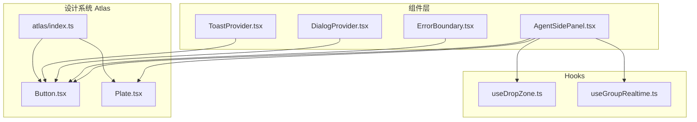
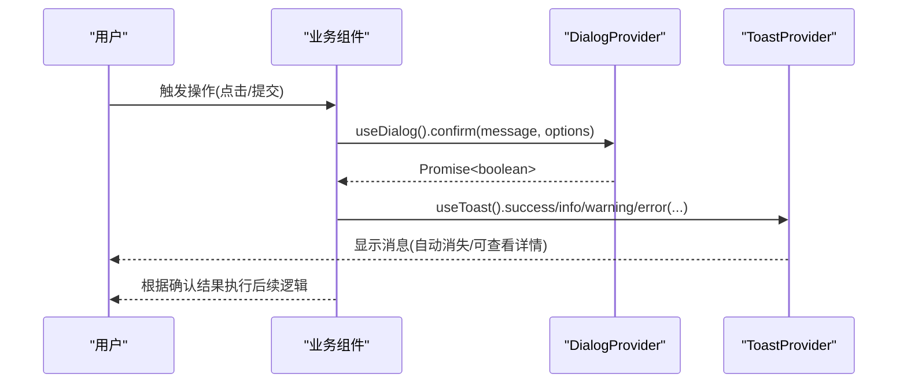
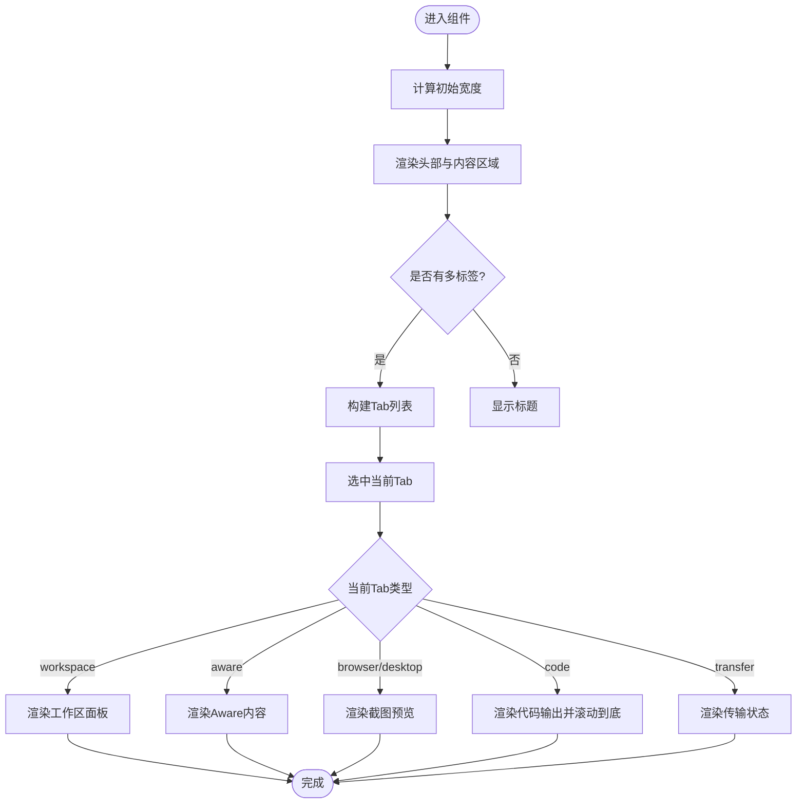
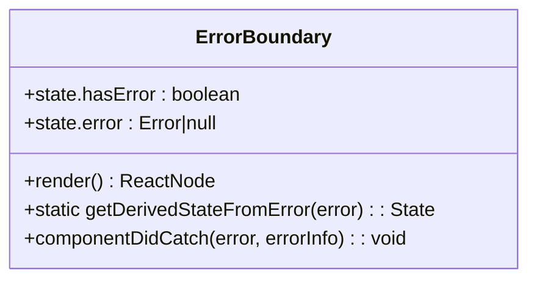
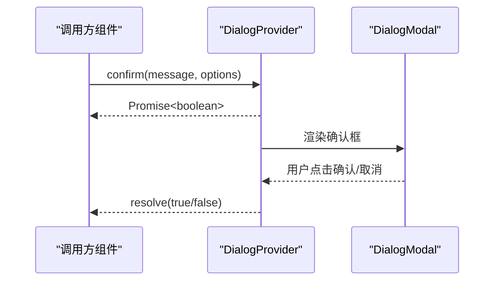
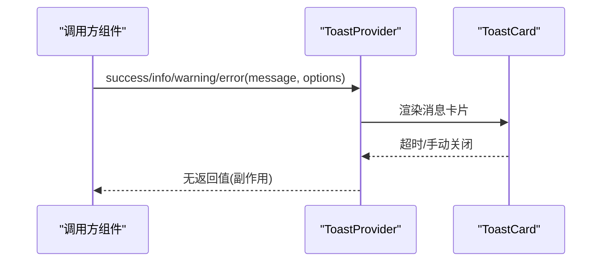
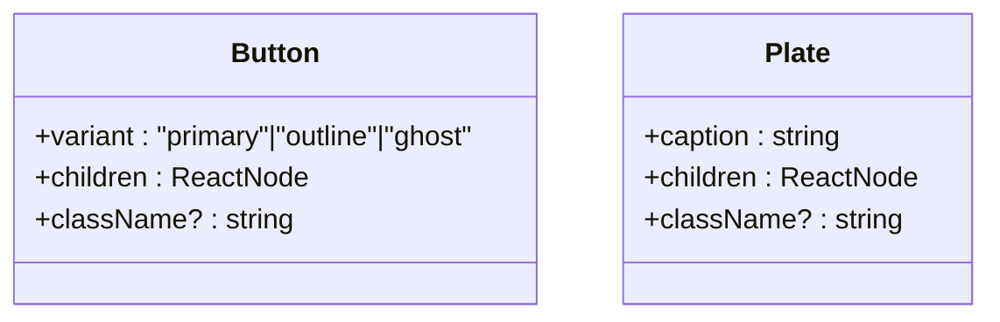
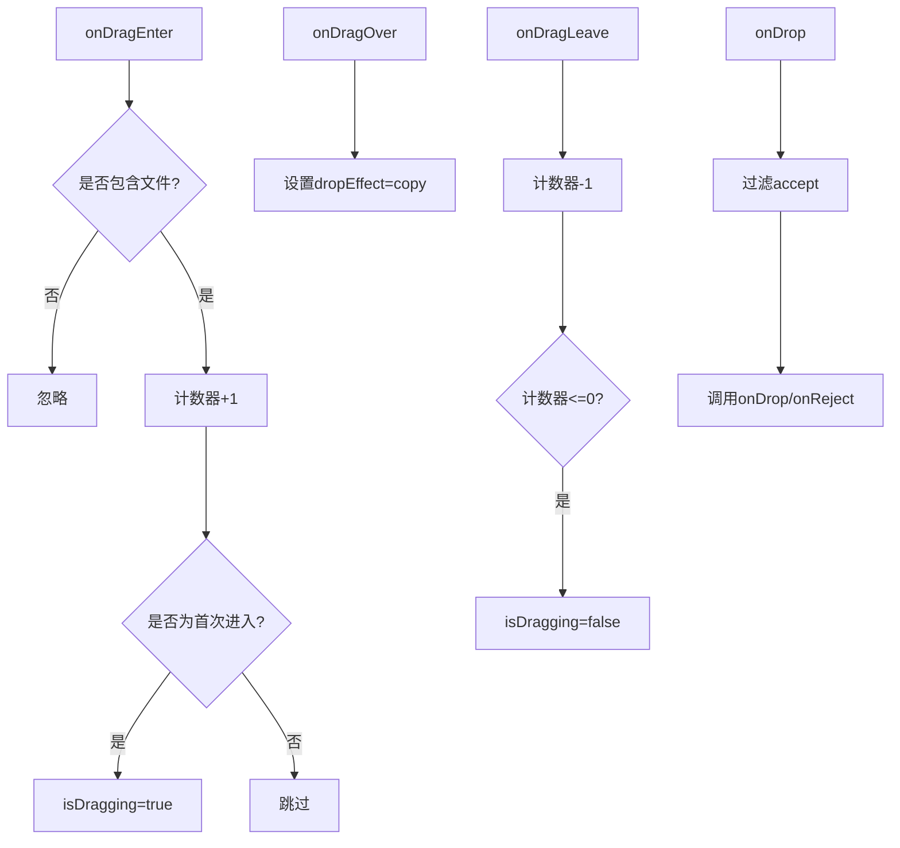
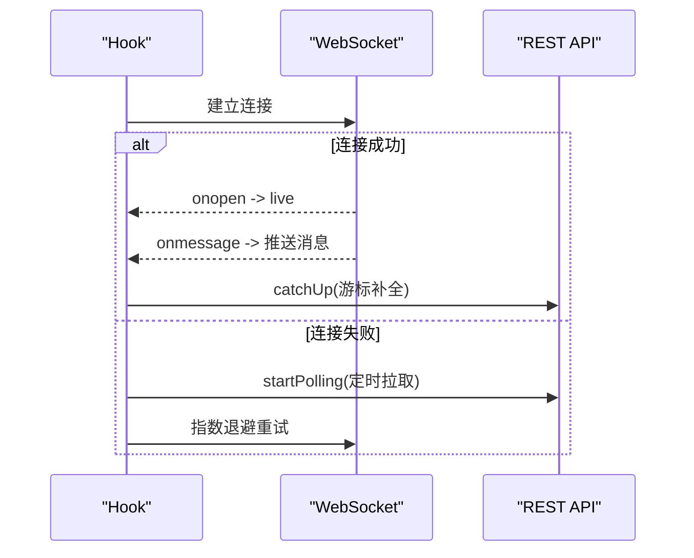
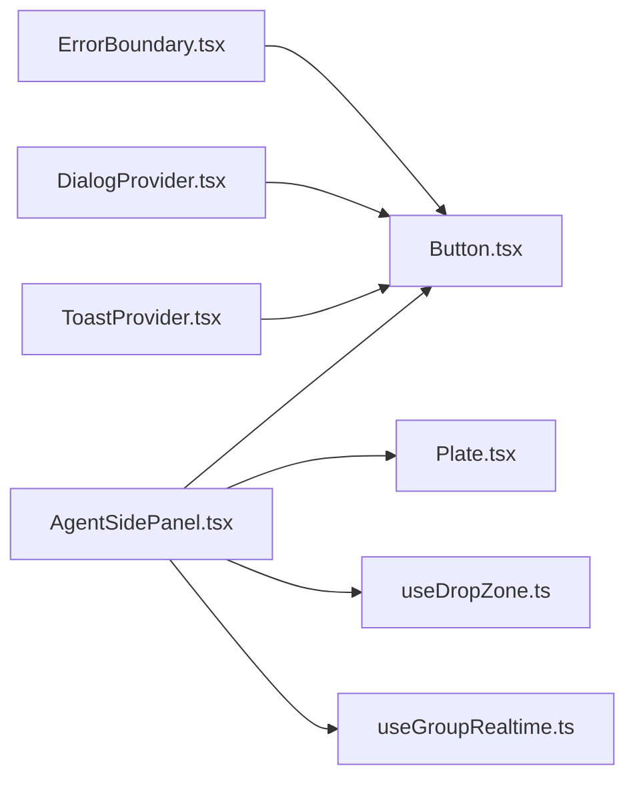

# React组件开发

<cite>
**本文引用的文件**   
- [AgentSidePanel.tsx](file://frontend/src/components/AgentSidePanel.tsx)
- [ErrorBoundary.tsx](file://frontend/src/components/ErrorBoundary.tsx)
- [DialogProvider.tsx](file://frontend/src/components/Dialog/DialogProvider.tsx)
- [ToastProvider.tsx](file://frontend/src/components/Toast/ToastProvider.tsx)
- [Button.tsx](file://frontend/src/components/atlas/Button.tsx)
- [Plate.tsx](file://frontend/src/components/atlas/Plate.tsx)
- [index.ts](file://frontend/src/components/atlas/index.ts)
- [useDropZone.ts](file://frontend/src/hooks/useDropZone.ts)
- [useGroupRealtime.ts](file://frontend/src/hooks/useGroupRealtime.ts)
</cite>

## 目录
1. [简介](#简介)
2. [项目结构](#项目结构)
3. [核心组件](#核心组件)
4. [架构总览](#架构总览)
5. [详细组件分析](#详细组件分析)
6. [依赖关系分析](#依赖关系分析)
7. [性能考量](#性能考量)
8. [故障排查指南](#故障排查指南)
9. [结论](#结论)
10. [附录](#附录)

## 简介
本规范面向Clawith前端React工程，聚焦函数组件设计、Hooks使用、Props接口定义、事件处理与可访问性；总结组件复用模式与组合原则；给出性能优化策略；并覆盖自定义Hooks开发、上下文使用、错误边界实现。同时重点说明Atlas设计系统组件（如Button、Plate等）以及全局UI能力（Dialog、Toast）的开发规范与使用方法，帮助团队统一风格、提升可维护性与可测试性。

## 项目结构
- 组件组织采用“按功能域+原子化”的混合方式：
  - 业务侧边栏与面板：AgentSidePanel.tsx
  - 全局交互能力：DialogProvider.tsx、ToastProvider.tsx
  - Atlas设计系统：atlas/*（Button、Plate等）
  - 通用Hooks：useDropZone.ts、useGroupRealtime.ts
  - 错误边界：ErrorBoundary.tsx
- 入口与样式：
  - 样式变量与主题通过CSS变量驱动，便于在组件内以var(--*)引用
  - Atlas组件通过index.ts集中导出，形成稳定API面

**图表来源** 
- [AgentSidePanel.tsx:1-304](file://frontend/src/components/AgentSidePanel.tsx#L1-L304)
- [ErrorBoundary.tsx:1-62](file://frontend/src/components/ErrorBoundary.tsx#L1-L62)
- [DialogProvider.tsx:1-201](file://frontend/src/components/Dialog/DialogProvider.tsx#L1-L201)
- [ToastProvider.tsx:1-186](file://frontend/src/components/Toast/ToastProvider.tsx#L1-L186)
- [Button.tsx:1-18](file://frontend/src/components/atlas/Button.tsx#L1-L18)
- [Plate.tsx:1-18](file://frontend/src/components/atlas/Plate.tsx#L1-L18)
- [index.ts:1-18](file://frontend/src/components/atlas/index.ts#L1-L18)
- [useDropZone.ts:1-129](file://frontend/src/hooks/useDropZone.ts#L1-L129)
- [useGroupRealtime.ts:1-249](file://frontend/src/hooks/useGroupRealtime.ts#L1-L249)

**章节来源**
- [AgentSidePanel.tsx:1-304](file://frontend/src/components/AgentSidePanel.tsx#L1-L304)
- [index.ts:1-18](file://frontend/src/components/atlas/index.ts#L1-L18)

## 核心组件
- AgentSidePanel：多标签侧边面板，支持拖拽调整宽度、动态Tab展示、实时预览与代码输出滚动定位、工作区操作集成。
- ErrorBoundary：基于类组件的错误边界，捕获子树渲染异常并提供可折叠错误详情与刷新按钮。
- DialogProvider：提供alert/confirm两种对话框能力，支持类型化提示、键盘交互、焦点管理与可访问性属性。
- ToastProvider：提供info/success/warning/error四类消息通知，支持自动消失、详情展开、暂停与关闭。
- Atlas Button/Plate：基础按钮与图注容器，遵循命名空间化的className约定，便于主题扩展。
- useDropZone：可复用的拖放上传Hook，支持accept过滤、嵌套元素计数防抖、禁用态。
- useGroupRealtime：群组消息实时通信Hook，WebSocket优先，失败回退轮询，游标补全与去重。

**章节来源**
- [AgentSidePanel.tsx:1-304](file://frontend/src/components/AgentSidePanel.tsx#L1-L304)
- [ErrorBoundary.tsx:1-62](file://frontend/src/components/ErrorBoundary.tsx#L1-L62)
- [DialogProvider.tsx:1-201](file://frontend/src/components/Dialog/DialogProvider.tsx#L1-L201)
- [ToastProvider.tsx:1-186](file://frontend/src/components/Toast/ToastProvider.tsx#L1-L186)
- [Button.tsx:1-18](file://frontend/src/components/atlas/Button.tsx#L1-L18)
- [Plate.tsx:1-18](file://frontend/src/components/atlas/Plate.tsx#L1-L18)
- [useDropZone.ts:1-129](file://frontend/src/hooks/useDropZone.ts#L1-L129)
- [useGroupRealtime.ts:1-249](file://frontend/src/hooks/useGroupRealtime.ts#L1-L249)

## 架构总览
- 组件分层
  - 表现层：AgentSidePanel、ErrorBoundary、Atlas组件
  - 交互层：DialogProvider、ToastProvider
  - 数据/状态层：useGroupRealtime（WS/Polling）、useDropZone（本地状态）
- 上下文与事件流
  - Dialog/Toast通过Context暴露方法，组件内部调用useDialog/useToast触发UI
  - 侧边面板通过props回调向上汇报状态变化，避免深层级状态下沉
- 可访问性
  - 对话框使用role="dialog"与aria-modal
  - Tab列表使用role="tablist"/role="tab"与aria-selected
  - Toast使用role="status"

**图表来源** 
- [DialogProvider.tsx:1-201](file://frontend/src/components/Dialog/DialogProvider.tsx#L1-L201)
- [ToastProvider.tsx:1-186](file://frontend/src/components/Toast/ToastProvider.tsx#L1-L186)

## 详细组件分析

### AgentSidePanel 侧边面板
- 设计要点
  - Props接口清晰：可见性、活动Tab、回调事件、工作区状态、实时预览状态等
  - 宽度计算：初始宽度基于容器或窗口尺寸，限制最小值与最大比例
  - 拖拽调整：mousedown/mousemove/mouseup监听，防止文本选择，记录用户手动调整标志
  - Tab动态生成：根据liveState与awareContent决定可用Tab，无效时回退到首个可用Tab
  - 滚动定位：切换到code标签时平滑滚动到底部
  - 可访问性：tablist/tab/aria-selected语义完整
- 事件处理
  - onToggle/onTabChange/onWorkspaceSelectPath等回调由父组件管理状态
  - 拖拽事件阻止默认行为，设置光标与userSelect样式
- 性能考虑
  - 使用useCallback缓存事件处理器
  - 使用ref保存onLiveUpdate避免重复订阅
  - 仅在必要时更新state（如availableTabs变化才切换activeTab）

**图表来源** 
- [AgentSidePanel.tsx:1-304](file://frontend/src/components/AgentSidePanel.tsx#L1-L304)

**章节来源**
- [AgentSidePanel.tsx:1-304](file://frontend/src/components/AgentSidePanel.tsx#L1-L304)

### ErrorBoundary 错误边界
- 设计要点
  - 使用getDerivedStateFromError捕获渲染期错误
  - componentDidCatch记录错误信息
  - 提供fallback插槽，默认展示错误详情与刷新按钮
- 可访问性
  - 错误信息以details/summary呈现，便于屏幕阅读器理解
- 使用建议
  - 包裹高风险页面或复杂子树，避免整页崩溃

**图表来源** 
- [ErrorBoundary.tsx:1-62](file://frontend/src/components/ErrorBoundary.tsx#L1-L62)

**章节来源**
- [ErrorBoundary.tsx:1-62](file://frontend/src/components/ErrorBoundary.tsx#L1-L62)

### DialogProvider 对话框上下文
- 设计要点
  - 提供alert/confirm两种模式，返回Promise以便链式调用
  - 支持类型化提示（info/success/warning/error），危险确认使用error样式
  - 键盘交互：Escape取消，Enter确认（仅alert）
  - 焦点管理：打开后自动聚焦确认按钮
  - 可访问性：role="dialog"、aria-modal="true"
- 使用建议
  - 在应用根节点包裹DialogProvider
  - 通过useDialog获取方法，避免直接操作DOM

**图表来源** 
- [DialogProvider.tsx:1-201](file://frontend/src/components/Dialog/DialogProvider.tsx#L1-L201)

**章节来源**
- [DialogProvider.tsx:1-201](file://frontend/src/components/Dialog/DialogProvider.tsx#L1-L201)

### ToastProvider 消息通知
- 设计要点
  - 提供show/info/success/warning/error快捷方法
  - 自动消失：error默认更长时长，hover暂停计时
  - 详情展开：支持details字段，折叠/展开
  - 可访问性：role="status"，关闭按钮带aria-label
- 使用建议
  - 在应用根节点包裹ToastProvider
  - 通过useToast获取方法，避免直接操作DOM

**图表来源** 
- [ToastProvider.tsx:1-186](file://frontend/src/components/Toast/ToastProvider.tsx#L1-L186)

**章节来源**
- [ToastProvider.tsx:1-186](file://frontend/src/components/Toast/ToastProvider.tsx#L1-L186)

### Atlas 设计系统组件
- Button
  - 支持variant：primary/outline/ghost
  - 通过className拼接命名空间样式，便于主题扩展
- Plate
  - 用于图文排版，包含figure与caption两部分
- 导出规范
  - atlas/index.ts集中导出，保持稳定的API面

**图表来源** 
- [Button.tsx:1-18](file://frontend/src/components/atlas/Button.tsx#L1-L18)
- [Plate.tsx:1-18](file://frontend/src/components/atlas/Plate.tsx#L1-L18)
- [index.ts:1-18](file://frontend/src/components/atlas/index.ts#L1-L18)

**章节来源**
- [Button.tsx:1-18](file://frontend/src/components/atlas/Button.tsx#L1-L18)
- [Plate.tsx:1-18](file://frontend/src/components/atlas/Plate.tsx#L1-L18)
- [index.ts:1-18](file://frontend/src/components/atlas/index.ts#L1-L18)

### useDropZone 拖放Hook
- 设计要点
  - 计数器方案解决嵌套元素dragenter/dragleave闪烁问题
  - accept过滤支持扩展名与MIME类型
  - disabled禁用态控制视觉反馈与drop行为
- 使用建议
  - 将dropZoneProps直接spread到容器元素
  - 通过onReject反馈被拒绝的文件，提升用户体验

**图表来源** 
- [useDropZone.ts:1-129](file://frontend/src/hooks/useDropZone.ts#L1-L129)

**章节来源**
- [useDropZone.ts:1-129](file://frontend/src/hooks/useDropZone.ts#L1-L129)

### useGroupRealtime 实时通信Hook
- 设计要点
  - WebSocket优先，失败阈值后回退轮询
  - 游标比较函数确保时间戳精度与ID去重
  - 会话切换时立即catchUp，保证一致性
  - 不可重试关闭码直接离线
- 使用建议
  - 传入getLastCursor读取最新游标，避免闭包过期
  - onMessages接收增量消息，上层负责去重与排序

**图表来源** 
- [useGroupRealtime.ts:1-249](file://frontend/src/hooks/useGroupRealtime.ts#L1-L249)

**章节来源**
- [useGroupRealtime.ts:1-249](file://frontend/src/hooks/useGroupRealtime.ts#L1-L249)

## 依赖关系分析
- 组件间耦合
  - AgentSidePanel依赖Atlas Button/Plate进行样式与布局，依赖useDropZone与useGroupRealtime提供交互与数据能力
  - ErrorBoundary独立，不依赖业务上下文
  - DialogProvider/ToastProvider为全局上下文，被多处消费
- 外部依赖
  - i18n：react-i18next用于国际化
  - 图标：@tabler/icons-react
- 潜在循环依赖
  - 当前结构未见循环导入，组件按职责分离清晰

**图表来源** 
- [AgentSidePanel.tsx:1-304](file://frontend/src/components/AgentSidePanel.tsx#L1-L304)
- [Button.tsx:1-18](file://frontend/src/components/atlas/Button.tsx#L1-L18)
- [Plate.tsx:1-18](file://frontend/src/components/atlas/Plate.tsx#L1-L18)
- [useDropZone.ts:1-129](file://frontend/src/hooks/useDropZone.ts#L1-L129)
- [useGroupRealtime.ts:1-249](file://frontend/src/hooks/useGroupRealtime.ts#L1-L249)
- [ErrorBoundary.tsx:1-62](file://frontend/src/components/ErrorBoundary.tsx#L1-L62)
- [DialogProvider.tsx:1-201](file://frontend/src/components/Dialog/DialogProvider.tsx#L1-L201)
- [ToastProvider.tsx:1-186](file://frontend/src/components/Toast/ToastProvider.tsx#L1-L186)

**章节来源**
- [AgentSidePanel.tsx:1-304](file://frontend/src/components/AgentSidePanel.tsx#L1-L304)
- [Button.tsx:1-18](file://frontend/src/components/atlas/Button.tsx#L1-L18)
- [Plate.tsx:1-18](file://frontend/src/components/atlas/Plate.tsx#L1-L18)
- [useDropZone.ts:1-129](file://frontend/src/hooks/useDropZone.ts#L1-L129)
- [useGroupRealtime.ts:1-249](file://frontend/src/hooks/useGroupRealtime.ts#L1-L249)
- [ErrorBoundary.tsx:1-62](file://frontend/src/components/ErrorBoundary.tsx#L1-L62)
- [DialogProvider.tsx:1-201](file://frontend/src/components/Dialog/DialogProvider.tsx#L1-L201)
- [ToastProvider.tsx:1-186](file://frontend/src/components/Toast/ToastProvider.tsx#L1-L186)

## 性能考量
- 渲染优化
  - 使用useCallback缓存事件处理器，避免子组件不必要的重渲染
  - 使用useMemo缓存派生数据（如ToastProvider中的value对象）
  - 合理拆分组件，减少大组件重渲染范围
- 状态管理
  - 将频繁变化的状态尽量靠近消费处，避免全局状态风暴
  - 使用ref保存易变但不触发渲染的值（如onLiveUpdateRef）
- I/O与网络
  - WebSocket失败回退轮询，避免阻塞主线程
  - 游标补全限制页数，防止大数据量卡顿
- 可访问性与交互
  - 键盘导航与焦点管理提升可用性，减少用户等待成本

[本节为通用指导，不直接分析具体文件]

## 故障排查指南
- 错误边界未生效
  - 检查是否在正确层级包裹ErrorBoundary
  - 查看控制台错误堆栈与details内容
- Dialog/Toast未显示
  - 确认已包裹对应Provider
  - 检查useDialog/useToast是否在Provider作用域内调用
- 拖放失效
  - 检查disabled状态与accept过滤规则
  - 确认dropZoneProps已spread到容器元素
- 实时消息丢失
  - 检查getLastCursor是否正确读取最新游标
  - 观察wsFailuresThreshold与NO_RETRY_CLOSE_CODES导致的离线状态

**章节来源**
- [ErrorBoundary.tsx:1-62](file://frontend/src/components/ErrorBoundary.tsx#L1-L62)
- [DialogProvider.tsx:1-201](file://frontend/src/components/Dialog/DialogProvider.tsx#L1-L201)
- [ToastProvider.tsx:1-186](file://frontend/src/components/Toast/ToastProvider.tsx#L1-L186)
- [useDropZone.ts:1-129](file://frontend/src/hooks/useDropZone.ts#L1-L129)
- [useGroupRealtime.ts:1-249](file://frontend/src/hooks/useGroupRealtime.ts#L1-L249)

## 结论
本规范总结了Clawith项目中React组件的设计与实现要点，涵盖函数组件、Hooks、上下文、错误边界与Atlas设计系统的使用。通过清晰的Props接口、稳健的事件处理、合理的性能优化与完善的可访问性，团队可以构建一致、可靠且易维护的前端界面。建议在新增组件时严格遵循上述规范，并结合Storybook与自动化测试保障质量。

[本节为总结性内容，不直接分析具体文件]

## 附录
- 组件开发最佳实践清单
  - 使用函数组件与Hooks，避免类组件（除必要场景）
  - Props接口使用TypeScript明确类型，默认值置于解构
  - 事件处理使用useCallback，避免子组件重渲染
  - 可访问性：语义化标签、ARIA属性、键盘导航
  - 错误边界：包裹高风险子树，提供友好降级
  - 上下文：Dialog/Toast等全局能力通过Provider暴露
  - 设计系统：优先使用Atlas组件，保持风格一致
  - 测试：为Hooks与组件编写单元测试与快照测试
  - 文档：使用Storybook展示用例与交互

[本节为通用指导，不直接分析具体文件]