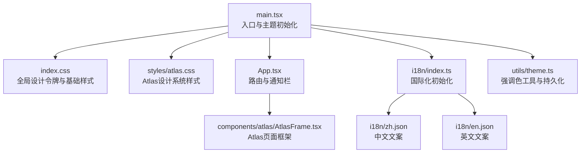
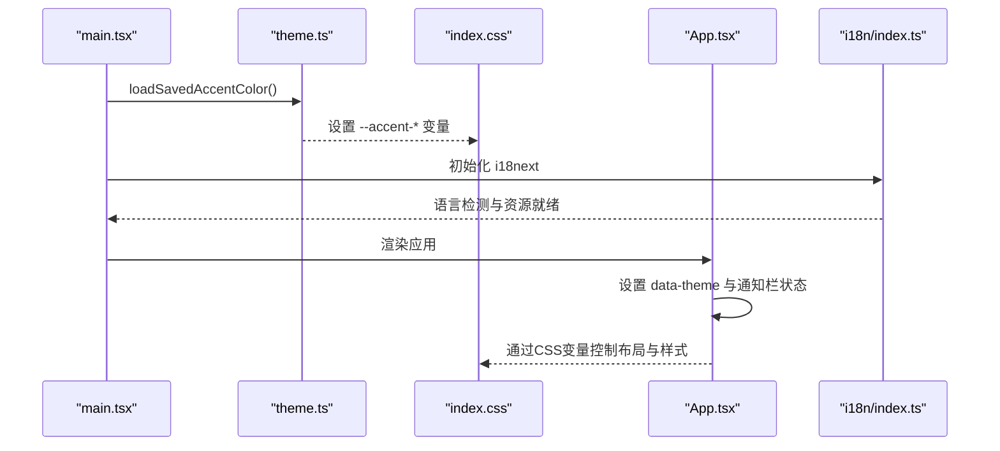
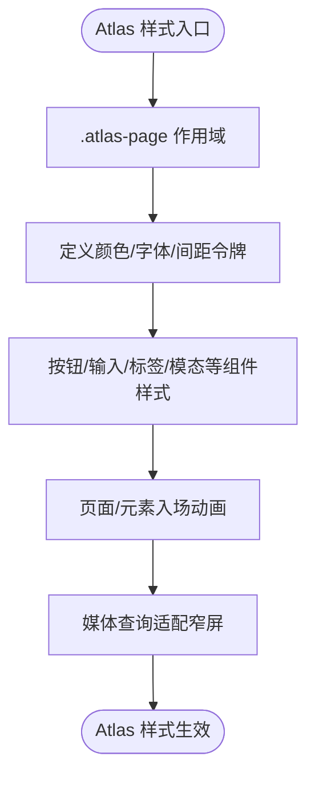
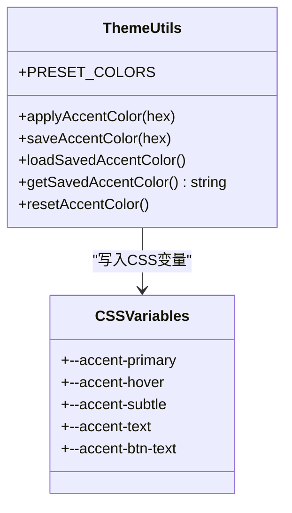
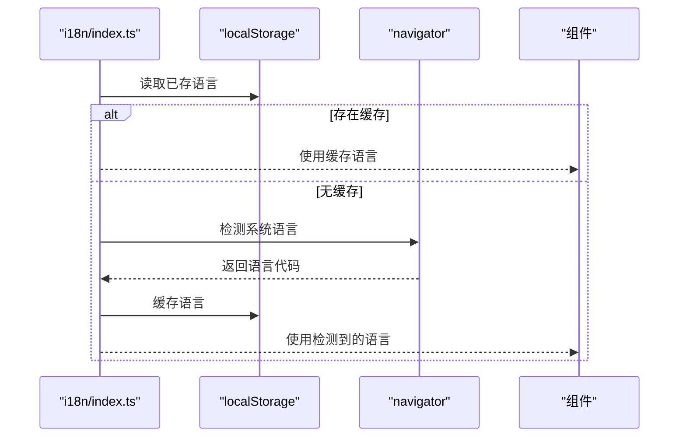
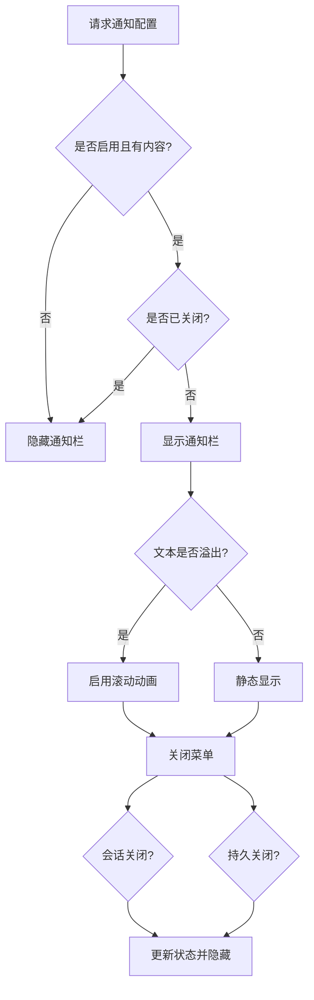
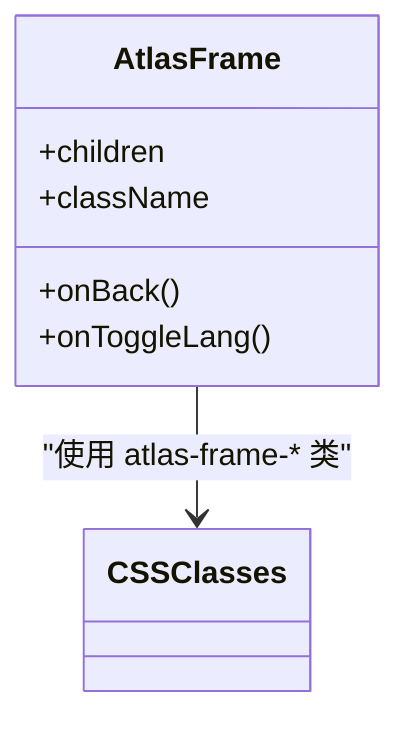
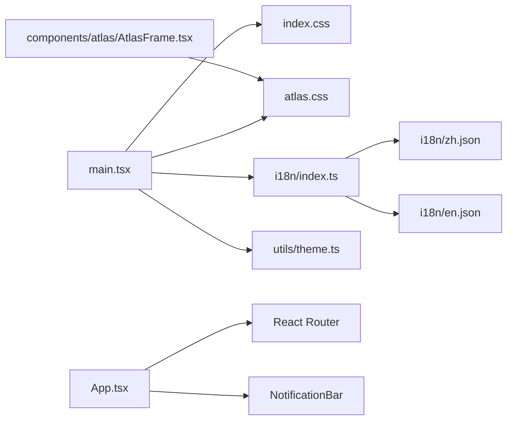

# UI设计与样式

<cite>
**本文引用的文件**   
- [frontend/src/index.css](file://frontend/src/index.css)
- [frontend/src/styles/atlas.css](file://frontend/src/styles/atlas.css)
- [frontend/src/utils/theme.ts](file://frontend/src/utils/theme.ts)
- [frontend/src/i18n/index.ts](file://frontend/src/i18n/index.ts)
- [frontend/src/i18n/zh.json](file://frontend/src/i18n/zh.json)
- [frontend/src/i18n/en.json](file://frontend/src/i18n/en.json)
- [frontend/src/main.tsx](file://frontend/src/main.tsx)
- [frontend/src/App.tsx](file://frontend/src/App.tsx)
- [frontend/src/components/atlas/AtlasFrame.tsx](file://frontend/src/components/atlas/AtlasFrame.tsx)
- [frontend/src/components/atlas/index.ts](file://frontend/src/components/atlas/index.ts)
</cite>

## 目录
1. [简介](#简介)
2. [项目结构](#项目结构)
3. [核心组件](#核心组件)
4. [架构总览](#架构总览)
5. [详细组件分析](#详细组件分析)
6. [依赖关系分析](#依赖关系分析)
7. [性能与可访问性](#性能与可访问性)
8. [故障排查指南](#故障排查指南)
9. [结论](#结论)
10. [附录：规范清单](#附录规范清单)

## 简介
本文件系统性梳理前端UI设计与样式管理规范，覆盖CSS模块化、主题系统、响应式设计、国际化实现、组件样式规范、动画效果、无障碍访问、样式调试、性能优化与浏览器兼容性。重点阐述Atlas设计系统的视觉规范、主题切换机制以及多语言支持实现，帮助开发者在统一的设计体系下高效协作与维护。

## 项目结构
前端样式与主题管理采用“全局设计令牌 + 模块样式”的分层组织方式：
- 全局设计令牌与基础样式：index.css（定义暗/亮主题变量、间距、字体、阴影、过渡等）
- Atlas 设计系统样式：styles/atlas.css（限定作用域 .atlas-page，提供页面级视觉与组件样式）
- 主题色增强工具：utils/theme.ts（动态生成强调色并写入CSS自定义属性，持久化到localStorage）
- 国际化配置：i18n/index.ts（基于 i18next + react-i18next，自动检测语言，资源文件 zh.json / en.json）
- 应用入口与挂载：main.tsx（加载样式、初始化主题色、包裹路由与状态容器）
- 应用路由与通知栏：App.tsx（设置 data-theme、处理跨域token、渲染通知栏与路由）
- Atlas 框架组件：components/atlas/*（AtlasFrame 等，配合 atlas.css 使用）

**图表来源** 
- [frontend/src/main.tsx:1-38](file://frontend/src/main.tsx#L1-L38)
- [frontend/src/index.css:1-103](file://frontend/src/index.css#L1-L103)
- [frontend/src/styles/atlas.css:1-65](file://frontend/src/styles/atlas.css#L1-L65)
- [frontend/src/App.tsx:212-260](file://frontend/src/App.tsx#L212-L260)
- [frontend/src/components/atlas/AtlasFrame.tsx:1-40](file://frontend/src/components/atlas/AtlasFrame.tsx#L1-L40)
- [frontend/src/i18n/index.ts:1-31](file://frontend/src/i18n/index.ts#L1-L31)
- [frontend/src/utils/theme.ts:1-97](file://frontend/src/utils/theme.ts#L1-L97)

**章节来源**
- [frontend/src/main.tsx:1-38](file://frontend/src/main.tsx#L1-L38)
- [frontend/src/index.css:1-103](file://frontend/src/index.css#L1-L103)
- [frontend/src/styles/atlas.css:1-65](file://frontend/src/styles/atlas.css#L1-L65)
- [frontend/src/App.tsx:212-260](file://frontend/src/App.tsx#L212-L260)
- [frontend/src/components/atlas/AtlasFrame.tsx:1-40](file://frontend/src/components/atlas/AtlasFrame.tsx#L1-L40)
- [frontend/src/i18n/index.ts:1-31](file://frontend/src/i18n/index.ts#L1-L31)
- [frontend/src/utils/theme.ts:1-97](file://frontend/src/utils/theme.ts#L1-L97)

## 核心组件
- AtlasFrame：封装Atlas页面的顶部导航、返回按钮与语言切换按钮，内部使用 atlas-frame-top/body 等类名，配合 atlas.css 的 scoped 样式。
- 通知栏 NotificationBar：位于 App 中，负责拉取企业公告、滚动显示、关闭策略（会话/持久），并通过 CSS 变量控制高度与背景。
- 主题色工具 theme.ts：根据用户选择的强调色计算明度、生成 hover/subtle/text 等衍生色，写入根节点CSS变量并持久化。
- 国际化 i18n：通过 i18next-browser-languagedetector 自动检测语言，缓存至 localStorage，支持 zh/en 两套文案。

**章节来源**
- [frontend/src/components/atlas/AtlasFrame.tsx:1-40](file://frontend/src/components/atlas/AtlasFrame.tsx#L1-L40)
- [frontend/src/App.tsx:47-210](file://frontend/src/App.tsx#L47-L210)
- [frontend/src/utils/theme.ts:1-97](file://frontend/src/utils/theme.ts#L1-L97)
- [frontend/src/i18n/index.ts:1-31](file://frontend/src/i18n/index.ts#L1-L31)

## 架构总览
整体UI架构围绕“设计令牌驱动 + 组件样式隔离 + 运行时主题切换 + 多语言文案”展开：
- index.css 定义全局设计令牌（颜色、间距、字体、圆角、阴影、过渡、布局变量），并通过 data-theme 切换暗/亮主题。
- atlas.css 将样式限定在 .atlas-page 作用域内，避免污染主应用；同时提供Atlas专属组件样式与动画。
- theme.ts 在应用启动时读取本地存储的强调色并注入CSS变量，保证首屏即呈现用户偏好。
- i18n 在应用初始化时完成语言检测与资源注册，组件通过 hook 获取当前语言与文案。
- App.tsx 负责数据主题初始化、跨域token处理、通知栏逻辑与路由渲染。

**图表来源** 
- [frontend/src/main.tsx:1-38](file://frontend/src/main.tsx#L1-L38)
- [frontend/src/utils/theme.ts:1-97](file://frontend/src/utils/theme.ts#L1-L97)
- [frontend/src/index.css:1-103](file://frontend/src/index.css#L1-L103)
- [frontend/src/App.tsx:212-260](file://frontend/src/App.tsx#L212-L260)
- [frontend/src/i18n/index.ts:1-31](file://frontend/src/i18n/index.ts#L1-L31)

## 详细组件分析

### Atlas 设计系统与样式规范
- 作用域隔离：所有Atlas样式以 .atlas-page 为根选择器，确保仅影响Onboarding等特定页面，不影响主应用。
- 令牌与变量：定义 --bg、--ink、--muted、--hairline、--grid、--star 等，并在 dark 模式下通过 [data-theme="dark"] 覆盖。
- 字体与排版：提供 display/h1/h2/body/mono/tag 等排版类，统一字号、行高、字重与字母间距。
- 交互元素：按钮（primary/outline/ghost）、输入框（hairline风格）、Chips、错误提示、模态框等均有明确样式约定。
- 动画与动效：页面进入动画、入场渐显、减少动效适配（prefers-reduced-motion）。
- 响应式：在窄屏下拆分布局折叠为单列，调整边距与字号，保证可读性与可用性。

**图表来源** 
- [frontend/src/styles/atlas.css:1-65](file://frontend/src/styles/atlas.css#L1-L65)
- [frontend/src/styles/atlas.css:1010-1031](file://frontend/src/styles/atlas.css#L1010-L1031)

**章节来源**
- [frontend/src/styles/atlas.css:1-65](file://frontend/src/styles/atlas.css#L1-L65)
- [frontend/src/styles/atlas.css:1010-1031](file://frontend/src/styles/atlas.css#L1010-L1031)

### 主题系统与强调色机制
- 全局主题：index.css 通过 :root 与 [data-theme="dark"] 定义暗/亮两套设计令牌，包括背景、文本、边框、状态色、阴影、过渡等。
- 强调色：theme.ts 接收十六进制强调色，计算明度并生成 hover/subtle/text/btn-text 等衍生变量，写入 document.documentElement.style.setProperty。
- 持久化：强调色保存至 localStorage，应用启动时优先加载，确保首屏一致体验。
- 重置：提供 resetAccentColor 清除覆盖，回退到CSS默认值。

**图表来源** 
- [frontend/src/utils/theme.ts:1-97](file://frontend/src/utils/theme.ts#L1-L97)
- [frontend/src/index.css:1-103](file://frontend/src/index.css#L1-L103)

**章节来源**
- [frontend/src/utils/theme.ts:1-97](file://frontend/src/utils/theme.ts#L1-L97)
- [frontend/src/index.css:1-103](file://frontend/src/index.css#L1-L103)

### 响应式设计规范
- 主应用：index.css 中多处媒体查询（如 820px/700px/900px）用于折叠面板、隐藏装饰元素、调整布局方向与字号。
- Atlas：atlas.css 在 1100px/900px 断点下将双列拆分为单列，调整内边距与字号，确保移动端可用。
- 最佳实践：优先使用CSS变量与Flex/Grid布局，避免硬编码尺寸；对复杂布局使用媒体查询逐步降级。

**章节来源**
- [frontend/src/index.css:3590-3667](file://frontend/src/index.css#L3590-L3667)
- [frontend/src/styles/atlas.css:1010-1031](file://frontend/src/styles/atlas.css#L1010-L1031)

### 国际化实现与多语言支持
- 初始化：i18n/index.ts 使用 i18next + react-i18next + LanguageDetector，按顺序检测 localStorage 与 navigator 语言，并缓存结果。
- 资源文件：zh.json 与 en.json 分别维护中文与英文文案，键名分层清晰（如 app、login、nav、plaza、auth 等）。
- 使用方式：组件通过 useTranslation() 获取 t 函数与 i18n.language，进行文案渲染与条件展示。
- 兼容处理：convertDetectedLanguage 将 zh-CN/zh-TW 等归一化为 zh，en-* 归一化为 en。

**图表来源** 
- [frontend/src/i18n/index.ts:1-31](file://frontend/src/i18n/index.ts#L1-L31)
- [frontend/src/i18n/zh.json:1-200](file://frontend/src/i18n/zh.json#L1-L200)
- [frontend/src/i18n/en.json:1-200](file://frontend/src/i18n/en.json#L1-L200)

**章节来源**
- [frontend/src/i18n/index.ts:1-31](file://frontend/src/i18n/index.ts#L1-L31)
- [frontend/src/i18n/zh.json:1-200](file://frontend/src/i18n/zh.json#L1-L200)
- [frontend/src/i18n/en.json:1-200](file://frontend/src/i18n/en.json#L1-L200)

### 通知栏组件流程
- 数据来源：从后端接口获取通知配置（enabled、text、updated_at）。
- 显示逻辑：根据配置与用户关闭策略（会话/持久）决定是否显示；过长文本启用滚动动画。
- 交互：点击关闭按钮弹出菜单，支持“仅本次关闭”或“不再显示”，更新对应存储键。
- 样式：通过CSS变量 --notification-bar-height 控制占位高度，背景与文字颜色随主题变化。

**图表来源** 
- [frontend/src/App.tsx:47-210](file://frontend/src/App.tsx#L47-L210)
- [frontend/src/index.css:105-219](file://frontend/src/index.css#L105-L219)

**章节来源**
- [frontend/src/App.tsx:47-210](file://frontend/src/App.tsx#L47-L210)
- [frontend/src/index.css:105-219](file://frontend/src/index.css#L105-L219)

### Atlas 框架组件
- AtlasFrame：提供品牌标识、返回按钮与语言切换按钮，内部使用 atlas-frame-top/body 等类名，便于样式隔离。
- 导出索引：components/atlas/index.ts 集中导出各子组件，便于按需引入。

**图表来源** 
- [frontend/src/components/atlas/AtlasFrame.tsx:1-40](file://frontend/src/components/atlas/AtlasFrame.tsx#L1-L40)
- [frontend/src/components/atlas/index.ts:1-18](file://frontend/src/components/atlas/index.ts#L1-L18)

**章节来源**
- [frontend/src/components/atlas/AtlasFrame.tsx:1-40](file://frontend/src/components/atlas/AtlasFrame.tsx#L1-L40)
- [frontend/src/components/atlas/index.ts:1-18](file://frontend/src/components/atlas/index.ts#L1-L18)

## 依赖关系分析
- main.tsx 依赖 index.css、atlas.css、i18n、theme.ts，完成样式加载、主题初始化与国际化准备。
- App.tsx 依赖路由、通知栏逻辑与主题设置，负责应用主体渲染。
- AtlasFrame 依赖 atlas.css 的类名与图标库，提供页面框架。
- i18n 依赖 zh.json/en.json 文案资源，提供多语言支持。

**图表来源** 
- [frontend/src/main.tsx:1-38](file://frontend/src/main.tsx#L1-L38)
- [frontend/src/App.tsx:212-307](file://frontend/src/App.tsx#L212-L307)
- [frontend/src/components/atlas/AtlasFrame.tsx:1-40](file://frontend/src/components/atlas/AtlasFrame.tsx#L1-L40)
- [frontend/src/i18n/index.ts:1-31](file://frontend/src/i18n/index.ts#L1-L31)

**章节来源**
- [frontend/src/main.tsx:1-38](file://frontend/src/main.tsx#L1-L38)
- [frontend/src/App.tsx:212-307](file://frontend/src/App.tsx#L212-L307)
- [frontend/src/components/atlas/AtlasFrame.tsx:1-40](file://frontend/src/components/atlas/AtlasFrame.tsx#L1-L40)
- [frontend/src/i18n/index.ts:1-31](file://frontend/src/i18n/index.ts#L1-L31)

## 性能与可访问性
- 性能优化
  - 首屏主题色：在 main.tsx 启动阶段立即应用强调色，避免闪烁。
  - 样式隔离：Atlas样式限定于 .atlas-page，减少全局样式冲突与重排。
  - 动画优化：使用 prefers-reduced-motion 禁用不必要动画，提升低端设备体验。
  - 滚动与布局：通知栏与侧边栏使用 CSS 变量控制高度与宽度，避免频繁JS计算。
- 可访问性
  - 焦点可见：按钮与链接使用 outline 与 focus-visible，确保键盘导航可见。
  - 语义化：按钮与输入框具备合适的 aria-label 与 role，提升屏幕阅读器支持。
  - 对比度：主题变量确保文本与背景对比度符合WCAG建议。
- 浏览器兼容
  - 使用现代CSS特性（如 color-mix、dvh）时注意降级策略；对旧浏览器可通过polyfill或渐进增强。
  - 自定义下拉箭头与滚动条样式在不同浏览器需做兼容处理。

[本节为通用指导，不直接分析具体文件]

## 故障排查指南
- 主题未生效
  - 检查 main.tsx 是否在渲染前调用 loadSavedAccentColor。
  - 确认 document.documentElement 上是否存在 --accent-* 变量。
- 通知栏不显示
  - 检查后端接口是否返回 enabled=true 且 text 非空。
  - 查看 localStorage/sessionStorage 是否被设置为已关闭。
- 多语言无效
  - 确认 i18n/index.ts 是否正确注册 zh/en 资源。
  - 检查 localStorage 中的语言缓存是否与预期一致。
- Atlas样式异常
  - 确认组件外层是否包含 .atlas-page 类。
  - 检查媒体查询断点是否导致布局折叠异常。

**章节来源**
- [frontend/src/main.tsx:1-38](file://frontend/src/main.tsx#L1-L38)
- [frontend/src/App.tsx:47-210](file://frontend/src/App.tsx#L47-L210)
- [frontend/src/i18n/index.ts:1-31](file://frontend/src/i18n/index.ts#L1-L31)
- [frontend/src/styles/atlas.css:1010-1031](file://frontend/src/styles/atlas.css#L1010-L1031)

## 结论
本项目通过清晰的分层样式组织、严格的作用域隔离、完善的主题与多语言机制，构建了可扩展、易维护的前端UI体系。Atlas设计系统在独立作用域内提供一致的视觉与交互规范，结合CSS变量与运行时主题切换，满足个性化需求。建议在后续迭代中持续完善组件文档、补充单元测试与可视化测试，进一步提升质量与效率。

[本节为总结性内容，不直接分析具体文件]

## 附录：规范清单
- CSS模块化
  - 全局样式集中于 index.css，组件样式按功能划分，Atlas样式限定于 .atlas-page。
- 主题系统
  - 使用 data-theme 切换暗/亮主题；强调色通过 theme.ts 动态注入并持久化。
- 响应式设计
  - 使用媒体查询在关键断点（700/820/900/1100px）调整布局与字号。
- 国际化
  - i18next + react-i18next，资源文件按模块组织，支持自动检测与缓存。
- 组件样式规范
  - 按钮、输入、标签、模态等组件遵循统一的命名与样式约定。
- 动画与动效
  - 使用CSS动画与过渡，尊重用户偏好（prefers-reduced-motion）。
- 无障碍访问
  - 焦点可见、语义化标签、对比度达标。
- 样式调试
  - 使用浏览器开发者工具检查CSS变量与媒体查询；通过控制台输出日志定位问题。
- 性能优化
  - 首屏主题色、样式隔离、动画优化、滚动与布局变量控制。
- 浏览器兼容
  - 渐进增强与降级策略，针对旧浏览器做兼容处理。

[本节为规范清单，不直接分析具体文件]