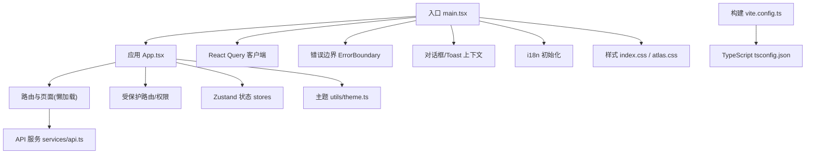
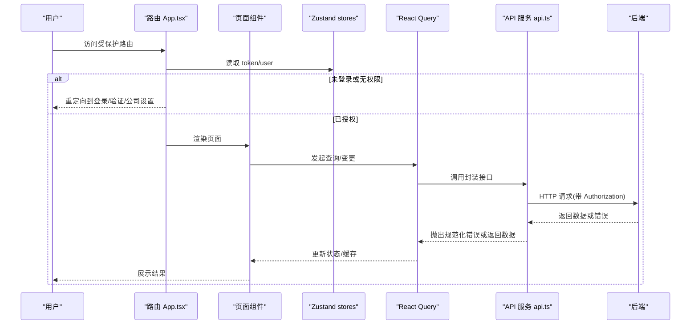
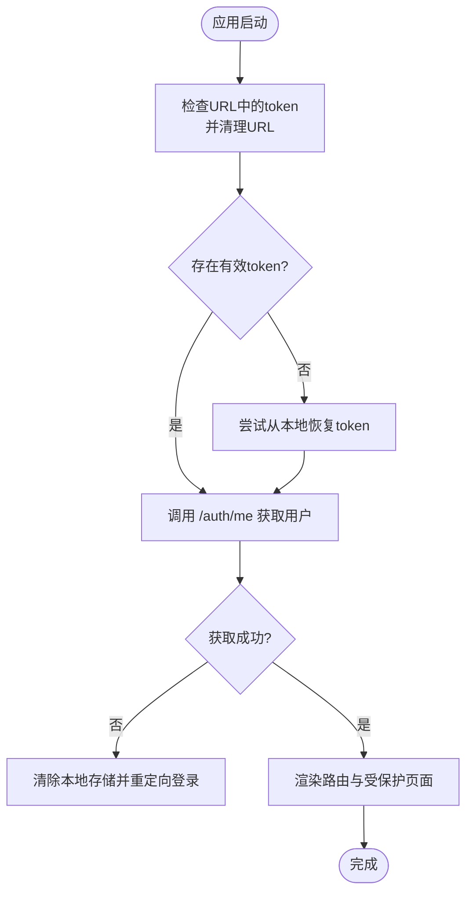
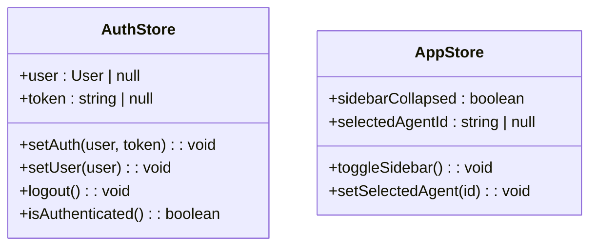
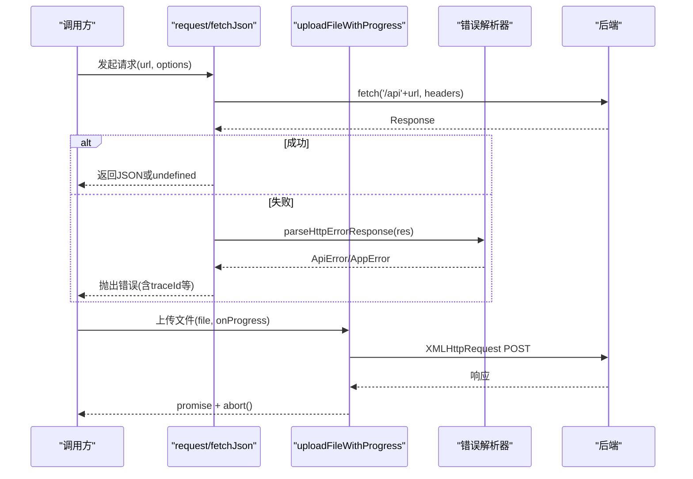
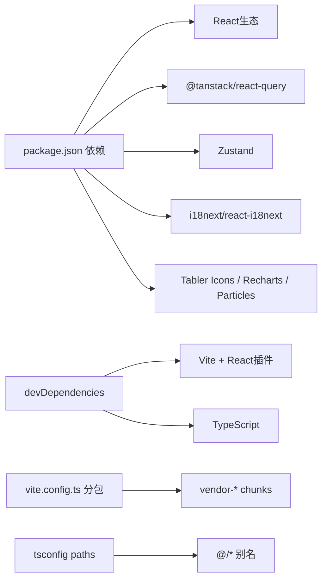

# 前端开发指南

<cite>
**本文引用的文件**   
- [frontend/package.json](file://frontend/package.json)
- [frontend/vite.config.ts](file://frontend/vite.config.ts)
- [frontend/tsconfig.json](file://frontend/tsconfig.json)
- [frontend/src/main.tsx](file://frontend/src/main.tsx)
- [frontend/src/App.tsx](file://frontend/src/App.tsx)
- [frontend/src/stores/index.ts](file://frontend/src/stores/index.ts)
- [frontend/src/services/api.ts](file://frontend/src/services/api.ts)
- [frontend/src/i18n/index.ts](file://frontend/src/i18n/index.ts)
- [frontend/src/utils/theme.ts](file://frontend/src/utils/theme.ts)
- [frontend/src/components/ErrorBoundary.tsx](file://frontend/src/components/ErrorBoundary.tsx)
- [frontend/src/pages/Layout.tsx](file://frontend/src/pages/Layout.tsx)
- [frontend/src/index.css](file://frontend/src/index.css)
- [frontend/src/styles/atlas.css](file://frontend/src/styles/atlas.css)
- [frontend/tests/apiError.test.mjs](file://frontend/tests/apiError.test.mjs)
</cite>

## 目录
1. [简介](#简介)
2. [项目结构](#项目结构)
3. [核心组件](#核心组件)
4. [架构总览](#架构总览)
5. [详细组件分析](#详细组件分析)
6. [依赖分析](#依赖分析)
7. [性能考虑](#性能考虑)
8. [故障排查指南](#故障排查指南)
9. [结论](#结论)
10. [附录](#附录)

## 简介
本指南面向使用 React 19 + TypeScript 的前端团队，基于仓库中的实际实现，系统化说明组件设计、状态管理（Zustand）、路由配置、API 调用封装与错误处理、国际化（i18n）、主题定制、响应式设计与样式管理、调试工具、测试编写以及构建部署流程。内容以代码为依据，辅以可视化图示，帮助开发者快速上手并遵循统一规范。

## 项目结构
前端工程位于 frontend 目录，采用 Vite + React + TypeScript 技术栈，模块化组织清晰：
- 入口与全局装配：main.tsx 负责初始化 React Query、路由、错误边界、对话框/通知上下文、主题色加载等。
- 应用路由与权限：App.tsx 集中定义路由表、懒加载页面、受保护路由、跨域租户切换 token 处理、通知栏等。
- 状态管理：stores/index.ts 使用 Zustand 维护认证与应用级状态。
- API 层：services/api.ts 统一封装 fetch 请求、上传、错误解析与业务模块 API。
- 国际化：i18n/index.ts 配置 i18next 与语言检测。
- 主题与样式：utils/theme.ts 提供强调色生成与持久化；index.css 定义设计系统与暗/亮主题；styles/atlas.css 用于引导页风格隔离。
- 构建与开发：vite.config.ts 配置别名、分包、代理与版本注入；tsconfig.json 定义编译选项与路径映射。
- 测试：tests 目录包含 Node 原生测试用例，覆盖错误处理契约。

**图表来源** 
- [frontend/src/main.tsx:1-38](file://frontend/src/main.tsx#L1-L38)
- [frontend/src/App.tsx:1-307](file://frontend/src/App.tsx#L1-L307)
- [frontend/src/stores/index.ts:1-53](file://frontend/src/stores/index.ts#L1-L53)
- [frontend/src/services/api.ts:1-651](file://frontend/src/services/api.ts#L1-L651)
- [frontend/src/i18n/index.ts:1-31](file://frontend/src/i18n/index.ts#L1-L31)
- [frontend/src/utils/theme.ts:1-97](file://frontend/src/utils/theme.ts#L1-L97)
- [frontend/src/index.css:1-800](file://frontend/src/index.css#L1-L800)
- [frontend/src/styles/atlas.css:1-200](file://frontend/src/styles/atlas.css#L1-L200)
- [frontend/vite.config.ts:1-59](file://frontend/vite.config.ts#L1-L59)
- [frontend/tsconfig.json:1-33](file://frontend/tsconfig.json#L1-L33)

**章节来源**
- [frontend/src/main.tsx:1-38](file://frontend/src/main.tsx#L1-L38)
- [frontend/src/App.tsx:1-307](file://frontend/src/App.tsx#L1-L307)
- [frontend/package.json:1-37](file://frontend/package.json#L1-L37)
- [frontend/vite.config.ts:1-59](file://frontend/vite.config.ts#L1-L59)
- [frontend/tsconfig.json:1-33](file://frontend/tsconfig.json#L1-L33)

## 核心组件
- 入口与全局上下文
  - React Query 客户端：集中配置重试策略与窗口聚焦行为。
  - 错误边界：捕获未处理异常并提供可刷新界面。
  - 对话框与 Toast：通过 Provider 暴露全局提示能力。
  - 主题色：在首屏前加载已保存的强调色，避免闪烁。
- 路由与权限
  - 受保护路由：根据 token 与用户角色进行访问控制。
  - 公司设置强制跳转：无 tenant_id 时跳转到公司设置。
  - 邮箱验证强制跳转：未激活/未验证时跳转到验证页。
- 状态管理（Zustand）
  - 认证状态：token、user、登录/登出、鉴权判断。
  - 应用状态：侧边栏折叠、选中 Agent 等。
- API 服务层
  - 统一 request：自动携带 Authorization、网络错误归一化、401 自动登出。
  - 文件上传：支持进度回调与取消。
  - 错误解析：兼容多格式后端错误体，保留 traceId、runId、agentId、stage、details 等诊断字段。
- 国际化（i18n）
  - 语言检测顺序：localStorage > navigator，支持 zh/en。
  - 非显式语言码转换：zh* -> zh，en* -> en。
- 主题与样式
  - 强调色生成：从单一 hex 计算 hover/subtle/text 等变量并写入 CSS 自定义属性。
  - 设计系统：统一的色彩、间距、字体、阴影、圆角、过渡与布局变量。
  - Atlas 风格：引导页独立样式作用域，不影响主应用。

**章节来源**
- [frontend/src/main.tsx:1-38](file://frontend/src/main.tsx#L1-L38)
- [frontend/src/components/ErrorBoundary.tsx:1-62](file://frontend/src/components/ErrorBoundary.tsx#L1-L62)
- [frontend/src/App.tsx:1-307](file://frontend/src/App.tsx#L1-L307)
- [frontend/src/stores/index.ts:1-53](file://frontend/src/stores/index.ts#L1-L53)
- [frontend/src/services/api.ts:1-651](file://frontend/src/services/api.ts#L1-L651)
- [frontend/src/i18n/index.ts:1-31](file://frontend/src/i18n/index.ts#L1-L31)
- [frontend/src/utils/theme.ts:1-97](file://frontend/src/utils/theme.ts#L1-L97)
- [frontend/src/index.css:1-800](file://frontend/src/index.css#L1-L800)
- [frontend/src/styles/atlas.css:1-200](file://frontend/src/styles/atlas.css#L1-L200)

## 架构总览
前端采用“薄壳+强约定”的架构：
- 视图层：React 组件按功能划分，路由懒加载减少初始包体积。
- 状态层：Zustand 管理全局轻量状态，配合 React Query 做数据缓存与同步。
- 数据层：统一的 API 服务封装，错误处理与上传能力集中。
- 基础设施：i18n、主题、错误边界、Toast/Dialog 作为横切关注点。

**图表来源** 
- [frontend/src/App.tsx:1-307](file://frontend/src/App.tsx#L1-L307)
- [frontend/src/stores/index.ts:1-53](file://frontend/src/stores/index.ts#L1-L53)
- [frontend/src/services/api.ts:1-651](file://frontend/src/services/api.ts#L1-L651)

## 详细组件分析

### 入口与全局装配（main.tsx）
- 职责
  - 创建 React Query 客户端并设置默认重试与窗口聚焦策略。
  - 挂载错误边界、路由、对话框与 Toast 上下文。
  - 启动前加载已保存的主题强调色，避免首屏闪烁。
- 关键点
  - 严格模式包裹，便于开发期发现副作用问题。
  - 所有 Provider 自上而下注入，确保子树可用。

**章节来源**
- [frontend/src/main.tsx:1-38](file://frontend/src/main.tsx#L1-L38)

### 应用路由与权限（App.tsx）
- 职责
  - 集中定义路由表，懒加载页面组件。
  - 实现 ProtectedRoute 与 CompanyAdminRoute 权限控制。
  - 处理跨域租户切换 URL 中的 token，清理 URL 防止泄露。
  - 通知栏动态显示与滚动动画。
- 关键点
  - 首次加载时根据 token 获取用户信息，失败则登出。
  - 对特定路径（如重置密码、邮箱验证）跳过 token 消费逻辑。

**图表来源** 
- [frontend/src/App.tsx:212-260](file://frontend/src/App.tsx#L212-L260)

**章节来源**
- [frontend/src/App.tsx:1-307](file://frontend/src/App.tsx#L1-L307)

### 状态管理（Zustand）
- 认证状态（useAuthStore）
  - 字段：user、token
  - 方法：setAuth、setUser、logout、isAuthenticated
  - 持久化：token 读写 localStorage
- 应用状态（useAppStore）
  - 字段：sidebarCollapsed、selectedAgentId
  - 方法：toggleSidebar、setSelectedAgent
  - 持久化：侧边栏折叠状态持久化

**图表来源** 
- [frontend/src/stores/index.ts:1-53](file://frontend/src/stores/index.ts#L1-L53)

**章节来源**
- [frontend/src/stores/index.ts:1-53](file://frontend/src/stores/index.ts#L1-L53)

### API 服务与错误处理（api.ts）
- 通用请求
  - 自动附加 Authorization 头
  - 网络异常归一化为 AppError，标记 retryable
  - 401 自动登出（排除认证相关端点）
- 文件上传
  - 支持进度回调与取消
  - 上传完成后进入“处理阶段”（101 哨兵值）
- 错误解析
  - 优先使用结构化 error 信封，兼容 legacy detail
  - 保留 traceId、runId、agentId、stage、details、retryable 等诊断字段
  - 支持字符串、对象、校验列表等多种 detail 形态

**图表来源** 
- [frontend/src/services/api.ts:11-45](file://frontend/src/services/api.ts#L11-L45)
- [frontend/src/services/api.ts:78-128](file://frontend/src/services/api.ts#L78-L128)
- [frontend/tests/apiError.test.mjs:1-142](file://frontend/tests/apiError.test.mjs#L1-L142)

**章节来源**
- [frontend/src/services/api.ts:1-651](file://frontend/src/services/api.ts#L1-L651)
- [frontend/tests/apiError.test.mjs:1-142](file://frontend/tests/apiError.test.mjs#L1-L142)

### 国际化（i18n）
- 配置要点
  - 语言检测顺序：localStorage > navigator
  - 支持语言：en、zh
  - 非显式语言码转换：zh* -> zh，en* -> en
  - 回退语言：en
- 使用方式
  - 通过 react-i18next 提供的 useTranslation 钩子在组件中获取 t 函数

**章节来源**
- [frontend/src/i18n/index.ts:1-31](file://frontend/src/i18n/index.ts#L1-L31)

### 主题与样式（theme.ts、index.css、atlas.css）
- 强调色工具
  - 输入 hex，输出 --accent-primary/hover/subtle/text/btn-text 等 CSS 变量
  - 持久化到 localStorage，应用启动时自动加载
- 设计系统
  - 暗/亮主题变量集合，涵盖背景、文本、边框、状态、阴影、间距、字体、圆角、过渡
  - 通知栏高度变量与 marquee 动画
- Atlas 风格
  - 仅作用于 .atlas-page 作用域，用于引导页，不影响主应用

**章节来源**
- [frontend/src/utils/theme.ts:1-97](file://frontend/src/utils/theme.ts#L1-L97)
- [frontend/src/index.css:1-800](file://frontend/src/index.css#L1-L800)
- [frontend/src/styles/atlas.css:1-200](file://frontend/src/styles/atlas.css#L1-L200)

### 错误边界（ErrorBoundary.tsx）
- 功能
  - 捕获子树未处理异常，展示友好错误信息与详情
  - 提供刷新按钮恢复应用
- 集成
  - 在 main.tsx 顶层包裹，确保全局生效

**章节来源**
- [frontend/src/components/ErrorBoundary.tsx:1-62](file://frontend/src/components/ErrorBoundary.tsx#L1-L62)

### 布局与导航（Layout.tsx）
- 功能
  - 侧边栏折叠/展开、搜索与置顶
  - 租户切换、通知轮询、账户设置、语言切换
  - 导览（Company Tour）与动态定位
- 交互
  - 使用 React Query 拉取未读通知、租户列表与 Agent 列表
  - 通过 useGroupUnread 聚合群组未读数

**章节来源**
- [frontend/src/pages/Layout.tsx:1-800](file://frontend/src/pages/Layout.tsx#L1-L800)

## 依赖分析
- 运行时依赖
  - React 19、react-dom、react-router-dom、@tanstack/react-query、zustand、i18next、react-i18next、recharts、@tabler/icons-react、tsparticles
- 开发依赖
  - Vite、@vitejs/plugin-react、typescript
- 构建与分包
  - vendor-react、vendor-charts、vendor-i18n、vendor-icons 手动分包提升缓存命中率
- 路径别名
  - @/* -> src/* 简化导入

**图表来源** 
- [frontend/package.json:1-37](file://frontend/package.json#L1-L37)
- [frontend/vite.config.ts:1-59](file://frontend/vite.config.ts#L1-L59)
- [frontend/tsconfig.json:1-33](file://frontend/tsconfig.json#L1-L33)

**章节来源**
- [frontend/package.json:1-37](file://frontend/package.json#L1-L37)
- [frontend/vite.config.ts:1-59](file://frontend/vite.config.ts#L1-L59)
- [frontend/tsconfig.json:1-33](file://frontend/tsconfig.json#L1-L33)

## 性能考虑
- 路由懒加载：页面组件按需加载，降低首屏体积。
- 分包策略：将 React、图表、i18n、图标等第三方库拆分为独立 chunk，提高缓存命中。
- 数据缓存：React Query 默认启用缓存与重试，减少重复请求。
- 上传优化：XMLHttpRequest 支持进度与取消，避免阻塞。
- 样式与主题：CSS 变量与最小化重绘，避免首屏闪烁。
- 构建优化：Vite 生产构建开启 tree-shaking 与压缩。

[本节为通用指导，不直接分析具体文件]

## 故障排查指南
- 常见问题
  - 401 自动登出：检查是否访问了非认证端点且 token 无效；确认 request 是否正确附加 Authorization。
  - 上传失败：查看 uploadFileWithProgress 的错误分支与 XHR 事件；确认超时与取消逻辑。
  - 错误信息不可读：确认后端返回的 detail/error 结构是否符合解析器预期；检查 traceId 是否传递。
  - 国际化不生效：检查浏览器语言与 localStorage 中的语言设置；确认 supportedLngs 与 convertDetectedLanguage。
  - 主题色未生效：确认 loadSavedAccentColor 是否在首屏前执行；检查 CSS 变量是否被覆盖。
- 调试建议
  - 使用浏览器 Network 面板查看请求与响应头（X-Trace-Id）。
  - 在错误边界中查看堆栈与详细信息。
  - 使用 React DevTools 检查状态与组件树。
  - 运行 tests 目录下的 Node 测试用例验证错误解析契约。

**章节来源**
- [frontend/src/services/api.ts:11-45](file://frontend/src/services/api.ts#L11-L45)
- [frontend/src/services/api.ts:78-128](file://frontend/src/services/api.ts#L78-L128)
- [frontend/tests/apiError.test.mjs:1-142](file://frontend/tests/apiError.test.mjs#L1-L142)
- [frontend/src/components/ErrorBoundary.tsx:1-62](file://frontend/src/components/ErrorBoundary.tsx#L1-L62)
- [frontend/src/i18n/index.ts:1-31](file://frontend/src/i18n/index.ts#L1-L31)
- [frontend/src/utils/theme.ts:1-97](file://frontend/src/utils/theme.ts#L1-L97)

## 结论
本项目以清晰的层次与严格的约定实现了高可维护性的前端架构：Zustand 管理轻量全局状态，React Query 负责数据流，API 层统一封装与错误处理，i18n 与主题系统提供一致体验，Vite 构建优化性能。遵循本指南的规范与最佳实践，可显著提升团队协作效率与交付质量。

[本节为总结性内容，不直接分析具体文件]

## 附录
- 开发脚本
  - dev：启动开发服务器
  - build：类型检查与构建
  - test：运行 Node 测试
  - preview：预览构建产物
- 环境变量与代理
  - BACKEND_PORT：后端端口，用于开发代理
  - 代理规则：/api 与 /ws 转发至后端
- 版本注入
  - __APP_VERSION__：从 VERSION 文件与构建时间拼接

**章节来源**
- [frontend/package.json:1-37](file://frontend/package.json#L1-L37)
- [frontend/vite.config.ts:1-59](file://frontend/vite.config.ts#L1-L59)