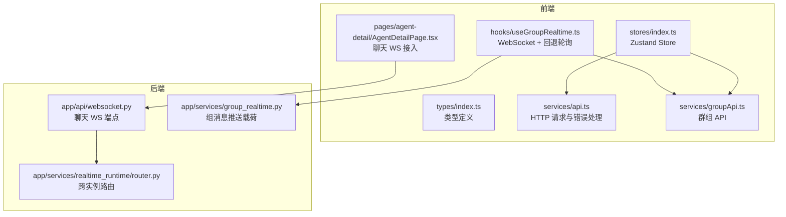
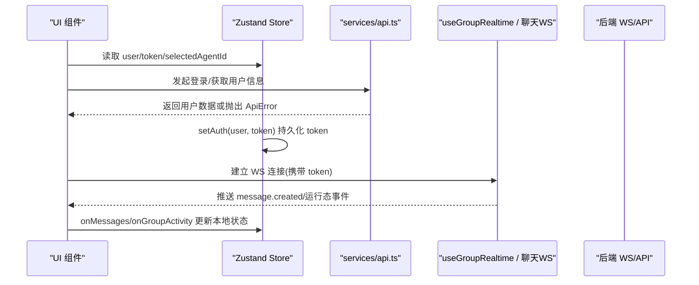
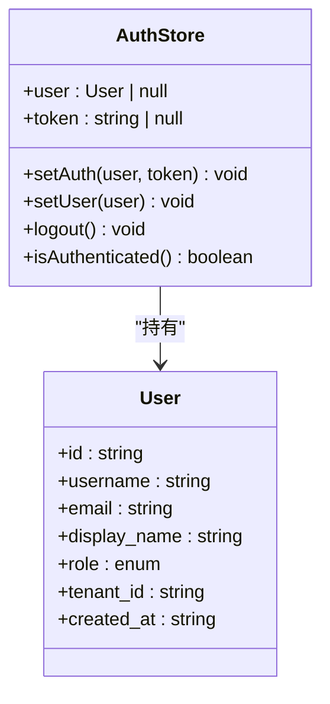
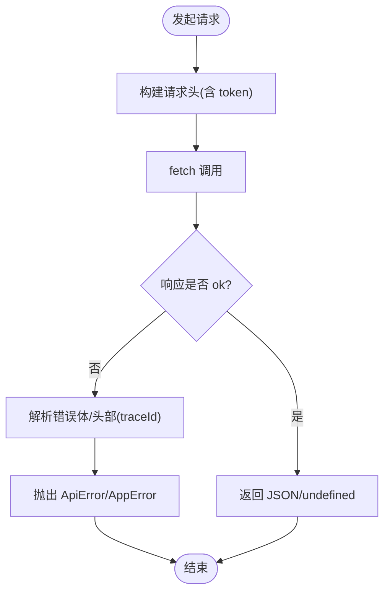
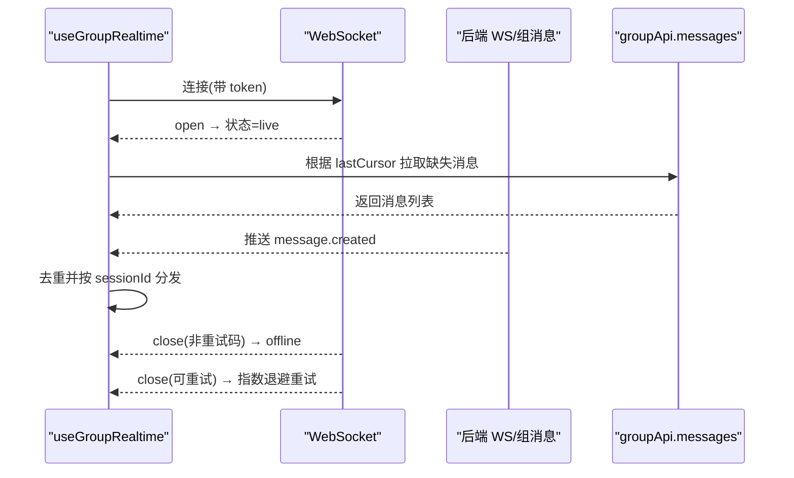
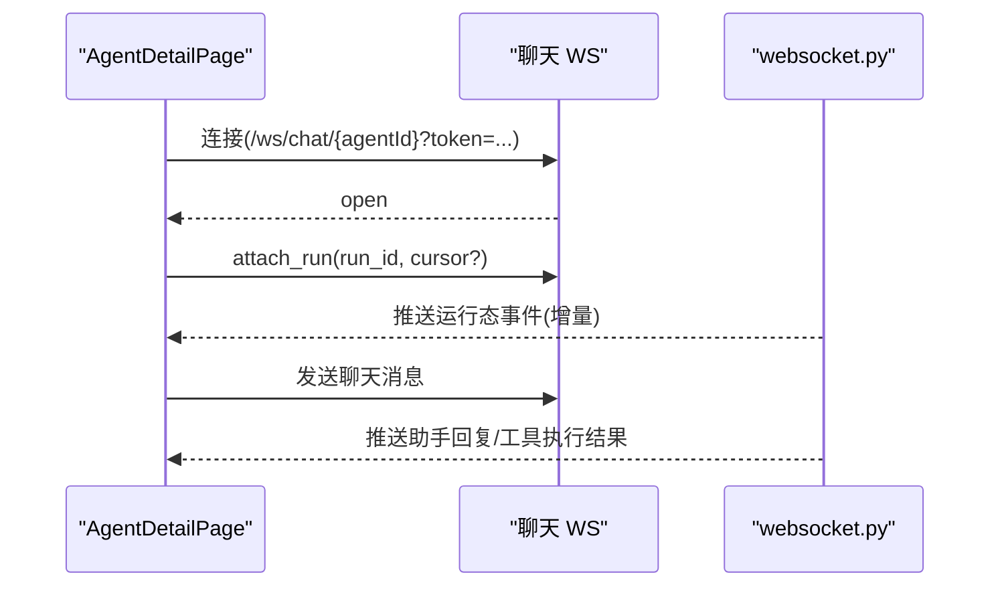
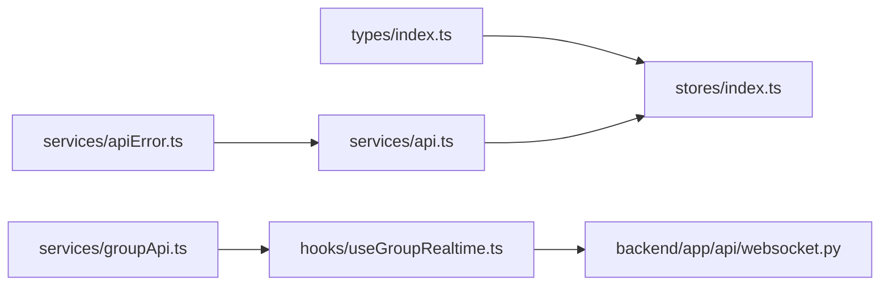

# 状态管理

<cite>
**本文引用的文件**   
- [frontend/src/stores/index.ts](file://frontend/src/stores/index.ts)
- [frontend/src/types/index.ts](file://frontend/src/types/index.ts)
- [frontend/src/services/api.ts](file://frontend/src/services/api.ts)
- [frontend/src/services/apiError.ts](file://frontend/src/services/apiError.ts)
- [frontend/src/services/groupApi.ts](file://frontend/src/services/groupApi.ts)
- [frontend/src/hooks/useGroupRealtime.ts](file://frontend/src/hooks/useGroupRealtime.ts)
- [backend/app/api/websocket.py](file://backend/app/api/websocket.py)
- [backend/app/services/realtime_runtime/router.py](file://backend/app/services/realtime_runtime/router.py)
- [backend/app/services/group_realtime.py](file://backend/app/services/group_realtime.py)
- [frontend/src/pages/agent-detail/AgentDetailPage.tsx](file://frontend/src/pages/agent-detail/AgentDetailPage.tsx)
</cite>

## 目录
1. [简介](#简介)
2. [项目结构](#项目结构)
3. [核心组件](#核心组件)
4. [架构总览](#架构总览)
5. [详细组件分析](#详细组件分析)
6. [依赖关系分析](#依赖关系分析)
7. [性能考虑](#性能考虑)
8. [故障排查指南](#故障排查指南)
9. [结论](#结论)
10. [附录](#附录)

## 简介
本文件系统性梳理前端基于 Zustand 的状态管理方案，覆盖 store 设计、状态更新、异步操作处理、API 调用封装、缓存策略、错误处理、状态持久化、中间件使用与性能优化。重点说明 authStore、用户状态、Agent 状态等核心模式，以及 WebSocket 实时数据同步机制（群组消息与聊天运行态）。文档同时给出调试与测试建议及重构方向，帮助读者快速理解并高效扩展。

## 项目结构
前端状态管理集中在 stores 模块，结合 types 定义、services API 层与 hooks 实时能力；后端提供 WebSocket 路由与组内实时通知。整体分层清晰：UI 通过 hooks 订阅 store，业务逻辑通过 services 访问后端，store 负责状态与持久化。

图表来源 
- [frontend/src/stores/index.ts:1-53](file://frontend/src/stores/index.ts#L1-L53)
- [frontend/src/services/api.ts:1-120](file://frontend/src/services/api.ts#L1-L120)
- [frontend/src/services/groupApi.ts:1-120](file://frontend/src/services/groupApi.ts#L1-L120)
- [frontend/src/hooks/useGroupRealtime.ts:1-120](file://frontend/src/hooks/useGroupRealtime.ts#L1-L120)
- [backend/app/api/websocket.py:1-120](file://backend/app/api/websocket.py#L1-L120)
- [backend/app/services/group_realtime.py:1-37](file://backend/app/services/group_realtime.py#L1-L37)
- [backend/app/services/realtime_runtime/router.py:1-34](file://backend/app/services/realtime_runtime/router.py#L1-L34)

章节来源
- [frontend/src/stores/index.ts:1-53](file://frontend/src/stores/index.ts#L1-L53)
- [frontend/src/types/index.ts:1-94](file://frontend/src/types/index.ts#L1-L94)

## 核心组件
- AuthStore：维护登录态（用户与 token），支持设置、登出、鉴权判断，并将 token 持久化到 localStorage。
- AppStore：维护应用级 UI 状态（侧边栏折叠、选中 Agent 等），部分状态持久化到 localStorage。
- API 服务层：统一 HTTP 请求、错误解析、自动登出与网络异常归一化。
- 群组实时 Hook：封装 WebSocket 连接、断线重试、降级轮询、游标补全与去重。
- 聊天页面 WS 接入：建立聊天 WS 通道，附加运行态事件与光标对齐。

章节来源
- [frontend/src/stores/index.ts:1-53](file://frontend/src/stores/index.ts#L1-L53)
- [frontend/src/services/api.ts:1-120](file://frontend/src/services/api.ts#L1-L120)
- [frontend/src/hooks/useGroupRealtime.ts:1-120](file://frontend/src/hooks/useGroupRealtime.ts#L1-L120)
- [frontend/src/pages/agent-detail/AgentDetailPage.tsx:3312-3340](file://frontend/src/pages/agent-detail/AgentDetailPage.tsx#L3312-L3340)

## 架构总览
前端以 Zustand 为单一状态源，UI 组件通过 useAuthStore/useAppStore 订阅最小化更新；所有服务端交互由 services/api.ts 与 groupApi.ts 统一封装，错误通过 apiError.ts 标准化；实时通信由 useGroupRealtime 与 AgentDetailPage 中的 WS 逻辑驱动，后端提供 ws/chat 与组消息推送。

图表来源 
- [frontend/src/stores/index.ts:15-34](file://frontend/src/stores/index.ts#L15-L34)
- [frontend/src/services/api.ts:11-45](file://frontend/src/services/api.ts#L11-L45)
- [frontend/src/hooks/useGroupRealtime.ts:155-227](file://frontend/src/hooks/useGroupRealtime.ts#L155-L227)
- [backend/app/api/websocket.py:1085-1119](file://backend/app/api/websocket.py#L1085-L1119)

## 详细组件分析

### AuthStore 与用户状态
- 数据结构：user、token、setAuth、setUser、logout、isAuthenticated。
- 持久化：token 读写 localStorage；登出时清理。
- 鉴权：isAuthenticated 基于 token 存在性；API 层在 401 非认证接口自动清除并跳转登录。
- 类型约束：User、TokenResponse 定义于 types/index.ts。

图表来源 
- [frontend/src/stores/index.ts:6-34](file://frontend/src/stores/index.ts#L6-L34)
- [frontend/src/types/index.ts:3-17](file://frontend/src/types/index.ts#L3-L17)

章节来源
- [frontend/src/stores/index.ts:6-34](file://frontend/src/stores/index.ts#L6-L34)
- [frontend/src/types/index.ts:3-17](file://frontend/src/types/index.ts#L3-L17)
- [frontend/src/services/api.ts:25-41](file://frontend/src/services/api.ts#L25-L41)

### AppStore 与应用状态
- 字段：sidebarCollapsed、selectedAgentId。
- 行为：toggleSidebar 切换并持久化；setSelectedAgent 设置当前 Agent。
- 适用场景：导航状态、选中项记忆，提升用户体验一致性。

章节来源
- [frontend/src/stores/index.ts:36-52](file://frontend/src/stores/index.ts#L36-L52)

### API 调用封装与错误处理
- request：统一 fetch，自动注入 Authorization 头，处理 401 自动登出与跳转，统一抛错。
- uploadFileWithProgress：支持上传进度与超时/取消控制。
- 错误模型：AppError/ApiError，包含 code、status、traceId、runId、agentId、stage、retryable 等上下文，便于追踪与重试决策。
- 校验与兼容：parseHttpErrorResponse 兼容新旧错误体格式，提取可重试标志。

图表来源 
- [frontend/src/services/api.ts:11-45](file://frontend/src/services/api.ts#L11-L45)
- [frontend/src/services/apiError.ts:168-181](file://frontend/src/services/apiError.ts#L168-L181)

章节来源
- [frontend/src/services/api.ts:1-120](file://frontend/src/services/api.ts#L1-L120)
- [frontend/src/services/apiError.ts:1-204](file://frontend/src/services/apiError.ts#L1-L204)

### 群组实时数据同步（WebSocket）
- useGroupRealtime：
  - 连接：构造 wss/ws URL，携带 token。
  - 状态机：connecting → live/polling/offline，失败阈值触发降级轮询。
  - 补全：基于 cursor 向后拉取缺失消息，限制页数避免雪崩。
  - 去重：按消息 id 去重，保证幂等。
- 后端：
  - group_realtime：序列化标准 payload（含 cursor）。
  - realtime_runtime/router：跨实例路由与 presence TTL。

图表来源 
- [frontend/src/hooks/useGroupRealtime.ts:155-227](file://frontend/src/hooks/useGroupRealtime.ts#L155-L227)
- [frontend/src/services/groupApi.ts:101-112](file://frontend/src/services/groupApi.ts#L101-L112)
- [backend/app/services/group_realtime.py:24-37](file://backend/app/services/group_realtime.py#L24-L37)
- [backend/app/services/realtime_runtime/router.py:21-34](file://backend/app/services/realtime_runtime/router.py#L21-L34)

章节来源
- [frontend/src/hooks/useGroupRealtime.ts:1-249](file://frontend/src/hooks/useGroupRealtime.ts#L1-L249)
- [frontend/src/services/groupApi.ts:1-245](file://frontend/src/services/groupApi.ts#L1-L245)
- [backend/app/services/group_realtime.py:1-37](file://backend/app/services/group_realtime.py#L1-L37)
- [backend/app/services/realtime_runtime/router.py:1-34](file://backend/app/services/realtime_runtime/router.py#L1-L34)

### 聊天运行态与 WebSocket 事件
- AgentDetailPage：建立 /ws/chat/{agentId} 连接，登录后 attach_run 并携带 cursor，确保事件对齐。
- 后端 websocket.py：接收客户端消息，启动流式运行，持续推送事件包。

图表来源 
- [frontend/src/pages/agent-detail/AgentDetailPage.tsx:3312-3340](file://frontend/src/pages/agent-detail/AgentDetailPage.tsx#L3312-L3340)
- [backend/app/api/websocket.py:1085-1119](file://backend/app/api/websocket.py#L1085-L1119)

章节来源
- [frontend/src/pages/agent-detail/AgentDetailPage.tsx:3312-3340](file://frontend/src/pages/agent-detail/AgentDetailPage.tsx#L3312-L3340)
- [backend/app/api/websocket.py:1085-1119](file://backend/app/api/websocket.py#L1085-L1119)

### 状态持久化与缓存策略
- 持久化：authStore 的 token、AppStore 的 sidebarCollapsed 使用 localStorage。
- 缓存失效：modelCacheEvents.ts 提供跨标签页/存储事件的模型缓存失效通知（可用于扩展 store 缓存）。
- 建议：对高频只读数据（如模板、配置）引入内存缓存 + 版本键，配合失效事件刷新。

章节来源
- [frontend/src/stores/index.ts:15-34](file://frontend/src/stores/index.ts#L15-L34)
- [frontend/src/stores/index.ts:43-52](file://frontend/src/stores/index.ts#L43-L52)

### 中间件与扩展点
- 当前未使用 zustand/middleware（如 persist、devtools）。可在不改动现有逻辑的前提下添加：
  - persist：集中管理持久化字段与版本迁移。
  - devtools：开发期调试与时间旅行。
  - 自定义中间件：日志、埋点、权限拦截。

[本节为通用建议，不直接分析具体文件]

### 性能优化要点
- 细粒度订阅：组件仅订阅所需字段，减少重渲染。
- 批量更新：合并多次 set 调用，降低渲染次数。
- 防抖/节流：输入类操作（搜索、滚动加载）加节流。
- 懒加载：大对象按需加载与拆分 store。
- WebSocket 降级：失败阈值后切换轮询，保障可用性。

[本节为通用建议，不直接分析具体文件]

## 依赖关系分析
- stores/index.ts 依赖 types/index.ts 的类型定义。
- services/api.ts 依赖 apiError.ts 的错误模型。
- hooks/useGroupRealtime.ts 依赖 services/groupApi.ts 进行历史消息拉取。
- pages/agent-detail/AgentDetailPage.tsx 依赖后端 websocket.py 提供的事件流。

图表来源 
- [frontend/src/types/index.ts:1-94](file://frontend/src/types/index.ts#L1-L94)
- [frontend/src/stores/index.ts:1-53](file://frontend/src/stores/index.ts#L1-L53)
- [frontend/src/services/apiError.ts:1-204](file://frontend/src/services/apiError.ts#L1-L204)
- [frontend/src/services/api.ts:1-120](file://frontend/src/services/api.ts#L1-L120)
- [frontend/src/services/groupApi.ts:1-120](file://frontend/src/services/groupApi.ts#L1-L120)
- [frontend/src/hooks/useGroupRealtime.ts:1-120](file://frontend/src/hooks/useGroupRealtime.ts#L1-L120)
- [backend/app/api/websocket.py:1-120](file://backend/app/api/websocket.py#L1-L120)

章节来源
- [frontend/src/stores/index.ts:1-53](file://frontend/src/stores/index.ts#L1-L53)
- [frontend/src/services/api.ts:1-120](file://frontend/src/services/api.ts#L1-L120)
- [frontend/src/services/apiError.ts:1-204](file://frontend/src/services/apiError.ts#L1-L204)
- [frontend/src/services/groupApi.ts:1-245](file://frontend/src/services/groupApi.ts#L1-L245)
- [frontend/src/hooks/useGroupRealtime.ts:1-249](file://frontend/src/hooks/useGroupRealtime.ts#L1-L249)
- [backend/app/api/websocket.py:1-120](file://backend/app/api/websocket.py#L1-L120)

## 性能考虑
- 状态粒度：将频繁更新的运行态与低频配置分拆至不同 store，避免不必要重渲染。
- 事件合并：WS 消息在高并发下做批处理与去重，减少 UI 抖动。
- 资源释放：组件卸载时关闭 WS、清理定时器，防止内存泄漏。
- 降级策略：WS 不可用时自动切换轮询，保证基础功能可用。

[本节为通用建议，不直接分析具体文件]

## 故障排查指南
- 401 自动登出：检查 API 层 401 分支与 localStorage 清理逻辑，确认非认证接口被正确保护。
- WS 连接失败：查看 useGroupRealtime 的重试阈值与降级轮询，确认 token 有效性与域名协议。
- 消息丢失：核对 cursor 比较与分页拉取上限，确保去重与顺序一致。
- 错误追踪：利用 ApiError 的 traceId/runId/agentId/stage 定位问题链路。

章节来源
- [frontend/src/services/api.ts:25-41](file://frontend/src/services/api.ts#L25-L41)
- [frontend/src/hooks/useGroupRealtime.ts:208-227](file://frontend/src/hooks/useGroupRealtime.ts#L208-L227)
- [frontend/src/services/apiError.ts:168-181](file://frontend/src/services/apiError.ts#L168-L181)

## 结论
本项目采用轻量而清晰的 Zustand 状态管理模式，结合统一的 API 封装与健壮的错误处理，实现了高可用的实时通信体验。通过合理的持久化、降级策略与性能优化，保证了用户体验与系统稳定性。后续可通过中间件增强调试与缓存能力，进一步提升可维护性与扩展性。

[本节为总结，不直接分析具体文件]

## 附录
- 调试建议：
  - 启用 zustand devtools（开发环境）观察状态变更与时间旅行。
  - 在 API 层打印 traceId 并在前端展示，便于跨端联调。
- 测试策略：
  - 单元测试：对 API 错误解析、cursor 排序、WS 状态机进行断言。
  - 契约测试：验证 WS 消息结构与后端保持一致。
- 重构建议：
  - 引入 zustand/middleware.persist 统一管理持久化字段与版本迁移。
  - 将运行态与业务数据进一步拆分，降低耦合度。

[本节为通用建议，不直接分析具体文件]