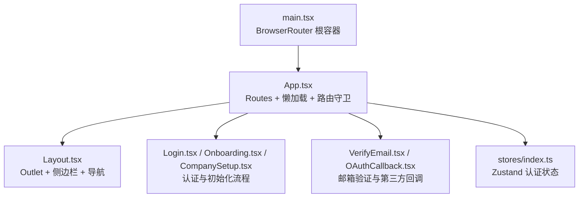
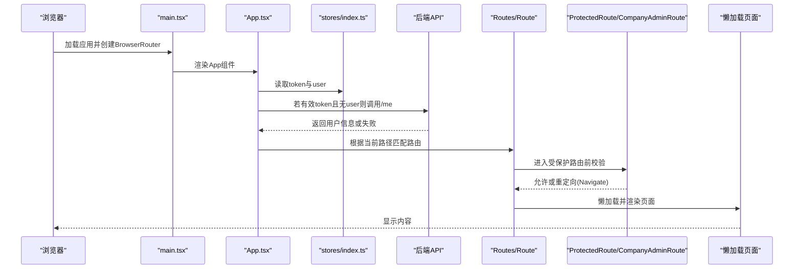
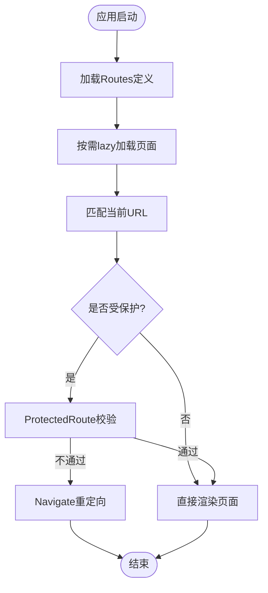
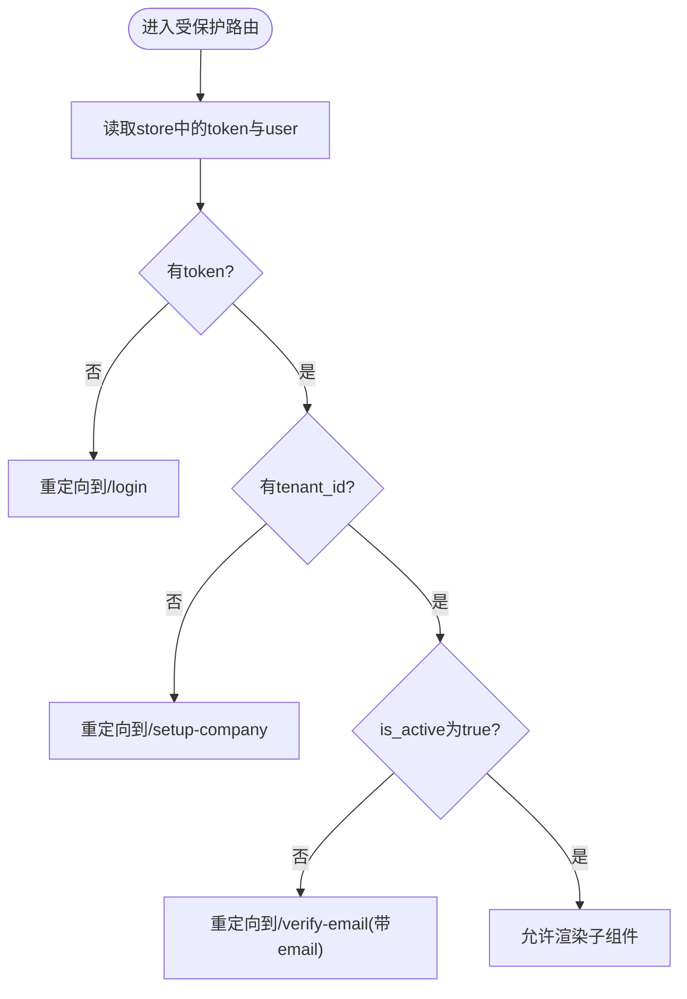
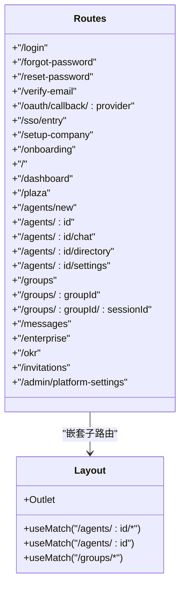
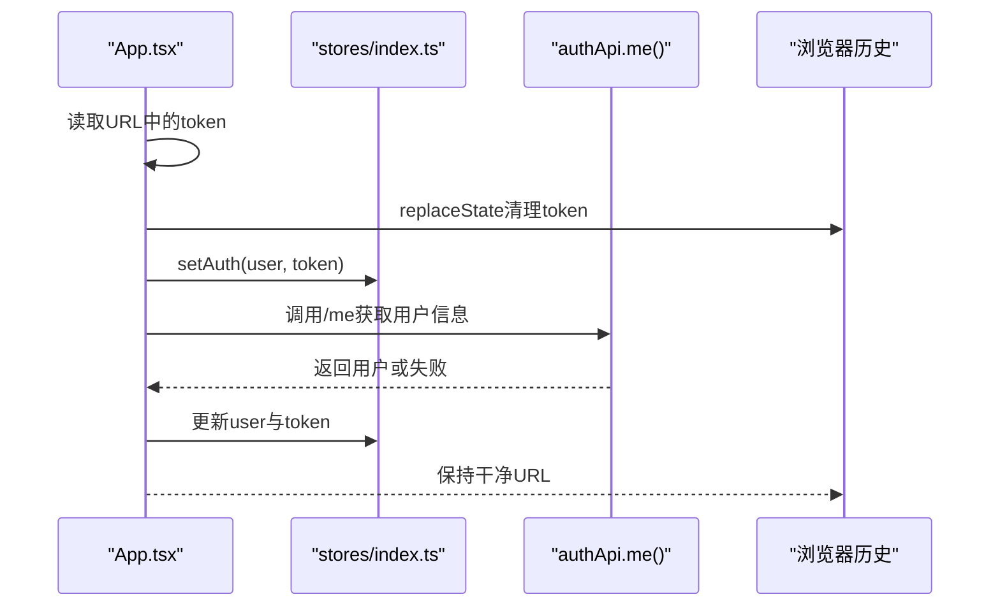
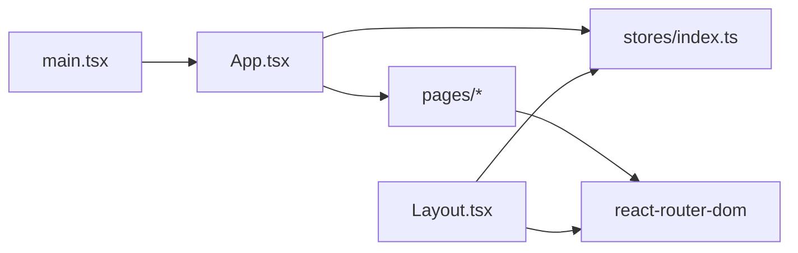

# 路由与导航

<cite>
**本文引用的文件**   
- [main.tsx](file://frontend/src/main.tsx)
- [App.tsx](file://frontend/src/App.tsx)
- [Layout.tsx](file://frontend/src/pages/Layout.tsx)
- [Login.tsx](file://frontend/src/pages/Login.tsx)
- [Onboarding.tsx](file://frontend/src/pages/Onboarding.tsx)
- [CompanySetup.tsx](file://frontend/src/pages/CompanySetup.tsx)
- [VerifyEmail.tsx](file://frontend/src/pages/VerifyEmail.tsx)
- [OAuthCallback.tsx](file://frontend/src/pages/OAuthCallback.tsx)
- [stores/index.ts](file://frontend/src/stores/index.ts)
</cite>

## 目录
1. [简介](#简介)
2. [项目结构](#项目结构)
3. [核心组件](#核心组件)
4. [架构总览](#架构总览)
5. [详细组件分析](#详细组件分析)
6. [依赖关系分析](#依赖关系分析)
7. [性能考虑](#性能考虑)
8. [故障排查指南](#故障排查指南)
9. [结论](#结论)
10. [附录](#附录)

## 简介
本文件系统性梳理前端 React Router 的路由配置、权限控制与导航流程，覆盖动态路由、嵌套路由、路由参数处理、登录验证、页面跳转逻辑、懒加载优化、重定向处理、路由状态管理、历史记录处理等。重点解析 ProtectedRoute、CompanyAdminRoute 等权限控制组件的实现，并结合 Layout 中的导航与菜单行为说明整体交互。

## 项目结构
- 应用入口通过 BrowserRouter 包裹整个应用，提供路由能力。
- App 内集中定义 Routes，使用 lazy 实现页面级懒加载，并通过 Suspense 展示加载态。
- 权限控制通过自定义组件（ProtectedRoute、CompanyAdminRoute）在路由层进行拦截与重定向。
- 布局与导航集中在 Layout 中，结合 useMatch/useLocation/useNavigate 完成动态高亮与跳转。
- 认证与用户状态通过 Zustand store 管理，供路由守卫与页面组件共享。

**图表来源** 
- [main.tsx:1-38](file://frontend/src/main.tsx#L1-L38)
- [App.tsx:1-307](file://frontend/src/App.tsx#L1-L307)
- [Layout.tsx:1-800](file://frontend/src/pages/Layout.tsx#L1-L800)
- [Login.tsx:1-800](file://frontend/src/pages/Login.tsx#L1-L800)
- [Onboarding.tsx:1-280](file://frontend/src/pages/Onboarding.tsx#L1-L280)
- [CompanySetup.tsx:1-57](file://frontend/src/pages/CompanySetup.tsx#L1-L57)
- [VerifyEmail.tsx:1-34](file://frontend/src/pages/VerifyEmail.tsx#L1-L34)
- [OAuthCallback.tsx:1-38](file://frontend/src/pages/OAuthCallback.tsx#L1-L38)
- [stores/index.ts:1-53](file://frontend/src/stores/index.ts#L1-L53)

**章节来源**
- [main.tsx:1-38](file://frontend/src/main.tsx#L1-L38)
- [App.tsx:1-307](file://frontend/src/App.tsx#L1-L307)

## 核心组件
- BrowserRouter：应用根容器，提供 history 与路由上下文。
- Routes/Route：声明式路由表，支持 index、嵌套、动态参数与重定向。
- Suspense + lazy：页面级代码分割与按需加载。
- ProtectedRoute：未登录或未完成租户设置时重定向到登录或公司设置；未激活邮箱时重定向至验证页。
- CompanyAdminRoute：仅平台管理员或组织管理员可访问企业设置。
- Layout：主布局，包含侧边栏、通知、主题切换、多租户切换、导航高亮与 Outlet 渲染。
- stores/index.ts：Zustand 存储 token、用户信息、登录/登出方法，供路由守卫与页面组件读取。

**章节来源**
- [App.tsx:27-45](file://frontend/src/App.tsx#L27-L45)
- [App.tsx:271-306](file://frontend/src/App.tsx#L271-L306)
- [Layout.tsx:1-800](file://frontend/src/pages/Layout.tsx#L1-L800)
- [stores/index.ts:1-53](file://frontend/src/stores/index.ts#L1-L53)

## 架构总览
下图展示了从应用启动到路由匹配与权限校验的整体流程，包括跨域 token 注入、用户信息获取、懒加载页面渲染以及受保护路由的跳转逻辑。

**图表来源** 
- [main.tsx:1-38](file://frontend/src/main.tsx#L1-L38)
- [App.tsx:212-260](file://frontend/src/App.tsx#L212-L260)
- [App.tsx:271-306](file://frontend/src/App.tsx#L271-L306)
- [stores/index.ts:15-34](file://frontend/src/stores/index.ts#L15-L34)

## 详细组件分析

### 路由表与懒加载
- 使用 Routes 集中定义所有路由，包括公开路由（登录、忘记密码、重置密码、邮箱验证、OAuth回调、SSO入口、公司设置）与受保护路由（仪表盘、广场、Agent相关、群组、消息、企业设置、OKR、邀请码、平台设置）。
- 首页 index 路由重定向到 /dashboard。
- agents/:id 重定向到 chat，体现 URL 规范化。
- 所有页面通过 lazy 导入，配合 Suspense 提供统一的加载体验。

**图表来源** 
- [App.tsx:271-306](file://frontend/src/App.tsx#L271-L306)

**章节来源**
- [App.tsx:271-306](file://frontend/src/App.tsx#L271-L306)

### 权限控制：ProtectedRoute 与 CompanyAdminRoute
- ProtectedRoute：
  - 检查 token，不存在则重定向到 /login。
  - 若 user 存在但无 tenant_id，强制跳转到 /setup-company。
  - 若 user.is_active 为 false，重定向到 /verify-email，并携带 email 作为 state。
- CompanyAdminRoute：
  - 仅当 user.role 为 platform_admin 或 org_admin，或 is_platform_admin 为真时允许访问。
  - 否则重定向到首页。

**图表来源** 
- [App.tsx:27-38](file://frontend/src/App.tsx#L27-L38)
- [App.tsx:40-45](file://frontend/src/App.tsx#L40-L45)

**章节来源**
- [App.tsx:27-45](file://frontend/src/App.tsx#L27-L45)

### 动态路由与嵌套路由
- 动态参数：
  - agents/:id/chat、agents/:id/directory、agents/:id/settings 均指向 AgentDetail，体现同一组件按不同路径渲染不同视图。
  - groups/:groupId、groups/:groupId/:sessionId 用于群组会话详情。
- 嵌套路由：
  - / 下嵌套多个子路由，使用 Outlet 渲染子页面。
  - agents/:id/* 与 agents/:id 分别用于判断是否为聊天页或设置页，以调整布局样式。

**图表来源** 
- [App.tsx:284-301](file://frontend/src/App.tsx#L284-L301)
- [Layout.tsx:429-435](file://frontend/src/pages/Layout.tsx#L429-L435)

**章节来源**
- [App.tsx:284-301](file://frontend/src/App.tsx#L284-L301)
- [Layout.tsx:429-435](file://frontend/src/pages/Layout.tsx#L429-L435)

### 路由参数处理与页面跳转
- useSearchParams：用于读取查询参数，如 onboarding 的 mode、plaza 的 tour 与 assistantId。
- useParams：用于读取动态段，如 OAuthCallback 的 provider。
- useNavigate：用于编程式跳转，如登录后跳转到 /、/setup-company、/onboarding?mode=join 等。
- useLocation：用于读取当前路径与 state，如 VerifyEmail 从 location.state 获取 email。

示例场景：
- 登录成功后根据是否需要公司设置决定跳转到 /setup-company 或 /。
- Onboarding 根据 mode=create/join 执行不同流程，完成后跳转到 /agents/:id/chat。
- OAuthCallback 读取 code 与 state，完成授权后选择租户并设置 token。

**章节来源**
- [Login.tsx:217-343](file://frontend/src/pages/Login.tsx#L217-L343)
- [Onboarding.tsx:33-53](file://frontend/src/pages/Onboarding.tsx#L33-L53)
- [OAuthCallback.tsx:24-38](file://frontend/src/pages/OAuthCallback.tsx#L24-L38)
- [VerifyEmail.tsx:1-34](file://frontend/src/pages/VerifyEmail.tsx#L1-L34)

### 路由状态管理与历史记录处理
- 跨域租户切换时，App 在启动阶段读取 URL 中的 token，持久化到 localStorage，并清理 URL 避免历史污染。
- 成功获取用户信息后更新 Zustand store，确保路由守卫与页面组件能正确响应。
- 登出时清除 token 并跳转到 /login。

**图表来源** 
- [App.tsx:216-260](file://frontend/src/App.tsx#L216-L260)
- [stores/index.ts:15-34](file://frontend/src/stores/index.ts#L15-L34)

**章节来源**
- [App.tsx:216-260](file://frontend/src/App.tsx#L216-L260)
- [stores/index.ts:15-34](file://frontend/src/stores/index.ts#L15-L34)

### 面包屑导航与导航高亮
- Layout 中使用 NavLink 渲染侧边栏导航项，并根据 isActive 自动添加 active 类名。
- 使用 useMatch 判断当前活跃路由，用于条件渲染与样式控制（如聊天页固定高度布局）。
- 未实现传统面包屑组件，但可通过 useLocation.pathname 与路由层级自行扩展。

**章节来源**
- [Layout.tsx:1065-1085](file://frontend/src/pages/Layout.tsx#L1065-L1085)
- [Layout.tsx:429-435](file://frontend/src/pages/Layout.tsx#L429-L435)

## 依赖关系分析
- main.tsx 引入 BrowserRouter，作为路由上下文提供者。
- App.tsx 依赖 stores/index.ts 的 useAuthStore 获取认证状态。
- 各页面组件通过 react-router-dom 提供的 hooks 进行导航与参数读取。
- Layout 依赖 react-router-dom 的 Outlet、NavLink、useMatch、useLocation、useNavigate 完成布局与导航。

**图表来源** 
- [main.tsx:1-38](file://frontend/src/main.tsx#L1-L38)
- [App.tsx:1-307](file://frontend/src/App.tsx#L1-L307)
- [Layout.tsx:1-800](file://frontend/src/pages/Layout.tsx#L1-L800)
- [stores/index.ts:1-53](file://frontend/src/stores/index.ts#L1-L53)

**章节来源**
- [main.tsx:1-38](file://frontend/src/main.tsx#L1-L38)
- [App.tsx:1-307](file://frontend/src/App.tsx#L1-L307)
- [Layout.tsx:1-800](file://frontend/src/pages/Layout.tsx#L1-L800)
- [stores/index.ts:1-53](file://frontend/src/stores/index.ts#L1-L53)

## 性能考虑
- 页面级懒加载：通过 lazy 将每个页面拆分为独立 chunk，减少首屏体积。
- Suspense 加载态：统一展示“加载中...”提示，提升用户体验。
- 路由重定向最小化：仅在必要时进行 Navigate，避免重复渲染。
- 查询参数与状态分离：使用 searchParams 与 state 传递轻量数据，避免 URL 过长。
- 历史记录清理：跨域 token 注入后立即 replaceState 清理 URL，防止历史污染与敏感信息泄露。

[本节为通用指导，无需特定文件引用]

## 故障排查指南
- 登录后仍被重定向到登录页：
  - 检查 stores/index.ts 中 token 是否正确持久化与读取。
  - 确认 App 启动阶段是否成功调用 /auth/me 并更新 store。
- 无法访问企业设置：
  - 检查 user.role 与 is_platform_admin 是否符合 CompanyAdminRoute 的条件。
- 邮箱验证失败：
  - 确认 VerifyEmail 页面是否正确读取 location.state.email 与 URL 参数 token/code。
- OAuth 回调异常：
  - 检查 OAuthCallback 是否正确解析 code、state 与 error 参数。

**章节来源**
- [stores/index.ts:15-34](file://frontend/src/stores/index.ts#L15-L34)
- [App.tsx:27-45](file://frontend/src/App.tsx#L27-L45)
- [VerifyEmail.tsx:1-34](file://frontend/src/pages/VerifyEmail.tsx#L1-L34)
- [OAuthCallback.tsx:24-38](file://frontend/src/pages/OAuthCallback.tsx#L24-L38)

## 结论
本项目通过 React Router 实现了清晰的路由结构与完善的权限控制体系。ProtectedRoute 与 CompanyAdminRoute 在路由层保障了安全访问；懒加载与 Suspense 提升了性能；Layout 提供了统一的导航与布局体验。结合 Zustand 的状态管理与浏览器历史记录清理，整体架构具备良好的可维护性与扩展性。

[本节为总结，无需特定文件引用]

## 附录
- 常用路由钩子：
  - useNavigate：编程式跳转
  - useLocation：读取当前路径与 state
  - useSearchParams：读取查询参数
  - useParams：读取动态段参数
  - useMatch：判断当前匹配的路由模式
- 推荐实践：
  - 将受保护路由统一用组件包裹，便于复用与维护。
  - 使用 lazy 与 Suspense 拆分大页面，优化首屏加载。
  - 避免在 URL 中传递敏感信息，必要时使用 replaceState 清理。

[本节为补充说明，无需特定文件引用]