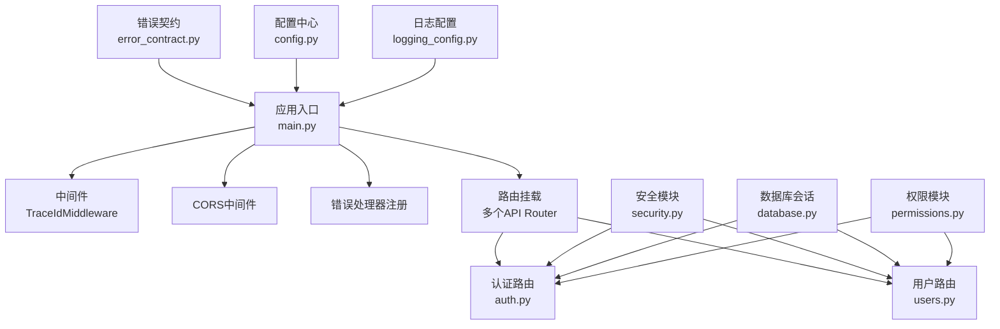
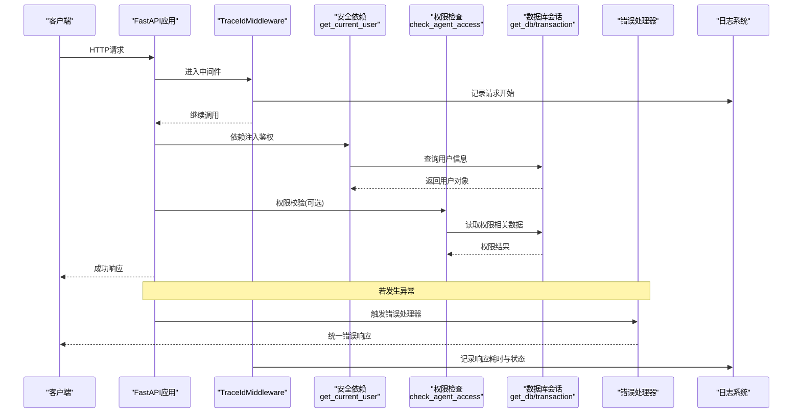
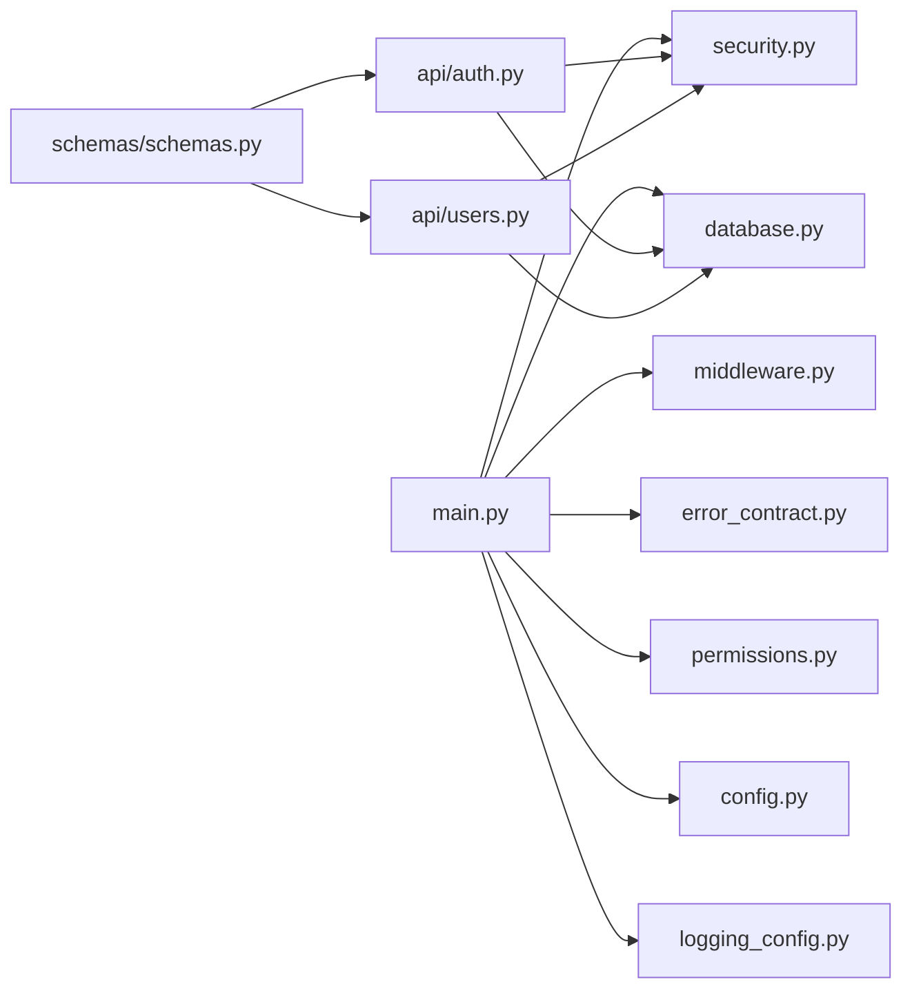

# API开发规范

<cite>
**本文引用的文件**   
- [backend/app/main.py](file://backend/app/main.py)
- [backend/app/core/middleware.py](file://backend/app/core/middleware.py)
- [backend/app/core/security.py](file://backend/app/core/security.py)
- [backend/app/core/error_contract.py](file://backend/app/core/error_contract.py)
- [backend/app/config.py](file://backend/app/config.py)
- [backend/app/api/auth.py](file://backend/app/api/auth.py)
- [backend/app/schemas/schemas.py](file://backend/app/schemas/schemas.py)
- [backend/app/core/permissions.py](file://backend/app/core/permissions.py)
- [backend/app/database.py](file://backend/app/database.py)
- [backend/app/core/logging_config.py](file://backend/app/core/logging_config.py)
- [backend/app/api/users.py](file://backend/app/api/users.py)
</cite>

## 目录
1. [简介](#简介)
2. [项目结构](#项目结构)
3. [核心组件](#核心组件)
4. [架构总览](#架构总览)
5. [详细组件分析](#详细组件分析)
6. [依赖关系分析](#依赖关系分析)
7. [性能考量](#性能考量)
8. [故障排查指南](#故障排查指南)
9. [结论](#结论)
10. [附录](#附录)

## 简介
本规范基于仓库中的FastAPI后端实现，总结并提炼出适用于生产环境的API开发规范与最佳实践。内容覆盖路由定义、请求参数验证、响应模型设计、错误处理策略；RESTful设计与HTTP状态码使用；分页与过滤模式；认证与授权集成；CORS配置；OpenAPI文档与客户端SDK生成；Pydantic模型验证、依赖注入、中间件使用；异步API开发模式、异常处理与日志记录等。

## 项目结构
后端采用模块化分层组织：
- 应用入口与生命周期管理：main.py
- 中间件与追踪：core/middleware.py
- 安全与鉴权：core/security.py
- 统一错误契约：core/error_contract.py
- 配置中心：config.py（Pydantic Settings）
- 数据库会话与事务：database.py
- 权限控制：core/permissions.py
- API路由与业务编排：app/api/*
- Pydantic数据模型：app/schemas/schemas.py
- 日志配置：core/logging_config.py

**图表来源** 
- [backend/app/main.py:352-470](file://backend/app/main.py#L352-L470)
- [backend/app/core/middleware.py:12-53](file://backend/app/core/middleware.py#L12-L53)
- [backend/app/core/error_contract.py:224-229](file://backend/app/core/error_contract.py#L224-L229)
- [backend/app/config.py:79-120](file://backend/app/config.py#L79-L120)
- [backend/app/database.py:30-42](file://backend/app/database.py#L30-L42)
- [backend/app/core/permissions.py:481-518](file://backend/app/core/permissions.py#L481-L518)
- [backend/app/core/logging_config.py:61-79](file://backend/app/core/logging_config.py#L61-L79)

**章节来源**
- [backend/app/main.py:352-470](file://backend/app/main.py#L352-L470)
- [backend/app/core/middleware.py:12-53](file://backend/app/core/middleware.py#L12-L53)
- [backend/app/core/error_contract.py:224-229](file://backend/app/core/error_contract.py#L224-L229)
- [backend/app/config.py:79-120](file://backend/app/config.py#L79-L120)
- [backend/app/database.py:30-42](file://backend/app/database.py#L30-L42)
- [backend/app/core/permissions.py:481-518](file://backend/app/core/permissions.py#L481-L518)
- [backend/app/core/logging_config.py:61-79](file://backend/app/core/logging_config.py#L61-L79)

## 核心组件
- 应用启动与生命周期：在lifespan中完成日志初始化、后台任务启动、Redis关闭钩子、实时路由订阅等。
- 中间件：TraceIdMiddleware为每个请求注入trace_id，记录请求/响应耗时，并在响应头回传trace_id。
- 错误契约：统一HTTPException、RequestValidationError与未捕获异常的响应格式，包含code、message、trace_id等字段。
- 配置中心：通过Pydantic Settings集中管理环境变量，提供默认值与校验规则。
- 数据库会话：异步Session工厂与上下文管理器transaction，确保提交或回滚。
- 安全模块：JWT签发与解析、密码哈希/校验、当前用户获取、角色检查依赖。
- 权限模块：RBAC能力，包括Agent可见性、访问级别、关系状态评估等。
- 日志配置：loguru统一输出，拦截标准库日志，支持trace_id上下文。

**章节来源**
- [backend/app/main.py:121-150](file://backend/app/main.py#L121-L150)
- [backend/app/core/middleware.py:12-53](file://backend/app/core/middleware.py#L12-L53)
- [backend/app/core/error_contract.py:158-229](file://backend/app/core/error_contract.py#L158-L229)
- [backend/app/config.py:79-120](file://backend/app/config.py#L79-L120)
- [backend/app/database.py:30-79](file://backend/app/database.py#L30-L79)
- [backend/app/core/security.py:128-174](file://backend/app/core/security.py#L128-L174)
- [backend/app/core/permissions.py:481-518](file://backend/app/core/permissions.py#L481-L518)
- [backend/app/core/logging_config.py:61-79](file://backend/app/core/logging_config.py#L61-L79)

## 架构总览
下图展示了从请求进入FastAPI到返回响应的关键路径，包括中间件、鉴权、权限、数据库、错误处理与日志。

**图表来源** 
- [backend/app/core/middleware.py:15-53](file://backend/app/core/middleware.py#L15-L53)
- [backend/app/core/security.py:153-174](file://backend/app/core/security.py#L153-L174)
- [backend/app/core/permissions.py:481-518](file://backend/app/core/permissions.py#L481-L518)
- [backend/app/database.py:30-42](file://backend/app/database.py#L30-L42)
- [backend/app/core/error_contract.py:158-229](file://backend/app/core/error_contract.py#L158-L229)
- [backend/app/core/logging_config.py:61-79](file://backend/app/core/logging_config.py#L61-L79)

## 详细组件分析

### 路由定义与RESTful设计
- 路由组织：按功能域拆分Router，统一前缀挂载（如/api），公共接口可无前缀。
- REST原则：资源名词化、HTTP动词语义化、状态码准确表达结果。
- 示例：
  - 认证路由：/api/auth/login、/api/auth/register/init、/api/auth/me等
  - 用户管理：/api/users/、/api/users/{user_id}/quota、/api/users/{user_id}/role
  - 健康检查：/api/health、/api/version

**章节来源**
- [backend/app/main.py:422-470](file://backend/app/main.py#L422-L470)
- [backend/app/api/auth.py:43-800](file://backend/app/api/auth.py#L43-L800)
- [backend/app/api/users.py:49-200](file://backend/app/api/users.py#L49-L200)

### 请求参数验证与响应模型
- 使用Pydantic BaseModel进行强类型校验，支持EmailStr、Field约束、枚举等。
- 响应模型：UserOut、TokenResponse、AgentOut等，统一序列化与from_attributes映射。
- 分页通用模型：PaginatedResponse（items、total、page、page_size）。

**章节来源**
- [backend/app/schemas/schemas.py:11-165](file://backend/app/schemas/schemas.py#L11-L165)
- [backend/app/schemas/schemas.py:552-562](file://backend/app/schemas/schemas.py#L552-L562)

### 错误处理策略
- 统一错误对象：包含code、message、trace_id及可选的run_id、agent_id、stage、details、retryable。
- 三类处理器：
  - HTTPException：保留detail并补充统一error对象
  - RequestValidationError：结构化校验错误
  - 未捕获异常：内部错误，不暴露敏感信息

**章节来源**
- [backend/app/core/error_contract.py:21-112](file://backend/app/core/error_contract.py#L21-L112)
- [backend/app/core/error_contract.py:158-229](file://backend/app/core/error_contract.py#L158-L229)

### 认证与授权集成
- JWT：创建与解码，过期时间由配置控制。
- 依赖注入：get_current_user、get_authenticated_user、require_role等。
- RBAC：平台管理员、组织管理员、成员角色层级；Agent访问控制与可见性评估。

**章节来源**
- [backend/app/core/security.py:128-174](file://backend/app/core/security.py#L128-L174)
- [backend/app/core/security.py:199-227](file://backend/app/core/security.py#L199-L227)
- [backend/app/core/permissions.py:481-518](file://backend/app/core/permissions.py#L481-L518)

### CORS配置
- 使用CORSMiddleware，根据CORS_ORIGINS动态设置allow_origins与allow_credentials。
- 当允许通配符时禁止携带凭证。

**章节来源**
- [backend/app/main.py:362-371](file://backend/app/main.py#L362-L371)
- [backend/app/config.py:177-179](file://backend/app/config.py#L177-L179)

### 分页与过滤实现
- 通用分页模型：PaginatedResponse用于列表接口。
- 服务层分页校验：_validate_pagination限制limit范围，防止过大查询。
- 常见模式：offset/limit或before/after游标分页（依具体场景选择）。

**章节来源**
- [backend/app/schemas/schemas.py:552-562](file://backend/app/schemas/schemas.py#L552-L562)
- [backend/app/api/directory.py:30-35](file://backend/app/api/directory.py#L30-L35)
- [backend/app/services/agent_directory.py:206-210](file://backend/app/services/agent_directory.py#L206-L210)

### 依赖注入与数据库事务
- get_db：异步Session工厂，自动commit/rollback。
- transaction：上下文管理器，支持嵌套事务与共享session。
- 在路由中通过Depends注入db与会话。

**章节来源**
- [backend/app/database.py:30-79](file://backend/app/database.py#L30-L79)

### 中间件使用
- TraceIdMiddleware：注入trace_id、记录请求/响应、回写响应头。
- 扩展点：可在中间件中做限流、审计、灰度等横切逻辑。

**章节来源**
- [backend/app/core/middleware.py:12-53](file://backend/app/core/middleware.py#L12-L53)

### 异步API开发模式
- 所有I/O操作使用async/await，CPU密集任务（如bcrypt）放入线程池避免阻塞事件循环。
- 背景任务：BackgroundTasks用于发送邮件、验证码等非阻塞流程。

**章节来源**
- [backend/app/core/security.py:28-52](file://backend/app/core/security.py#L28-L52)
- [backend/app/api/auth.py:76-112](file://backend/app/api/auth.py#L76-L112)

### 日志记录
- loguru统一配置，包含trace_id、调用栈、诊断信息。
- 拦截标准库日志，抑制高频连接日志噪音。

**章节来源**
- [backend/app/core/logging_config.py:61-79](file://backend/app/core/logging_config.py#L61-L79)
- [backend/app/core/logging_config.py:89-124](file://backend/app/core/logging_config.py#L89-L124)

### OpenAPI文档与客户端SDK生成
- FastAPI自动生成OpenAPI Schema，可通过/docs与/redoc查看。
- 结合pydantic模型与response_model，保证Schema准确性。
- 可使用openapi-generator或类似工具生成多语言客户端SDK。

**章节来源**
- [backend/app/main.py:352-356](file://backend/app/main.py#L352-L356)
- [backend/app/schemas/schemas.py:11-165](file://backend/app/schemas/schemas.py#L11-L165)

## 依赖关系分析
- main.py负责应用组装：中间件、CORS、错误处理器、路由挂载。
- security.py提供鉴权依赖，被各路由使用。
- permissions.py提供RBAC能力，被业务路由调用。
- database.py提供会话与事务，贯穿所有数据访问。
- error_contract.py统一错误响应，被全局异常处理器调用。
- config.py集中配置，被多处导入。
- logging_config.py在启动阶段配置日志。

**图表来源** 
- [backend/app/main.py:352-470](file://backend/app/main.py#L352-L470)
- [backend/app/core/middleware.py:12-53](file://backend/app/core/middleware.py#L12-L53)
- [backend/app/core/error_contract.py:224-229](file://backend/app/core/error_contract.py#L224-L229)
- [backend/app/core/security.py:153-174](file://backend/app/core/security.py#L153-L174)
- [backend/app/core/permissions.py:481-518](file://backend/app/core/permissions.py#L481-L518)
- [backend/app/database.py:30-42](file://backend/app/database.py#L30-L42)
- [backend/app/config.py:79-120](file://backend/app/config.py#L79-L120)
- [backend/app/core/logging_config.py:61-79](file://backend/app/core/logging_config.py#L61-L79)
- [backend/app/api/auth.py:43-800](file://backend/app/api/auth.py#L43-L800)
- [backend/app/api/users.py:49-200](file://backend/app/api/users.py#L49-L200)
- [backend/app/schemas/schemas.py:11-165](file://backend/app/schemas/schemas.py#L11-L165)

**章节来源**
- [backend/app/main.py:352-470](file://backend/app/main.py#L352-L470)
- [backend/app/core/middleware.py:12-53](file://backend/app/core/middleware.py#L12-L53)
- [backend/app/core/error_contract.py:224-229](file://backend/app/core/error_contract.py#L224-L229)
- [backend/app/core/security.py:153-174](file://backend/app/core/security.py#L153-L174)
- [backend/app/core/permissions.py:481-518](file://backend/app/core/permissions.py#L481-L518)
- [backend/app/database.py:30-42](file://backend/app/database.py#L30-L42)
- [backend/app/config.py:79-120](file://backend/app/config.py#L79-L120)
- [backend/app/core/logging_config.py:61-79](file://backend/app/core/logging_config.py#L61-L79)
- [backend/app/api/auth.py:43-800](file://backend/app/api/auth.py#L43-L800)
- [backend/app/api/users.py:49-200](file://backend/app/api/users.py#L49-L200)
- [backend/app/schemas/schemas.py:11-165](file://backend/app/schemas/schemas.py#L11-L165)

## 性能考量
- 异步优先：I/O密集型操作使用async/await，避免阻塞事件循环。
- CPU密集任务隔离：bcrypt等计算放入线程池执行。
- 数据库连接池：合理设置pool_size与max_overflow，避免连接耗尽。
- 分页与限流：限制limit上限，避免大结果集查询。
- 日志异步化：loguru启用enqueue，减少主线程压力。

[本节为通用指导，无需特定文件引用]

## 故障排查指南
- 统一错误响应：查看error对象中的code、message、trace_id定位问题。
- 请求追踪：通过X-Trace-Id关联请求全链路日志。
- 鉴权失败：检查JWT是否有效、用户是否激活、角色是否满足。
- 权限拒绝：确认租户隔离、Agent访问模式与权限记录。
- 数据库异常：检查事务边界、连接池配置与SQL语句。
- 日志降噪：已屏蔽高频连接日志，关注WARNING与ERROR级别。

**章节来源**
- [backend/app/core/error_contract.py:158-229](file://backend/app/core/error_contract.py#L158-L229)
- [backend/app/core/middleware.py:15-53](file://backend/app/core/middleware.py#L15-L53)
- [backend/app/core/security.py:153-174](file://backend/app/core/security.py#L153-L174)
- [backend/app/core/permissions.py:481-518](file://backend/app/core/permissions.py#L481-L518)
- [backend/app/database.py:30-79](file://backend/app/database.py#L30-L79)
- [backend/app/core/logging_config.py:89-124](file://backend/app/core/logging_config.py#L89-L124)

## 结论
本项目以FastAPI为核心，结合Pydantic、SQLAlchemy、loguru等生态组件，构建了高内聚、低耦合、可观测、可扩展的API体系。通过统一的错误契约、严格的参数验证、完善的鉴权与权限控制、以及规范的日志与追踪机制，确保了API的质量与稳定性。建议在新接口开发中遵循本规范，保持一致性与可维护性。

[本节为总结性内容，无需特定文件引用]

## 附录
- 常用HTTP状态码建议：
  - 200 OK：成功
  - 201 Created：资源创建成功
  - 400 Bad Request：请求参数错误
  - 401 Unauthorized：未认证或令牌无效
  - 403 Forbidden：无权限
  - 404 Not Found：资源不存在
  - 422 Unprocessable Entity：校验失败
  - 500 Internal Server Error：服务器内部错误
- OpenAPI文档访问：/docs与/redoc
- 客户端SDK生成：使用openapi-generator或等效工具，基于生成的Schema进行代码生成

[本节为通用指导，无需特定文件引用]