# 后端开发指南

<cite>
**本文引用的文件**   
- [backend/app/main.py](file://backend/app/main.py)
- [backend/app/config.py](file://backend/app/config.py)
- [backend/app/database.py](file://backend/app/database.py)
- [backend/app/core/middleware.py](file://backend/app/core/middleware.py)
- [backend/app/core/security.py](file://backend/app/core/security.py)
- [backend/app/core/permissions.py](file://backend/app/core/permissions.py)
- [backend/app/core/error_contract.py](file://backend/app/core/error_contract.py)
- [backend/app/core/logging_config.py](file://backend/app/core/logging_config.py)
- [backend/app/api/auth.py](file://backend/app/api/auth.py)
- [backend/app/schemas/schemas.py](file://backend/app/schemas/schemas.py)
- [backend/app/dao/base.py](file://backend/app/dao/base.py)
- [backend/app/models/user.py](file://backend/app/models/user.py)
- [backend/pyproject.toml](file://backend/pyproject.toml)
- [README.md](file://README.md)
</cite>

## 目录
1. [简介](#简介)
2. [项目结构](#项目结构)
3. [核心组件](#核心组件)
4. [架构总览](#架构总览)
5. [详细组件分析](#详细组件分析)
6. [依赖关系分析](#依赖关系分析)
7. [性能考虑](#性能考虑)
8. [故障排查指南](#故障排查指南)
9. [结论](#结论)
10. [附录：新功能开发流程与示例](#附录新功能开发流程与示例)

## 简介
本指南面向后端开发者，系统化阐述基于 FastAPI 的 Clawith 后端开发规范与实践。内容涵盖路由定义、请求响应模型、错误处理、中间件使用；服务层组织模式、业务逻辑分层、数据库操作最佳实践；认证授权机制、权限控制与安全考量；API 设计原则、版本管理与文档生成；调试技巧、日志记录与性能优化建议；并提供新功能开发的完整流程与代码级参考路径。

## 项目结构
后端采用模块化分层组织：
- 应用入口与生命周期管理：main.py
- 配置中心：config.py（环境变量驱动）
- 数据访问层：database.py（异步 SQLAlchemy）、dao/base.py（通用 DAO）
- 安全与鉴权：core/security.py、core/permissions.py
- 错误契约与统一异常：core/error_contract.py
- 日志与追踪：core/logging_config.py、core/middleware.py
- API 路由：app/api/*（按领域拆分）
- 数据模型：app/models/*（SQLAlchemy ORM）
- 请求/响应模型：app/schemas/schemas.py（Pydantic）
- 依赖与工具链：pyproject.toml

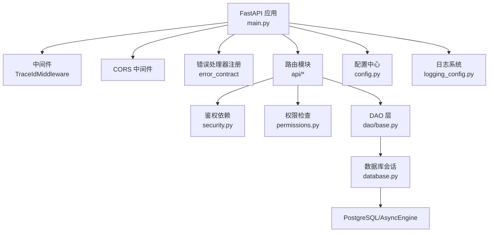

**图表来源** 
- [backend/app/main.py:352-471](file://backend/app/main.py#L352-L471)
- [backend/app/core/middleware.py:12-52](file://backend/app/core/middleware.py#L12-L52)
- [backend/app/core/error_contract.py:224-229](file://backend/app/core/error_contract.py#L224-L229)
- [backend/app/database.py:14-21](file://backend/app/database.py#L14-L21)
- [backend/app/config.py:79-120](file://backend/app/config.py#L79-L120)

**章节来源**
- [backend/app/main.py:1-513](file://backend/app/main.py#L1-L513)
- [backend/app/config.py:1-268](file://backend/app/config.py#L1-L268)
- [backend/app/database.py:1-79](file://backend/app/database.py#L1-L79)
- [backend/pyproject.toml:1-77](file://backend/pyproject.toml#L1-L77)
- [README.md:205-225](file://README.md#L205-L225)

## 核心组件
- 应用启动与生命周期：在 lifespan 中完成日志初始化、后台任务启动、路由挂载、健康检查端点等。
- 配置管理：通过 pydantic-settings 加载 .env，提供强类型 Settings 对象，支持运行时校验与默认值。
- 数据库连接：异步引擎与 sessionmaker，提供 get_db 依赖与 transaction 上下文管理器。
- 鉴权与授权：JWT 签发与校验、密码哈希、角色依赖、RBAC 权限判定。
- 错误契约：统一的 HTTP 错误体结构、trace_id 注入、验证错误标准化。
- 日志与追踪：loguru 集中化输出，trace_id 贯穿请求链路。

**章节来源**
- [backend/app/main.py:121-170](file://backend/app/main.py#L121-L170)
- [backend/app/config.py:79-120](file://backend/app/config.py#L79-L120)
- [backend/app/database.py:30-42](file://backend/app/database.py#L30-L42)
- [backend/app/core/security.py:128-151](file://backend/app/core/security.py#L128-L151)
- [backend/app/core/error_contract.py:158-181](file://backend/app/core/error_contract.py#L158-L181)
- [backend/app/core/logging_config.py:61-79](file://backend/app/core/logging_config.py#L61-L79)

## 架构总览
下图展示从客户端到数据库的关键调用路径，以及中间件、鉴权、权限、DAO 的协作关系。

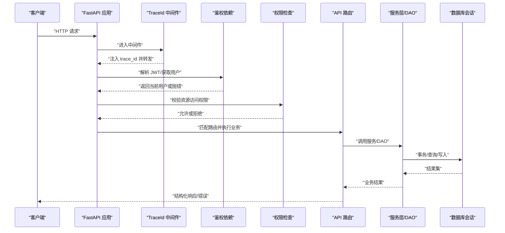

**图表来源** 
- [backend/app/core/middleware.py:15-52](file://backend/app/core/middleware.py#L15-L52)
- [backend/app/core/security.py:153-173](file://backend/app/core/security.py#L153-L173)
- [backend/app/core/permissions.py:481-518](file://backend/app/core/permissions.py#L481-L518)
- [backend/app/database.py:30-42](file://backend/app/database.py#L30-L42)

## 详细组件分析

### 应用入口与路由挂载
- 应用实例创建、错误处理器注册、中间件顺序、CORS 配置、路由前缀与分组。
- 健康检查与版本接口。
- 启动时根据进程角色（bootstrap/api/worker/connector）选择性拉起后台任务。

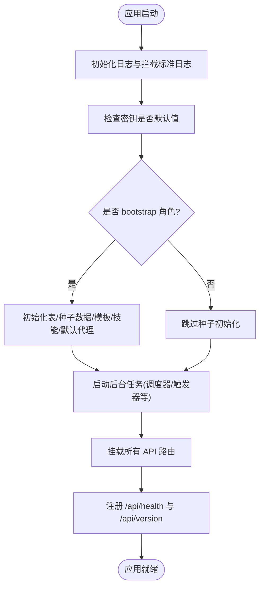

**图表来源** 
- [backend/app/main.py:121-170](file://backend/app/main.py#L121-L170)
- [backend/app/main.py:352-471](file://backend/app/main.py#L352-L471)
- [backend/app/main.py:473-513](file://backend/app/main.py#L473-L513)

**章节来源**
- [backend/app/main.py:121-170](file://backend/app/main.py#L121-L170)
- [backend/app/main.py:352-471](file://backend/app/main.py#L352-L471)
- [backend/app/main.py:473-513](file://backend/app/main.py#L473-L513)

### 配置管理（Settings）
- 使用 BaseSettings 加载环境变量，支持 .env 文件与环境变量覆盖。
- 包含数据库、Redis、JWT、存储、沙箱、Agent Runtime、第三方集成等关键配置。
- 字段校验与约束（如非空、范围、互斥）。

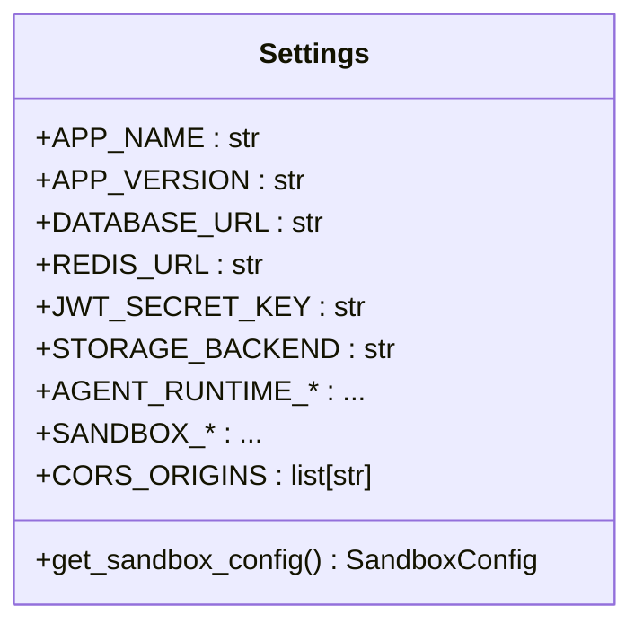

**图表来源** 
- [backend/app/config.py:79-120](file://backend/app/config.py#L79-L120)
- [backend/app/config.py:187-200](file://backend/app/config.py#L187-L200)
- [backend/app/config.py:244-268](file://backend/app/config.py#L244-L268)

**章节来源**
- [backend/app/config.py:79-120](file://backend/app/config.py#L79-L120)
- [backend/app/config.py:244-268](file://backend/app/config.py#L244-L268)

### 数据库与会话管理
- 异步引擎与 sessionmaker 配置，连接池大小与溢出限制。
- get_db 依赖提供请求级会话，自动提交或回滚。
- transaction 上下文管理器支持嵌套事务与上下文变量传递。

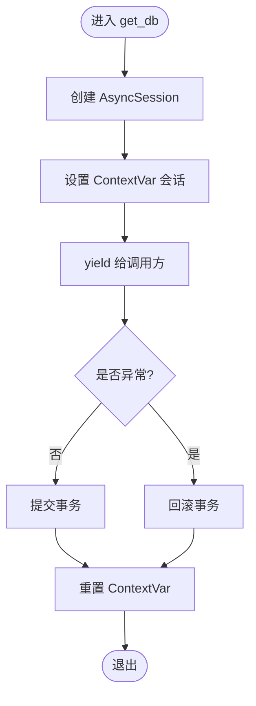

**图表来源** 
- [backend/app/database.py:30-42](file://backend/app/database.py#L30-L42)
- [backend/app/database.py:47-79](file://backend/app/database.py#L47-L79)

**章节来源**
- [backend/app/database.py:14-21](file://backend/app/database.py#L14-L21)
- [backend/app/database.py:30-42](file://backend/app/database.py#L30-L42)
- [backend/app/database.py:47-79](file://backend/app/database.py#L47-L79)

### 鉴权与授权
- JWT 签发与解码，Bearer 方案，线程池执行 bcrypt 避免阻塞事件循环。
- get_current_user/get_authenticated_user 依赖解析用户身份。
- require_role 工厂函数实现角色校验；平台管理员与组织管理员区分。
- RBAC 权限：基于租户隔离、访问模式（company/private/custom）、显式权限表。

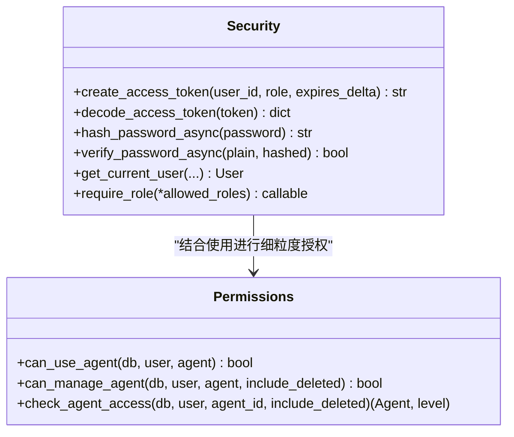

**图表来源** 
- [backend/app/core/security.py:128-151](file://backend/app/core/security.py#L128-L151)
- [backend/app/core/security.py:153-173](file://backend/app/core/security.py#L153-L173)
- [backend/app/core/security.py:211-227](file://backend/app/core/security.py#L211-L227)
- [backend/app/core/permissions.py:481-518](file://backend/app/core/permissions.py#L481-L518)

**章节来源**
- [backend/app/core/security.py:128-151](file://backend/app/core/security.py#L128-L151)
- [backend/app/core/security.py:153-173](file://backend/app/core/security.py#L153-L173)
- [backend/app/core/security.py:211-227](file://backend/app/core/security.py#L211-L227)
- [backend/app/core/permissions.py:481-518](file://backend/app/core/permissions.py#L481-L518)

### 错误契约与统一异常
- 统一 ErrorObject 结构，包含 code、message、trace_id、可选扩展字段。
- 注册 HTTPException、RequestValidationError、未捕获异常的处理器。
- 自动注入 X-Trace-Id 响应头，便于前端与链路追踪。

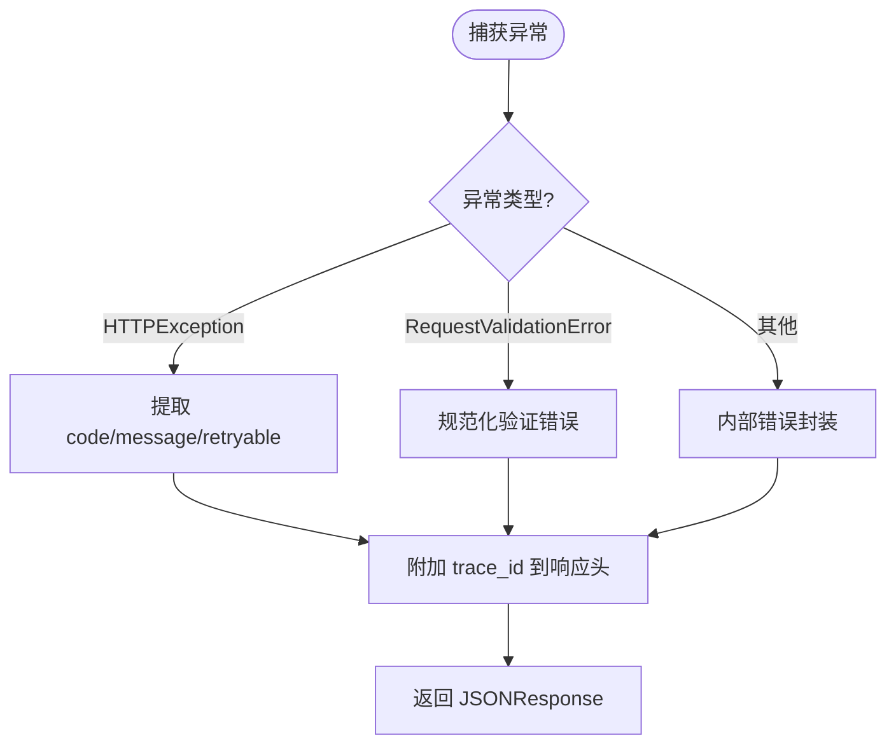

**图表来源** 
- [backend/app/core/error_contract.py:158-181](file://backend/app/core/error_contract.py#L158-L181)
- [backend/app/core/error_contract.py:184-202](file://backend/app/core/error_contract.py#L184-L202)
- [backend/app/core/error_contract.py:205-221](file://backend/app/core/error_contract.py#L205-L221)

**章节来源**
- [backend/app/core/error_contract.py:158-181](file://backend/app/core/error_contract.py#L158-L181)
- [backend/app/core/error_contract.py:184-202](file://backend/app/core/error_contract.py#L184-L202)
- [backend/app/core/error_contract.py:205-221](file://backend/app/core/error_contract.py#L205-L221)

### 日志与追踪
- loguru 集中配置，自定义格式包含 trace_id。
- 拦截标准库 logging，统一输出。
- TraceIdMiddleware 为每个请求注入 trace_id 并记录耗时。

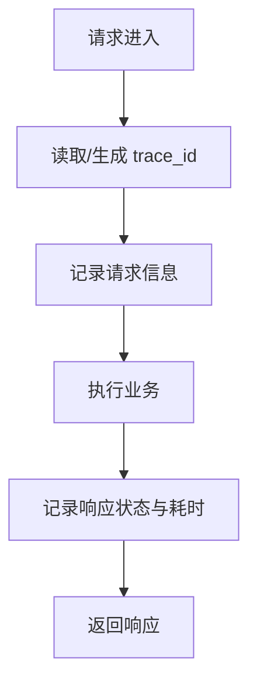

**图表来源** 
- [backend/app/core/logging_config.py:61-79](file://backend/app/core/logging_config.py#L61-L79)
- [backend/app/core/middleware.py:15-52](file://backend/app/core/middleware.py#L15-L52)

**章节来源**
- [backend/app/core/logging_config.py:61-79](file://backend/app/core/logging_config.py#L61-L79)
- [backend/app/core/middleware.py:15-52](file://backend/app/core/middleware.py#L15-L52)

### 认证登录流程（示例）
以注册与登录为例，展示从路由到服务层再到数据库的事务边界与背景任务。

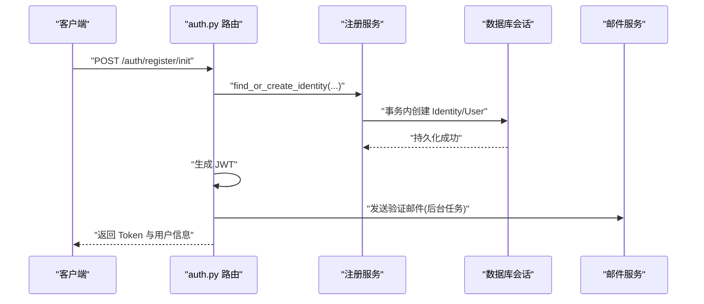

**图表来源** 
- [backend/app/api/auth.py:138-253](file://backend/app/api/auth.py#L138-L253)
- [backend/app/api/auth.py:422-542](file://backend/app/api/auth.py#L422-L542)

**章节来源**
- [backend/app/api/auth.py:138-253](file://backend/app/api/auth.py#L138-L253)
- [backend/app/api/auth.py:422-542](file://backend/app/api/auth.py#L422-L542)

### 数据模型与 DAO
- 模型：Identity（全局身份）与 User（租户内成员），关联关系与代理字段。
- DAO 基类：提供 session 上下文、CRUD 基础方法，适配测试 Mock。

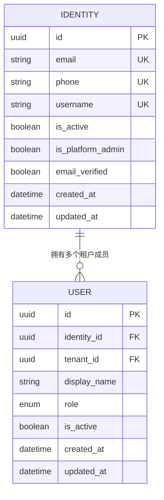

**图表来源** 
- [backend/app/models/user.py:16-50](file://backend/app/models/user.py#L16-L50)
- [backend/app/models/user.py:52-119](file://backend/app/models/user.py#L52-L119)

**章节来源**
- [backend/app/models/user.py:16-50](file://backend/app/models/user.py#L16-L50)
- [backend/app/models/user.py:52-119](file://backend/app/models/user.py#L52-L119)
- [backend/app/dao/base.py:13-48](file://backend/app/dao/base.py#L13-L48)

### 请求/响应模型（Schemas）
- Pydantic BaseModel 定义输入校验与输出序列化。
- 覆盖认证、用户、代理、任务、LLM、渠道配置、审批、企业信息等。

**章节来源**
- [backend/app/schemas/schemas.py:11-118](file://backend/app/schemas/schemas.py#L11-L118)
- [backend/app/schemas/schemas.py:214-301](file://backend/app/schemas/schemas.py#L214-L301)
- [backend/app/schemas/schemas.py:338-395](file://backend/app/schemas/schemas.py#L338-L395)
- [backend/app/schemas/schemas.py:398-446](file://backend/app/schemas/schemas.py#L398-L446)

## 依赖关系分析
- FastAPI、Uvicorn、SQLAlchemy(async)、asyncpg、Alembic、Redis、Pydantic、jose、passlib、httpx、websockets、loguru、docker、langgraph 等。
- 依赖集中在 pyproject.toml，明确 Python 版本要求与可选依赖（teams、dev）。

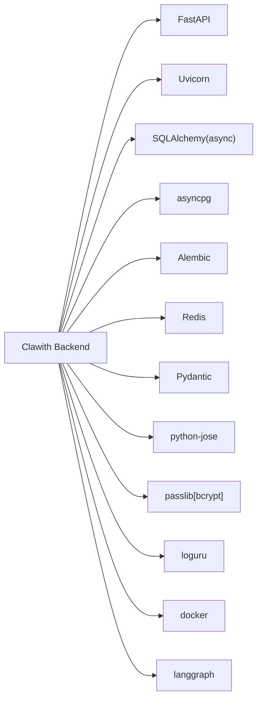

**图表来源** 
- [backend/pyproject.toml:6-51](file://backend/pyproject.toml#L6-L51)

**章节来源**
- [backend/pyproject.toml:6-51](file://backend/pyproject.toml#L6-L51)

## 性能考虑
- 数据库连接池：engine pool_size 与 max_overflow 合理配置，避免连接耗尽。
- 异步 IO：尽量使用 async_session 与异步 DAO，减少阻塞。
- CPU 密集型任务：bcrypt 哈希使用线程池运行，避免阻塞事件循环。
- 日志输出：loguru 异步队列输出，降低 I/O 对主流程影响。
- 中间件开销：TraceIdMiddleware 仅轻量字符串处理与计时，注意不要在其中做重 IO。
- 缓存策略：对频繁读的配置与元数据可引入 Redis 缓存（按需扩展）。

[本节为通用指导，不直接分析具体文件]

## 故障排查指南
- 统一错误体：查看 error.error.code 与 message，定位问题分类（validation_error、internal_error 等）。
- 追踪 ID：通过 X-Trace-Id 响应头与日志中的 trace_id 串联请求链路。
- 常见错误：
  - 401/403：检查 JWT 是否有效、用户是否激活、角色与权限是否满足。
  - 422：检查请求体是否符合 Pydantic 校验规则。
  - 500：查看服务端日志堆栈，关注未捕获异常。
- 启动问题：检查 SECRET_KEY/JWT_SECRET_KEY 是否为默认值；确认数据库与 Redis 可达；容器环境检查 bwrap 可用性。

**章节来源**
- [backend/app/core/error_contract.py:158-181](file://backend/app/core/error_contract.py#L158-L181)
- [backend/app/core/error_contract.py:205-221](file://backend/app/core/error_contract.py#L205-L221)
- [backend/app/core/middleware.py:15-52](file://backend/app/core/middleware.py#L15-L52)
- [backend/app/main.py:131-136](file://backend/app/main.py#L131-L136)

## 结论
本指南总结了 Clawith 后端的架构与开发规范，强调以 FastAPI 为核心的模块化设计、强类型配置与模型、统一错误契约、集中日志与追踪、严格的鉴权与 RBAC。遵循本文档的实践，可有效提升代码质量、可维护性与生产稳定性。

[本节为总结性内容，不直接分析具体文件]

## 附录：新功能开发流程与示例
- 需求分析与 API 设计
  - 明确资源、动作、权限与数据模型变更。
  - 定义 Pydantic 请求/响应模型（schemas）。
- 路由与依赖
  - 在 app/api/* 下新增路由模块，使用 Depends(get_current_user)/require_role 进行鉴权。
  - 使用 get_db 依赖获取会话，必要时用 transaction 包裹写操作。
- 服务层与 DAO
  - 将复杂业务逻辑下沉至 services/*，保持路由薄、职责单一。
  - 复用 dao/base.py 的 CRUD 能力，必要时扩展专用 DAO。
- 权限与租户隔离
  - 使用 permissions.py 中的 can_use_agent/can_manage_agent/check_agent_access 等方法确保访问控制。
- 错误与日志
  - 抛出 HTTPException 并附带 detail 字典（code/message/retryable），由 error_contract 统一处理。
  - 使用 logger.info/warning/error 记录关键步骤，trace_id 自动注入。
- 测试与文档
  - 编写单元测试与集成测试（pytest-asyncio）。
  - FastAPI 自动生成 OpenAPI 文档（/docs），可在路由中使用 tags 与 description。

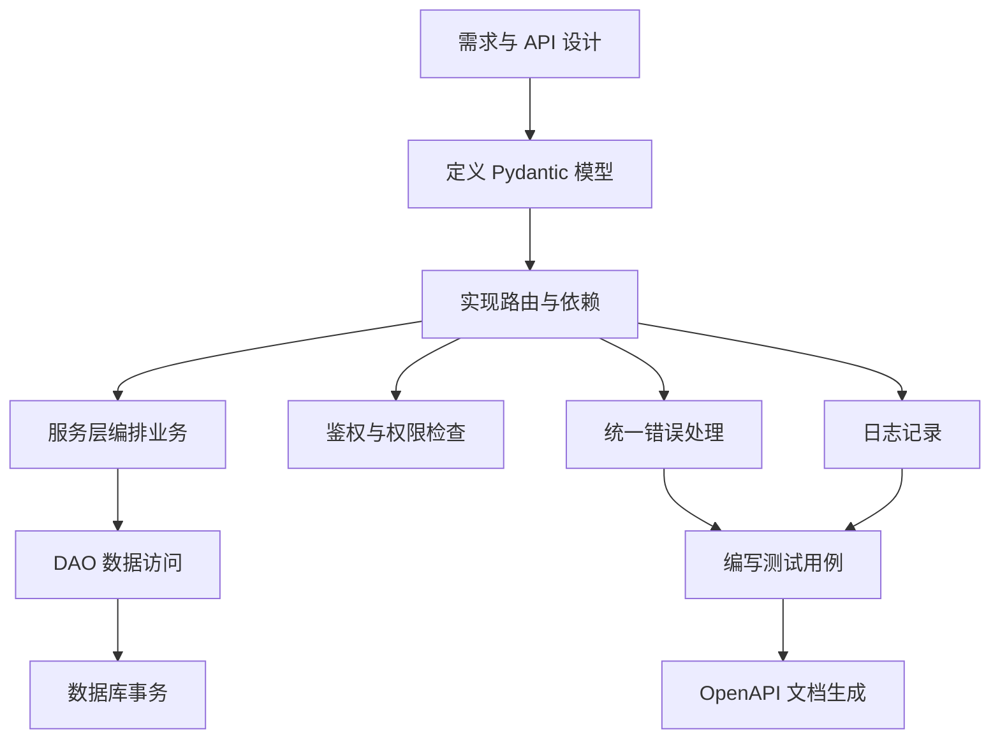

[本图为概念流程图，不映射具体源码文件]

**章节来源**
- [backend/app/schemas/schemas.py:11-118](file://backend/app/schemas/schemas.py#L11-L118)
- [backend/app/api/auth.py:138-253](file://backend/app/api/auth.py#L138-L253)
- [backend/app/core/permissions.py:481-518](file://backend/app/core/permissions.py#L481-L518)
- [backend/app/core/error_contract.py:158-181](file://backend/app/core/error_contract.py#L158-L181)
- [backend/app/core/logging_config.py:61-79](file://backend/app/core/logging_config.py#L61-L79)