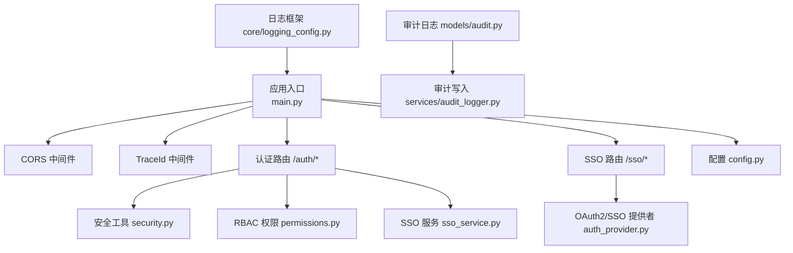
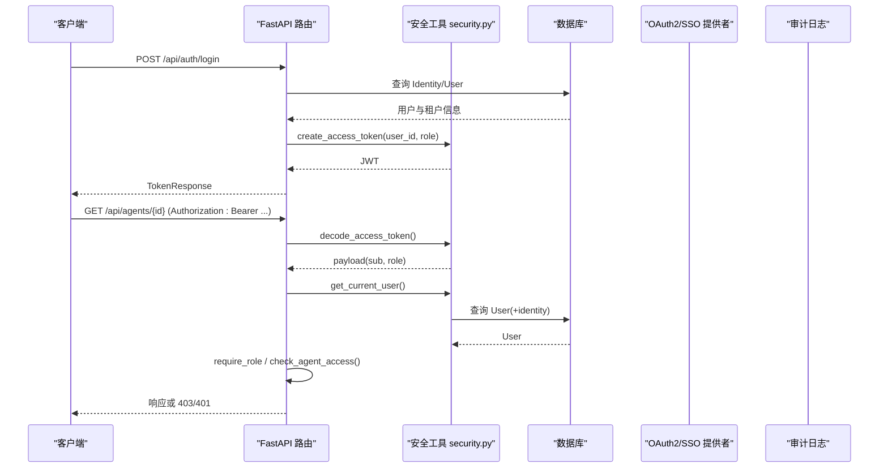
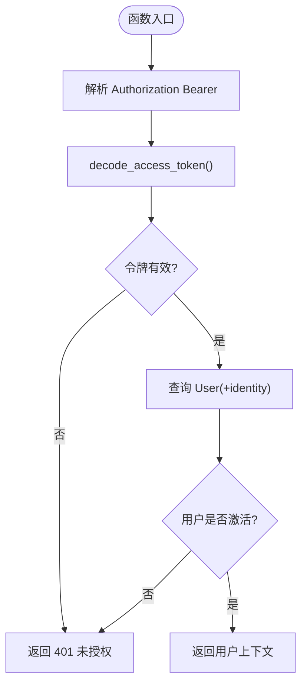
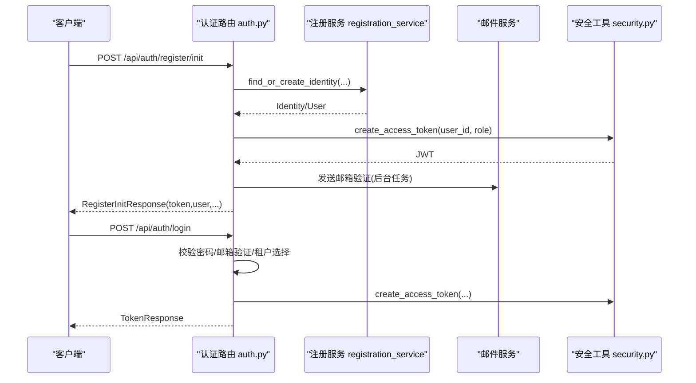
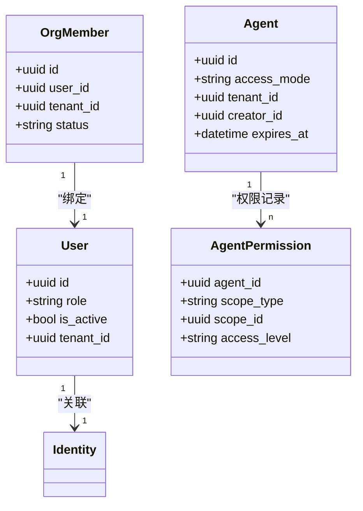
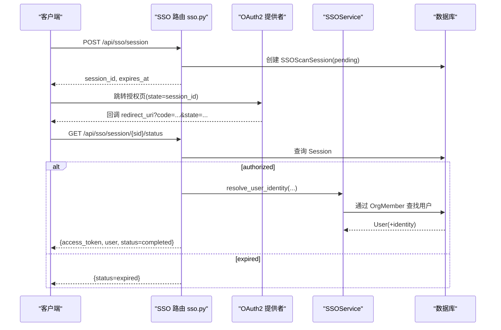
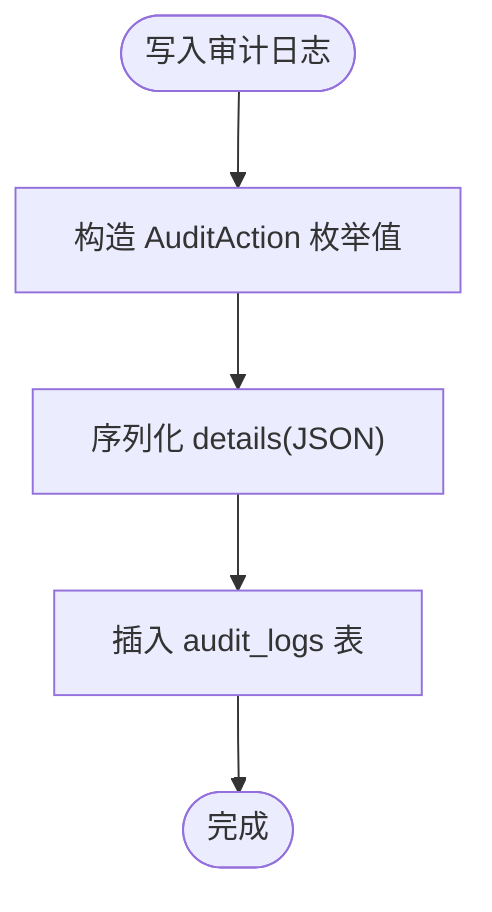
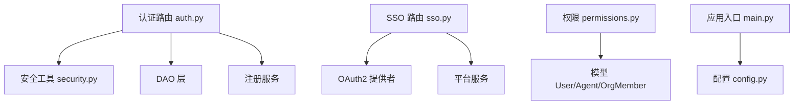

# 安全与认证

<cite>
**本文引用的文件**   
- [backend/app/core/security.py](file://backend/app/core/security.py)
- [backend/app/api/auth.py](file://backend/app/api/auth.py)
- [backend/app/core/middleware.py](file://backend/app/core/middleware.py)
- [backend/app/core/permissions.py](file://backend/app/core/permissions.py)
- [backend/app/services/auth_provider.py](file://backend/app/services/auth_provider.py)
- [backend/app/services/sso_service.py](file://backend/app/services/sso_service.py)
- [backend/app/api/sso.py](file://backend/app/api/sso.py)
- [backend/app/main.py](file://backend/app/main.py)
- [backend/app/config.py](file://backend/app/config.py)
- [backend/app/models/audit.py](file://backend/app/models/audit.py)
- [backend/app/services/audit_logger.py](file://backend/app/services/audit_logger.py)
- [backend/app/core/logging_config.py](file://backend/app/core/logging_config.py)
</cite>

## 目录
1. [简介](#简介)
2. [项目结构](#项目结构)
3. [核心组件](#核心组件)
4. [架构总览](#架构总览)
5. [详细组件分析](#详细组件分析)
6. [依赖关系分析](#依赖关系分析)
7. [性能考量](#性能考量)
8. [故障排查指南](#故障排查指南)
9. [结论](#结论)
10. [附录](#附录)

## 简介
本文件系统性说明 Clawith 后端的安全与认证机制，覆盖以下主题：
- JWT 令牌管理、密码加密与校验、会话管理（基于无状态令牌）
- RBAC 权限控制、租户隔离、API 访问控制
- OAuth2/SSO 集成（飞书、钉钉、企业微信、Google Workspace 等）、扫码登录流程
- 安全头配置、CORS 设置、CSRF 防护建议
- 敏感信息保护（AES 加密）、审计日志、可观测性与安全扫描建议

## 项目结构
安全相关代码主要分布在以下模块：
- 核心安全能力：JWT、密码哈希、数据加解密、角色检查
- 认证 API：注册、登录、邮箱验证、密码重置、多租户切换
- SSO/OAuth2：统一提供者抽象、具体厂商实现、扫码会话
- 中间件与配置：请求追踪、CORS、环境变量与安全参数
- 模型与审计：审计日志表、审计写入服务、日志框架配置

**图表来源** 
- [backend/app/main.py:359-371](file://backend/app/main.py#L359-L371)
- [backend/app/core/middleware.py:12-53](file://backend/app/core/middleware.py#L12-L53)
- [backend/app/api/auth.py:1-120](file://backend/app/api/auth.py#L1-L120)
- [backend/app/api/sso.py:16-160](file://backend/app/api/sso.py#L16-L160)
- [backend/app/core/security.py:128-151](file://backend/app/core/security.py#L128-L151)
- [backend/app/core/permissions.py:1-120](file://backend/app/core/permissions.py#L1-L120)
- [backend/app/services/auth_provider.py:44-110](file://backend/app/services/auth_provider.py#L44-L110)
- [backend/app/services/sso_service.py:22-120](file://backend/app/services/sso_service.py#L22-L120)
- [backend/app/config.py:97-104](file://backend/app/config.py#L97-L104)
- [backend/app/models/audit.py:13-44](file://backend/app/models/audit.py#L13-L44)
- [backend/app/services/audit_logger.py:16-58](file://backend/app/services/audit_logger.py#L16-L58)
- [backend/app/core/logging_config.py:61-79](file://backend/app/core/logging_config.py#L61-L79)

**章节来源**
- [backend/app/main.py:359-371](file://backend/app/main.py#L359-L371)
- [backend/app/config.py:177-178](file://backend/app/config.py#L177-L178)

## 核心组件
- 安全工具（security.py）
  - 密码哈希与校验：bcrypt，异步线程池避免阻塞事件循环
  - 数据加解密：AES-256-CBC，随机 IV，Base64 编码存储
  - JWT：HS256，包含 sub、role、exp；提供创建与解码依赖
  - 用户获取依赖：get_current_user/get_authenticated_user，支持未激活用户场景
  - 角色检查：require_role、管理员依赖 get_current_admin
- 认证 API（auth.py）
  - 注册：支持普通注册与 SSO 注册，首次用户自动创建默认租户
  - 登录：支持多租户选择、邮箱验证流程、失败提示
  - 密码管理：忘记密码、重置密码、修改密码
  - 用户信息：获取当前用户、更新个人信息、切换租户并返回新令牌
- 权限控制（permissions.py）
  - RBAC：成员、agent_admin、org_admin、platform_admin 层级
  - 代理可见性：公司级/私有/自定义访问模式，按租户与权限记录判定
  - 关系评估：Agent-Agent、Agent-Human 关系有效性判断
- SSO/OAuth2（auth_provider.py, sso_service.py, api/sso.py）
  - 统一 BaseAuthProvider 抽象，具体实现包括飞书、钉钉、企业微信、Google Workspace
  - SSOService：通过 OrgMember 关联外部身份，支持 unionid/open_id/external_id 查找链
  - 扫码登录：创建 SSOScanSession，轮询状态，授权后一次性返回 access_token 与用户信息
- 中间件与配置（middleware.py, main.py, config.py）
  - TraceIdMiddleware：注入 X-Trace-Id，统一日志追踪
  - CORS：允许来源、凭据策略由配置决定
  - 配置项：JWT 密钥、算法、过期时间、CORS 白名单、代理与存储等

**章节来源**
- [backend/app/core/security.py:32-52](file://backend/app/core/security.py#L32-L52)
- [backend/app/core/security.py:54-124](file://backend/app/core/security.py#L54-L124)
- [backend/app/core/security.py:128-151](file://backend/app/core/security.py#L128-L151)
- [backend/app/core/security.py:153-205](file://backend/app/core/security.py#L153-L205)
- [backend/app/core/security.py:211-227](file://backend/app/core/security.py#L211-L227)
- [backend/app/api/auth.py:114-254](file://backend/app/api/auth.py#L114-L254)
- [backend/app/api/auth.py:422-543](file://backend/app/api/auth.py#L422-L543)
- [backend/app/api/auth.py:582-653](file://backend/app/api/auth.py#L582-L653)
- [backend/app/api/auth.py:655-793](file://backend/app/api/auth.py#L655-L793)
- [backend/app/core/permissions.py:17-130](file://backend/app/core/permissions.py#L17-L130)
- [backend/app/core/permissions.py:213-251](file://backend/app/core/permissions.py#L213-L251)
- [backend/app/core/permissions.py:481-519](file://backend/app/core/permissions.py#L481-L519)
- [backend/app/services/auth_provider.py:44-110](file://backend/app/services/auth_provider.py#L44-L110)
- [backend/app/services/auth_provider.py:273-348](file://backend/app/services/auth_provider.py#L273-L348)
- [backend/app/services/auth_provider.py:350-433](file://backend/app/services/auth_provider.py#L350-L433)
- [backend/app/services/auth_provider.py:435-635](file://backend/app/services/auth_provider.py#L435-L635)
- [backend/app/services/auth_provider.py:637-756](file://backend/app/services/auth_provider.py#L637-L756)
- [backend/app/services/sso_service.py:22-120](file://backend/app/services/sso_service.py#L22-L120)
- [backend/app/services/sso_service.py:183-226](file://backend/app/services/sso_service.py#L183-L226)
- [backend/app/services/sso_service.py:328-446](file://backend/app/services/sso_service.py#L328-L446)
- [backend/app/api/sso.py:16-82](file://backend/app/api/sso.py#L16-L82)
- [backend/app/api/sso.py:83-160](file://backend/app/api/sso.py#L83-L160)
- [backend/app/core/middleware.py:12-53](file://backend/app/core/middleware.py#L12-L53)
- [backend/app/main.py:359-371](file://backend/app/main.py#L359-L371)
- [backend/app/config.py:97-104](file://backend/app/config.py#L97-L104)
- [backend/app/config.py:177-178](file://backend/app/config.py#L177-L178)

## 架构总览
系统采用 FastAPI + SQLAlchemy 异步架构，认证与授权贯穿请求生命周期：
- 请求进入后先经过 TraceId 中间件注入追踪 ID，再进入 CORS 中间件
- 认证端点使用 HTTPBearer 依赖解析令牌，调用 security.get_current_user 获取用户上下文
- 资源访问通过 require_role 或业务层 check_agent_access 进行 RBAC 与租户隔离校验
- SSO/OAuth2 通过统一提供者接口完成授权码交换与用户信息拉取，最终生成 JWT
- 审计日志通过 audit_logger 写入数据库，日志框架统一输出带 trace_id

**图表来源** 
- [backend/app/api/auth.py:422-543](file://backend/app/api/auth.py#L422-L543)
- [backend/app/core/security.py:128-151](file://backend/app/core/security.py#L128-L151)
- [backend/app/core/security.py:153-197](file://backend/app/core/security.py#L153-L197)
- [backend/app/core/permissions.py:481-519](file://backend/app/core/permissions.py#L481-L519)

## 详细组件分析

### JWT 令牌管理与密码加密
- JWT 创建与解码：HS256，载荷包含 sub、role、exp；解码失败抛出 401
- 用户上下文依赖：
  - get_current_user：要求有效且激活的用户
  - get_authenticated_user：允许未激活用户（用于某些流程）
  - get_current_admin：要求平台或组织管理员
- 密码哈希与校验：bcrypt，异步执行避免阻塞
- 敏感数据加解密：AES-256-CBC，随机 IV，Base64 编码

**图表来源** 
- [backend/app/core/security.py:128-151](file://backend/app/core/security.py#L128-L151)
- [backend/app/core/security.py:153-197](file://backend/app/core/security.py#L153-L197)

**章节来源**
- [backend/app/core/security.py:32-52](file://backend/app/core/security.py#L32-L52)
- [backend/app/core/security.py:54-124](file://backend/app/core/security.py#L54-L124)
- [backend/app/core/security.py:128-151](file://backend/app/core/security.py#L128-L151)
- [backend/app/core/security.py:153-205](file://backend/app/core/security.py#L153-L205)

### 认证与注册流程（含多租户）
- 注册初始化：创建或查找 Identity，必要时创建默认租户，生成 JWT，发送邮箱验证任务
- 登录：校验 Identity 密码、邮箱验证状态，处理多租户选择，返回 TokenResponse
- 密码管理：忘记密码生成一次性链接，重置密码更新哈希，修改密码更新全局 Identity
- 用户信息：获取与更新个人资料，切换租户并返回新令牌与可选重定向 URL

**图表来源** 
- [backend/app/api/auth.py:114-254](file://backend/app/api/auth.py#L114-L254)
- [backend/app/api/auth.py:422-543](file://backend/app/api/auth.py#L422-L543)

**章节来源**
- [backend/app/api/auth.py:114-254](file://backend/app/api/auth.py#L114-L254)
- [backend/app/api/auth.py:422-543](file://backend/app/api/auth.py#L422-L543)
- [backend/app/api/auth.py:582-653](file://backend/app/api/auth.py#L582-L653)
- [backend/app/api/auth.py:655-793](file://backend/app/api/auth.py#L655-L793)

### RBAC 权限控制与租户隔离
- 角色层级：member < agent_admin < org_admin < platform_admin
- 代理访问模式：company/private/custom，结合 AgentPermission 细粒度控制
- 可见性评估：evaluate_roster_* 系列函数决定目录中可见与可联系范围
- 关系状态评估：Agent-Agent、Agent-Human 关系的可用性、过期、状态等

**图表来源** 
- [backend/app/core/permissions.py:17-130](file://backend/app/core/permissions.py#L17-L130)
- [backend/app/core/permissions.py:213-251](file://backend/app/core/permissions.py#L213-L251)
- [backend/app/core/permissions.py:481-519](file://backend/app/core/permissions.py#L481-L519)

**章节来源**
- [backend/app/core/permissions.py:17-130](file://backend/app/core/permissions.py#L17-L130)
- [backend/app/core/permissions.py:213-251](file://backend/app/core/permissions.py#L213-L251)
- [backend/app/core/permissions.py:481-519](file://backend/app/core/permissions.py#L481-L519)

### OAuth2/SSO 集成与扫码登录
- 统一提供者抽象：BaseAuthProvider 定义授权 URL、换令牌、获取用户信息
- 具体实现：飞书、钉钉、企业微信、Google Workspace，各自处理差异化的 API 与字段
- SSOService：通过 OrgMember 的 unionid/open_id/external_id 查找链匹配用户，支持被动资料填充
- 扫码登录：创建 SSOScanSession，轮询状态，授权成功后一次性返回 access_token 与用户信息

**图表来源** 
- [backend/app/api/sso.py:16-82](file://backend/app/api/sso.py#L16-L82)
- [backend/app/services/auth_provider.py:44-110](file://backend/app/services/auth_provider.py#L44-L110)
- [backend/app/services/sso_service.py:183-226](file://backend/app/services/sso_service.py#L183-L226)

**章节来源**
- [backend/app/services/auth_provider.py:273-348](file://backend/app/services/auth_provider.py#L273-L348)
- [backend/app/services/auth_provider.py:350-433](file://backend/app/services/auth_provider.py#L350-L433)
- [backend/app/services/auth_provider.py:435-635](file://backend/app/services/auth_provider.py#L435-L635)
- [backend/app/services/auth_provider.py:637-756](file://backend/app/services/auth_provider.py#L637-L756)
- [backend/app/services/sso_service.py:22-120](file://backend/app/services/sso_service.py#L22-L120)
- [backend/app/services/sso_service.py:328-446](file://backend/app/services/sso_service.py#L328-L446)
- [backend/app/api/sso.py:83-160](file://backend/app/api/sso.py#L83-L160)

### 安全头配置、CORS 与 CSRF 防护
- CORS：通过 CORSMiddleware 配置 allow_origins、allow_credentials、methods、headers
- 安全头：中间件注入 X-Trace-Id，便于链路追踪；生产环境建议启用 HTTPS
- CSRF：当前未内置 CSRF 防护；若前端为 SPA 且使用 Cookie 会话需考虑；本项目以 Bearer JWT 为主，跨域受 CORS 控制

**章节来源**
- [backend/app/main.py:359-371](file://backend/app/main.py#L359-L371)
- [backend/app/core/middleware.py:12-53](file://backend/app/core/middleware.py#L12-L53)
- [backend/app/config.py:177-178](file://backend/app/config.py#L177-L178)

### 敏感信息保护与审计日志
- 敏感数据加密：AES-256-CBC 对字符串加密，IV 前缀，Base64 存储；解密失败抛出异常
- 审计日志：AuditLog 表记录操作类型、详情、IP、时间戳；审计动作枚举涵盖认证、身份、用户、租户、角色、组织同步等
- 审计写入：audit_logger.write_audit_log 在启动时记录 server_startup，其他服务可按需调用
- 日志框架：loguru 统一格式，包含 trace_id，屏蔽噪音连接日志

**图表来源** 
- [backend/app/models/audit.py:13-44](file://backend/app/models/audit.py#L13-L44)
- [backend/app/services/audit_logger.py:16-58](file://backend/app/services/audit_logger.py#L16-L58)

**章节来源**
- [backend/app/core/security.py:54-124](file://backend/app/core/security.py#L54-L124)
- [backend/app/models/audit.py:13-44](file://backend/app/models/audit.py#L13-L44)
- [backend/app/services/audit_logger.py:16-58](file://backend/app/services/audit_logger.py#L16-L58)
- [backend/app/core/logging_config.py:61-79](file://backend/app/core/logging_config.py#L61-L79)

## 依赖关系分析
- 认证依赖：
  - auth.py 依赖 security.py 的令牌与用户解析
  - auth.py 依赖 DAO 层（identity_dao、user_dao、tenant_dao）与注册服务
  - sso.py 依赖 identity_providers 与平台服务计算回调地址
- 权限依赖：
  - permissions.py 依赖 User、Agent、AgentPermission、OrgMember 模型
- 配置依赖：
  - main.py 读取 settings.CORS_ORIGINS 与 JWT 相关配置
  - config.py 集中管理所有环境变量与默认值

**图表来源** 
- [backend/app/api/auth.py:1-120](file://backend/app/api/auth.py#L1-L120)
- [backend/app/api/sso.py:16-160](file://backend/app/api/sso.py#L16-L160)
- [backend/app/core/permissions.py:1-120](file://backend/app/core/permissions.py#L1-L120)
- [backend/app/main.py:359-371](file://backend/app/main.py#L359-L371)
- [backend/app/config.py:97-104](file://backend/app/config.py#L97-L104)

**章节来源**
- [backend/app/api/auth.py:1-120](file://backend/app/api/auth.py#L1-L120)
- [backend/app/api/sso.py:16-160](file://backend/app/api/sso.py#L16-L160)
- [backend/app/core/permissions.py:1-120](file://backend/app/core/permissions.py#L1-L120)
- [backend/app/main.py:359-371](file://backend/app/main.py#L359-L371)
- [backend/app/config.py:97-104](file://backend/app/config.py#L97-L104)

## 性能考量
- bcrypt 哈希与校验使用线程池异步执行，避免阻塞事件循环
- JWT 解码与用户查询在依赖中完成，尽量将 CPU 密集任务移出事务边界
- 审计日志写入采用独立服务，避免影响主流程性能
- 日志框架使用 loguru 异步队列，减少 IO 阻塞

[本节为通用指导，不直接分析具体文件]

## 故障排查指南
- 认证失败（401）：检查 JWT 是否过期、sub 是否存在、用户是否激活
- 权限拒绝（403）：确认角色层级、租户隔离、AgentPermission 记录
- SSO 登录失败：核对 provider 配置、scope、回调地址、IP 白名单（企业微信）
- 审计日志缺失：检查 write_audit_log 调用与数据库连接
- 日志追踪：查看 X-Trace-Id 与 loguru 输出，定位问题链路

**章节来源**
- [backend/app/core/security.py:128-151](file://backend/app/core/security.py#L128-L151)
- [backend/app/core/permissions.py:481-519](file://backend/app/core/permissions.py#L481-L519)
- [backend/app/services/auth_provider.py:435-635](file://backend/app/services/auth_provider.py#L435-L635)
- [backend/app/services/audit_logger.py:16-58](file://backend/app/services/audit_logger.py#L16-L58)
- [backend/app/core/logging_config.py:61-79](file://backend/app/core/logging_config.py#L61-L79)

## 结论
Clawith 的安全与认证体系围绕 JWT 无状态令牌、bcrypt 密码哈希、AES 敏感数据加密构建，结合 RBAC 与租户隔离实现细粒度权限控制。SSO/OAuth2 通过统一抽象适配多家厂商，扫码登录流程完善。中间件与配置提供 CORS、追踪与可观测性基础。建议在部署中启用 HTTPS、严格配置 CORS 与密钥、定期备份与审计，并结合安全扫描提升整体安全性。

[本节为总结，不直接分析具体文件]

## 附录
- 安全清单（来自 README）：修改默认密码、设置强 SECRET_KEY/JWT_SECRET_KEY、启用 HTTPS、生产使用 PostgreSQL、定期备份、限制 Docker socket 访问
- Helm 部署建议：使用外部 Secret 管理密钥、启用 TLS、配置资源限制、支持私有镜像仓库与证书

**章节来源**
- [README.md:232-235](file://README.md#L232-L235)
- [helm/QUICKSTART_EN.md:500-583](file://helm/QUICKSTART_EN.md#L500-L583)