# 数据库开发

<cite>
**本文引用的文件**   
- [backend/app/database.py](file://backend/app/database.py)
- [backend/alembic/env.py](file://backend/alembic/env.py)
- [backend/app/dao/base.py](file://backend/app/dao/base.py)
- [backend/app/config.py](file://backend/app/config.py)
- [backend/app/models/user.py](file://backend/app/models/user.py)
- [backend/app/dao/user_dao.py](file://backend/app/dao/user_dao.py)
- [backend/alembic/versions/001_initial_schema.py](file://backend/alembic/versions/001_initial_schema.py)
- [backend/alembic.ini](file://backend/alembic.ini)
- [backend/app/scripts/bootstrap_db.py](file://backend/app/scripts/bootstrap_db.py)
- [backend/alembic/versions/057_perf_indexes.py](file://backend/alembic/versions/057_perf_indexes.py)
- [backend/app/models/agent.py](file://backend/app/models/agent.py)
</cite>

## 目录
1. [简介](#简介)
2. [项目结构](#项目结构)
3. [核心组件](#核心组件)
4. [架构总览](#架构总览)
5. [详细组件分析](#详细组件分析)
6. [依赖关系分析](#依赖关系分析)
7. [性能与索引优化](#性能与索引优化)
8. [事务与一致性](#事务与一致性)
9. [数据验证与约束](#数据验证与约束)
10. [迁移管理与版本控制](#迁移管理与版本控制)
11. [备份与恢复策略](#备份与恢复策略)
12. [故障排查指南](#故障排查指南)
13. [结论](#结论)

## 简介
本规范围绕 SQLAlchemy ORM、Alembic 迁移管理、DAO 层设计与查询优化，系统化阐述本项目在数据库方面的实践。内容涵盖模型定义、关系映射、查询构建器、复杂查询优化、事务处理、连接池配置、索引设计、数据验证与约束、以及备份恢复策略等，帮助团队在工程化落地中保持一致性与高性能。

## 项目结构
后端采用分层架构：
- 配置与引擎：通过配置模块加载数据库 URL 与连接池参数，创建异步引擎与会话工厂。
- 模型层：使用 SQLAlchemy Declarative 定义表结构与关系。
- DAO 层：封装通用 CRUD 与上下文会话管理，提供领域 DAO。
- Alembic：统一迁移入口与环境配置，导入所有模型以生成元数据。
- 启动引导：可选的旧版表结构初始化与增量补丁脚本。

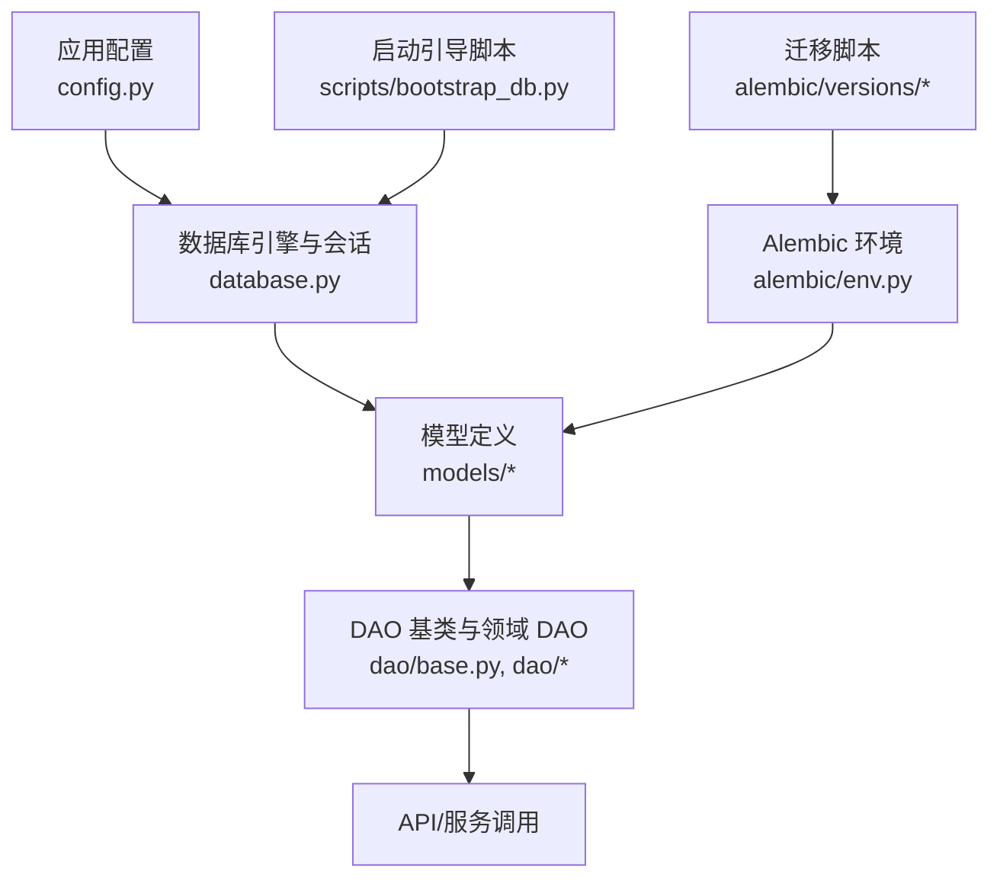

**图示来源** 
- [backend/app/config.py:79-120](file://backend/app/config.py#L79-L120)
- [backend/app/database.py:14-21](file://backend/app/database.py#L14-L21)
- [backend/alembic/env.py:13-46](file://backend/alembic/env.py#L13-L46)
- [backend/app/scripts/bootstrap_db.py:89-116](file://backend/app/scripts/bootstrap_db.py#L89-L116)

**章节来源**
- [backend/app/config.py:79-120](file://backend/app/config.py#L79-L120)
- [backend/app/database.py:14-21](file://backend/app/database.py#L14-L21)
- [backend/alembic/env.py:13-46](file://backend/alembic/env.py#L13-L46)

## 核心组件
- 数据库引擎与会话管理：异步引擎、会话工厂、上下文变量驱动的事务边界。
- 模型与关系：用户与身份、代理（Agent）等实体及其关联。
- DAO 抽象：通用 BaseDAO 提供 session 上下文、CRUD 方法；领域 DAO 实现具体查询。
- Alembic 环境：在线/离线模式、异步迁移执行、模型注册。
- 启动引导：兼容旧部署的表创建与列补丁。

**章节来源**
- [backend/app/database.py:14-79](file://backend/app/database.py#L14-L79)
- [backend/app/dao/base.py:13-95](file://backend/app/dao/base.py#L13-L95)
- [backend/alembic/env.py:59-98](file://backend/alembic/env.py#L59-L98)
- [backend/app/scripts/bootstrap_db.py:89-116](file://backend/app/scripts/bootstrap_db.py#L89-L116)

## 架构总览
下图展示从配置到模型、DAO、Alembic 的整体交互路径，以及启动引导对引擎的影响。

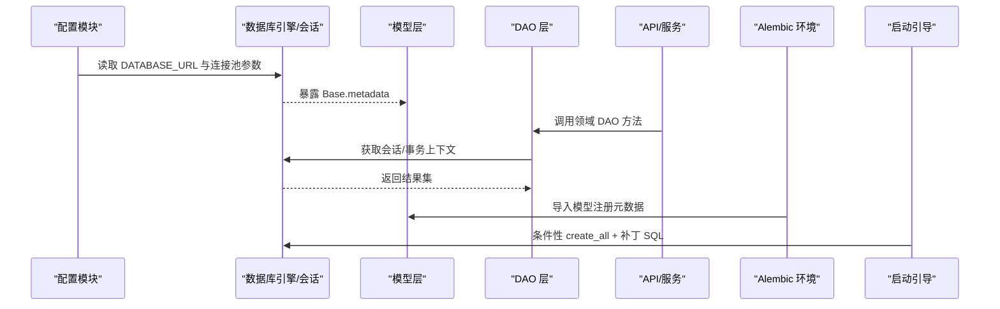

**图示来源** 
- [backend/app/config.py:89-95](file://backend/app/config.py#L89-L95)
- [backend/app/database.py:14-21](file://backend/app/database.py#L14-L21)
- [backend/alembic/env.py:13-46](file://backend/alembic/env.py#L13-L46)
- [backend/app/scripts/bootstrap_db.py:89-116](file://backend/app/scripts/bootstrap_db.py#L89-L116)

## 详细组件分析

### 数据库引擎与会话管理
- 异步引擎：基于 asyncpg，开启 echo 便于调试，设置 pool_size 与 max_overflow。
- 会话工厂：expire_on_commit=False 避免提交后属性失效导致的额外查询。
- 上下文事务：通过 ContextVar 维护当前请求的会话，支持嵌套事务边界。
- get_db 依赖：自动 commit/rollback，异常回滚并抛出。

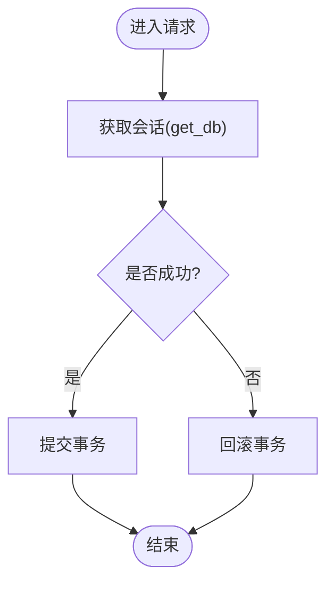

**图示来源** 
- [backend/app/database.py:14-21](file://backend/app/database.py#L14-L21)
- [backend/app/database.py:30-42](file://backend/app/database.py#L30-L42)
- [backend/app/database.py:47-79](file://backend/app/database.py#L47-L79)

**章节来源**
- [backend/app/database.py:14-79](file://backend/app/database.py#L14-L79)

### 模型与关系映射
- 用户与身份分离：Identity 为全局唯一标识，User 为租户内成员信息，二者通过外键关联。
- 代理（Agent）：包含运行状态、权限、模板、心跳、时间区等字段，具备软删除与多关系。
- 关系加载：使用 selectinload 预加载以避免 N+1 查询。

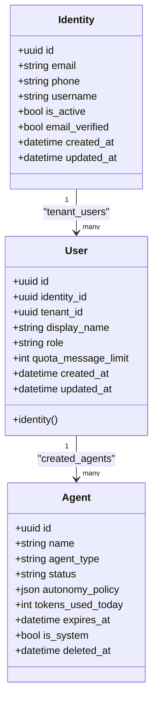

**图示来源** 
- [backend/app/models/user.py:16-119](file://backend/app/models/user.py#L16-L119)
- [backend/app/models/agent.py:19-160](file://backend/app/models/agent.py#L19-L160)

**章节来源**
- [backend/app/models/user.py:16-119](file://backend/app/models/user.py#L16-L119)
- [backend/app/models/agent.py:19-160](file://backend/app/models/agent.py#L19-L160)

### DAO 层设计
- BaseDAO：封装 session 上下文、get/create/update/delete/is_empty/get_all 等通用能力。
- UserDAO：实现按身份与租户查找、邮箱/手机号去重、带 identity 预加载等查询。
- 查询构建：使用 SQLAlchemy select 与 options(selectinload) 组合条件与预加载。

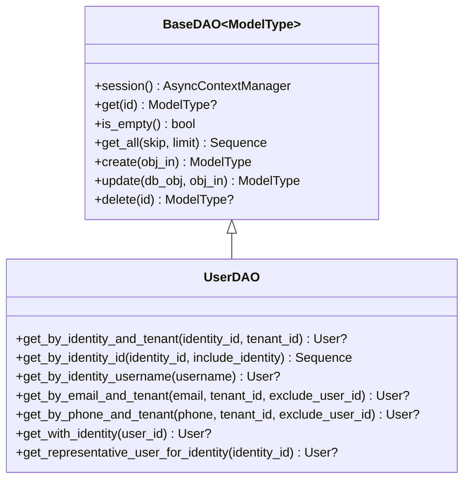

**图示来源** 
- [backend/app/dao/base.py:13-95](file://backend/app/dao/base.py#L13-L95)
- [backend/app/dao/user_dao.py:10-95](file://backend/app/dao/user_dao.py#L10-L95)

**章节来源**
- [backend/app/dao/base.py:13-95](file://backend/app/dao/base.py#L13-L95)
- [backend/app/dao/user_dao.py:10-95](file://backend/app/dao/user_dao.py#L10-L95)

### Alembic 迁移环境
- env.py：导入全部模型以填充 Base.metadata，设置 sqlalchemy.url，提供 offline/online 两种迁移执行方式。
- 初始迁移：001_initial_schema.py 使用 Base.metadata.create_all 快速建表。
- alembic.ini：指定脚本位置与日志级别。

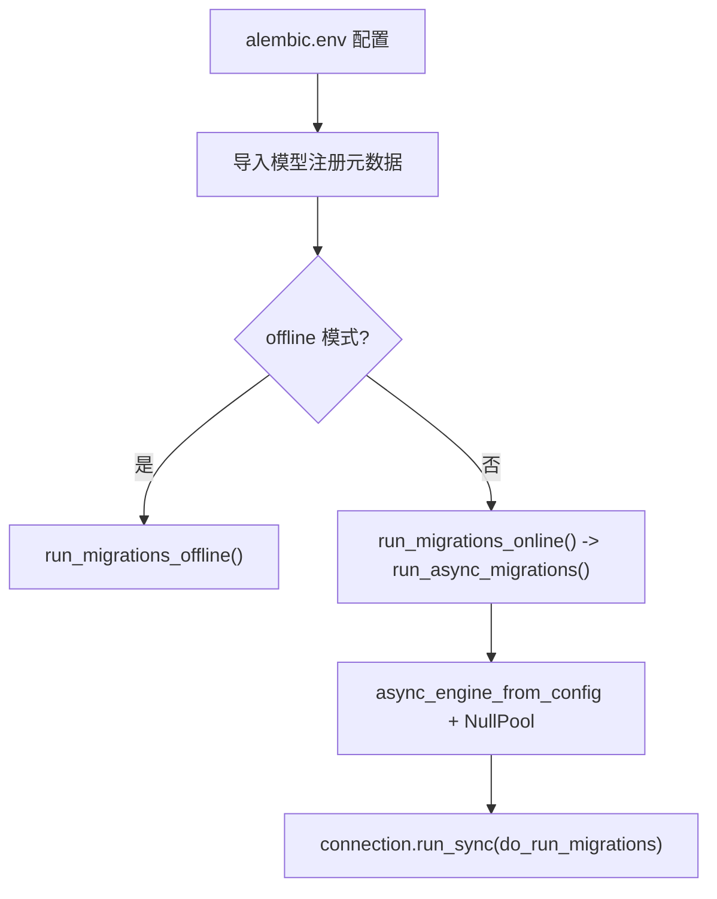

**图示来源** 
- [backend/alembic/env.py:13-46](file://backend/alembic/env.py#L13-L46)
- [backend/alembic/env.py:59-98](file://backend/alembic/env.py#L59-L98)
- [backend/alembic/versions/001_initial_schema.py:19-26](file://backend/alembic/versions/001_initial_schema.py#L19-L26)
- [backend/alembic.ini:1-40](file://backend/alembic.ini#L1-L40)

**章节来源**
- [backend/alembic/env.py:13-98](file://backend/alembic/env.py#L13-L98)
- [backend/alembic/versions/001_initial_schema.py:19-26](file://backend/alembic/versions/001_initial_schema.py#L19-L26)
- [backend/alembic.ini:1-40](file://backend/alembic.ini#L1-L40)

### 启动引导与数据修复
- bootstrap_db.py：在容器启动时根据配置决定是否启用旧版 create_all，并顺序执行补丁 SQL（如新增列、默认值、更新数据）。
- 幂等性：使用 IF NOT EXISTS 与条件 UPDATE，确保多次运行安全。

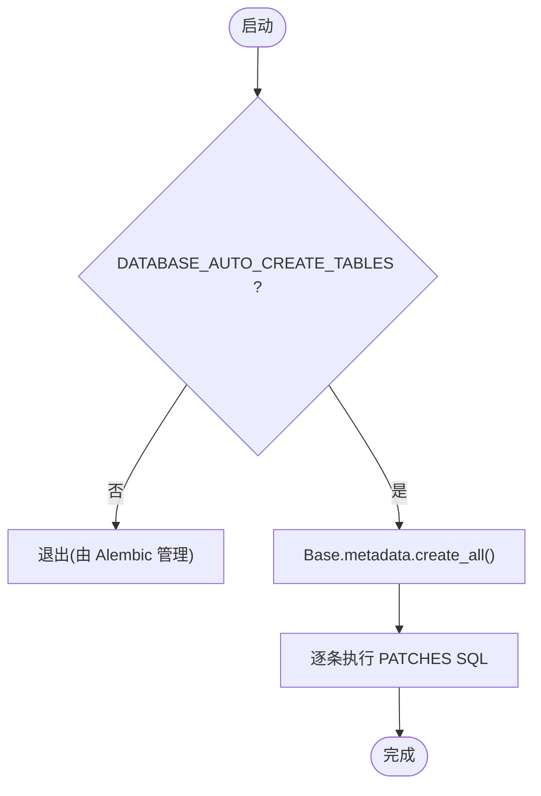

**图示来源** 
- [backend/app/scripts/bootstrap_db.py:89-116](file://backend/app/scripts/bootstrap_db.py#L89-L116)

**章节来源**
- [backend/app/scripts/bootstrap_db.py:89-116](file://backend/app/scripts/bootstrap_db.py#L89-L116)

## 依赖关系分析
- 配置依赖：Settings 提供 DATABASE_URL、DEBUG 等关键参数。
- 引擎依赖：engine 与 async_session 由 database.py 创建并暴露。
- 模型依赖：各 models/*.py 继承 Base，被 Alembic env.py 导入以注册元数据。
- DAO 依赖：BaseDAO 依赖 _session_ctx 与 async_session，领域 DAO 依赖对应模型。

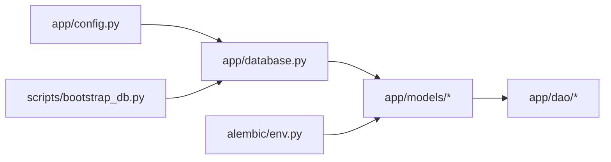

**图示来源** 
- [backend/app/config.py:79-120](file://backend/app/config.py#L79-L120)
- [backend/app/database.py:14-21](file://backend/app/database.py#L14-L21)
- [backend/alembic/env.py:13-46](file://backend/alembic/env.py#L13-L46)
- [backend/app/scripts/bootstrap_db.py:89-116](file://backend/app/scripts/bootstrap_db.py#L89-L116)

**章节来源**
- [backend/app/config.py:79-120](file://backend/app/config.py#L79-L120)
- [backend/app/database.py:14-21](file://backend/app/database.py#L14-L21)
- [backend/alembic/env.py:13-46](file://backend/alembic/env.py#L13-L46)

## 性能与索引优化
- 连接池配置：pool_size=20，max_overflow=10，适合高并发场景；可根据负载调整。
- 查询优化：使用 selectinload 预加载关联对象，避免 N+1；分页使用 offset/limit。
- 索引设计：
  - 用户与身份：email、phone、username 唯一索引；users.identity_id 普通索引。
  - 代理：复合索引 (tenant_id, is_system, name) 加速 OKR 相关查询。
  - 其他：org_members 的 email、phone、user_id 索引；chat_sessions 主会话唯一索引等。
- 部分索引：针对软删除场景使用 postgresql_where 限定有效行。

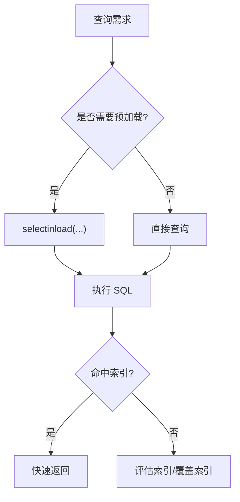

**图示来源** 
- [backend/app/database.py:14-21](file://backend/app/database.py#L14-L21)
- [backend/app/dao/user_dao.py:27-41](file://backend/app/dao/user_dao.py#L27-L41)
- [backend/alembic/versions/057_perf_indexes.py:16-29](file://backend/alembic/versions/057_perf_indexes.py#L16-L29)
- [backend/app/models/agent.py:26-33](file://backend/app/models/agent.py#L26-L33)

**章节来源**
- [backend/app/database.py:14-21](file://backend/app/database.py#L14-L21)
- [backend/app/dao/user_dao.py:27-41](file://backend/app/dao/user_dao.py#L27-L41)
- [backend/alembic/versions/057_perf_indexes.py:16-29](file://backend/alembic/versions/057_perf_indexes.py#L16-L29)
- [backend/app/models/agent.py:26-33](file://backend/app/models/agent.py#L26-L33)

## 事务与一致性
- 请求级事务：get_db 依赖在 try/except 中 commit/rollback，保证异常回滚。
- 显式事务边界：transaction 上下文管理器支持嵌套或外部传入会话，确保原子性。
- DAO 会话：BaseDAO.session 复用上下文会话或创建新会话，并在结束时提交或回滚。

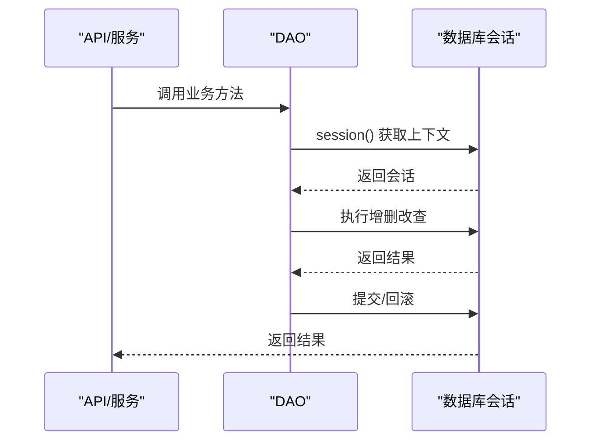

**图示来源** 
- [backend/app/database.py:30-42](file://backend/app/database.py#L30-L42)
- [backend/app/database.py:47-79](file://backend/app/database.py#L47-L79)
- [backend/app/dao/base.py:19-38](file://backend/app/dao/base.py#L19-L38)

**章节来源**
- [backend/app/database.py:30-79](file://backend/app/database.py#L30-L79)
- [backend/app/dao/base.py:19-38](file://backend/app/dao/base.py#L19-L38)

## 数据验证与约束
- 字段约束：非空、长度限制、枚举类型、默认值、时间戳默认值。
- 唯一约束：email、phone、username 唯一索引；部分唯一索引允许 NULL 值。
- 检查约束：测试用例中验证 check constraints（如 session_type 取值范围）。
- 外键约束：ondelete 策略（CASCADE、SET NULL）保障引用完整性。

**章节来源**
- [backend/app/models/user.py:24-46](file://backend/app/models/user.py#L24-L46)
- [backend/app/models/user.py:62-98](file://backend/app/models/user.py#L62-L98)
- [backend/app/models/agent.py:54-110](file://backend/app/models/agent.py#L54-L110)

## 迁移管理与版本控制
- 迁移流程：env.py 统一入口，导入模型注册元数据，支持离线/在线模式。
- 初始迁移：001_initial_schema.py 使用 Base.metadata.create_all 快速建表。
- 性能索引迁移：057_perf_indexes.py 添加常用查询所需索引。
- 版本控制：每个迁移文件包含 revision、down_revision、branch_labels、depends_on。

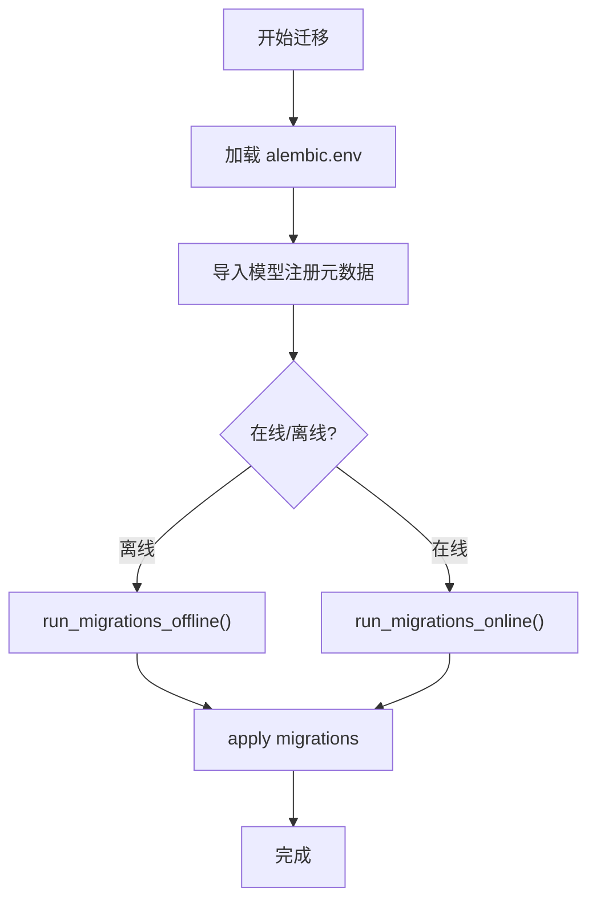

**图示来源** 
- [backend/alembic/env.py:59-98](file://backend/alembic/env.py#L59-L98)
- [backend/alembic/versions/001_initial_schema.py:19-26](file://backend/alembic/versions/001_initial_schema.py#L19-L26)
- [backend/alembic/versions/057_perf_indexes.py:16-29](file://backend/alembic/versions/057_perf_indexes.py#L16-L29)

**章节来源**
- [backend/alembic/env.py:59-98](file://backend/alembic/env.py#L59-L98)
- [backend/alembic/versions/001_initial_schema.py:19-26](file://backend/alembic/versions/001_initial_schema.py#L19-L26)
- [backend/alembic/versions/057_perf_indexes.py:16-29](file://backend/alembic/versions/057_perf_indexes.py#L16-L29)

## 备份与恢复策略
- 逻辑备份：使用 pg_dump 导出 SQL，结合迁移脚本进行版本对齐。
- 物理备份：PostgreSQL 流复制与 WAL 归档，支持时间点恢复（PITR）。
- 恢复演练：定期在测试环境恢复校验，确保备份可用性与迁移兼容性。
- 数据修复：通过 Alembic 迁移或 bootstrap_db 补丁脚本进行幂等修复。

[本节为通用指导，不直接分析具体文件]

## 故障排查指南
- 连接失败：检查 DATABASE_URL、网络连通性、认证凭据。
- 会话泄漏：确认 get_db 与 transaction 上下文正确释放，避免未提交/回滚。
- N+1 查询：使用 selectinload 预加载关联对象，减少额外查询。
- 索引缺失：通过 EXPLAIN 分析慢查询，补充必要索引。
- 迁移冲突：核对 down_revision 链，必要时合并分支或手动修正。

**章节来源**
- [backend/app/database.py:30-42](file://backend/app/database.py#L30-L42)
- [backend/app/dao/user_dao.py:27-41](file://backend/app/dao/user_dao.py#L27-L41)
- [backend/alembic/env.py:59-98](file://backend/alembic/env.py#L59-L98)

## 结论
本项目在数据库层面形成了清晰的层次与规范：配置驱动的异步引擎与会话管理、基于 Declarative 的模型定义、统一的 DAO 抽象与查询构建、完善的 Alembic 迁移环境与启动引导。通过合理的连接池、索引设计与事务边界，保障了系统在高并发下的稳定性与性能。建议持续完善索引策略、强化数据验证与约束、定期进行备份恢复演练，以确保数据一致性与可恢复性。