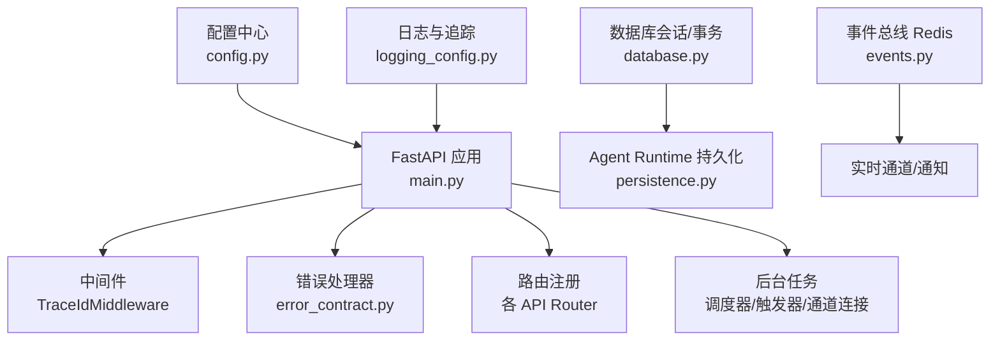
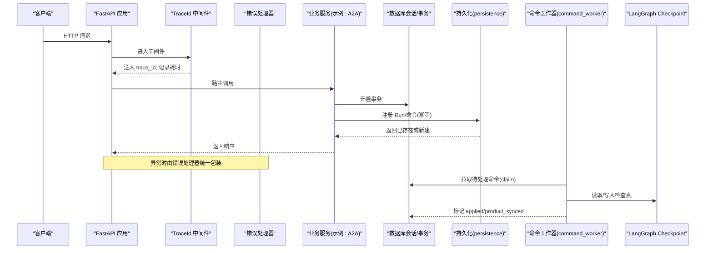
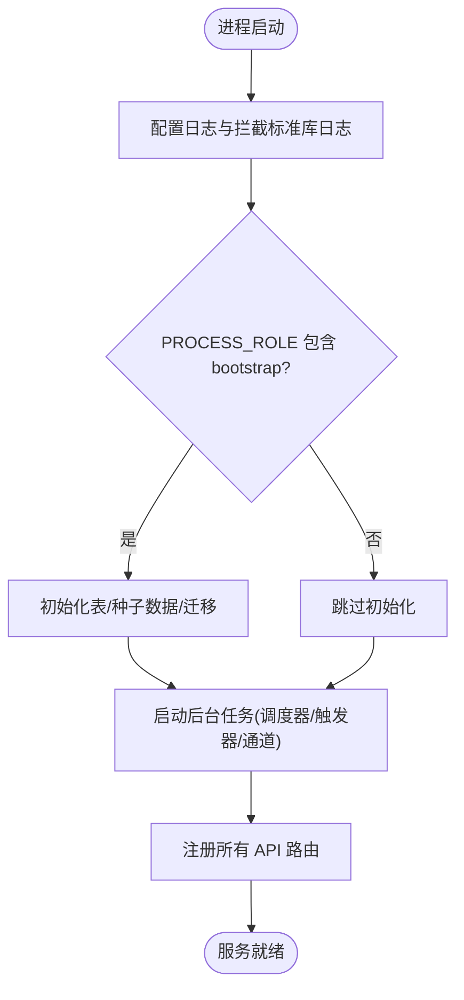
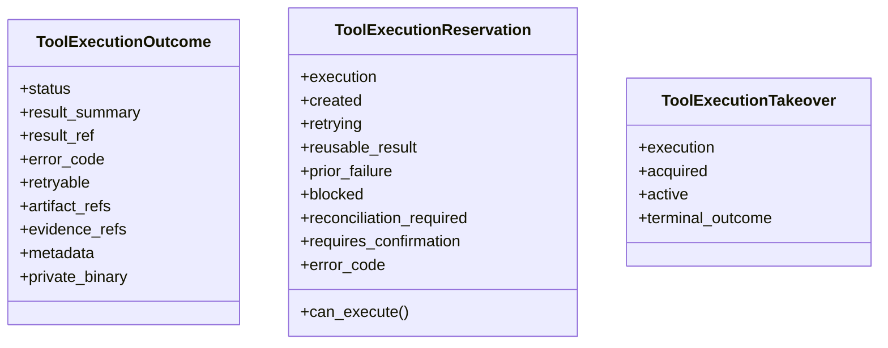
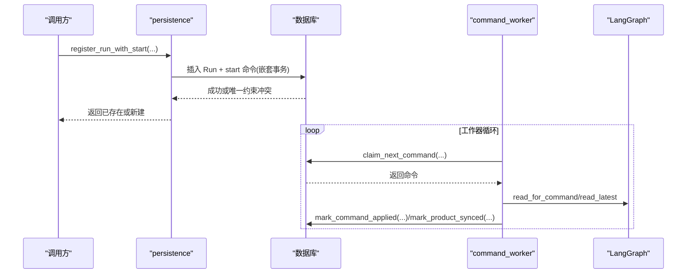
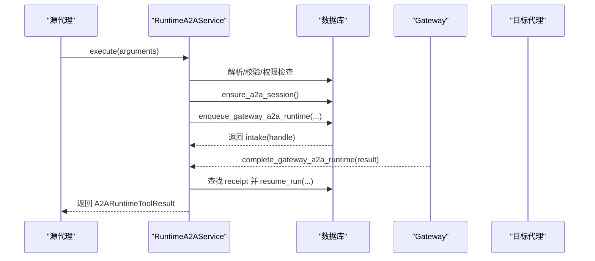
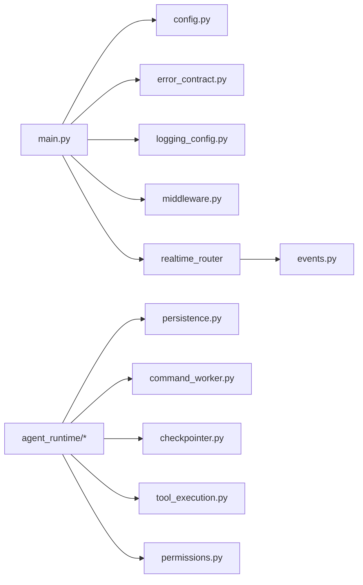

# 服务层开发

<cite>
**本文引用的文件**   
- [backend/app/main.py](file://backend/app/main.py)
- [backend/app/config.py](file://backend/app/config.py)
- [backend/app/database.py](file://backend/app/database.py)
- [backend/app/core/middleware.py](file://backend/app/core/middleware.py)
- [backend/app/core/logging_config.py](file://backend/app/core/logging_config.py)
- [backend/app/core/error_contract.py](file://backend/app/core/error_contract.py)
- [backend/app/core/events.py](file://backend/app/core/events.py)
- [backend/app/services/agent_runtime/a2a_runtime.py](file://backend/app/services/agent_runtime/a2a_runtime.py)
- [backend/app/services/agent_runtime/config.py](file://backend/app/services/agent_runtime/config.py)
- [backend/app/services/agent_runtime/tool_execution.py](file://backend/app/services/agent_runtime/tool_execution.py)
- [backend/app/services/agent_runtime/command_worker.py](file://backend/app/services/agent_runtime/command_worker.py)
- [backend/app/services/agent_runtime/persistence.py](file://backend/app/services/agent_runtime/persistence.py)
- [backend/app/services/agent_runtime/checkpointer.py](file://backend/app/services/agent_runtime/checkpointer.py)
- [backend/app/core/permissions.py](file://backend/app/core/permissions.py)
</cite>

## 目录
1. [简介](#简介)
2. [项目结构](#项目结构)
3. [核心组件](#核心组件)
4. [架构总览](#架构总览)
5. [详细组件分析](#详细组件分析)
6. [依赖关系分析](#依赖关系分析)
7. [性能考量](#性能考量)
8. [故障排查指南](#故障排查指南)
9. [结论](#结论)
10. [附录](#附录)

## 简介
本文件面向后端服务层的开发与维护，系统性阐述该项目的服务分层、业务封装、服务间通信、事务与一致性、异步与重试、错误与可观测性、缓存与外部调用集成、测试策略与调试技巧。重点围绕 Agent Runtime（LangGraph）命令工作流、工具执行幂等与归档、A2A 跨代理委托、权限与配置管理展开，帮助读者在理解代码级实现的同时掌握工程化最佳实践。

## 项目结构
后端采用 FastAPI 应用入口 + 模块化 services 的分层设计：
- 应用入口与生命周期：main.py 负责中间件、路由注册、后台任务启动、健康检查等。
- 配置中心：config.py 集中管理环境变量与运行时开关，提供 Settings 与沙箱配置。
- 数据访问：database.py 提供异步会话与事务上下文。
- 横切关注点：core/middleware.py（请求追踪）、core/logging_config.py（日志与 TraceId）、core/error_contract.py（统一错误契约）。
- 事件总线：core/events.py（Redis Pub/Sub）。
- 服务层：services/agent_runtime/* 覆盖运行时代码编排、持久化、命令工作器、工具执行、检查点等；其他 services 模块承载领域能力（如邮件、存储、渠道集成等）。

**图表来源** 
- [backend/app/main.py:121-350](file://backend/app/main.py#L121-L350)
- [backend/app/core/middleware.py:12-53](file://backend/app/core/middleware.py#L12-L53)
- [backend/app/core/error_contract.py:224-229](file://backend/app/core/error_contract.py#L224-L229)
- [backend/app/core/logging_config.py:61-79](file://backend/app/core/logging_config.py#L61-L79)
- [backend/app/core/events.py:22-34](file://backend/app/core/events.py#L22-L34)
- [backend/app/config.py:79-247](file://backend/app/config.py#L79-L247)
- [backend/app/database.py:30-42](file://backend/app/database.py#L30-L42)
- [backend/app/services/agent_runtime/persistence.py:321-401](file://backend/app/services/agent_runtime/persistence.py#L321-L401)

**章节来源**
- [backend/app/main.py:121-350](file://backend/app/main.py#L121-L350)
- [backend/app/config.py:79-247](file://backend/app/config.py#L79-L247)
- [backend/app/database.py:30-42](file://backend/app/database.py#L30-L42)
- [backend/app/core/middleware.py:12-53](file://backend/app/core/middleware.py#L12-L53)
- [backend/app/core/logging_config.py:61-79](file://backend/app/core/logging_config.py#L61-L79)
- [backend/app/core/error_contract.py:224-229](file://backend/app/core/error_contract.py#L224-L229)
- [backend/app/core/events.py:22-34](file://backend/app/core/events.py#L22-L34)

## 核心组件
- 应用生命周期与角色控制：按 PROCESS_ROLE 启动不同职责（bootstrap/api/worker/connector），确保数据库初始化、种子数据、后台任务按需启动。
- 配置与沙箱：Settings 集中管理数据库、Redis、JWT、存储、Agent Runtime 参数、沙箱隔离策略等，并提供 get_sandbox_config。
- 事务与会话：get_db 提供异步会话并自动提交/回滚；transaction 支持嵌套事务边界。
- 错误契约：统一的 HTTP 异常处理、校验错误、未捕获异常处理，附带 trace_id、retryable 等字段。
- 日志与追踪：loguru 统一输出，注入 trace_id，屏蔽噪音日志，拦截标准库 logging。
- 事件总线：Redis Pub/Sub 用于企业级信息同步与实时消息分发。

**章节来源**
- [backend/app/main.py:121-350](file://backend/app/main.py#L121-L350)
- [backend/app/config.py:79-247](file://backend/app/config.py#L79-L247)
- [backend/app/database.py:30-42](file://backend/app/database.py#L30-L42)
- [backend/app/core/error_contract.py:158-229](file://backend/app/core/error_contract.py#L158-L229)
- [backend/app/core/logging_config.py:61-79](file://backend/app/core/logging_config.py#L61-L79)
- [backend/app/core/events.py:22-34](file://backend/app/core/events.py#L22-L34)

## 架构总览
下图展示从 HTTP 请求到 Agent Runtime 命令执行的端到端流程，包括中间件、错误处理、持久化、命令工作器与 LangGraph 检查点。

**图表来源** 
- [backend/app/core/middleware.py:12-53](file://backend/app/core/middleware.py#L12-L53)
- [backend/app/core/error_contract.py:158-229](file://backend/app/core/error_contract.py#L158-L229)
- [backend/app/services/agent_runtime/persistence.py:321-401](file://backend/app/services/agent_runtime/persistence.py#L321-L401)
- [backend/app/services/agent_runtime/command_worker.py:635-674](file://backend/app/services/agent_runtime/command_worker.py#L635-L674)
- [backend/app/services/agent_runtime/checkpointer.py:169-178](file://backend/app/services/agent_runtime/checkpointer.py#L169-L178)

## 详细组件分析

### 应用入口与生命周期（main.py）
- 使用 lifespan 钩子完成日志配置、默认租户创建、内置工具/模板/技能/OKR Agent 种子数据初始化。
- 根据 PROCESS_ROLE 选择性启动 worker、connector、api 相关后台任务。
- 注册全局中间件与路由，暴露 /api/health 与 /api/version。

**图表来源** 
- [backend/app/main.py:121-350](file://backend/app/main.py#L121-L350)

**章节来源**
- [backend/app/main.py:121-350](file://backend/app/main.py#L121-L350)

### 配置管理（config.py）
- Settings 基于 pydantic-settings，支持 .env 加载、字段校验、模型验证器。
- 关键开关：AGENT_RUNTIME_V2_ENABLED、AGENT_RUNTIME_V2_AGENT_IDS、AGENT_RUNTIME_V2_SOURCE_TYPES、LANGGRAPH_CHECKPOINT_DATABASE_URL、SANDBOX_* 等。
- 提供 get_settings() 缓存实例与 get_sandbox_config() 构建沙箱配置。

**章节来源**
- [backend/app/config.py:79-247](file://backend/app/config.py#L79-L247)

### 数据库与事务（database.py）
- 使用 asyncpg + SQLAlchemy AsyncSession，池大小与溢出可控。
- get_db 提供会话并在异常时回滚；transaction 支持显式事务边界与上下文变量传递。

**章节来源**
- [backend/app/database.py:14-42](file://backend/app/database.py#L14-L42)
- [backend/app/database.py:47-79](file://backend/app/database.py#L47-L79)

### 中间件与日志（middleware.py, logging_config.py）
- TraceIdMiddleware 注入 X-Trace-Id，记录请求/响应耗时。
- loguru 统一格式，过滤噪音日志，拦截标准库 logging，保证 trace_id 贯穿全链路。

**章节来源**
- [backend/app/core/middleware.py:12-53](file://backend/app/core/middleware.py#L12-L53)
- [backend/app/core/logging_config.py:61-79](file://backend/app/core/logging_config.py#L61-L79)

### 错误契约（error_contract.py）
- 统一 HTTPException、RequestValidationError、未捕获异常的响应体结构，包含 code、message、trace_id、retryable 等。
- register_error_handlers 将处理器挂载到 FastAPI 应用。

**章节来源**
- [backend/app/core/error_contract.py:158-229](file://backend/app/core/error_contract.py#L158-L229)

### 事件总线（events.py）
- 基于 redis.asyncio 的发布订阅，提供 publish_event 与 close_redis。
- 适用于企业级信息同步、实时通知等场景。

**章节来源**
- [backend/app/core/events.py:22-34](file://backend/app/core/events.py#L22-L34)

### 权限与可见性（permissions.py）
- RBAC 能力：用户/代理访问控制、组织成员可见性、代理间关系状态评估。
- 为 A2A、群组、目录查询等提供安全基线。

**章节来源**
- [backend/app/core/permissions.py:149-180](file://backend/app/core/permissions.py#L149-L180)
- [backend/app/core/permissions.py:352-429](file://backend/app/core/permissions.py#L352-L429)

### Agent Runtime 配置门控（runtime config）
- decide_runtime_v2 依据全局开关、代理白名单、source_type 决定使用 v2（langgraph）还是 legacy。
- 对现有运行中的 Run 保持不可变性，避免中途切换导致不一致。

**章节来源**
- [backend/app/services/agent_runtime/config.py:134-147](file://backend/app/services/agent_runtime/config.py#L134-L147)

### 工具执行与幂等（tool_execution.py）
- 定义 ToolExecutionOutcome、ToolExecutionReservation、ToolExecutionTakeover 等数据结构。
- normalize_tool_outcome 对结果进行规范化、敏感信息脱敏、摘要截断与归档决策。
- fingerprint_arguments 生成稳定指纹，避免重复执行；retry 策略区分 safe/conditional/never。

**图表来源** 
- [backend/app/services/agent_runtime/tool_execution.py:568-634](file://backend/app/services/agent_runtime/tool_execution.py#L568-L634)

**章节来源**
- [backend/app/services/agent_runtime/tool_execution.py:409-565](file://backend/app/services/agent_runtime/tool_execution.py#L409-L565)
- [backend/app/services/agent_runtime/tool_execution.py:683-706](file://backend/app/services/agent_runtime/tool_execution.py#L683-L706)

### 命令持久化与工作器（persistence.py, command_worker.py）
- persistence.register_run_with_start 原子注册 Run 与 start 命令，支持源幂等与并发冲突回退。
- claim_next_command 以 for_update(skip_locked=True) 拉取命令，结合 lane 抢占保护。
- command_worker.RuntimeCommandWorker 负责 claim、心跳续租、checkpoint 分类、执行与产物同步。

**图表来源** 
- [backend/app/services/agent_runtime/persistence.py:321-401](file://backend/app/services/agent_runtime/persistence.py#L321-L401)
- [backend/app/services/agent_runtime/persistence.py:635-674](file://backend/app/services/agent_runtime/persistence.py#L635-L674)
- [backend/app/services/agent_runtime/command_worker.py:635-674](file://backend/app/services/agent_runtime/command_worker.py#L635-L674)

**章节来源**
- [backend/app/services/agent_runtime/persistence.py:321-401](file://backend/app/services/agent_runtime/persistence.py#L321-L401)
- [backend/app/services/agent_runtime/persistence.py:635-674](file://backend/app/services/agent_runtime/persistence.py#L635-L674)
- [backend/app/services/agent_runtime/command_worker.py:312-361](file://backend/app/services/agent_runtime/command_worker.py#L312-L361)

### 检查点与序列化（checkpointer.py）
- 通过 AsyncPostgresSaver 持久化 LangGraph 检查点，支持 AES 加密与受限 msgpack 类型。
- runtime_thread_config/runtime_command_config 绑定 run/command 元数据，确保可追溯。

**章节来源**
- [backend/app/services/agent_runtime/checkpointer.py:169-178](file://backend/app/services/agent_runtime/checkpointer.py#L169-L178)
- [backend/app/services/agent_runtime/checkpointer.py:29-68](file://backend/app/services/agent_runtime/checkpointer.py#L29-L68)

### A2A 跨代理委托（a2a_runtime.py）
- 支持 notify/consult/task_delegate 三种模式，建立确定性 session、消息与命令。
- complete_gateway_a2a_runtime 恢复源 Run 并投递结果；enqueue_gateway_a2a_runtime 原子写入 GatewayMessage、Chat input 与 start 命令。
- 结合权限与可见性规则，确保目标代理可达且授权有效。

**图表来源** 
- [backend/app/services/agent_runtime/a2a_runtime.py:533-696](file://backend/app/services/agent_runtime/a2a_runtime.py#L533-L696)
- [backend/app/services/agent_runtime/a2a_runtime.py:214-321](file://backend/app/services/agent_runtime/a2a_runtime.py#L214-L321)

**章节来源**
- [backend/app/services/agent_runtime/a2a_runtime.py:533-696](file://backend/app/services/agent_runtime/a2a_runtime.py#L533-L696)
- [backend/app/services/agent_runtime/a2a_runtime.py:214-321](file://backend/app/services/agent_runtime/a2a_runtime.py#L214-L321)
- [backend/app/core/permissions.py:149-180](file://backend/app/core/permissions.py#L149-L180)

## 依赖关系分析
- main.py 依赖 config、error_contract、logging_config、middleware、realtime_router 与各 API router。
- agent_runtime 模块内部强内聚：persistence 提供原子写入，command_worker 驱动执行，checkpointer 对接 LangGraph，tool_execution 保障幂等与归档。
- events.py 作为横向能力被多个服务消费（如组消息、通知）。

**图表来源** 
- [backend/app/main.py:352-470](file://backend/app/main.py#L352-L470)
- [backend/app/core/events.py:22-34](file://backend/app/core/events.py#L22-L34)
- [backend/app/services/agent_runtime/persistence.py:321-401](file://backend/app/services/agent_runtime/persistence.py#L321-L401)
- [backend/app/services/agent_runtime/command_worker.py:312-361](file://backend/app/services/agent_runtime/command_worker.py#L312-L361)
- [backend/app/services/agent_runtime/checkpointer.py:169-178](file://backend/app/services/agent_runtime/checkpointer.py#L169-L178)
- [backend/app/services/agent_runtime/tool_execution.py:568-634](file://backend/app/services/agent_runtime/tool_execution.py#L568-L634)
- [backend/app/core/permissions.py:149-180](file://backend/app/core/permissions.py#L149-L180)

**章节来源**
- [backend/app/main.py:352-470](file://backend/app/main.py#L352-L470)
- [backend/app/core/events.py:22-34](file://backend/app/core/events.py#L22-L34)
- [backend/app/services/agent_runtime/persistence.py:321-401](file://backend/app/services/agent_runtime/persistence.py#L321-L401)
- [backend/app/services/agent_runtime/command_worker.py:312-361](file://backend/app/services/agent_runtime/command_worker.py#L312-L361)
- [backend/app/services/agent_runtime/checkpointer.py:169-178](file://backend/app/services/agent_runtime/checkpointer.py#L169-L178)
- [backend/app/services/agent_runtime/tool_execution.py:568-634](file://backend/app/services/agent_runtime/tool_execution.py#L568-L634)
- [backend/app/core/permissions.py:149-180](file://backend/app/core/permissions.py#L149-L180)

## 性能考量
- 数据库连接池：pool_size=20、max_overflow=10，避免连接耗尽。
- 命令拉取：with_for_update(skip_locked=True) 降低锁竞争；lane 抢占避免同 lane 串行阻塞。
- 检查点：仅持久化必要状态，限制序列化类型，可选 AES 加密。
- 工具结果：大摘要自动截断并归档至私有存储，减少主表体积。
- 日志：异步输出、过滤噪音日志，降低 IO 开销。

[本节为通用指导，不直接分析具体文件]

## 故障排查指南
- 统一错误对象：HTTP 异常、校验失败、未捕获异常均返回包含 code、message、trace_id、retryable 的结构体，便于前端与监控聚合。
- 追踪 ID：X-Trace-Id 贯穿请求与日志，便于定位问题。
- 命令工作器：claim 心跳续租、attempt_count 上限、applied 与 product_sync_pending 分离，避免重复执行与死锁。
- 工具执行：fingerprint 与 retry 策略确保幂等；metadata 记录 redaction_count、summary_truncated 等诊断信息。

**章节来源**
- [backend/app/core/error_contract.py:158-229](file://backend/app/core/error_contract.py#L158-L229)
- [backend/app/core/logging_config.py:61-79](file://backend/app/core/logging_config.py#L61-L79)
- [backend/app/services/agent_runtime/command_worker.py:635-674](file://backend/app/services/agent_runtime/command_worker.py#L635-L674)
- [backend/app/services/agent_runtime/tool_execution.py:409-565](file://backend/app/services/agent_runtime/tool_execution.py#L409-L565)

## 结论
本项目在服务层设计上强调“幂等、可观测、可扩展”：通过配置门控与运行时选择、原子持久化与命令工作器、严格的工具执行规范与归档、统一的错误与日志体系，构建了稳健的 Agent Runtime 基础设施。配合权限与可见性控制、Redis 事件总线与多通道集成，能够支撑复杂的多代理协作与高可靠业务流程。

[本节为总结，不直接分析具体文件]

## 附录
- 单元测试与 Mock 策略建议：
  - 针对 persistence 与 tool_execution 的纯函数与无副作用逻辑，使用内存数据库或 Fake Session 模拟 execute/flush。
  - 针对 command_worker 的工作流，Mock checkpoint_reader 与 command_executor，聚焦 claim/renew/applied 分支。
  - 针对 A2A 流程，Mock 数据库查询与 RuntimeCommandIntake，验证 idempotency_key 与 correlation_id 生成。
  - 测试数据准备：构造最小化的 AgentRun、AgentRunCommand、AgentToolExecution 记录，覆盖正常、冲突、过期、权限拒绝等路径。
- 外部服务调用与重试：
  - 对外部 HTTP 调用建议使用带超时与重试的客户端，结合 error_contract 的 retryable 字段进行上层重试策略。
  - 对于消息队列/通道（如 Discord/飞书/企微），优先使用事件总线与持久化命令，避免瞬时失败导致数据丢失。
- 缓存策略：
  - 读多写少的配置或模型能力可考虑 Redis 缓存，注意失效与版本键前缀。
  - 工具结果归档与摘要截断可减少热点数据压力。

[本节为通用指导，不直接分析具体文件]