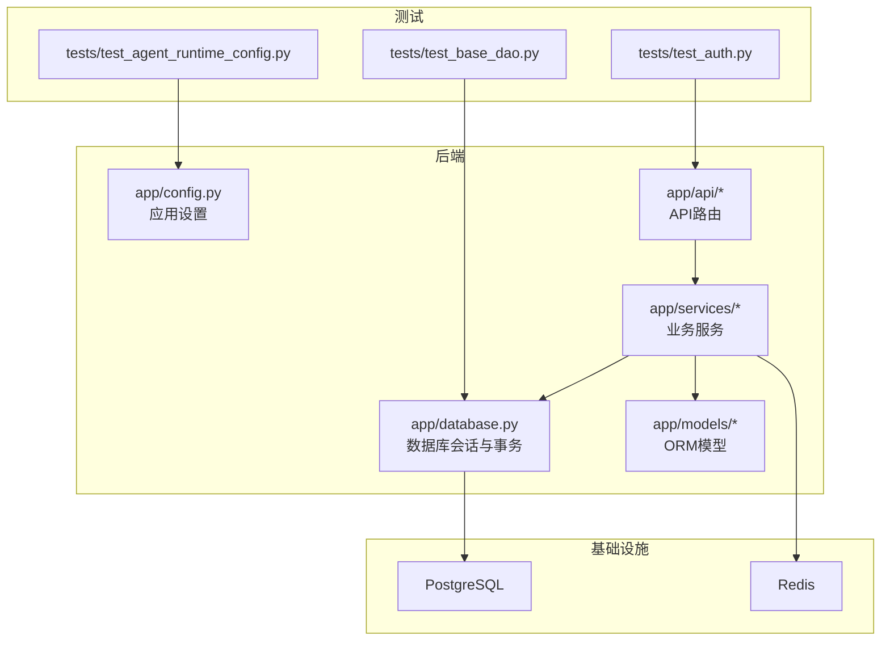
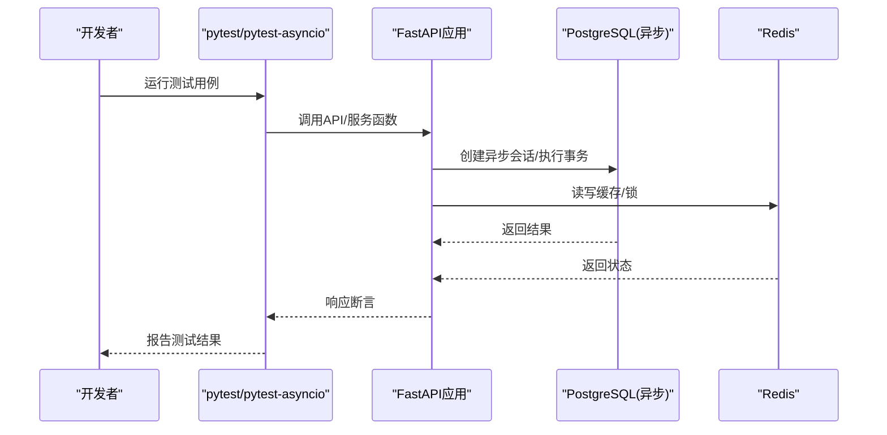
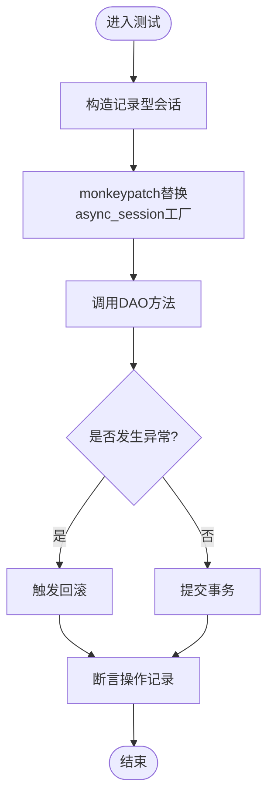
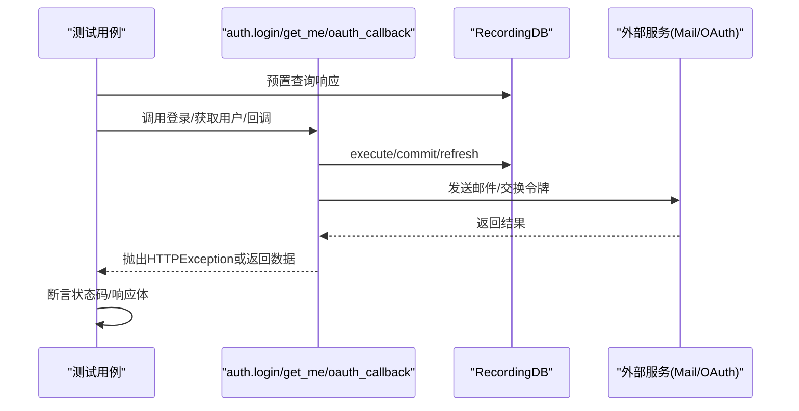
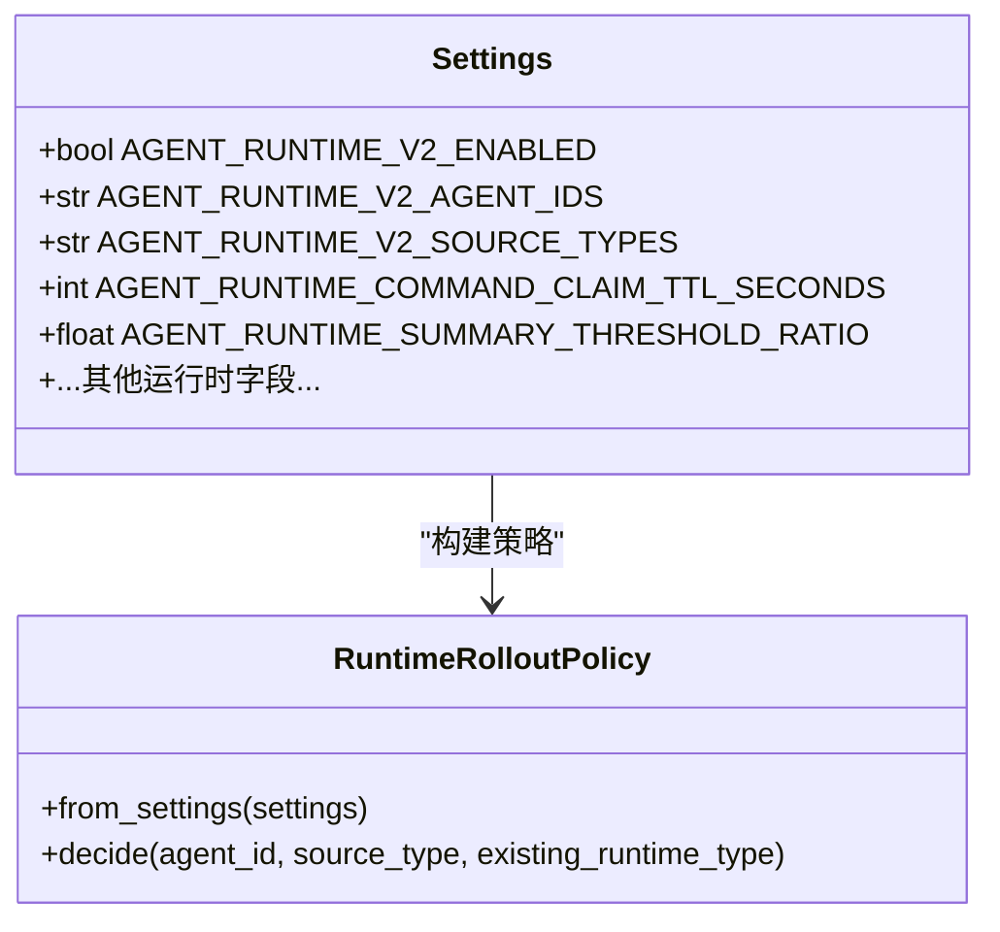
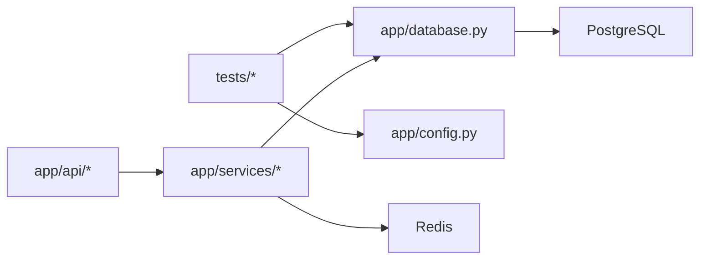

# 测试与调试

<cite>
**本文引用的文件**
- [backend/pyproject.toml](file://backend/pyproject.toml)
- [backend/app/config.py](file://backend/app/config.py)
- [backend/app/database.py](file://backend/app/database.py)
- [backend/tests/test_base_dao.py](file://backend/tests/test_base_dao.py)
- [backend/tests/test_auth.py](file://backend/tests/test_auth.py)
- [backend/tests/test_agent_runtime_config.py](file://backend/tests/test_agent_runtime_config.py)
- [docker-compose.ci.yml](file://docker-compose.ci.yml)
</cite>

## 目录
1. [简介](#简介)
2. [项目结构](#项目结构)
3. [核心组件](#核心组件)
4. [架构总览](#架构总览)
5. [详细组件分析](#详细组件分析)
6. [依赖关系分析](#依赖关系分析)
7. [性能考虑](#性能考虑)
8. [故障排查指南](#故障排查指南)
9. [结论](#结论)
10. [附录](#附录)

## 简介
本文件面向后端测试策略与调试技巧，覆盖单元测试、集成测试、端到端测试的编写方法；阐述测试数据准备、Mock对象、测试数据库管理；提供调试工具使用、日志分析与性能剖析建议；并给出CI/CD集成、代码覆盖率与质量检查的实践。重点围绕pytest框架、异步测试与并发测试展开，结合仓库现有配置与测试样例进行说明。

## 项目结构
后端采用FastAPI + SQLAlchemy异步ORM + Alembic迁移，测试位于backend/tests目录，使用pytest与pytest-asyncio运行异步用例。关键配置：
- pytest自动启用异步模式
- 开发依赖包含pytest、httpx、ruff等
- 应用配置通过pydantic-settings从环境变量加载，便于在测试中注入不同环境

图表来源
- [backend/app/config.py:1-268](file://backend/app/config.py#L1-L268)
- [backend/app/database.py:1-79](file://backend/app/database.py#L1-L79)
- [backend/tests/test_base_dao.py:1-105](file://backend/tests/test_base_dao.py#L1-L105)
- [backend/tests/test_auth.py:1-238](file://backend/tests/test_auth.py#L1-L238)
- [backend/tests/test_agent_runtime_config.py:1-224](file://backend/tests/test_agent_runtime_config.py#L1-L224)

章节来源
- [backend/pyproject.toml:53-70](file://backend/pyproject.toml#L53-L70)
- [backend/app/config.py:79-247](file://backend/app/config.py#L79-L247)
- [backend/app/database.py:30-79](file://backend/app/database.py#L30-L79)

## 核心组件
- 配置系统（Settings）：集中管理数据库、Redis、JWT、存储、沙箱、Agent运行时等参数，支持空值处理、字段校验与默认值。
- 数据库层（AsyncSession与事务）：基于SQLAlchemy异步引擎与上下文变量实现请求级会话与事务边界，确保提交或回滚语义正确。
- 测试基座（pytest + pytest-asyncio）：自动异步模式，配合httpx用于HTTP集成测试，ruff用于代码风格检查。

章节来源
- [backend/app/config.py:79-247](file://backend/app/config.py#L79-L247)
- [backend/app/database.py:14-41](file://backend/app/database.py#L14-L41)
- [backend/pyproject.toml:53-70](file://backend/pyproject.toml#L53-L70)

## 架构总览
下图展示测试与生产环境的交互要点：测试通过pytest驱动，调用API或服务逻辑，借助Mock或轻量数据库连接验证行为；CI环境通过docker-compose启动Postgres与Redis，为集成测试提供稳定基础设施。

图表来源
- [backend/app/database.py:30-79](file://backend/app/database.py#L30-L79)
- [docker-compose.ci.yml:8-54](file://docker-compose.ci.yml#L8-L54)

## 详细组件分析

### 数据库会话与事务（集成测试基础）
- 设计要点
  - 使用ContextVar维护当前会话，保证跨层调用可获取同一会话。
  - get_db与transaction提供统一的会话生命周期管理，异常时回滚，正常提交。
- 测试实践
  - 在测试中构造“记录型”会话（RecordingSession），捕获add/delete/commit/rollback等行为，避免真实IO。
  - 通过monkeypatch替换async_session工厂，注入自定义会话以验证DAO行为。

图表来源
- [backend/app/database.py:30-79](file://backend/app/database.py#L30-L79)
- [backend/tests/test_base_dao.py:14-56](file://backend/tests/test_base_dao.py#L14-L56)
- [backend/tests/test_base_dao.py:58-105](file://backend/tests/test_base_dao.py#L58-L105)

章节来源
- [backend/app/database.py:30-79](file://backend/app/database.py#L30-L79)
- [backend/tests/test_base_dao.py:1-105](file://backend/tests/test_base_dao.py#L1-L105)

### 认证API测试（单元/集成混合）
- 设计要点
  - 使用SimpleNamespace模拟Identity/User对象，简化测试数据构造。
  - 通过AsyncMock与patch隔离外部依赖（如邮件服务、OAuth提供者）。
  - 利用run_with_db将自定义会话注入到_context中，避免真实数据库访问。
- 测试场景
  - 无效凭据、禁用账户、未验证邮箱等分支均被覆盖。
  - /me接口返回用户信息，OAuth回调传递redirect_uri等关键点被验证。

图表来源
- [backend/tests/test_auth.py:15-21](file://backend/tests/test_auth.py#L15-L21)
- [backend/tests/test_auth.py:45-68](file://backend/tests/test_auth.py#L45-L68)
- [backend/tests/test_auth.py:115-172](file://backend/tests/test_auth.py#L115-L172)
- [backend/tests/test_auth.py:179-238](file://backend/tests/test_auth.py#L179-L238)

章节来源
- [backend/tests/test_auth.py:1-238](file://backend/tests/test_auth.py#L1-L238)

### Agent运行时配置测试（纯单元测试）
- 设计要点
  - 通过Settings(_env_file=None, ...)直接构造配置，避免读取真实环境变量。
  - 覆盖默认值、空值处理、字段校验、灰度策略解析与决策流程。
- 测试场景
  - 默认值安全确认、空白可选字段归一化、标识符修剪。
  - 非法配置抛出ValidationError或RuntimeConfigurationError。
  - 灰度策略按allowlist→source_type→global_flag优先级决策，且对已有运行实例保持稳定性。

图表来源
- [backend/app/config.py:79-247](file://backend/app/config.py#L79-L247)
- [backend/tests/test_agent_runtime_config.py:16-48](file://backend/tests/test_agent_runtime_config.py#L16-L48)
- [backend/tests/test_agent_runtime_config.py:101-160](file://backend/tests/test_agent_runtime_config.py#L101-L160)
- [backend/tests/test_agent_runtime_config.py:162-224](file://backend/tests/test_agent_runtime_config.py#L162-L224)

章节来源
- [backend/tests/test_agent_runtime_config.py:1-224](file://backend/tests/test_agent_runtime_config.py#L1-L224)

### 端到端测试（E2E）建议
- 目标
  - 验证前端与后端完整链路，包括鉴权、消息流、WebSocket通道等。
- 方法
  - 使用httpx.AsyncClient发起请求，结合docker-compose.ci.yml提供的Postgres与Redis。
  - 通过固定密钥与最小化权限账号进行端到端验证。
  - 针对长耗时流程（如Agent运行）引入轮询与超时控制。

章节来源
- [docker-compose.ci.yml:8-54](file://docker-compose.ci.yml#L8-L54)

## 依赖关系分析
- 测试与应用的耦合点
  - database._session_ctx：测试通过注入会话上下文绕过真实数据库。
  - config.Settings：测试通过构造Settings实例隔离环境变量。
- 外部依赖
  - PostgreSQL与Redis在CI环境中由docker-compose拉起，健康检查保障就绪。

图表来源
- [backend/app/database.py:14-41](file://backend/app/database.py#L14-L41)
- [backend/app/config.py:79-247](file://backend/app/config.py#L79-L247)
- [docker-compose.ci.yml:8-54](file://docker-compose.ci.yml#L8-L54)

章节来源
- [backend/app/database.py:14-41](file://backend/app/database.py#L14-L41)
- [backend/app/config.py:79-247](file://backend/app/config.py#L79-L247)
- [docker-compose.ci.yml:8-54](file://docker-compose.ci.yml#L8-L54)

## 性能考虑
- 数据库连接池
  - 使用async_sessionmaker配置pool_size与max_overflow，测试中可通过替换engine或会话工厂限制资源占用。
- 异步与并发
  - pytest-asyncio自动模式简化异步测试；对于高并发场景，建议使用独立进程/线程隔离测试，避免共享状态污染。
- I/O与网络
  - 对外部服务（邮件、OAuth、S3等）一律Mock，减少网络抖动对测试稳定性的影响。
- 资源清理
  - 每个测试用例结束后确保会话回滚/关闭，避免泄漏；必要时使用fixture统一清理。

章节来源
- [backend/app/database.py:14-21](file://backend/app/database.py#L14-L21)
- [backend/pyproject.toml:68-70](file://backend/pyproject.toml#L68-L70)

## 故障排查指南
- 常见问题
  - 异步会话未提交/回滚：检查transaction与get_db的异常分支是否正确处理。
  - 环境变量未生效：确认Settings构造时_env_file参数与字段命名大小写敏感。
  - CI失败：检查docker-compose健康检查与端口映射，确认Postgres与Redis就绪。
- 调试技巧
  - 使用loguru输出结构化日志，定位错误堆栈与上下文。
  - 在测试中打印或断言中间状态（如RecordingSession.added/deleted）。
  - 针对慢查询，开启SQLAlchemy echo并在测试中限定查询次数。

章节来源
- [backend/app/database.py:30-79](file://backend/app/database.py#L30-L79)
- [backend/app/config.py:236-241](file://backend/app/config.py#L236-L241)
- [docker-compose.ci.yml:16-30](file://docker-compose.ci.yml#L16-L30)

## 结论
本项目测试体系以pytest为核心，结合pytest-asyncio与httpx，形成从单元到集成的完整闭环。通过ContextVar与Mock技术，有效隔离外部依赖，提升测试稳定性与可维护性。CI环境提供稳定的数据库与缓存服务，支撑端到端验证。建议在后续迭代中持续完善覆盖率统计、性能基准与自动化质量门禁。

## 附录
- 快速开始
  - 安装依赖：pip install -e ".[dev]"
  - 运行测试：pytest -v
  - 指定异步模式：pytest --asyncio-mode=auto（已在配置中启用）
- 覆盖率与质量
  - 覆盖率：pytest-cov（按需添加至dev依赖）
  - 代码风格：ruff（已配置target-version与line-length）
- 常用命令
  - 单文件测试：pytest tests/test_auth.py -v
  - 并行执行：pytest -n auto（需安装pytest-xdist）
  - 生成报告：pytest --cov=app --cov-report=html

章节来源
- [backend/pyproject.toml:53-70](file://backend/pyproject.toml#L53-L70)
- [backend/pyproject.toml:64-70](file://backend/pyproject.toml#L64-L70)