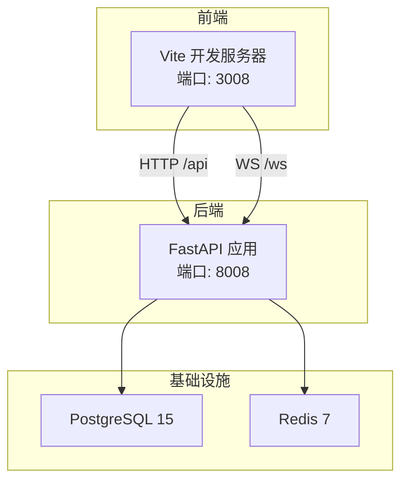
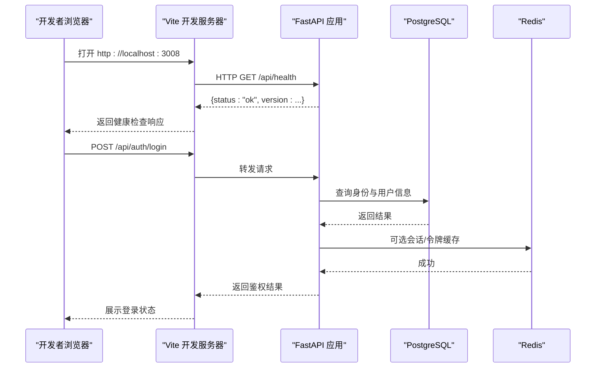
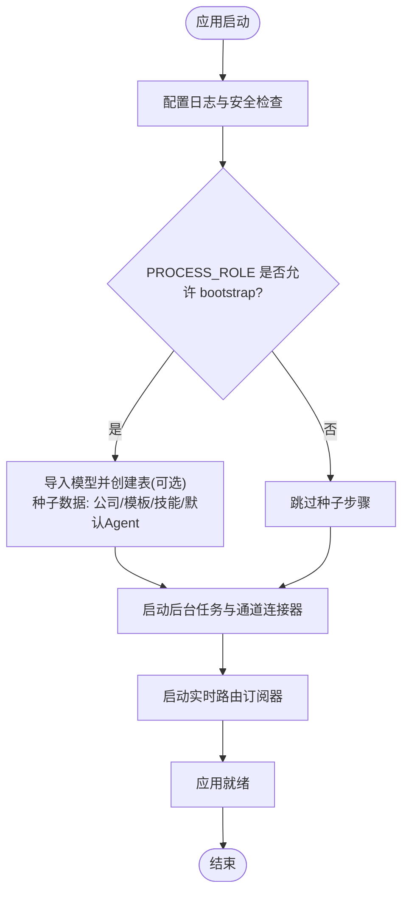
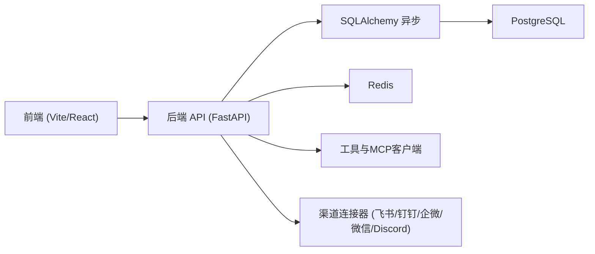

# 开发者指南

<cite>
**本文引用的文件**   
- [README.md](file://README.md)
- [CONTRIBUTING.md](file://CONTRIBUTING.md)
- [docker-compose.yml](file://docker-compose.yml)
- [setup.sh](file://setup.sh)
- [restart.sh](file://restart.sh)
- [backend/pyproject.toml](file://backend/pyproject.toml)
- [frontend/package.json](file://frontend/package.json)
- [backend/app/main.py](file://backend/app/main.py)
- [backend/app/config.py](file://backend/app/config.py)
- [backend/app/database.py](file://backend/app/database.py)
- [backend/alembic.ini](file://backend/alembic.ini)
- [backend/seed.py](file://backend/seed.py)
- [backend/app/api/auth.py](file://backend/app/api/auth.py)
- [backend/tests/test_auth.py](file://backend/tests/test_auth.py)
- [frontend/vite.config.ts](file://frontend/vite.config.ts)
</cite>

## 目录
1. [简介](#简介)
2. [项目结构](#项目结构)
3. [核心组件](#核心组件)
4. [架构总览](#架构总览)
5. [详细组件分析](#详细组件分析)
6. [依赖关系分析](#依赖关系分析)
7. [性能考量](#性能考量)
8. [故障排查指南](#故障排查指南)
9. [结论](#结论)
10. [附录](#附录)

## 简介
本指南面向Clawith平台的开发者，覆盖开发环境搭建、代码结构与模块职责、API设计规范、调试与测试方法、代码风格与最佳实践、新功能添加流程、Git工作流与发布流程等。目标是帮助贡献者快速上手并高效协作。

## 项目结构
- 前端（React + Vite + TypeScript）：位于 frontend/，提供用户界面与交互逻辑。
- 后端（FastAPI + SQLAlchemy + Alembic）：位于 backend/，提供REST API、WebSocket、任务调度、Agent运行时等。
- 基础设施编排：docker-compose.yml 统一编排PostgreSQL、Redis、后端与前端服务。
- 脚本与配置：setup.sh 完成首次初始化；restart.sh 负责本地或Docker模式的一键启动。

**图示来源** 
- [docker-compose.yml:1-115](file://docker-compose.yml#L1-L115)
- [frontend/vite.config.ts:1-59](file://frontend/vite.config.ts#L1-L59)
- [backend/app/main.py:352-471](file://backend/app/main.py#L352-L471)

**章节来源**
- [README.md:205-225](file://README.md#L205-L225)
- [CONTRIBUTING.md:137-152](file://CONTRIBUTING.md#L137-L152)

## 核心组件
- 应用入口与生命周期管理：FastAPI应用启动、中间件注册、路由挂载、后台任务与通道连接器的启动。
- 配置系统：基于pydantic-settings的环境变量加载与校验，包含数据库、缓存、JWT、存储、沙箱、代理等。
- 数据访问层：异步SQLAlchemy引擎与会话管理，事务上下文封装。
- 迁移与种子：Alembic迁移与seed脚本，用于创建表与初始数据。
- 认证与授权：登录、注册、邮箱验证、SSO集成等API。
- 前端构建与代理：Vite开发服务器、API与WS反向代理、版本注入。

**章节来源**
- [backend/app/main.py:121-356](file://backend/app/main.py#L121-L356)
- [backend/app/config.py:79-247](file://backend/app/config.py#L79-L247)
- [backend/app/database.py:1-79](file://backend/app/database.py#L1-L79)
- [backend/alembic.ini:1-40](file://backend/alembic.ini#L1-L40)
- [backend/seed.py:1-160](file://backend/seed.py#L1-L160)
- [backend/app/api/auth.py:1-200](file://backend/app/api/auth.py#L1-L200)
- [frontend/vite.config.ts:1-59](file://frontend/vite.config.ts#L1-L59)

## 架构总览
后端采用FastAPI作为Web框架，使用SQLAlchemy异步ORM与PostgreSQL进行持久化，Redis用于缓存与消息队列，Alembic管理数据库迁移。前端通过Vite提供开发体验，并通过反向代理将/api和/ws请求转发到后端。

**图示来源** 
- [frontend/vite.config.ts:44-58](file://frontend/vite.config.ts#L44-L58)
- [backend/app/main.py:473-476](file://backend/app/main.py#L473-L476)
- [backend/app/api/auth.py:1-200](file://backend/app/api/auth.py#L1-L200)
- [backend/app/database.py:14-21](file://backend/app/database.py#L14-L21)

## 详细组件分析

### 应用入口与生命周期（main.py）
- 定义FastAPI应用实例，注册错误处理、CORS、TraceId中间件。
- 在lifespan中执行日志配置、安全警告、数据库表自动创建（可选）、种子数据、后台任务与通道连接器启动。
- 按PROCESS_ROLE控制不同进程的职责（bootstrap、api、worker、connector）。

**图示来源** 
- [backend/app/main.py:121-356](file://backend/app/main.py#L121-L356)

**章节来源**
- [backend/app/main.py:121-356](file://backend/app/main.py#L121-L356)

### 配置系统（config.py）
- 使用pydantic-settings从环境变量加载配置，支持.env文件。
- 关键配置项包括：数据库URL、Redis URL、JWT密钥、存储后端、沙箱配置、代理设置、CORS源等。
- 提供get_settings()缓存实例与get_sandbox_config()便捷方法。

**章节来源**
- [backend/app/config.py:79-247](file://backend/app/config.py#L79-L247)

### 数据访问层（database.py）
- 创建异步引擎与会话工厂，暴露Base声明式基类。
- get_db()为FastAPI依赖注入提供异步会话，自动提交或回滚。
- transaction()上下文管理器支持嵌套事务与上下文变量传递。

**章节来源**
- [backend/app/database.py:1-79](file://backend/app/database.py#L1-L79)

### 迁移与种子（alembic.ini, seed.py）
- alembic.ini指定迁移脚本位置与数据库连接。
- seed.py创建表并插入默认公司、内置模板、演示Agent及工作区目录。

**章节来源**
- [backend/alembic.ini:1-40](file://backend/alembic.ini#L1-L40)
- [backend/seed.py:1-160](file://backend/seed.py#L1-L160)

### 认证API（auth.py）
- 提供注册、登录、邮箱验证、SSO等接口。
- 使用密码哈希、JWT令牌、背景任务发送验证邮件。
- 支持多租户与平台管理员自动提升。

**章节来源**
- [backend/app/api/auth.py:1-200](file://backend/app/api/auth.py#L1-L200)

### 前端开发与代理（vite.config.ts）
- 定义Vite插件、别名、分包策略、版本号注入。
- 开发服务器监听3008端口，并将/api与/ws请求代理至后端。

**章节来源**
- [frontend/vite.config.ts:1-59](file://frontend/vite.config.ts#L1-L59)

## 依赖关系分析
- 后端依赖：FastAPI、uvicorn、SQLAlchemy(async)、asyncpg、Alembic、Redis、Pydantic、JWT、S3客户端、LangGraph等。
- 前端依赖：React 19、Vite、TypeScript、Zustand、TanStack Query、i18next等。
- 基础设施：PostgreSQL 15、Redis 7、Docker Compose编排。

**图示来源** 
- [backend/pyproject.toml:1-77](file://backend/pyproject.toml#L1-L77)
- [frontend/package.json:1-37](file://frontend/package.json#L1-L37)
- [docker-compose.yml:1-115](file://docker-compose.yml#L1-L115)

**章节来源**
- [backend/pyproject.toml:1-77](file://backend/pyproject.toml#L1-L77)
- [frontend/package.json:1-37](file://frontend/package.json#L1-L37)
- [docker-compose.yml:1-115](file://docker-compose.yml#L1-L115)

## 性能考量
- 数据库连接池：SQLAlchemy引擎配置pool_size与max_overflow，避免连接耗尽。
- 异步IO：后端全面使用异步库（asyncpg、aiofiles、aioboto3），提高并发处理能力。
- 缓存与消息：Redis用于会话、限流、任务队列与事件分发。
- 前端分包：Vite手动分包减少首屏体积，提升加载速度。
- 沙箱限制：Agent代码执行可通过沙箱限制CPU/内存与网络访问，保障安全。

[本节为通用指导，不直接分析具体文件]

## 故障排查指南
- 数据库连接失败：检查DATABASE_URL是否正确，确保PostgreSQL运行且可访问。
- 端口冲突：重启脚本会检测并清理占用端口的进程，必要时调整端口。
- 代理问题：确认Vite代理配置与后端端口一致，检查防火墙与代理设置。
- 日志查看：后端日志输出到backend.log，前端日志到frontend.log，便于定位问题。
- 迁移失败：检查alembic.ini中的数据库连接，确保迁移脚本无冲突。

**章节来源**
- [restart.sh:224-259](file://restart.sh#L224-L259)
- [backend/alembic.ini:1-40](file://backend/alembic.ini#L1-L40)

## 结论
Clawith是一个功能完整的多Agent协作平台，具备清晰的模块化架构、完善的开发工具链与部署方案。遵循本指南可以快速搭建环境、理解代码结构、编写高质量代码并进行有效测试与发布。

[本节为总结性内容，不直接分析具体文件]

## 附录

### 开发环境搭建步骤
- 前置要求：Python 3.12+、Node.js 20+、PostgreSQL 15+（或SQLite用于快速测试）、至少2核CPU/4GB内存/30GB磁盘。
- 一键安装：
  - 克隆仓库后执行bash setup.sh（生产模式）或bash setup.sh --dev（开发模式）。
  - 脚本会自动创建.env、初始化PostgreSQL、安装后端与前端依赖、执行数据库迁移与种子数据。
- Docker方式：
  - 复制.env.example为.env，执行docker compose up -d即可启动所有服务。
- 启动应用：
  - 使用bash restart.sh一键启动本地或Docker模式。
  - 前端访问http://localhost:3008，后端API为http://localhost:8008。

**章节来源**
- [README.md:70-136](file://README.md#L70-L136)
- [setup.sh:1-472](file://setup.sh#L1-L472)
- [restart.sh:1-360](file://restart.sh#L1-L360)
- [docker-compose.yml:1-115](file://docker-compose.yml#L1-L115)

### 代码结构与模块职责
- 后端app目录：
  - api/: FastAPI路由处理器，按功能划分模块（认证、Agent、任务、文件、WebSocket等）。
  - models/: SQLAlchemy模型定义，对应数据库表结构。
  - services/: 业务逻辑实现，包括Agent运行时、LLM调用、存储、通知、定时任务等。
  - core/: 核心功能如认证、权限、中间件、日志配置。
  - dao/: 数据访问对象，封装数据库操作。
  - schemas/: Pydantic数据模型，用于请求/响应验证。
- 前端src目录：
  - pages/: 页面组件，每个页面一个文件。
  - components/: 可复用UI组件。
  - stores/: Zustand状态管理。
  - i18n/: 国际化资源文件。
  - services/: API调用封装与错误处理。

**章节来源**
- [CONTRIBUTING.md:137-152](file://CONTRIBUTING.md#L137-L152)

### API设计规范
- 路径前缀：所有API统一使用/api前缀，部分公共接口（如/webhooks、/p/{short_id}）除外。
- 认证方式：使用JWT令牌，通过Authorization头传递。
- 错误处理：统一返回标准错误格式，包含状态码与详细信息。
- 分页与过滤：列表接口支持分页参数与过滤条件。
- WebSocket：实时通信使用/ws路径，支持消息推送与事件订阅。

**章节来源**
- [backend/app/main.py:422-471](file://backend/app/main.py#L422-L471)

### 调试技巧
- 后端调试：
  - 启用DEBUG模式查看详细SQL日志。
  - 使用loguru记录关键操作与异常堆栈。
  - 通过curl或Postman测试API接口。
- 前端调试：
  - 使用浏览器开发者工具查看网络请求与状态。
  - 检查Vite代理配置是否正确转发请求。
  - 使用console.log与断点调试JavaScript代码。
- 数据库调试：
  - 使用psql命令行工具直接查询数据库。
  - 检查Alembic迁移历史与当前版本。

**章节来源**
- [backend/app/config.py:83-86](file://backend/app/config.py#L83-L86)
- [backend/app/main.py:124-127](file://backend/app/main.py#L124-L127)

### 测试方法
- 单元测试：使用pytest框架，测试用例位于backend/tests/目录。
- 异步测试：启用pytest-asyncio的auto模式，简化异步函数测试。
- 模拟数据库：使用自定义RecordingDB模拟数据库操作，避免真实依赖。
- 前端测试：使用Node.js原生测试运行器，测试文件位于frontend/tests/目录。

**章节来源**
- [backend/pyproject.toml:57-70](file://backend/pyproject.toml#L57-L70)
- [backend/tests/test_auth.py:1-200](file://backend/tests/test_auth.py#L1-L200)

### 代码风格指南
- 后端Python代码：
  - 使用ruff进行代码格式化与静态检查。
  - 行长度限制为120字符。
  - 遵循PEP 8编码规范。
- 前端TypeScript代码：
  - 使用标准React约定与TypeScript最佳实践。
  - 组件命名采用PascalCase，函数命名采用camelCase。
  - 保持代码简洁与可读性。

**章节来源**
- [backend/pyproject.toml:64-66](file://backend/pyproject.toml#L64-L66)
- [CONTRIBUTING.md:58-61](file://CONTRIBUTING.md#L58-L61)

### 添加新功能流程
1. 创建新分支：git checkout -b feat/your-feature
2. 实现功能：在后端api/目录下创建新的路由模块，在services/中实现业务逻辑。
3. 更新模型：如需新增字段或表，创建Alembic迁移脚本。
4. 编写测试：为新功能编写单元测试与集成测试。
5. 提交代码：使用描述性提交信息，如feat: add user profile management。
6. 创建PR：提交Pull Request供代码审查。

**章节来源**
- [CONTRIBUTING.md:53-65](file://CONTRIBUTING.md#L53-L65)

### 修改现有模块
1. 定位相关代码：根据功能找到对应的api/、services/、models/文件。
2. 备份原代码：在修改前创建备份或提交当前版本。
3. 逐步修改：小步快跑，每次修改后进行测试验证。
4. 更新文档：如有必要，更新相关文档与注释。
5. 回归测试：确保修改不影响其他功能。

**章节来源**
- [CONTRIBUTING.md:63-82](file://CONTRIBUTING.md#L63-L82)

### Git工作流程
- 分支策略：
  - main分支：生产代码，保持稳定。
  - feature分支：新功能开发，从main分支创建。
  - bugfix分支：问题修复，从main分支创建。
- 提交规范：
  - 使用语义化提交信息：feat、fix、docs、style、refactor、test、chore。
  - 每个提交聚焦单一变更。
- 代码审查：
  - 所有PR必须经过至少一名维护者审查。
  - 确保CI通过，测试覆盖率达标。
  - 解决所有评论与建议后再合并。

**章节来源**
- [CONTRIBUTING.md:53-82](file://CONTRIBUTING.md#L53-L82)

### 发布流程
1. 版本管理：
   - 在根目录创建VERSION文件，记录当前版本。
   - 前端构建时自动读取版本号并注入到应用中。
2. 构建产物：
   - 后端：使用pip打包或直接部署源码。
   - 前端：执行npm run build生成静态资源。
3. 部署方式：
   - Docker Compose：适用于开发、测试与生产环境。
   - Helm Chart：适用于Kubernetes集群部署。
4. 回滚策略：
   - 保留最近几个版本的镜像与配置文件。
   - 使用蓝绿部署或金丝雀发布降低风险。

**章节来源**
- [frontend/vite.config.ts:6-18](file://frontend/vite.config.ts#L6-L18)
- [docker-compose.yml:1-115](file://docker-compose.yml#L1-L115)

### 最佳实践
- 安全性：
  - 定期更新依赖包，修复已知漏洞。
  - 使用强密码与安全的密钥管理。
  - 启用HTTPS与CORS策略。
- 可维护性：
  - 编写清晰的代码注释与文档。
  - 保持模块间低耦合，高内聚。
  - 使用设计模式解决常见问题。
- 可观测性：
  - 集中式日志收集与分析。
  - 关键指标监控与告警。
  - 分布式追踪与性能分析。

[本节为通用指导，不直接分析具体文件]