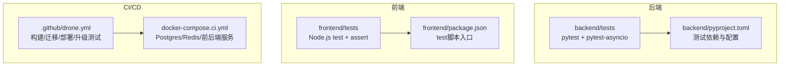
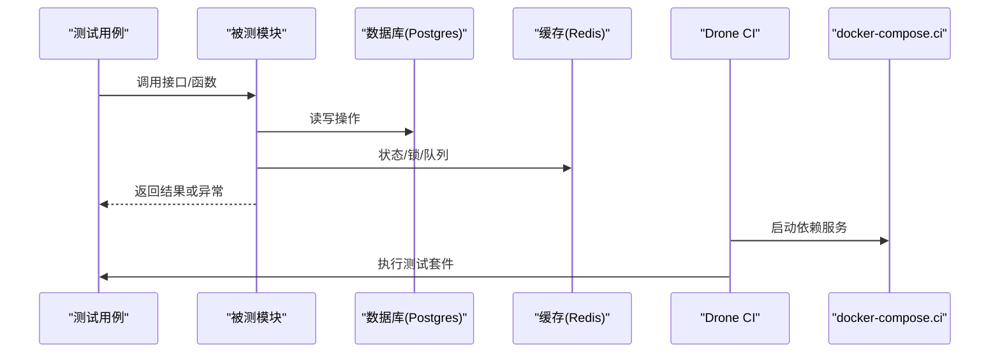
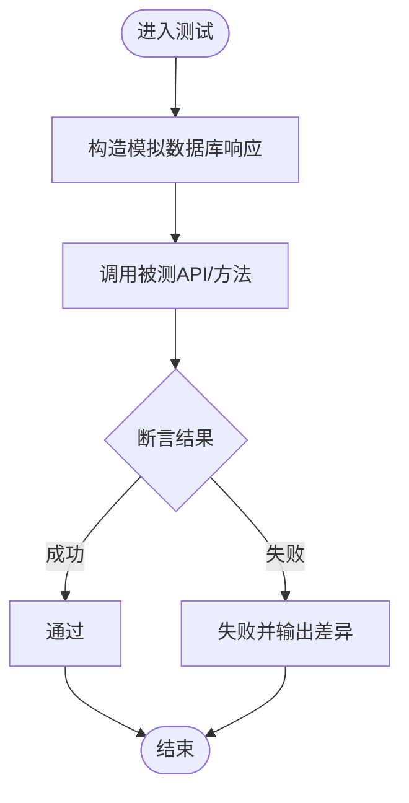
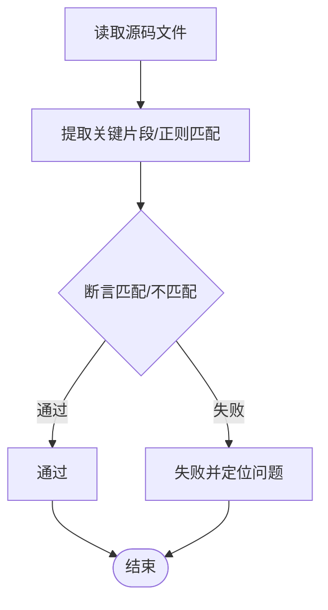
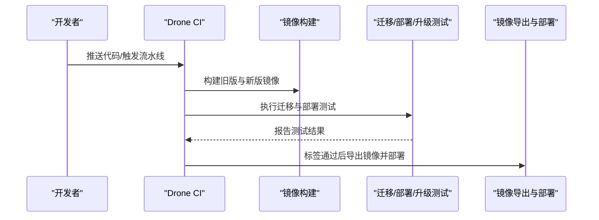
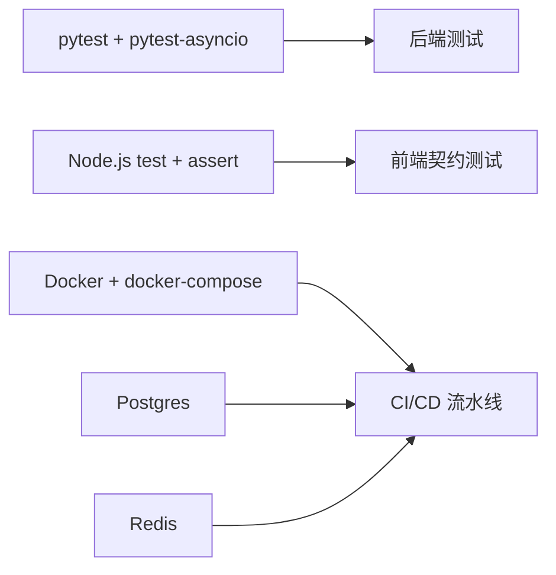

# 测试指南

<cite>
**本文引用的文件**
- [backend/pyproject.toml](file://backend/pyproject.toml)
- [backend/tests/test_auth.py](file://backend/tests/test_auth.py)
- [backend/tests/test_base_dao.py](file://backend/tests/test_base_dao.py)
- [backend/tests/test_agent_runtime_config.py](file://backend/tests/test_agent_runtime_config.py)
- [frontend/package.json](file://frontend/package.json)
- [frontend/tests/apiError.test.mjs](file://frontend/tests/apiError.test.mjs)
- [frontend/tests/groupApiContract.test.mjs](file://frontend/tests/groupApiContract.test.mjs)
- [frontend/tests/chatMultimodalContract.test.mjs](file://frontend/tests/chatMultimodalContract.test.mjs)
- [.github/drone.yml](file://.github/drone.yml)
- [docker-compose.ci.yml](file://docker-compose.ci.yml)
</cite>

## 目录
1. [简介](#简介)
2. [项目结构](#项目结构)
3. [核心组件](#核心组件)
4. [架构总览](#架构总览)
5. [详细组件分析](#详细组件分析)
6. [依赖分析](#依赖分析)
7. [性能考虑](#性能考虑)
8. [故障排查指南](#故障排查指南)
9. [结论](#结论)
10. [附录](#附录)

## 简介
本指南面向Clawith项目的开发与测试人员，系统化说明后端与前端测试策略、框架使用、Mock与数据管理、持续集成、覆盖率统计、性能测试以及测试驱动开发（TDD）与重构安全实践。内容基于仓库现有测试代码与CI配置进行提炼，确保可落地执行。

## 项目结构
- 后端测试位于 backend/tests，采用 pytest + pytest-asyncio，异步模式自动启用。
- 前端测试位于 frontend/tests，采用 Node.js 内置 test 运行器，配合 assert/strict 进行断言。
- CI 由 Drone 编排，结合 docker-compose.ci.yml 提供数据库、Redis 等依赖服务，完成迁移、部署与升级测试。

**图表来源**
- [backend/pyproject.toml:68-70](file://backend/pyproject.toml#L68-L70)
- [frontend/package.json:7-12](file://frontend/package.json#L7-L12)
- [.github/drone.yml:1-12](file://.github/drone.yml#L1-L12)
- [docker-compose.ci.yml:1-20](file://docker-compose.ci.yml#L1-L20)

**章节来源**
- [backend/pyproject.toml:58-70](file://backend/pyproject.toml#L58-L70)
- [frontend/package.json:7-12](file://frontend/package.json#L7-L12)
- [.github/drone.yml:1-12](file://.github/drone.yml#L1-L12)
- [docker-compose.ci.yml:1-20](file://docker-compose.ci.yml#L1-L20)

## 核心组件
- 后端测试框架与配置
  - pytest 与 pytest-asyncio 作为测试引擎，异步模式通过配置自动启用。
  - 示例：认证API单元测试、DAO层会话上下文与事务回滚测试、运行时配置决策测试。
- 前端测试框架与契约测试
  - 使用 Node.js 内置 test 运行器与 assert/strict 进行断言。
  - 示例：错误解析契约、Group API 契约、多模态聊天渲染契约。
- CI 流水线
  - Drone 编排镜像构建、空库迁移、本地部署与升级测试，保障发布质量。

**章节来源**
- [backend/pyproject.toml:58-70](file://backend/pyproject.toml#L58-L70)
- [backend/tests/test_auth.py:1-20](file://backend/tests/test_auth.py#L1-L20)
- [backend/tests/test_base_dao.py:1-20](file://backend/tests/test_base_dao.py#L1-L20)
- [backend/tests/test_agent_runtime_config.py:1-20](file://backend/tests/test_agent_runtime_config.py#L1-L20)
- [frontend/package.json:7-12](file://frontend/package.json#L7-L12)
- [frontend/tests/apiError.test.mjs:1-10](file://frontend/tests/apiError.test.mjs#L1-L10)
- [frontend/tests/groupApiContract.test.mjs:1-10](file://frontend/tests/groupApiContract.test.mjs#L1-L10)
- [frontend/tests/chatMultimodalContract.test.mjs:1-10](file://frontend/tests/chatMultimodalContract.test.mjs#L1-L10)
- [.github/drone.yml:1-12](file://.github/drone.yml#L1-L12)

## 架构总览
下图展示从测试用例到被测模块的调用关系，以及CI中依赖服务的编排。

**图表来源**
- [docker-compose.ci.yml:8-30](file://docker-compose.ci.yml#L8-L30)
- [.github/drone.yml:154-190](file://.github/drone.yml#L154-L190)

## 详细组件分析

### 后端单元测试（pytest + pytest-asyncio）
- 认证API测试
  - 覆盖无效凭据、禁用账户、未验证邮箱等边界场景。
  - 使用自定义记录型数据库对象模拟SQLAlchemy行为，避免真实IO。
- DAO层会话与事务
  - 验证独立会话上下文设置、提交与异常回滚。
  - 通过 monkeypatch 替换 async_session 工厂，注入 RecordingSession。
- 运行时配置与灰度策略
  - 校验默认值、空白可选字段处理、参数合法性。
  - 验证灰度决策优先级：允许列表 > 来源类型 > 全局开关；并保证已有运行不中途切换。

**图表来源**
- [backend/tests/test_auth.py:15-21](file://backend/tests/test_auth.py#L15-L21)
- [backend/tests/test_base_dao.py:58-87](file://backend/tests/test_base_dao.py#L58-L87)
- [backend/tests/test_agent_runtime_config.py:130-174](file://backend/tests/test_agent_runtime_config.py#L130-L174)

**章节来源**
- [backend/tests/test_auth.py:115-172](file://backend/tests/test_auth.py#L115-L172)
- [backend/tests/test_base_dao.py:58-105](file://backend/tests/test_base_dao.py#L58-L105)
- [backend/tests/test_agent_runtime_config.py:20-48](file://backend/tests/test_agent_runtime_config.py#L20-L48)
- [backend/tests/test_agent_runtime_config.py:101-174](file://backend/tests/test_agent_runtime_config.py#L101-L174)

### 前端契约测试（Node.js test + assert）
- 错误解析契约
  - 验证统一错误体优先、HTTP诊断上下文保留、trace头回填、结构化detail兼容。
- Group API 契约
  - 校验邀请成员载荷字段、消息回填游标、运行状态与取消接口路径。
- 多模态聊天契约
  - 校验持久化多图渲染逻辑与标记计数约束。

**图表来源**
- [frontend/tests/apiError.test.mjs:13-44](file://frontend/tests/apiError.test.mjs#L13-L44)
- [frontend/tests/groupApiContract.test.mjs:10-36](file://frontend/tests/groupApiContract.test.mjs#L10-L36)
- [frontend/tests/chatMultimodalContract.test.mjs:10-17](file://frontend/tests/chatMultimodalContract.test.mjs#L10-L17)

**章节来源**
- [frontend/tests/apiError.test.mjs:13-105](file://frontend/tests/apiError.test.mjs#L13-L105)
- [frontend/tests/groupApiContract.test.mjs:10-36](file://frontend/tests/groupApiContract.test.mjs#L10-L36)
- [frontend/tests/chatMultimodalContract.test.mjs:10-17](file://frontend/tests/chatMultimodalContract.test.mjs#L10-L17)

### API测试（后端FastAPI）
- 建议采用 httpx 客户端发起请求，结合测试数据库与Redis容器。
- 典型流程：准备测试环境（创建用户/租户）、发送请求、断言响应结构与状态码、清理资源。
- 参考认证API测试中的异常分支与数据结构断言方式。

**章节来源**
- [backend/pyproject.toml:58-62](file://backend/pyproject.toml#L58-L62)
- [backend/tests/test_auth.py:115-172](file://backend/tests/test_auth.py#L115-L172)

### 页面测试（前端）
- 当前仓库以契约测试为主，未包含UI自动化测试。
- 建议在需要时引入 Playwright 或 Cypress，对关键页面进行端到端验证。
- 可与现有契约测试互补，覆盖交互与渲染稳定性。

[本节为概念性内容，不直接分析具体文件]

### Mock策略
- 后端
  - 使用 unittest.mock.AsyncMock 与 patch 替换外部依赖（如邮件服务、后台任务）。
  - 自定义 DummyResult/RecordingDB 模拟SQLAlchemy会话与查询结果。
- 前端
  - 契约测试通过读取源码并断言实现细节，确保API调用与错误处理一致。
  - 如需隔离网络，可使用 fetch mock（如 node-fetch 或 undici 的 mock）。

**章节来源**
- [backend/tests/test_auth.py:166-172](file://backend/tests/test_auth.py#L166-L172)
- [backend/tests/test_base_dao.py:58-87](file://backend/tests/test_base_dao.py#L58-L87)
- [frontend/tests/apiError.test.mjs:123-141](file://frontend/tests/apiError.test.mjs#L123-L141)

### 测试数据管理
- 后端
  - 使用 SimpleNamespace 构造轻量对象，避免ORM实例开销。
  - 通过 RecordingDB 控制 execute/commit/refresh/flush 等行为。
- 前端
  - 契约测试直接读取源码文件，断言接口定义与调用路径。
  - 建议使用 fixtures 或 JSON fixtures 管理复杂输入数据。

**章节来源**
- [backend/tests/test_auth.py:28-108](file://backend/tests/test_auth.py#L28-L108)
- [frontend/tests/groupApiContract.test.mjs:1-10](file://frontend/tests/groupApiContract.test.mjs#L1-10)

### 持续集成配置
- Drone 流水线步骤
  - 克隆代码、构建新旧版本镜像、空库迁移测试、本地部署测试、升级测试、镜像导出与部署。
- 依赖服务
  - Postgres 与 Redis 健康检查，确保测试环境就绪。
- 环境变量
  - 为后端设置 SECRET_KEY、JWT_SECRET_KEY、CORS_ORIGINS 等必要变量。

**图表来源**
- [.github/drone.yml:72-151](file://.github/drone.yml#L72-L151)
- [.github/drone.yml:154-190](file://.github/drone.yml#L154-L190)
- [docker-compose.ci.yml:32-66](file://docker-compose.ci.yml#L32-L66)

**章节来源**
- [.github/drone.yml:1-12](file://.github/drone.yml#L1-L12)
- [.github/drone.yml:72-151](file://.github/drone.yml#L72-L151)
- [.github/drone.yml:154-190](file://.github/drone.yml#L154-L190)
- [docker-compose.ci.yml:8-30](file://docker-compose.ci.yml#L8-L30)

### 覆盖率统计
- 后端
  - 可在 pytest 命令中加入 coverage 插件，生成 HTML 报告。
  - 建议将覆盖率阈值纳入CI，防止退化。
- 前端
  - 若引入Vitest或Jest，可启用覆盖率统计；当前Node test暂不支持原生覆盖率。

[本节为通用指导，不直接分析具体文件]

### 性能测试
- 后端
  - 使用 locust 或 k6 对关键API进行压测，关注延迟、吞吐与错误率。
  - 针对LLM调用、文件转换、存储I/O等热点路径设计基准用例。
- 前端
  - 使用 Lighthouse 或 WebPageTest 评估首屏加载、交互延迟与内存占用。

[本节为通用指导，不直接分析具体文件]

### 测试驱动开发（TDD）与重构安全
- TDD 实践
  - 先写失败的测试，再实现最小可用代码，最后重构优化。
  - 在变更公共接口前，先补充契约测试，确保向后兼容。
- 重构安全
  - 利用 DAO 会话上下文与事务回滚测试，确保数据一致性。
  - 对灰度策略与配置项增加参数合法性与边界用例，防止回归。

**章节来源**
- [backend/tests/test_base_dao.py:58-105](file://backend/tests/test_base_dao.py#L58-L105)
- [backend/tests/test_agent_runtime_config.py:96-128](file://backend/tests/test_agent_runtime_config.py#L96-L128)

### 调试技巧
- 后端
  - 打印日志与异常堆栈，结合 pytest -s 查看实时输出。
  - 使用 pdb 或 breakpoint() 在关键路径打断点。
- 前端
  - 使用 console.log 与浏览器开发者工具定位问题。
  - 契约测试失败时，检查正则匹配与源码路径是否正确。

[本节为通用指导，不直接分析具体文件]

## 依赖分析
- 后端测试依赖
  - pytest、pytest-asyncio、httpx、ruff 等。
- 前端测试依赖
  - Node.js 内置 test 与 assert/strict，无需额外包。
- CI 依赖
  - Docker、Drone、Postgres、Redis。

**图表来源**
- [backend/pyproject.toml:58-62](file://backend/pyproject.toml#L58-L62)
- [frontend/package.json:7-12](file://frontend/package.json#L7-L12)
- [docker-compose.ci.yml:8-30](file://docker-compose.ci.yml#L8-L30)

**章节来源**
- [backend/pyproject.toml:58-62](file://backend/pyproject.toml#L58-L62)
- [frontend/package.json:7-12](file://frontend/package.json#L7-L12)
- [docker-compose.ci.yml:8-30](file://docker-compose.ci.yml#L8-L30)

## 性能考虑
- 测试执行时间
  - 减少不必要的IO，尽量使用内存模拟与轻量对象。
  - 并行执行测试套件，缩短CI时长。
- 资源隔离
  - 每个测试用例独立数据库会话，避免相互干扰。
  - 使用临时目录与随机命名避免冲突。

[本节为通用指导，不直接分析具体文件]

## 故障排查指南
- 常见后端问题
  - 会话上下文未正确设置：检查 _session_ctx 的使用与恢复。
  - 事务未提交或回滚：确认异常分支是否触发 rollback。
- 常见前端问题
  - 契约测试失败：核对源码路径与正则表达式。
  - 错误解析不一致：检查统一错误体与头部字段填充逻辑。

**章节来源**
- [backend/tests/test_base_dao.py:58-87](file://backend/tests/test_base_dao.py#L58-L87)
- [frontend/tests/apiError.test.mjs:13-44](file://frontend/tests/apiError.test.mjs#L13-L44)

## 结论
本项目已具备完善的后端单元测试与前端契约测试基础，并通过Drone CI实现了完整的迁移、部署与升级测试。建议在此基础上逐步扩展API测试、覆盖率统计与性能测试，形成更全面的测试体系，提升交付质量与稳定性。

## 附录
- 快速开始
  - 后端：安装依赖后运行 pytest 执行测试。
  - 前端：运行 npm test 执行契约测试。
  - CI：在本地使用 docker-compose.ci.yml 启动依赖服务，验证流水线步骤。

[本节为通用指导，不直接分析具体文件]