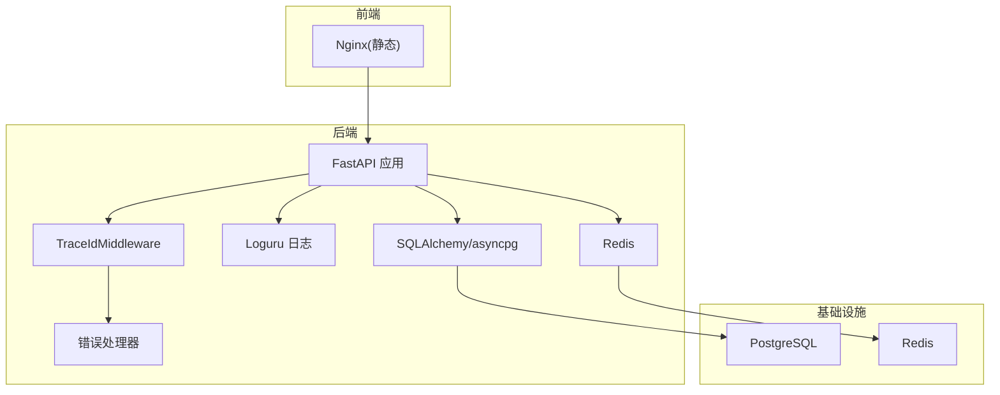
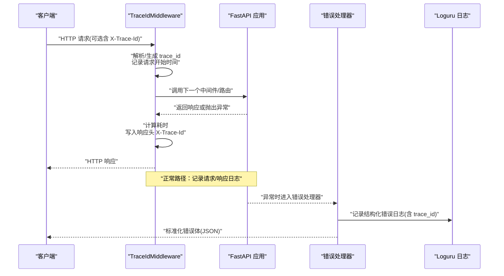
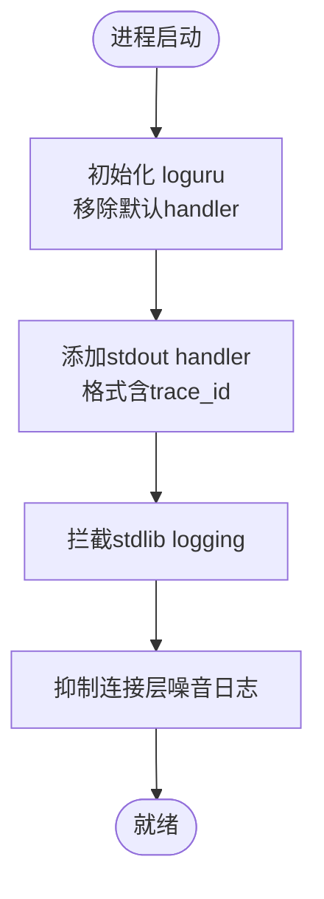
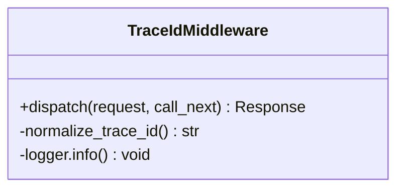
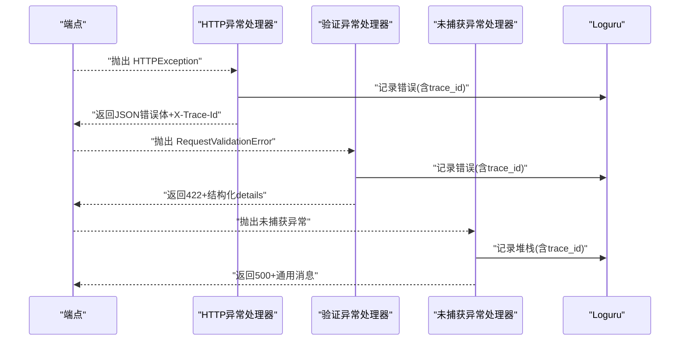
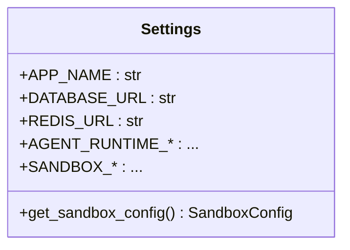
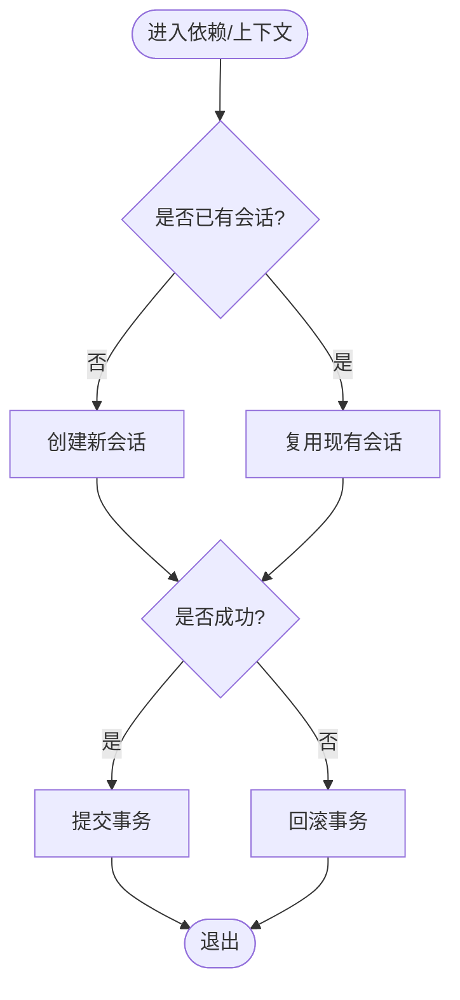
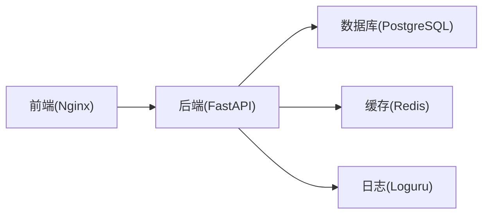

# 调试与性能分析

<cite>
**本文引用的文件**   
- [backend/app/core/logging_config.py](file://backend/app/core/logging_config.py)
- [backend/app/core/middleware.py](file://backend/app/core/middleware.py)
- [backend/app/core/error_contract.py](file://backend/app/core/error_contract.py)
- [backend/app/config.py](file://backend/app/config.py)
- [backend/app/database.py](file://backend/app/database.py)
- [backend/pyproject.toml](file://backend/pyproject.toml)
- [backend/Dockerfile](file://backend/Dockerfile)
- [frontend/Dockerfile](file://frontend/Dockerfile)
- [docker-compose.yml](file://docker-compose.yml)
</cite>

## 目录
1. [简介](#简介)
2. [项目结构](#项目结构)
3. [核心组件](#核心组件)
4. [架构总览](#架构总览)
5. [详细组件分析](#详细组件分析)
6. [依赖关系分析](#依赖关系分析)
7. [性能考虑](#性能考虑)
8. [故障排查指南](#故障排查指南)
9. [结论](#结论)
10. [附录](#附录)

## 简介
本文件面向开发与运维人员，系统化梳理 Clawith 项目的调试与性能分析方法。内容覆盖 IDE 配置（VS Code、PyCharm）、断点调试、日志与追踪、性能分析与内存泄漏检测、数据库与 API 调优、前端性能监控、错误追踪与异常处理、生产问题定位、监控指标与告警配置等。所有实践均结合仓库中的日志、中间件、错误契约、配置与容器化方案进行说明，确保可落地、可复现。

## 项目结构
后端采用 FastAPI + SQLAlchemy(asyncpg) + Redis + Loguru 的架构；前端为 Vite + React + Nginx 静态资源服务；整体通过 docker-compose 编排，包含 PostgreSQL、Redis、后端与前端服务。关键调试与性能相关能力集中在：
- 统一日志与追踪：loguru 配置、trace_id 注入与透传
- 请求级中间件：耗时统计、响应头透传
- 错误契约：标准化错误体与异常处理器
- 配置中心：环境变量驱动、运行时参数校验
- 数据库连接池与事务上下文
- 容器健康检查与日志轮转

**图示来源** 
- [backend/app/core/middleware.py:12-53](file://backend/app/core/middleware.py#L12-L53)
- [backend/app/core/error_contract.py:158-229](file://backend/app/core/error_contract.py#L158-L229)
- [backend/app/core/logging_config.py:61-79](file://backend/app/core/logging_config.py#L61-L79)
- [backend/app/database.py:14-21](file://backend/app/database.py#L14-L21)
- [docker-compose.yml:32-106](file://docker-compose.yml#L32-L106)

**章节来源**
- [backend/app/core/logging_config.py:1-129](file://backend/app/core/logging_config.py#L1-L129)
- [backend/app/core/middleware.py:1-53](file://backend/app/core/middleware.py#L1-L53)
- [backend/app/core/error_contract.py:1-229](file://backend/app/core/error_contract.py#L1-L229)
- [backend/app/config.py:79-247](file://backend/app/config.py#L79-L247)
- [backend/app/database.py:1-79](file://backend/app/database.py#L1-L79)
- [docker-compose.yml:1-115](file://docker-compose.yml#L1-L115)

## 核心组件
- 日志与追踪
  - 使用 loguru 作为统一日志输出，支持异步队列、回溯信息、诊断信息，并强制每条日志携带 trace_id。
  - 提供 new_trace_id/get_trace_id/set_trace_id 工具函数，用于在后台任务或无 HTTP 上下文中生成并绑定追踪 ID。
- 请求追踪中间件
  - TraceIdMiddleware 从请求头读取 X-Trace-Id（若合法则复用），否则生成新 ID；记录请求/响应耗时，并在响应头回写 X-Trace-Id。
- 错误契约与异常处理
  - 统一的 ErrorObject 结构，包含 code/message/trace_id/run_id/agent_id/stage/details/retryable 等字段。
  - 注册 HTTPException、RequestValidationError、未捕获 Exception 三类处理器，保证对外错误体一致且安全。
- 配置系统
  - Settings 基于 pydantic-settings，集中管理数据库、Redis、JWT、存储、Agent 运行时、沙箱等配置，并提供字段校验与默认值推导。
- 数据库与事务
  - async_session 与 get_db 依赖提供会话生命周期管理；transaction 上下文管理器支持嵌套事务与自动提交/回滚。

**章节来源**
- [backend/app/core/logging_config.py:28-79](file://backend/app/core/logging_config.py#L28-L79)
- [backend/app/core/middleware.py:12-53](file://backend/app/core/middleware.py#L12-L53)
- [backend/app/core/error_contract.py:21-112](file://backend/app/core/error_contract.py#L21-L112)
- [backend/app/core/error_contract.py:158-229](file://backend/app/core/error_contract.py#L158-L229)
- [backend/app/config.py:79-247](file://backend/app/config.py#L79-L247)
- [backend/app/database.py:30-79](file://backend/app/database.py#L30-L79)

## 架构总览
下图展示一次典型 HTTP 请求的追踪与错误处理流程，体现 trace_id 注入、日志记录、异常统一封装与响应头透传。

**图示来源** 
- [backend/app/core/middleware.py:15-53](file://backend/app/core/middleware.py#L15-L53)
- [backend/app/core/error_contract.py:158-229](file://backend/app/core/error_contract.py#L158-L229)
- [backend/app/core/logging_config.py:61-79](file://backend/app/core/logging_config.py#L61-L79)

## 详细组件分析

### 日志与追踪子系统
- 设计要点
  - 统一入口：configure_logging 移除默认 handler，添加带 trace_id 过滤器的 stdout 输出，启用 enqueue/backtrace/diagnose。
  - 标准库拦截：intercept_standard_logging 将 stdlib logging 重定向到 loguru，便于第三方库日志归一化。
  - 噪音控制：quiet_noisy_connection_loggers 降低 uvicorn/websockets/urllib3 的连接级日志级别。
  - 追踪 ID：ContextVar 维护线程/协程内 trace_id，new_trace_id 用于后台任务。
- 调试建议
  - 本地开发开启 DEBUG 以打印 SQL 语句（见数据库引擎 echo）。
  - 通过 X-Trace-Id 贯穿全链路，便于聚合日志平台检索。
  - 对第三方库日志，使用 intercept_standard_logging 统一接入。

**图示来源** 
- [backend/app/core/logging_config.py:61-87](file://backend/app/core/logging_config.py#L61-L87)
- [backend/app/core/logging_config.py:89-125](file://backend/app/core/logging_config.py#L89-L125)

**章节来源**
- [backend/app/core/logging_config.py:1-129](file://backend/app/core/logging_config.py#L1-L129)

### 请求追踪中间件
- 功能
  - 从请求头读取 X-Trace-Id，若不符合安全格式则生成新 ID。
  - 记录请求方法与路径、客户端 IP、响应状态码与耗时。
  - 在响应头中回写 X-Trace-Id，便于前端与网关串联。
- 调试建议
  - 在浏览器开发者工具或 curl 中查看响应头 X-Trace-Id。
  - 配合日志平台按 trace_id 聚合查询。

**图示来源** 
- [backend/app/core/middleware.py:12-53](file://backend/app/core/middleware.py#L12-L53)

**章节来源**
- [backend/app/core/middleware.py:1-53](file://backend/app/core/middleware.py#L1-L53)

### 错误契约与异常处理
- 设计要点
  - ErrorObject 定义稳定字段，避免泄露内部细节。
  - http_exception_handler 保留端点自定义 detail，同时补充规范 error 对象与 trace_id。
  - request_validation_error_handler 将 Pydantic 验证错误转为结构化 details。
  - unhandled_exception_handler 记录完整堆栈但不暴露敏感信息给客户端。
- 调试建议
  - 在测试中构造不同异常类型，验证错误体结构与 header 透传。
  - 通过 X-Trace-Id 关联服务端错误日志与客户端报错。

**图示来源** 
- [backend/app/core/error_contract.py:158-229](file://backend/app/core/error_contract.py#L158-L229)

**章节来源**
- [backend/app/core/error_contract.py:1-229](file://backend/app/core/error_contract.py#L1-L229)

### 配置系统
- 设计要点
  - Settings 集中声明所有运行期参数，支持 .env 加载与环境变量覆盖。
  - 内置字段校验与默认值推导（如容器环境下的路径、实例 ID、代理设置等）。
  - 提供 get_settings() 缓存与 get_sandbox_config() 便捷方法。
- 调试建议
  - 通过环境变量快速切换数据库、Redis、存储后端、代理等。
  - 利用 DEBUG 开关控制 SQL 日志输出。

**图示来源** 
- [backend/app/config.py:79-247](file://backend/app/config.py#L79-L247)

**章节来源**
- [backend/app/config.py:1-268](file://backend/app/config.py#L1-L268)

### 数据库与事务
- 设计要点
  - create_async_engine 创建连接池（pool_size/max_overflow），DEBUG 模式下开启 SQL 回显。
  - get_db 依赖提供会话生命周期，自动 commit/rollback。
  - transaction 上下文管理器支持嵌套事务与上下文变量传递。
- 调试建议
  - 使用 get_db 注入会话，结合 pytest 的异步模式编写单元测试。
  - 通过 SQL 日志定位慢查询与锁等待。

**图示来源** 
- [backend/app/database.py:30-79](file://backend/app/database.py#L30-L79)

**章节来源**
- [backend/app/database.py:1-79](file://backend/app/database.py#L1-L79)

## 依赖关系分析
- 运行时依赖
  - FastAPI/Uvicorn：HTTP 框架与 ASGI 服务器
  - SQLAlchemy/asyncpg：异步 ORM 与数据库驱动
  - Redis：缓存与会话/分布式锁（根据业务）
  - Loguru：结构化日志
  - Docker/Nginx：容器化与前端静态资源服务
- 构建与开发依赖
  - pytest/pytest-asyncio：异步测试
  - ruff：代码风格检查
  - uv：包管理与安装加速

**图示来源** 
- [backend/pyproject.toml:6-51](file://backend/pyproject.toml#L6-L51)
- [docker-compose.yml:1-115](file://docker-compose.yml#L1-L115)

**章节来源**
- [backend/pyproject.toml:1-77](file://backend/pyproject.toml#L1-L77)
- [docker-compose.yml:1-115](file://docker-compose.yml#L1-L115)

## 性能考虑
- 日志与追踪
  - 使用 loguru 的 enqueue 异步输出，避免阻塞主循环；合理设置日志级别，减少 IO 压力。
  - 通过 X-Trace-Id 精准定位慢请求与异常链路。
- 数据库
  - 调整 pool_size/max_overflow 匹配并发量；开启 SQL 回显仅用于调试。
  - 使用索引与分页，避免全表扫描与大结果集。
- API 性能
  - 中间件已记录耗时，结合日志平台筛选 P95/P99 延迟。
  - 合理使用缓存（Redis）与幂等设计，降低重复计算与外部调用。
- 前端性能
  - 使用 Nginx 缓存静态资源，开启 gzip/brotli。
  - 通过浏览器 Performance 面板与 Network 面板分析首屏与长任务。
- 容器与健康检查
  - Docker HEALTHCHECK 定期探测 /api/health，保障服务可用性。
  - Docker Compose 日志轮转限制大小与数量，防止磁盘打满。

[本节为通用指导，不直接分析具体文件]

## 故障排查指南
- 常见问题定位
  - 无法连接数据库/Redis：检查 docker-compose 环境变量与服务健康检查。
  - 接口报 422：查看 request_validation_error_handler 返回的 details 字段。
  - 500 错误：通过 X-Trace-Id 在服务端日志中搜索“Unhandled HTTP request exception”。
- 日志分析
  - 使用 trace_id 聚合同一请求的所有日志，包括中间件、路由、DAO、外部调用。
  - 关注连接层噪音日志已被抑制，聚焦业务与异常日志。
- 异常处理
  - 自定义 HTTPException 时，尽量填充 code/message/retryable 等字段，便于客户端重试策略。
  - 未捕获异常会被统一处理器记录并返回通用错误，避免泄露堆栈。
- 容器与部署
  - 检查 Dockerfile 的 HEALTHCHECK 与 entrypoint.sh 执行顺序。
  - 确认 nginx.conf.template 与端口映射正确。

**章节来源**
- [backend/app/core/error_contract.py:158-229](file://backend/app/core/error_contract.py#L158-L229)
- [backend/app/core/logging_config.py:61-87](file://backend/app/core/logging_config.py#L61-L87)
- [backend/Dockerfile:56-63](file://backend/Dockerfile#L56-L63)
- [docker-compose.yml:86-91](file://docker-compose.yml#L86-L91)

## 结论
本项目通过统一的日志与追踪、标准化的错误契约、健壮的中间件与配置系统，构建了完善的开发与调试基础。结合容器化与健康检查，可在本地与生产环境中高效定位问题、优化性能。建议在团队内推广 trace_id 全链路追踪、结构化日志与性能基线监控，持续提升稳定性与用户体验。

[本节为总结性内容，不直接分析具体文件]

## 附录

### IDE 配置与断点调试（VS Code、PyCharm）
- VS Code
  - Python 扩展：安装 Python、Pylance、Ruff。
  - launch.json：配置 Flask/FastAPI 启动命令（uvicorn），设置断点与变量监视。
  - 环境变量：通过 .env 或 launch.json 的 env 传入 DATABASE_URL、REDIS_URL、SECRET_KEY 等。
  - 日志：在终端查看 loguru 输出，结合 X-Trace-Id 过滤。
- PyCharm
  - 新建 Python 运行配置，选择模块 uvicorn，指定 app.main:app（根据实际入口）。
  - 在断点处查看 ContextVar（trace_id）与请求对象 state.trace_id。
  - 使用 Database 工具连接 PostgreSQL，执行 SQL 验证。

[本节为通用指导，不直接分析具体文件]

### 性能分析方法与内存泄漏检测
- 性能分析
  - 使用 cProfile 或 py-spy 对热点函数采样，定位 CPU 瓶颈。
  - 结合中间件耗时日志与数据库 SQL 日志，识别慢查询与外部调用。
- 内存分析
  - 使用 tracemalloc 或 memory_profiler 跟踪内存分配，排查大对象与循环引用。
  - 观察连接池与缓存命中率，避免内存膨胀。
- 基准与压测
  - 使用 locust/k6 模拟并发，评估 P95/P99 延迟与吞吐。
  - 对比不同 pool_size/max_overflow 与缓存策略的效果。

[本节为通用指导，不直接分析具体文件]

### 数据库查询优化
- 索引与查询计划
  - 使用 EXPLAIN ANALYZE 分析慢查询，添加合适索引。
  - 避免 SELECT *，只取必要字段，减少网络与序列化开销。
- 连接池与事务
  - 调整 pool_size/max_overflow 匹配并发；缩短事务范围，减少锁竞争。
- 读写分离与缓存
  - 读多写少场景引入 Redis 缓存热点数据，注意一致性策略。

[本节为通用指导，不直接分析具体文件]

### API 性能调优
- 中间件与路由
  - 减少中间件链长度，避免重复计算。
  - 使用异步 I/O，避免阻塞操作。
- 响应体与压缩
  - 启用 Gzip/Brotli，减小响应体积。
  - 分页与增量更新，避免一次性返回大数据。
- 外部依赖
  - 设置超时与重试策略，避免雪崩。
  - 使用连接池与批量调用，降低 RTT。

[本节为通用指导，不直接分析具体文件]

### 前端性能监控
- 浏览器工具
  - Performance 面板录制用户交互，分析长任务与渲染瓶颈。
  - Network 面板检查资源加载顺序与缓存命中。
- 埋点与上报
  - 采集首屏时间、FCP/LCP、错误率与用户行为。
  - 结合后端 trace_id 关联前后端链路。

[本节为通用指导，不直接分析具体文件]

### 错误追踪、异常处理与生产问题排查
- 错误契约
  - 统一 error 对象结构，包含 code/message/trace_id/retryable 等。
  - 客户端根据 retryable 实现指数退避重试。
- 日志与追踪
  - 通过 X-Trace-Id 聚合日志，快速定位根因。
  - 抑制噪音日志，聚焦业务与异常。
- 生产排查
  - 使用 Docker HEALTHCHECK 与日志轮转，保障稳定性。
  - 结合监控平台（Prometheus/Grafana）与告警规则，提前发现异常。

**章节来源**
- [backend/app/core/error_contract.py:21-112](file://backend/app/core/error_contract.py#L21-L112)
- [backend/app/core/logging_config.py:61-87](file://backend/app/core/logging_config.py#L61-L87)
- [backend/Dockerfile:56-63](file://backend/Dockerfile#L56-L63)
- [docker-compose.yml:86-91](file://docker-compose.yml#L86-L91)

### 监控工具使用、指标收集与告警配置
- 指标收集
  - 暴露 /metrics 端点（如 Prometheus），采集 QPS、延迟、错误率、连接池使用率。
  - 采集数据库慢查询与 Redis 命中率。
- 可视化与告警
  - 使用 Grafana 仪表盘展示关键指标。
  - 配置阈值告警（如错误率>1%、P99>500ms），通过邮件/钉钉/Slack 通知。
- 日志聚合
  - 将 loguru 输出接入 ELK/ Loki，按 trace_id 检索。
  - 设置日志级别与采样策略，平衡成本与可观测性。

[本节为通用指导，不直接分析具体文件]