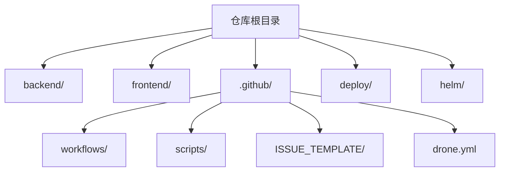
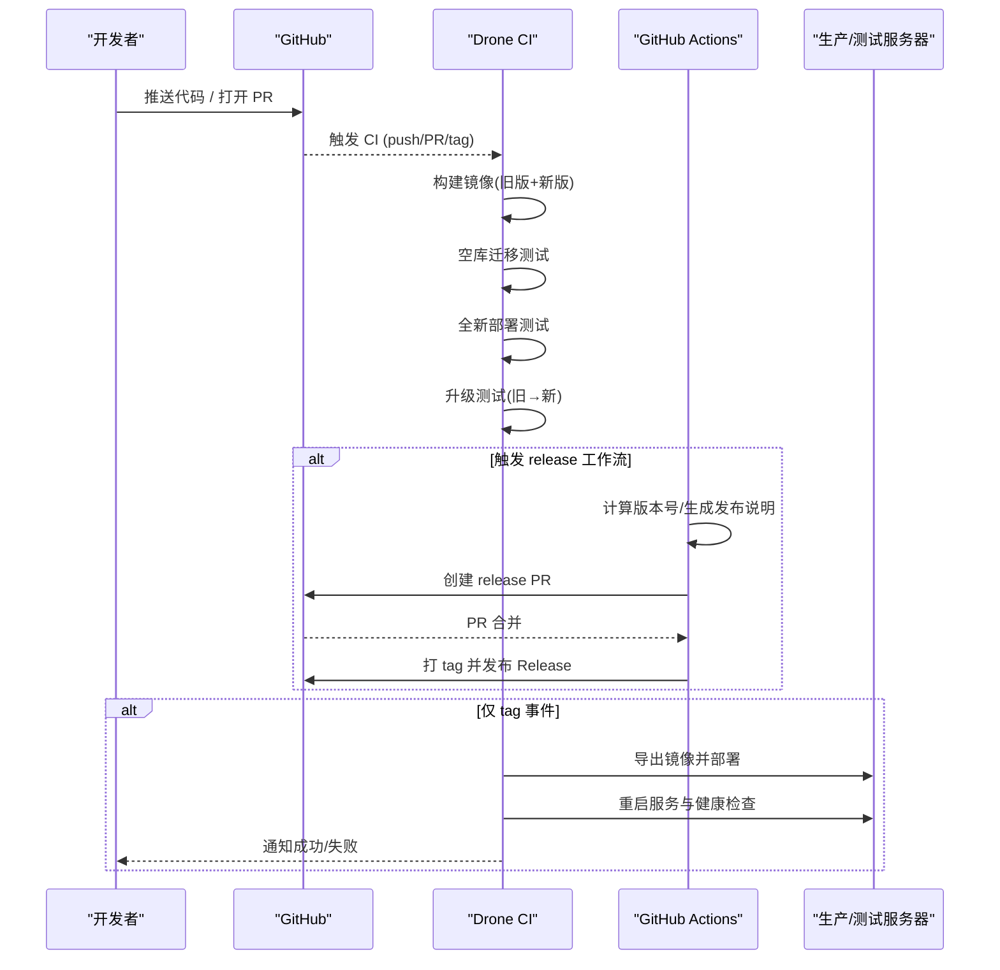
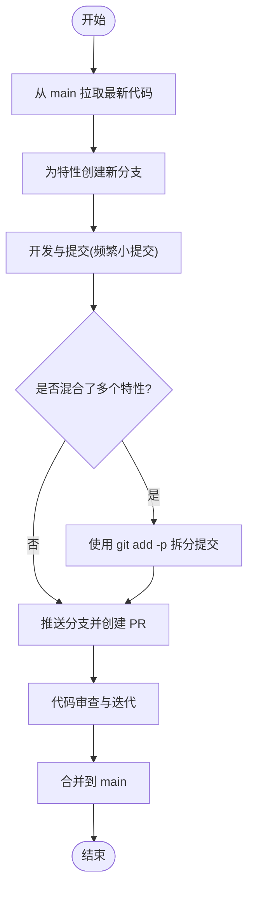
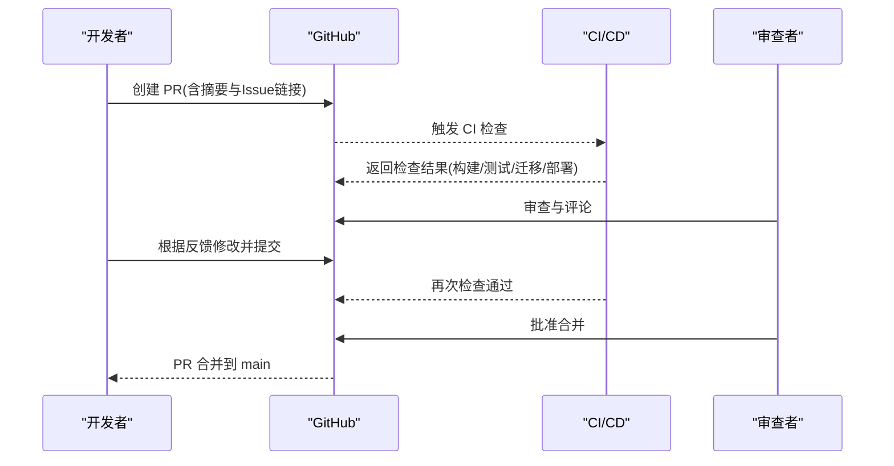
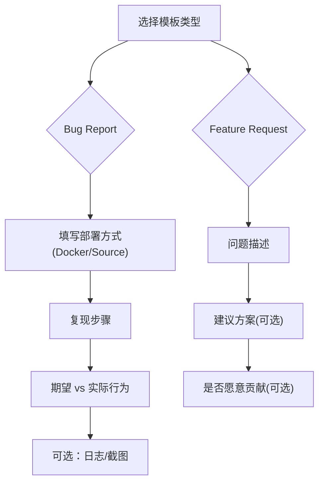
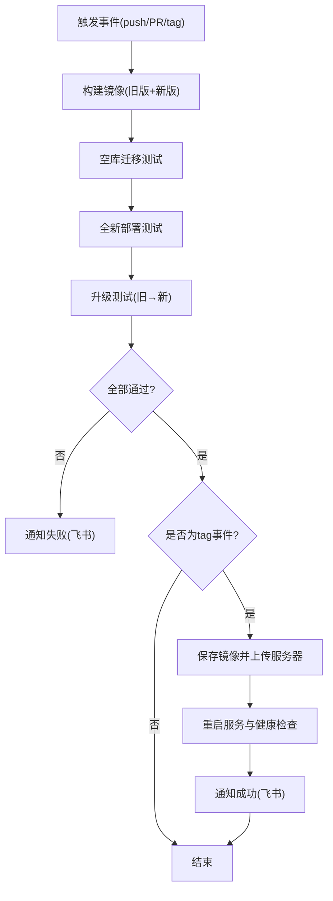
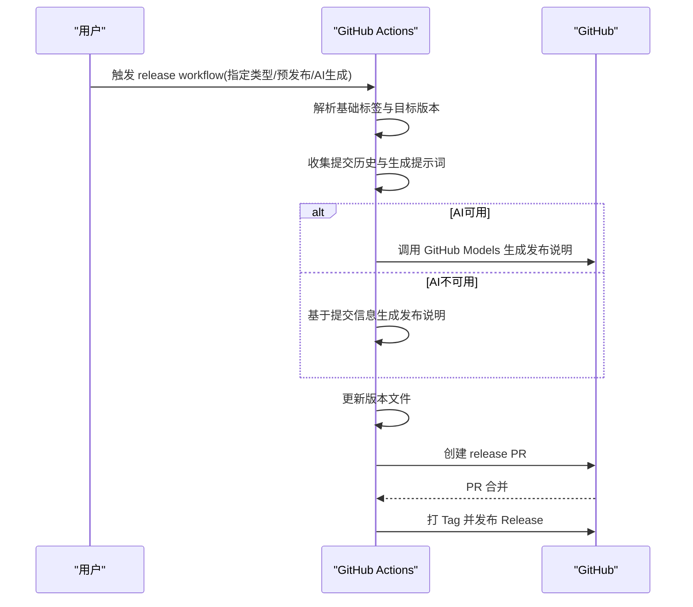
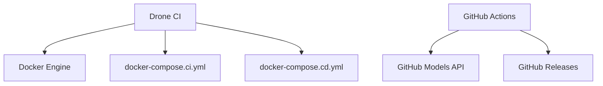

# 贡献工作流程

<cite>
**本文引用的文件**
- [CONTRIBUTING.md](file://CONTRIBUTING.md)
- [README.md](file://README.md)
- [.github/pull_request_template.md](file://.github/pull_request_template.md)
- [.github/ISSUE_TEMPLATE/bug_report.yml](file://.github/ISSUE_TEMPLATE/bug_report.yml)
- [.github/ISSUE_TEMPLATE/feature_request.yml](file://.github/ISSUE_TEMPLATE/feature_request.yml)
- [.github/workflows/release.yml](file://.github/workflows/release.yml)
- [.github/drone.yml](file://.github/drone.yml)
- [docker-compose.ci.yml](file://docker-compose.ci.yml)
- [docker-compose.cd.yml](file://docker-compose.cd.yml)
- [.github/scripts/ci_migration_test.sh](file://.github/scripts/ci_migration_test.sh)
- [.github/scripts/ci_deploy_test.sh](file://.github/scripts/ci_deploy_test.sh)
- [.github/scripts/ci_upgrade_test.sh](file://.github/scripts/ci_upgrade_test.sh)
</cite>

## 目录
1. [简介](#简介)
2. [项目结构](#项目结构)
3. [核心组件](#核心组件)
4. [架构总览](#架构总览)
5. [详细组件分析](#详细组件分析)
6. [依赖关系分析](#依赖关系分析)
7. [性能与质量保障](#性能与质量保障)
8. [故障排查指南](#故障排查指南)
9. [结论](#结论)
10. [附录](#附录)

## 简介
本文件面向所有希望参与 Clawith 项目的贡献者，系统化说明贡献流程与协作规范，包括：
- Git 工作流与分支策略
- 提交信息与 PR 规范
- Issue 报告模板与功能请求格式
- Pull Request 审查与合并标准
- CI/CD 流水线、自动化测试与发布流程
- 社区参与与讨论规范

Clawith 是一个开源的多智能体协作平台，采用前后端分离架构（前端 React + TypeScript，后端 FastAPI），通过 Docker 编排运行。贡献方式涵盖 Bug 修复、新功能、MCP 集成、翻译、文档与测试等。

**章节来源**
- [README.md:228-231](file://README.md#L228-L231)
- [CONTRIBUTING.md:1-27](file://CONTRIBUTING.md#L1-L27)

## 项目结构
仓库根目录包含前后端源码、部署配置、CI/CD 脚本与文档。关键目录与职责如下：
- backend/app：后端 API、模型、服务与核心模块
- frontend/src：前端页面、组件、状态管理与国际化
- .github：GitHub Actions、Drone CI 配置与脚本
- deploy/helm：Kubernetes Helm 包
- docker-compose.*：本地与 CI/CD 的容器编排

**图表来源**
- [README.md:205-225](file://README.md#L205-L225)

**章节来源**
- [CONTRIBUTING.md:137-152](file://CONTRIBUTING.md#L137-L152)

## 核心组件
- 贡献入口与快速开始：Fork、克隆、环境搭建、启动服务、创建分支、提交 PR
- 问题与需求模板：Bug Report、Feature Request
- 代码风格与工具：后端使用 ruff；前端遵循 React 约定
- 多特性并行开发：按特性拆分分支与 PR，避免大 PR

**章节来源**
- [CONTRIBUTING.md:5-27](file://CONTRIBUTING.md#L5-L27)
- [CONTRIBUTING.md:53-65](file://CONTRIBUTING.md#L53-L65)

## 架构总览
下图展示从贡献到发布的端到端流程：开发者在本地完成修改并推送至远端，触发 CI/CD 进行构建与测试，随后通过 Release 工作流生成版本与发布说明，最终发布到 GitHub Releases 或私有服务器。

**图表来源**
- [.github/drone.yml:1-12](file://.github/drone.yml#L1-L12)
- [.github/workflows/release.yml:1-45](file://.github/workflows/release.yml#L1-L45)

## 详细组件分析

### Git 工作流与分支策略
- 推荐从 main 拉取最新代码，为每个特性新建独立分支
- 保持 PR 聚焦单一特性或修复，便于审查与合并
- 若同一分支包含多个逻辑变更，建议使用交互式暂存（git add -p）拆分为多个提交与 PR

**图表来源**
- [CONTRIBUTING.md:67-135](file://CONTRIBUTING.md#L67-L135)

**章节来源**
- [CONTRIBUTING.md:67-135](file://CONTRIBUTING.md#L67-L135)

### 提交信息规范
- 建议遵循语义化提交（如 feat、fix、chore 等），并在 PR 描述中使用 Fixes #<issue_number> 关联问题
- 提交信息应清晰描述变更目的与影响范围

**章节来源**
- [CONTRIBUTING.md:53-65](file://CONTRIBUTING.md#L53-L65)

### Pull Request 流程与审查要求
- 先创建或关联 Issue，再提交 PR
- PR 需包含摘要与相关 Issue 链接
- 本地测试通过后提交，确保无无关变更
- 代码风格：后端使用 ruff；前端遵循 React 约定
- 合并标准：通过 CI 检查、至少一次审查、无阻塞错误

**图表来源**
- [.github/pull_request_template.md:1-9](file://.github/pull_request_template.md#L1-L9)
- [CONTRIBUTING.md:53-65](file://CONTRIBUTING.md#L53-L65)

**章节来源**
- [.github/pull_request_template.md:1-9](file://.github/pull_request_template.md#L1-L9)
- [CONTRIBUTING.md:53-65](file://CONTRIBUTING.md#L53-L65)

### Issue 报告模板与功能请求格式
- Bug Report：包含部署方式、复现步骤、期望与实际行为、日志/截图
- Feature Request：描述问题、解决方案建议、是否愿意贡献

**图表来源**
- [.github/ISSUE_TEMPLATE/bug_report.yml:1-46](file://.github/ISSUE_TEMPLATE/bug_report.yml#L1-L46)
- [.github/ISSUE_TEMPLATE/feature_request.yml:1-33](file://.github/ISSUE_TEMPLATE/feature_request.yml#L1-L33)

**章节来源**
- [.github/ISSUE_TEMPLATE/bug_report.yml:1-46](file://.github/ISSUE_TEMPLATE/bug_report.yml#L1-L46)
- [.github/ISSUE_TEMPLATE/feature_request.yml:1-33](file://.github/ISSUE_TEMPLATE/feature_request.yml#L1-L33)

### CI/CD 流水线与自动化测试
- 使用 Drone CI 执行构建、迁移测试、部署测试与升级测试
- 使用 GitHub Actions 执行 Release 流程（版本计算、AI 生成发布说明、打 Tag 与发布）
- 测试覆盖：空数据库迁移、全新部署、从旧版本升级到新版本

**图表来源**
- [.github/drone.yml:1-12](file://.github/drone.yml#L1-L12)
- [.github/drone.yml:192-366](file://.github/drone.yml#L192-L366)

**章节来源**
- [.github/drone.yml:1-12](file://.github/drone.yml#L1-L12)
- [.github/drone.yml:192-366](file://.github/drone.yml#L192-L366)

### 发布流程（Release）
- 手动触发或通过 PR 合并自动触发
- 自动计算下一个版本号（patch/minor/major）
- 使用 GitHub Models 生成发布说明（可回退到基于提交信息的自动生成）
- 创建 release PR，合并后打 Tag 并发布 GitHub Release

**图表来源**
- [.github/workflows/release.yml:1-45](file://.github/workflows/release.yml#L1-L45)
- [.github/workflows/release.yml:42-148](file://.github/workflows/release.yml#L42-L148)
- [.github/workflows/release.yml:245-310](file://.github/workflows/release.yml#L245-L310)
- [.github/workflows/release.yml:416-514](file://.github/workflows/release.yml#L416-L514)

**章节来源**
- [.github/workflows/release.yml:1-45](file://.github/workflows/release.yml#L1-L45)
- [.github/workflows/release.yml:42-148](file://.github/workflows/release.yml#L42-L148)
- [.github/workflows/release.yml:245-310](file://.github/workflows/release.yml#L245-L310)
- [.github/workflows/release.yml:416-514](file://.github/workflows/release.yml#L416-L514)

### 社区参与与讨论规范
- 语言政策：Issue、PR 与代码注释请使用英语
- 社区渠道：Discord、GitHub Discussions
- 新手引导：查找 labeled “good first issue” 的问题

**章节来源**
- [CONTRIBUTING.md:154-167](file://CONTRIBUTING.md#L154-L167)
- [README.md:236-244](file://README.md#L236-L244)

## 依赖关系分析
- CI/CD 依赖 Docker 与 Docker Compose
- Drone CI 依赖 docker socket 与网络配置
- Release 流程依赖 GitHub Actions 与 GitHub Models（可选）

**图表来源**
- [.github/drone.yml:1-12](file://.github/drone.yml#L1-L12)
- [docker-compose.ci.yml:1-71](file://docker-compose.ci.yml#L1-L71)
- [docker-compose.cd.yml:1-123](file://docker-compose.cd.yml#L1-L123)
- [.github/workflows/release.yml:1-45](file://.github/workflows/release.yml#L1-L45)

**章节来源**
- [.github/drone.yml:1-12](file://.github/drone.yml#L1-L12)
- [docker-compose.ci.yml:1-71](file://docker-compose.ci.yml#L1-L71)
- [docker-compose.cd.yml:1-123](file://docker-compose.cd.yml#L1-L123)
- [.github/workflows/release.yml:1-45](file://.github/workflows/release.yml#L1-L45)

## 性能与质量保障
- 空库迁移测试：验证 Alembic 迁移与索引创建
- 全新部署测试：验证服务启动、健康检查、环境变量与镜像一致性
- 升级测试：验证从旧版本到新版本的平滑升级，数据与工作区完整性
- 健康检查：服务启动后通过 HTTP 健康端点确认就绪

**章节来源**
- [.github/scripts/ci_migration_test.sh:1-73](file://.github/scripts/ci_migration_test.sh#L1-L73)
- [.github/scripts/ci_deploy_test.sh:1-119](file://.github/scripts/ci_deploy_test.sh#L1-L119)
- [.github/scripts/ci_upgrade_test.sh:1-280](file://.github/scripts/ci_upgrade_test.sh#L1-L280)

## 故障排查指南
- 常见问题：Windows 编码、代理拦截 LLM API、uvicorn 重载崩溃、路径反斜杠
- 调试建议：查看 CI 日志、保留诊断输出、检查环境变量与网络配置
- 发布失败：检查镜像标签、服务器配置文件、健康检查超时

**章节来源**
- [CONTRIBUTING.md:168-218](file://CONTRIBUTING.md#L168-L218)
- [.github/drone.yml:309-366](file://.github/drone.yml#L309-L366)

## 结论
通过规范的 Git 工作流、清晰的 PR 流程、完善的 CI/CD 流水线与自动化测试，Clawith 确保了代码质量与发布稳定性。贡献者只需遵循模板与指南，即可高效参与项目开发。

## 附录
- 快速开始：参考 README 与 CONTRIBUTING
- 社区支持：加入 Discord 或发起 Discussion

**章节来源**
- [README.md:70-117](file://README.md#L70-L117)
- [CONTRIBUTING.md:5-16](file://CONTRIBUTING.md#L5-L16)