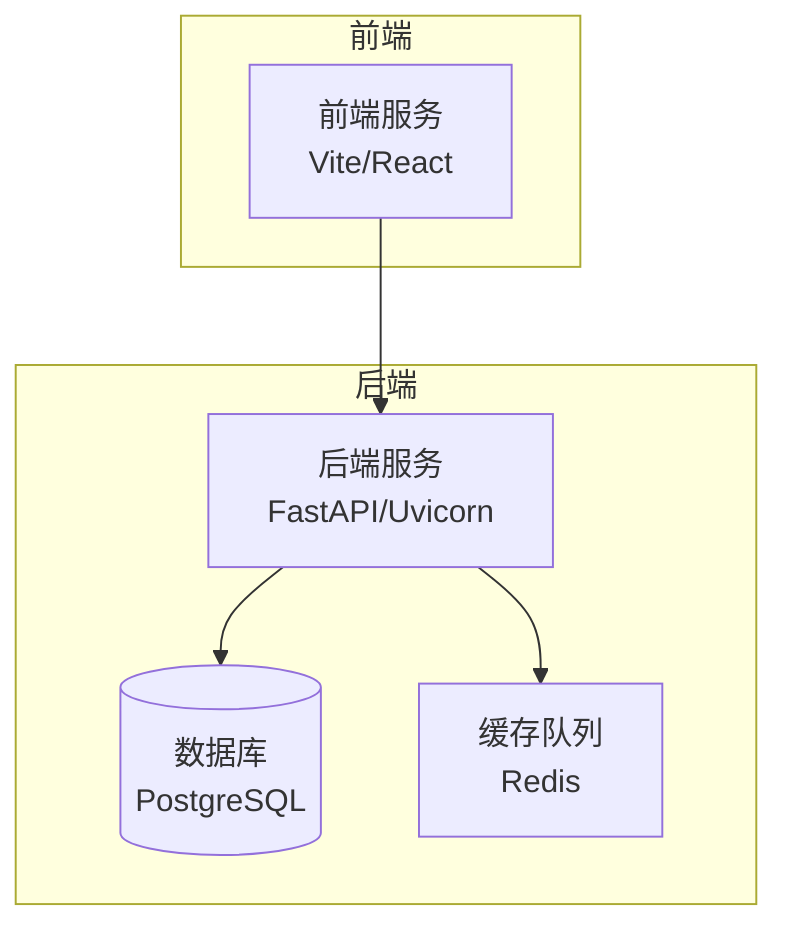
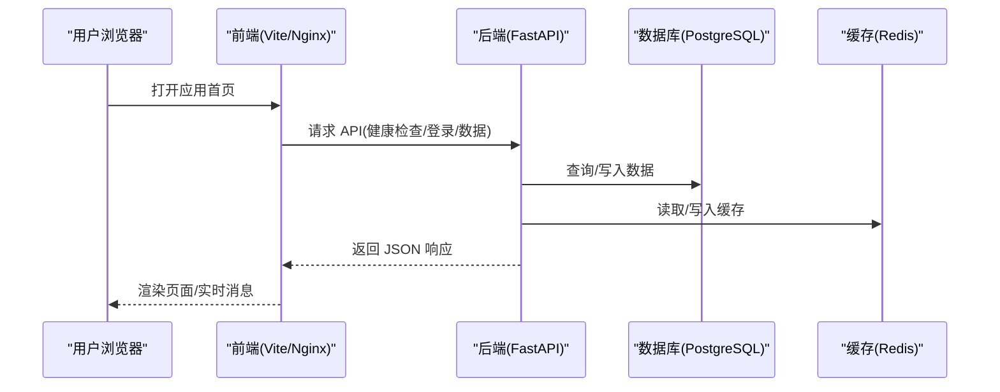
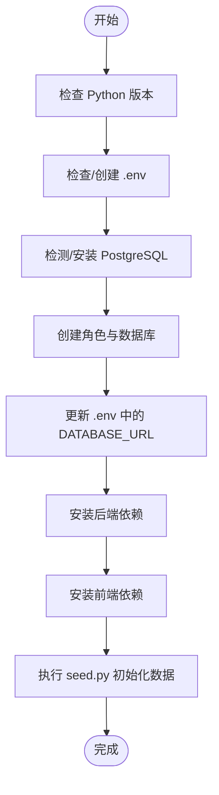
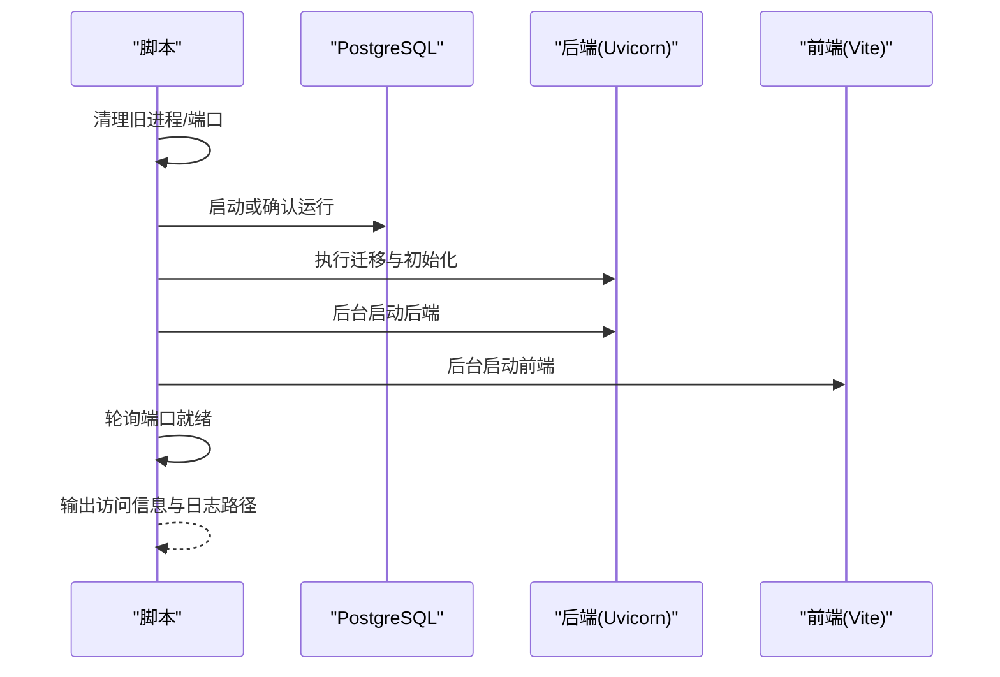
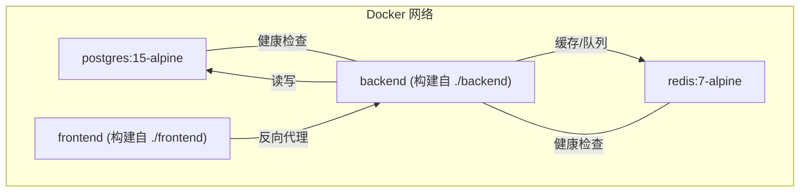
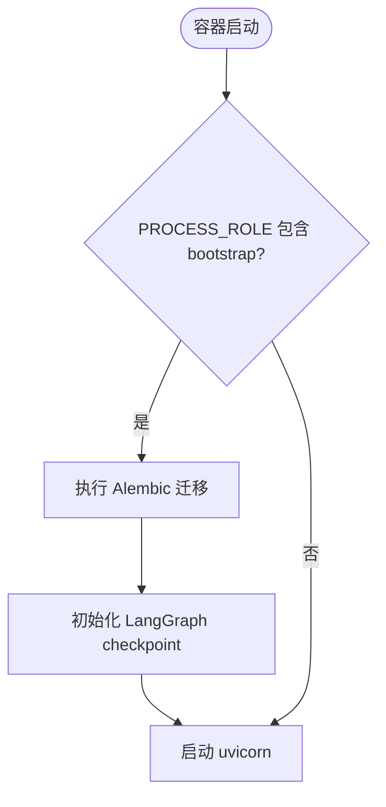
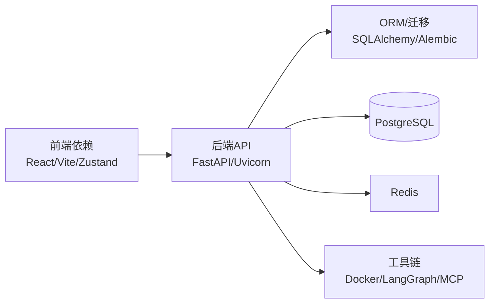

# 快速开始

<cite>
**本文引用的文件**
- [README.md](file://README.md)
- [setup.sh](file://setup.sh)
- [restart.sh](file://restart.sh)
- [docker-compose.yml](file://docker-compose.yml)
- [deploy/docker-compose.yml](file://deploy/docker-compose.yml)
- [backend/entrypoint.sh](file://backend/entrypoint.sh)
- [backend/pyproject.toml](file://backend/pyproject.toml)
- [frontend/package.json](file://frontend/package.json)
- [backend/app/config.py](file://backend/app/config.py)
- [backend/seed.py](file://backend/seed.py)
- [helm/QUICKSTART.md](file://helm/QUICKSTART.md)
</cite>

## 目录
1. [简介](#简介)
2. [项目结构](#项目结构)
3. [核心组件](#核心组件)
4. [架构总览](#架构总览)
5. [详细组件分析](#详细组件分析)
6. [依赖分析](#依赖分析)
7. [性能考虑](#性能考虑)
8. [故障排除指南](#故障排除指南)
9. [结论](#结论)
10. [附录](#附录)

## 简介
本指南面向首次接触 Clawith 的用户，帮助你在最短时间内完成环境准备、一键安装、Docker 部署与本地开发，并顺利完成首次登录、系统配置与基础使用。Clawith 是一个开源的多智能体协作平台，提供持久化身份、长期记忆与工作空间，支持多租户与渠道集成。

## 项目结构
- 前端：React + TypeScript + Vite，提供 Web 界面与代理管理、聊天会话、组织管理等能力。
- 后端：FastAPI + SQLAlchemy（异步）+ Alembic 迁移，提供 API、WebSocket、权限控制与工具链。
- 基础设施：PostgreSQL 与 Redis（可选 SQLite 用于快速测试），Docker Compose 编排。
- 部署：提供源码模式的一键脚本与 Docker 模式；同时包含 Helm Chart 用于 Kubernetes 部署。

图表来源
- [docker-compose.yml:1-115](file://docker-compose.yml#L1-L115)
- [deploy/docker-compose.yml:1-111](file://deploy/docker-compose.yml#L1-L111)

章节来源
- [README.md:205-225](file://README.md#L205-L225)

## 核心组件
- 运行环境与依赖
  - Python 3.12+、Node.js 20+、PostgreSQL 15+（或 SQLite 快速测试）
  - 推荐最低配置：2 核 CPU / 4 GB RAM / 30 GB 磁盘
- 一键安装脚本
  - 生产模式：仅安装运行时依赖
  - 开发模式：额外安装 pytest 等测试工具
- 启动与重启
  - 自动检测是否已有 Docker 容器在运行，自动切换至 Docker 模式或源码模式
  - 自动执行数据库迁移与 LangGraph checkpoint 初始化
- 首次登录
  - 首个注册用户自动成为平台管理员
- 系统邮件与密码重置
  - 通过 Web 界面配置 SMTP，设置 PUBLIC_BASE_URL 以生成正确的重置链接

章节来源
- [README.md:70-118](file://README.md#L70-L118)
- [setup.sh:1-472](file://setup.sh#L1-L472)
- [restart.sh:1-360](file://restart.sh#L1-L360)
- [backend/seed.py:1-160](file://backend/seed.py#L1-L160)
- [backend/app/config.py:1-200](file://backend/app/config.py#L1-L200)

## 架构总览
Clawith 采用前后端分离架构，后端通过 FastAPI 暴露 REST 与 WebSocket 接口，使用 SQLAlchemy 异步访问 PostgreSQL，借助 Redis 做缓存与任务调度。前端通过 Nginx（Docker 模式）或直接由 Vite 提供静态资源与反向代理到后端。

图表来源
- [docker-compose.yml:1-115](file://docker-compose.yml#L1-L115)
- [deploy/docker-compose.yml:1-111](file://deploy/docker-compose.yml#L1-L111)
- [backend/app/config.py:1-200](file://backend/app/config.py#L1-L200)

## 详细组件分析

### 一键安装脚本（setup.sh）
- 功能要点
  - 校验 Python 版本（>=3.12）
  - 创建 .env（从 .env.example）
  - 自动发现或安装 PostgreSQL，创建角色与数据库，更新 DATABASE_URL
  - 安装后端依赖（Python venv + pip），可选开发依赖
  - 安装前端依赖（npm）
  - 执行 seed.py 初始化默认公司、模板与演示智能体
- 参数说明
  - --dev：安装开发依赖（pytest、ruff 等）

图表来源
- [setup.sh:1-472](file://setup.sh#L1-L472)
- [backend/seed.py:1-160](file://backend/seed.py#L1-L160)

章节来源
- [setup.sh:1-472](file://setup.sh#L1-L472)
- [backend/seed.py:1-160](file://backend/seed.py#L1-L160)

### 启动与重启（restart.sh）
- 功能要点
  - 自动清理旧进程与端口占用
  - 加载 .env 环境变量，解析 DATABASE_URL
  - 自动启动本地 PostgreSQL（若未使用外部数据库）
  - 自动执行 Alembic 迁移与 LangGraph checkpoint 初始化
  - 以后台守护方式启动后端与前端，轮询等待端口就绪
  - 自动检测已运行的 Docker 容器，切换到 Docker 模式
- 访问信息
  - 本地与局域网地址打印，日志路径提示

图表来源
- [restart.sh:1-360](file://restart.sh#L1-L360)

章节来源
- [restart.sh:1-360](file://restart.sh#L1-L360)

### Docker 部署（docker-compose）
- 服务组成
  - postgres：PostgreSQL 15
  - redis：Redis 7
  - backend：后端镜像，挂载 agent_data 目录，启用特权与安全选项
  - frontend：前端镜像，Nginx 反向代理到后端
- 关键环境变量
  - DATABASE_URL、REDIS_URL、AGENT_DATA_DIR、STORAGE_BACKEND、SECRET_KEY、JWT_SECRET_KEY、PUBLIC_BASE_URL、CORS_ORIGINS 等
- 数据持久化
  - pgdata、redisdata 卷；agent_data 目录映射到宿主机

图表来源
- [docker-compose.yml:1-115](file://docker-compose.yml#L1-L115)
- [deploy/docker-compose.yml:1-111](file://deploy/docker-compose.yml#L1-L111)

章节来源
- [docker-compose.yml:1-115](file://docker-compose.yml#L1-L115)
- [deploy/docker-compose.yml:1-111](file://deploy/docker-compose.yml#L1-L111)

### 后端入口与迁移（entrypoint.sh）
- 功能要点
  - 根据 PROCESS_ROLE 决定是否执行 Alembic 迁移与 LangGraph checkpoint 初始化
  - 自动修复 agent_data 目录权限并降权运行
  - 最终执行 uvicorn 启动命令

图表来源
- [backend/entrypoint.sh:1-95](file://backend/entrypoint.sh#L1-L95)

章节来源
- [backend/entrypoint.sh:1-95](file://backend/entrypoint.sh#L1-L95)

### 首次登录与系统配置
- 首次登录
  - 第一个注册用户自动成为平台管理员
- 系统邮件配置
  - 在“平台设置”中配置 SMTP，确保 PUBLIC_BASE_URL 指向公网域名
- 密码重置流程
  - 通过邮件发送重置链接，前端跳转设置新密码

章节来源
- [README.md:164-192](file://README.md#L164-L192)
- [backend/app/config.py:170-176](file://backend/app/config.py#L170-L176)

### 基本使用流程
- 登录后进入工作台，查看默认公司与内置模板
- 创建智能体，体验对话、触发器与工作空间
- 通过“广场”浏览组织内动态，进行协作

章节来源
- [backend/seed.py:42-152](file://backend/seed.py#L42-L152)

## 依赖分析
- 后端依赖
  - FastAPI、Uvicorn、SQLAlchemy（async）、asyncpg、Alembic、Redis、Pydantic、JWT、WebSockets、Docker SDK、LangGraph 等
- 前端依赖
  - React 19、TypeScript、Vite、Zustand、TanStack Query、i18next 等

图表来源
- [backend/pyproject.toml:1-77](file://backend/pyproject.toml#L1-L77)
- [frontend/package.json:1-37](file://frontend/package.json#L1-L37)

章节来源
- [backend/pyproject.toml:1-77](file://backend/pyproject.toml#L1-L77)
- [frontend/package.json:1-37](file://frontend/package.json#L1-L37)

## 性能考虑
- 单机试用：可使用 SQLite，跳过 Agent 容器，降低资源占用
- 小团队：建议使用 PostgreSQL，合理分配 CPU/RAM
- 生产环境：多副本、高并发、外部存储与缓存，建议开启 HTTPS 与强密钥
- 网络优化：国内用户可配置 Docker 镜像源与 PyPI 镜像加速

章节来源
- [README.md:81-89](file://README.md#L81-L89)
- [README.md:137-162](file://README.md#L137-L162)

## 故障排除指南
- 网络问题
  - Git clone 慢或超时：浅克隆、下载 Release 包、使用代理
  - Docker 拉取失败：配置镜像加速器
- 数据库问题
  - 连接失败：检查 DATABASE_URL、端口、pg_hba.conf 认证方式
  - 迁移失败：查看 entrypoint 日志，必要时允许迁移失败继续启动
- 端口冲突
  - restart.sh 会自动检测并释放端口，或调整 FRONTEND_PORT
- 权限问题
  - agent_data 目录权限不足：entrypoint 会尝试修复，否则手动 chown

章节来源
- [README.md:193-203](file://README.md#L193-L203)
- [setup.sh:420-441](file://setup.sh#L420-L441)
- [backend/entrypoint.sh:17-33](file://backend/entrypoint.sh#L17-L33)

## 结论
通过本指南，你可以在几分钟内完成环境准备与一键安装，或使用 Docker 快速部署。首次登录后即可体验智能体工作空间、触发器与团队协作等核心功能。遇到问题时，参考故障排除部分定位并解决。

## 附录
- Helm 部署（Kubernetes）
  - 仅支持 Native Agent 模式，不支持 OpenClaw 托管模式
  - 通过 values.yaml 配置镜像、存储、域名与密钥
  - 常用命令：install、upgrade、rollback、uninstall

章节来源
- [helm/QUICKSTART.md:1-715](file://helm/QUICKSTART.md#L1-L715)