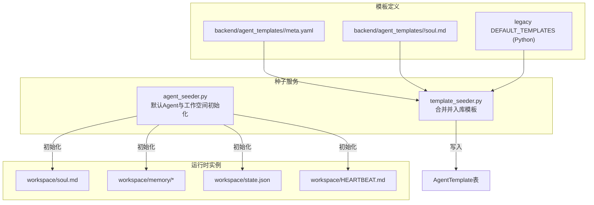
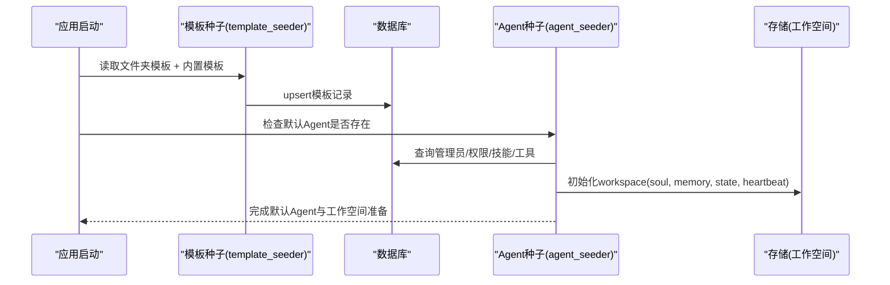
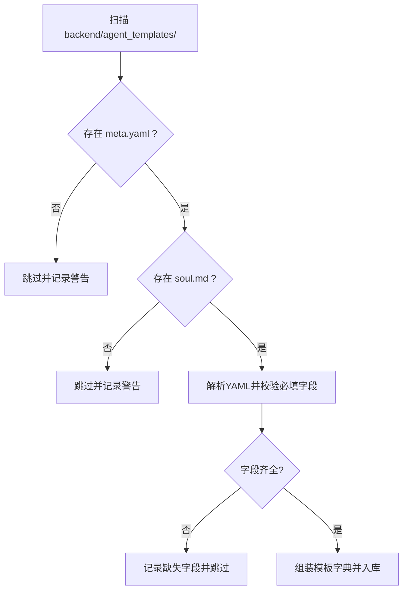
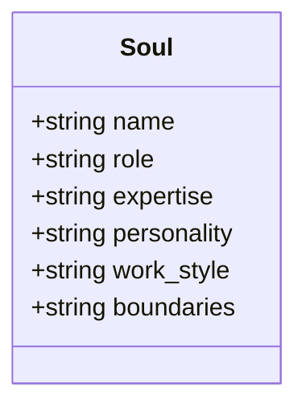
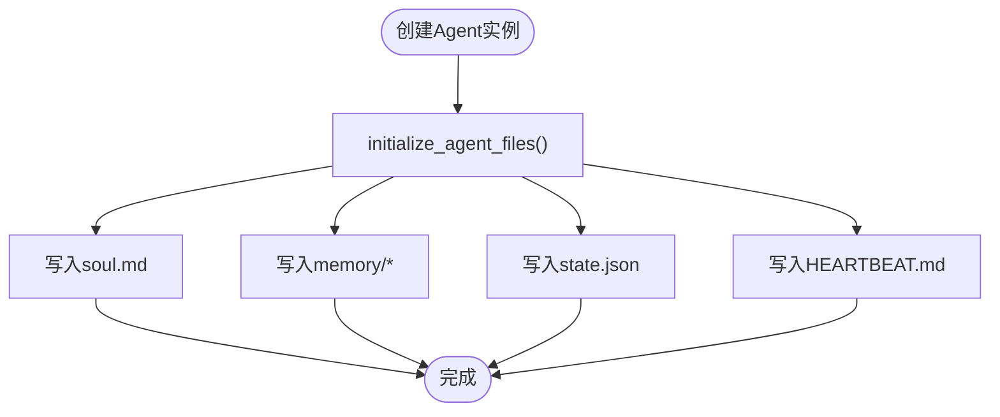

# Agent模板开发

<cite>
**本文引用的文件**   
- [backend/agent_template/soul.md](file://backend/agent_template/soul.md)
- [backend/agent_template/state.json](file://backend/agent_template/state.json)
- [backend/agent_template/HEARTBEAT.md](file://backend/agent_template/HEARTBEAT.md)
- [backend/agent_templates/backend-architect/meta.yaml](file://backend/agent_templates/backend-architect/meta.yaml)
- [backend/agent_templates/backend-architect/soul.md](file://backend/agent_templates/backend-architect/soul.md)
- [backend/agent_templates/chief-of-staff/meta.yaml](file://backend/agent_templates/chief-of-staff/meta.yaml)
- [backend/agent_templates/code-reviewer/meta.yaml](file://backend/agent_templates/code-reviewer/meta.yaml)
- [backend/app/services/template_seeder.py](file://backend/app/services/template_seeder.py)
- [backend/app/services/agent_seeder.py](file://backend/app/services/agent_seeder.py)
</cite>

## 目录
1. [简介](#简介)
2. [项目结构](#项目结构)
3. [核心组件](#核心组件)
4. [架构总览](#架构总览)
5. [详细组件分析](#详细组件分析)
6. [依赖关系分析](#依赖关系分析)
7. [性能考虑](#性能考虑)
8. [故障排查指南](#故障排查指南)
9. [结论](#结论)
10. [附录](#附录)

## 简介
本指南面向在Clawith平台上开发Agent模板的工程师与产品人员，系统阐述模板文件的组织结构、预置配置、启动流程、环境变量管理、版本兼容与企业级特性（批量部署、发布流程），并提供完整的开发示例、测试方法与调试技巧。通过本文，读者可快速掌握如何创建高质量、可维护、可复用的Agent模板，并在生产环境中稳定运行。

## 项目结构
Clawith平台将“模板定义”和“运行时实例”解耦：
- 模板定义位于后端代码仓库中，由启动时的种子程序加载并写入数据库，供用户创建Agent时选择。
- 运行时工作空间（workspace）属于每个Agent实例，包含人格、记忆、任务状态等持久化内容。

**图示来源** 
- [backend/app/services/template_seeder.py:218-273](file://backend/app/services/template_seeder.py#L218-L273)
- [backend/app/services/agent_seeder.py:264-421](file://backend/app/services/agent_seeder.py#L264-L421)

**章节来源**
- [backend/app/services/template_seeder.py:1-339](file://backend/app/services/template_seeder.py#L1-L339)
- [backend/app/services/agent_seeder.py:1-800](file://backend/app/services/agent_seeder.py#L1-L800)

## 核心组件
- meta.yaml：模板元数据，描述名称、图标、分类、能力要点、默认技能、默认自主策略、可选MCP服务器等。
- soul.md：人格定义，使用Markdown结构化描述角色、个性、工作方式与边界。
- workspace：每个Agent实例的工作空间，包含soul.md（实例化后的人格）、memory（记忆）、state.json（运行态状态）、HEARTBEAT.md（心跳行为）等。
- 种子服务：
  - template_seeder.py：合并内置模板与文件夹模板，去重、更新、清理，写入数据库。
  - agent_seeder.py：首次启动时创建默认Agent、关联技能与工具、初始化工作空间与心跳/触发器。

**章节来源**
- [backend/agent_templates/backend-architect/meta.yaml:1-15](file://backend/agent_templates/backend-architect/meta.yaml#L1-L15)
- [backend/agent_templates/backend-architect/soul.md:1-26](file://backend/agent_templates/backend-architect/soul.md#L1-L26)
- [backend/agent_template/soul.md:1-16](file://backend/agent_template/soul.md#L1-L16)
- [backend/agent_template/state.json:1-13](file://backend/agent_template/state.json#L1-L13)
- [backend/agent_template/HEARTBEAT.md:1-55](file://backend/agent_template/HEARTBEAT.md#L1-L55)
- [backend/app/services/template_seeder.py:218-273](file://backend/app/services/template_seeder.py#L218-L273)
- [backend/app/services/agent_seeder.py:264-421](file://backend/app/services/agent_seeder.py#L264-L421)

## 架构总览
模板从“静态定义”到“运行时实例”的关键路径如下：
- 启动阶段：template_seeder扫描文件夹模板与内置列表，合并为最终模板集，执行upsert；删除不再引用但已废弃的内置模板。
- 实例化阶段：agent_seeder根据模板创建Agent实例，初始化工作空间（soul.md、memory、state.json、HEARTBEAT.md），分配默认技能与工具，必要时设置心跳或定时触发器。
- 运行阶段：Agent基于soul.md的行为规范与workspace中的记忆/状态进行推理与执行；心跳按HEARTBEAT.md规则周期性自检与探索。

**图示来源** 
- [backend/app/services/template_seeder.py:275-339](file://backend/app/services/template_seeder.py#L275-L339)
- [backend/app/services/agent_seeder.py:264-421](file://backend/app/services/agent_seeder.py#L264-L421)

## 详细组件分析

### 模板元数据：meta.yaml
- 关键字段
  - name/description/icon/category：基础展示信息
  - capability_bullets：能力要点，用于前端展示与引导
  - default_skills：默认绑定的技能文件夹名列表
  - default_autonomy_policy：对文件读写、消息发送等操作的分级授权策略（如L1/L2）
  - default_mcp_servers（可选）：默认MCP服务器配置
- 校验与加载
  - 必须包含name/description/icon/category，否则跳过该模板并记录错误日志
  - 若存在同名内置模板，文件夹模板覆盖Python内置定义

**图示来源** 
- [backend/app/services/template_seeder.py:218-273](file://backend/app/services/template_seeder.py#L218-L273)

**章节来源**
- [backend/agent_templates/backend-architect/meta.yaml:1-15](file://backend/agent_templates/backend-architect/meta.yaml#L1-L15)
- [backend/agent_templates/chief-of-staff/meta.yaml:1-17](file://backend/agent_templates/chief-of-staff/meta.yaml#L1-L17)
- [backend/agent_templates/code-reviewer/meta.yaml:1-15](file://backend/agent_templates/code-reviewer/meta.yaml#L1-L15)
- [backend/app/services/template_seeder.py:218-273](file://backend/app/services/template_seeder.py#L218-L273)

### 人格定义：soul.md
- 作用：定义Agent的角色、专长、个性、工作方式与边界，作为运行时LLM的系统提示核心。
- 模板变量：支持{name}等占位符，实例化时替换为具体Agent名称。
- 最佳实践：
  - 明确角色与能力边界，避免越权操作
  - 规定语言切换策略与输出格式
  - 指定工作产物存放位置（如workspace/<design-name>/）

**图示来源** 
- [backend/agent_template/soul.md:1-16](file://backend/agent_template/soul.md#L1-L16)
- [backend/agent_templates/backend-architect/soul.md:1-26](file://backend/agent_templates/backend-architect/soul.md#L1-L26)

**章节来源**
- [backend/agent_template/soul.md:1-16](file://backend/agent_template/soul.md#L1-L16)
- [backend/agent_templates/backend-architect/soul.md:1-26](file://backend/agent_templates/backend-architect/soul.md#L1-L26)

### 工作空间：workspace
- 关键文件
  - soul.md：实例化后的人格定义（由模板注入）
  - memory/*：长期记忆与上下文摘要
  - state.json：运行态状态（如当前任务、统计指标、通道状态）
  - HEARTBEAT.md：心跳行为说明，指导周期性自检与探索
- 初始化逻辑
  - agent_seeder在创建默认Agent时调用initialize_agent_files，随后写入soul.md、memory、state.json等初始内容
  - 若存储目录缺失，自动修复并保留用户修改过的文件

**图示来源** 
- [backend/app/services/agent_seeder.py:45-101](file://backend/app/services/agent_seeder.py#L45-L101)
- [backend/agent_template/state.json:1-13](file://backend/agent_template/state.json#L1-L13)
- [backend/agent_template/HEARTBEAT.md:1-55](file://backend/agent_template/HEARTBEAT.md#L1-L55)

**章节来源**
- [backend/agent_template/state.json:1-13](file://backend/agent_template/state.json#L1-L13)
- [backend/agent_template/HEARTBEAT.md:1-55](file://backend/agent_template/HEARTBEAT.md#L1-L55)
- [backend/app/services/agent_seeder.py:45-101](file://backend/app/services/agent_seeder.py#L45-L101)

### 模板种子：template_seeder.py
- 功能
  - 合并内置Python模板与文件夹模板，按名称去重（文件夹优先）
  - 校验必填字段，解析YAML与Markdown
  - 执行upsert，删除未引用且已废弃的内置模板
- 兼容性
  - 支持新增default_mcp_servers、default_autonomy_policy等扩展字段
  - 对缺失字段或解析错误进行容错处理并记录日志

**章节来源**
- [backend/app/services/template_seeder.py:1-339](file://backend/app/services/template_seeder.py#L1-L339)

### Agent种子：agent_seeder.py
- 功能
  - 首次启动创建默认Agent（如Morty、Meeseeks、OKR Agent）
  - 绑定默认技能与工具，建立Agent间协作关系
  - 初始化工作空间，写入人格、记忆、状态与心跳
  - 为OKR Agent创建系统级定时触发器（cron）
- 幂等性
  - 通过数据库唯一约束与标记文件保证重复启动安全
  - 存储修复逻辑不覆盖用户修改的文件

**章节来源**
- [backend/app/services/agent_seeder.py:264-421](file://backend/app/services/agent_seeder.py#L264-L421)
- [backend/app/services/agent_seeder.py:424-607](file://backend/app/services/agent_seeder.py#L424-L607)
- [backend/app/services/agent_seeder.py:610-717](file://backend/app/services/agent_seeder.py#L610-L717)

## 依赖关系分析
- 模板加载依赖：
  - 文件系统：backend/agent_templates/<slug>/meta.yaml与soul.md
  - YAML解析与Markdown读取
- 数据库依赖：
  - AgentTemplate表存储模板定义
  - Agent、AgentTool、AgentTrigger等表存储实例与运行时配置
- 存储依赖：
  - 工作空间文件（soul.md、memory、state.json、HEARTBEAT.md）通过统一存储后端写入

**图示来源** 
- [backend/app/services/template_seeder.py:218-273](file://backend/app/services/template_seeder.py#L218-L273)
- [backend/app/services/agent_seeder.py:264-421](file://backend/app/services/agent_seeder.py#L264-L421)

**章节来源**
- [backend/app/services/template_seeder.py:218-273](file://backend/app/services/template_seeder.py#L218-L273)
- [backend/app/services/agent_seeder.py:264-421](file://backend/app/services/agent_seeder.py#L264-L421)

## 性能考虑
- 模板加载
  - 仅扫描必要目录，失败模板跳过并记录日志，避免阻塞启动
  - 合并阶段使用字典去重，时间复杂度O(n)
- 工作空间初始化
  - 仅在缺失时写入，避免重复IO
  - 大文件（如memory）建议分片与压缩
- 心跳与定时任务
  - 合理设置心跳频率与搜索上限，避免过度资源消耗
  - 使用系统级cron触发器精确调度，减少轮询开销

[本节为通用性能建议，不直接分析具体文件]

## 故障排查指南
- 模板加载失败
  - 检查meta.yaml是否包含必填字段（name/description/icon/category）
  - 确认soul.md存在且可读
  - 查看日志中“missing fields”或“parse error”提示
- 工作空间初始化异常
  - 确认存储后端可用，路径权限正确
  - 检查initialize_agent_files是否成功执行
  - 查看state.json与soul.md是否被覆盖（修复逻辑不覆盖用户文件）
- 心跳行为异常
  - 核对HEARTBEAT.md中的限制与规则
  - 检查web_search与write_file等工具的可用性
- 默认Agent未创建
  - 确认平台管理员存在且租户ID正确
  - 检查数据库唯一约束与种子标记文件

**章节来源**
- [backend/app/services/template_seeder.py:218-273](file://backend/app/services/template_seeder.py#L218-L273)
- [backend/app/services/agent_seeder.py:45-101](file://backend/app/services/agent_seeder.py#L45-L101)
- [backend/agent_template/HEARTBEAT.md:1-55](file://backend/agent_template/HEARTBEAT.md#L1-L55)

## 结论
通过标准化的模板结构与种子机制，Clawith平台实现了Agent模板的可复用、可演进与高内聚。开发者只需关注meta.yaml与soul.md的定义，即可快速生成具备一致行为与能力的Agent实例。结合工作空间与心跳机制，Agent可在运行时保持上下文与目标导向，满足企业级场景下的稳定性与可控性要求。

[本节为总结性内容，不直接分析具体文件]

## 附录

### 模板开发示例
- 不同角色类型
  - 后端架构师：强调API设计、数据建模与权衡分析
  - 首席幕僚：聚焦简报、优先级排序与跟进跟踪
  - 代码评审员：关注正确性、安全性与可维护性
- 预设工具配置
  - 通过default_skills与default_autonomy_policy控制能力与权限
  - 可选default_mcp_servers集成外部服务
- 初始状态设置
  - 在state.json中定义初始统计与通道状态
  - 在memory中预置知识库或模板片段

**章节来源**
- [backend/agent_templates/backend-architect/meta.yaml:1-15](file://backend/agent_templates/backend-architect/meta.yaml#L1-L15)
- [backend/agent_templates/chief-of-staff/meta.yaml:1-17](file://backend/agent_templates/chief-of-staff/meta.yaml#L1-L17)
- [backend/agent_templates/code-reviewer/meta.yaml:1-15](file://backend/agent_templates/code-reviewer/meta.yaml#L1-L15)
- [backend/agent_template/state.json:1-13](file://backend/agent_template/state.json#L1-L13)

### 版本管理与兼容性
- 模板版本
  - 通过文件夹命名与meta.yaml字段管理变更
  - 启动时upsert确保一致性，删除未引用旧模板
- 兼容性处理
  - 新增字段向后兼容（如default_mcp_servers）
  - 缺失字段时跳过并记录日志，避免破坏现有实例

**章节来源**
- [backend/app/services/template_seeder.py:275-339](file://backend/app/services/template_seeder.py#L275-L339)

### 批量部署与发布流程
- 批量部署
  - 将多个模板文件夹纳入版本控制，随应用一起部署
  - 启动时自动加载并入库，无需手动干预
- 发布流程
  - 提交模板变更至仓库
  - 构建镜像并部署，观察种子日志确认加载成功
  - 验证Agent实例创建工作空间与能力

**章节来源**
- [backend/app/services/template_seeder.py:218-273](file://backend/app/services/template_seeder.py#L218-L273)
- [backend/app/services/agent_seeder.py:264-421](file://backend/app/services/agent_seeder.py#L264-L421)

### 测试方法与调试技巧
- 单元测试
  - 验证模板解析与校验逻辑
  - 模拟工作空间初始化与文件写入
- 集成测试
  - 启动完整服务，检查模板入库与默认Agent创建
  - 验证心跳与定时触发器行为
- 调试技巧
  - 启用详细日志，定位解析与写入错误
  - 检查工作空间文件内容与权限
  - 使用最小化模板复现问题

**章节来源**
- [backend/app/services/template_seeder.py:218-273](file://backend/app/services/template_seeder.py#L218-L273)
- [backend/app/services/agent_seeder.py:45-101](file://backend/app/services/agent_seeder.py#L45-L101)