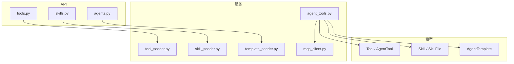
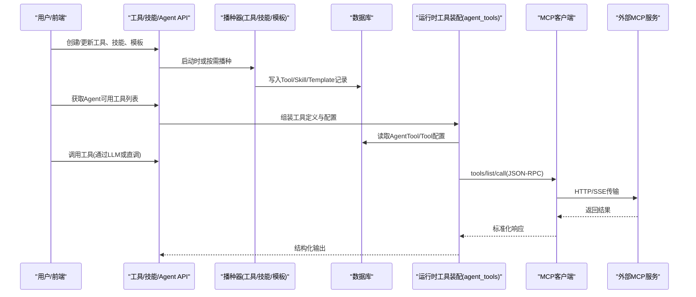
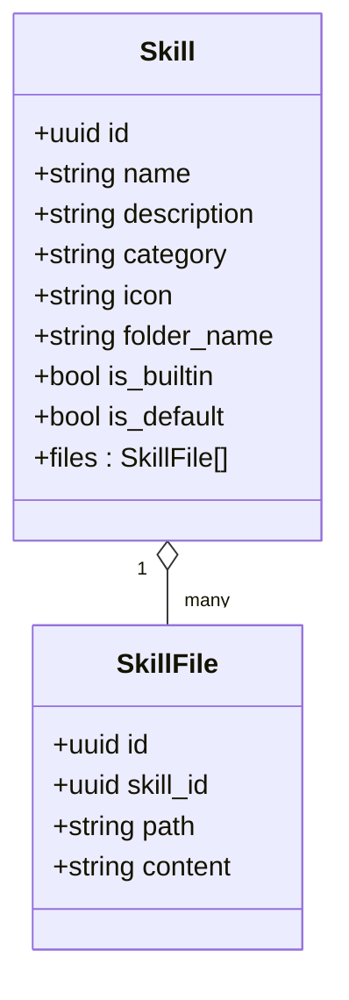
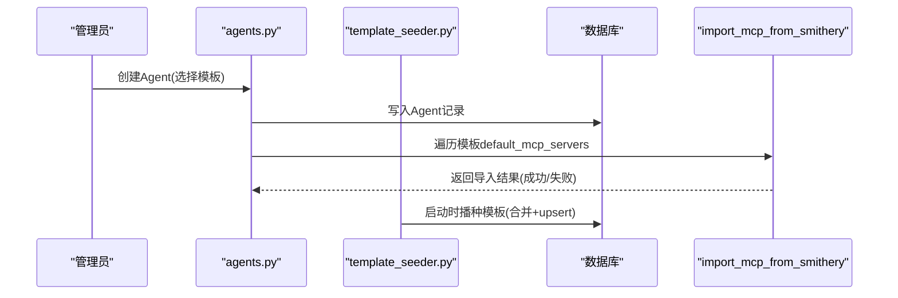
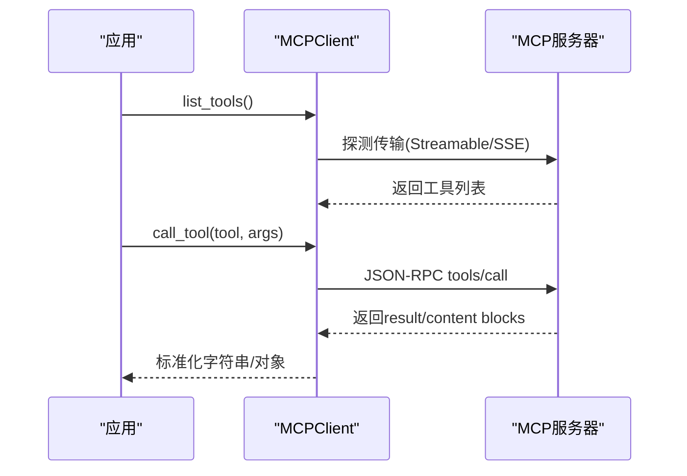
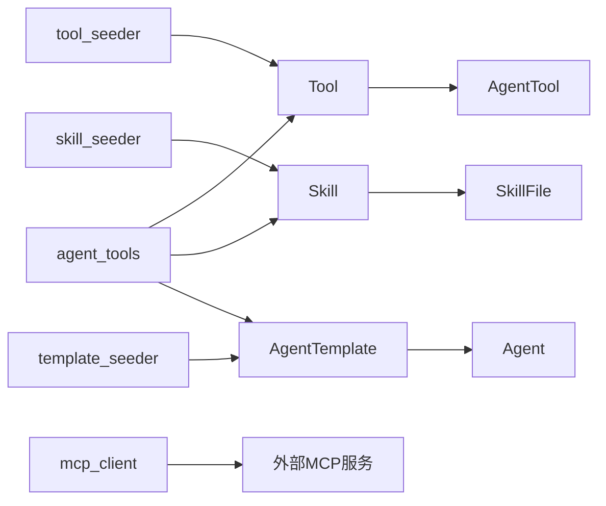

# 扩展开发

<cite>
**本文引用的文件**   
- [backend/app/services/tool_seeder.py](file://backend/app/services/tool_seeder.py)
- [backend/app/services/skill_seeder.py](file://backend/app/services/skill_seeder.py)
- [backend/app/services/template_seeder.py](file://backend/app/services/template_seeder.py)
- [backend/app/services/mcp_client.py](file://backend/app/services/mcp_client.py)
- [backend/app/models/tool.py](file://backend/app/models/tool.py)
- [backend/app/models/skill.py](file://backend/app/models/skill.py)
- [backend/app/models/agent.py](file://backend/app/models/agent.py)
- [backend/app/api/tools.py](file://backend/app/api/tools.py)
- [backend/app/api/skills.py](file://backend/app/api/skills.py)
- [backend/app/services/agent_tools.py](file://backend/app/services/agent_tools.py)
- [backend/app/api/agents.py](file://backend/app/api/agents.py)
</cite>

## 目录
1. [简介](#简介)
2. [项目结构](#项目结构)
3. [核心组件](#核心组件)
4. [架构总览](#架构总览)
5. [详细组件分析](#详细组件分析)
6. [依赖关系分析](#依赖关系分析)
7. [性能考虑](#性能考虑)
8. [故障排查指南](#故障排查指南)
9. [结论](#结论)
10. [附录](#附录)

## 简介
本指南面向Clawith平台的扩展开发者，围绕“自定义工具、技能包、Agent模板、MCP客户端集成与外部服务对接、插件化与工程化”提供系统化说明。内容涵盖：
- 工具接口规范、参数校验、错误处理与配置管理
- 技能包（Skill）描述文件、脚本编写与资源管理
- Agent模板创建、预置配置、启动流程
- MCP客户端自动探测传输、鉴权、调用流程
- 打包发布、版本管理、依赖解析与最佳实践
- 完整示例与调试技巧

## 项目结构
Clawith后端以“模型-服务-API”分层组织，扩展相关的关键目录与文件如下：
- 模型层：Tool、AgentTool、Skill、SkillFile、AgentTemplate等
- 服务层：工具播种器、技能播种器、模板播种器、MCP客户端、运行时工具装配
- API层：工具管理API、技能管理API、Agent创建API（含模板MCP预装）



**图表来源** 
- [backend/app/models/tool.py:1-63](file://backend/app/models/tool.py#L1-L63)
- [backend/app/models/skill.py:1-44](file://backend/app/models/skill.py#L1-L44)
- [backend/app/models/agent.py:181-205](file://backend/app/models/agent.py#L181-L205)
- [backend/app/services/tool_seeder.py:1-120](file://backend/app/services/tool_seeder.py#L1-L120)
- [backend/app/services/skill_seeder.py:1-120](file://backend/app/services/skill_seeder.py#L1-L120)
- [backend/app/services/template_seeder.py:1-120](file://backend/app/services/template_seeder.py#L1-L120)
- [backend/app/services/mcp_client.py:1-60](file://backend/app/services/mcp_client.py#L1-L60)
- [backend/app/services/agent_tools.py:750-820](file://backend/app/services/agent_tools.py#L750-L820)
- [backend/app/api/tools.py:195-236](file://backend/app/api/tools.py#L195-L236)
- [backend/app/api/skills.py:662-688](file://backend/app/api/skills.py#L662-L688)
- [backend/app/api/agents.py:351-372](file://backend/app/api/agents.py#L351-L372)

**章节来源**
- [backend/app/models/tool.py:1-63](file://backend/app/models/tool.py#L1-L63)
- [backend/app/models/skill.py:1-44](file://backend/app/models/skill.py#L1-L44)
- [backend/app/models/agent.py:181-205](file://backend/app/models/agent.py#L181-L205)
- [backend/app/services/tool_seeder.py:1-120](file://backend/app/services/tool_seeder.py#L1-L120)
- [backend/app/services/skill_seeder.py:1-120](file://backend/app/services/skill_seeder.py#L1-L120)
- [backend/app/services/template_seeder.py:1-120](file://backend/app/services/template_seeder.py#L1-L120)
- [backend/app/services/mcp_client.py:1-60](file://backend/app/services/mcp_client.py#L1-L60)
- [backend/app/services/agent_tools.py:750-820](file://backend/app/services/agent_tools.py#L750-L820)
- [backend/app/api/tools.py:195-236](file://backend/app/api/tools.py#L195-L236)
- [backend/app/api/skills.py:662-688](file://backend/app/api/skills.py#L662-L688)
- [backend/app/api/agents.py:351-372](file://backend/app/api/agents.py#L351-L372)

## 核心组件
- 工具系统（Tool/AgentTool）：支持builtin与mcp两类工具，具备参数schema、运行时配置、可见性与默认分配策略
- 技能系统（Skill/SkillFile）：以SKILL.md为核心，支持scripts、references、assets等资源，内置技能由播种器初始化
- 模板系统（AgentTemplate）：meta.yaml+soul.md定义模板元数据与人格模板，支持默认技能、默认MCP服务器、自主性策略
- MCP客户端：自动探测Streamable HTTP或SSE传输，统一JSON-RPC封装，支持鉴权与会话ID
- 运行时工具装配：按Agent维度加载可用工具，合并租户/全局/Agent级配置，敏感字段加解密

**章节来源**
- [backend/app/models/tool.py:13-48](file://backend/app/models/tool.py#L13-L48)
- [backend/app/models/skill.py:13-31](file://backend/app/models/skill.py#L13-L31)
- [backend/app/models/agent.py:181-205](file://backend/app/models/agent.py#L181-L205)
- [backend/app/services/mcp_client.py:24-60](file://backend/app/services/mcp_client.py#L24-L60)
- [backend/app/services/agent_tools.py:750-820](file://backend/app/services/agent_tools.py#L750-L820)

## 架构总览
下图展示扩展开发在平台中的关键交互路径：API层接收请求，服务层完成播种、装配与执行，模型层持久化状态；MCP客户端负责外部服务通信。



**图表来源** 
- [backend/app/api/tools.py:195-236](file://backend/app/api/tools.py#L195-L236)
- [backend/app/api/skills.py:662-688](file://backend/app/api/skills.py#L662-L688)
- [backend/app/services/tool_seeder.py:68-120](file://backend/app/services/tool_seeder.py#L68-L120)
- [backend/app/services/skill_seeder.py:951-973](file://backend/app/services/skill_seeder.py#L951-L973)
- [backend/app/services/template_seeder.py:275-339](file://backend/app/services/template_seeder.py#L275-L339)
- [backend/app/services/agent_tools.py:762-820](file://backend/app/services/agent_tools.py#L762-L820)
- [backend/app/services/mcp_client.py:342-411](file://backend/app/services/mcp_client.py#L342-L411)

## 详细组件分析

### 自定义工具开发流程（接口规范、参数验证、错误处理、配置）
- 工具模型与可见性
  - Tool支持builtin与mcp类型，包含parameters_schema、config/config_schema、mcp_server_url/name/tool_name等字段
  - AgentTool为Agent与Tool的关联表，支持per-agent覆盖配置与启用开关
- 工具播种与默认分配
  - tool_seeder在启动时将内置工具写入DB，并自动将is_default=True的工具分配给已有Agent
  - 清理孤立MCP工具，避免数据库膨胀
- 运行时装配与配置合并
  - agent_tools.get_agent_tools_for_llm按Agent维度加载可用工具，合并全局/租户/Agent配置，敏感字段按config_schema解密
  - 对AgentBay等工具进行OS感知描述补丁，提升可用性
- API能力
  - tools.py提供工具CRUD、批量更新、Agent工具分配、Smithery授权状态查询、MCP连接测试、MCP服务端凭据批量更新等

```mermaid
flowchart TD
Start(["开始"]) --> LoadDef["加载工具定义<br/>BUILTIN_TOOL_DEFINITIONS"]
LoadDef --> MergeCfg["合并配置<br/>全局/租户/Agent级"]
MergeCfg --> Decrypt["敏感字段解密<br/>基于config_schema"]
Decrypt --> PatchDesc["工具描述补丁<br/>如AgentBay OS路径]
PatchDesc --> Expose["暴露给LLM/调用方"]
Expose --> Call["执行工具调用"]
Call --> Result{"成功?"}
Result -- 否 --> Error["返回结构化错误<br/>ToolExecutionOutcome"]
Result -- 是 --> Return["返回结果"]
```

**图表来源** 
- [backend/app/services/tool_seeder.py:68-120](file://backend/app/services/tool_seeder.py#L68-L120)
- [backend/app/services/agent_tools.py:750-820](file://backend/app/services/agent_tools.py#L750-L820)
- [backend/app/api/tools.py:195-236](file://backend/app/api/tools.py#L195-L236)

**章节来源**
- [backend/app/models/tool.py:13-48](file://backend/app/models/tool.py#L13-L48)
- [backend/app/services/tool_seeder.py:68-120](file://backend/app/services/tool_seeder.py#L68-L120)
- [backend/app/services/agent_tools.py:750-820](file://backend/app/services/agent_tools.py#L750-L820)
- [backend/app/api/tools.py:195-236](file://backend/app/api/tools.py#L195-L236)

### 技能包开发方法（描述文件、脚本、资源管理）
- 技能包结构
  - SKILL.md必需，包含YAML frontmatter（name/description）与Markdown指令
  - 可选scripts、references、assets等子目录，支持可执行脚本与静态资源
- 内置技能播种
  - skill_seeder维护BUILTIN_SKILLS，启动时写入Skill与SkillFile，支持从agent_template/skills与skill_creator_files动态填充
- 导入与安装
  - skills.py支持从ClawHub与GitHub URL导入，校验SKILL.md存在与大小限制，分类portability tier，保存至DB
- 使用模式
  - 渐进式加载：元数据常驻上下文，SKILL.md主体按需加载，资源按需读取或执行脚本



**图表来源** 
- [backend/app/models/skill.py:13-44](file://backend/app/models/skill.py#L13-L44)
- [backend/app/services/skill_seeder.py:9-120](file://backend/app/services/skill_seeder.py#L9-L120)
- [backend/app/api/skills.py:419-460](file://backend/app/api/skills.py#L419-L460)

**章节来源**
- [backend/app/models/skill.py:13-44](file://backend/app/models/skill.py#L13-L44)
- [backend/app/services/skill_seeder.py:9-120](file://backend/app/services/skill_seeder.py#L9-L120)
- [backend/app/api/skills.py:419-460](file://backend/app/api/skills.py#L419-L460)

### Agent模板创建与启动流程（预置配置、默认MCP、自主性策略）
- 模板定义
  - meta.yaml：name、description、icon、category、capability_bullets、default_skills、default_mcp_servers、default_autonomy_policy
  - soul.md：人格模板文本
- 模板播种
  - template_seeder合并Python遗留模板与文件夹模板，去重后upsert到AgentTemplate
- 启动流程
  - 创建Agent时，若模板包含default_mcp_servers，则后台异步导入MCP服务器并绑定工具



**图表来源** 
- [backend/app/services/template_seeder.py:275-339](file://backend/app/services/template_seeder.py#L275-L339)
- [backend/app/api/agents.py:351-372](file://backend/app/api/agents.py#L351-L372)

**章节来源**
- [backend/app/models/agent.py:181-205](file://backend/app/models/agent.py#L181-L205)
- [backend/app/services/template_seeder.py:275-339](file://backend/app/services/template_seeder.py#L275-L339)
- [backend/app/api/agents.py:351-372](file://backend/app/api/agents.py#L351-L372)

### MCP客户端集成与外部服务对接（传输探测、鉴权、调用）
- 传输模式
  - Streamable HTTP：单URL POST JSON-RPC，支持会话ID
  - SSE：GET /sse事件流，POST /messages发送请求
- 自动探测
  - 首次read-only探测（tools/list）选择传输，后续business请求仅一次调用不回放
- 鉴权
  - 支持Bearer Token与URL中apiKey提取，统一转为Authorization头
- 调用封装
  - list_tools/call_tool_result/call_tool提供统一接口，错误与内容块标准化



**图表来源** 
- [backend/app/services/mcp_client.py:24-60](file://backend/app/services/mcp_client.py#L24-L60)
- [backend/app/services/mcp_client.py:342-411](file://backend/app/services/mcp_client.py#L342-L411)

**章节来源**
- [backend/app/services/mcp_client.py:24-60](file://backend/app/services/mcp_client.py#L24-L60)
- [backend/app/services/mcp_client.py:342-411](file://backend/app/services/mcp_client.py#L342-L411)

### 插件开发与最佳实践（资源发现、Smithery授权、工具可见性）
- 资源发现
  - resource_discovery将MCP工具映射为Tool记录，保留inputSchema与MCP元信息
- Smithery授权
  - tools.py提供授权状态查询，支持authorization_url引导用户完成授权
- 工具可见性
  - 按source(builtin/admin/agent)与tenant边界控制可见性，系统类别工具不可禁用

**章节来源**
- [backend/app/api/tools.py:492-571](file://backend/app/api/tools.py#L492-L571)
- [backend/app/api/tools.py:56-90](file://backend/app/api/tools.py#L56-L90)

## 依赖关系分析
- 模型依赖
  - Tool与AgentTool双向关联，Skill与SkillFile一对多
  - AgentTemplate与Agent通过template_id关联
- 服务依赖
  - tool_seeder依赖Tool模型与数据库会话
  - skill_seeder依赖Skill/SkillFile模型与文件系统资源
  - template_seeder依赖AgentTemplate模型与yaml解析
  - mcp_client依赖httpx与JSON-RPC协议
  - agent_tools依赖上述模型与服务，实现运行时装配与配置合并



**图表来源** 
- [backend/app/models/tool.py:13-48](file://backend/app/models/tool.py#L13-L48)
- [backend/app/models/skill.py:13-31](file://backend/app/models/skill.py#L13-L31)
- [backend/app/models/agent.py:181-205](file://backend/app/models/agent.py#L181-L205)
- [backend/app/services/tool_seeder.py:68-120](file://backend/app/services/tool_seeder.py#L68-L120)
- [backend/app/services/skill_seeder.py:9-120](file://backend/app/services/skill_seeder.py#L9-L120)
- [backend/app/services/template_seeder.py:275-339](file://backend/app/services/template_seeder.py#L275-L339)
- [backend/app/services/mcp_client.py:342-411](file://backend/app/services/mcp_client.py#L342-L411)

**章节来源**
- [backend/app/models/tool.py:13-48](file://backend/app/models/tool.py#L13-L48)
- [backend/app/models/skill.py:13-31](file://backend/app/models/skill.py#L13-L31)
- [backend/app/models/agent.py:181-205](file://backend/app/models/agent.py#L181-L205)
- [backend/app/services/tool_seeder.py:68-120](file://backend/app/services/tool_seeder.py#L68-L120)
- [backend/app/services/skill_seeder.py:9-120](file://backend/app/services/skill_seeder.py#L9-L120)
- [backend/app/services/template_seeder.py:275-339](file://backend/app/services/template_seeder.py#L275-L339)
- [backend/app/services/mcp_client.py:342-411](file://backend/app/services/mcp_client.py#L342-L411)

## 性能考虑
- 配置缓存
  - agent_tools中对工具配置采用内存缓存（TTL=60s），减少DB查询
- 传输优化
  - MCPClient首次探测后复用选定传输，避免重复握手
- I/O限制
  - 技能包大小限制（512KB）、二进制文件读取限制、最大输出字节限制
- 并发与重试
  - 工具执行采用结构化错误码与幂等策略，避免重复回放

[无需来源，因为本节提供通用指导]

## 故障排查指南
- MCP连接失败
  - 检查server_url与api_key，使用/test-mcp端点验证连通性与工具列表
- 工具未显示
  - 确认AgentTool是否存在且enabled，检查tenant边界与source可见性规则
- 技能导入失败
  - 校验SKILL.md存在与frontmatter格式，检查GitHub/ClawHub网络与速率限制
- 模板未生效
  - 检查meta.yaml必填字段与soul.md存在，确认播种日志

**章节来源**
- [backend/app/api/tools.py:581-600](file://backend/app/api/tools.py#L581-L600)
- [backend/app/api/skills.py:372-393](file://backend/app/api/skills.py#L372-L393)
- [backend/app/services/template_seeder.py:218-264](file://backend/app/services/template_seeder.py#L218-L264)

## 结论
Clawith平台通过“工具-技能-模板-MCP”四层扩展体系，提供了完整的扩展开发能力。开发者可基于标准接口与规范快速构建工具与技能，借助模板与MCP预装简化部署，利用运行时装配与配置管理实现灵活可控的扩展生态。建议遵循参数校验、错误处理、安全配置与性能优化的最佳实践，确保扩展的稳定与可维护性。

[无需来源，因为本节总结不分析具体文件]

## 附录
- 开发示例
  - 自定义工具：参考builtin_tool_definitions与tool_seeder，定义parameters_schema与config_schema，通过API创建并分配
  - 技能包：创建SKILL.md与scripts目录，通过skills.py导入ClawHub/GitHub资源
  - 模板：准备meta.yaml与soul.md，放入agent_templates目录，启动时自动播种
- 调试技巧
  - 使用/test-mcp验证MCP连接
  - 查看工具配置合并与解密日志
  - 检查AgentTool可见性与启用状态
  - 监控技能导入大小与格式校验

[无需来源，因为本节提供通用指导]