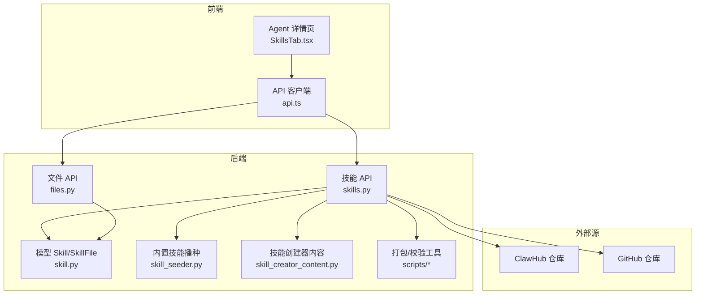
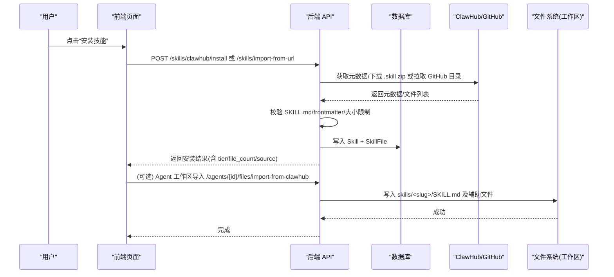
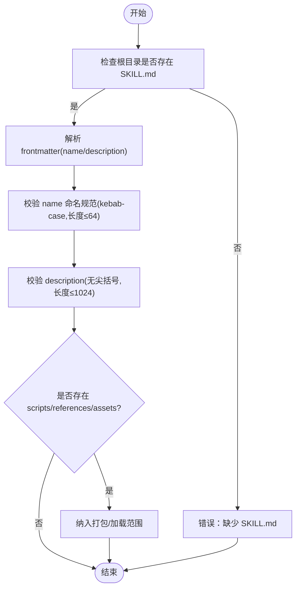
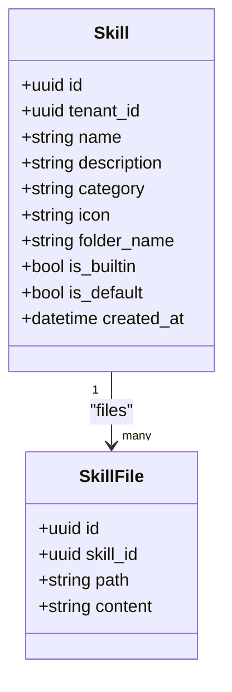
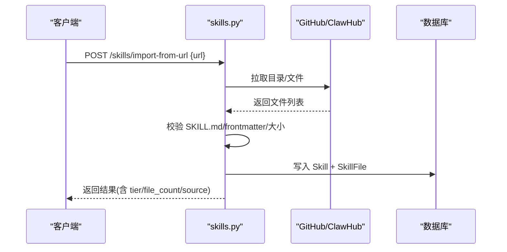
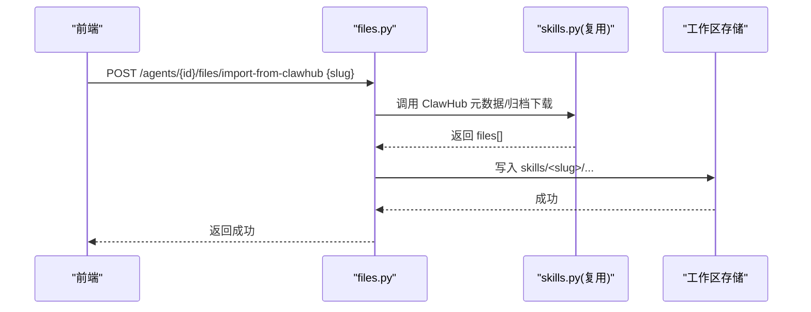
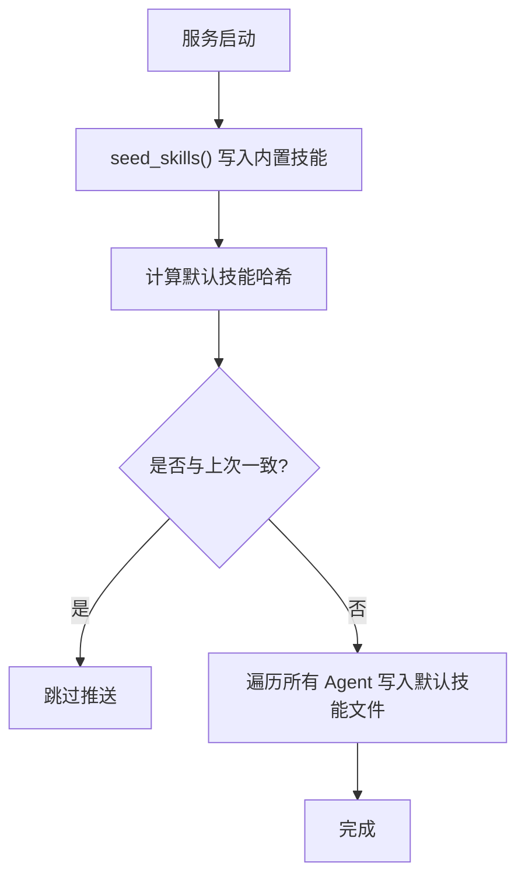
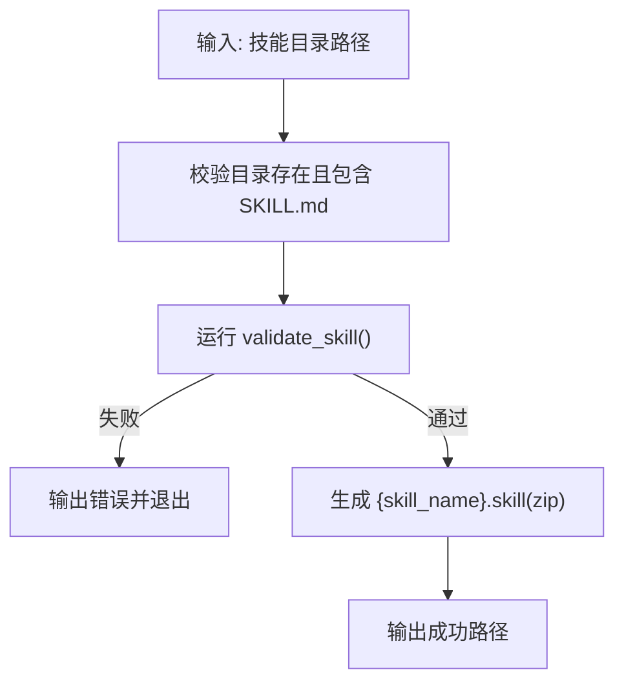
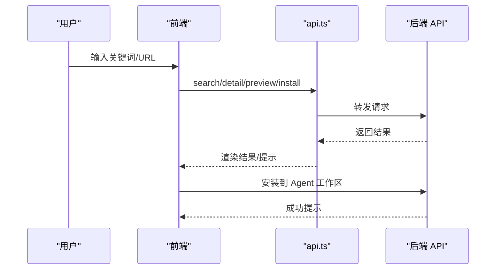
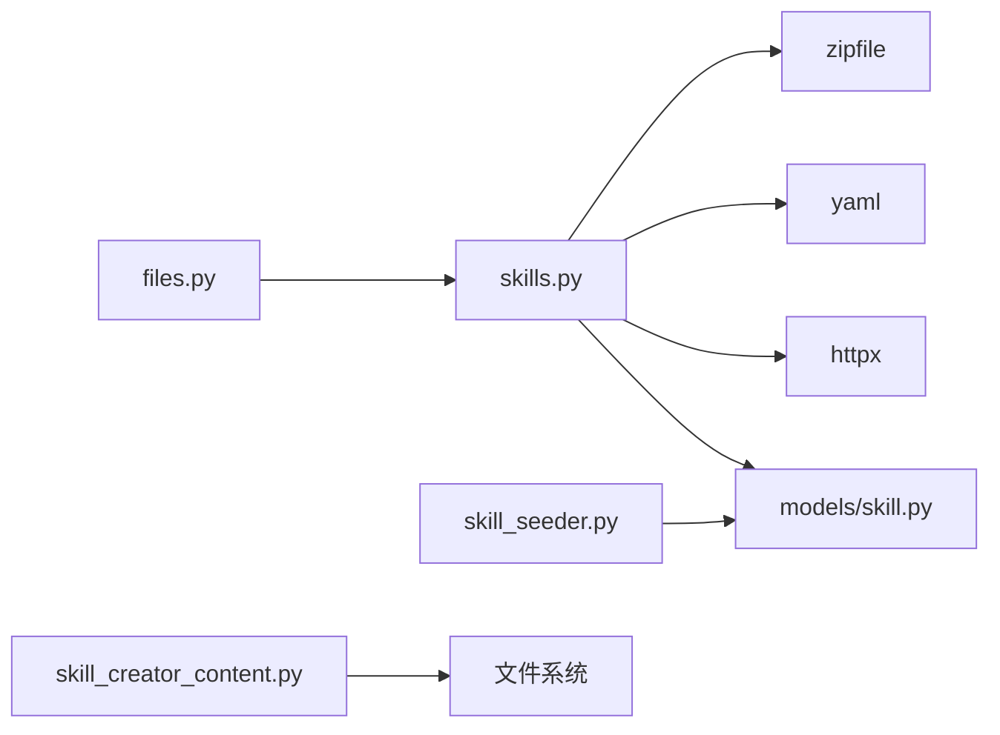

# 技能包开发

<cite>
**本文引用的文件**   
- [skills-lock.json](file://skills-lock.json)
- [backend/app/models/skill.py](file://backend/app/models/skill.py)
- [backend/app/api/skills.py](file://backend/app/api/skills.py)
- [backend/app/api/files.py](file://backend/app/api/files.py)
- [backend/app/services/skill_seeder.py](file://backend/app/services/skill_seeder.py)
- [backend/app/services/skill_creator_content.py](file://backend/app/services/skill_creator_content.py)
- [backend/app/services/skill_creator_files/scripts__package_skill.py](file://backend/app/services/skill_creator_files/scripts__package_skill.py)
- [backend/app/services/skill_creator_files/scripts__quick_validate.py](file://backend/app/services/skill_creator_files/scripts__quick_validate.py)
- [backend/app/services/skill_creator_files/scripts__utils.py](file://backend/app/services/skill_creator_files/scripts__utils.py)
- [backend/agent_template/skills/mcp-installer/SKILL.md](file://backend/agent_template/skills/mcp-installer/SKILL.md)
- [frontend/src/pages/agent-detail/AgentDetailPage.tsx](file://frontend/src/pages/agent-detail/AgentDetailPage.tsx)
- [frontend/src/pages/agent-detail/tabs/SkillsTab.tsx](file://frontend/src/pages/agent-detail/tabs/SkillsTab.tsx)
- [frontend/src/services/api.ts](file://frontend/src/services/api.ts)
</cite>

## 目录
1. [简介](#简介)
2. [项目结构](#项目结构)
3. [核心组件](#核心组件)
4. [架构总览](#架构总览)
5. [详细组件分析](#详细组件分析)
6. [依赖关系分析](#依赖关系分析)
7. [性能考虑](#性能考虑)
8. [故障排查指南](#故障排查指南)
9. [结论](#结论)
10. [附录](#附录)

## 简介
本指南面向在 Clawith 平台开发与发布“技能包”的工程师与内容创作者。内容涵盖：
- 技能包结构与规范（SKILL.md、脚本组织、资源管理）
- 技能的注册机制、版本控制、依赖解析
- 完整的开发示例（Python 脚本、Shell 命令封装、外部 API 调用）
- 打包发布流程、命名规范、元数据定义等工程化要求
- 测试方法、调试技巧、性能优化与最佳实践

## 项目结构
Clawith 的技能体系由后端模型、API、种子服务、前端界面以及工具脚本共同构成。关键路径如下：
- 模型层：Skill、SkillFile 持久化
- API 层：全局技能注册表 CRUD、ClawHub 集成、URL/GitHub 导入、Agent 工作区导入
- 服务层：内置技能播种、技能创建器内容加载、打包与校验工具
- 前端：Agent 详情页内技能浏览与安装、企业级设置页技能安装与预览
- 模板与示例：mcp-installer 技能示例，展示 MCP 工具安装流程

**图表来源** 
- [backend/app/api/skills.py:1-593](file://backend/app/api/skills.py#L1-L593)
- [backend/app/api/files.py:1068-1110](file://backend/app/api/files.py#L1068-L1110)
- [backend/app/models/skill.py:1-43](file://backend/app/models/skill.py#L1-L43)
- [backend/app/services/skill_seeder.py:951-1083](file://backend/app/services/skill_seeder.py#L951-L1083)
- [backend/app/services/skill_creator_content.py:1-33](file://backend/app/services/skill_creator_content.py#L1-L33)
- [frontend/src/pages/agent-detail/tabs/SkillsTab.tsx:131-191](file://frontend/src/pages/agent-detail/tabs/SkillsTab.tsx#L131-L191)
- [frontend/src/services/api.ts:490-512](file://frontend/src/services/api.ts#L490-L512)

**章节来源**
- [backend/app/models/skill.py:1-43](file://backend/app/models/skill.py#L1-L43)
- [backend/app/api/skills.py:1-593](file://backend/app/api/skills.py#L1-L593)
- [backend/app/api/files.py:1068-1110](file://backend/app/api/files.py#L1068-L1110)
- [backend/app/services/skill_seeder.py:951-1083](file://backend/app/services/skill_seeder.py#L951-L1083)
- [backend/app/services/skill_creator_content.py:1-33](file://backend/app/services/skill_creator_content.py#L1-L33)
- [frontend/src/pages/agent-detail/tabs/SkillsTab.tsx:131-191](file://frontend/src/pages/agent-detail/tabs/SkillsTab.tsx#L131-L191)
- [frontend/src/services/api.ts:490-512](file://frontend/src/services/api.ts#L490-L512)

## 核心组件
- 模型与存储
  - Skill：全局技能定义（名称、描述、分类、图标、文件夹名、是否内置/默认、租户隔离）
  - SkillFile：技能包内的文件集合（路径+内容），支持 SKILL.md 与辅助脚本/参考文档
- API 接口
  - 全局技能注册表 CRUD（创建/更新/删除）
  - ClawHub 搜索、详情、安装（下载 .skill zip，解析并入库）
  - URL/GitHub 导入（递归拉取目录，强制根目录存在 SKILL.md）
  - Agent 工作区导入（将 ClawHub 或 URL 的技能写入 agent 的 skills/ 目录）
- 服务与工具
  - 内置技能播种（seed_skills）：启动时注入内置技能与默认技能到数据库
  - 技能创建器内容加载：运行时动态提供 skill-creator 相关辅助文件
  - 打包与校验：.skill 打包为 zip；快速校验 SKILL.md frontmatter 与命名规范
- 前端交互
  - Agent 详情页内浏览 ClawHub 并一键安装至当前 Agent 的工作区
  - 企业设置页中搜索、预览与安装 ClawHub 技能
  - 新建技能时自动生成 SKILL.md 模板

**章节来源**
- [backend/app/models/skill.py:1-43](file://backend/app/models/skill.py#L1-L43)
- [backend/app/api/skills.py:1-593](file://backend/app/api/skills.py#L1-L593)
- [backend/app/api/files.py:1068-1110](file://backend/app/api/files.py#L1068-L1110)
- [backend/app/services/skill_seeder.py:951-1083](file://backend/app/services/skill_seeder.py#L951-L1083)
- [backend/app/services/skill_creator_content.py:1-33](file://backend/app/services/skill_creator_content.py#L1-L33)
- [frontend/src/pages/agent-detail/tabs/SkillsTab.tsx:131-191](file://frontend/src/pages/agent-detail/tabs/SkillsTab.tsx#L131-L191)
- [frontend/src/services/api.ts:490-512](file://frontend/src/services/api.ts#L490-L512)

## 架构总览
下图展示了从用户操作到技能落库/落盘的完整链路，包括 ClawHub/GitHub 源拉取、校验、入库与 Agent 工作区写入。

**图表来源** 
- [backend/app/api/skills.py:503-576](file://backend/app/api/skills.py#L503-L576)
- [backend/app/api/skills.py:579-624](file://backend/app/api/skills.py#L579-L624)
- [backend/app/api/files.py:1075-1110](file://backend/app/api/files.py#L1075-L1110)
- [frontend/src/pages/agent-detail/tabs/SkillsTab.tsx:174-191](file://frontend/src/pages/agent-detail/tabs/SkillsTab.tsx#L174-L191)
- [frontend/src/services/api.ts:490-512](file://frontend/src/services/api.ts#L490-L512)

## 详细组件分析

### 技能包结构与规范
- 必需文件
  - SKILL.md：位于技能根目录，包含 YAML frontmatter（name、description 必填）与 Markdown 指令
- 可选资源目录
  - scripts/：可执行代码（Python/Shell），用于确定性/重复性任务
  - references/：按需加载的参考文档
  - assets/：输出所需的模板、图标、字体等
- 渐进式加载策略
  - 元数据（name/description）始终进入上下文
  - SKILL.md 正文在触发时进入上下文（建议 <500 行）
  - 捆绑资源按需加载（脚本可直接执行无需先加载）

**图表来源** 
- [backend/app/services/skill_creator_files/scripts__quick_validate.py:14-96](file://backend/app/services/skill_creator_files/scripts__quick_validate.py#L14-L96)
- [backend/app/services/skill_creator_content.py:93-125](file://backend/app/services/skill_creator_content.py#L93-L125)

**章节来源**
- [backend/app/services/skill_creator_content.py:93-125](file://backend/app/services/skill_creator_content.py#L93-L125)
- [backend/app/services/skill_creator_files/scripts__quick_validate.py:14-96](file://backend/app/services/skill_creator_files/scripts__quick_validate.py#L14-L96)

### 技能注册与数据库模型
- Skill 字段：id、tenant_id、name、description、category、icon、folder_name、is_builtin、is_default、created_at
- SkillFile 字段：id、skill_id、path、content
- 关系：Skill 一对多 SkillFile，级联删除

**图表来源** 
- [backend/app/models/skill.py:13-43](file://backend/app/models/skill.py#L13-L43)

**章节来源**
- [backend/app/models/skill.py:1-43](file://backend/app/models/skill.py#L1-L43)

### 技能注册 API（全局注册表）
- 能力
  - 创建/更新/删除技能（含文件列表）
  - ClawHub 搜索、详情、安装（下载 zip，解析文件，入库）
  - URL/GitHub 导入（递归拉取目录，强制根目录存在 SKILL.md，大小限制 500KB）
  - 权限控制（平台管理员/租户管理员）
- 关键逻辑
  - classify_portability：根据关键字判断技能可移植等级（纯提示词/CLI/API/原生）
  - _parse_skill_md_frontmatter：提取 YAML frontmatter
  - _save_skill_to_db：写入 Skill 与 SkillFile，处理空字节与冲突检测

**图表来源** 
- [backend/app/api/skills.py:579-624](file://backend/app/api/skills.py#L579-L624)
- [backend/app/api/skills.py:291-300](file://backend/app/api/skills.py#L291-L300)
- [backend/app/api/skills.py:271-288](file://backend/app/api/skills.py#L271-L288)

**章节来源**
- [backend/app/api/skills.py:1-593](file://backend/app/api/skills.py#L1-L593)

### Agent 工作区导入（写入 skills/ 目录）
- 入口
  - /agents/{agentId}/files/import-from-clawhub：按 slug 下载 ClawHub 归档并写入工作区
  - /agents/{agentId}/files/import-from-url：按 URL 拉取并写入工作区
- 行为
  - 目标路径：skills/<slug>/SKILL.md 及辅助文件
  - 权限：需具备 Agent 访问权限

**图表来源** 
- [backend/app/api/files.py:1075-1110](file://backend/app/api/files.py#L1075-L1110)
- [backend/app/api/skills.py:503-576](file://backend/app/api/skills.py#L503-L576)

**章节来源**
- [backend/app/api/files.py:1068-1110](file://backend/app/api/files.py#L1068-L1110)
- [backend/app/api/skills.py:503-576](file://backend/app/api/skills.py#L503-L576)

### 内置技能播种与默认技能推送
- seed_skills：启动时将内置技能（含 skill-creator、content-research-writer、mcp-installer 等）写入数据库
- push_default_skills_to_existing_agents：为新加入的默认技能向已有 Agent 工作区推送，避免手动重建

**图表来源** 
- [backend/app/services/skill_seeder.py:951-1083](file://backend/app/services/skill_seeder.py#L951-L1083)

**章节来源**
- [backend/app/services/skill_seeder.py:951-1083](file://backend/app/services/skill_seeder.py#L951-L1083)

### 技能打包与校验工具
- package_skill.py：将技能目录打包为 .skill（zip），排除构建产物与敏感目录
- quick_validate.py：最小化校验 SKILL.md frontmatter、命名规范、长度限制
- utils.py：解析 SKILL.md frontmatter（name/description）

**图表来源** 
- [backend/app/services/skill_creator_files/scripts__package_skill.py:44-110](file://backend/app/services/skill_creator_files/scripts__package_skill.py#L44-L110)
- [backend/app/services/skill_creator_files/scripts__quick_validate.py:14-96](file://backend/app/services/skill_creator_files/scripts__quick_validate.py#L14-L96)
- [backend/app/services/skill_creator_files/scripts__utils.py:7-47](file://backend/app/services/skill_creator_files/scripts__utils.py#L7-L47)

**章节来源**
- [backend/app/services/skill_creator_files/scripts__package_skill.py:1-139](file://backend/app/services/skill_creator_files/scripts__package_skill.py#L1-L139)
- [backend/app/services/skill_creator_files/scripts__quick_validate.py:1-108](file://backend/app/services/skill_creator_files/scripts__quick_validate.py#L1-L108)
- [backend/app/services/skill_creator_files/scripts__utils.py:1-48](file://backend/app/services/skill_creator_files/scripts__utils.py#L1-L48)

### 前端技能安装与预览
- Agent 详情页：浏览 ClawHub，一键安装至当前 Agent 的 skills/ 目录
- 企业设置页：搜索、预览、安装 ClawHub 技能
- API 客户端：封装 ClawHub 搜索/详情/安装、URL 预览/导入、租户 Token 配置

**图表来源** 
- [frontend/src/pages/agent-detail/tabs/SkillsTab.tsx:131-191](file://frontend/src/pages/agent-detail/tabs/SkillsTab.tsx#L131-L191)
- [frontend/src/services/api.ts:490-512](file://frontend/src/services/api.ts#L490-L512)

**章节来源**
- [frontend/src/pages/agent-detail/tabs/SkillsTab.tsx:131-191](file://frontend/src/pages/agent-detail/tabs/SkillsTab.tsx#L131-L191)
- [frontend/src/services/api.ts:490-512](file://frontend/src/services/api.ts#L490-L512)

### 示例技能：MCP 工具安装器
- 用途：帮助用户从 MCP 注册表或直接 URL 导入新工具
- 流程要点：优先尝试 Smithery 导入；若不可用则使用直接 URL；OAuth 授权在“工具”页面完成，不在聊天中索取密钥

**章节来源**
- [backend/agent_template/skills/mcp-installer/SKILL.md:1-111](file://backend/agent_template/skills/mcp-installer/SKILL.md#L1-L111)

## 依赖关系分析
- 模块耦合
  - skills.py 依赖 models.skill、security、httpx、yaml、zipfile
  - files.py 复用 skills.py 的 ClawHub/GitHub 拉取逻辑
  - skill_seeder.py 依赖 models.skill 与系统设置
  - skill_creator_content.py 提供 skill-creator 辅助文件映射
- 外部依赖
  - ClawHub API（主站/镜像）
  - GitHub API（限流保护）
- 潜在循环依赖
  - skills.py 与 files.py 通过函数复用而非 import 循环，保持低耦合

**图表来源** 
- [backend/app/api/skills.py:1-29](file://backend/app/api/skills.py#L1-L29)
- [backend/app/api/files.py:1068-1110](file://backend/app/api/files.py#L1068-L1110)
- [backend/app/models/skill.py:1-43](file://backend/app/models/skill.py#L1-L43)
- [backend/app/services/skill_seeder.py:951-1083](file://backend/app/services/skill_seeder.py#L951-L1083)
- [backend/app/services/skill_creator_content.py:1-33](file://backend/app/services/skill_creator_content.py#L1-L33)

**章节来源**
- [backend/app/api/skills.py:1-29](file://backend/app/api/skills.py#L1-L29)
- [backend/app/api/files.py:1068-1110](file://backend/app/api/files.py#L1068-L1110)
- [backend/app/models/skill.py:1-43](file://backend/app/models/skill.py#L1-L43)
- [backend/app/services/skill_seeder.py:951-1083](file://backend/app/services/skill_seeder.py#L951-L1083)
- [backend/app/services/skill_creator_content.py:1-33](file://backend/app/services/skill_creator_content.py#L1-L33)

## 性能考虑
- 大小限制：单技能包最大 500KB，防止过大归档影响网络与解析
- 递归深度限制：GitHub 目录拉取最大深度 3，避免无限递归
- 速率限制：ClawHub/GitHub 限流重试与友好提示
- 渐进式加载：仅加载必要元数据与正文，资源按需读取
- 临时工作区：Agent 工具在执行时按需物化所需路径，减少 I/O 开销

[本节为通用指导，不直接分析具体文件]

## 故障排查指南
- 常见错误
  - 缺少 SKILL.md：确保技能根目录存在 SKILL.md
  - frontmatter 格式错误：YAML 必须合法，name/description 必填
  - 命名不规范：name 应为 kebab-case，长度 ≤64，不能以连字符开头/结尾或连续连字符
  - 描述过长：description 长度 ≤1024，禁止尖括号
  - 超过大小限制：技能包总大小 ≤500KB
  - GitHub 限流：稍后重试或配置 Token
  - ClawHub 限流：等待后重试或切换镜像
- 定位方法
  - 使用 quick_validate.py 本地校验
  - 查看后端日志（loguru）确认错误位置
  - 前端 Toast/Dialog 提示错误信息

**章节来源**
- [backend/app/services/skill_creator_files/scripts__quick_validate.py:14-96](file://backend/app/services/skill_creator_files/scripts__quick_validate.py#L14-L96)
- [backend/app/api/skills.py:145-153](file://backend/app/api/skills.py#L145-L153)
- [backend/app/api/skills.py:376-390](file://backend/app/api/skills.py#L376-L390)

## 结论
Clawith 的技能体系以 SKILL.md 为核心，结合脚本与资源目录形成模块化、可扩展的能力单元。平台提供从源码/归档导入、校验入库、Agent 工作区部署的全链路能力，并通过内置技能播种与默认技能推送保障一致性。遵循命名与 frontmatter 规范、合理使用脚本与资源、关注大小与限流限制，可高效开发与发布高质量技能包。

[本节为总结性内容，不直接分析具体文件]

## 附录

### 技能包开发示例（步骤指引）
- 创建技能目录与 SKILL.md
  - 在任意目录创建 my-skill/，并在根目录编写 SKILL.md，包含 name/description 与使用说明
- 编写脚本与资源
  - 在 scripts/ 下编写 Python/Shell 脚本，实现确定性任务
  - 在 references/ 与 assets/ 放置参考文档与资源文件
- 本地校验与打包
  - 使用 quick_validate.py 进行基础校验
  - 使用 package_skill.py 打包为 .skill（zip）
- 发布与安装
  - 通过 ClawHub 发布或使用 URL/GitHub 导入
  - 在企业设置页或 Agent 详情页安装到工作区

**章节来源**
- [backend/app/services/skill_creator_files/scripts__quick_validate.py:1-108](file://backend/app/services/skill_creator_files/scripts__quick_validate.py#L1-L108)
- [backend/app/services/skill_creator_files/scripts__package_skill.py:1-139](file://backend/app/services/skill_creator_files/scripts__package_skill.py#L1-L139)
- [frontend/src/pages/agent-detail/AgentDetailPage.tsx:7489-7506](file://frontend/src/pages/agent-detail/AgentDetailPage.tsx#L7489-L7506)

### 版本控制与锁定
- skills-lock.json：记录已安装技能的来源、类型、路径与计算哈希，便于复现与审计

**章节来源**
- [skills-lock.json:1-12](file://skills-lock.json#L1-L12)