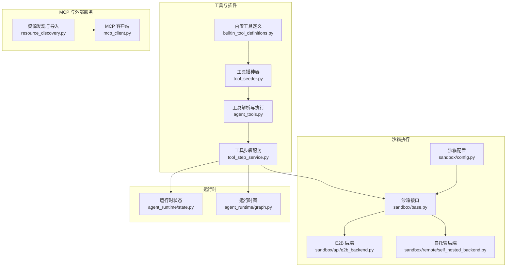
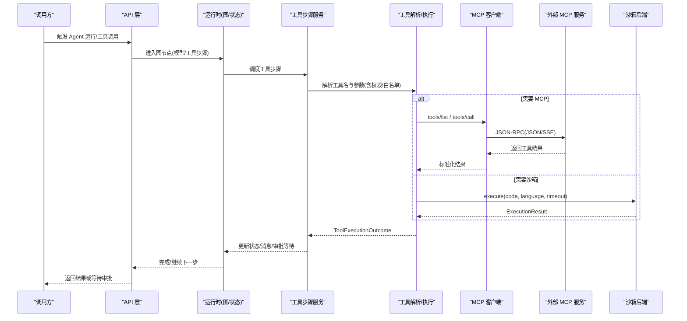
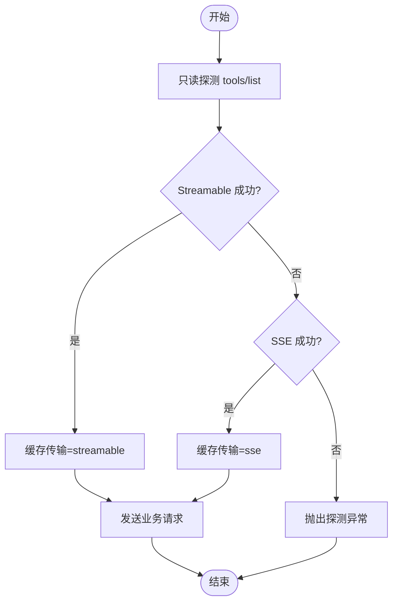
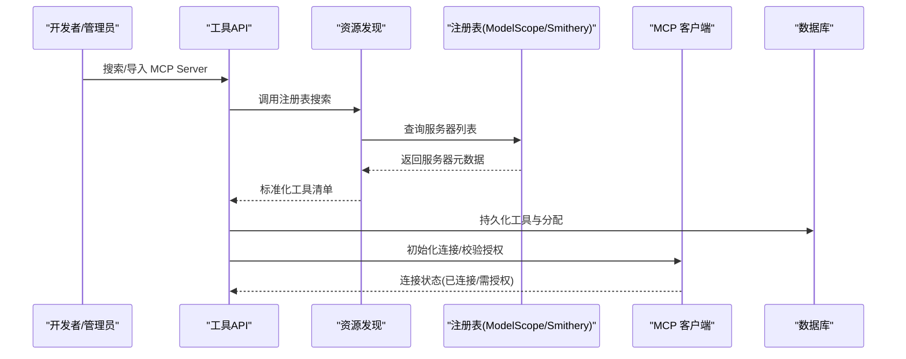
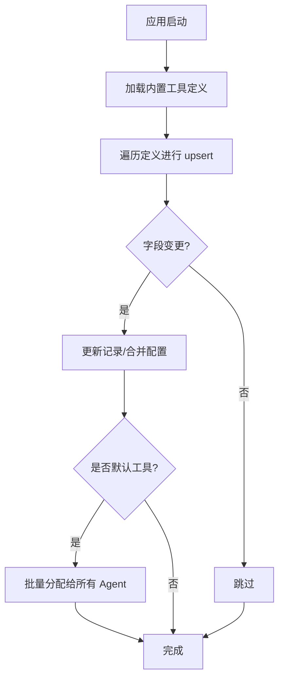
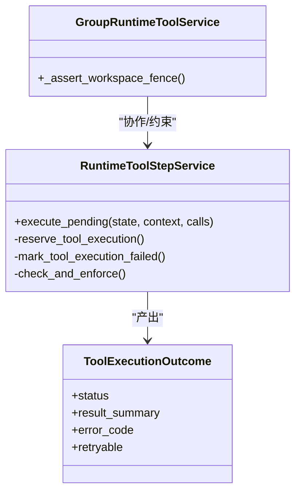
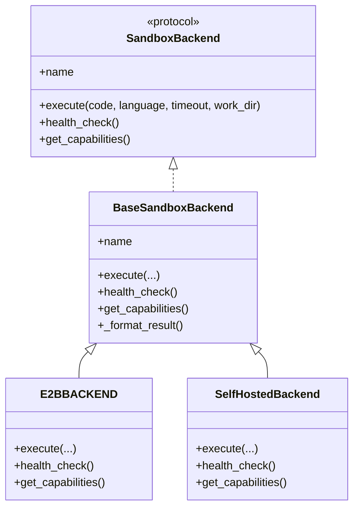
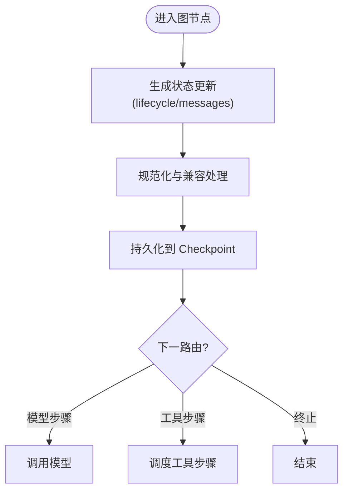
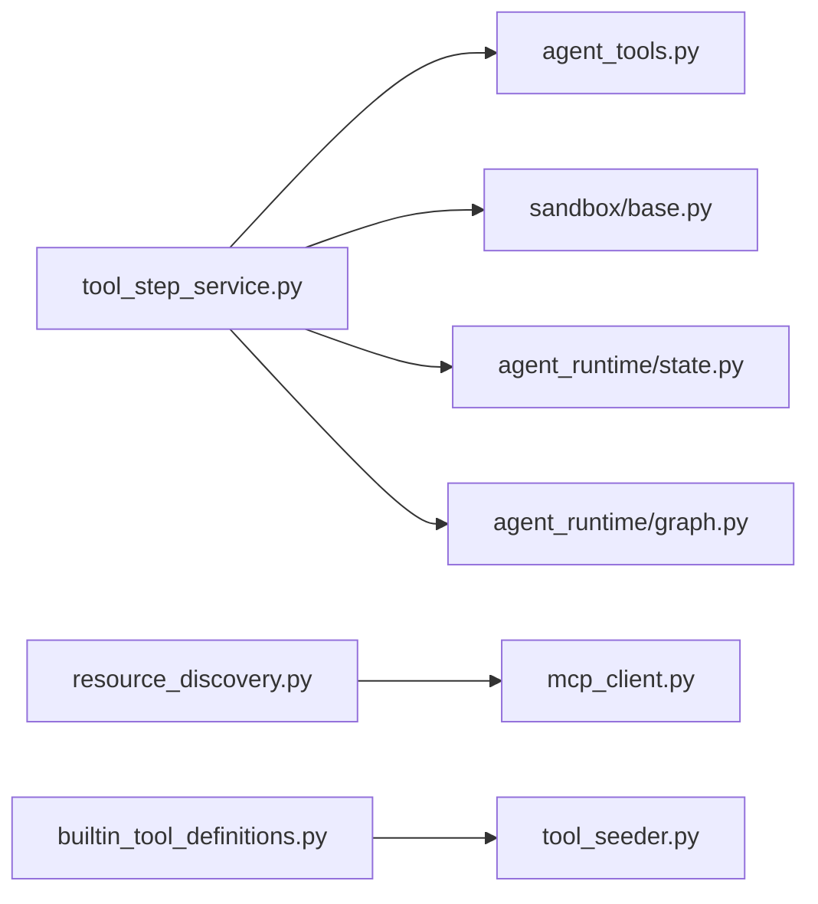

# 插件系统

<cite>
**本文引用的文件**   
- [mcp_client.py](file://backend/app/services/mcp_client.py)
- [resource_discovery.py](file://backend/app/services/resource_discovery.py)
- [builtin_tool_definitions.py](file://backend/app/services/builtin_tool_definitions.py)
- [tool_seeder.py](file://backend/app/services/tool_seeder.py)
- [agent_tools.py](file://backend/app/services/agent_tools.py)
- [sandbox/base.py](file://backend/app/services/sandbox/base.py)
- [sandbox/api/e2b_backend.py](file://backend/app/services/sandbox/api/e2b_backend.py)
- [sandbox/remote/self_hosted_backend.py](file://backend/app/services/sandbox/remote/self_hosted_backend.py)
- [sandbox/config.py](file://backend/app/services/sandbox/config.py)
- [tool_step_service.py](file://backend/app/services/agent_runtime/tool_step_service.py)
- [group_runtime_tools.py](file://backend/app/services/agent_runtime/group_runtime_tools.py)
- [state.py](file://backend/app/services/agent_runtime/state.py)
- [graph.py](file://backend/app/services/agent_runtime/graph.py)
- [test_mcp_oauth_authorization.py](file://backend/tests/test_mcp_oauth_authorization.py)
- [test_builtin_tool_contracts.py](file://backend/tests/test_builtin_tool_contracts.py)
- [agents.py](file://backend/app/api/agents.py)
</cite>

## 目录
1. [简介](#简介)
2. [项目结构](#项目结构)
3. [核心组件](#核心组件)
4. [架构总览](#架构总览)
5. [详细组件分析](#详细组件分析)
6. [依赖关系分析](#依赖关系分析)
7. [性能考量](#性能考量)
8. [故障排查指南](#故障排查指南)
9. [结论](#结论)
10. [附录](#附录)

## 简介
本指南面向在 Clawith 平台上开发“插件”（工具、MCP 服务器集成、外部服务对接）的工程师与产品团队。内容覆盖：
- MCP（Model Context Protocol）客户端集成与传输自动探测
- 外部服务发现与导入（Smithery/ModelScope）
- 插件（工具）注册、动态加载与生命周期管理
- 代码执行沙箱隔离与安全策略
- 权限控制、资源隔离与企业级安全
- 测试框架、调试与性能监控方法

## 项目结构
Clawith 后端以 services 层为核心，围绕“工具（Tool）—运行时（Runtime）—沙箱（Sandbox）—MCP 客户端”四大主题组织。关键路径如下：
- 工具定义与播种：builtin_tool_definitions.py、tool_seeder.py
- 工具解析与执行：agent_tools.py、tool_step_service.py
- MCP 客户端与资源发现：mcp_client.py、resource_discovery.py
- 代码执行沙箱：sandbox/*（base、e2b、self_hosted、config）
- 运行时状态与图编排：agent_runtime/state.py、agent_runtime/graph.py
- API 入口与模板预安装：api/agents.py

**图表来源** 
- [builtin_tool_definitions.py](file://backend/app/services/builtin_tool_definitions.py)
- [tool_seeder.py](file://backend/app/services/tool_seeder.py)
- [agent_tools.py](file://backend/app/services/agent_tools.py)
- [tool_step_service.py](file://backend/app/services/agent_runtime/tool_step_service.py)
- [mcp_client.py](file://backend/app/services/mcp_client.py)
- [resource_discovery.py](file://backend/app/services/resource_discovery.py)
- [sandbox/base.py](file://backend/app/services/sandbox/base.py)
- [sandbox/api/e2b_backend.py](file://backend/app/services/sandbox/api/e2b_backend.py)
- [sandbox/remote/self_hosted_backend.py](file://backend/app/services/sandbox/remote/self_hosted_backend.py)
- [sandbox/config.py](file://backend/app/services/sandbox/config.py)
- [agent_runtime/state.py](file://backend/app/services/agent_runtime/state.py)
- [agent_runtime/graph.py](file://backend/app/services/agent_runtime/graph.py)

**章节来源**
- [builtin_tool_definitions.py](file://backend/app/services/builtin_tool_definitions.py)
- [tool_seeder.py](file://backend/app/services/tool_seeder.py)
- [agent_tools.py](file://backend/app/services/agent_tools.py)
- [mcp_client.py](file://backend/app/services/mcp_client.py)
- [resource_discovery.py](file://backend/app/services/resource_discovery.py)
- [sandbox/base.py](file://backend/app/services/sandbox/base.py)
- [sandbox/api/e2b_backend.py](file://backend/app/services/sandbox/api/e2b_backend.py)
- [sandbox/remote/self_hosted_backend.py](file://backend/app/services/sandbox/remote/self_hosted_backend.py)
- [sandbox/config.py](file://backend/app/services/sandbox/config.py)
- [agent_runtime/state.py](file://backend/app/services/agent_runtime/state.py)
- [agent_runtime/graph.py](file://backend/app/services/agent_runtime/graph.py)

## 核心组件
- MCP 客户端（mcp_client.py）
  - 支持 Streamable HTTP 与 SSE 两种传输模式，首次请求自动探测并缓存选择结果
  - 统一 JSON-RPC 封装，处理会话 ID、鉴权头、错误响应与文本/内容块适配
- 资源发现与导入（resource_discovery.py）
  - 通过 Smithery/ModelScope 等注册表搜索与导入 MCP Server
  - 将远程工具清单标准化为平台内部工具描述
- 内置工具与播种（builtin_tool_definitions.py、tool_seeder.py）
  - 集中声明工具元数据、参数 Schema、默认配置与可见性策略
  - 启动时同步至数据库，维护 is_default、config_schema 与历史兼容
- 工具解析与执行（agent_tools.py、tool_step_service.py）
  - 工具名到实现的映射、敏感字段加解密、工作区路径白名单
  - 执行前审批流（L3）、租约与栅栏、失败重试与结果对账
- 沙箱执行（sandbox/*）
  - 抽象 SandboxBackend 协议，提供 E2B、CodeSandbox、自托管等多种后端
  - 能力探测、健康检查、超时/内存限制、网络与文件系统开关
- 运行时状态与图（agent_runtime/state.py、graph.py）
  - 持久化生命周期、消息历史、待处理工具调用与恢复点

**章节来源**
- [mcp_client.py](file://backend/app/services/mcp_client.py)
- [resource_discovery.py](file://backend/app/services/resource_discovery.py)
- [builtin_tool_definitions.py](file://backend/app/services/builtin_tool_definitions.py)
- [tool_seeder.py](file://backend/app/services/tool_seeder.py)
- [agent_tools.py](file://backend/app/services/agent_tools.py)
- [tool_step_service.py](file://backend/app/services/agent_runtime/tool_step_service.py)
- [sandbox/base.py](file://backend/app/services/sandbox/base.py)
- [sandbox/api/e2b_backend.py](file://backend/app/services/sandbox/api/e2b_backend.py)
- [sandbox/remote/self_hosted_backend.py](file://backend/app/services/sandbox/remote/self_hosted_backend.py)
- [sandbox/config.py](file://backend/app/services/sandbox/config.py)
- [agent_runtime/state.py](file://backend/app/services/agent_runtime/state.py)
- [agent_runtime/graph.py](file://backend/app/services/agent_runtime/graph.py)

## 架构总览
下图展示从“用户/Agent 发起工具调用”到“MCP 外部工具或沙箱执行”的端到端流程，以及权限、审计与状态落盘的关键节点。

**图表来源** 
- [tool_step_service.py](file://backend/app/services/agent_runtime/tool_step_service.py)
- [agent_tools.py](file://backend/app/services/agent_tools.py)
- [mcp_client.py](file://backend/app/services/mcp_client.py)
- [sandbox/base.py](file://backend/app/services/sandbox/base.py)
- [agent_runtime/state.py](file://backend/app/services/agent_runtime/state.py)
- [agent_runtime/graph.py](file://backend/app/services/agent_runtime/graph.py)

## 详细组件分析

### MCP 客户端与传输自动探测
- 设计要点
  - 首次请求使用只读探测（tools/list）决定采用 Streamable HTTP 还是 SSE
  - 自动提取并清理 URL 中的 apiKey，统一走 Authorization: Bearer
  - 解析 SSE 事件流，匹配 request id 获取最终结果
- 异常与回退
  - 任一传输失败记录日志并尝试另一传输；均失败抛出探测异常
  - 业务调用不跨传输重放，避免重复副作用

**图表来源** 
- [mcp_client.py](file://backend/app/services/mcp_client.py)

**章节来源**
- [mcp_client.py](file://backend/app/services/mcp_client.py)

### 资源发现与 MCP 服务器导入
- 功能概览
  - 通过 ModelScope/Smithery 搜索 MCP Server，标准化返回为平台工具清单
  - 支持模板预安装（创建 Agent 时后台异步导入）
  - 连接状态查询与授权流程（OAuth/ApiKey），敏感信息不落库
- 典型流程
  - 搜索注册表 → 选择 Server → 导入工具 → 建立连接 → 校验授权状态

**图表来源** 
- [resource_discovery.py](file://backend/app/services/resource_discovery.py)
- [agents.py](file://backend/app/api/agents.py)

**章节来源**
- [resource_discovery.py](file://backend/app/services/resource_discovery.py)
- [agents.py](file://backend/app/api/agents.py)

### 内置工具与播种机制
- 设计要点
  - 单一数据源声明工具元数据（名称、描述、Schema、图标、分类、默认启用等）
  - 启动时播种器对比现有记录，增量更新字段、合并配置、修复历史迁移
  - 自动为新默认工具批量分配给已有 Agent
- 扩展建议
  - 新增工具只需在定义中追加条目，无需改动执行逻辑

**图表来源** 
- [builtin_tool_definitions.py](file://backend/app/services/builtin_tool_definitions.py)
- [tool_seeder.py](file://backend/app/services/tool_seeder.py)

**章节来源**
- [builtin_tool_definitions.py](file://backend/app/services/builtin_tool_definitions.py)
- [tool_seeder.py](file://backend/app/services/tool_seeder.py)

### 工具解析与执行（含权限与审批）
- 关键点
  - 工具名到实现映射、参数清洗与敏感字段脱敏
  - 工作区路径白名单与读写边界控制
  - L3 级别操作需人工审批，未批准则挂起等待
  - 执行租约与栅栏保证并发安全，失败可重试并对账
- 组场景
  - GroupRuntimeToolService 基于不可变快照执行，确保一致性

**图表来源** 
- [tool_step_service.py](file://backend/app/services/agent_runtime/tool_step_service.py)
- [group_runtime_tools.py](file://backend/app/services/agent_runtime/group_runtime_tools.py)

**章节来源**
- [tool_step_service.py](file://backend/app/services/agent_runtime/tool_step_service.py)
- [group_runtime_tools.py](file://backend/app/services/agent_runtime/group_runtime_tools.py)

### 代码执行沙箱（隔离与安全）
- 抽象接口
  - SandboxBackend 协议定义 name、execute、health_check、get_capabilities
- 后端实现
  - E2B：云沙箱，支持多语言、网络/文件系统开关、健康检查
  - CodeSandbox：云端执行环境
  - 自托管后端：通过 HTTP 暴露的沙箱服务
- 配置与安全
  - 支持代理、超时、内存/CPU 限制、bwrap 缺失时的安全降级开关
  - 敏感配置加密存储与解密回退

**图表来源** 
- [sandbox/base.py](file://backend/app/services/sandbox/base.py)
- [sandbox/api/e2b_backend.py](file://backend/app/services/sandbox/api/e2b_backend.py)
- [sandbox/remote/self_hosted_backend.py](file://backend/app/services/sandbox/remote/self_hosted_backend.py)
- [sandbox/config.py](file://backend/app/services/sandbox/config.py)

**章节来源**
- [sandbox/base.py](file://backend/app/services/sandbox/base.py)
- [sandbox/api/e2b_backend.py](file://backend/app/services/sandbox/api/e2b_backend.py)
- [sandbox/remote/self_hosted_backend.py](file://backend/app/services/sandbox/remote/self_hosted_backend.py)
- [sandbox/config.py](file://backend/app/services/sandbox/config.py)

### 运行时状态与图编排
- 状态结构
  - RuntimeLifecycle 包含 status、next_route、pending_tool_calls、verification_result 等
  - 图状态 reducer 保障消息历史与生命周期一致性
- 迁移与兼容性
  - 清理旧字段、保留必要元数据，确保 checkpoint 向前兼容

**图表来源** 
- [agent_runtime/state.py](file://backend/app/services/agent_runtime/state.py)
- [agent_runtime/graph.py](file://backend/app/services/agent_runtime/graph.py)

**章节来源**
- [agent_runtime/state.py](file://backend/app/services/agent_runtime/state.py)
- [agent_runtime/graph.py](file://backend/app/services/agent_runtime/graph.py)

## 依赖关系分析
- 模块耦合
  - tool_step_service 依赖 agent_tools（工具解析）、sandbox（执行）、state/graph（状态）
  - resource_discovery 依赖 mcp_client 与外部注册表 HTTP 接口
  - builtin_tool_definitions 与 tool_seeder 强耦合于数据库 Tool/AgentTool 模型
- 外部依赖
  - httpx（HTTP 客户端）、SQLAlchemy（ORM）、Docker（Agent 容器管理，非插件核心）
- 潜在循环
  - 当前分层清晰，未见直接循环依赖

**图表来源** 
- [tool_step_service.py](file://backend/app/services/agent_runtime/tool_step_service.py)
- [agent_tools.py](file://backend/app/services/agent_tools.py)
- [sandbox/base.py](file://backend/app/services/sandbox/base.py)
- [agent_runtime/state.py](file://backend/app/services/agent_runtime/state.py)
- [agent_runtime/graph.py](file://backend/app/services/agent_runtime/graph.py)
- [resource_discovery.py](file://backend/app/services/resource_discovery.py)
- [mcp_client.py](file://backend/app/services/mcp_client.py)
- [builtin_tool_definitions.py](file://backend/app/services/builtin_tool_definitions.py)
- [tool_seeder.py](file://backend/app/services/tool_seeder.py)

**章节来源**
- [tool_step_service.py](file://backend/app/services/agent_runtime/tool_step_service.py)
- [agent_tools.py](file://backend/app/services/agent_tools.py)
- [sandbox/base.py](file://backend/app/services/sandbox/base.py)
- [agent_runtime/state.py](file://backend/app/services/agent_runtime/state.py)
- [agent_runtime/graph.py](file://backend/app/services/agent_runtime/graph.py)
- [resource_discovery.py](file://backend/app/services/resource_discovery.py)
- [mcp_client.py](file://backend/app/services/mcp_client.py)
- [builtin_tool_definitions.py](file://backend/app/services/builtin_tool_definitions.py)
- [tool_seeder.py](file://backend/app/services/tool_seeder.py)

## 性能考量
- MCP 客户端
  - 传输探测仅一次，后续复用；SSE 每次调用独立连接但避免重复业务请求
  - 合理设置超时（tools/call 更长），减少长尾延迟
- 工具执行
  - 参数清洗与敏感字段脱敏开销低；缓存工具配置（TTL）降低 DB 压力
  - 审批与栅栏避免竞态，提升吞吐稳定性
- 沙箱执行
  - 根据后端能力选择合适超时与内存上限；健康检查前置避免冷启动阻塞
  - 网络/文件系统按需开启，减少不必要 I/O

[本节为通用指导，不直接分析具体文件]

## 故障排查指南
- MCP 授权问题
  - 现象：连接状态为 auth_required，返回授权 URL
  - 排查：确认服务端密钥、命名空间与连接 ID；查看 no-store 响应头与敏感信息脱敏
  - 参考用例：授权状态接口与隐私保护断言
- 工具执行失败
  - 现象：execution_status=failed，error_code 指示原因（如审批拒绝、租约丢失）
  - 排查：查看审批流、栅栏释放情况、重试策略与对账结果
- 沙箱不可用
  - 现象：health_check 失败、执行超时或退出码非零
  - 排查：检查后端 API Key、网络代理、超时与内存限制

**章节来源**
- [test_mcp_oauth_authorization.py](file://backend/tests/test_mcp_oauth_authorization.py)
- [tool_step_service.py](file://backend/app/services/agent_runtime/tool_step_service.py)
- [sandbox/base.py](file://backend/app/services/sandbox/base.py)

## 结论
Clawith 的插件体系以“工具即插件”为核心，结合 MCP 客户端与资源发现，实现了对外部服务的无缝接入；通过沙箱抽象与严格的权限/审批机制，保障了企业级安全与隔离。运行时状态与图编排确保了可恢复性与一致性。建议在新增插件时遵循以下实践：
- 优先通过 MCP 注册表导入，减少手工配置
- 使用内置工具定义与播种机制，保持元数据一致
- 借助沙箱后端隔离执行环境，严格限制资源访问
- 完善测试与监控，覆盖授权、失败与性能场景

[本节为总结性内容，不直接分析具体文件]

## 附录
- 常见插件开发场景示例（路径指引）
  - HTTP API 集成：通过 MCP 客户端调用 tools/call，或使用自定义工具定义后由 agent_tools 执行
    - 参考：[mcp_client.py](file://backend/app/services/mcp_client.py)、[agent_tools.py](file://backend/app/services/agent_tools.py)
  - WebSocket 连接：MCP SSE 传输可作为长连接替代方案；如需原生 WS，可在工具实现中封装
    - 参考：[mcp_client.py](file://backend/app/services/mcp_client.py)
  - 文件操作：使用内置 read_file/write_file/edit_file 等工具，受工作区白名单保护
    - 参考：[builtin_tool_definitions.py](file://backend/app/services/builtin_tool_definitions.py)
  - 代码执行：通过 agentbay_* 工具调用沙箱后端执行脚本
    - 参考：[sandbox/base.py](file://backend/app/services/sandbox/base.py)、[sandbox/api/e2b_backend.py](file://backend/app/services/sandbox/api/e2b_backend.py)
- 测试与调试
  - 单元测试：参考 test_mcp_oauth_authorization.py、test_builtin_tool_contracts.py
  - 调试技巧：启用日志、观察状态流转与审批队列、使用沙箱健康检查接口

**章节来源**
- [mcp_client.py](file://backend/app/services/mcp_client.py)
- [agent_tools.py](file://backend/app/services/agent_tools.py)
- [builtin_tool_definitions.py](file://backend/app/services/builtin_tool_definitions.py)
- [sandbox/base.py](file://backend/app/services/sandbox/base.py)
- [sandbox/api/e2b_backend.py](file://backend/app/services/sandbox/api/e2b_backend.py)
- [test_mcp_oauth_authorization.py](file://backend/tests/test_mcp_oauth_authorization.py)
- [test_builtin_tool_contracts.py](file://backend/tests/test_builtin_tool_contracts.py)