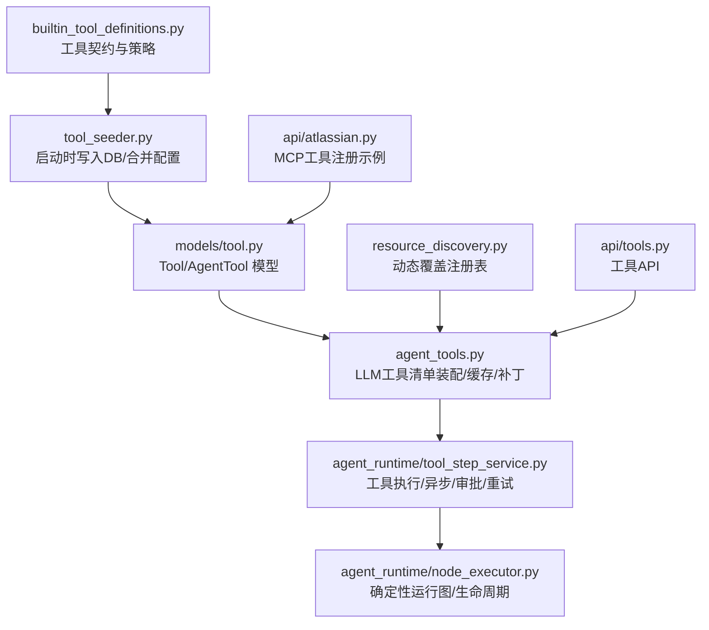
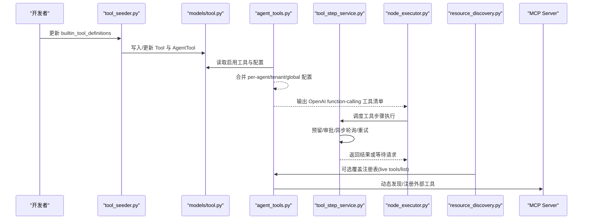
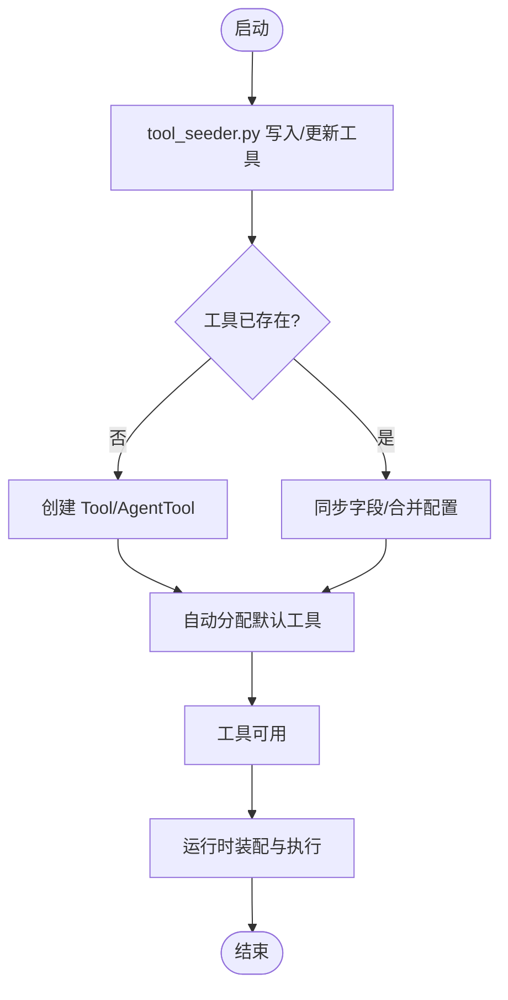
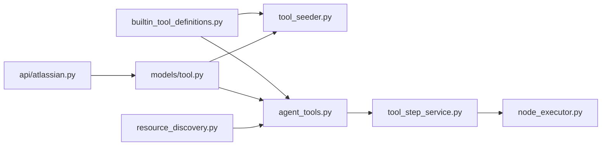

# 自定义工具开发

<cite>
**本文引用的文件**   
- [backend/app/services/builtin_tool_definitions.py](file://backend/app/services/builtin_tool_definitions.py)
- [backend/app/services/tool_seeder.py](file://backend/app/services/tool_seeder.py)
- [backend/app/models/tool.py](file://backend/app/models/tool.py)
- [backend/app/services/agent_tools.py](file://backend/app/services/agent_tools.py)
- [backend/app/services/agent_runtime/tool_step_service.py](file://backend/app/services/agent_runtime/tool_step_service.py)
- [backend/app/services/agent_runtime/node_executor.py](file://backend/app/services/agent_runtime/node_executor.py)
- [backend/app/services/agent_runtime/state.py](file://backend/app/services/agent_runtime/state.py)
- [backend/app/api/tools.py](file://backend/app/api/tools.py)
- [backend/app/api/atlassian.py](file://backend/app/api/atlassian.py)
- [backend/app/services/resource_discovery.py](file://backend/app/services/resource_discovery.py)
- [backend/tests/test_agent_tools_typed_feishu_remaining.py](file://backend/tests/test_agent_tools_typed_feishu_remaining.py)
- [backend/tests/test_human_send_tools.py](file://backend/tests/test_human_send_tools.py)
- [backend/tests/test_tool_execution.py](file://backend/tests/test_tool_execution.py)
</cite>

## 目录
1. [简介](#简介)
2. [项目结构](#项目结构)
3. [核心组件](#核心组件)
4. [架构总览](#架构总览)
5. [详细组件分析](#详细组件分析)
6. [依赖关系分析](#依赖关系分析)
7. [性能考量](#性能考量)
8. [故障排查指南](#故障排查指南)
9. [结论](#结论)
10. [附录](#附录)

## 简介
本指南面向在 Clawith 平台开发“自定义工具”的工程师与集成方，系统阐述工具接口规范、注册流程、生命周期管理、权限控制、配置参数定义与验证、敏感信息处理、日志与监控、测试与调试、以及性能优化建议。内容基于后端代码库中的内置工具定义、工具种子初始化、运行时执行与校验、资源发现与 MCP 集成等实现进行提炼与总结，帮助读者从零到一完成高质量工具开发与上线。

## 项目结构
Clawith 的工具体系由“模型契约（Schema）— 数据库持久化 — 启动种子 — 运行时解析与执行 — 资源发现与 MCP 扩展”构成。关键目录与职责如下：
- 模型契约与定义：builtin_tool_definitions.py 提供统一的工具描述、参数 Schema、配置 Schema、策略与敏感字段路径等。
- 数据模型：models/tool.py 定义 Tool 与 AgentTool，承载工具元数据、参数 Schema、配置、MCP 字段、启用状态与租户隔离。
- 启动种子：tool_seeder.py 负责将内置工具定义写入数据库、合并配置、迁移历史数据、清理孤儿记录。
- 工具装配与暴露：agent_tools.py 负责为 LLM 生成 OpenAI function-calling 格式的工具列表，动态裁剪、补丁与缓存。
- 运行时执行：agent_runtime/tool_step_service.py 负责工具步骤编排、异步轮询、审批流、结果落盘与重试。
- 节点执行器：node_executor.py 驱动确定性运行图，协调模型、工具与交付。
- 资源发现：resource_discovery.py 支持从 live tools/list 覆盖注册表，增强动态能力。
- API 层：api/tools.py 暴露工具管理与查询接口；atlassian.py 演示 MCP 工具注册流程。

**图示来源** 
- [backend/app/services/builtin_tool_definitions.py](file://backend/app/services/builtin_tool_definitions.py)
- [backend/app/services/tool_seeder.py](file://backend/app/services/tool_seeder.py)
- [backend/app/models/tool.py](file://backend/app/models/tool.py)
- [backend/app/services/agent_tools.py](file://backend/app/services/agent_tools.py)
- [backend/app/services/agent_runtime/tool_step_service.py](file://backend/app/services/agent_runtime/tool_step_service.py)
- [backend/app/services/agent_runtime/node_executor.py](file://backend/app/services/agent_runtime/node_executor.py)
- [backend/app/services/resource_discovery.py](file://backend/app/services/resource_discovery.py)
- [backend/app/api/tools.py](file://backend/app/api/tools.py)
- [backend/app/api/atlassian.py](file://backend/app/api/atlassian.py)

**章节来源**
- [backend/app/services/builtin_tool_definitions.py](file://backend/app/services/builtin_tool_definitions.py)
- [backend/app/services/tool_seeder.py](file://backend/app/services/tool_seeder.py)
- [backend/app/models/tool.py](file://backend/app/models/tool.py)
- [backend/app/services/agent_tools.py](file://backend/app/services/agent_tools.py)
- [backend/app/services/agent_runtime/tool_step_service.py](file://backend/app/services/agent_runtime/tool_step_service.py)
- [backend/app/services/agent_runtime/node_executor.py](file://backend/app/services/agent_runtime/node_executor.py)
- [backend/app/services/resource_discovery.py](file://backend/app/services/resource_discovery.py)
- [backend/app/api/tools.py](file://backend/app/api/tools.py)
- [backend/app/api/atlassian.py](file://backend/app/api/atlassian.py)

## 核心组件
- 工具契约与策略（builtin_tool_definitions.py）
  - 统一描述 name、display_name、description、category、icon、is_default、parameters_schema、config、config_schema。
  - 提供 builtin_model_definition(s)、builtin_policy、builtin_readiness、builtin_sensitive_paths 等辅助函数，确保模型侧契约稳定。
  - 包含大量内置工具定义（文件操作、搜索、通信、文档转换、触发器等），并维护 RUNTIME_TYPED_APPLICATION_TOOL_NAMES 以标识具备“类型化执行事实”的应用工具。
- 数据模型（models/tool.py）
  - Tool：name 唯一、type（builtin/mcp）、category、parameters_schema、config/config_schema、mcp_server_url/name/tool_name、enabled/is_default/source、tenant_id 等。
  - AgentTool：agent-tool 关联、enabled、per-agent config 覆盖、source、installed_by_agent_id。
- 启动种子（tool_seeder.py）
  - 启动时将 BUILTIN_TOOL_SEEDS 写入 DB，同步字段变更、合并 config 与 config_schema、自动分配默认工具、清理过时工具、迁移历史配置至租户设置、清理孤儿 MCP 工具。
- 工具装配（agent_tools.py）
  - get_agent_tools_for_llm：按 agent 维度加载启用的工具，结合 always-core、channel 就绪条件、OS 补丁、A2A 工具集、RUNTIME_TYPED 集合等，输出 OpenAI function-calling 格式。
  - 工具配置缓存与解密：_get_tool_config 支持 per-agent/tenant/global 三级合并，敏感字段按 schema 解密。
- 运行时执行（tool_step_service.py）
  - 工具步骤服务负责预留执行、调用 provider、处理异步轮询、审批流、重试、结果落盘与消息回写。
  - 支持 waiting_request（external/user）与 pending_tool_calls，保证可恢复性与幂等性。
- 节点执行器（node_executor.py）
  - DeterministicRuntimeNodeExecutor 管理生命周期状态机，协调 model/tool/delivery，限制验证修复次数，保障确定性。
- 资源发现（resource_discovery.py）
  - 支持 live tools/list 覆盖注册表，失败时回退到 registry schema，便于外部 MCP/插件动态注入。
- API（tools.py, atlassian.py）
  - tools.py 暴露工具查询与管理接口；atlassian.py 演示 MCP 工具注册与 schema 同步。

**章节来源**
- [backend/app/services/builtin_tool_definitions.py](file://backend/app/services/builtin_tool_definitions.py)
- [backend/app/models/tool.py](file://backend/app/models/tool.py)
- [backend/app/services/tool_seeder.py](file://backend/app/services/tool_seeder.py)
- [backend/app/services/agent_tools.py](file://backend/app/services/agent_tools.py)
- [backend/app/services/agent_runtime/tool_step_service.py](file://backend/app/services/agent_runtime/tool_step_service.py)
- [backend/app/services/agent_runtime/node_executor.py](file://backend/app/services/agent_runtime/node_executor.py)
- [backend/app/services/resource_discovery.py](file://backend/app/services/resource_discovery.py)
- [backend/app/api/tools.py](file://backend/app/api/tools.py)
- [backend/app/api/atlassian.py](file://backend/app/api/atlassian.py)

## 架构总览
下图展示从“模型契约 → 启动种子 → 数据库 → 工具装配 → 运行时执行 → 资源发现/MCP”的端到端链路。

**图示来源** 
- [backend/app/services/tool_seeder.py](file://backend/app/services/tool_seeder.py)
- [backend/app/models/tool.py](file://backend/app/models/tool.py)
- [backend/app/services/agent_tools.py](file://backend/app/services/agent_tools.py)
- [backend/app/services/agent_runtime/tool_step_service.py](file://backend/app/services/agent_runtime/tool_step_service.py)
- [backend/app/services/agent_runtime/node_executor.py](file://backend/app/services/agent_runtime/node_executor.py)
- [backend/app/services/resource_discovery.py](file://backend/app/services/resource_discovery.py)

## 详细组件分析

### 工具接口规范（参数、返回值、错误）
- 参数定义
  - 使用 JSON Schema（object）描述 parameters_schema，包含 properties、required、枚举、最小值/最大值、maxLength 等约束。
  - 内置工具通过 builtin_model_definition(name) 提供稳定契约，避免 DB 中陈旧 schema 影响模型侧行为。
- 返回值格式
  - 运行时采用 ToolExecutionOutcome（status、result_summary、result_ref、error_code、retryable 等）作为统一结果载体。
  - 对于应用工具，存在“类型化执行事实”，由 RUNTIME_TYPED_APPLICATION_TOOL_NAMES 标记，确保确定性回放与对账。
- 错误处理
  - 错误码与分类：如 tool_call_idempotency_mismatch、temporary_read_failure、model_tool_protocol_violation 等。
  - 重试策略：由 builtin_policy 决定（never/conditional/retryable），配合 reserve/mark_retry_pending/mark_succeeded/fail 流程。
  - 审批流：L3 级别需人工审批，waiting_request 携带 correlation_id 与 approval_id，支持 pending/rejected 分支。
- 敏感信息与观测
  - _observability_arguments 与 sanitize_tool_arguments 根据 builtin_sensitive_paths 对敏感字段脱敏，避免泄露。
  - 配置中的 password 类型字段会被解密后使用，并在日志中安全处理。

**章节来源**
- [backend/app/services/builtin_tool_definitions.py](file://backend/app/services/builtin_tool_definitions.py)
- [backend/app/services/agent_tools.py](file://backend/app/services/agent_tools.py)
- [backend/app/services/agent_runtime/tool_step_service.py](file://backend/app/services/agent_runtime/tool_step_service.py)
- [backend/tests/test_agent_tools_typed_feishu_remaining.py](file://backend/tests/test_agent_tools_typed_feishu_remaining.py)
- [backend/tests/test_tool_execution.py](file://backend/tests/test_tool_execution.py)

### 工具注册流程与生命周期
- 注册流程
  - 内置工具：通过 tool_seeder.py 在启动时写入 DB，同步 fields、合并 config/config_schema、自动分配 is_default 工具。
  - MCP 工具：通过 api/atlassian.py 等入口创建 Tool 记录（type=mcp），填充 mcp_server_url/name/tool_name，随后 resource_discovery.py 可从 live tools/list 覆盖注册表。
- 生命周期
  - 启动阶段：seed_builtin_tools 写入/更新工具，clean_orphaned_mcp_tools 清理孤儿记录。
  - 运行阶段：agent_tools.get_agent_tools_for_llm 组装工具清单；node_executor 驱动确定性状态机；tool_step_service 执行工具步骤。
  - 结束阶段：mark_succeeded/fail 落盘，checkpoint_side_effects 记录事件，确保可恢复与审计。

**图示来源** 
- [backend/app/services/tool_seeder.py](file://backend/app/services/tool_seeder.py)
- [backend/app/api/atlassian.py](file://backend/app/api/atlassian.py)
- [backend/app/services/resource_discovery.py](file://backend/app/services/resource_discovery.py)

**章节来源**
- [backend/app/services/tool_seeder.py](file://backend/app/services/tool_seeder.py)
- [backend/app/api/atlassian.py](file://backend/app/api/atlassian.py)
- [backend/app/services/resource_discovery.py](file://backend/app/services/resource_discovery.py)

### 权限控制与可见性
- 工具可见性
  - 通过 agent_tools._HIDDEN_FROM_LLM_TOOL_NAMES 隐藏内部工具；_ALWAYS_INCLUDE_CORE 强制包含核心工具。
  - 渠道就绪条件：send_channel_message 仅在任一 channel 配置时暴露；Feishu 专属工具需 Feishu 渠道就绪。
- 访问控制
  - 组织成员/数字员工可见性由 evaluate_roster_* 系列函数控制，确保仅可见范围内的成员/代理。
  - 跨空间确认：group_cross_space_confirmation_required 用于群组跨空间操作的二次确认。
- 审批与策略
  - builtin_policy 控制 effect（read/write/external_write）、retry_policy（never/conditional/retryable）、parallel_safe。
  - L3 审批流：waiting_request 携带 correlation_id，支持 pending/rejected 分支，拒绝时直接失败并提示。

**章节来源**
- [backend/app/services/agent_tools.py](file://backend/app/services/agent_tools.py)
- [backend/app/services/agent_runtime/tool_step_service.py](file://backend/app/services/agent_runtime/tool_step_service.py)
- [backend/tests/test_human_send_tools.py](file://backend/tests/test_human_send_tools.py)

### 配置参数定义与验证、敏感信息处理
- 配置优先级
  - per-agent.config > tenant_settings.tool_config:<tool_name> > tools.config（非敏感默认值）。
- 配置 Schema
  - config_schema.fields 描述 UI 字段类型（text/password/select/number 等），支持 depends_on 联动显示。
- 敏感字段
  - SENSITIVE_FIELD_KEYS 与 config_schema.type=password 共同识别敏感键，使用 decrypt_data 解密后使用。
  - 全局配置迁移：旧部署中的公司级敏感配置迁移至首个租户的 tenant_settings，并清理全局敏感字段。
- 验证与默认值
  - builtin_tool_definitions.validate_builtin_tool_definitions 在启动/测试时校验名称唯一性、必填字段、schema 结构等。

**章节来源**
- [backend/app/services/agent_tools.py](file://backend/app/services/agent_tools.py)
- [backend/app/services/tool_seeder.py](file://backend/app/services/tool_seeder.py)
- [backend/app/services/builtin_tool_definitions.py](file://backend/app/services/builtin_tool_definitions.py)

### 异步支持与最佳实践
- 异步轮询
  - tool_step_service 支持 external 等待（async_tool_poll_pending），通过 poll_call_id 与 operation_key 建立关联，生成 proposal 并挂起等待。
- 幂等与重试
  - 使用 idempotency key 与 arguments_hash 防止重复执行；retryable=True 时进入 retry_pending 流程。
- 依赖注入
  - 通过 session_factory、cancel_source、tool_provider、tool_executor 等注入点组合运行时服务，便于测试与替换。
- 日志与监控
  - _observability_arguments 与 sanitize_tool_arguments 确保敏感字段脱敏；checkpoint_side_effects 记录运行事件。

**章节来源**
- [backend/app/services/agent_runtime/tool_step_service.py](file://backend/app/services/agent_runtime/tool_step_service.py)
- [backend/tests/test_tool_execution.py](file://backend/tests/test_tool_execution.py)
- [backend/app/services/agent_tools.py](file://backend/app/services/agent_tools.py)

### 工具测试方法与调试技巧
- 单元测试要点
  - 校验 parameters_schema 的 required/properties/additionalProperties。
  - 校验 builtin_policy/builtin_readiness/builtin_sensitive_paths。
  - 模拟 reserve/mark_succeeded/mark_failed 等持久化回调，断言状态流转。
- 调试技巧
  - 观察 waiting_request 与 pending_tool_calls，定位异步与审批卡点。
  - 使用 capability_probe 工具进行连通性探测。
  - 检查 live tools/list 是否成功覆盖注册表，失败时回退到 registry schema。

**章节来源**
- [backend/tests/test_agent_tools_typed_feishu_remaining.py](file://backend/tests/test_agent_tools_typed_feishu_remaining.py)
- [backend/tests/test_human_send_tools.py](file://backend/tests/test_human_send_tools.py)
- [backend/app/api/enterprise.py](file://backend/app/api/enterprise.py)
- [backend/app/services/resource_discovery.py](file://backend/app/services/resource_discovery.py)

### 完整开发示例（Python 工具类实现、异步、依赖注入）
- 步骤概览
  - 在 builtin_tool_definitions.py 中添加工具定义（name、description、parameters_schema、config_schema、policy/readiness/sensitive_paths）。
  - 若为 MCP 工具，参考 api/atlassian.py 创建 Tool 记录并填写 mcp_server_url/name/tool_name。
  - 在 agent_tools.py 中按需加入 RUNTIME_TYPED_APPLICATION_TOOL_NAMES（如需类型化执行事实）。
  - 实现工具执行逻辑（可通过 tool_step_service 的 tool_executor 注入），返回 ToolExecutionOutcome。
  - 编写单元测试，覆盖参数校验、策略、敏感字段脱敏、异步轮询与审批分支。
- 依赖注入
  - 通过 session_factory、cancel_source、tool_provider、tool_executor 注入数据库会话、取消信号、工具提供者与执行器。
- 异步支持
  - 使用 waiting_request.external 与 poll_call_id 建立轮询关联，确保可恢复与幂等。

[本节为概念性指导，不直接分析具体文件]

## 依赖关系分析
- 组件耦合与内聚
  - builtin_tool_definitions.py 高内聚地维护契约与策略，被 tool_seeder.py、agent_tools.py 消费。
  - models/tool.py 作为持久化核心，被 seeder、loader、API 层广泛引用。
  - agent_tools.py 聚合多源配置与就绪条件，输出稳定的 LLM 工具清单。
  - tool_step_service.py 与 node_executor.py 协作，形成确定性的运行图与工具执行流水线。
- 外部依赖与集成点
  - MCP 服务器通过 resource_discovery.py 动态注入；API 层（atlassian.py）负责注册与 schema 同步。
  - 存储与通道（Feishu/DingTalk/WeCom）通过 agent_tools.py 的条件判断暴露相应工具。

**图示来源** 
- [backend/app/services/builtin_tool_definitions.py](file://backend/app/services/builtin_tool_definitions.py)
- [backend/app/services/tool_seeder.py](file://backend/app/services/tool_seeder.py)
- [backend/app/models/tool.py](file://backend/app/models/tool.py)
- [backend/app/services/agent_tools.py](file://backend/app/services/agent_tools.py)
- [backend/app/services/agent_runtime/tool_step_service.py](file://backend/app/services/agent_runtime/tool_step_service.py)
- [backend/app/services/agent_runtime/node_executor.py](file://backend/app/services/agent_runtime/node_executor.py)
- [backend/app/services/resource_discovery.py](file://backend/app/services/resource_discovery.py)
- [backend/app/api/atlassian.py](file://backend/app/api/atlassian.py)

**章节来源**
- [backend/app/services/builtin_tool_definitions.py](file://backend/app/services/builtin_tool_definitions.py)
- [backend/app/services/tool_seeder.py](file://backend/app/services/tool_seeder.py)
- [backend/app/models/tool.py](file://backend/app/models/tool.py)
- [backend/app/services/agent_tools.py](file://backend/app/services/agent_tools.py)
- [backend/app/services/agent_runtime/tool_step_service.py](file://backend/app/services/agent_runtime/tool_step_service.py)
- [backend/app/services/agent_runtime/node_executor.py](file://backend/app/services/agent_runtime/node_executor.py)
- [backend/app/services/resource_discovery.py](file://backend/app/services/resource_discovery.py)
- [backend/app/api/atlassian.py](file://backend/app/api/atlassian.py)

## 性能考量
- 配置缓存
  - _tool_config_cache 减少频繁 DB 查询，TTL 过期策略平衡一致性与性能。
- 批量与分页
  - 文件搜索/查找工具限制结果数量（如 50/100），避免大响应阻塞。
- 异步与并发
  - 使用 waiting_request.external 与 poll_call_id 降低阻塞；retryable 与 conditional 策略避免无效重试。
- 资源发现回退
  - live tools/list 失败时回退 registry schema，保障可用性。

[本节提供通用指导，不直接分析具体文件]

## 故障排查指南
- 常见错误
  - tool_call_idempotency_mismatch：arguments_hash 不一致导致幂等冲突，检查入参与执行元数据。
  - temporary_read_failure：临时读失败，关注 retryable 与 retry_pending 流程。
  - model_tool_protocol_violation：模型工具协议违规，检查 repair_instruction 与修复次数上限。
- 审批与等待
  - waiting_request.user 或 external 未解决会导致流程挂起，核对 correlation_id 与 approval_status。
- 日志与脱敏
  - 使用 _observability_arguments 与 sanitize_tool_arguments 检查敏感字段是否脱敏。
- 资源发现
  - 检查 live tools/list 是否成功，失败时查看回退日志。

**章节来源**
- [backend/tests/test_tool_execution.py](file://backend/tests/test_tool_execution.py)
- [backend/app/services/agent_runtime/tool_step_service.py](file://backend/app/services/agent_runtime/tool_step_service.py)
- [backend/app/services/resource_discovery.py](file://backend/app/services/resource_discovery.py)
- [backend/app/services/agent_tools.py](file://backend/app/services/agent_tools.py)

## 结论
Clawith 的工具体系以“契约优先、数据驱动、运行时确定”为核心设计原则。通过统一的参数 Schema、策略与敏感路径定义，结合启动种子、配置合并与解密、资源发现与 MCP 集成，实现了可扩展、可审计、可恢复的工具生态。遵循本指南的开发流程与最佳实践，可快速构建高质量自定义工具，并确保在生产环境中的稳定性与安全性。

[本节为总结性内容，不直接分析具体文件]

## 附录
- 术语表
  - 工具契约：parameters_schema、config_schema、policy/readiness/sensitive_paths 的统一描述。
  - 类型化执行事实：RUNTIME_TYPED_APPLICATION_TOOL_NAMES 标记的工具，具备确定性回放与对账能力。
  - 等待请求：waiting_request（external/user），用于异步轮询与人工审批。
- 参考实现
  - 内置工具定义：builtin_tool_definitions.py
  - 启动种子：tool_seeder.py
  - 数据模型：models/tool.py
  - 工具装配：agent_tools.py
  - 运行时执行：tool_step_service.py、node_executor.py
  - 资源发现：resource_discovery.py
  - MCP 注册示例：api/atlassian.py

[本节为补充说明，不直接分析具体文件]