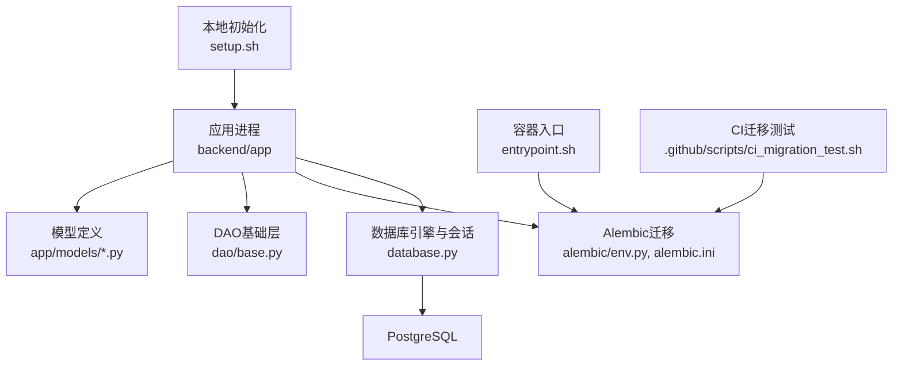
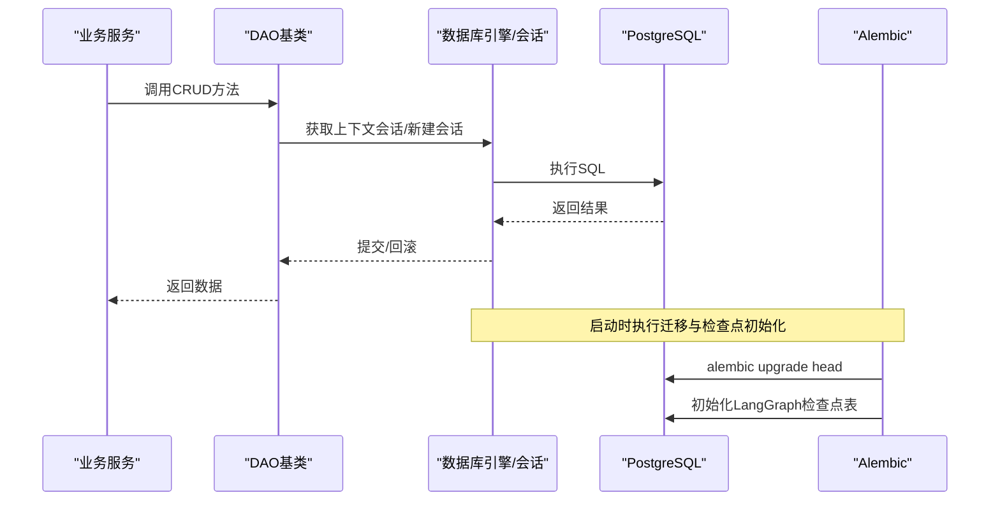
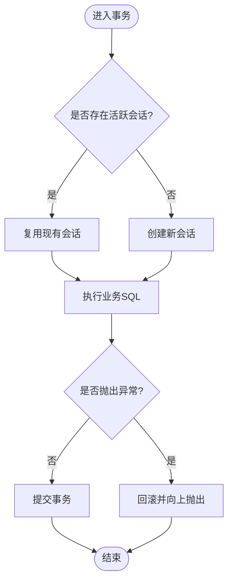
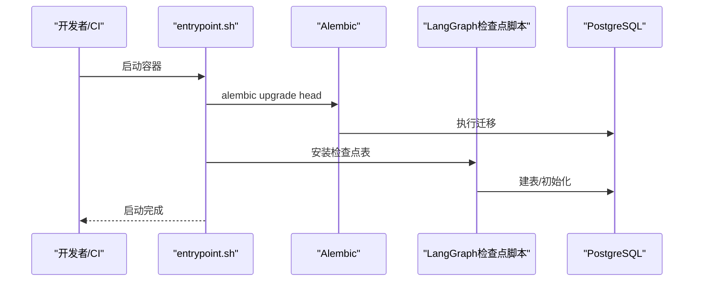
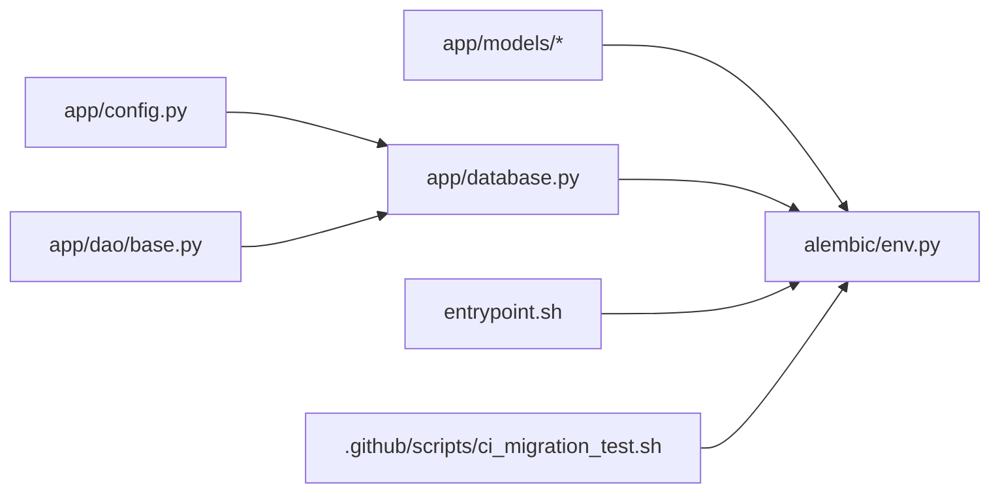

# 数据库架构

<cite>
**本文引用的文件**
- [backend/app/database.py](file://backend/app/database.py)
- [backend/alembic/env.py](file://backend/alembic/env.py)
- [backend/alembic.ini](file://backend/alembic.ini)
- [backend/app/config.py](file://backend/app/config.py)
- [backend/app/dao/base.py](file://backend/app/dao/base.py)
- [backend/app/models/user.py](file://backend/app/models/user.py)
- [backend/app/models/llm.py](file://backend/app/models/llm.py)
- [backend/entrypoint.sh](file://backend/entrypoint.sh)
- [.github/scripts/ci_migration_test.sh](file://.github/scripts/ci_migration_test.sh)
- [setup.sh](file://setup.sh)
</cite>

## 目录
1. [简介](#简介)
2. [项目结构](#项目结构)
3. [核心组件](#核心组件)
4. [架构总览](#架构总览)
5. [详细组件分析](#详细组件分析)
6. [依赖关系分析](#依赖关系分析)
7. [性能考虑](#性能考虑)
8. [故障排查指南](#故障排查指南)
9. [结论](#结论)
10. [附录](#附录)

## 简介
本文件面向Clawith平台的数据库架构设计与运维实践，覆盖整体架构、连接池与事务管理、并发控制、迁移与初始化、备份恢复、监控告警、高可用与容灾、以及运维操作指南。文档基于仓库中的实际代码与配置进行提炼，确保可落地、可执行、可维护。

## 项目结构
后端采用异步SQLAlchemy + Alembic的数据库访问与迁移方案，PostgreSQL为持久化存储。关键位置如下：
- 数据库引擎与会话：backend/app/database.py
- 应用配置（含DATABASE_URL等）：backend/app/config.py
- Alembic环境配置与迁移脚本入口：backend/alembic/env.py、backend/alembic.ini
- DAO基础封装：backend/app/dao/base.py
- 模型示例（用户/组织、LLM模型等）：backend/app/models/*.py
- 启动流程与迁移执行：backend/entrypoint.sh、.github/scripts/ci_migration_test.sh
- 本地初始化脚本（设置.env中的DATABASE_URL）：setup.sh

图表来源
- [backend/app/database.py:14-21](file://backend/app/database.py#L14-L21)
- [backend/alembic/env.py:48-98](file://backend/alembic/env.py#L48-L98)
- [backend/alembic.ini:1-40](file://backend/alembic.ini#L1-L40)
- [backend/app/dao/base.py:13-38](file://backend/app/dao/base.py#L13-L38)
- [backend/app/models/user.py:16-119](file://backend/app/models/user.py#L16-L119)
- [backend/entrypoint.sh:42-69](file://backend/entrypoint.sh#L42-L69)
- [.github/scripts/ci_migration_test.sh:40-46](file://.github/scripts/ci_migration_test.sh#L40-L46)
- [setup.sh:347-360](file://setup.sh#L347-L360)

章节来源
- [backend/app/database.py:14-21](file://backend/app/database.py#L14-L21)
- [backend/alembic/env.py:48-98](file://backend/alembic/env.py#L48-L98)
- [backend/alembic.ini:1-40](file://backend/alembic.ini#L1-L40)
- [backend/app/dao/base.py:13-38](file://backend/app/dao/base.py#L13-L38)
- [backend/app/models/user.py:16-119](file://backend/app/models/user.py#L16-L119)
- [backend/entrypoint.sh:42-69](file://backend/entrypoint.sh#L42-L69)
- [.github/scripts/ci_migration_test.sh:40-46](file://.github/scripts/ci_migration_test.sh#L40-L46)
- [setup.sh:347-360](file://setup.sh#L347-L360)

## 核心组件
- 异步引擎与会话工厂：使用asyncpg驱动创建异步引擎，固定pool_size与max_overflow，提供expire_on_commit=False的会话工厂，减少重复加载开销。
- 上下文变量会话注入：通过ContextVar在请求/任务范围内共享同一会话，保证事务边界一致。
- 事务上下文管理器：提供统一的transaction上下文，自动commit/rollback，支持嵌套复用已有会话。
- Alembic迁移：在线模式使用NullPool避免长连接占用，离线模式直接生成SQL；所有模型在env中显式导入以注册到Base.metadata。
- DAO基类：封装session上下文获取、CRUD方法，统一异常处理与flush策略。

章节来源
- [backend/app/database.py:14-21](file://backend/app/database.py#L14-L21)
- [backend/app/database.py:30-42](file://backend/app/database.py#L30-L42)
- [backend/app/database.py:47-79](file://backend/app/database.py#L47-L79)
- [backend/alembic/env.py:48-98](file://backend/alembic/env.py#L48-L98)
- [backend/app/dao/base.py:13-38](file://backend/app/dao/base.py#L13-L38)

## 架构总览
下图展示从应用到数据库的关键路径：API/服务调用进入DAO层，DAO通过上下文会话访问数据库引擎；迁移由Alembic在启动或CI阶段执行；LangGraph检查点表由专用脚本初始化。

图表来源
- [backend/app/dao/base.py:13-38](file://backend/app/dao/base.py#L13-L38)
- [backend/app/database.py:14-21](file://backend/app/database.py#L14-L21)
- [backend/alembic/env.py:78-98](file://backend/alembic/env.py#L78-L98)
- [backend/entrypoint.sh:42-69](file://backend/entrypoint.sh#L42-L69)

## 详细组件分析

### 连接池与引擎配置
- 引擎参数：pool_size=20，max_overflow=10，echo受DEBUG控制。
- 会话工厂：expire_on_commit=False，避免提交后再次访问属性触发额外查询。
- 建议优化：根据并发QPS与慢查询比例调整pool_size与max_overflow；启用连接超时与重试；在生产环境关闭echo。

章节来源
- [backend/app/database.py:14-21](file://backend/app/database.py#L14-L21)

### 事务管理与并发控制
- 事务边界：get_db与transaction均保证异常时回滚，正常路径提交。
- 上下文复用：_session_ctx通过ContextVar传递当前会话，DAO与业务逻辑可复用同一事务。
- 并发安全：单会话内串行执行；跨会话并发需依赖数据库锁（如SELECT ... FOR UPDATE）或应用级分布式锁。

图表来源
- [backend/app/database.py:30-42](file://backend/app/database.py#L30-L42)
- [backend/app/database.py:47-79](file://backend/app/database.py#L47-L79)
- [backend/app/dao/base.py:19-38](file://backend/app/dao/base.py#L19-L38)

章节来源
- [backend/app/database.py:30-42](file://backend/app/database.py#L30-L42)
- [backend/app/database.py:47-79](file://backend/app/database.py#L47-L79)
- [backend/app/dao/base.py:19-38](file://backend/app/dao/base.py#L19-L38)

### 字符集与存储引擎
- 字符集：仓库未显式指定PostgreSQL字符集与排序规则，默认使用数据库实例配置（通常为UTF8）。建议在实例级别统一设置LC_COLLATE/LC_CTYPE为UTF8相关值。
- 存储引擎：PostgreSQL使用内置存储引擎，无需选择InnoDB/MyISAM；可通过表空间与索引策略优化I/O与查询性能。

章节来源
- [backend/app/config.py:90](file://backend/app/config.py#L90)
- [backend/alembic.ini:6](file://backend/alembic.ini#L6)

### 表空间规划
- 建议按业务域划分表空间（如主库、日志、临时），结合PostgreSQL表空间与分区表提升可维护性与扩展性。
- 大表（消息、事件、审计）建议分区+索引分离，冷热数据分层存储。

[本节为通用设计建议，不直接分析具体文件]

### 模型与元数据注册
- 所有模型需在Alembic env中导入以注册到Base.metadata，确保迁移能识别变更。
- 示例模型包含UUID主键、时间戳、枚举字段、外键与关系映射。

章节来源
- [backend/alembic/env.py:14-46](file://backend/alembic/env.py#L14-L46)
- [backend/app/models/user.py:16-119](file://backend/app/models/user.py#L16-L119)
- [backend/app/models/llm.py:1-14](file://backend/app/models/llm.py#L1-L14)

### 迁移工具与初始化流程
- Alembic在线模式：使用NullPool避免长连接，异步执行迁移。
- 启动流程：entrypoint在执行迁移后，安装LangGraph检查点表。
- CI验证：空库迁移测试确保迁移幂等与可用性。
- 本地初始化：setup.sh写入.env中的DATABASE_URL，便于本地开发。

图表来源
- [backend/entrypoint.sh:42-69](file://backend/entrypoint.sh#L42-L69)
- [backend/alembic/env.py:78-98](file://backend/alembic/env.py#L78-L98)
- [.github/scripts/ci_migration_test.sh:40-46](file://.github/scripts/ci_migration_test.sh#L40-L46)
- [setup.sh:347-360](file://setup.sh#L347-L360)

章节来源
- [backend/entrypoint.sh:42-69](file://backend/entrypoint.sh#L42-L69)
- [backend/alembic/env.py:78-98](file://backend/alembic/env.py#L78-L98)
- [.github/scripts/ci_migration_test.sh:40-46](file://.github/scripts/ci_migration_test.sh#L40-L46)
- [setup.sh:347-360](file://setup.sh#L347-L360)

### 高可用架构与故障转移
- 推荐部署PostgreSQL主从复制（流复制）+ Patroni/etcd实现自动故障转移。
- 应用侧通过读写分离与连接路由（PgBouncer/代理）提升可用性。
- 迁移期间采用灰度发布与只读切换，避免写放大。

[本节为通用设计建议，不直接分析具体文件]

### 备份恢复与灾难恢复
- 全量备份：pg_dump/pg_basebackup定时备份至对象存储。
- 增量备份：WAL归档+时间点恢复（PITR）。
- 恢复演练：定期在隔离环境演练恢复流程，验证RTO/RPO目标。

[本节为通用设计建议，不直接分析具体文件]

### 监控告警与性能指标
- 关键指标：连接数、活跃会话、锁等待、慢查询、磁盘I/O、缓存命中率、复制延迟。
- 采集方式：Prometheus + postgres_exporter + Grafana看板。
- 告警阈值：连接池耗尽、长时间锁等待、复制延迟超阈值、磁盘空间不足。

[本节为通用设计建议，不直接分析具体文件]

## 依赖关系分析
- database.py依赖config.py读取DATABASE_URL与DEBUG。
- alembic/env.py依赖app.models.*注册元数据，并使用config.py的DATABASE_URL。
- dao/base.py依赖database.py的Base、_session_ctx与async_session。
- entrypoint.sh依赖alembic与LangGraph检查点脚本。

图表来源
- [backend/app/config.py:90](file://backend/app/config.py#L90)
- [backend/app/database.py:14-21](file://backend/app/database.py#L14-L21)
- [backend/alembic/env.py:48-98](file://backend/alembic/env.py#L48-L98)
- [backend/app/dao/base.py:1-10](file://backend/app/dao/base.py#L1-L10)
- [backend/entrypoint.sh:42-69](file://backend/entrypoint.sh#L42-L69)
- [.github/scripts/ci_migration_test.sh:40-46](file://.github/scripts/ci_migration_test.sh#L40-L46)

章节来源
- [backend/app/config.py:90](file://backend/app/config.py#L90)
- [backend/app/database.py:14-21](file://backend/app/database.py#L14-L21)
- [backend/alembic/env.py:48-98](file://backend/alembic/env.py#L48-L98)
- [backend/app/dao/base.py:1-10](file://backend/app/dao/base.py#L1-L10)
- [backend/entrypoint.sh:42-69](file://backend/entrypoint.sh#L42-L69)
- [.github/scripts/ci_migration_test.sh:40-46](file://.github/scripts/ci_migration_test.sh#L40-L46)

## 性能考虑
- 连接池调优：依据并发与平均响应时间调整pool_size与max_overflow，避免连接风暴。
- 查询优化：合理使用索引、分页、批量操作，避免N+1查询；对大表使用分区与物化视图。
- 事务粒度：尽量缩短事务范围，减少锁竞争；必要时使用快照隔离与选择性加锁。
- 缓存策略：热点数据引入Redis缓存，降低数据库压力。

[本节为通用性能建议，不直接分析具体文件]

## 故障排查指南
- 迁移失败：检查alembic日志与数据库状态，确认版本一致性；必要时回滚到上一版本。
- 连接池耗尽：监控连接数与活跃会话，扩容pool_size或优化慢查询。
- 死锁与锁等待：查看pg_locks与pg_stat_activity，定位冲突语句与持有者。
- 启动异常：确认entrypoint中迁移与检查点脚本执行成功，检查环境变量DATABASE_URL。

章节来源
- [backend/alembic/env.py:78-98](file://backend/alembic/env.py#L78-L98)
- [backend/entrypoint.sh:42-69](file://backend/entrypoint.sh#L42-L69)
- [backend/app/database.py:14-21](file://backend/app/database.py#L14-L21)

## 结论
Clawith平台采用异步SQLAlchemy与Alembic构建稳定可靠的数据库访问与迁移体系。通过明确的连接池与事务管理、完善的迁移流程与CI保障，为高可用与可扩展的数据库架构奠定基础。建议在生产环境中完善字符集与表空间规划、备份恢复与监控告警，并结合PostgreSQL高可用方案实现故障转移与灾难恢复。

## 附录
- 数据库初始化脚本：参考setup.sh中对DATABASE_URL的设置逻辑。
- 迁移工具：使用alembic upgrade/head/current命令进行版本管理。
- 运维操作指南：
  - 启动前确保DATABASE_URL正确且PostgreSQL健康。
  - 首次启动执行迁移与检查点初始化。
  - 定期备份与恢复演练，监控关键指标与告警阈值。

章节来源
- [setup.sh:347-360](file://setup.sh#L347-L360)
- [backend/entrypoint.sh:42-69](file://backend/entrypoint.sh#L42-L69)
- [backend/alembic/env.py:78-98](file://backend/alembic/env.py#L78-L98)