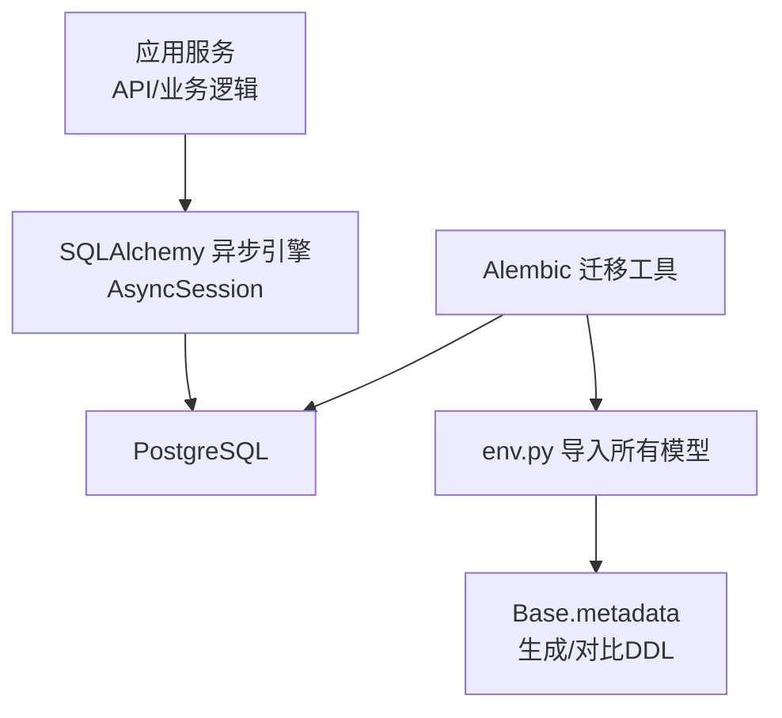
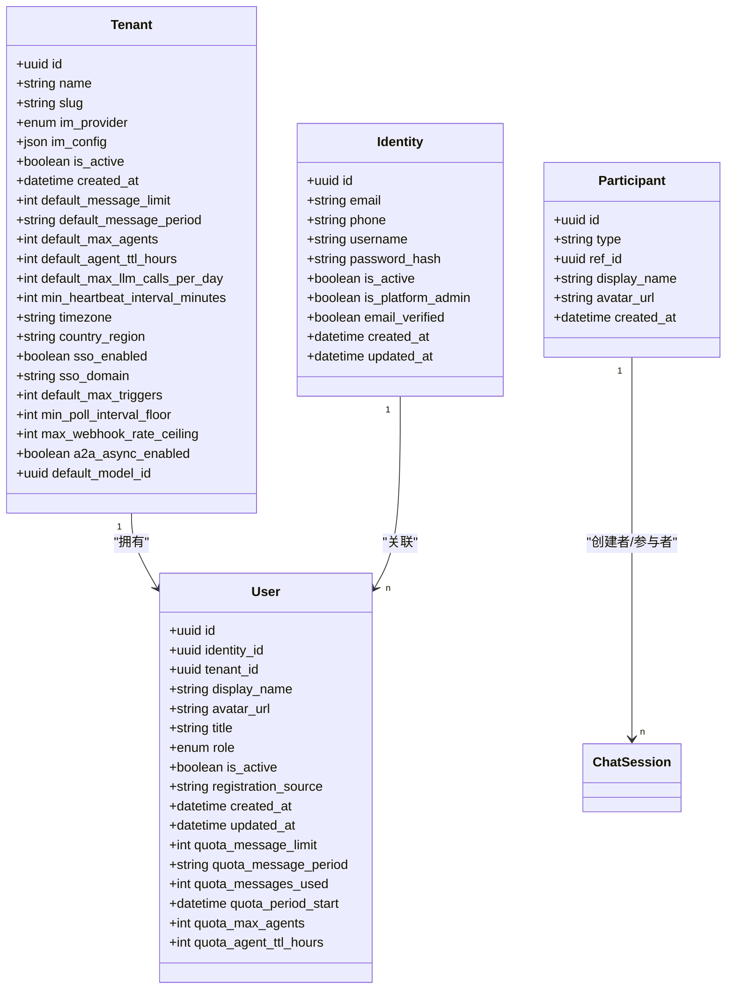
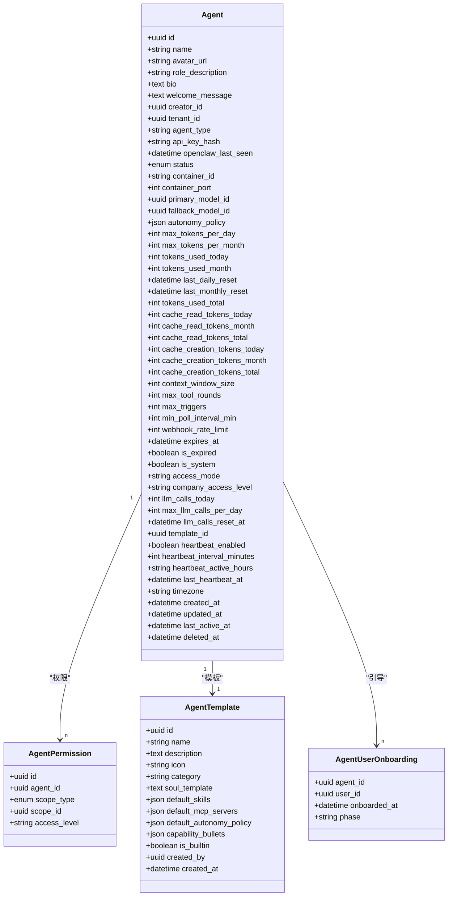
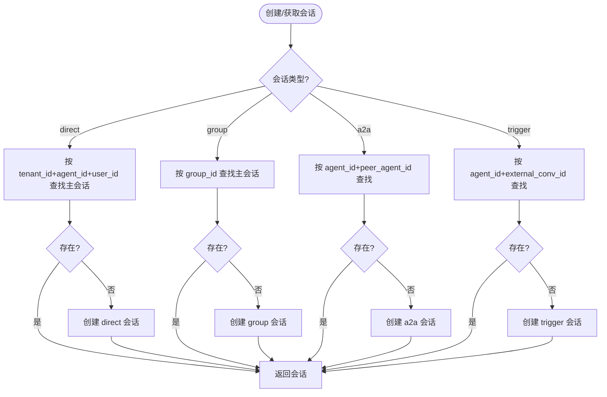
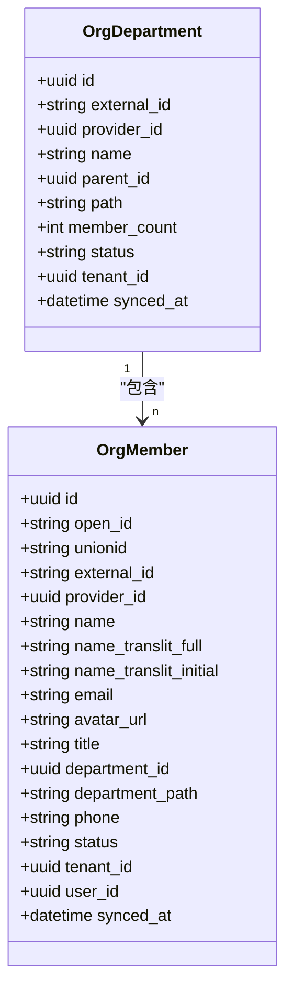
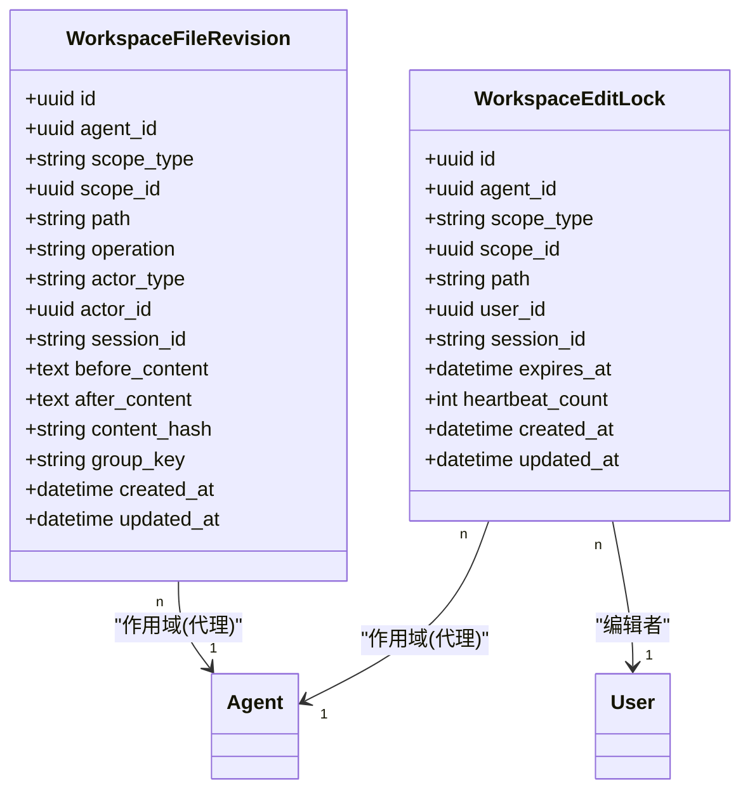
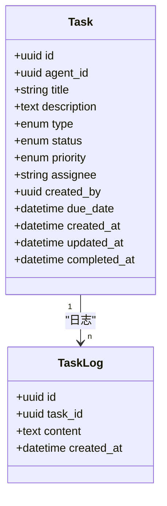
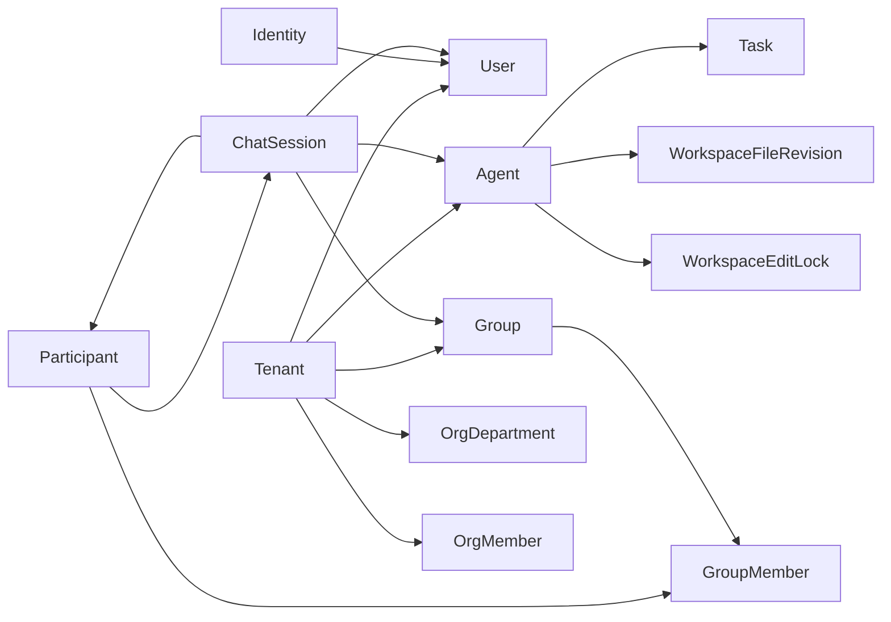

# 数据库设计

<cite>
**本文引用的文件**
- [backend/app/database.py](file://backend/app/database.py)
- [backend/alembic/env.py](file://backend/alembic/env.py)
- [backend/alembic.ini](file://backend/alembic.ini)
- [backend/app/models/user.py](file://backend/app/models/user.py)
- [backend/app/models/agent.py](file://backend/app/models/agent.py)
- [backend/app/models/chat_session.py](file://backend/app/models/chat_session.py)
- [backend/app/models/org.py](file://backend/app/models/org.py)
- [backend/app/models/workspace.py](file://backend/app/models/workspace.py)
- [backend/app/models/tenant.py](file://backend/app/models/tenant.py)
- [backend/app/models/group.py](file://backend/app/models/group.py)
- [backend/app/models/participant.py](file://backend/app/models/participant.py)
- [backend/app/models/task.py](file://backend/app/models/task.py)
- [backend/alembic/versions/001_initial_schema.py](file://backend/alembic/versions/001_initial_schema.py)
- [backend/alembic/versions/057_perf_indexes.py](file://backend/alembic/versions/057_perf_indexes.py)
</cite>

## 目录
1. [引言](#引言)
2. [项目结构](#项目结构)
3. [核心组件](#核心组件)
4. [架构总览](#架构总览)
5. [详细组件分析](#详细组件分析)
6. [依赖关系分析](#依赖关系分析)
7. [性能考虑](#性能考虑)
8. [故障排查指南](#故障排查指南)
9. [结论](#结论)
10. [附录](#附录)

## 引言
本文件为 Clawith 平台的数据库设计文档，覆盖实体关系图、表结构与字段类型、主外键与约束、索引设计与查询优化、数据迁移与版本控制、备份恢复策略、典型查询示例、容量规划建议、数据安全与隐私保护、访问控制机制以及与 ORM 框架的集成最佳实践。读者可据此理解平台的数据模型与运维要点，并在开发与排障中高效定位问题。

## 项目结构
后端采用 SQLAlchemy 异步 ORM + Alembic 进行数据库建模与迁移管理。核心位置：
- 数据库连接与会话管理：backend/app/database.py
- Alembic 环境与配置：backend/alembic/env.py、backend/alembic.ini
- 领域模型（表映射）：backend/app/models/*
- 初始与增量迁移脚本：backend/alembic/versions/*

**图表来源**
- [backend/app/database.py:14-21](file://backend/app/database.py#L14-L21)
- [backend/alembic/env.py:48-56](file://backend/alembic/env.py#L48-L56)
- [backend/alembic/versions/001_initial_schema.py:19-22](file://backend/alembic/versions/001_initial_schema.py#L19-L22)

**章节来源**
- [backend/app/database.py:14-21](file://backend/app/database.py#L14-L21)
- [backend/alembic/env.py:48-56](file://backend/alembic/env.py#L48-L56)
- [backend/alembic.ini:1-40](file://backend/alembic.ini#L1-L40)
- [backend/alembic/versions/001_initial_schema.py:19-22](file://backend/alembic/versions/001_initial_schema.py#L19-L22)

## 核心组件
- 多租户隔离：Tenant 作为租户边界，多数实体通过 tenant_id 隔离。
- 身份与会话：Identity/User 区分全局身份与租户内成员；Participant 统一用户/Agent 参与方抽象；ChatSession 统一会话（直聊、群、A2A、触发）。
- 数字员工：Agent 及其权限、模板、运行状态、配额与限制。
- 组织同步：OrgDepartment/OrgMember 从飞书等 IDP 同步。
- 协作空间：WorkspaceFileRevision/WorkspaceEditLock 记录文件修订与编辑锁。
- 任务系统：Task/TaskLog 跟踪任务生命周期。

**章节来源**
- [backend/app/models/tenant.py:13-73](file://backend/app/models/tenant.py#L13-L73)
- [backend/app/models/user.py:16-119](file://backend/app/models/user.py#L16-L119)
- [backend/app/models/participant.py:13-32](file://backend/app/models/participant.py#L13-L32)
- [backend/app/models/chat_session.py:23-116](file://backend/app/models/chat_session.py#L23-L116)
- [backend/app/models/agent.py:19-235](file://backend/app/models/agent.py#L19-L235)
- [backend/app/models/org.py:13-98](file://backend/app/models/org.py#L13-L98)
- [backend/app/models/workspace.py:28-108](file://backend/app/models/workspace.py#L28-L108)
- [backend/app/models/task.py:13-75](file://backend/app/models/task.py#L13-L75)

## 架构总览
下图展示核心实体间的关系与关键约束，体现多租户、参与者抽象、会话聚合与协作空间等设计。

```mermaid
erDiagram
TENANTS {
uuid id PK
string name
string slug UK
enum im_provider
json im_config
boolean is_active
datetime created_at
int default_message_limit
string default_message_period
int default_max_agents
int default_agent_ttl_hours
int default_max_llm_calls_per_day
int min_heartbeat_interval_minutes
string timezone
string country_region
boolean sso_enabled
string sso_domain UK
int default_max_triggers
int min_poll_interval_floor
int max_webhook_rate_ceiling
boolean a2a_async_enabled
uuid default_model_id FK
}
IDENTITIES {
uuid id PK
string email UK
string phone UK
string username UK
string password_hash
boolean is_active
boolean is_platform_admin
boolean email_verified
datetime created_at
datetime updated_at
}
USERS {
uuid id PK
uuid identity_id FK
uuid tenant_id FK
string display_name
string avatar_url
string title
enum role
boolean is_active
string registration_source
datetime created_at
datetime updated_at
int quota_message_limit
string quota_message_period
int quota_messages_used
datetime quota_period_start
int quota_max_agents
int quota_agent_ttl_hours
}
PARTICIPANTS {
uuid id PK
string type
uuid ref_id
string display_name
string avatar_url
datetime created_at
}
AGENTS {
uuid id PK
string name
string avatar_url
string role_description
text bio
text welcome_message
uuid creator_id FK
uuid tenant_id FK
string agent_type
string api_key_hash
datetime openclaw_last_seen
enum status
string container_id
int container_port
uuid primary_model_id FK
uuid fallback_model_id FK
json autonomy_policy
int max_tokens_per_day
int max_tokens_per_month
int tokens_used_today
int tokens_used_month
datetime last_daily_reset
datetime last_monthly_reset
int tokens_used_total
int cache_read_tokens_today
int cache_read_tokens_month
int cache_read_tokens_total
int cache_creation_tokens_today
int cache_creation_tokens_month
int cache_creation_tokens_total
int context_window_size
int max_tool_rounds
int max_triggers
int min_poll_interval_min
int webhook_rate_limit
datetime expires_at
boolean is_expired
boolean is_system
string access_mode
string company_access_level
int llm_calls_today
int max_llm_calls_per_day
datetime llm_calls_reset_at
uuid template_id FK
boolean heartbeat_enabled
int heartbeat_interval_minutes
string heartbeat_active_hours
datetime last_heartbeat_at
string timezone
datetime created_at
datetime updated_at
datetime last_active_at
datetime deleted_at
}
AGENT_PERMISSIONS {
uuid id PK
uuid agent_id FK
enum scope_type
uuid scope_id
string access_level
}
AGENT_TEMPLATES {
uuid id PK
string name
text description
string icon
string category
text soul_template
json default_skills
json default_mcp_servers
json default_autonomy_policy
json capability_bullets
boolean is_builtin
uuid created_by FK
datetime created_at
}
ORG_DEPARTMENTS {
uuid id PK
string external_id
uuid provider_id
string name
uuid parent_id FK
string path
int member_count
string status
uuid tenant_id FK
datetime synced_at
}
ORG_MEMBERS {
uuid id PK
string open_id
string unionid
string external_id
uuid provider_id
string name
string name_translit_full
string name_translit_initial
string email
string avatar_url
string title
uuid department_id FK
string department_path
string phone
string status
uuid tenant_id FK
uuid user_id
datetime synced_at
}
GROUPS {
uuid id PK
uuid tenant_id FK
string name
text description
uuid created_by_participant_id FK
datetime deleted_at
datetime created_at
datetime updated_at
}
GROUP_MEMBERS {
uuid id PK
uuid group_id FK
uuid participant_id FK
string role
datetime joined_at
datetime removed_at
jsonb session_read_state
}
CHAT_SESSIONS {
uuid id PK
uuid tenant_id FK
string session_type
uuid group_id FK
uuid agent_id FK
uuid user_id FK
uuid created_by_participant_id FK
string title
string source_channel
string external_conv_id
boolean is_group
string group_name
uuid participant_id FK
uuid peer_agent_id FK
boolean is_primary
datetime last_read_at_by_user
datetime deleted_at
datetime created_at
datetime updated_at
datetime last_message_at
}
WORKSPACE_FILE_REVISIONS {
uuid id PK
uuid agent_id FK
string scope_type
uuid scope_id
string path
string operation
string actor_type
uuid actor_id
string session_id
text before_content
text after_content
string content_hash
string group_key
datetime created_at
datetime updated_at
}
WORKSPACE_EDIT_LOCKS {
uuid id PK
uuid agent_id FK
string scope_type
uuid scope_id
string path
uuid user_id FK
string session_id
datetime expires_at
int heartbeat_count
datetime created_at
datetime updated_at
}
TASKS {
uuid id PK
uuid agent_id FK
string title
text description
enum type
enum status
enum priority
string assignee
uuid created_by FK
datetime due_date
datetime created_at
datetime updated_at
datetime completed_at
}
TASK_LOGS {
uuid id PK
uuid task_id FK
text content
datetime created_at
}
TENANTS ||--o{ USERS : "拥有"
TENANTS ||--o{ AGENTS : "拥有"
TENANTS ||--o{ GROUPS : "拥有"
TENANTS ||--o{ ORG_DEPARTMENTS : "拥有"
TENANTS ||--o{ ORG_MEMBERS : "拥有"
TENANTS ||--o{ CHAT_SESSIONS : "拥有"
TENANTS ||--o{ WORKSPACE_FILE_REVISIONS : "拥有(按scope)"
TENANTS ||--o{ WORKSPACE_EDIT_LOCKS : "拥有(按scope)"
IDENTITIES ||--o{ USERS : "关联"
USERS ||--o{ AGENTS : "创建"
PARTICIPANTS ||--o{ CHAT_SESSIONS : "创建者/参与者"
PARTICIPANTS ||--o{ GROUP_MEMBERS : "成员"
PARTICIPANTS ||--o{ GROUPS : "创建者"
AGENTS ||--o{ AGENT_PERMISSIONS : "权限"
AGENTS ||--o{ TASKS : "任务"
AGENTS ||--o{ WORKSPACE_FILE_REVISIONS : "范围(代理)"
AGENTS ||--o{ WORKSPACE_EDIT_LOCKS : "范围(代理)"
GROUPS ||--o{ GROUP_MEMBERS : "成员"
CHAT_SESSIONS ||--|| GROUPS : "群组会话"
CHAT_SESSIONS ||--|| AGENTS : "对话代理"
CHAT_SESSIONS ||--|| USERS : "个人会话用户"
CHAT_SESSIONS ||--|| PARTICIPANTS : "参与者"
TASKS ||--o{ TASK_LOGS : "日志"
```

**图表来源**
- [backend/app/models/tenant.py:13-73](file://backend/app/models/tenant.py#L13-L73)
- [backend/app/models/user.py:16-119](file://backend/app/models/user.py#L16-L119)
- [backend/app/models/participant.py:13-32](file://backend/app/models/participant.py#L13-L32)
- [backend/app/models/chat_session.py:23-116](file://backend/app/models/chat_session.py#L23-L116)
- [backend/app/models/agent.py:19-235](file://backend/app/models/agent.py#L19-L235)
- [backend/app/models/org.py:13-98](file://backend/app/models/org.py#L13-L98)
- [backend/app/models/group.py:24-95](file://backend/app/models/group.py#L24-L95)
- [backend/app/models/workspace.py:28-108](file://backend/app/models/workspace.py#L28-L108)
- [backend/app/models/task.py:13-75](file://backend/app/models/task.py#L13-L75)

## 详细组件分析

### 多租户与身份体系
- Tenant：租户边界，包含 IM 提供商配置、默认配额、时区、SSO 开关、A2A 异步开关、默认 LLM 模型等。
- Identity：全局自然人身份，含邮箱、手机、用户名、密码哈希、平台管理员标记、邮箱验证状态。
- User：租户内成员，绑定 Identity，承载角色、头像、职位、注册来源、用量配额等。
- Participant：统一参与方抽象，type 为 user/agent，ref_id 指向 users.id 或 agents.id，用于会话、群组等场景的统一建模。

**图表来源**
- [backend/app/models/tenant.py:13-73](file://backend/app/models/tenant.py#L13-L73)
- [backend/app/models/user.py:16-119](file://backend/app/models/user.py#L16-L119)
- [backend/app/models/participant.py:13-32](file://backend/app/models/participant.py#L13-L32)

**章节来源**
- [backend/app/models/tenant.py:13-73](file://backend/app/models/tenant.py#L13-L73)
- [backend/app/models/user.py:16-119](file://backend/app/models/user.py#L16-L119)
- [backend/app/models/participant.py:13-32](file://backend/app/models/participant.py#L13-L32)

### 数字员工 Agent 与权限
- Agent：数字员工实例，支持 native/openclaw 两种类型，具备运行状态、容器信息、LLM 主备模型、自主性策略、Token 使用限额、触发器限制、过期控制、系统代理标记、访问模式、心跳与时区等。
- AgentPermission：细粒度访问控制，支持公司/部门/用户维度，use/manage 两级权限。
- AgentTemplate：快速创建模板，内置能力、默认技能、默认自主策略、MCP 服务器等。
- AgentUserOnboarding：记录每个 (agent, user) 的引导阶段，避免重复问候并支持校准流程。

**图表来源**
- [backend/app/models/agent.py:19-235](file://backend/app/models/agent.py#L19-L235)

**章节来源**
- [backend/app/models/agent.py:19-235](file://backend/app/models/agent.py#L19-L235)

### 统一会话 ChatSession 与群组 Group
- ChatSession：统一会话载体，支持 direct/group/a2a/trigger 四种类型，外部会话 ID 唯一性保证跨进程可靠 find-or-create；is_primary 标识主会话；last_read_at_by_user 驱动未读计数；deleted_at 软删除。
- Group/GroupMember：原生群组与成员关系，role 限定 manager/member，session_read_state JSONB 存储会话读取状态。

**图表来源**
- [backend/app/models/chat_session.py:23-116](file://backend/app/models/chat_session.py#L23-L116)

**章节来源**
- [backend/app/models/chat_session.py:23-116](file://backend/app/models/chat_session.py#L23-L116)
- [backend/app/models/group.py:24-95](file://backend/app/models/group.py#L24-95)

### 组织同步 OrgDepartment/OrgMember
- OrgDepartment：部门树形结构，path 存储层级路径，便于快速检索子部门。
- OrgMember：来自 IDP 的组织成员，open_id/unionid/external_id 等通用标识，department_path 冗余路径，便于搜索与过滤。

**图表来源**
- [backend/app/models/org.py:13-98](file://backend/app/models/org.py#L13-98)

**章节来源**
- [backend/app/models/org.py:13-98](file://backend/app/models/org.py#L13-98)

### 协作空间 Workspace 修订与编辑锁
- WorkspaceFileRevision：记录有意义的文件变更，包含 before/after 内容、content_hash、actor/session 信息等，支持按 scope_type/scope_id/path 查询。
- WorkspaceEditLock：短生命周期的编辑锁，防止多人同时编辑冲突，expires_at 与 heartbeat_count 保障活跃性。

**图表来源**
- [backend/app/models/workspace.py:28-108](file://backend/app/models/workspace.py#L28-108)

**章节来源**
- [backend/app/models/workspace.py:28-108](file://backend/app/models/workspace.py#L28-108)

### 任务系统 Task/TaskLog
- Task：任务定义，支持 todo/supervision 两类，状态机 pending/doing/done，优先级 low/medium/high/urgent，监督任务包含目标用户与提醒策略。
- TaskLog：任务进度日志，关联任务与时间戳。

**图表来源**
- [backend/app/models/task.py:13-75](file://backend/app/models/task.py#L13-75)

**章节来源**
- [backend/app/models/task.py:13-75](file://backend/app/models/task.py#L13-75)

## 依赖关系分析
- 模型间外键关系清晰，围绕 Tenant 进行多租户隔离；Participant 抽象解耦了用户与 Agent 在会话与群组中的参与方式。
- 部分关系采用“软耦合”（如 provider_id、user_id），避免强外键带来的级联复杂度，提升同步与迁移灵活性。
- 索引设计兼顾常见查询路径：租户维度、会话主会话唯一性、群组主会话唯一性、参与者索引、组织成员邮箱/手机/用户ID 等。

**图表来源**
- [backend/app/models/tenant.py:13-73](file://backend/app/models/tenant.py#L13-L73)
- [backend/app/models/user.py:16-119](file://backend/app/models/user.py#L16-L119)
- [backend/app/models/participant.py:13-32](file://backend/app/models/participant.py#L13-L32)
- [backend/app/models/chat_session.py:23-116](file://backend/app/models/chat_session.py#L23-L116)
- [backend/app/models/agent.py:19-235](file://backend/app/models/agent.py#L19-L235)
- [backend/app/models/group.py:24-95](file://backend/app/models/group.py#L24-95)
- [backend/app/models/workspace.py:28-108](file://backend/app/models/workspace.py#L28-108)
- [backend/app/models/task.py:13-75](file://backend/app/models/task.py#L13-75)

**章节来源**
- [backend/app/models/chat_session.py:23-116](file://backend/app/models/chat_session.py#L23-L116)
- [backend/app/models/org.py:13-98](file://backend/app/models/org.py#L13-98)
- [backend/app/models/workspace.py:28-108](file://backend/app/models/workspace.py#L28-108)

## 性能考虑
- 连接池与事务：
  - 异步引擎 pool_size=20、max_overflow=10，适合高并发读写。
  - get_db 提供自动提交/回滚的事务边界；transaction 上下文管理器支持嵌套事务与变量传播。
- 索引优化：
  - 会话主会话唯一索引（direct/group）、租户与参与者索引、群组主会话唯一索引。
  - 组织成员邮箱/手机/用户ID 索引加速注册与绑定。
  - Agent 按租户+系统+名称复合索引加速 OKR 钩子查询。
- 查询策略：
  - 优先使用唯一约束与条件索引减少扫描范围。
  - 对大表（chat_sessions、workspace_file_revisions）按 tenant_id、created_at 分区或归档策略。
  - 避免 N+1 查询，使用 selectin 预加载必要关系。

**章节来源**
- [backend/app/database.py:14-21](file://backend/app/database.py#L14-L21)
- [backend/app/database.py:30-42](file://backend/app/database.py#L30-L42)
- [backend/app/database.py:47-79](file://backend/app/database.py#L47-L79)
- [backend/alembic/versions/057_perf_indexes.py:16-30](file://backend/alembic/versions/057_perf_indexes.py#L16-L30)
- [backend/app/models/chat_session.py:35-63](file://backend/app/models/chat_session.py#L35-L63)
- [backend/app/models/org.py:13-98](file://backend/app/models/org.py#L13-98)

## 故障排查指南
- 会话创建失败：
  - 检查唯一约束 uq_chat_sessions_agent_ext_conv 是否冲突。
  - 确认 is_primary 条件索引生效（deleted_at IS NULL）。
- 群组主会话冲突：
  - 校验 uq_chat_sessions_primary_group 条件唯一索引。
- 组织成员同步异常：
  - 核对 ix_org_members_email/phone/user_id 是否存在。
- 会话未读计数不准：
  - 检查 last_read_at_by_user 更新时机与消息 created_at 比较逻辑。
- 编辑锁失效：
  - 关注 expires_at 与 heartbeat_count 的续约逻辑，确保客户端心跳正常。

**章节来源**
- [backend/app/models/chat_session.py:35-63](file://backend/app/models/chat_session.py#L35-L63)
- [backend/app/models/workspace.py:71-108](file://backend/app/models/workspace.py#L71-L108)
- [backend/alembic/versions/057_perf_indexes.py:16-30](file://backend/alembic/versions/057_perf_indexes.py#L16-L30)

## 结论
Clawith 的数据库设计以多租户为核心，结合统一的参与者抽象与会话聚合，支撑直聊、群组、A2A、触发等多种交互形态。通过 Alembic 进行版本化迁移与索引优化，配合异步 SQLAlchemy 的连接池与事务管理，满足高并发与可扩展需求。建议在后续演进中持续完善分区与归档策略，强化审计与合规能力，并基于监控指标动态调优索引与查询计划。

## 附录

### 数据迁移管理与版本控制
- Alembic 环境：
  - env.py 导入所有模型，构建 Base.metadata，设置 sqlalchemy.url 为 DATABASE_URL。
  - 支持离线与在线模式执行迁移。
- 初始迁移：
  - 001_initial_schema.py 使用 Base.metadata.create_all 一次性建表。
- 增量迁移：
  - 057_perf_indexes.py 添加性能相关索引。
- 最佳实践：
  - 每次变更仅做最小必要修改，保持 down_revision 链完整。
  - 对破坏性变更（删列/改类型）先加新列再回填，最后切换。
  - 使用 IF NOT EXISTS 幂等创建索引，避免重复执行失败。

**章节来源**
- [backend/alembic/env.py:48-56](file://backend/alembic/env.py#L48-L56)
- [backend/alembic/versions/001_initial_schema.py:19-22](file://backend/alembic/versions/001_initial_schema.py#L19-L22)
- [backend/alembic/versions/057_perf_indexes.py:16-30](file://backend/alembic/versions/057_perf_indexes.py#L16-L30)
- [backend/alembic.ini:1-40](file://backend/alembic.ini#L1-L40)

### 备份恢复方案
- 全量备份：定期 pg_dump 导出 schema 与数据，保留历史版本。
- 增量备份：启用 WAL 归档，结合时间点恢复（PITR）。
- 恢复演练：定期在测试环境演练恢复流程，验证一致性。
- 敏感数据脱敏：备份前对密码哈希、手机号等敏感字段进行脱敏或加密。

[本节为通用指导，不直接分析具体文件]

### 典型查询示例
- 获取租户下某用户的直聊主会话：
  - 条件：tenant_id、agent_id、user_id、session_type='direct'、is_primary=true、deleted_at IS NULL。
- 获取群组主会话：
  - 条件：group_id、session_type='group'、is_primary=true、deleted_at IS NULL。
- 统计某 Agent 当日 Token 使用：
  - 条件：agent_id、tokens_used_today、last_daily_reset 重置逻辑。
- 查询组织成员邮箱/手机：
  - 条件：org_members.email/phone，利用对应索引。

[本节为概念性说明，不直接分析具体文件]

### 容量规划建议
- 会话表（chat_sessions）：按租户与时间分区，归档历史会话至冷存储。
- 工作空间修订（workspace_file_revisions）：按 scope_type/scope_id 分桶，定期清理旧版本。
- 任务日志（task_logs）：按月归档，压缩存储。
- 索引大小：监控索引膨胀，必要时重建索引。

[本节为通用指导，不直接分析具体文件]

### 数据安全与隐私保护
- 密码与密钥：password_hash、api_key_hash 仅存哈希值，禁止明文。
- 传输安全：DATABASE_URL 使用 TLS 连接；API 层强制 HTTPS。
- 访问控制：基于 Role（platform_admin/org_admin/agent_admin/member）与 AgentPermission 的 use/manage 分级。
- 审计日志：AuditLog/ActivityLog 记录关键操作，便于追溯。
- 数据最小化：仅采集必要字段，敏感字段脱敏展示。

**章节来源**
- [backend/app/models/user.py:16-119](file://backend/app/models/user.py#L16-L119)
- [backend/app/models/agent.py:19-235](file://backend/app/models/agent.py#L19-L235)

### 访问控制机制
- 租户隔离：所有查询必须携带 tenant_id 条件，避免越权。
- 角色权限：User.role 决定基础权限；AgentPermission 细化到公司/部门/用户维度。
- 系统代理保护：is_system=true 的 Agent 不可被用户删除，系统触发器受保护。

**章节来源**
- [backend/app/models/user.py:16-119](file://backend/app/models/user.py#L16-L119)
- [backend/app/models/agent.py:19-235](file://backend/app/models/agent.py#L19-L235)

### 与 ORM 框架集成最佳实践
- 使用 AsyncSession 与 async_sessionmaker，避免阻塞 IO。
- 合理设置 lazy loading，避免 MissingGreenlet 错误（如 association_proxy 需要 selectin）。
- 使用 transaction 上下文管理器包裹复杂写操作，确保原子性。
- 批量写入时使用 bulk_insert_mappings 或 executemany 提升吞吐。
- 对只读查询使用 readonly 会话，降低锁竞争。

**章节来源**
- [backend/app/database.py:14-21](file://backend/app/database.py#L14-L21)
- [backend/app/database.py:30-42](file://backend/app/database.py#L30-L42)
- [backend/app/database.py:47-79](file://backend/app/database.py#L47-L79)
- [backend/app/models/user.py:100-111](file://backend/app/models/user.py#L100-L111)