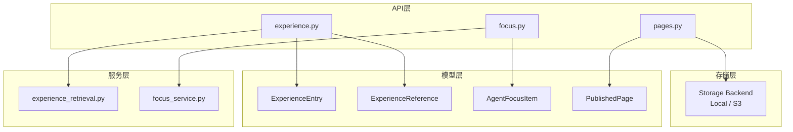
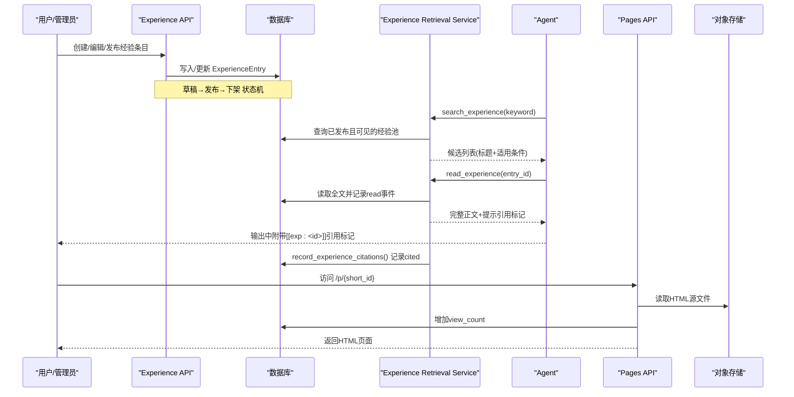
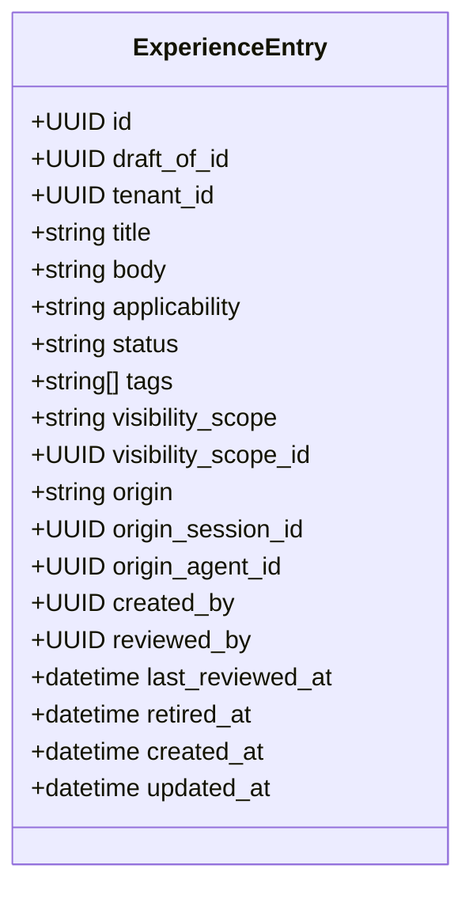
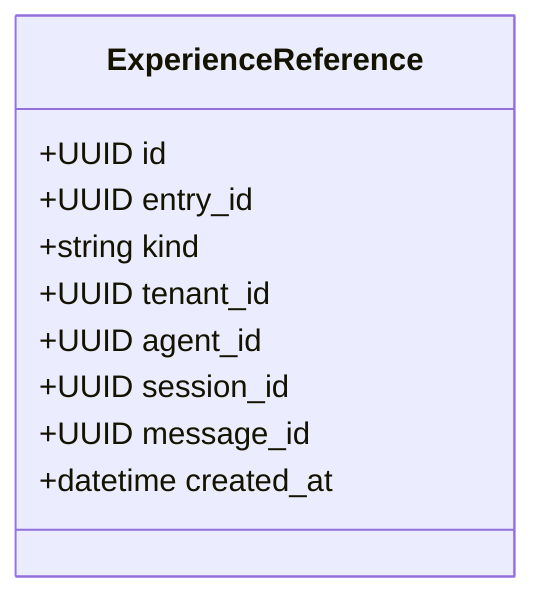
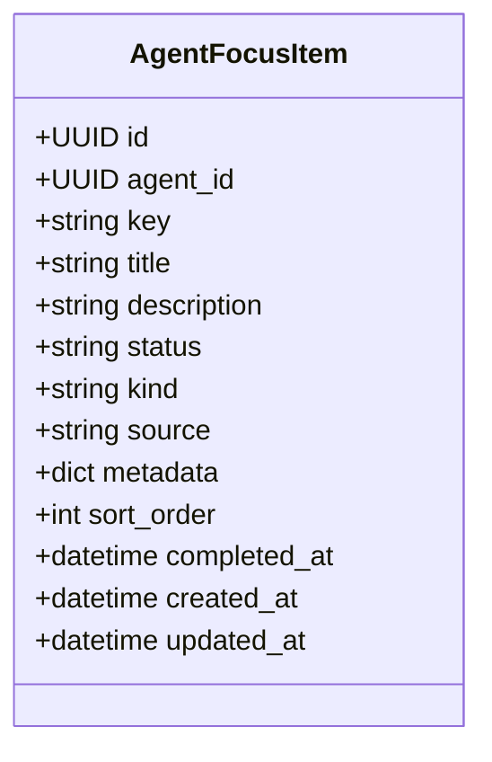
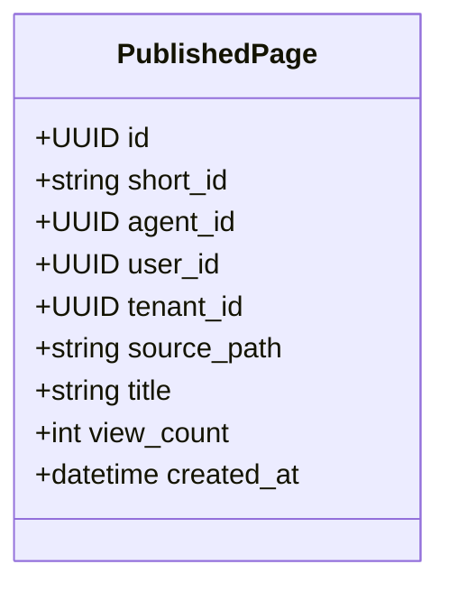
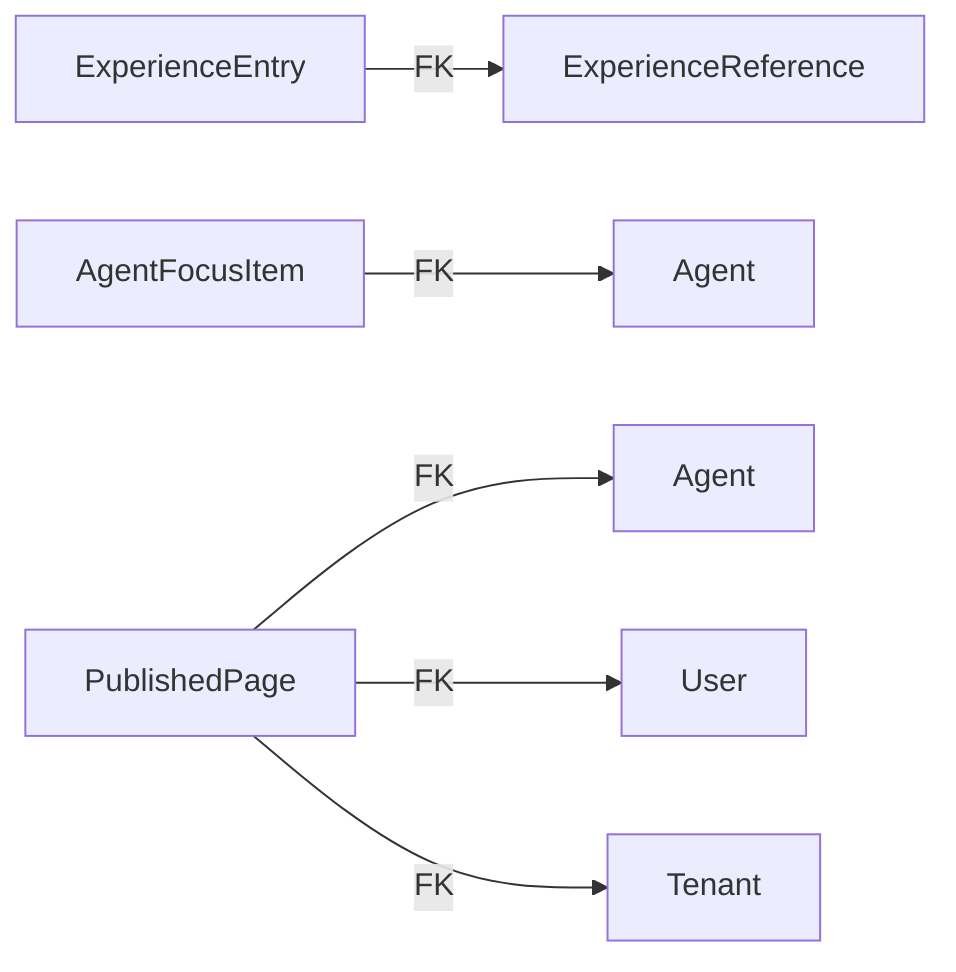

# AI内容模型

<cite>
**本文引用的文件**   
- [backend/app/models/experience.py](file://backend/app/models/experience.py)
- [backend/app/models/experience_reference.py](file://backend/app/models/experience_reference.py)
- [backend/app/models/focus.py](file://backend/app/models/focus.py)
- [backend/app/models/published_page.py](file://backend/app/models/published_page.py)
- [backend/app/api/experience.py](file://backend/app/api/experience.py)
- [backend/app/api/focus.py](file://backend/app/api/focus.py)
- [backend/app/api/pages.py](file://backend/app/api/pages.py)
- [backend/app/services/experience_retrieval.py](file://backend/app/services/experience_retrieval.py)
- [backend/app/services/focus_service.py](file://backend/app/services/focus_service.py)
- [backend/alembic/versions/202607171530_add_experience_revision_drafts.py](file://backend/alembic/versions/202607171530_add_experience_revision_drafts.py)
</cite>

## 目录
1. [简介](#简介)
2. [项目结构](#项目结构)
3. [核心组件](#核心组件)
4. [架构总览](#架构总览)
5. [详细组件分析](#详细组件分析)
6. [依赖关系分析](#依赖关系分析)
7. [性能与优化](#性能与优化)
8. [故障排查指南](#故障排查指南)
9. [结论](#结论)
10. [附录：数据操作示例](#附录数据操作示例)

## 简介
本文件面向Clawith平台的AI内容相关数据模型，围绕Experience（经验）、ExperienceReference（引用）、Focus（焦点话题）、PublishedPage（发布页面）四类模型进行系统化说明。文档覆盖：
- 模型结构与字段语义
- 版本控制与草稿机制
- 检索与引用统计
- 权限与可见性策略
- 缓存与索引优化思路
- 创建、检索、发布的完整数据流
- 内容聚合、推荐算法与性能优化方案

## 项目结构
后端采用FastAPI + SQLAlchemy ORM的模块化设计：
- 模型层：定义数据库表结构与ORM映射
- API层：暴露REST接口，处理鉴权、参数校验、事务提交
- 服务层：封装业务逻辑（检索、统计、状态机、迁移等）
- 存储层：统一抽象对象存储后端（本地/S3），用于发布页面HTML

图表来源
- [backend/app/models/experience.py:1-81](file://backend/app/models/experience.py#L1-L81)
- [backend/app/models/experience_reference.py:1-38](file://backend/app/models/experience_reference.py#L1-L38)
- [backend/app/models/focus.py:1-43](file://backend/app/models/focus.py#L1-L43)
- [backend/app/models/published_page.py:1-27](file://backend/app/models/published_page.py#L1-L27)
- [backend/app/api/experience.py:1-793](file://backend/app/api/experience.py#L1-L793)
- [backend/app/api/focus.py:1-92](file://backend/app/api/focus.py#L1-L92)
- [backend/app/api/pages.py:1-89](file://backend/app/api/pages.py#L1-L89)
- [backend/app/services/experience_retrieval.py:1-540](file://backend/app/services/experience_retrieval.py#L1-L540)
- [backend/app/services/focus_service.py:1-441](file://backend/app/services/focus_service.py#L1-L441)

章节来源
- [backend/app/models/experience.py:1-81](file://backend/app/models/experience.py#L1-L81)
- [backend/app/models/experience_reference.py:1-38](file://backend/app/models/experience_reference.py#L1-L38)
- [backend/app/models/focus.py:1-43](file://backend/app/models/focus.py#L1-L43)
- [backend/app/models/published_page.py:1-27](file://backend/app/models/published_page.py#L1-L27)

## 核心组件
- ExperienceEntry：团队经验条目，支持草稿、发布、下架、复核时间戳、来源追踪与标签
- ExperienceReference：记录“阅读”和“引用”两类复用事件，分别用于点击率与采纳率指标
- AgentFocusItem：结构化焦点项，替代旧版focus.md，提供稳定标识与状态管理
- PublishedPage：对外公开HTML页面的元数据，短ID路由、访问计数、来源路径

章节来源
- [backend/app/models/experience.py:26-81](file://backend/app/models/experience.py#L26-L81)
- [backend/app/models/experience_reference.py:21-38](file://backend/app/models/experience_reference.py#L21-L38)
- [backend/app/models/focus.py:13-43](file://backend/app/models/focus.py#L13-L43)
- [backend/app/models/published_page.py:13-27](file://backend/app/models/published_page.py#L13-L27)

## 架构总览
下图展示从人类编辑到AI消费再到发布展示的端到端流程。

图表来源
- [backend/app/api/experience.py:304-793](file://backend/app/api/experience.py#L304-L793)
- [backend/app/services/experience_retrieval.py:233-540](file://backend/app/services/experience_retrieval.py#L233-L540)
- [backend/app/api/pages.py:24-89](file://backend/app/api/pages.py#L24-L89)

## 详细组件分析

### ExperienceEntry 模型与版本控制
- 关键字段
  - id, draft_of_id, tenant_id
  - title, body, applicability（搜索预览三要素）
  - status(draft/published/retired), tags(JSON)
  - visibility_scope(company/department/user), visibility_scope_id
  - origin(chat/legacy_plaza), origin_session_id, origin_agent_id
  - created_by, reviewed_by, last_reviewed_at, retired_at
  - created_at, updated_at
- 版本控制
  - 通过draft_of_id指向稳定的source entry，发布时原子替换source内容，保留引用与采纳历史
  - 发布强制要求title/body/applicability非空；下架后30天可被清理
- 权限与可见性
  - 人类侧：发布者/发起者/管理员可编辑、发布、下架
  - AI侧：仅返回published且非legacy_plaza，按tenant与部门维度过滤

图表来源
- [backend/app/models/experience.py:26-81](file://backend/app/models/experience.py#L26-L81)
- [backend/alembic/versions/202607171530_add_experience_revision_drafts.py:37-61](file://backend/alembic/versions/202607171530_add_experience_revision_drafts.py#L37-L61)

章节来源
- [backend/app/models/experience.py:26-81](file://backend/app/models/experience.py#L26-L81)
- [backend/app/api/experience.py:304-793](file://backend/app/api/experience.py#L304-L793)
- [backend/alembic/versions/202607171530_add_experience_revision_drafts.py:37-61](file://backend/alembic/versions/202607171530_add_experience_revision_drafts.py#L37-L61)

### ExperienceReference 引用统计
- 目的：区分“阅读”与“引用”，避免指标膨胀
- 关键字段
  - id, entry_id(FK), kind(read/cited), tenant_id, agent_id, session_id, message_id, created_at
- 统计口径
  - 阅读量=kind=read计数
  - 采纳率=kind=cited计数（基于最终输出中的[[exp:<id>]]标记解析）

图表来源
- [backend/app/models/experience_reference.py:21-38](file://backend/app/models/experience_reference.py#L21-L38)

章节来源
- [backend/app/models/experience_reference.py:21-38](file://backend/app/models/experience_reference.py#L21-L38)
- [backend/app/services/experience_retrieval.py:470-540](file://backend/app/services/experience_retrieval.py#L470-L540)

### AgentFocusItem 焦点话题跟踪
- 目标：以数据库为中心维护Agent工作态焦点，替代旧版focus.md
- 关键字段
  - id, agent_id(FK), key(unique per agent), title, description, status(in_progress/completed), kind(normal/system), source(user/trigger/migration), metadata(JSONB), sort_order, completed_at, created_at, updated_at
- 能力
  - upsert、complete、列表排序（状态/类型/顺序/时间）
  - 兼容导入旧版focus.md并规范化为三段式结构

图表来源
- [backend/app/models/focus.py:13-43](file://backend/app/models/focus.py#L13-L43)

章节来源
- [backend/app/models/focus.py:13-43](file://backend/app/models/focus.py#L13-L43)
- [backend/app/services/focus_service.py:262-441](file://backend/app/services/focus_service.py#L262-L441)

### PublishedPage 发布页面管理
- 目标：托管Agent工作区生成的HTML，提供无鉴权公开访问
- 关键字段
  - id, short_id(unique), agent_id(FK), user_id(FK), tenant_id(FK), source_path, title, view_count, created_at
- 访问流程
  - GET /p/{short_id} → 校验存在 → 读取对象存储HTML → 自增view_count → 返回HTML响应（含CSP安全头）

图表来源
- [backend/app/models/published_page.py:13-27](file://backend/app/models/published_page.py#L13-L27)

章节来源
- [backend/app/models/published_page.py:13-27](file://backend/app/models/published_page.py#L13-L27)
- [backend/app/api/pages.py:24-89](file://backend/app/api/pages.py#L24-L89)

## 依赖关系分析
- 模型间关系
  - ExperienceReference.entry_id → ExperienceEntry.id（级联删除）
  - AgentFocusItem.agent_id → Agent.id（由外部约束）
  - PublishedPage.agent_id/user_id/tenant_id → 对应实体
- API与服务耦合
  - experience.py 调用 experience_retrieval.py 实现AI检索
  - focus.py 调用 focus_service.py 完成CRUD与迁移
  - pages.py 通过storage facade读取对象存储

图表来源
- [backend/app/models/experience_reference.py:27-29](file://backend/app/models/experience_reference.py#L27-L29)
- [backend/app/models/focus.py:27-29](file://backend/app/models/focus.py#L27-L29)
- [backend/app/models/published_page.py:20-22](file://backend/app/models/published_page.py#L20-L22)

章节来源
- [backend/app/models/experience_reference.py:21-38](file://backend/app/models/experience_reference.py#L21-L38)
- [backend/app/models/focus.py:13-43](file://backend/app/models/focus.py#L13-L43)
- [backend/app/models/published_page.py:13-27](file://backend/app/models/published_page.py#L13-L27)

## 性能与优化
- 检索优化
  - 候选池限制：最多500条，按last_reviewed_at降序优先，降低Python打分成本
  - 分词与匹配：对中文长词生成2字符切片近似分词，提升召回
  - 评分策略：基于token IDF加权，平滑保证正分，结合复核时间作为次级排序
  - 同义词扩展：可选开启，LLM生成严格近义，结果缓存（上限512）
- 缓存策略
  - 同义词扩展缓存（内存）
  - 建议引入Redis缓存热门经验条目与搜索结果摘要（TTL可按热度动态调整）
- 索引建议
  - 对tenant_id、status、origin、visibility_scope、visibility_scope_id建立复合索引
  - tags使用JSONB索引加速包含查询
  - published_pages.short_id唯一索引已具备
- 发布页面
  - 对象存储直读HTML，减少数据库压力
  - 视图计数异步化（当前同步递增，高并发场景可改为队列或批量合并）

[本节为通用指导，不直接分析具体文件]

## 故障排查指南
- 经验检索失败
  - 检查agent是否有效且未被系统屏蔽
  - 确认keyword非空且长度合理
  - 查看日志中“search_experience failed”错误码
- 经验读取失败
  - 校验entry_id是否为合法UUID
  - 确认条目处于published且对当前agent可见（tenant/部门）
- 引用未记录
  - 检查最终输出是否包含[[exp:<uuid>]]标记
  - 确认message_id传入以便去重
- 发布页面404
  - 确认short_id存在
  - 确认对象存储中存在对应source_path文件
- 焦点项无法完成
  - 检查key是否存在于该agent下
  - 确认状态值合法（in_progress/completed）

章节来源
- [backend/app/services/experience_retrieval.py:233-540](file://backend/app/services/experience_retrieval.py#L233-L540)
- [backend/app/api/pages.py:24-89](file://backend/app/api/pages.py#L24-L89)
- [backend/app/services/focus_service.py:390-441](file://backend/app/services/focus_service.py#L390-L441)

## 结论
Clawith平台在AI内容方面构建了稳健的数据模型与流程：
- ExperienceEntry支持严格的发布治理与版本控制，保障知识质量与可追溯性
- ExperienceReference将“阅读”与“引用”解耦，使采纳率成为可靠的质量信号
- AgentFocusItem以数据库为中心统一管理焦点，便于工具链共享与审计
- PublishedPage提供安全的公开页面托管，配合对象存储实现高性能分发

建议在后续迭代中引入更细粒度的缓存与索引优化，并将部分写操作异步化以提升吞吐。

[本节为总结，不直接分析具体文件]

## 附录：数据操作示例

### 经验知识管理（创建、编辑、发布、下架）
- 创建草稿
  - POST /api/experience/entries
  - 必填：title/body/applicability（发布时才强制）
  - 返回EntryOut
- 编辑草稿
  - PATCH /api/experience/entries/{entry_id}
  - 支持tags标准化、标题截断、可见性归一化
- 发布草稿
  - POST /api/experience/entries/{entry_id}/publish
  - 强制校验三要素；若为revision则原子替换source并清理草稿
- 下架条目
  - POST /api/experience/entries/{entry_id}/retire
  - 设置retired_at，进入回收站

章节来源
- [backend/app/api/experience.py:304-793](file://backend/app/api/experience.py#L304-L793)

### 引用关系维护（阅读与引用统计）
- 阅读记录
  - 调用read_experience_outcome自动记录kind=read
- 引用记录
  - 调用record_experience_citations扫描[[exp:<id>]]标记并记录kind=cited（去重）

章节来源
- [backend/app/services/experience_retrieval.py:374-540](file://backend/app/services/experience_retrieval.py#L374-L540)

### 焦点话题跟踪（CRUD与完成）
- 列出焦点项
  - GET /agents/{agent_id}/focus/?include_completed=true|false
- 新增/更新焦点项
  - POST /agents/{agent_id}/focus/
  - 支持system/normal类型、状态校验、metadata合并
- 完成焦点项
  - POST /agents/{agent_id}/focus/{key}/complete

章节来源
- [backend/app/api/focus.py:45-92](file://backend/app/api/focus.py#L45-L92)
- [backend/app/services/focus_service.py:262-441](file://backend/app/services/focus_service.py#L262-L441)

### 发布页面管理（公开访问）
- 公开访问
  - GET /p/{short_id}
  - 读取对象存储HTML，自增view_count，返回带CSP头的HTML
- 列表（需认证）
  - GET /pages/list?agent_id=...

章节来源
- [backend/app/api/pages.py:24-89](file://backend/app/api/pages.py#L24-L89)

### 检索优化与推荐算法（实现要点）
- 检索流程
  - 构建候选池（published、非legacy_plaza、tenant/部门可见）
  - 分词与近似匹配（中文2字符切片）
  - IDF加权评分，结合last_reviewed_at排序
  - 返回前N个候选（默认8）
- 同义词扩展
  - 可选开关，LLM生成严格近义，结果缓存
- 推荐思路
  - 基于tag共现与最近阅读行为做轻量推荐
  - 结合freshness标记（未复核/超期）降低信任度

章节来源
- [backend/app/services/experience_retrieval.py:233-372](file://backend/app/services/experience_retrieval.py#L233-L372)