# Agent核心模型

<cite>
**本文引用的文件**   
- [backend/app/models/agent.py](file://backend/app/models/agent.py)
- [backend/app/models/agent_credential.py](file://backend/app/models/agent_credential.py)
- [backend/app/models/skill.py](file://backend/app/models/skill.py)
- [backend/app/models/tool.py](file://backend/app/models/tool.py)
- [backend/app/models/agent_run.py](file://backend/app/models/agent_run.py)
- [backend/app/models/agent_tool_execution.py](file://backend/app/models/agent_tool_execution.py)
- [backend/app/services/agent_manager.py](file://backend/app/services/agent_manager.py)
- [backend/app/services/template_seeder.py](file://backend/app/services/template_seeder.py)
- [backend/app/services/agent_seeder.py](file://backend/app/services/agent_seeder.py)
- [backend/app/api/agents.py](file://backend/app/api/agents.py)
- [backend/app/core/permissions.py](file://backend/app/core/permissions.py)
- [backend/app/schemas/schemas.py](file://backend/app/schemas/schemas.py)
- [backend/app/schemas/agent_credential.py](file://backend/app/schemas/agent_credential.py)
</cite>

## 目录
1. [简介](#简介)
2. [项目结构](#项目结构)
3. [核心组件](#核心组件)
4. [架构总览](#架构总览)
5. [详细组件分析](#详细组件分析)
6. [依赖关系分析](#依赖关系分析)
7. [性能考虑](#性能考虑)
8. [故障排查指南](#故障排查指南)
9. [结论](#结论)
10. [附录：数据操作示例与最佳实践](#附录数据操作示例与最佳实践)

## 简介
本文件系统化梳理 Clawith 平台 Agent 核心数据模型与相关服务，覆盖以下主题：
- Agent、Credential、Skill、Tool 等实体模型的结构定义与关联关系
- Agent 生命周期管理（创建、配置、启停、过期）
- 配置参数存储（状态、Soul、Memory、Heartbeat、state.json）
- 技能包管理与动态加载机制
- 工具调用权限控制（自治策略、租户隔离、访问模式）
- Agent 模板系统、版本化与默认初始化
- 多租户与权限隔离实现方案
- 完整的创建、配置、启停数据流与示例路径

## 项目结构
围绕 Agent 的数据与服务主要分布在以下模块：
- 数据模型：Agent、AgentPermission、AgentTemplate、AgentUserOnboarding、AgentRun、AgentToolExecution、Tool、AgentTool、Skill、SkillFile、AgentCredential
- 服务层：AgentManager（容器生命周期）、TemplateSeeder（模板初始化）、AgentSeeder（默认实例与工具注入）、QuotaGuard（过期检查）
- API 层：/agents 路由（模板列表、序列化输出、创建流程入口）
- 权限与可见性：RBAC 与租户隔离逻辑

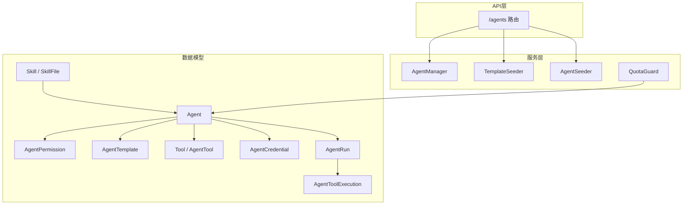

图表来源
- [backend/app/models/agent.py:19-180](file://backend/app/models/agent.py#L19-L180)
- [backend/app/models/tool.py:13-63](file://backend/app/models/tool.py#L13-L63)
- [backend/app/models/skill.py:13-44](file://backend/app/models/skill.py#L13-L44)
- [backend/app/models/agent_credential.py:18-78](file://backend/app/models/agent_credential.py#L18-L78)
- [backend/app/models/agent_run.py:27-195](file://backend/app/models/agent_run.py#L27-L195)
- [backend/app/models/agent_tool_execution.py:25-119](file://backend/app/models/agent_tool_execution.py#L25-L119)
- [backend/app/services/agent_manager.py:51-376](file://backend/app/services/agent_manager.py#L51-L376)
- [backend/app/services/template_seeder.py:275-339](file://backend/app/services/template_seeder.py#L275-L339)
- [backend/app/services/agent_seeder.py:264-421](file://backend/app/services/agent_seeder.py#L264-L421)
- [backend/app/api/agents.py:142-198](file://backend/app/api/agents.py#L142-L198)

章节来源
- [backend/app/models/agent.py:19-180](file://backend/app/models/agent.py#L19-L180)
- [backend/app/models/tool.py:13-63](file://backend/app/models/tool.py#L13-L63)
- [backend/app/models/skill.py:13-44](file://backend/app/models/skill.py#L13-L44)
- [backend/app/models/agent_credential.py:18-78](file://backend/app/models/agent_credential.py#L18-L78)
- [backend/app/models/agent_run.py:27-195](file://backend/app/models/agent_run.py#L27-L195)
- [backend/app/models/agent_tool_execution.py:25-119](file://backend/app/models/agent_tool_execution.py#L25-L119)
- [backend/app/services/agent_manager.py:51-376](file://backend/app/services/agent_manager.py#L51-L376)
- [backend/app/services/template_seeder.py:275-339](file://backend/app/services/template_seeder.py#L275-L339)
- [backend/app/services/agent_seeder.py:264-421](file://backend/app/services/agent_seeder.py#L264-L421)
- [backend/app/api/agents.py:142-198](file://backend/app/api/agents.py#L142-L198)

## 核心组件
- Agent：数字员工实例，包含身份、归属、运行时状态、LLM 配置、自治策略、配额、心跳、时区、模板引用、访问模式等。
- AgentPermission：细粒度访问控制（公司/部门/用户范围，use/manage 级别）。
- AgentTemplate：快速创建 Agent 的模板，支持内置/文件夹模板合并、能力要点、默认技能与 MCP 服务器。
- Tool/AgentTool：工具定义与 Agent 绑定，支持内置与 MCP 类型，按 Agent 维度启用与覆盖配置。
- Skill/SkillFile：技能包定义与文件集合，用于注入到 Agent 工作空间。
- AgentCredential：平台会话凭据（加密 cookies），用于自动登录态注入。
- AgentRun/AgentToolExecution：运行记录与工具调用的幂等账本，支撑可观测性与重试控制。

章节来源
- [backend/app/models/agent.py:19-180](file://backend/app/models/agent.py#L19-L180)
- [backend/app/models/tool.py:13-63](file://backend/app/models/tool.py#L13-L63)
- [backend/app/models/skill.py:13-44](file://backend/app/models/skill.py#L13-L44)
- [backend/app/models/agent_credential.py:18-78](file://backend/app/models/agent_credential.py#L18-L78)
- [backend/app/models/agent_run.py:27-195](file://backend/app/models/agent_run.py#L27-L195)
- [backend/app/models/agent_tool_execution.py:25-119](file://backend/app/models/agent_tool_execution.py#L25-L119)

## 架构总览
下图展示从 API 到数据模型与服务的关键交互，包括模板选择、文件初始化、容器启动、权限校验与租户隔离。

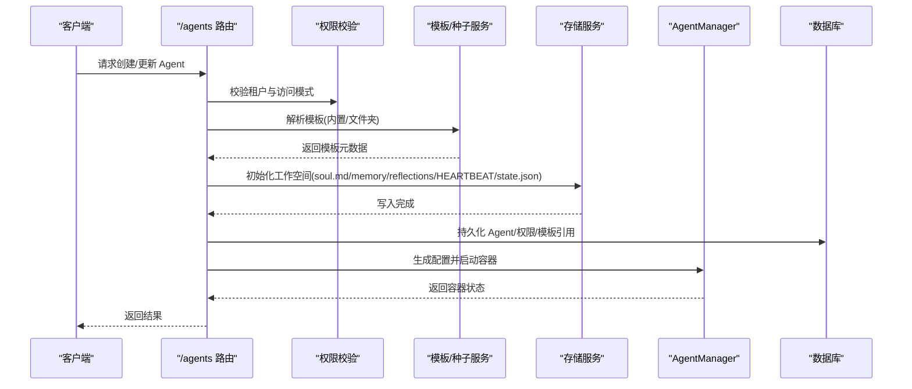

图表来源
- [backend/app/api/agents.py:142-198](file://backend/app/api/agents.py#L142-L198)
- [backend/app/core/permissions.py:481-518](file://backend/app/core/permissions.py#L481-L518)
- [backend/app/services/template_seeder.py:275-339](file://backend/app/services/template_seeder.py#L275-L339)
- [backend/app/services/agent_manager.py:230-316](file://backend/app/services/agent_manager.py#L230-L316)

## 详细组件分析

### Agent 实体与权限模型
- Agent 关键字段：
  - 身份与归属：id、name、creator_id、tenant_id、agent_type、api_key_hash
  - 运行时：status、container_id、container_port、last_active_at、deleted_at
  - LLM 配置：primary_model_id、fallback_model_id、context_window_size、max_tool_rounds
  - 自治策略：autonomy_policy（读/写/外部写入等分级 L1/L2/L3）
  - 配额与限流：tokens_used_*、llm_calls_today、max_llm_calls_per_day、max_triggers、webhook_rate_limit
  - 心跳与时区：heartbeat_enabled、heartbeat_interval_minutes、heartbeat_active_hours、timezone
  - 模板与访问：template_id、access_mode（company/private/custom）、company_access_level
  - 过期控制：expires_at、is_expired、is_system
- AgentPermission：scope_type（company/department/user）、scope_id、access_level（use/manage）
- AgentTemplate：name、description、icon、category、soul_template、default_skills、default_mcp_servers、default_autonomy_policy、capability_bullets、is_builtin

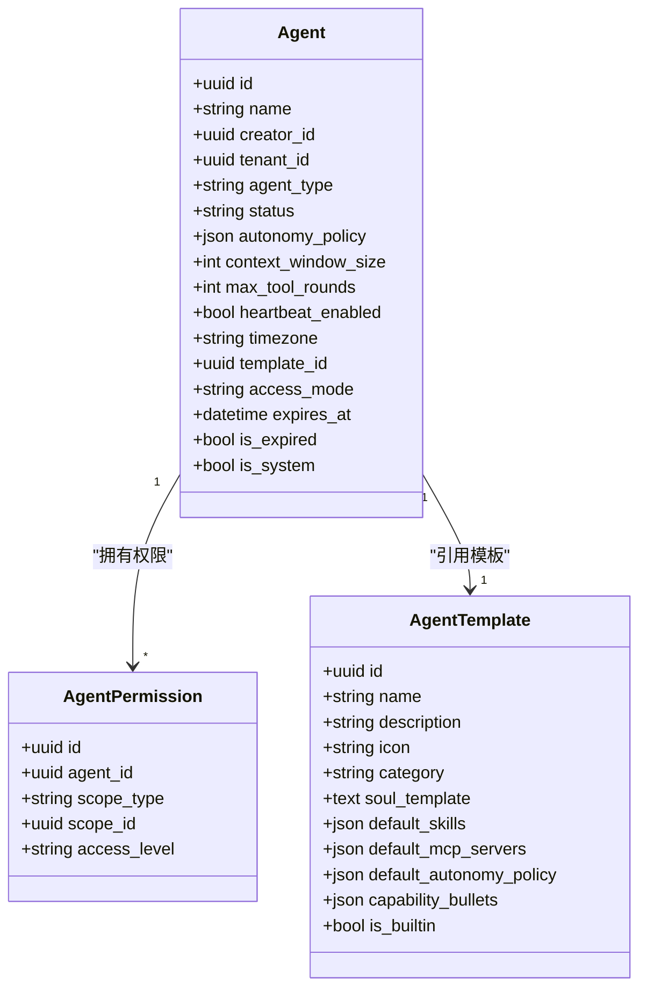

图表来源
- [backend/app/models/agent.py:19-180](file://backend/app/models/agent.py#L19-L180)

章节来源
- [backend/app/models/agent.py:19-180](file://backend/app/models/agent.py#L19-L180)
- [backend/app/core/permissions.py:44-92](file://backend/app/core/permissions.py#L44-L92)

### 凭据模型（AgentCredential）
- 用途：为特定平台保存加密浏览器 cookies，避免明文密码，自动注入新浏览器会话
- 关键字段：credential_type、platform、display_name、cookies_json（加密）、status（active/expired/needs_relogin）、时间戳
- 安全：响应 Schema 中不暴露 cookies_json，仅返回 has_cookies 标志

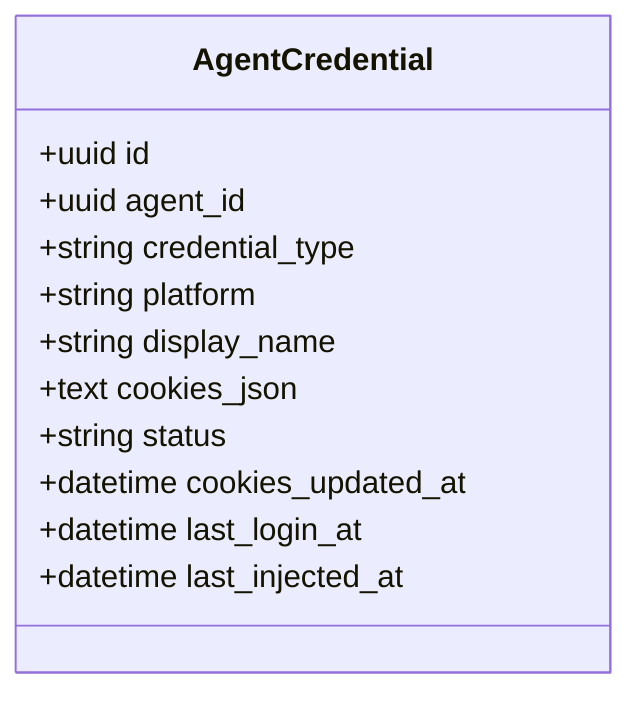

图表来源
- [backend/app/models/agent_credential.py:18-78](file://backend/app/models/agent_credential.py#L18-L78)
- [backend/app/schemas/agent_credential.py:32-52](file://backend/app/schemas/agent_credential.py#L32-L52)

章节来源
- [backend/app/models/agent_credential.py:18-78](file://backend/app/models/agent_credential.py#L18-L78)
- [backend/app/schemas/agent_credential.py:13-52](file://backend/app/schemas/agent_credential.py#L13-L52)

### 技能包模型（Skill/SkillFile）
- Skill：全局注册的技能定义，含名称、描述、分类、图标、folder_name、是否内置/默认
- SkillFile：技能包内文件（SKILL.md、脚本等），path 与 content 存储

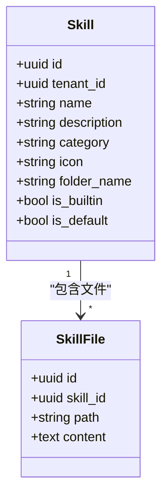

图表来源
- [backend/app/models/skill.py:13-44](file://backend/app/models/skill.py#L13-L44)

章节来源
- [backend/app/models/skill.py:13-44](file://backend/app/models/skill.py#L13-L44)

### 工具模型（Tool/AgentTool）
- Tool：工具定义（builtin/mcp），含显示名、描述、分类、图标、parameters_schema、config/config_schema、MCP 字段、enabled/is_default/source、tenant_id
- AgentTool：Agent 与 Tool 的关联表，支持 per-agent 覆盖配置与来源标记

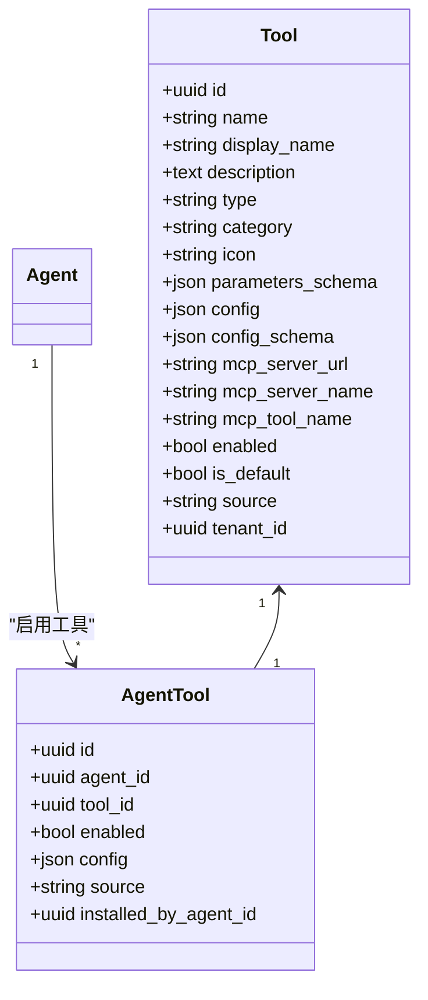

图表来源
- [backend/app/models/tool.py:13-63](file://backend/app/models/tool.py#L13-L63)

章节来源
- [backend/app/models/tool.py:13-63](file://backend/app/models/tool.py#L13-L63)

### 运行与执行记录（AgentRun/AgentToolExecution）
- AgentRun：不可变运行事实，包含来源类型、目标会话、父/根运行、模型、图名/版本、调度队列、投递状态等
- AgentToolExecution：工具调用的幂等账本，记录 effect、retry_policy、attempt_count、result_ref/result_metadata、租约等

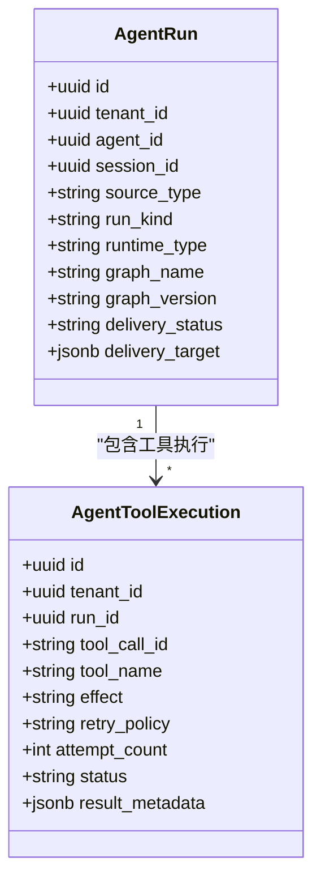

图表来源
- [backend/app/models/agent_run.py:27-195](file://backend/app/models/agent_run.py#L27-L195)
- [backend/app/models/agent_tool_execution.py:25-119](file://backend/app/models/agent_tool_execution.py#L25-L119)

章节来源
- [backend/app/models/agent_run.py:27-195](file://backend/app/models/agent_run.py#L27-L195)
- [backend/app/models/agent_tool_execution.py:25-119](file://backend/app/models/agent_tool_execution.py#L25-L119)

### 生命周期管理（AgentManager）
- 职责：根据模板初始化 Agent 工作空间（soul.md、memory、reflections、HEARTBEAT、state.json），生成 OpenClaw 配置，启动/停止/删除容器，查询容器状态
- 关键点：
  - 模板渲染：替换占位符（名称、创建者、日期），插入 Personality/Boundaries 段落
  - 存储后端：统一通过 storage 接口读写，支持本地/对象存储
  - 容器启动：分配端口、挂载卷、设置环境变量与标签，更新 Agent 状态

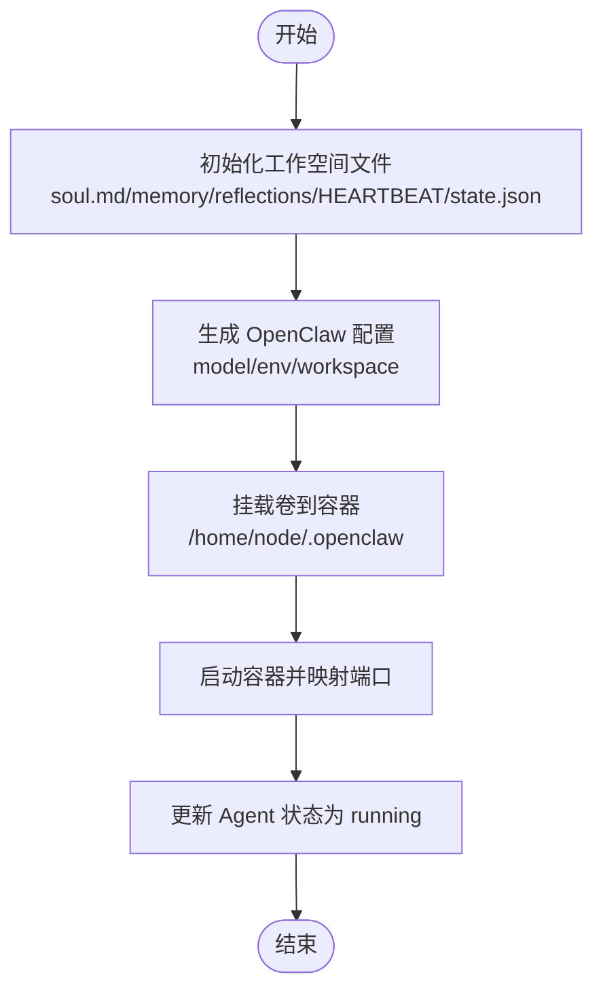

图表来源
- [backend/app/services/agent_manager.py:94-228](file://backend/app/services/agent_manager.py#L94-L228)
- [backend/app/services/agent_manager.py:230-316](file://backend/app/services/agent_manager.py#L230-L316)

章节来源
- [backend/app/services/agent_manager.py:94-316](file://backend/app/services/agent_manager.py#L94-L316)

### 模板系统与动态加载
- 模板来源：
  - 内置 Python 模板（历史兼容）
  - 文件夹模板（meta.yaml + soul.md），优先覆盖同名内置模板
- 启动时合并与 upsert，确保模板一致性；删除不再被引用的旧模板
- 创建 Agent 时，基于模板填充 soul_template、default_skills、default_mcp_servers、default_autonomy_policy

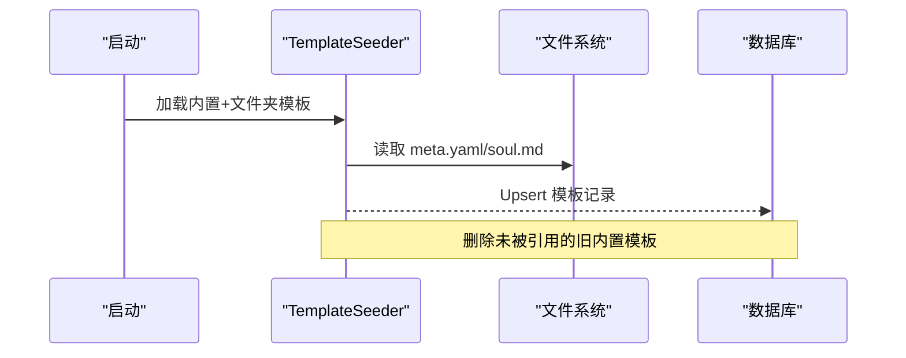

图表来源
- [backend/app/services/template_seeder.py:218-273](file://backend/app/services/template_seeder.py#L218-L273)
- [backend/app/services/template_seeder.py:275-339](file://backend/app/services/template_seeder.py#L275-L339)

章节来源
- [backend/app/services/template_seeder.py:218-339](file://backend/app/services/template_seeder.py#L218-L339)

### 默认实例与工具注入（AgentSeeder）
- 首次启动创建默认 Agent（如 Morty、Meeseeks、OKR Agent），并修复缺失的工作空间
- 自动注入默认工具（is_default=True）与 OKR 专属工具
- 建立系统级触发器（cron），驱动周期性任务

章节来源
- [backend/app/services/agent_seeder.py:264-421](file://backend/app/services/agent_seeder.py#L264-L421)
- [backend/app/services/agent_seeder.py:424-607](file://backend/app/services/agent_seeder.py#L424-L607)

### 权限与多租户隔离
- 访问模式：
  - company：同租户所有活跃用户可用
  - private：仅创建者可管理/使用
  - custom：管理员或显式授权用户可用
- 可见性：build_visible_agents_query 过滤 deleted_at、tenant_id、access_mode、权限
- 使用与管理：can_use_agent/can_manage_agent 区分 use 与 manage 级别
- 过期检查：is_agent_expired 结合 expires_at 与 is_expired 标记

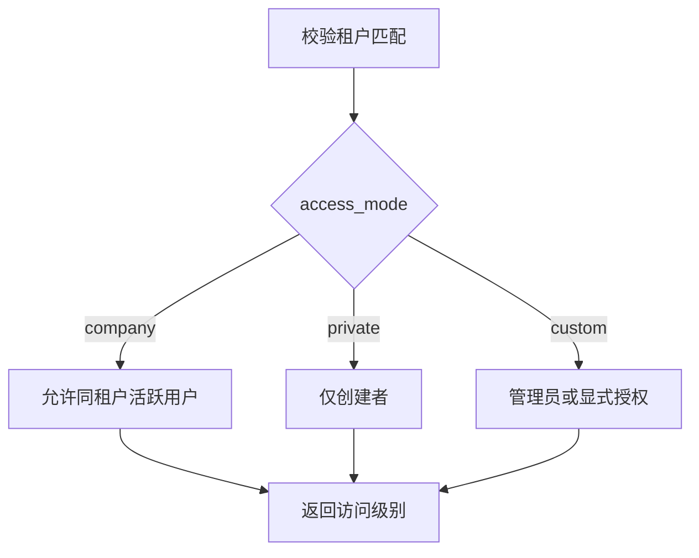

图表来源
- [backend/app/core/permissions.py:213-250](file://backend/app/core/permissions.py#L213-L250)
- [backend/app/core/permissions.py:481-518](file://backend/app/core/permissions.py#L481-L518)
- [backend/app/core/permissions.py:526-533](file://backend/app/core/permissions.py#L526-L533)

章节来源
- [backend/app/core/permissions.py:44-92](file://backend/app/core/permissions.py#L44-L92)
- [backend/app/core/permissions.py:213-250](file://backend/app/core/permissions.py#L213-L250)
- [backend/app/core/permissions.py:481-518](file://backend/app/core/permissions.py#L481-L518)
- [backend/app/core/permissions.py:526-533](file://backend/app/core/permissions.py#L526-L533)

## 依赖关系分析
- 模型间关系：
  - Agent 与 AgentPermission（一对多）
  - Agent 与 AgentTemplate（多对一）
  - Agent 与 Tool/AgentTool（多对多，经 AgentTool 关联）
  - Skill 与 SkillFile（一对多）
  - AgentRun 与 AgentToolExecution（一对多）
- 服务依赖：
  - AgentManager 依赖 Storage、LLM 模型解析、Docker
  - TemplateSeeder 依赖文件系统与数据库
  - AgentSeeder 依赖数据库、Storage、AgentManager、ToolSeeder

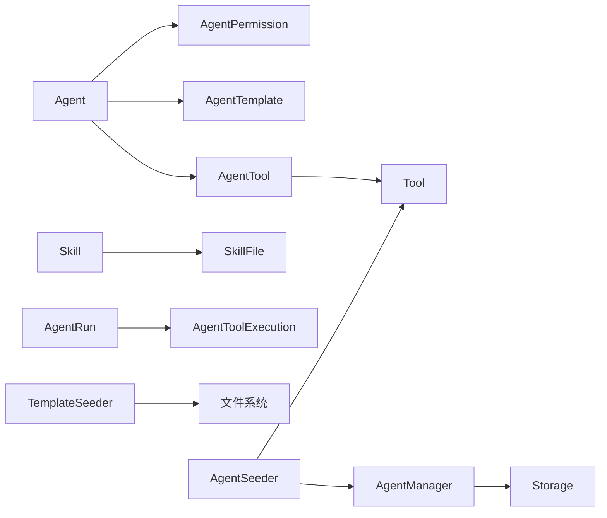

图表来源
- [backend/app/models/agent.py:148-160](file://backend/app/models/agent.py#L148-L160)
- [backend/app/models/tool.py:51-63](file://backend/app/models/tool.py#L51-L63)
- [backend/app/models/skill.py:30-44](file://backend/app/models/skill.py#L30-L44)
- [backend/app/models/agent_run.py:162-195](file://backend/app/models/agent_run.py#L162-L195)
- [backend/app/services/agent_manager.py:14-21](file://backend/app/services/agent_manager.py#L14-L21)
- [backend/app/services/template_seeder.py:14-21](file://backend/app/services/template_seeder.py#L14-L21)
- [backend/app/services/agent_seeder.py:12-24](file://backend/app/services/agent_seeder.py#L12-L24)

章节来源
- [backend/app/models/agent.py:148-160](file://backend/app/models/agent.py#L148-L160)
- [backend/app/models/tool.py:51-63](file://backend/app/models/tool.py#L51-L63)
- [backend/app/models/skill.py:30-44](file://backend/app/models/skill.py#L30-L44)
- [backend/app/models/agent_run.py:162-195](file://backend/app/models/agent_run.py#L162-L195)
- [backend/app/services/agent_manager.py:14-21](file://backend/app/services/agent_manager.py#L14-L21)
- [backend/app/services/template_seeder.py:14-21](file://backend/app/services/template_seeder.py#L14-L21)
- [backend/app/services/agent_seeder.py:12-24](file://backend/app/services/agent_seeder.py#L12-L24)

## 性能考虑
- 索引设计：
  - agents.active_tenant_created_at 复合索引加速按租户与时间的查询
  - agent_runs 的多项索引（tenant/thread/created_at/session/parent/root/source/lane）优化运行与调度查询
  - agent_tool_executions 的状态与租约索引提升重试与并发处理效率
- 存储后端：
  - 使用统一 storage 接口，支持并行写入模板文件，减少初始化耗时
- 容器管理：
  - 按需分配端口与只读/读写卷，避免不必要的资源占用
- 配额与限流：
  - 日/月计数器懒重置，降低频繁写库开销

章节来源
- [backend/app/models/agent.py:26-33](file://backend/app/models/agent.py#L26-L33)
- [backend/app/models/agent_run.py:162-195](file://backend/app/models/agent_run.py#L162-L195)
- [backend/app/models/agent_tool_execution.py:54-61](file://backend/app/models/agent_tool_execution.py#L54-L61)
- [backend/app/services/agent_manager.py:106-125](file://backend/app/services/agent_manager.py#L106-L125)

## 故障排查指南
- 容器启动失败：
  - 检查 Docker 可用性、端口冲突、卷挂载权限
  - 查看 AgentManager 日志与 Agent.status 是否为 error
- 模板未生效：
  - 确认 TemplateSeeder 已运行，meta.yaml/soul.md 存在且字段完整
  - 检查 Agent.template_id 是否正确指向模板
- 权限问题：
  - 验证 access_mode 与 AgentPermission 记录
  - 使用 can_use_agent/can_manage_agent 判断访问级别
- 过期与心跳：
  - 检查 expires_at、is_expired、heartbeat_enabled、heartbeat_active_hours
  - QuotaGuard.check_agent_expired 会抛出 AgentExpired 异常

章节来源
- [backend/app/services/agent_manager.py:250-316](file://backend/app/services/agent_manager.py#L250-L316)
- [backend/app/services/template_seeder.py:275-339](file://backend/app/services/template_seeder.py#L275-L339)
- [backend/app/core/permissions.py:481-518](file://backend/app/core/permissions.py#L481-L518)
- [backend/app/services/quota_guard.py:87-111](file://backend/app/services/quota_guard.py#L87-L111)

## 结论
Clawith 平台的 Agent 核心模型以强约束的 ORM 模型为基础，配合模板系统、凭据管理、工具绑定与运行记录，形成完整的数字员工生命周期管理能力。通过 RBAC 与租户隔离，平台实现了安全的权限控制与多租户数据隔离。AgentManager 与 TemplateSeeder/AgentSeeder 协同完成环境初始化与容器编排，保障 Agent 的可部署性与可观测性。

## 附录：数据操作示例与最佳实践
- 创建 Agent（数据流参考）
  - API：/agents 路由（模板列表、创建入口）
  - 步骤：校验权限 → 解析模板 → 初始化工作空间 → 持久化 Agent/权限 → 启动容器
  - 参考路径：[backend/app/api/agents.py:142-198](file://backend/app/api/agents.py#L142-L198)、[backend/app/services/agent_manager.py:94-228](file://backend/app/services/agent_manager.py#L94-L228)
- 配置 Agent（参数存储）
  - 更新 autonomy_policy、context_window_size、max_tool_rounds、heartbeat_*、timezone、expires_at
  - 参考路径：[backend/app/schemas/schemas.py:304-338](file://backend/app/schemas/schemas.py#L304-L338)
- 启停 Agent（生命周期）
  - 启动：generate openclaw.json → 挂载卷 → 启动容器 → 更新状态
  - 停止/移除：stop/remove container → 清理状态
  - 参考路径：[backend/app/services/agent_manager.py:230-356](file://backend/app/services/agent_manager.py#L230-L356)
- 技能包管理
  - 新增 Skill/SkillFile → 在 Agent 工作空间 skills 目录下注入 → 重启生效
  - 参考路径：[backend/app/models/skill.py:13-44](file://backend/app/models/skill.py#L13-L44)
- 工具调用权限控制
  - 通过 autonomy_policy 限制 read/write/external_write 等级
  - 通过 AgentTool.config 进行 per-agent 覆盖
  - 参考路径：[backend/app/models/tool.py:13-63](file://backend/app/models/tool.py#L13-L63)、[backend/app/models/agent.py:66-81](file://backend/app/models/agent.py#L66-L81)
- 多租户与权限隔离
  - 强制 tenant_id 匹配，access_mode 控制可见性与使用范围
  - 参考路径：[backend/app/core/permissions.py:213-250](file://backend/app/core/permissions.py#L213-L250)

章节来源
- [backend/app/api/agents.py:142-198](file://backend/app/api/agents.py#L142-L198)
- [backend/app/services/agent_manager.py:94-356](file://backend/app/services/agent_manager.py#L94-L356)
- [backend/app/schemas/schemas.py:304-338](file://backend/app/schemas/schemas.py#L304-L338)
- [backend/app/models/skill.py:13-44](file://backend/app/models/skill.py#L13-L44)
- [backend/app/models/tool.py:13-63](file://backend/app/models/tool.py#L13-L63)
- [backend/app/models/agent.py:66-81](file://backend/app/models/agent.py#L66-L81)
- [backend/app/core/permissions.py:213-250](file://backend/app/core/permissions.py#L213-L250)