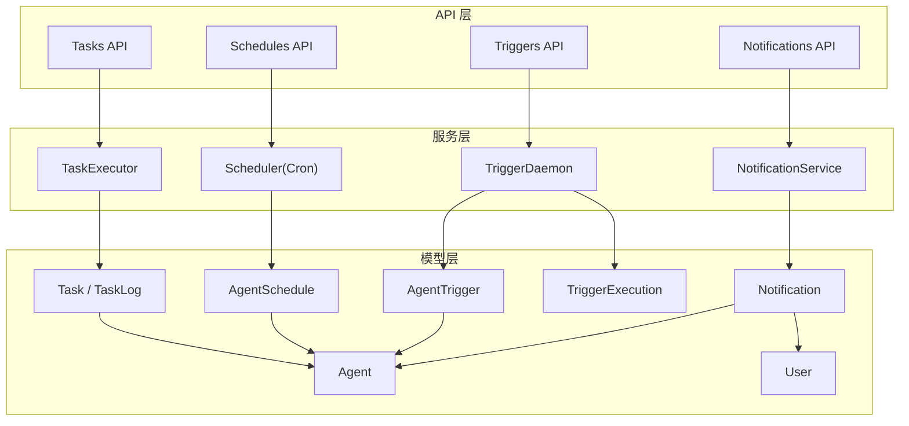
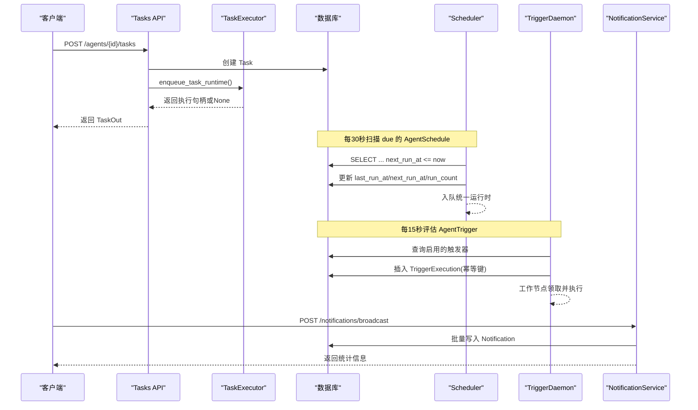
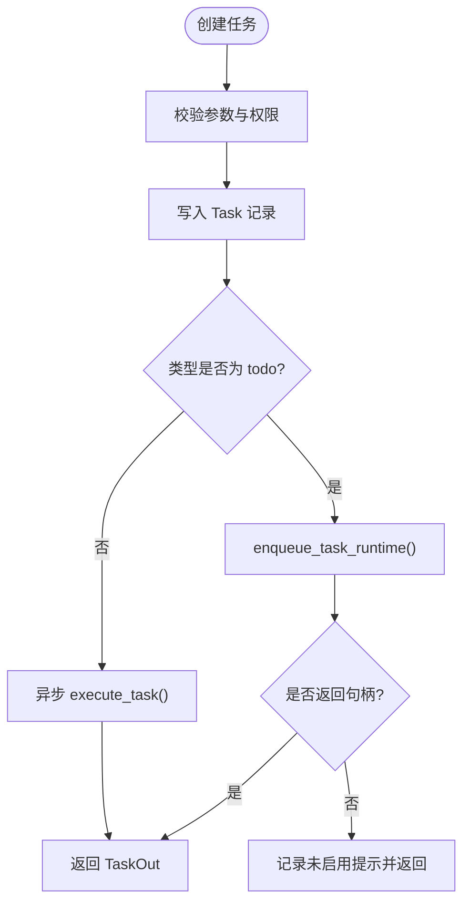
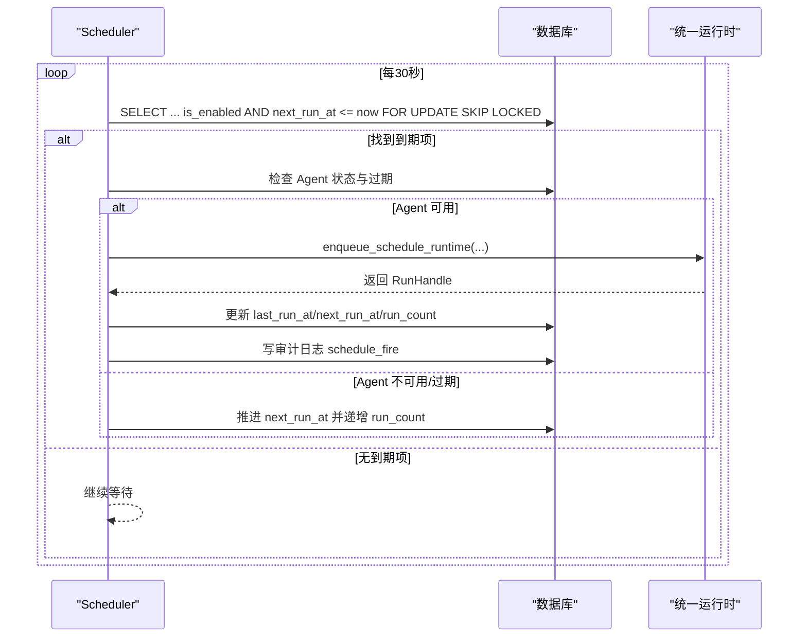
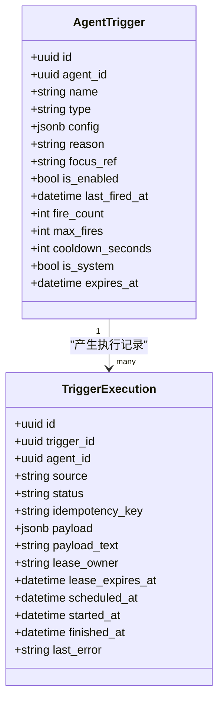
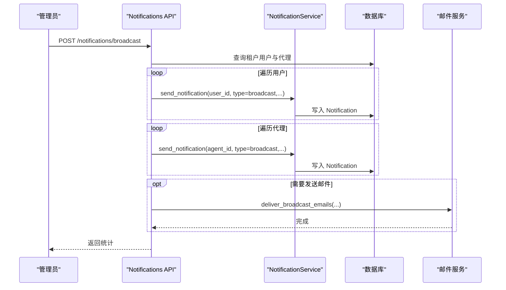
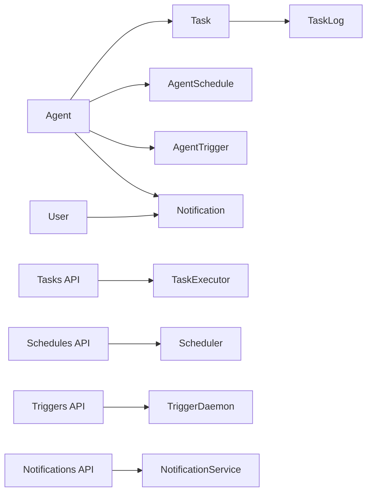

# 业务逻辑模型

<cite>
**本文引用的文件**   
- [task.py](file://backend/app/models/task.py)
- [schedule.py](file://backend/app/models/schedule.py)
- [trigger.py](file://backend/app/models/trigger.py)
- [trigger_execution.py](file://backend/app/models/trigger_execution.py)
- [notification.py](file://backend/app/models/notification.py)
- [agent.py](file://backend/app/models/agent.py)
- [user.py](file://backend/app/models/user.py)
- [tasks.py](file://backend/app/api/tasks.py)
- [schedules.py](file://backend/app/api/schedules.py)
- [triggers.py](file://backend/app/api/triggers.py)
- [notification.py](file://backend/app/api/notification.py)
- [task_executor.py](file://backend/app/services/task_executor.py)
- [scheduler.py](file://backend/app/services/scheduler.py)
- [trigger_daemon.py](file://backend/app/services/trigger_daemon.py)
- [notification_service.py](file://backend/app/services/notification_service.py)
</cite>

## 目录
1. [简介](#简介)
2. [项目结构](#项目结构)
3. [核心组件](#核心组件)
4. [架构总览](#架构总览)
5. [详细组件分析](#详细组件分析)
6. [依赖关系分析](#依赖关系分析)
7. [性能考虑](#性能考虑)
8. [故障排查指南](#故障排查指南)
9. [结论](#结论)
10. [附录](#附录)

## 简介
本文件聚焦 Clawith 平台中与任务调度、触发器系统与通知服务相关的业务数据模型与实现机制，覆盖 Task、AgentSchedule（定时任务）、AgentTrigger（触发器）、TriggerExecution（触发执行记录）与 Notification（通知）等核心实体。文档将解释：
- 任务创建、调度执行、触发器评估与执行的完整数据流
- 事件驱动与异步处理的设计要点
- 监控、错误处理与性能调优方案
- 面向非技术读者的渐进式说明与可视化图示

## 项目结构
围绕“模型—API—服务”的分层组织方式：
- 模型层：定义数据库表结构与关系（Task、AgentSchedule、AgentTrigger、TriggerExecution、Notification 等）
- API 层：提供 REST 接口用于任务的 CRUD、定时任务的编排、触发器的管理与通知的收发
- 服务层：封装后台守护进程与调度器（任务执行入队、Cron 调度、触发器守护、通知发送）

图表来源
- [task.py:1-75](file://backend/app/models/task.py#L1-L75)
- [schedule.py:1-31](file://backend/app/models/schedule.py#L1-L31)
- [trigger.py:1-48](file://backend/app/models/trigger.py#L1-L48)
- [trigger_execution.py:1-42](file://backend/app/models/trigger_execution.py#L1-L42)
- [notification.py:1-31](file://backend/app/models/notification.py#L1-L31)
- [agent.py:1-200](file://backend/app/models/agent.py#L1-L200)
- [user.py:1-119](file://backend/app/models/user.py#L1-L119)
- [tasks.py:1-185](file://backend/app/api/tasks.py#L1-L185)
- [schedules.py:1-247](file://backend/app/api/schedules.py#L1-L247)
- [triggers.py:1-134](file://backend/app/api/triggers.py#L1-L134)
- [notification.py:1-217](file://backend/app/api/notification.py#L1-L217)
- [task_executor.py:1-202](file://backend/app/services/task_executor.py#L1-L202)
- [scheduler.py:1-125](file://backend/app/services/scheduler.py#L1-L125)
- [trigger_daemon.py:1-201](file://backend/app/services/trigger_daemon.py#L1-L201)
- [notification_service.py:1-56](file://backend/app/services/notification_service.py#L1-L56)

章节来源
- [task.py:1-75](file://backend/app/models/task.py#L1-L75)
- [schedule.py:1-31](file://backend/app/models/schedule.py#L1-L31)
- [trigger.py:1-48](file://backend/app/models/trigger.py#L1-L48)
- [trigger_execution.py:1-42](file://backend/app/models/trigger_execution.py#L1-L42)
- [notification.py:1-31](file://backend/app/models/notification.py#L1-L31)
- [agent.py:1-200](file://backend/app/models/agent.py#L1-L200)
- [user.py:1-119](file://backend/app/models/user.py#L1-L119)
- [tasks.py:1-185](file://backend/app/api/tasks.py#L1-L185)
- [schedules.py:1-247](file://backend/app/api/schedules.py#L1-L247)
- [triggers.py:1-134](file://backend/app/api/triggers.py#L1-L134)
- [notification.py:1-217](file://backend/app/api/notification.py#L1-L217)
- [task_executor.py:1-202](file://backend/app/services/task_executor.py#L1-L202)
- [scheduler.py:1-125](file://backend/app/services/scheduler.py#L1-L125)
- [trigger_daemon.py:1-201](file://backend/app/services/trigger_daemon.py#L1-L201)
- [notification_service.py:1-56](file://backend/app/services/notification_service.py#L1-L56)

## 核心组件
- Task/TaskLog：数字员工任务及其进度日志，支持类型（待办/督办）、状态流转、优先级、截止时间与督办字段
- AgentSchedule：基于 cron 的定时任务，维护下次执行时间、运行计数与启用状态
- AgentTrigger：触发器，支持多种类型（cron/once/interval/poll/on_message），具备冷却、限次、过期与系统保护等特性
- TriggerExecution：触发执行记录，支持分布式领取与幂等键，保障重复触发不重复执行
- Notification：通知实体，支持用户/代理双通道接收，分类与已读标记

章节来源
- [task.py:1-75](file://backend/app/models/task.py#L1-L75)
- [schedule.py:1-31](file://backend/app/models/schedule.py#L1-L31)
- [trigger.py:1-48](file://backend/app/models/trigger.py#L1-L48)
- [trigger_execution.py:1-42](file://backend/app/models/trigger_execution.py#L1-L42)
- [notification.py:1-31](file://backend/app/models/notification.py#L1-L31)

## 架构总览
整体采用“API 入参校验 + 服务层异步处理 + 持久化记录”的事件驱动模式：
- 任务创建通过 Tasks API 入队到统一运行时或异步执行
- 定时任务由 Scheduler 每 30 秒扫描 due 条目并排队执行
- 触发器由 TriggerDaemon 每 15 秒评估条件，符合条件的生成 TriggerExecution 并由工作节点领取执行
- 通知通过 NotificationService 写入数据库，广播场景支持邮件异步投递

图表来源
- [tasks.py:62-107](file://backend/app/api/tasks.py#L62-L107)
- [task_executor.py:42-121](file://backend/app/services/task_executor.py#L42-L121)
- [scheduler.py:27-116](file://backend/app/services/scheduler.py#L27-L116)
- [trigger_daemon.py:107-172](file://backend/app/services/trigger_daemon.py#L107-L172)
- [notification.py:122-217](file://backend/app/api/notification.py#L122-L217)

## 详细组件分析

### 任务模型与执行流程（Task/TaskLog）
- 数据结构要点
  - 主键 id、关联 agent_id、标题/描述、类型枚举（todo/supervision）、状态枚举（pending/doing/done）、优先级、创建人、截止时间
  - 督办扩展字段：目标用户ID/名称、渠道、提醒计划
  - 审计字段：created_at/updated_at/completed_at
  - 关系：与 Agent、User、TaskLog 关联
- 执行流程
  - 创建任务时，若类型为 todo，则尝试入队统一运行时；否则回退为异步执行
  - 执行失败时，写入 TaskLog 错误日志
  - 手动触发接口用于测试督办任务执行

图表来源
- [tasks.py:62-107](file://backend/app/api/tasks.py#L62-L107)
- [task_executor.py:163-194](file://backend/app/services/task_executor.py#L163-L194)

章节来源
- [task.py:13-57](file://backend/app/models/task.py#L13-L57)
- [task.py:59-70](file://backend/app/models/task.py#L59-L70)
- [tasks.py:62-107](file://backend/app/api/tasks.py#L62-L107)
- [task_executor.py:42-121](file://backend/app/services/task_executor.py#L42-L121)

### 定时任务模型与调度（AgentSchedule）
- 数据结构要点
  - 主键 id、agent_id、名称、指令、cron 表达式、启用状态、上次/下次执行时间、运行计数、创建人
- 调度机制
  - Scheduler 每 30 秒扫描因到期（next_run_at <= now）且启用的记录
  - 对不可用或过期的 Agent 跳过执行并推进下次时间
  - 成功入队后更新 last_run_at/next_run_at/run_count，并写审计日志

图表来源
- [schedule.py:13-31](file://backend/app/models/schedule.py#L13-L31)
- [scheduler.py:27-116](file://backend/app/services/scheduler.py#L27-L116)

章节来源
- [schedule.py:13-31](file://backend/app/models/schedule.py#L13-L31)
- [scheduler.py:27-116](file://backend/app/services/scheduler.py#L27-L116)
- [schedules.py:81-109](file://backend/app/api/schedules.py#L81-L109)

### 触发器模型与执行（AgentTrigger/TriggerExecution）
- 数据结构要点
  - AgentTrigger：类型（cron/once/interval/poll/on_message）、配置 JSONB、原因、焦点引用、启用状态、最后触发时间、触发计数、最大触发次数、冷却秒数、系统标志、过期时间
  - TriggerExecution：触发器 ID、Agent ID、来源、状态、幂等键、负载、租约拥有者与过期时间、计划/开始/结束时间、错误信息
- 执行机制
  - TriggerDaemon 每 15 秒评估启用的触发器，按类型计算是否到期
  - on_message 类型具备按 Agent 维度的速率限制（每小时最多 N 次），超限自动禁用
  - 符合条件则入队 TriggerExecution，由工作节点领取执行，保证幂等

图表来源
- [trigger.py:13-48](file://backend/app/models/trigger.py#L13-L48)
- [trigger_execution.py:13-42](file://backend/app/models/trigger_execution.py#L13-L42)

章节来源
- [trigger.py:13-48](file://backend/app/models/trigger.py#L13-L48)
- [trigger_execution.py:13-42](file://backend/app/models/trigger_execution.py#L13-L42)
- [trigger_daemon.py:107-172](file://backend/app/services/trigger_daemon.py#L107-L172)
- [triggers.py:42-134](file://backend/app/api/triggers.py#L42-L134)

### 通知模型与服务（Notification）
- 数据结构要点
  - 主键 id、可选 user_id/agent_id、类型（审批/广场/提及/广播/系统等）、标题、正文、链接、关联对象 ID、发送者名称、已读标记、创建时间
- 服务要点
  - send_notification 统一入口，支持用户或代理接收
  - 广播接口支持向租户内所有用户与代理发送，并可异步发送邮件

图表来源
- [notification.py:13-31](file://backend/app/models/notification.py#L13-L31)
- [notification_service.py:12-55](file://backend/app/services/notification_service.py#L12-L55)
- [notification.py:122-217](file://backend/app/api/notification.py#L122-L217)

章节来源
- [notification.py:13-31](file://backend/app/models/notification.py#L13-L31)
- [notification_service.py:12-55](file://backend/app/services/notification_service.py#L12-L55)
- [notification.py:122-217](file://backend/app/api/notification.py#L122-L217)

### 概念性概览
- 事件驱动架构：以“任务/触发/通知”为核心事件源，通过 API 入队、服务层异步处理与数据库持久化形成解耦
- 异步任务处理：使用 asyncio.create_task 与后台守护进程（Scheduler/TriggerDaemon）实现高吞吐与低延迟
- 幂等与可靠性：TriggerExecution 的 idempotency_key 与唯一约束确保重复触发不重复执行；任务执行失败记录日志便于追踪

[本节为概念性说明，不直接分析具体文件]

## 依赖关系分析
- 模型间关系
  - Task/AgentSchedule/AgentTrigger 均依赖 Agent（数字员工）
  - Notification 可指向 User 或 Agent
  - TaskLog 依赖 Task
- API 与服务依赖
  - Tasks API 依赖 TaskExecutor
  - Schedules API 依赖 Scheduler
  - Triggers API 依赖 TriggerDaemon
  - Notifications API 依赖 NotificationService

图表来源
- [task.py:13-57](file://backend/app/models/task.py#L13-L57)
- [schedule.py:13-31](file://backend/app/models/schedule.py#L13-L31)
- [trigger.py:13-48](file://backend/app/models/trigger.py#L13-L48)
- [notification.py:13-31](file://backend/app/models/notification.py#L13-L31)
- [agent.py:19-160](file://backend/app/models/agent.py#L19-L160)
- [user.py:52-119](file://backend/app/models/user.py#L52-L119)
- [tasks.py:1-185](file://backend/app/api/tasks.py#L1-L185)
- [schedules.py:1-247](file://backend/app/api/schedules.py#L1-L247)
- [triggers.py:1-134](file://backend/app/api/triggers.py#L1-L134)
- [notification.py:1-217](file://backend/app/api/notification.py#L1-L217)

章节来源
- [agent.py:19-160](file://backend/app/models/agent.py#L19-L160)
- [user.py:52-119](file://backend/app/models/user.py#L52-L119)
- [task.py:13-57](file://backend/app/models/task.py#L13-L57)
- [schedule.py:13-31](file://backend/app/models/schedule.py#L13-L31)
- [trigger.py:13-48](file://backend/app/models/trigger.py#L13-L48)
- [notification.py:13-31](file://backend/app/models/notification.py#L13-L31)

## 性能考虑
- 数据库索引与锁
  - TriggerExecution 针对 status 与 scheduled_at 建立复合索引，提升领取效率
  - Scheduler 使用 FOR UPDATE SKIP LOCKED 避免并发争抢
- 去重与限流
  - TriggerExecution 的 (trigger_id, idempotency_key) 唯一约束防止重复执行
  - on_message 触发器按 Agent 维度进行速率限制，超限自动禁用
- 批处理与批量加载
  - Tasks/Schedules API 在返回列表时批量加载用户名，减少 N+1 查询
- 后台任务隔离
  - Scheduler/TriggerDaemon 独立循环，避免阻塞请求线程
- 建议优化
  - 对高频查询字段（如 tasks.agent_id、notifications.user_id）确认索引命中
  - 合理设置冷却时间与最大触发次数，避免风暴
  - 监控数据库连接池与慢查询，必要时引入缓存层

[本节提供通用指导，不直接分析具体文件]

## 故障排查指南
- 任务执行失败
  - 查看 TaskLog 中的错误日志，定位登记失败原因（如缺少租户/模型配置）
  - 检查统一运行时是否启用，以及 Agent 状态与过期情况
- 定时任务未执行
  - 检查 cron 表达式合法性与 next_run_at 计算结果
  - 确认 Agent 状态与过期控制，避免被跳过
- 触发器未触发
  - 检查 is_enabled、expires_at、cooldown_seconds 与 rate limit 策略
  - 查看 TriggerExecution 的状态与错误信息
- 通知未送达
  - 检查 Notification 记录是否存在，确认类型与目标（user/agent）
  - 广播邮件需确认系统邮件配置

章节来源
- [task_executor.py:196-202](file://backend/app/services/task_executor.py#L196-L202)
- [scheduler.py:114-116](file://backend/app/services/scheduler.py#L114-L116)
- [trigger_daemon.py:170-172](file://backend/app/services/trigger_daemon.py#L170-L172)
- [notification.py:122-217](file://backend/app/api/notification.py#L122-L217)

## 结论
Clawith 的任务调度、触发器与通知体系以清晰的模型定义与分层架构为基础，结合事件驱动与异步处理，实现了高可靠、可扩展的业务能力。通过合理的幂等设计、限流策略与后台守护进程，平台能够在复杂场景下保持稳定与高效。建议在部署与运维中关注索引、限流与监控指标，持续优化性能与稳定性。

[本节为总结性内容，不直接分析具体文件]

## 附录
- 关键数据操作示例（路径指引）
  - 创建任务：参考 [tasks.py:62-107](file://backend/app/api/tasks.py#L62-L107)
  - 手动触发任务：参考 [tasks.py:162-185](file://backend/app/api/tasks.py#L162-L185)
  - 创建定时任务：参考 [schedules.py:81-109](file://backend/app/api/schedules.py#L81-L109)
  - 手动触发定时任务：参考 [schedules.py:170-211](file://backend/app/api/schedules.py#L170-L211)
  - 管理触发器：参考 [triggers.py:42-134](file://backend/app/api/triggers.py#L42-L134)
  - 发送通知/广播：参考 [notification.py:122-217](file://backend/app/api/notification.py#L122-L217)
  - 统一通知发送：参考 [notification_service.py:12-55](file://backend/app/services/notification_service.py#L12-L55)
  - 任务执行入队：参考 [task_executor.py:42-121](file://backend/app/services/task_executor.py#L42-L121)
  - Cron 调度循环：参考 [scheduler.py:27-116](file://backend/app/services/scheduler.py#L27-L116)
  - 触发器守护循环：参考 [trigger_daemon.py:107-172](file://backend/app/services/trigger_daemon.py#L107-L172)

[本节为附录，不直接分析具体文件]