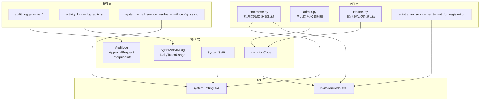
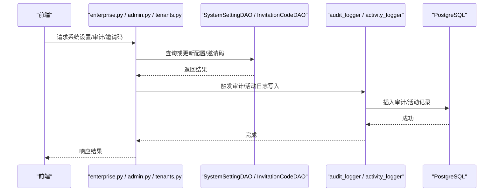
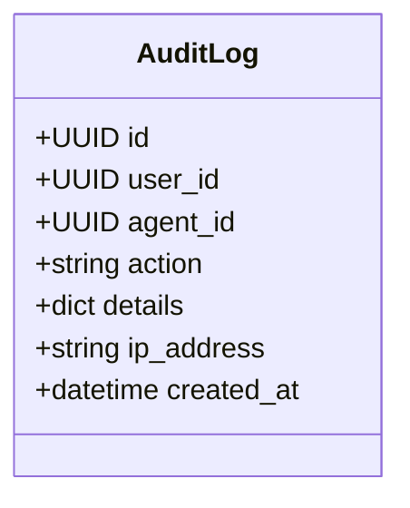
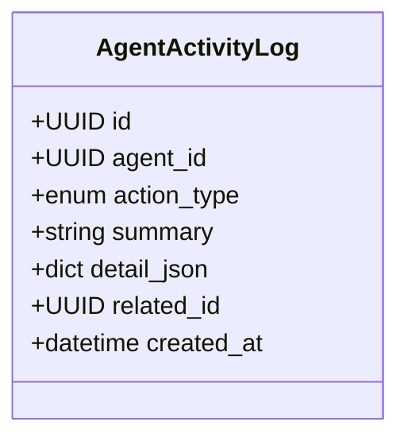
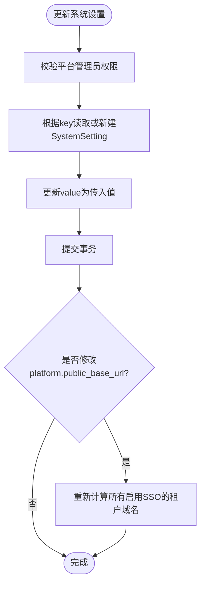
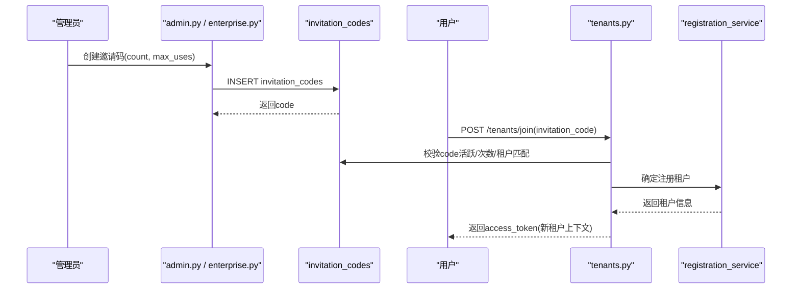
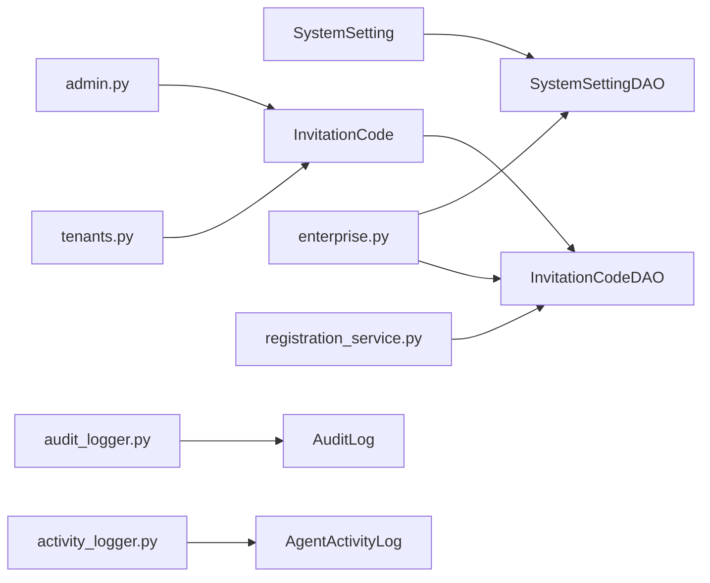

# 企业级功能模型

<cite>
**本文引用的文件**   
- [backend/app/models/audit.py](file://backend/app/models/audit.py)
- [backend/app/models/activity_log.py](file://backend/app/models/activity_log.py)
- [backend/app/models/system_settings.py](file://backend/app/models/system_settings.py)
- [backend/app/models/invitation_code.py](file://backend/app/models/invitation_code.py)
- [backend/app/dao/system_setting_dao.py](file://backend/app/dao/system_setting_dao.py)
- [backend/app/dao/invitation_code_dao.py](file://backend/app/dao/invitation_code_dao.py)
- [backend/app/services/audit_logger.py](file://backend/app/services/audit_logger.py)
- [backend/app/services/activity_logger.py](file://backend/app/services/activity_logger.py)
- [backend/app/api/enterprise.py](file://backend/app/api/enterprise.py)
- [backend/app/api/admin.py](file://backend/app/api/admin.py)
- [backend/app/api/tenants.py](file://backend/app/api/tenants.py)
- [backend/app/services/registration_service.py](file://backend/app/services/registration_service.py)
- [backend/app/services/system_email_service.py](file://backend/app/services/system_email_service.py)
- [backend/alembic/versions/005_add_invitation_codes.py](file://backend/alembic/versions/005_add_invitation_codes.py)
</cite>

## 目录
1. [简介](#简介)
2. [项目结构](#项目结构)
3. [核心组件](#核心组件)
4. [架构总览](#架构总览)
5. [详细组件分析](#详细组件分析)
6. [依赖关系分析](#依赖关系分析)
7. [性能考虑](#性能考虑)
8. [故障排查指南](#故障排查指南)
9. [结论](#结论)
10. [附录：数据操作示例与最佳实践](#附录数据操作示例与最佳实践)

## 简介
本文件面向Clawith平台的企业级功能，聚焦以下数据模型与能力：审计日志（Audit）、活动追踪（ActivityLog）、系统配置管理（SystemSettings）、邀请码机制（InvitationCode）。文档从模型定义、DAO访问层、服务写入器、API路由到前端交互进行系统化说明，覆盖合规性要求、数据安全策略、访问控制机制，并提供大数据量处理与查询优化方案及完整的数据操作示例路径。

## 项目结构
围绕企业级功能的核心代码分布在以下层次：
- 模型层：定义数据库表结构与字段约束
- DAO层：提供类型化的数据访问方法
- 服务层：封装业务逻辑与写入流程（如审计日志写入、活动记录）
- API层：对外暴露REST接口，承载权限校验与事务边界
- 迁移脚本：保证数据库结构演进的可重复性与幂等性

图表来源
- [backend/app/models/audit.py:13-89](file://backend/app/models/audit.py#L13-L89)
- [backend/app/models/activity_log.py:13-57](file://backend/app/models/activity_log.py#L13-L57)
- [backend/app/models/system_settings.py:13-21](file://backend/app/models/system_settings.py#L13-L21)
- [backend/app/models/invitation_code.py:13-26](file://backend/app/models/invitation_code.py#L13-L26)
- [backend/app/dao/system_setting_dao.py:13-44](file://backend/app/dao/system_setting_dao.py#L13-L44)
- [backend/app/dao/invitation_code_dao.py:9-29](file://backend/app/dao/invitation_code_dao.py#L9-L29)
- [backend/app/services/audit_logger.py:68-215](file://backend/app/services/audit_logger.py#L68-L215)
- [backend/app/services/activity_logger.py:12-32](file://backend/app/services/activity_logger.py#L12-L32)
- [backend/app/api/enterprise.py:1081-1116](file://backend/app/api/enterprise.py#L1081-L1116)
- [backend/app/api/admin.py:154-178](file://backend/app/api/admin.py#L154-L178)
- [backend/app/api/tenants.py:253-313](file://backend/app/api/tenants.py#L253-L313)
- [backend/app/services/registration_service.py:343-362](file://backend/app/services/registration_service.py#L343-L362)

章节来源
- [backend/app/models/audit.py:13-89](file://backend/app/models/audit.py#L13-L89)
- [backend/app/models/activity_log.py:13-57](file://backend/app/models/activity_log.py#L13-L57)
- [backend/app/models/system_settings.py:13-21](file://backend/app/models/system_settings.py#L13-L21)
- [backend/app/models/invitation_code.py:13-26](file://backend/app/models/invitation_code.py#L13-L26)

## 核心组件
- 审计日志（AuditLog）：记录用户/代理的关键操作轨迹，支持IP、动作、详情JSON与时间戳索引，便于合规审计与回溯。
- 活动日志（AgentActivityLog）：记录数字员工（Agent）的行为事件，包含动作类型枚举、摘要、详情JSON与关联ID，用于运营分析与排障。
- 系统设置（SystemSetting）：键值型全局配置存储，使用JSONB承载结构化配置，支持动态开关与热更新。
- 邀请码（InvitationCode）：用于注册门禁与租户隔离，支持最大使用次数、活跃状态、租户绑定与创建者追踪。

章节来源
- [backend/app/models/audit.py:13-89](file://backend/app/models/audit.py#L13-L89)
- [backend/app/models/activity_log.py:13-57](file://backend/app/models/activity_log.py#L13-L57)
- [backend/app/models/system_settings.py:13-21](file://backend/app/models/system_settings.py#L13-L21)
- [backend/app/models/invitation_code.py:13-26](file://backend/app/models/invitation_code.py#L13-L26)

## 架构总览
企业级功能的调用链路遵循“API → DAO/Service → Model”的分层模式，关键特性如下：
- 审计写入采用原始SQL直写，避免后台任务中ORM外键解析问题，确保高可用与低耦合。
- 活动日志采用异步会话写入，失败不阻断主流程，保障系统稳定性。
- 系统设置通过DAO封装常用读取方法，配合API实现安全更新与联动处理（如SSO域名重算）。
- 邀请码在注册与加入组织流程中被严格校验，结合系统邮件配置完成邀请发送与门禁控制。

图表来源
- [backend/app/api/enterprise.py:1081-1116](file://backend/app/api/enterprise.py#L1081-L1116)
- [backend/app/dao/system_setting_dao.py:19-44](file://backend/app/dao/system_setting_dao.py#L19-L44)
- [backend/app/dao/invitation_code_dao.py:15-29](file://backend/app/dao/invitation_code_dao.py#L15-L29)
- [backend/app/services/audit_logger.py:68-215](file://backend/app/services/audit_logger.py#L68-L215)
- [backend/app/services/activity_logger.py:12-32](file://backend/app/services/activity_logger.py#L12-L32)

## 详细组件分析

### 审计日志（AuditLog）
- 设计要点
  - 字段：id、user_id、agent_id、action、details(JSON)、ip_address、created_at(索引)
  - 用途：全量操作审计，支撑合规与排障
  - 写入方式：服务层使用原始SQL插入，避免ORM外键解析问题；异常被捕获并记录日志，不影响主流程
- 合规与安全
  - 记录IP与时间戳，便于溯源
  - details支持结构化扩展，便于后续分析
- 典型调用
  - 身份认证相关：write_identity_audit_log
  - 角色相关：write_role_audit_log
  - 租户相关：write_tenant_audit_log
  - 通用：write_audit_log

图表来源
- [backend/app/models/audit.py:13-25](file://backend/app/models/audit.py#L13-L25)
- [backend/app/services/audit_logger.py:68-215](file://backend/app/services/audit_logger.py#L68-L215)

章节来源
- [backend/app/models/audit.py:13-25](file://backend/app/models/audit.py#L13-L25)
- [backend/app/services/audit_logger.py:68-215](file://backend/app/services/audit_logger.py#L68-L215)

### 活动日志（AgentActivityLog）
- 设计要点
  - 字段：id、agent_id、action_type(枚举)、summary、detail_json(JSON)、related_id、created_at(索引)
  - 用途：记录数字员工行为，支持按动作类型统计与排障
- 写入方式
  - 异步会话写入，失败仅记录错误日志，不抛出异常
- 典型场景
  - 聊天回复、工具调用、消息发送、任务创建/更新、定时任务执行、心跳、广场发帖等

图表来源
- [backend/app/models/activity_log.py:13-34](file://backend/app/models/activity_log.py#L13-L34)
- [backend/app/services/activity_logger.py:12-32](file://backend/app/services/activity_logger.py#L12-L32)

章节来源
- [backend/app/models/activity_log.py:13-34](file://backend/app/models/activity_log.py#L13-L34)
- [backend/app/services/activity_logger.py:12-32](file://backend/app/services/activity_logger.py#L12-L32)

### 系统设置（SystemSetting）
- 设计要点
  - 字段：key(主键)、value(JSONB)、updated_at(自动更新)
  - 用途：平台级键值配置，支持布尔开关、复杂对象配置
- DAO封装
  - get_by_key/get_value/is_invitation_code_enabled/is_sso_custom_domain_redirect_enabled
- API更新
  - PUT /enterprise/system-settings/{key}，支持平台管理员权限校验与联动处理（如public_base_url变更时重新生成SSO域名）

图表来源
- [backend/app/models/system_settings.py:13-21](file://backend/app/models/system_settings.py#L13-L21)
- [backend/app/dao/system_setting_dao.py:19-44](file://backend/app/dao/system_setting_dao.py#L19-L44)
- [backend/app/api/enterprise.py:1081-1116](file://backend/app/api/enterprise.py#L1081-L1116)

章节来源
- [backend/app/models/system_settings.py:13-21](file://backend/app/models/system_settings.py#L13-L21)
- [backend/app/dao/system_setting_dao.py:19-44](file://backend/app/dao/system_setting_dao.py#L19-L44)
- [backend/app/api/enterprise.py:1081-1116](file://backend/app/api/enterprise.py#L1081-L1116)

### 邀请码（InvitationCode）
- 设计要点
  - 字段：id、code(唯一索引)、tenant_id(索引)、max_uses、used_count、is_active、created_by、created_at
  - 用途：注册门禁、租户隔离、一次性或多用限制
- DAO封装
  - get_active_by_code：查询活跃且绑定租户的邀请码
- API与流程
  - 管理员创建邀请码（单用默认），注册/加入组织时校验邀请码有效性、使用次数与租户匹配
  - 首次加入空组织的用户自动成为org_admin
  - 系统邮件配置检查：未配置或禁用SMTP时拒绝发送邀请邮件

图表来源
- [backend/app/models/invitation_code.py:13-26](file://backend/app/models/invitation_code.py#L13-L26)
- [backend/app/dao/invitation_code_dao.py:15-29](file://backend/app/dao/invitation_code_dao.py#L15-L29)
- [backend/app/api/admin.py:154-178](file://backend/app/api/admin.py#L154-L178)
- [backend/app/api/tenants.py:253-313](file://backend/app/api/tenants.py#L253-L313)
- [backend/app/services/registration_service.py:343-362](file://backend/app/services/registration_service.py#L343-L362)

章节来源
- [backend/app/models/invitation_code.py:13-26](file://backend/app/models/invitation_code.py#L13-L26)
- [backend/app/dao/invitation_code_dao.py:15-29](file://backend/app/dao/invitation_code_dao.py#L15-L29)
- [backend/app/api/admin.py:154-178](file://backend/app/api/admin.py#L154-L178)
- [backend/app/api/tenants.py:253-313](file://backend/app/api/tenants.py#L253-L313)
- [backend/app/services/registration_service.py:343-362](file://backend/app/services/registration_service.py#L343-L362)

### 系统邮件与邀请联动
- 系统邮件配置通过system_settings中的特定key存储，服务层提供resolve_email_config_async统一解析
- 发送邀请前需确保SMTP已配置且启用，否则返回明确错误提示

章节来源
- [backend/app/services/system_email_service.py:54-60](file://backend/app/services/system_email_service.py#L54-L60)
- [backend/app/api/enterprise.py:1949-1963](file://backend/app/api/enterprise.py#L1949-L1963)

## 依赖关系分析
- 模型与DAO
  - SystemSettingDAO依赖SystemSetting模型，提供键值查询与便捷开关判断
  - InvitationCodeDAO依赖InvitationCode模型，提供活跃码查询
- 服务与模型
  - audit_logger直接插入audit_logs表，绕过ORM外键解析
  - activity_logger通过AgentActivityLog模型写入活动日志
- API与服务
  - enterprise.py负责系统设置更新、审计日志查询、邀请码管理
  - admin.py负责平台设置与公司创建（含邀请码生成）
  - tenants.py负责加入组织与邀请码校验
  - registration_service在注册阶段根据邀请码或邮箱推断租户

图表来源
- [backend/app/models/system_settings.py:13-21](file://backend/app/models/system_settings.py#L13-L21)
- [backend/app/models/invitation_code.py:13-26](file://backend/app/models/invitation_code.py#L13-L26)
- [backend/app/dao/system_setting_dao.py:13-44](file://backend/app/dao/system_setting_dao.py#L13-L44)
- [backend/app/dao/invitation_code_dao.py:9-29](file://backend/app/dao/invitation_code_dao.py#L9-L29)
- [backend/app/api/enterprise.py:1081-1116](file://backend/app/api/enterprise.py#L1081-L1116)
- [backend/app/api/admin.py:154-178](file://backend/app/api/admin.py#L154-L178)
- [backend/app/api/tenants.py:253-313](file://backend/app/api/tenants.py#L253-L313)
- [backend/app/services/registration_service.py:343-362](file://backend/app/services/registration_service.py#L343-L362)
- [backend/app/services/audit_logger.py:68-215](file://backend/app/services/audit_logger.py#L68-L215)
- [backend/app/services/activity_logger.py:12-32](file://backend/app/services/activity_logger.py#L12-L32)

章节来源
- [backend/app/models/system_settings.py:13-21](file://backend/app/models/system_settings.py#L13-L21)
- [backend/app/models/invitation_code.py:13-26](file://backend/app/models/invitation_code.py#L13-L26)
- [backend/app/dao/system_setting_dao.py:13-44](file://backend/app/dao/system_setting_dao.py#L13-L44)
- [backend/app/dao/invitation_code_dao.py:9-29](file://backend/app/dao/invitation_code_dao.py#L9-L29)
- [backend/app/api/enterprise.py:1081-1116](file://backend/app/api/enterprise.py#L1081-L1116)
- [backend/app/api/admin.py:154-178](file://backend/app/api/admin.py#L154-L178)
- [backend/app/api/tenants.py:253-313](file://backend/app/api/tenants.py#L253-L313)
- [backend/app/services/registration_service.py:343-362](file://backend/app/services/registration_service.py#L343-L362)
- [backend/app/services/audit_logger.py:68-215](file://backend/app/services/audit_logger.py#L68-L215)
- [backend/app/services/activity_logger.py:12-32](file://backend/app/services/activity_logger.py#L12-L32)

## 性能考虑
- 审计日志写入
  - 使用原始SQL插入，减少ORM开销与外键解析成本
  - 异常捕获与日志记录，避免影响主流程
- 活动日志写入
  - 异步会话写入，失败不抛异常，适合高频事件记录
- 系统设置查询
  - 基于主键key的精确查找，复杂度O(1)
  - JSONB字段支持高效条件查询与索引（可按需添加GIN索引）
- 邀请码查询
  - 对code建立唯一索引，查询复杂度O(log n)
  - used_count与max_uses比较在应用层完成，避免锁竞争
- 大数据量处理建议
  - 审计日志与活动日志按时间分区或归档，定期清理历史数据
  - 针对高频查询字段（如created_at、agent_id、tenant_id）建立复合索引
  - 批量写入时使用事务合并与批量INSERT，降低网络往返

[本节为通用指导，不直接分析具体文件]

## 故障排查指南
- 审计日志写入失败
  - 现象：后台任务无法写入审计日志
  - 原因：ORM外键解析问题或数据库连接异常
  - 处理：检查audit_logger._write_log异常捕获与日志输出，确认数据库连接与表结构
- 活动日志写入失败
  - 现象：活动记录缺失
  - 原因：数据库写入异常或会话关闭
  - 处理：查看activity_logger的错误日志，确认异步会话生命周期
- 系统设置更新无效
  - 现象：配置未生效
  - 原因：权限不足或未正确提交事务
  - 处理：确认平台管理员权限，检查enterprise.py更新逻辑与事务提交
- 邀请码无效或使用受限
  - 现象：加入组织失败
  - 原因：邀请码不存在、已使用完、非活跃或租户不匹配
  - 处理：检查invitation_codes表状态与tenants.py校验逻辑

章节来源
- [backend/app/services/audit_logger.py:178-215](file://backend/app/services/audit_logger.py#L178-L215)
- [backend/app/services/activity_logger.py:20-32](file://backend/app/services/activity_logger.py#L20-L32)
- [backend/app/api/enterprise.py:1081-1116](file://backend/app/api/enterprise.py#L1081-L1116)
- [backend/app/api/tenants.py:253-313](file://backend/app/api/tenants.py#L253-L313)

## 结论
Clawith平台的企业级功能以清晰的模型分层与严格的访问控制为基础，实现了可审计的操作轨迹、可观测的活动日志、灵活的系统配置管理与安全的邀请码机制。通过DAO与服务层的解耦设计，系统在合规性、安全性与可扩展性方面具备良好基础。针对大数据量场景，建议引入分区、索引优化与批量写入策略，进一步提升性能与稳定性。

[本节为总结性内容，不直接分析具体文件]

## 附录：数据操作示例与最佳实践
- 审计查询
  - 通过enterprise.py提供的审计日志接口，按租户与时间范围筛选，结合前端过滤（如背景任务动作）进行分析
  - 参考路径：[backend/app/api/enterprise.py](file://backend/app/api/enterprise.py)
- 日志分析
  - 使用AgentActivityLog的动作类型枚举进行聚合统计，定位高频操作与异常事件
  - 参考路径：[backend/app/models/activity_log.py](file://backend/app/models/activity_log.py)
- 配置管理
  - 通过PUT /enterprise/system-settings/{key}更新系统设置，注意平台管理员权限与联动处理
  - 参考路径：[backend/app/api/enterprise.py](file://backend/app/api/enterprise.py)
- 邀请码机制
  - 管理员创建邀请码后，用户通过/tenants/join加入组织，系统校验邀请码有效性与租户匹配
  - 参考路径：[backend/app/api/admin.py](file://backend/app/api/admin.py)、[backend/app/api/tenants.py](file://backend/app/api/tenants.py)
- 合规性与数据安全
  - 审计日志记录IP与时间戳，支持溯源与合规审查
  - 系统设置使用JSONB存储，敏感配置应加密或限制访问权限
  - 邀请码唯一且可限制使用次数，防止滥用
- 访问控制机制
  - 平台管理员权限校验（如平台设置更新）
  - 租户级权限校验（如邀请码管理、加入组织）
- 大数据量处理与查询优化
  - 审计日志与活动日志按时间分区，定期归档
  - 针对高频查询字段建立复合索引（如created_at、agent_id、tenant_id）
  - 批量写入使用事务合并与批量INSERT

章节来源
- [backend/app/api/enterprise.py:1081-1116](file://backend/app/api/enterprise.py#L1081-L1116)
- [backend/app/models/activity_log.py:13-57](file://backend/app/models/activity_log.py#L13-L57)
- [backend/app/api/admin.py:154-178](file://backend/app/api/admin.py#L154-L178)
- [backend/app/api/tenants.py:253-313](file://backend/app/api/tenants.py#L253-L313)
- [backend/alembic/versions/005_add_invitation_codes.py:15-34](file://backend/alembic/versions/005_add_invitation_codes.py#L15-L34)