# 工作空间与租户模型

<cite>
**本文引用的文件**   
- [backend/app/models/tenant.py](file://backend/app/models/tenant.py)
- [backend/app/models/tenant_setting.py](file://backend/app/models/tenant_setting.py)
- [backend/app/models/org.py](file://backend/app/models/org.py)
- [backend/app/models/user.py](file://backend/app/models/user.py)
- [backend/app/models/workspace.py](file://backend/app/models/workspace.py)
- [backend/app/models/agent.py](file://backend/app/models/agent.py)
- [backend/app/api/tenants.py](file://backend/app/api/tenants.py)
- [backend/app/core/permissions.py](file://backend/app/core/permissions.py)
- [backend/app/services/quota_guard.py](file://backend/app/services/quota_guard.py)
- [backend/app/services/workspace_paths.py](file://backend/app/services/workspace_paths.py)
</cite>

## 目录
1. [简介](#简介)
2. [项目结构](#项目结构)
3. [核心组件](#核心组件)
4. [架构总览](#架构总览)
5. [详细组件分析](#详细组件分析)
6. [依赖关系分析](#依赖关系分析)
7. [性能考虑](#性能考虑)
8. [故障排查指南](#故障排查指南)
9. [结论](#结论)
10. [附录](#附录)

## 简介
本文件面向Clawith平台的多租户与工作空间数据模型，系统性阐述Tenant（租户）、Organization（组织）、Workspace（工作空间）以及TenantSetting（租户配置）等核心模型的结构定义、多租户隔离策略、权限控制、配额与计费统计支持，并给出租户注册、工作空间创建、权限分配的数据操作示例与优化建议。文档力求兼顾技术深度与可读性，帮助读者快速理解并落地实施。

## 项目结构
围绕多租户与工作空间的代码主要分布在后端模型的声明、API路由、权限校验与配额服务中：
- 模型层：定义租户、组织、用户、Agent、工作空间等实体及字段约束
- API层：提供租户注册、加入、更新、Logo管理、用量统计等接口
- 权限层：基于RBAC与Agent访问模式实现细粒度访问控制
- 配额层：对用户对话、Agent LLM调用、Agent数量等进行限额与过期控制
- 工作空间路径：对Agent工作空间与企业信息目录进行安全解析与隔离

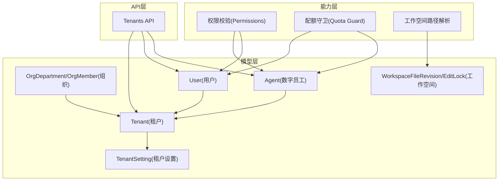

图表来源
- [backend/app/models/tenant.py:1-73](file://backend/app/models/tenant.py#L1-L73)
- [backend/app/models/tenant_setting.py:1-31](file://backend/app/models/tenant_setting.py#L1-L31)
- [backend/app/models/org.py:1-98](file://backend/app/models/org.py#L1-L98)
- [backend/app/models/user.py:1-119](file://backend/app/models/user.py#L1-L119)
- [backend/app/models/agent.py:1-200](file://backend/app/models/agent.py#L1-L200)
- [backend/app/models/workspace.py:1-108](file://backend/app/models/workspace.py#L1-L108)
- [backend/app/api/tenants.py:1-800](file://backend/app/api/tenants.py#L1-L800)
- [backend/app/core/permissions.py:1-554](file://backend/app/core/permissions.py#L1-L554)
- [backend/app/services/quota_guard.py:1-266](file://backend/app/services/quota_guard.py#L1-L266)
- [backend/app/services/workspace_paths.py:1-89](file://backend/app/services/workspace_paths.py#L1-L89)

章节来源
- [backend/app/models/tenant.py:1-73](file://backend/app/models/tenant.py#L1-L73)
- [backend/app/models/tenant_setting.py:1-31](file://backend/app/models/tenant_setting.py#L1-L31)
- [backend/app/models/org.py:1-98](file://backend/app/models/org.py#L1-L98)
- [backend/app/models/user.py:1-119](file://backend/app/models/user.py#L1-L119)
- [backend/app/models/agent.py:1-200](file://backend/app/models/agent.py#L1-L200)
- [backend/app/models/workspace.py:1-108](file://backend/app/models/workspace.py#L1-L108)
- [backend/app/api/tenants.py:1-800](file://backend/app/api/tenants.py#L1-L800)
- [backend/app/core/permissions.py:1-554](file://backend/app/core/permissions.py#L1-L554)
- [backend/app/services/quota_guard.py:1-266](file://backend/app/services/quota_guard.py#L1-L266)
- [backend/app/services/workspace_paths.py:1-89](file://backend/app/services/workspace_paths.py#L1-L89)

## 核心组件
- Tenant（租户）：多租户边界，包含名称、slug、IM集成、默认配额、时区、SSO、A2A开关、默认LLM模型等
- TenantSetting（租户设置）：键值型稀疏配置，用于存储如第三方Token、公司介绍等扩展配置
- Organization（组织）：部门与成员结构，支持从飞书同步，含路径、状态、租户关联
- User（用户）：租户内成员身份，角色、配额、与全局Identity解耦
- Agent（数字员工）：归属租户，具备访问模式、配额、心跳、过期、模板等属性
- Workspace（工作空间）：文件修订与编辑锁，按scope_type区分Agent或Group范围

章节来源
- [backend/app/models/tenant.py:1-73](file://backend/app/models/tenant.py#L1-L73)
- [backend/app/models/tenant_setting.py:1-31](file://backend/app/models/tenant_setting.py#L1-L31)
- [backend/app/models/org.py:1-98](file://backend/app/models/org.py#L1-L98)
- [backend/app/models/user.py:1-119](file://backend/app/models/user.py#L1-L119)
- [backend/app/models/agent.py:1-200](file://backend/app/models/agent.py#L1-L200)
- [backend/app/models/workspace.py:1-108](file://backend/app/models/workspace.py#L1-L108)

## 架构总览
下图展示多租户与工作空间的核心交互：API路由负责租户注册、加入、更新与Logo管理；权限模块确保跨租户隔离与Agent访问控制；配额守卫限制对话、LLM调用与Agent数量；工作空间路径解析保障Agent工作空间与企业信息目录的安全访问。

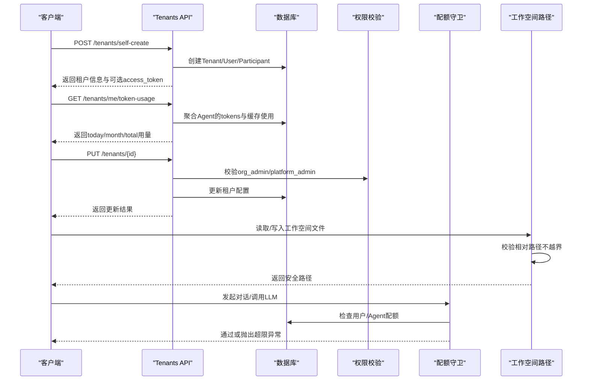

图表来源
- [backend/app/api/tenants.py:152-237](file://backend/app/api/tenants.py#L152-L237)
- [backend/app/api/tenants.py:488-525](file://backend/app/api/tenants.py#L488-L525)
- [backend/app/api/tenants.py:549-578](file://backend/app/api/tenants.py#L549-L578)
- [backend/app/services/workspace_paths.py:21-48](file://backend/app/services/workspace_paths.py#L21-L48)
- [backend/app/services/quota_guard.py:30-83](file://backend/app/services/quota_guard.py#L30-L83)
- [backend/app/services/quota_guard.py:121-174](file://backend/app/services/quota_guard.py#L121-L174)

## 详细组件分析

### 租户模型（Tenant）
- 关键字段：name、slug（唯一索引）、im_provider、im_config（JSON）、is_active、默认配额（消息、Agent数、TTL、LLM日调用）、心跳下限、时区、国家地区、SSO开关与域名、A2A异步开关、默认LLM模型
- 用途：作为多租户隔离边界，所有Agent、User、Org数据均通过tenant_id关联
- 特性：logo_url由im_config动态生成，便于前端统一获取

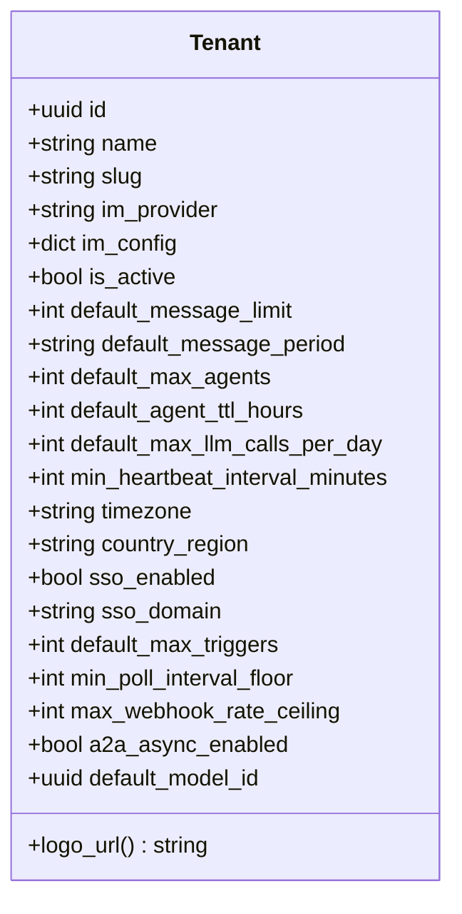

图表来源
- [backend/app/models/tenant.py:13-73](file://backend/app/models/tenant.py#L13-L73)

章节来源
- [backend/app/models/tenant.py:13-73](file://backend/app/models/tenant.py#L13-L73)

### 租户设置（TenantSetting）
- 主键：tenant_id + key
- value为JSONB，适合存储稀疏、可选的配置项
- 典型用法：github_token、company_intro等

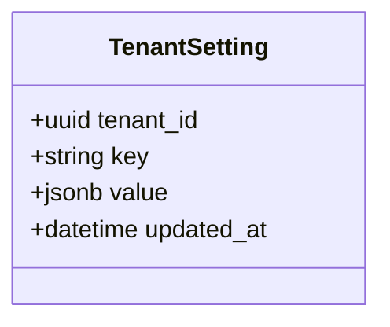

图表来源
- [backend/app/models/tenant_setting.py:13-31](file://backend/app/models/tenant_setting.py#L13-L31)

章节来源
- [backend/app/models/tenant_setting.py:13-31](file://backend/app/models/tenant_setting.py#L13-L31)

### 组织模型（Organization）
- OrgDepartment：部门树形结构，含external_id、provider_id、parent_id、path、member_count、status、tenant_id
- OrgMember：成员信息，open_id/unionid/external_id、姓名、邮箱、头像、职位、department_id、department_path、phone、status、tenant_id、user_id软关联
- AgentRelationship/AgentAgentRelationship：Agent与人类成员、Agent之间的协作关系

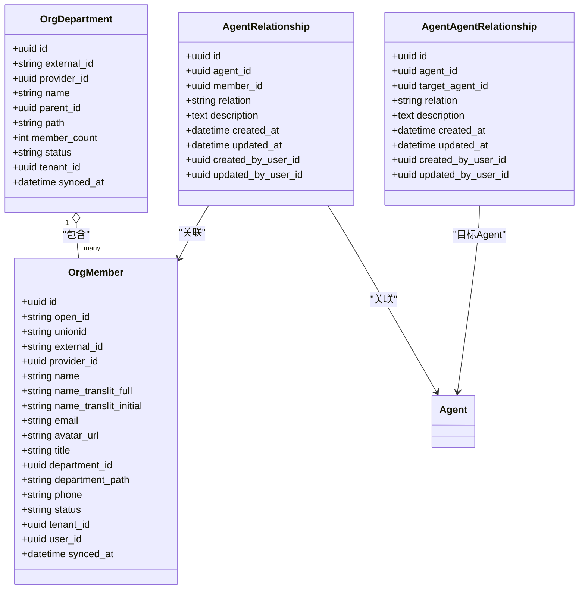

图表来源
- [backend/app/models/org.py:13-98](file://backend/app/models/org.py#L13-L98)

章节来源
- [backend/app/models/org.py:13-98](file://backend/app/models/org.py#L13-L98)

### 用户模型（User）
- 与全局Identity分离，支持同一身份在多租户下的不同角色与配额
- 角色枚举：platform_admin、org_admin、agent_admin、member
- 配额字段：quota_message_limit、quota_message_period、quota_messages_used、quota_period_start、quota_max_agents、quota_agent_ttl_hours

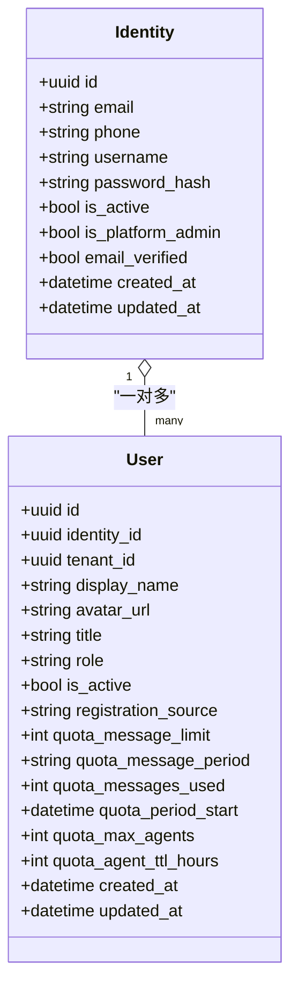

图表来源
- [backend/app/models/user.py:16-119](file://backend/app/models/user.py#L16-L119)

章节来源
- [backend/app/models/user.py:16-119](file://backend/app/models/user.py#L16-L119)

### 工作空间模型（Workspace）
- WorkspaceFileRevision：记录Agent或Group范围内的文件变更历史，含before/after内容、content_hash、group_key、created_at/updated_at
- WorkspaceEditLock：短生命周期编辑锁，防止多人同时编辑冲突，含expires_at、heartbeat_count

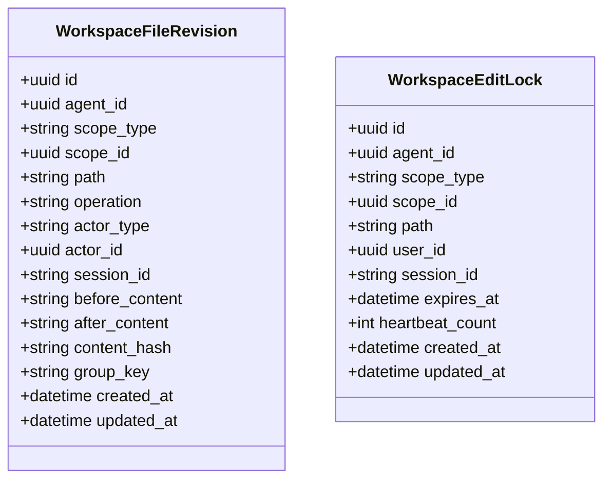

图表来源
- [backend/app/models/workspace.py:28-108](file://backend/app/models/workspace.py#L28-L108)

章节来源
- [backend/app/models/workspace.py:28-108](file://backend/app/models/workspace.py#L28-L108)

### 权限与多租户隔离（Permissions）
- 访问模式：company（公司可见）、private（仅创建者）、custom（自定义授权）
- 用户与Agent的租户一致性校验：tenant_id必须一致
- 管理员豁免：platform_admin、org_admin在特定条件下可访问非private Agent
- 构建可见Agent查询：结合creator、access_mode与AgentPermission

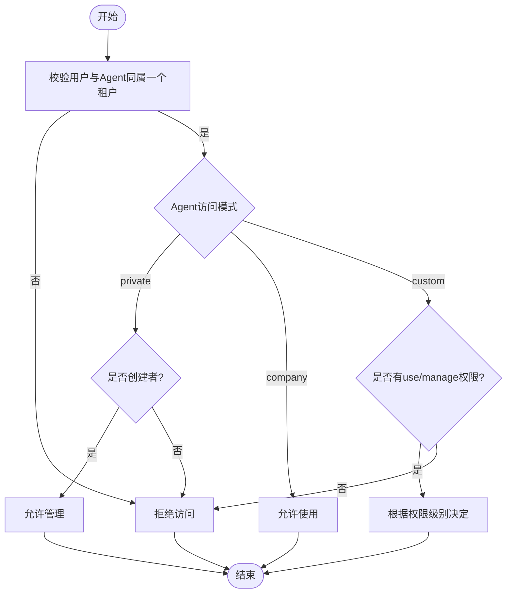

图表来源
- [backend/app/core/permissions.py:44-92](file://backend/app/core/permissions.py#L44-L92)
- [backend/app/core/permissions.py:213-250](file://backend/app/core/permissions.py#L213-L250)

章节来源
- [backend/app/core/permissions.py:44-92](file://backend/app/core/permissions.py#L44-L92)
- [backend/app/core/permissions.py:213-250](file://backend/app/core/permissions.py#L213-L250)

### 配额与计费统计（Quota Guard & Token Usage）
- 对话配额：按周期（daily/weekly/monthly/permanent）重置计数，管理员豁免
- Agent LLM调用配额：按日重置，超限抛出异常
- Agent创建配额：限制用户活跃Agent数量
- 心跳下限：强制租户级最小心跳间隔
- 计费统计：聚合Agent的tokens与缓存使用，按today/month/total维度返回

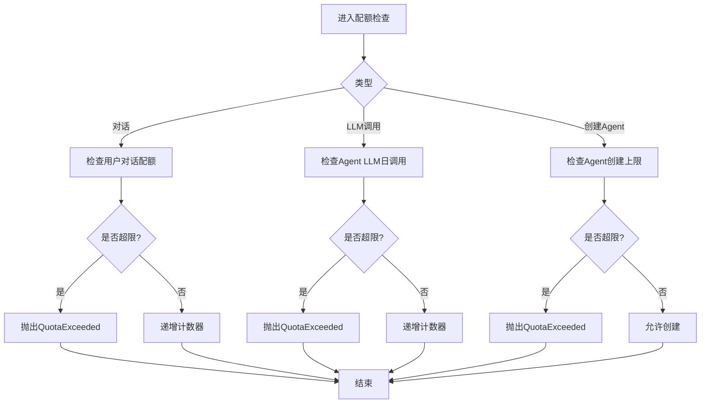

图表来源
- [backend/app/services/quota_guard.py:30-83](file://backend/app/services/quota_guard.py#L30-L83)
- [backend/app/services/quota_guard.py:121-174](file://backend/app/services/quota_guard.py#L121-L174)
- [backend/app/services/quota_guard.py:178-206](file://backend/app/services/quota_guard.py#L178-L206)
- [backend/app/services/quota_guard.py:211-253](file://backend/app/services/quota_guard.py#L211-L253)
- [backend/app/api/tenants.py:488-525](file://backend/app/api/tenants.py#L488-L525)

章节来源
- [backend/app/services/quota_guard.py:30-83](file://backend/app/services/quota_guard.py#L30-L83)
- [backend/app/services/quota_guard.py:121-174](file://backend/app/services/quota_guard.py#L121-L174)
- [backend/app/services/quota_guard.py:178-206](file://backend/app/services/quota_guard.py#L178-L206)
- [backend/app/services/quota_guard.py:211-253](file://backend/app/services/quota_guard.py#L211-L253)
- [backend/app/api/tenants.py:488-525](file://backend/app/api/tenants.py#L488-L525)

### 工作空间路径安全（Workspace Paths）
- 禁止绝对路径与越界访问，确保相对路径始终位于允许的根目录下
- 企业专属目录enterprise_info_{tenant_id}独立隔离，支持require_subpath_for_enterprise策略
- 返回ResolvedWorkspacePath，包含实际路径、相对根与是否企业目录标记

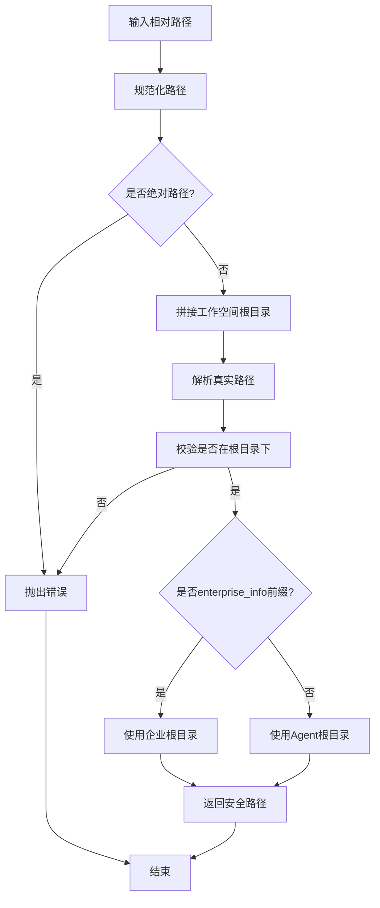

图表来源
- [backend/app/services/workspace_paths.py:21-48](file://backend/app/services/workspace_paths.py#L21-L48)
- [backend/app/services/workspace_paths.py:51-89](file://backend/app/services/workspace_paths.py#L51-L89)

章节来源
- [backend/app/services/workspace_paths.py:21-48](file://backend/app/services/workspace_paths.py#L21-L48)
- [backend/app/services/workspace_paths.py:51-89](file://backend/app/services/workspace_paths.py#L51-L89)

## 依赖关系分析
- Tenant与User、Agent、OrgDepartment、OrgMember通过tenant_id形成强关联，确保数据隔离
- AgentPermission与Agent组合实现细粒度访问控制
- WorkspaceFileRevision与WorkspaceEditLock通过scope_type与scope_id绑定到Agent或Group
- API路由依赖权限与配额服务，保证业务逻辑正确性与安全性

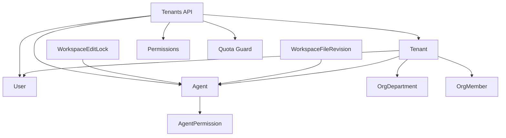

图表来源
- [backend/app/models/tenant.py:13-73](file://backend/app/models/tenant.py#L13-L73)
- [backend/app/models/user.py:52-119](file://backend/app/models/user.py#L52-L119)
- [backend/app/models/agent.py:19-160](file://backend/app/models/agent.py#L19-L160)
- [backend/app/models/org.py:13-98](file://backend/app/models/org.py#L13-L98)
- [backend/app/models/workspace.py:28-108](file://backend/app/models/workspace.py#L28-L108)
- [backend/app/api/tenants.py:152-237](file://backend/app/api/tenants.py#L152-L237)
- [backend/app/core/permissions.py:44-92](file://backend/app/core/permissions.py#L44-L92)
- [backend/app/services/quota_guard.py:30-83](file://backend/app/services/quota_guard.py#L30-L83)

章节来源
- [backend/app/models/tenant.py:13-73](file://backend/app/models/tenant.py#L13-L73)
- [backend/app/models/user.py:52-119](file://backend/app/models/user.py#L52-L119)
- [backend/app/models/agent.py:19-160](file://backend/app/models/agent.py#L19-L160)
- [backend/app/models/org.py:13-98](file://backend/app/models/org.py#L13-L98)
- [backend/app/models/workspace.py:28-108](file://backend/app/models/workspace.py#L28-L108)
- [backend/app/api/tenants.py:152-237](file://backend/app/api/tenants.py#L152-L237)
- [backend/app/core/permissions.py:44-92](file://backend/app/core/permissions.py#L44-L92)
- [backend/app/services/quota_guard.py:30-83](file://backend/app/services/quota_guard.py#L30-L83)

## 性能考虑
- 索引设计：Tenant.slug、OrgMember.external_id、WorkspaceFileRevision.scope_type+scope_id+path等索引提升查询效率
- 聚合查询：租户用量统计使用SQL聚合函数减少应用层计算开销
- 会话隔离：配额检查使用独立会话避免事务干扰
- 路径校验：工作空间路径解析采用相对路径与根目录校验，避免文件系统越界带来的额外IO与安全成本

[本节为通用性能指导，不直接分析具体文件]

## 故障排查指南
- 租户不存在或禁用：检查Tenant.is_active与slug/sso_domain匹配
- 权限不足：确认用户角色与Agent访问模式，必要时添加AgentPermission
- 配额超限：查看用户或Agent的配额字段与周期重置时间
- 工作空间路径错误：检查相对路径是否越界或enterprise_info前缀是否正确

章节来源
- [backend/app/api/tenants.py:460-486](file://backend/app/api/tenants.py#L460-L486)
- [backend/app/core/permissions.py:481-518](file://backend/app/core/permissions.py#L481-L518)
- [backend/app/services/quota_guard.py:30-83](file://backend/app/services/quota_guard.py#L30-L83)
- [backend/app/services/workspace_paths.py:21-48](file://backend/app/services/workspace_paths.py#L21-L48)

## 结论
Clawith平台通过清晰的Tenant边界、灵活的TenantSetting配置、完善的组织结构与用户模型、严格的权限与配额控制，以及安全的工作空间路径解析，构建了健壮的多租户与工作空间体系。该体系既满足企业级隔离与合规需求，又具备良好的可扩展性与性能表现。

[本节为总结性内容，不直接分析具体文件]

## 附录

### 多租户数据隔离策略
- 所有资源表通过tenant_id关联，查询与写入均需携带tenant_id条件
- 用户与Agent的tenant_id一致性校验贯穿权限与配额流程
- 工作空间与企业信息目录按租户隔离，路径解析严格限制根目录

章节来源
- [backend/app/models/tenant.py:13-73](file://backend/app/models/tenant.py#L13-L73)
- [backend/app/core/permissions.py:30-38](file://backend/app/core/permissions.py#L30-L38)
- [backend/app/services/workspace_paths.py:51-89](file://backend/app/services/workspace_paths.py#L51-L89)

### 工作空间权限控制
- 文件修订与编辑锁按scope_type与scope_id绑定到Agent或Group
- 编辑锁具备过期时间与心跳机制，防止死锁
- 企业目录enterprise_info_{tenant_id}独立隔离，支持更严格的子路径要求

章节来源
- [backend/app/models/workspace.py:28-108](file://backend/app/models/workspace.py#L28-L108)
- [backend/app/services/workspace_paths.py:16-18](file://backend/app/services/workspace_paths.py#L16-L18)

### 组织层级管理
- 部门树形结构通过parent_id与path维护层级关系
- 成员信息包含多语言姓名、邮箱、电话、职位等，支持软关联用户
- 与Agent的关系通过AgentRelationship与AgentAgentRelationship表达

章节来源
- [backend/app/models/org.py:13-98](file://backend/app/models/org.py#L13-L98)

### 租户配置管理与资源配额控制
- TenantSetting提供键值型配置，适合扩展第三方集成与租户个性化设置
- 配额守卫覆盖对话、LLM调用、Agent创建与心跳下限，支持周期重置与管理员豁免

章节来源
- [backend/app/models/tenant_setting.py:13-31](file://backend/app/models/tenant_setting.py#L13-L31)
- [backend/app/services/quota_guard.py:30-83](file://backend/app/services/quota_guard.py#L30-L83)
- [backend/app/services/quota_guard.py:121-174](file://backend/app/services/quota_guard.py#L121-L174)
- [backend/app/services/quota_guard.py:178-206](file://backend/app/services/quota_guard.py#L178-L206)
- [backend/app/services/quota_guard.py:211-253](file://backend/app/services/quota_guard.py#L211-L253)

### 计费统计支持
- 租户用量统计接口聚合Agent的tokens与缓存使用，按today/month/total维度返回
- 支持缓存命中率计算，便于优化与成本控制

章节来源
- [backend/app/api/tenants.py:488-525](file://backend/app/api/tenants.py#L488-L525)

### 完整数据操作示例（步骤说明）
- 租户注册
  - 调用self-create接口创建Tenant，若用户已有租户则创建新User记录并返回access_token
  - 参考路径：[backend/app/api/tenants.py:152-237](file://backend/app/api/tenants.py#L152-L237)
- 工作空间创建
  - 通过Agent创建工作空间目录，使用workspace_paths解析相对路径并确保安全
  - 参考路径：[backend/app/services/workspace_paths.py:51-89](file://backend/app/services/workspace_paths.py#L51-L89)
- 权限分配
  - 为Agent添加AgentPermission，指定scope_type与access_level，实现use或manage权限
  - 参考路径：[backend/app/models/agent.py:162-179](file://backend/app/models/agent.py#L162-L179)

章节来源
- [backend/app/api/tenants.py:152-237](file://backend/app/api/tenants.py#L152-L237)
- [backend/app/services/workspace_paths.py:51-89](file://backend/app/services/workspace_paths.py#L51-L89)
- [backend/app/models/agent.py:162-179](file://backend/app/models/agent.py#L162-L179)