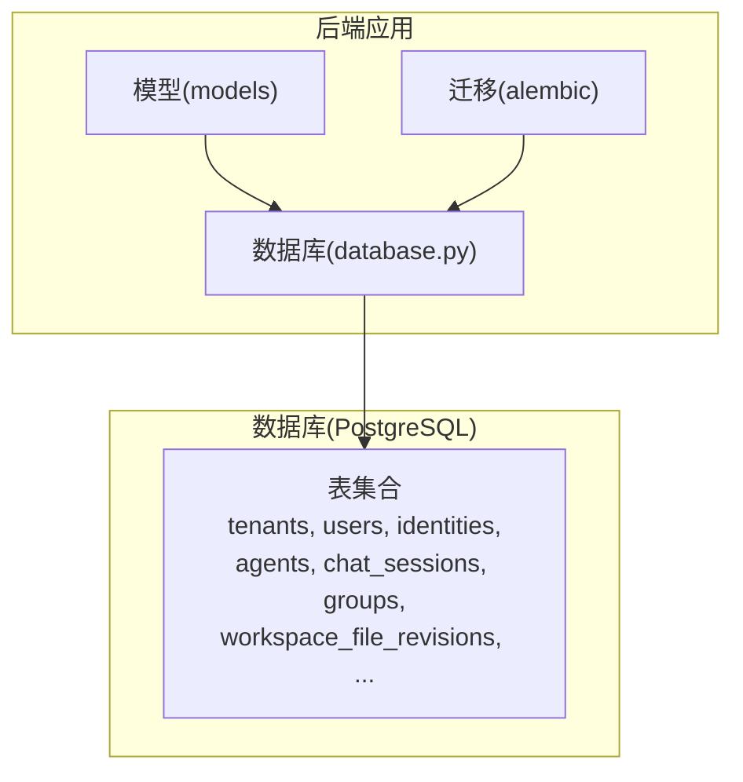
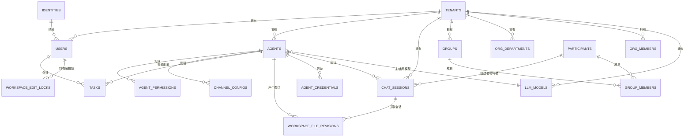
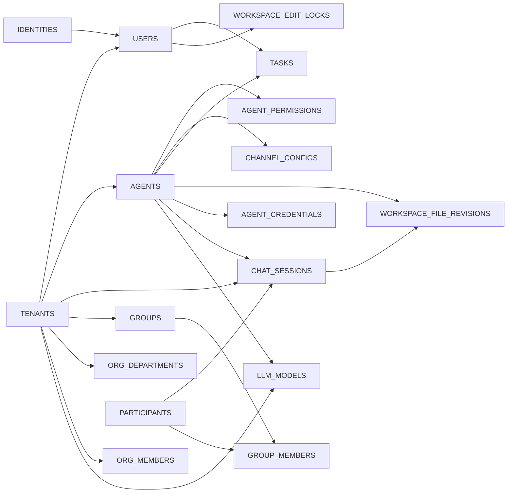

# 数据模型

<cite>
**本文引用的文件**   
- [backend/app/models/user.py](file://backend/app/models/user.py)
- [backend/app/models/agent.py](file://backend/app/models/agent.py)
- [backend/app/models/chat_session.py](file://backend/app/models/chat_session.py)
- [backend/app/models/workspace.py](file://backend/app/models/workspace.py)
- [backend/app/models/org.py](file://backend/app/models/org.py)
- [backend/app/models/tenant.py](file://backend/app/models/tenant.py)
- [backend/app/models/group.py](file://backend/app/models/group.py)
- [backend/app/models/participant.py](file://backend/app/models/participant.py)
- [backend/app/models/llm.py](file://backend/app/models/llm.py)
- [backend/app/models/task.py](file://backend/app/models/task.py)
- [backend/app/models/channel_config.py](file://backend/app/models/channel_config.py)
- [backend/app/models/agent_credential.py](file://backend/app/models/agent_credential.py)
- [backend/app/models/system_settings.py](file://backend/app/models/system_settings.py)
- [backend/app/database.py](file://backend/app/database.py)
- [backend/alembic/versions/001_initial_schema.py](file://backend/alembic/versions/001_initial_schema.py)
</cite>

## 目录
1. [简介](#简介)
2. [项目结构](#项目结构)
3. [核心组件](#核心组件)
4. [架构总览](#架构总览)
5. [详细组件分析](#详细组件分析)
6. [依赖关系分析](#依赖关系分析)
7. [性能考虑](#性能考虑)
8. [故障排查指南](#故障排查指南)
9. [结论](#结论)
10. [附录](#附录)

## 简介
本文件系统化梳理 Clawith 平台的核心数据模型，覆盖用户、Agent（数字员工）、聊天会话、工作空间、组织与租户等关键实体。文档从 ORM 模型出发，解释表结构定义、字段类型与约束、主外键关系、索引策略、数据验证规则与业务约束，并提供典型数据操作示例、查询优化建议与性能调优指导，帮助读者快速理解并高效使用数据库层设计。

## 项目结构
后端采用 SQLAlchemy 声明式模型，配合 Alembic 进行版本化迁移。核心模型集中在 backend/app/models 目录下，数据库连接与会话管理在 backend/app/database.py，初始建表由 alembic/versions/001_initial_schema.py 触发。

图表来源
- [backend/app/models/user.py:1-119](file://backend/app/models/user.py#L1-L119)
- [backend/app/models/agent.py:1-235](file://backend/app/models/agent.py#L1-L235)
- [backend/app/models/chat_session.py:1-116](file://backend/app/models/chat_session.py#L1-L116)
- [backend/app/models/workspace.py:1-108](file://backend/app/models/workspace.py#L1-L108)
- [backend/app/models/org.py:1-98](file://backend/app/models/org.py#L1-L98)
- [backend/app/models/tenant.py:1-73](file://backend/app/models/tenant.py#L1-L73)
- [backend/app/database.py:1-79](file://backend/app/database.py#L1-L79)
- [backend/alembic/versions/001_initial_schema.py:1-27](file://backend/alembic/versions/001_initial_schema.py#L1-L27)

章节来源
- [backend/app/models/user.py:1-119](file://backend/app/models/user.py#L1-L119)
- [backend/app/models/agent.py:1-235](file://backend/app/models/agent.py#L1-L235)
- [backend/app/models/chat_session.py:1-116](file://backend/app/models/chat_session.py#L1-L116)
- [backend/app/models/workspace.py:1-108](file://backend/app/models/workspace.py#L1-L108)
- [backend/app/models/org.py:1-98](file://backend/app/models/org.py#L1-L98)
- [backend/app/models/tenant.py:1-73](file://backend/app/models/tenant.py#L1-L73)
- [backend/app/database.py:1-79](file://backend/app/database.py#L1-L79)
- [backend/alembic/versions/001_initial_schema.py:1-27](file://backend/alembic/versions/001_initial_schema.py#L1-L27)

## 核心组件
本节概述各核心实体的职责与关键属性：
- 租户(Tenant)：多租户隔离边界，包含 IM 配置、默认配额、时区、SSO 开关、A2A 异步开关、默认 LLM 模型等。
- 身份与用户(Identity/User)：全局唯一身份与租户内成员角色、配额、注册来源、状态等。
- Agent(数字员工)：实例化智能体，含运行态、LLM 配置、自主性策略、用量控制、过期控制、访问模式、心跳、时区等。
- 聊天会话(ChatSession)：统一会话抽象，支持 P2P、群组、A2A、触发器会话，含主会话标记、最后阅读时间、软删除等。
- 群组(Group/GroupMember)：租户级长生命周期群组及成员角色、加入/移除时间、会话读取状态等。
- 参与者(Participant)：统一用户/Agent 参与者的轻量身份，供会话与消息引用。
- 工作空间(WorkspaceFileRevision/WorkspaceEditLock)：文件修订历史与编辑锁，用于协作与回滚。
- 组织(OrgDepartment/OrgMember/AgentRelationship/AgentAgentRelationship)：部门与成员同步、Agent 与成员或 Agent 之间的关系。
- LLM 模型(LLMModel)：模型池配置，含能力探测、上下文窗口、最大输入输出、工具调用能力等。
- 任务(Task/TaskLog)：分配给 Agent 的任务与进度日志。
- 渠道配置(ChannelConfig)：Agent 的渠道接入配置（飞书、企微、微信、WhatsApp、钉钉、Slack、Discord、Atlassian、Teams、AgentBay）。
- 凭证(AgentCredential)：加密存储的平台会话 Cookie，用于自动登录注入。
- 系统设置(SystemSetting)：键值型系统配置。

章节来源
- [backend/app/models/tenant.py:1-73](file://backend/app/models/tenant.py#L1-L73)
- [backend/app/models/user.py:1-119](file://backend/app/models/user.py#L1-L119)
- [backend/app/models/agent.py:1-235](file://backend/app/models/agent.py#L1-L235)
- [backend/app/models/chat_session.py:1-116](file://backend/app/models/chat_session.py#L1-L116)
- [backend/app/models/group.py:1-95](file://backend/app/models/group.py#L1-L95)
- [backend/app/models/participant.py:1-32](file://backend/app/models/participant.py#L1-L32)
- [backend/app/models/workspace.py:1-108](file://backend/app/models/workspace.py#L1-L108)
- [backend/app/models/org.py:1-98](file://backend/app/models/org.py#L1-L98)
- [backend/app/models/llm.py:1-80](file://backend/app/models/llm.py#L1-L80)
- [backend/app/models/task.py:1-75](file://backend/app/models/task.py#L1-L75)
- [backend/app/models/channel_config.py:1-52](file://backend/app/models/channel_config.py#L1-L52)
- [backend/app/models/agent_credential.py:1-78](file://backend/app/models/agent_credential.py#L1-L78)
- [backend/app/models/system_settings.py:1-21](file://backend/app/models/system_settings.py#L1-L21)

## 架构总览
下图展示核心实体之间的主要关系与约束，包括多租户隔离、参与者统一身份、会话与群组、Agent 权限与模板、LLM 模型池等。

图表来源
- [backend/app/models/tenant.py:1-73](file://backend/app/models/tenant.py#L1-L73)
- [backend/app/models/user.py:1-119](file://backend/app/models/user.py#L1-L119)
- [backend/app/models/agent.py:1-235](file://backend/app/models/agent.py#L1-L235)
- [backend/app/models/chat_session.py:1-116](file://backend/app/models/chat_session.py#L1-L116)
- [backend/app/models/group.py:1-95](file://backend/app/models/group.py#L1-L95)
- [backend/app/models/participant.py:1-32](file://backend/app/models/participant.py#L1-L32)
- [backend/app/models/workspace.py:1-108](file://backend/app/models/workspace.py#L1-L108)
- [backend/app/models/org.py:1-98](file://backend/app/models/org.py#L1-L98)
- [backend/app/models/llm.py:1-80](file://backend/app/models/llm.py#L1-L80)
- [backend/app/models/task.py:1-75](file://backend/app/models/task.py#L1-L75)
- [backend/app/models/channel_config.py:1-52](file://backend/app/models/channel_config.py#L1-L52)
- [backend/app/models/agent_credential.py:1-78](file://backend/app/models/agent_credential.py#L1-L78)

## 详细组件分析

### 租户(Tenant)
- 表名：tenants
- 关键字段：id、name、slug、im_provider、im_config、is_active、默认配额、最小心跳间隔、时区、国家地区码、SSO 开关与域名、触发器限制、A2A 异步开关、默认模型 id
- 约束与索引：slug 唯一且索引；sso_domain 唯一可空索引；created_at 默认当前时间
- 业务含义：多租户隔离边界，决定 IM 集成、默认配额、时区、SSO、A2A 行为、默认 LLM 模型等

章节来源
- [backend/app/models/tenant.py:1-73](file://backend/app/models/tenant.py#L1-L73)

### 身份与用户(Identity/User)
- 表名：identities、users
- Identity：全局唯一标识（email/phone/username 唯一索引），密码哈希、激活状态、平台管理员标志、邮箱验证状态、时间戳
- User：租户内成员，关联 identity_id、tenant_id，显示名、头像、职位、角色枚举、活跃状态、注册来源、配额（消息限额、周期、已用、起止时间、最大 Agent 数、TTL）、时间戳
- 关系：User.identity 反向关联；User.created_agents 指向创建的 Agent
- 约束与索引：email/phone/username 唯一索引；identity_id、tenant_id 外键；部分唯一约束通过迁移中的部分索引实现（允许 NULL）

章节来源
- [backend/app/models/user.py:1-119](file://backend/app/models/user.py#L1-L119)

### Agent(数字员工)
- 表名：agents
- 关键字段：id、name、avatar_url、role_description、bio、welcome_message、creator_id、tenant_id、agent_type、api_key_hash、openclaw_last_seen、status、container_id/port、primary_model_id、fallback_model_id、autonomy_policy(JSON)、token 用量控制、max_tool_rounds、触发器限制、expires_at/is_expired、is_system、access_mode/company_access_level、llm_calls_today/max_llm_calls_per_day/llm_calls_reset_at、template_id、heartbeat_*、timezone、时间戳、deleted_at
- 关系：creator(User)、permissions(AgentPermission)、tasks(Task)、channel_config(ChannelConfig)、primary_model/fallback_model(LLMModel)
- 约束与索引：自定义索引 ix_agents_active_tenant_created_at（过滤 deleted_at IS NULL）
- 业务含义：Agent 实例化、运行时状态、LLM 配置、自主性策略、用量与过期控制、访问模式、心跳与时区

章节来源
- [backend/app/models/agent.py:1-235](file://backend/app/models/agent.py#L1-L235)

### 聊天会话(ChatSession)
- 表名：chat_sessions
- 关键字段：id、tenant_id、session_type、group_id、agent_id、user_id、created_by_participant_id、title、source_channel、external_conv_id、is_group、group_name、participant_id、peer_agent_id、is_primary、last_read_at_by_user、deleted_at、created_at/updated_at、last_message_at
- 约束与索引：
  - 唯一约束：uq_chat_sessions_agent_ext_conv（agent_id + external_conv_id）、uq_chat_sessions_tenant_id_id（tenant_id + id）
  - 检查约束：ck_chat_sessions_session_type（direct/group/a2a/trigger）
  - 部分唯一索引：uq_chat_sessions_primary_direct（tenant_id+agent_id+user_id，条件 session_type='direct' AND is_primary=true AND deleted_at IS NULL）
  - 部分唯一索引：uq_chat_sessions_primary_group（group_id，条件 session_type='group' AND group_id IS NOT NULL AND is_primary=true AND deleted_at IS NULL）
  - 普通索引：ix_chat_sessions_tenant_id、ix_chat_sessions_group_id、is_primary、created_at
- 业务含义：统一会话抽象，支持 P2P、群组、A2A、触发器会话；主会话标记与未读计数基于 last_read_at_by_user；软删除

章节来源
- [backend/app/models/chat_session.py:1-116](file://backend/app/models/chat_session.py#L1-L116)

### 群组(Group/GroupMember)
- 表名：groups、group_members
- Group：id、tenant_id、name、description、created_by_participant_id、deleted_at、时间戳
- GroupMember：id、group_id、participant_id、role(member/manager)、joined_at、removed_at、session_read_state(JSONB)
- 约束与索引：
  - PrimaryKeyConstraint(id)
  - CheckConstraint(role IN ('manager','member'))
  - UniqueConstraint(group_id, participant_id)
  - Index(ix_group_members_participant_id)
  - Index(ix_groups_tenant_id_deleted_at)
- 业务含义：租户级长生命周期群组与成员管理，记录加入/移除时间与读取状态

章节来源
- [backend/app/models/group.py:1-95](file://backend/app/models/group.py#L1-L95)

### 参与者(Participant)
- 表名：participants
- 关键字段：id、type(user/agent)、ref_id、display_name、avatar_url、created_at
- 约束与索引：UniqueConstraint(type, ref_id)；ref_id 索引
- 业务含义：统一用户与 Agent 的参与身份，被 ChatSession、GroupMember 等引用

章节来源
- [backend/app/models/participant.py:1-32](file://backend/app/models/participant.py#L1-L32)

### 工作空间(WorkspaceFileRevision/WorkspaceEditLock)
- 表名：workspace_file_revisions、workspace_edit_locks
- WorkspaceFileRevision：id、agent_id、scope_type(agent/group)、scope_id、path、operation、actor_type、actor_id、session_id、before_content、after_content、content_hash、group_key、时间戳
- WorkspaceEditLock：id、agent_id、scope_type、scope_id、path、user_id、session_id、expires_at、heartbeat_count、时间戳
- 约束与索引：
  - CheckConstraint(scope_type IN ('agent','group'))
  - CheckConstraint(scope_identity：agent 作用域要求 agent_id IS NOT NULL 且 scope_id=agent_id；group 作用域要求 agent_id IS NULL)
  - Index(ix_workspace_file_revisions_scope_path)
  - UniqueConstraint(scope_type, scope_id, path)
- 业务含义：文件修订历史与短生命周期编辑锁，支撑协作与回滚

章节来源
- [backend/app/models/workspace.py:1-108](file://backend/app/models/workspace.py#L1-L108)

### 组织(OrgDepartment/OrgMember/AgentRelationship/AgentAgentRelationship)
- 表名：org_departments、org_members、agent_relationships、agent_agent_relationships
- OrgDepartment：外部 ID、provider_id、name、parent_id、path、member_count、status、tenant_id、synced_at
- OrgMember：open_id、unionid、external_id、provider_id、name、name_translit_full/initial、email、avatar_url、title、department_id、department_path、phone、status、tenant_id、user_id、synced_at
- AgentRelationship：agent_id、member_id、relation、description、created_by_user_id、updated_by_user_id、时间戳
- AgentAgentRelationship：agent_id、target_agent_id、relation、description、created_by_user_id、updated_by_user_id、时间戳
- 业务含义：组织结构与成员同步（如飞书），以及 Agent 与成员或 Agent 之间的关系

章节来源
- [backend/app/models/org.py:1-98](file://backend/app/models/org.py#L1-L98)

### LLM 模型(LLMModel)
- 表名：llm_models
- 关键字段：tenant_id、provider、model、api_key_encrypted、base_url、label、max_tokens_per_day、enabled、supports_vision、temperature、request_timeout、max_output_tokens、context_window_tokens/override、max_input_tokens/override、capability_source、capability_checked_at、supports_tool_calling、tool_calling_capability_source/tool_calling_checked_at/tool_calling_error、时间戳、deleted_at
- 约束与索引：
  - CheckConstraint(context_window_tokens > 0、context_window_tokens_override > 0、max_input_tokens > 0、max_input_tokens_override > 0)
  - CheckConstraint(capability_source IN ('manual','provider_api','builtin_registry','runtime_config'))
  - CheckConstraint(tool_calling_capability_source IN ('probe','builtin_registry'))
  - Index(ix_llm_models_active_tenant_created_at（过滤 deleted_at IS NULL）)
- 业务含义：模型池配置，含能力探测、上下文窗口、最大输入输出、工具调用能力等

章节来源
- [backend/app/models/llm.py:1-80](file://backend/app/models/llm.py#L1-L80)

### 任务(Task/TaskLog)
- 表名：tasks、task_logs
- Task：agent_id、title、description、type(todo/supervision)、status(pending/doing/done)、priority(low/medium/high/urgent)、assignee、created_by、due_date、supervision_target_user_id/name/channel/remind_schedule、时间戳、completed_at
- TaskLog：task_id、content、created_at
- 关系：Task.agent、Task.creator(User)、Task.logs(TaskLog)
- 业务含义：分配给 Agent 的任务与进度日志，支持监督类任务

章节来源
- [backend/app/models/task.py:1-75](file://backend/app/models/task.py#L1-L75)

### 渠道配置(ChannelConfig)
- 表名：channel_configs
- 关键字段：agent_id、channel_type(feishu/wecom/wechat/whatsapp/dingtalk/slack/discord/atlassian/microsoft_teams/agentbay)、app_id/secret/encrypt_key/verification_token、is_configured/is_connected/last_tested_at、extra_config(JSON)、时间戳
- 约束与索引：UniqueConstraint(agent_id, channel_type)
- 业务含义：Agent 的渠道接入配置，支持多种 IM 与平台

章节来源
- [backend/app/models/channel_config.py:1-52](file://backend/app/models/channel_config.py#L1-L52)

### 凭证(AgentCredential)
- 表名：agent_credentials
- 关键字段：agent_id、credential_type、platform、display_name、cookies_json(加密)、cookies_updated_at、status(active/expired/needs_relogin)、last_login_at、last_injected_at、时间戳
- 业务含义：为特定平台存储加密浏览器 Cookie，用于自动登录注入到浏览器会话

章节来源
- [backend/app/models/agent_credential.py:1-78](file://backend/app/models/agent_credential.py#L1-L78)

### 系统设置(SystemSetting)
- 表名：system_settings
- 关键字段：key(主键)、value(JSONB)、updated_at
- 业务含义：系统级键值配置

章节来源
- [backend/app/models/system_settings.py:1-21](file://backend/app/models/system_settings.py#L1-L21)

## 依赖关系分析
- 多租户隔离：所有核心实体均通过 tenant_id 与 tenants 关联，确保数据隔离与按租户查询。
- 参与者统一身份：Participant 作为用户与 Agent 的统一参与身份，被 ChatSession、GroupMember 引用，避免重复建模。
- Agent 与 LLM：Agent.primary_model_id/fallback_model_id 引用 LLMModel，支持主备模型切换与能力探测。
- 会话与群组：ChatSession 支持 direct/group/a2a/trigger 四种类型，结合 Group 与 Participant 构建复杂会话场景。
- 工作空间协作：WorkspaceFileRevision 记录变更历史，WorkspaceEditLock 提供短生命周期编辑锁，保障并发安全。
- 组织与关系：OrgDepartment/OrgMember 与 AgentRelationship/AgentAgentRelationship 形成组织与 Agent 的关系网络。

图表来源
- [backend/app/models/tenant.py:1-73](file://backend/app/models/tenant.py#L1-L73)
- [backend/app/models/user.py:1-119](file://backend/app/models/user.py#L1-L119)
- [backend/app/models/agent.py:1-235](file://backend/app/models/agent.py#L1-L235)
- [backend/app/models/chat_session.py:1-116](file://backend/app/models/chat_session.py#L1-L116)
- [backend/app/models/group.py:1-95](file://backend/app/models/group.py#L1-L95)
- [backend/app/models/participant.py:1-32](file://backend/app/models/participant.py#L1-L32)
- [backend/app/models/workspace.py:1-108](file://backend/app/models/workspace.py#L1-L108)
- [backend/app/models/org.py:1-98](file://backend/app/models/org.py#L1-L98)
- [backend/app/models/llm.py:1-80](file://backend/app/models/llm.py#L1-L80)
- [backend/app/models/task.py:1-75](file://backend/app/models/task.py#L1-L75)
- [backend/app/models/channel_config.py:1-52](file://backend/app/models/channel_config.py#L1-L52)
- [backend/app/models/agent_credential.py:1-78](file://backend/app/models/agent_credential.py#L1-L78)

## 性能考虑
- 索引策略
  - 常用过滤字段加索引：tenant_id、created_at、deleted_at、is_primary、group_id、participant_id、ref_id、scope_type+scope_id+path 等。
  - 部分唯一索引用于主会话与主群组约束，避免冗余扫描。
  - 针对逻辑删除（deleted_at IS NULL）的索引提升查询效率。
- 查询优化建议
  - 优先使用 tenant_id 限定范围，减少跨租户扫描。
  - 对高频查询路径建立复合索引，如 (tenant_id, created_at)、(tenant_id, agent_id, user_id)。
  - 避免 N+1 查询，使用 selectin/eager loading 加载关联对象（例如 User.identity）。
  - 分页与排序建议使用索引列，避免全表排序。
- 事务与会话
  - 使用 database.transaction 上下文管理器保证原子性与回滚。
  - 合理设置 pool_size 与 max_overflow，避免连接耗尽。
- 数据一致性
  - 使用 CheckConstraint 与 UniqueConstraint 在数据库层保证完整性。
  - 对 JSON/JSONB 字段进行必要校验，避免脏数据。

[本节为通用性能指导，不直接分析具体文件]

## 故障排查指南
- 常见错误
  - 缺少绿色线程导致异步上下文访问同步 IO：确保 association_proxy 的 lazy="selectin" 正确配置（见 User.identity）。
  - 唯一约束冲突：检查 email/phone/username、agent_id+channel_type、scope_type+scope_id+path 等唯一约束。
  - 检查约束失败：确认 session_type、scope_type、role、capability_source 等枚举值合法。
  - 逻辑删除未生效：确保查询条件包含 deleted_at IS NULL。
- 调试建议
  - 启用 SQL 日志（settings.DEBUG）观察执行计划。
  - 使用 EXPLAIN ANALYZE 分析慢查询，关注索引命中与扫描方式。
  - 检查 Alembic 迁移是否成功应用，必要时回滚或修复。

章节来源
- [backend/app/models/user.py:100-111](file://backend/app/models/user.py#L100-L111)
- [backend/app/models/chat_session.py:35-63](file://backend/app/models/chat_session.py#L35-L63)
- [backend/app/models/workspace.py:32-91](file://backend/app/models/workspace.py#L32-L91)
- [backend/app/models/llm.py:17-50](file://backend/app/models/llm.py#L17-L50)
- [backend/app/database.py:30-79](file://backend/app/database.py#L30-L79)

## 结论
Clawith 的数据模型以多租户为核心，围绕用户、Agent、会话、群组与工作空间构建了完整的企业级协作与自动化体系。通过严格的约束与索引设计，保障了数据一致性与查询性能。建议在开发中遵循租户隔离、合理使用索引、避免 N+1 查询，并结合事务与会话管理确保数据完整性与稳定性。

[本节为总结性内容，不直接分析具体文件]

## 附录

### ORM 模型与数据库表映射说明
- Base：SQLAlchemy 声明式基类，所有模型继承自 app.database.Base。
- 建表：alembic/versions/001_initial_schema.py 通过 Base.metadata.create_all 一次性创建所有表。
- 会话：database.async_session 提供异步会话，get_db 与 transaction 提供依赖注入与事务边界。

章节来源
- [backend/app/database.py:24-28](file://backend/app/database.py#L24-L28)
- [backend/alembic/versions/001_initial_schema.py:19-22](file://backend/alembic/versions/001_initial_schema.py#L19-L22)

### 典型数据操作示例（概念性）
- 创建租户与默认模型
  - 插入 tenants，设置 default_model_id 指向 llm_models.id。
- 注册用户与身份
  - 插入 identities（email/phone/username 唯一），再插入 users 关联 identity_id 与 tenant_id。
- 创建 Agent 与渠道配置
  - 插入 agents，设置 primary_model_id/fallback_model_id；插入 channel_configs 绑定 agent_id 与 channel_type。
- 创建会话与群组
  - 插入 groups 与 group_members；根据 source_channel 与 external_conv_id 创建 chat_sessions，必要时标记 is_primary。
- 工作空间协作
  - 写入 workspace_file_revisions 记录 before/after 内容；使用 workspace_edit_locks 管理编辑锁与过期时间。
- 任务与日志
  - 插入 tasks，关联 agent_id 与 created_by；追加 task_logs 记录进度。

[本节为概念性示例，不直接分析具体文件]