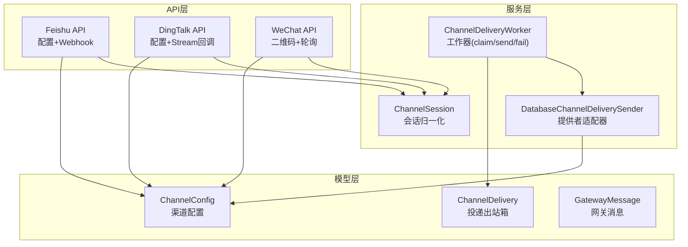
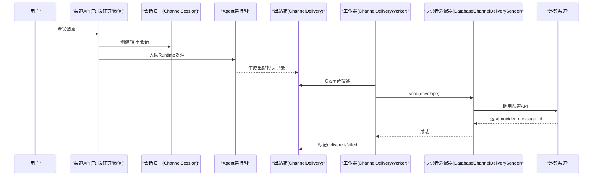
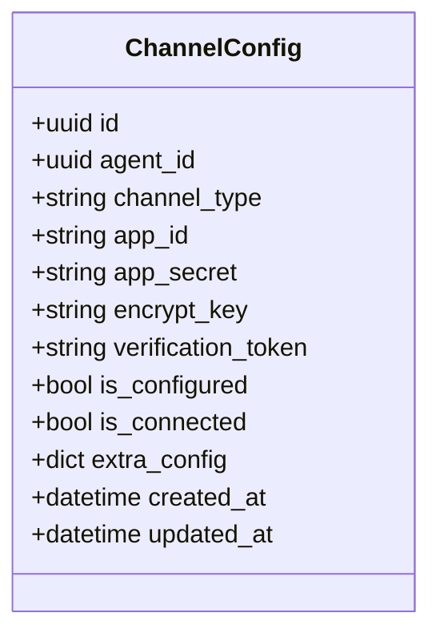
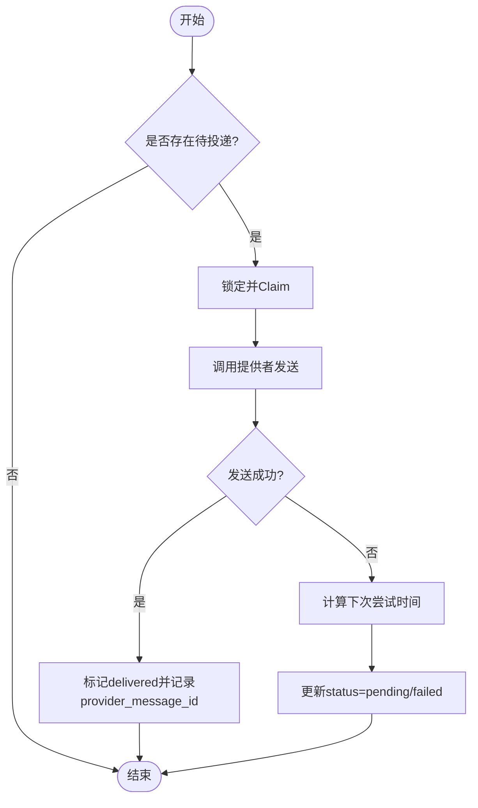
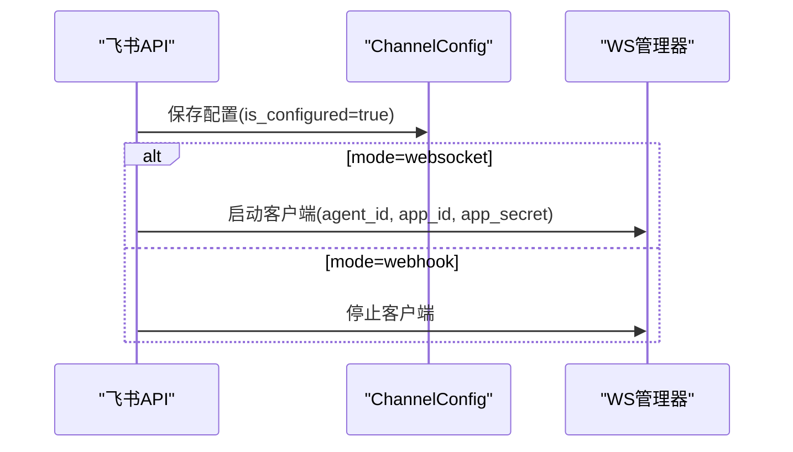
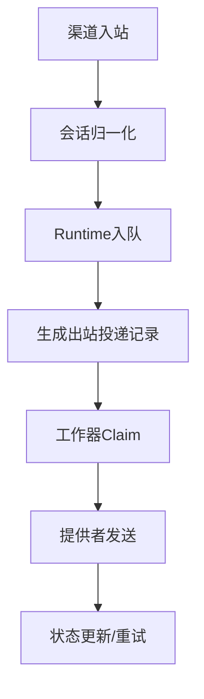
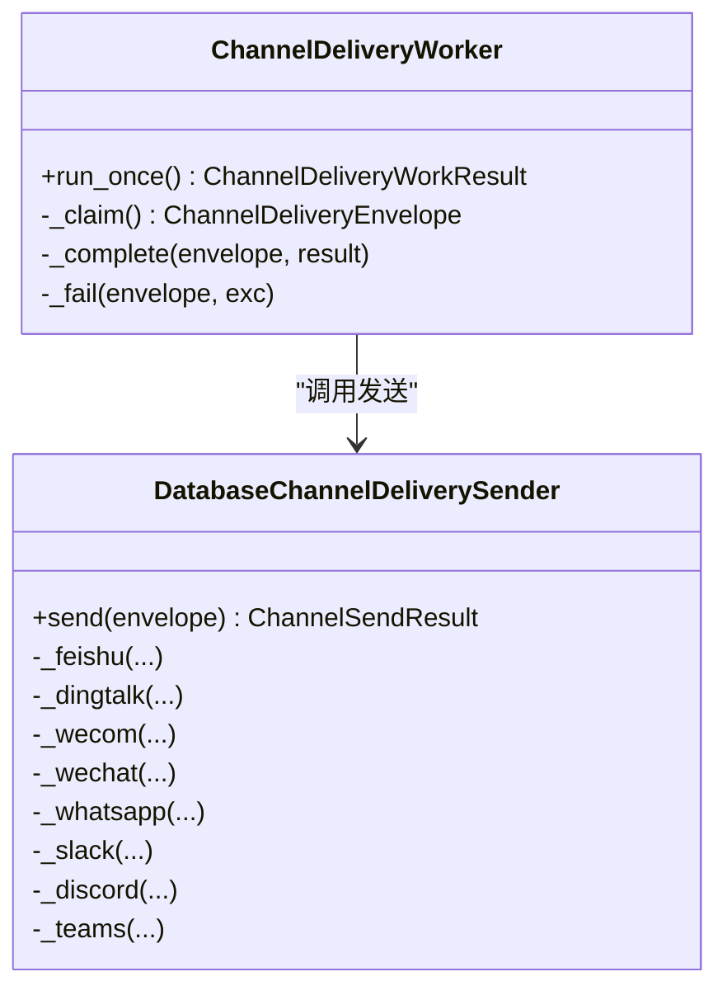
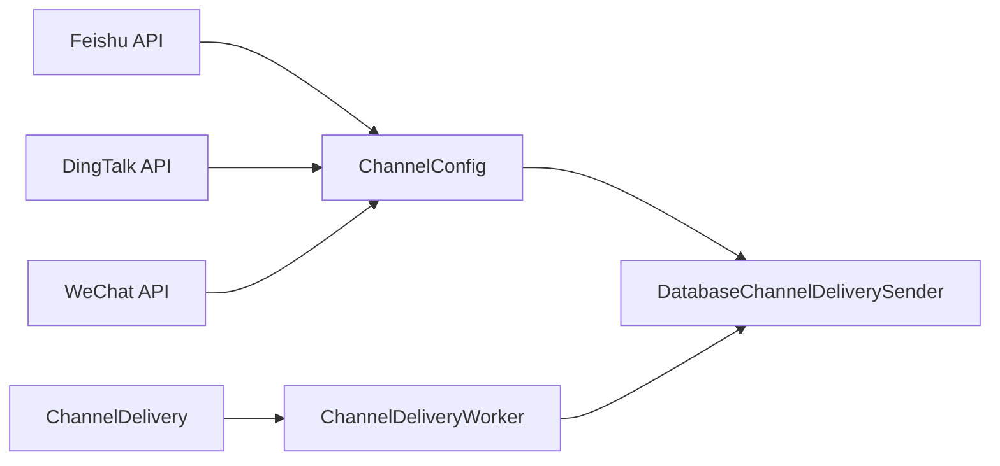

# 渠道集成模型

<cite>
**本文引用的文件**   
- [backend/app/models/channel_config.py](file://backend/app/models/channel_config.py)
- [backend/app/models/channel_delivery.py](file://backend/app/models/channel_delivery.py)
- [backend/app/models/gateway_message.py](file://backend/app/models/gateway_message.py)
- [backend/app/services/agent_runtime/channel_delivery.py](file://backend/app/services/agent_runtime/channel_delivery.py)
- [backend/app/services/agent_runtime/channel_provider_delivery.py](file://backend/app/services/agent_runtime/channel_provider_delivery.py)
- [backend/app/services/channel_session.py](file://backend/app/services/channel_session.py)
- [backend/app/api/feishu.py](file://backend/app/api/feishu.py)
- [backend/app/api/dingtalk.py](file://backend/app/api/dingtalk.py)
- [backend/app/api/wechat.py](file://backend/app/api/wechat.py)
</cite>

## 目录
1. [简介](#简介)
2. [项目结构](#项目结构)
3. [核心组件](#核心组件)
4. [架构总览](#架构总览)
5. [详细组件分析](#详细组件分析)
6. [依赖关系分析](#依赖关系分析)
7. [性能与可靠性](#性能与可靠性)
8. [故障排查指南](#故障排查指南)
9. [结论](#结论)
10. [附录：数据操作示例](#附录数据操作示例)

## 简介
本文件面向Clawith平台的“多渠道接入”能力，聚焦以下三个核心数据模型及其在消息流转中的作用：
- ChannelConfig：渠道配置（如飞书、钉钉、微信等）的持久化元数据与连接状态。
- ChannelDelivery：外部渠道投递的“出站箱”记录，承载重试、幂等、失败回退等机制。
- GatewayMessage：网关侧用于Agent间通信的消息队列项，体现平台内路由与生命周期。

文档将解释多渠道接入架构、消息路由策略、投递状态管理，并给出飞书、钉钉、微信的配置管理与连接状态维护方式，以及渠道扩展开发、错误重试机制的实现方案。

## 项目结构
围绕渠道集成的关键代码分布在后端模型的ORM定义、服务层的投递与工作器、以及各渠道API路由中。整体组织遵循“模型-服务-API”分层：
- 模型层：channel_config、channel_delivery、gateway_message 定义数据库表结构与约束。
- 服务层：channel_delivery、channel_provider_delivery、channel_session 负责投递编排、提供者适配与会话归一。
- API层：feishu、dingtalk、wechat 提供渠道配置CRUD与事件接收入口。

图表来源
- [backend/app/models/channel_config.py:13-52](file://backend/app/models/channel_config.py#L13-L52)
- [backend/app/models/channel_delivery.py:26-169](file://backend/app/models/channel_delivery.py#L26-L169)
- [backend/app/models/gateway_message.py:13-38](file://backend/app/models/gateway_message.py#L13-L38)
- [backend/app/services/agent_runtime/channel_delivery.py:192-416](file://backend/app/services/agent_runtime/channel_delivery.py#L192-L416)
- [backend/app/services/agent_runtime/channel_provider_delivery.py:57-103](file://backend/app/services/agent_runtime/channel_provider_delivery.py#L57-L103)
- [backend/app/services/channel_session.py:24-184](file://backend/app/services/channel_session.py#L24-L184)
- [backend/app/api/feishu.py:130-188](file://backend/app/api/feishu.py#L130-L188)
- [backend/app/api/dingtalk.py:29-95](file://backend/app/api/dingtalk.py#L29-L95)
- [backend/app/api/wechat.py:54-151](file://backend/app/api/wechat.py#L54-L151)

章节来源
- [backend/app/models/channel_config.py:13-52](file://backend/app/models/channel_config.py#L13-L52)
- [backend/app/models/channel_delivery.py:26-169](file://backend/app/models/channel_delivery.py#L26-L169)
- [backend/app/models/gateway_message.py:13-38](file://backend/app/models/gateway_message.py#L13-L38)
- [backend/app/services/agent_runtime/channel_delivery.py:192-416](file://backend/app/services/agent_runtime/channel_delivery.py#L192-L416)
- [backend/app/services/agent_runtime/channel_provider_delivery.py:57-103](file://backend/app/services/agent_runtime/channel_provider_delivery.py#L57-L103)
- [backend/app/services/channel_session.py:24-184](file://backend/app/services/channel_session.py#L24-L184)
- [backend/app/api/feishu.py:130-188](file://backend/app/api/feishu.py#L130-L188)
- [backend/app/api/dingtalk.py:29-95](file://backend/app/api/dingtalk.py#L29-L95)
- [backend/app/api/wechat.py:54-151](file://backend/app/api/wechat.py#L54-L151)

## 核心组件
- ChannelConfig：按Agent维度存储渠道类型与凭据（app_id/app_secret等），支持extra_config扩展字段；包含is_configured与is_connected状态位，便于前端展示与后台控制连接生命周期。
- ChannelDelivery：仅作为Outbox使用，不介入Graph路由或Checkpoint恢复；通过幂等键、尝试次数、下次尝试时间、锁定过期时间等实现可靠投递与重试。
- GatewayMessage：平台内部Agent间通信的消息队列项，生命周期为pending→delivered→completed（或过期）。

章节来源
- [backend/app/models/channel_config.py:13-52](file://backend/app/models/channel_config.py#L13-L52)
- [backend/app/models/channel_delivery.py:26-169](file://backend/app/models/channel_delivery.py#L26-L169)
- [backend/app/models/gateway_message.py:13-38](file://backend/app/models/gateway_message.py#L13-L38)

## 架构总览
多渠道接入采用“统一会话归一 + 出站箱投递 + 提供者适配器”的分层设计：
- 入站：各渠道API接收用户消息，解析发送者与会话上下文，写入统一的ChatSession与Runtime输入。
- 处理：Agent运行时生成回复后，根据Run中的delivery_target构造ChannelDelivery出站行。
- 出站：ChannelDeliveryWorker定时Claim待投递项，调用DatabaseChannelDeliverySender按渠道发送，更新状态与重试。

图表来源
- [backend/app/api/feishu.py:388-577](file://backend/app/api/feishu.py#L388-L577)
- [backend/app/api/dingtalk.py:145-266](file://backend/app/api/dingtalk.py#L145-L266)
- [backend/app/api/wechat.py:54-151](file://backend/app/api/wechat.py#L54-L151)
- [backend/app/services/channel_session.py:24-184](file://backend/app/services/channel_session.py#L24-L184)
- [backend/app/services/agent_runtime/channel_delivery.py:192-416](file://backend/app/services/agent_runtime/channel_delivery.py#L192-L416)
- [backend/app/services/agent_runtime/channel_provider_delivery.py:57-103](file://backend/app/services/agent_runtime/channel_provider_delivery.py#L57-L103)

## 详细组件分析

### ChannelConfig：渠道配置模型
- 关键字段
  - agent_id：绑定到具体Agent。
  - channel_type：枚举值覆盖多渠道路由（如feishu、wecom、wechat、whatsapp、dingtalk、slack、discord、microsoft_teams等）。
  - app_id/app_secret/encrypt_key/verification_token：渠道凭据与加密参数。
  - is_configured/is_connected：配置完成与连接状态。
  - extra_config：JSON扩展字段，存放渠道特定参数（如connection_mode、agent_id、route_tag等）。
- 唯一性约束：同一Agent同渠道仅允许一条配置。
- 典型用途：
  - 前端渠道设置页保存凭据。
  - 后台启动/停止长连接客户端（WebSocket/Stream）。
  - 投递时加载凭据以调用渠道API。

图表来源
- [backend/app/models/channel_config.py:13-52](file://backend/app/models/channel_config.py#L13-L52)

章节来源
- [backend/app/models/channel_config.py:13-52](file://backend/app/models/channel_config.py#L13-L52)

### ChannelDelivery：投递出站箱模型
- 关键字段
  - tenant_id/run_id/agent_id/session_id/message_id：关联运行上下文与消息。
  - channel/target：目标渠道与投递目标（如receive_id/receive_id_type、session_webhook、user_id等）。
  - idempotency_key：幂等键，保证重复提交不重复投递。
  - status：pending/claimed/delivered/failed。
  - attempt_count/next_attempt_at/claim_expires_at：重试与锁超时。
  - provider_message_id/last_error_code/last_error：提供方ID与错误信息。
- 约束与索引
  - 检查约束限定channel与status取值范围。
  - 唯一约束保障run_id+idempotency_key与message_id唯一。
  - 复合索引优化待投递查询与按run排序。
- 设计要点
  - Outbox-only：不参与Graph路由或Checkpoint恢复。
  - 幂等与重试：基于attempt_count与backoff策略。
  - 可观测性：失败/成功均产出AgentRunEvent事件。

图表来源
- [backend/app/models/channel_delivery.py:26-169](file://backend/app/models/channel_delivery.py#L26-L169)
- [backend/app/services/agent_runtime/channel_delivery.py:192-416](file://backend/app/services/agent_runtime/channel_delivery.py#L192-L416)

章节来源
- [backend/app/models/channel_delivery.py:26-169](file://backend/app/models/channel_delivery.py#L26-L169)
- [backend/app/services/agent_runtime/channel_delivery.py:192-416](file://backend/app/services/agent_runtime/channel_delivery.py#L192-L416)

### GatewayMessage：网关消息模型
- 关键字段
  - agent_id/sender_agent_id/sender_user_id：目标Agent与发送者。
  - conversation_id：会话追踪，用于路由回复。
  - content/status/result：消息内容与状态。
  - delivered_at/completed_at：生命周期时间戳。
- 生命周期：pending → delivered → completed（或过期）。
- 用途：平台内部Agent间通信的消息队列项，支撑跨Agent协作与任务分发。

章节来源
- [backend/app/models/gateway_message.py:13-38](file://backend/app/models/gateway_message.py#L13-L38)

### 渠道配置与连接状态管理（飞书、钉钉、微信）
- 飞书
  - 配置：POST /agents/{agent_id}/channel，保存凭据与extra_config（connection_mode=websocket/webhook）。
  - 连接：当mode=websocket时，后台异步启动WS客户端；否则停止WS客户端。
  - Webhook：POST /channel/feishu/{agent_id}/webhook接收事件，解析消息类型（文本/图片/文件），归一化为Runtime输入。
- 钉钉
  - 配置：POST /agents/{agent_id}/dingtalk-channel，保存app_key/app_secret与extra_config（connection_mode/agent_id）。
  - Stream模式：支持长连接接收消息，回调中调用process_dingtalk_message进行会话归一与Runtime入队。
- 微信
  - 配置：POST /agents/{agent_id}/wechat-channel/qrcode生成二维码，GET /qrcode-status轮询确认，成功后写入ChannelConfig.extra_config（bot_token/baseurl/route_tag等）。
  - 连接：connector角色进程启动轮询客户端，维持会话上下文。

图表来源
- [backend/app/api/feishu.py:130-188](file://backend/app/api/feishu.py#L130-L188)
- [backend/app/api/dingtalk.py:29-95](file://backend/app/api/dingtalk.py#L29-L95)
- [backend/app/api/wechat.py:54-151](file://backend/app/api/wechat.py#L54-L151)

章节来源
- [backend/app/api/feishu.py:130-188](file://backend/app/api/feishu.py#L130-L188)
- [backend/app/api/dingtalk.py:29-95](file://backend/app/api/dingtalk.py#L29-L95)
- [backend/app/api/wechat.py:54-151](file://backend/app/api/wechat.py#L54-L151)

### 消息路由策略与会话归一
- 会话归一：find_or_create_channel_session确保同一Agent与external_conv_id映射到唯一ChatSession，区分群聊与私聊，并维护source_channel与group_name。
- 路由策略：
  - 入站：渠道API解析sender与会话，创建/复用会话，构建Runtime输入并入队。
  - 出站：Run.delivery_target.channel_delivery指定目标渠道与target，stage_channel_delivery生成ChannelDelivery记录。
  - 投递：ChannelDeliveryWorker按优先级Claim并调用DatabaseChannelDeliverySender按渠道发送。

图表来源
- [backend/app/services/channel_session.py:24-184](file://backend/app/services/channel_session.py#L24-L184)
- [backend/app/services/agent_runtime/channel_delivery.py:143-174](file://backend/app/services/agent_runtime/channel_delivery.py#L143-L174)
- [backend/app/services/agent_runtime/channel_delivery.py:192-416](file://backend/app/services/agent_runtime/channel_delivery.py#L192-L416)

章节来源
- [backend/app/services/channel_session.py:24-184](file://backend/app/services/channel_session.py#L24-L184)
- [backend/app/services/agent_runtime/channel_delivery.py:143-174](file://backend/app/services/agent_runtime/channel_delivery.py#L143-L174)
- [backend/app/services/agent_runtime/channel_delivery.py:192-416](file://backend/app/services/agent_runtime/channel_delivery.py#L192-L416)

### 提供者适配器与错误重试机制
- DatabaseChannelDeliverySender：按envelope.channel选择对应处理器（feishu/dingtalk/wecom/wechat/whatsapp/slack/discord/microsoft_teams），从ChannelConfig加载凭据并调用渠道API。
- 错误处理：
  - 捕获HTTP异常与业务错误，封装为ChannelProviderDeliveryError(code,message)。
  - 工作器根据attempt_count与最大尝试次数决定重试或终态失败，并记录last_error_code/last_error。
  - 指数退避策略：_backoff(attempt_count)限制最大间隔。
- 幂等性：
  - stage_channel_delivery使用run_id+idempotency_key生成稳定delivery_id，避免重复投递。
  - 每个投递结果产生AgentRunEvent事件，便于审计与回溯。

图表来源
- [backend/app/services/agent_runtime/channel_delivery.py:192-416](file://backend/app/services/agent_runtime/channel_delivery.py#L192-L416)
- [backend/app/services/agent_runtime/channel_provider_delivery.py:57-103](file://backend/app/services/agent_runtime/channel_provider_delivery.py#L57-L103)

章节来源
- [backend/app/services/agent_runtime/channel_delivery.py:192-416](file://backend/app/services/agent_runtime/channel_delivery.py#L192-L416)
- [backend/app/services/agent_runtime/channel_provider_delivery.py:57-103](file://backend/app/services/agent_runtime/channel_provider_delivery.py#L57-L103)

## 依赖关系分析
- 模型依赖
  - ChannelDelivery引用tenants/agents/chat_sessions/chat_messages等实体，确保外键完整性与级联删除。
  - ChannelConfig通过agent_id关联Agent，保证配置归属。
- 服务依赖
  - ChannelDeliveryWorker依赖RuntimeSessionFactory获取数据库会话，并通过ChannelDeliverySender接口解耦具体渠道实现。
  - DatabaseChannelDeliverySender依赖ChannelConfig读取凭据，并调用各渠道服务（如feishu_service、dingtalk_service、wechat_channel等）。
- API依赖
  - 各渠道API依赖ChannelConfig进行配置CRUD，并在必要时启动/停止长连接客户端。

图表来源
- [backend/app/models/channel_config.py:13-52](file://backend/app/models/channel_config.py#L13-L52)
- [backend/app/models/channel_delivery.py:26-169](file://backend/app/models/channel_delivery.py#L26-L169)
- [backend/app/services/agent_runtime/channel_provider_delivery.py:57-103](file://backend/app/services/agent_runtime/channel_provider_delivery.py#L57-L103)
- [backend/app/services/agent_runtime/channel_delivery.py:192-416](file://backend/app/services/agent_runtime/channel_delivery.py#L192-L416)
- [backend/app/api/feishu.py:130-188](file://backend/app/api/feishu.py#L130-L188)
- [backend/app/api/dingtalk.py:29-95](file://backend/app/api/dingtalk.py#L29-L95)
- [backend/app/api/wechat.py:54-151](file://backend/app/api/wechat.py#L54-L151)

章节来源
- [backend/app/models/channel_config.py:13-52](file://backend/app/models/channel_config.py#L13-L52)
- [backend/app/models/channel_delivery.py:26-169](file://backend/app/models/channel_delivery.py#L26-L169)
- [backend/app/services/agent_runtime/channel_provider_delivery.py:57-103](file://backend/app/services/agent_runtime/channel_provider_delivery.py#L57-L103)
- [backend/app/services/agent_runtime/channel_delivery.py:192-416](file://backend/app/services/agent_runtime/channel_delivery.py#L192-L416)
- [backend/app/api/feishu.py:130-188](file://backend/app/api/feishu.py#L130-L188)
- [backend/app/api/dingtalk.py:29-95](file://backend/app/api/dingtalk.py#L29-L95)
- [backend/app/api/wechat.py:54-151](file://backend/app/api/wechat.py#L54-L151)

## 性能与可靠性
- 性能
  - Outbox索引优化：ix_channel_deliveries_pending_due与ix_channel_deliveries_run_created提升Claim与查询效率。
  - 分块发送：WhatsApp/Slack/Discord对长文本分块发送，避免单条过大导致失败。
  - 异步启动/停止WS客户端：避免阻塞请求线程。
- 可靠性
  - 幂等键与唯一约束防止重复投递。
  - 指数退避与最大尝试次数控制重试风暴。
  - 事件审计：每次投递结果产生AgentRunEvent，便于追踪与回放。
  - 会话归一化加锁：pg_advisory_xact_lock确保并发安全创建/复用会话。

章节来源
- [backend/app/models/channel_delivery.py:64-77](file://backend/app/models/channel_delivery.py#L64-L77)
- [backend/app/services/agent_runtime/channel_provider_delivery.py:320-359](file://backend/app/services/agent_runtime/channel_provider_delivery.py#L320-L359)
- [backend/app/services/agent_runtime/channel_delivery.py:188-189](file://backend/app/services/agent_runtime/channel_delivery.py#L188-L189)
- [backend/app/services/channel_session.py:104-107](file://backend/app/services/channel_session.py#L104-L107)

## 故障排查指南
- 常见问题定位
  - 渠道未配置：检查ChannelConfig.is_configured与凭据字段是否完整。
  - 投递失败：查看ChannelDelivery.last_error_code/last_error与attempt_count，确认是否达到最大尝试次数。
  - 会话冲突：ChannelSessionError提示scope mismatch时需核对external_conv_id与source_channel一致性。
  - 长连接问题：确认WS/Stream客户端是否已启动（is_connected标志与后台任务状态）。
- 建议步骤
  - 查询ChannelDelivery最近失败记录，定位错误码与渠道。
  - 校验ChannelConfig.extra_config中必要字段（如connection_mode、agent_id、route_tag等）。
  - 检查渠道API限流与权限（如飞书im:resource、钉钉Stream权限、微信iLink基础URL）。
  - 观察AgentRunEvent事件，确认投递结果与重试轨迹。

章节来源
- [backend/app/models/channel_delivery.py:129-153](file://backend/app/models/channel_delivery.py#L129-L153)
- [backend/app/services/channel_session.py:16-23](file://backend/app/services/channel_session.py#L16-L23)
- [backend/app/services/agent_runtime/channel_delivery.py:377-406](file://backend/app/services/agent_runtime/channel_delivery.py#L377-L406)

## 结论
Clawith渠道集成通过ChannelConfig、ChannelDelivery与GatewayMessage三大模型，构建了可扩展、高可靠的“入站归一—出站投递—提供者适配”体系。该设计既保证了多渠道接入的统一性与可维护性，又通过Outbox与重试机制确保了消息的最终一致性与可观测性。未来扩展新渠道只需实现提供者适配器并注册路由即可无缝接入。

## 附录：数据操作示例
以下为渠道配置、消息收发、状态同步的典型数据操作流程（以路径引用代替具体代码片段）：
- 渠道配置
  - 飞书配置：[backend/app/api/feishu.py:130-188](file://backend/app/api/feishu.py#L130-L188)
  - 钉钉配置：[backend/app/api/dingtalk.py:29-95](file://backend/app/api/dingtalk.py#L29-L95)
  - 微信二维码与确认：[backend/app/api/wechat.py:54-151](file://backend/app/api/wechat.py#L54-L151)
- 消息入站与Runtime入队
  - 飞书Webhook处理：[backend/app/api/feishu.py:388-577](file://backend/app/api/feishu.py#L388-L577)
  - 钉钉Stream回调处理：[backend/app/api/dingtalk.py:145-266](file://backend/app/api/dingtalk.py#L145-L266)
  - 会话归一化：[backend/app/services/channel_session.py:24-184](file://backend/app/services/channel_session.py#L24-L184)
- 出站投递与重试
  - 生成投递记录：[backend/app/services/agent_runtime/channel_delivery.py:143-174](file://backend/app/services/agent_runtime/channel_delivery.py#L143-L174)
  - 工作器Claim与发送：[backend/app/services/agent_runtime/channel_delivery.py:192-416](file://backend/app/services/agent_runtime/channel_delivery.py#L192-L416)
  - 提供者适配器发送：[backend/app/services/agent_runtime/channel_provider_delivery.py:57-103](file://backend/app/services/agent_runtime/channel_provider_delivery.py#L57-L103)
- 状态同步与审计
  - 投递结果事件：[backend/app/services/agent_runtime/channel_delivery.py:317-346](file://backend/app/services/agent_runtime/channel_delivery.py#L317-L346)
  - 运行状态更新：[backend/app/services/agent_runtime/channel_delivery.py:296-316](file://backend/app/services/agent_runtime/channel_delivery.py#L296-L316)