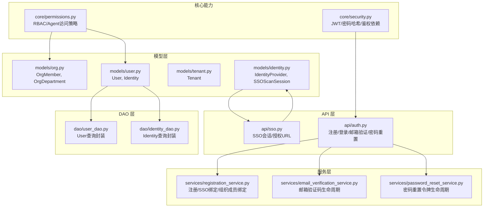
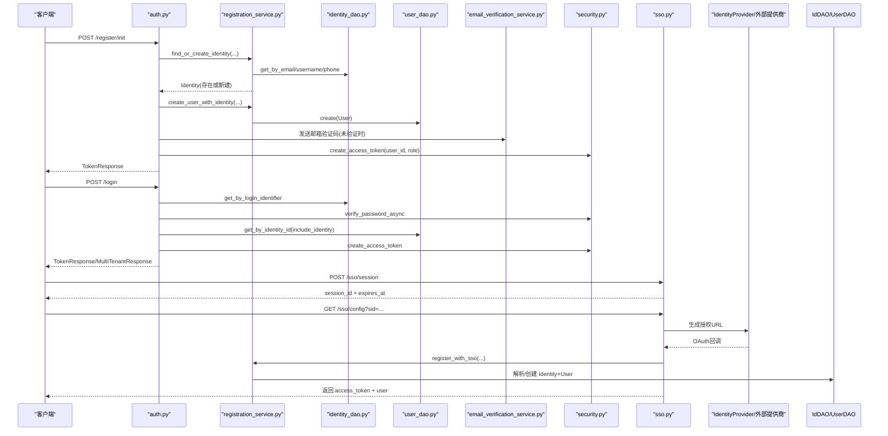
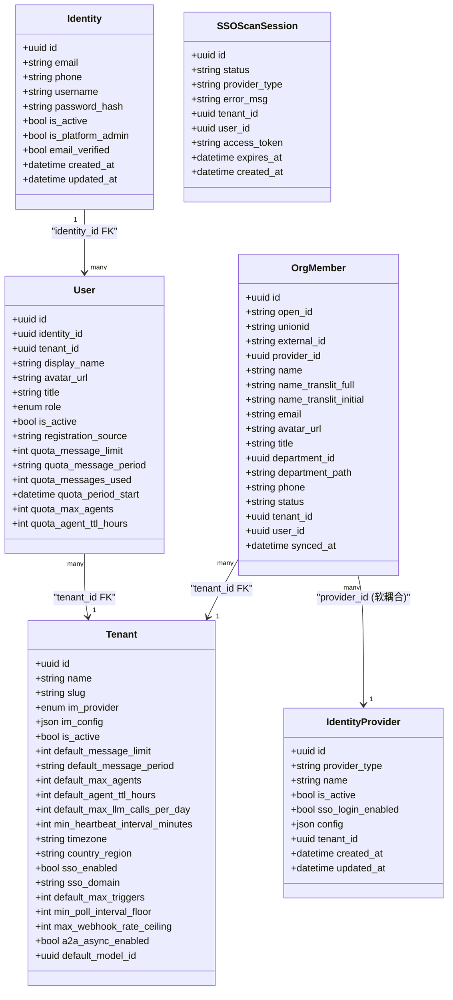
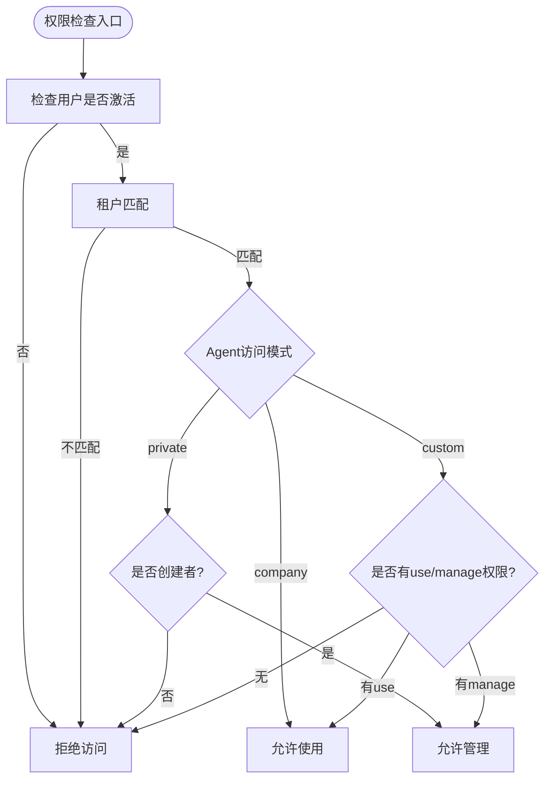
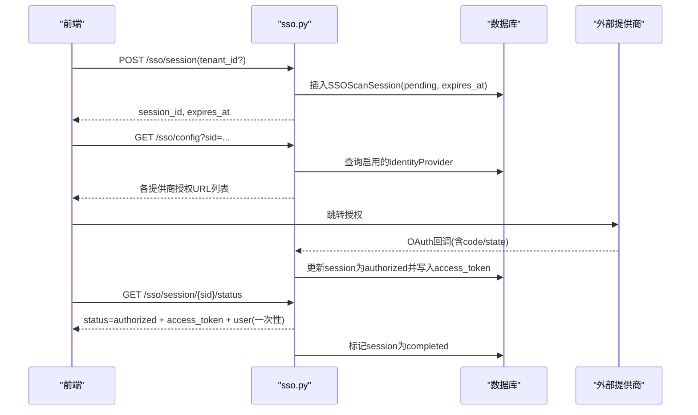
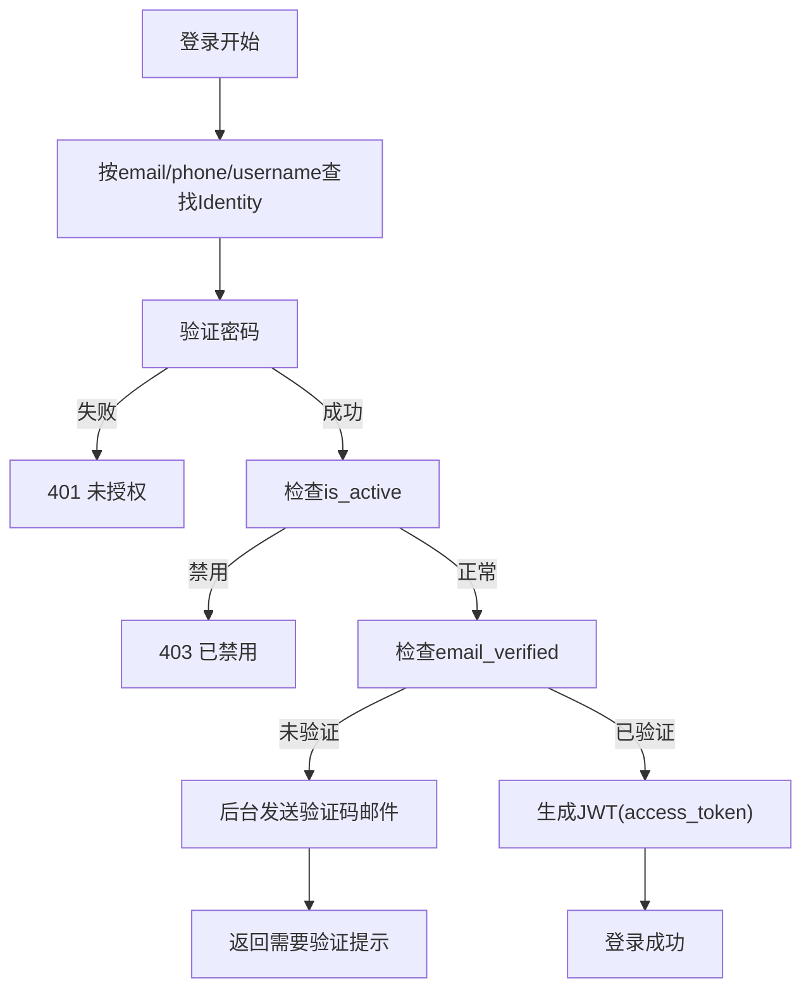
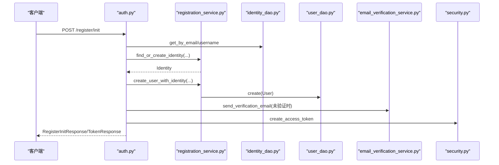
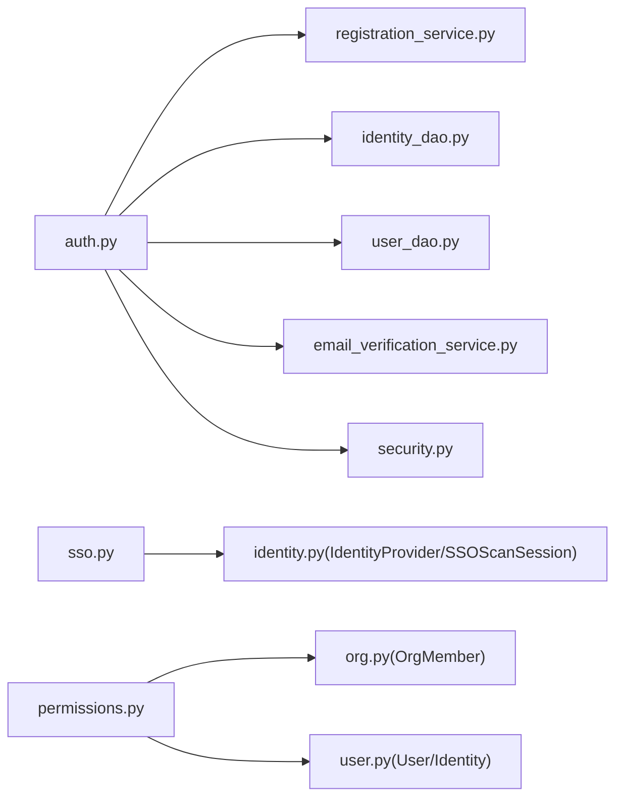

# 用户与身份模型

<cite>
**本文引用的文件**   
- [backend/app/models/user.py](file://backend/app/models/user.py)
- [backend/app/models/identity.py](file://backend/app/models/identity.py)
- [backend/app/models/org.py](file://backend/app/models/org.py)
- [backend/app/models/tenant.py](file://backend/app/models/tenant.py)
- [backend/app/core/permissions.py](file://backend/app/core/permissions.py)
- [backend/app/api/auth.py](file://backend/app/api/auth.py)
- [backend/app/api/sso.py](file://backend/app/api/sso.py)
- [backend/app/services/registration_service.py](file://backend/app/services/registration_service.py)
- [backend/app/services/email_verification_service.py](file://backend/app/services/email_verification_service.py)
- [backend/app/services/password_reset_service.py](file://backend/app/services/password_reset_service.py)
- [backend/app/dao/user_dao.py](file://backend/app/dao/user_dao.py)
- [backend/app/dao/identity_dao.py](file://backend/app/dao/identity_dao.py)
- [backend/app/core/security.py](file://backend/app/core/security.py)
- [backend/alembic/versions/024_user_refactor.py](file://backend/alembic/versions/024_user_refactor.py)
- [backend/alembic/versions/028_refactor_user_system_phase2.py](file://backend/alembic/versions/028_refactor_user_system_phase2.py)
- [backend/alembic/versions/054_rename_web_identity_provider_to_platform.py](file://backend/alembic/versions/054_rename_web_identity_provider_to_platform.py)
</cite>

## 目录
1. [简介](#简介)
2. [项目结构](#项目结构)
3. [核心组件](#核心组件)
4. [架构总览](#架构总览)
5. [详细组件分析](#详细组件分析)
6. [依赖关系分析](#依赖关系分析)
7. [性能考虑](#性能考虑)
8. [故障排查指南](#故障排查指南)
9. [结论](#结论)
10. [附录](#附录)

## 简介
本文件系统性梳理 Clawith 平台的用户与身份管理数据模型，覆盖以下关键主题：
- 实体表结构与字段说明：Identity（全局身份）、User（租户内成员）、OrgMember/OrgDepartment（组织成员与部门）
- 多租户隔离与成员映射：User.tenant_id、OrgMember.tenant_id、IdentityProvider 的租户级配置
- 角色与权限体系（RBAC）：平台管理员、组织管理员、Agent 管理员、普通成员；基于角色的访问控制与 Agent 使用策略
- SSO 集成支持：IdentityProvider、SSOScanSession、OAuth 回调与扫码登录流程
- 用户状态管理与安全策略：is_active、email_verified、密码哈希、邮箱验证、密码重置
- 完整数据流示例：注册、登录、权限校验
- 数据迁移与版本兼容：Alembic 迁移脚本对历史结构的演进与兼容性处理

## 项目结构
围绕用户与身份的核心代码分布在 models、api、services、dao、core 等模块中。下图展示与用户身份相关的关键文件与职责划分。

**图表来源** 
- [backend/app/models/user.py](file://backend/app/models/user.py)
- [backend/app/models/identity.py](file://backend/app/models/identity.py)
- [backend/app/models/org.py](file://backend/app/models/org.py)
- [backend/app/models/tenant.py](file://backend/app/models/tenant.py)
- [backend/app/api/auth.py](file://backend/app/api/auth.py)
- [backend/app/api/sso.py](file://backend/app/api/sso.py)
- [backend/app/services/registration_service.py](file://backend/app/services/registration_service.py)
- [backend/app/services/email_verification_service.py](file://backend/app/services/email_verification_service.py)
- [backend/app/services/password_reset_service.py](file://backend/app/services/password_reset_service.py)
- [backend/app/dao/user_dao.py](file://backend/app/dao/user_dao.py)
- [backend/app/dao/identity_dao.py](file://backend/app/dao/identity_dao.py)
- [backend/app/core/permissions.py](file://backend/app/core/permissions.py)
- [backend/app/core/security.py](file://backend/app/core/security.py)

**章节来源**
- [backend/app/models/user.py:16-119](file://backend/app/models/user.py#L16-L119)
- [backend/app/models/identity.py:14-67](file://backend/app/models/identity.py#L14-L67)
- [backend/app/models/org.py:13-98](file://backend/app/models/org.py#L13-L98)
- [backend/app/models/tenant.py:13-73](file://backend/app/models/tenant.py#L13-L73)

## 核心组件
本节聚焦 User、Identity、OrgMember、Tenant、IdentityProvider、SSOScanSession 等核心实体的表结构与关键字段。

- Identity（全局身份）
  - 主键 id（UUID）
  - 登录标识：email（唯一索引）、phone（唯一索引）、username（唯一索引）
  - 认证信息：password_hash
  - 全局状态：is_active、is_platform_admin、email_verified
  - 时间戳：created_at、updated_at
  - 关系：与 User 一对多（一个 Identity 可对应多个租户内的 User）

- User（租户内成员）
  - 主键 id（UUID）
  - 关联 identity_id（外键指向 identities.id）
  - 租户上下文 tenant_id（外键指向 tenants.id）
  - 个人资料：display_name、avatar_url、title
  - 角色 role（枚举：platform_admin、org_admin、agent_admin、member）
  - 状态 is_active、registration_source
  - 配额字段：消息限额、Agent 数量/TTL 等
  - 关联 identity（selectinload 避免异步 IO 问题）

- OrgMember（组织成员）
  - 通用标识：open_id、unionid、external_id、provider_id（软耦合）
  - 个人信息：name、name_translit_full/initial、email、avatar_url、title、phone
  - 组织关系：department_id、department_path、tenant_id
  - 用户关联 user_id（软耦合）
  - 状态 status、同步时间 synced_at

- Tenant（租户）
  - 基本信息：name、slug（唯一）、im_provider、im_config
  - 开关与默认值：sso_enabled、sso_domain、默认配额、时区、国家地区码
  - 其他：a2a_async_enabled、default_model_id

- IdentityProvider（外部身份提供方）
  - provider_type（字符串枚举：feishu/dingtalk/wecom/google_workspace/microsoft_teams/google/github）
  - name、is_active、sso_login_enabled、config（JSON）
  - 可选 tenant_id（软耦合）

- SSOScanSession（SSO 扫码会话）
  - status（pending/scanned/authorized/expired/completed）、provider_type、error_msg
  - 上下文：tenant_id、user_id、access_token
  - 过期时间 expires_at、创建时间 created_at

**章节来源**
- [backend/app/models/user.py:16-119](file://backend/app/models/user.py#L16-L119)
- [backend/app/models/identity.py:14-67](file://backend/app/models/identity.py#L14-L67)
- [backend/app/models/org.py:13-98](file://backend/app/models/org.py#L13-L98)
- [backend/app/models/tenant.py:13-73](file://backend/app/models/tenant.py#L13-L73)

## 架构总览
下图展示了用户注册、登录、SSO 与权限校验的整体调用链与数据流向。

**图表来源** 
- [backend/app/api/auth.py:114-413](file://backend/app/api/auth.py#L114-L413)
- [backend/app/api/auth.py:422-542](file://backend/app/api/auth.py#L422-L542)
- [backend/app/api/sso.py:16-159](file://backend/app/api/sso.py#L16-L159)
- [backend/app/services/registration_service.py:265-339](file://backend/app/services/registration_service.py#L265-L339)
- [backend/app/dao/identity_dao.py:17-46](file://backend/app/dao/identity_dao.py#L17-L46)
- [backend/app/dao/user_dao.py:16-34](file://backend/app/dao/user_dao.py#L16-L34)
- [backend/app/core/security.py:128-150](file://backend/app/core/security.py#L128-L150)

## 详细组件分析

### 实体类图（User、Identity、OrgMember、Tenant、IdentityProvider、SSOScanSession）

**图表来源** 
- [backend/app/models/user.py:16-119](file://backend/app/models/user.py#L16-L119)
- [backend/app/models/identity.py:14-67](file://backend/app/models/identity.py#L14-L67)
- [backend/app/models/org.py:13-98](file://backend/app/models/org.py#L13-L98)
- [backend/app/models/tenant.py:13-73](file://backend/app/models/tenant.py#L13-L73)

**章节来源**
- [backend/app/models/user.py:16-119](file://backend/app/models/user.py#L16-L119)
- [backend/app/models/identity.py:14-67](file://backend/app/models/identity.py#L14-L67)
- [backend/app/models/org.py:13-98](file://backend/app/models/org.py#L13-L98)
- [backend/app/models/tenant.py:13-73](file://backend/app/models/tenant.py#L13-L73)

### RBAC 与权限模型
- 角色层级：member < agent_admin < org_admin < platform_admin
- 平台管理员与组织管理员具备更广泛的访问能力；Agent 访问策略支持 company/private/custom 三种模式
- can_use_agent/can_manage_agent 等函数实现细粒度权限判断，结合 AgentPermission 进行自定义授权
- 可见性评估：evaluate_roster_* 系列函数用于目录驱动的人/Agent 可见性与联系能力判定

**图表来源** 
- [backend/app/core/permissions.py:44-92](file://backend/app/core/permissions.py#L44-L92)
- [backend/app/core/permissions.py:95-129](file://backend/app/core/permissions.py#L95-L129)
- [backend/app/core/permissions.py:258-259](file://backend/app/core/permissions.py#L258-L259)

**章节来源**
- [backend/app/core/permissions.py:44-129](file://backend/app/core/permissions.py#L44-L129)
- [backend/app/core/permissions.py:258-259](file://backend/app/core/permissions.py#L258-L259)

### SSO 集成与扫码登录
- IdentityProvider 配置支持多种类型（飞书、钉钉、企业微信、Google Workspace、Microsoft Teams、Google、GitHub），并可通过 sso_login_enabled 控制是否启用 SSO 登录
- SSOScanSession 提供扫码会话生命周期管理（pending→scanned→authorized→completed/expired）
- API 提供创建会话、获取授权 URL、轮询状态、一次性返回 token 与用户信息的能力

**图表来源** 
- [backend/app/api/sso.py:16-159](file://backend/app/api/sso.py#L16-L159)
- [backend/app/models/identity.py:50-67](file://backend/app/models/identity.py#L50-L67)

**章节来源**
- [backend/app/api/sso.py:16-159](file://backend/app/api/sso.py#L16-L159)
- [backend/app/models/identity.py:26-47](file://backend/app/models/identity.py#L26-L47)

### 用户状态管理与安全策略
- 用户状态：Identity.is_active、User.is_active、OrgMember.status
- 邮箱验证：Identity.email_verified；未配置 SMTP 时自动验证并激活
- 密码安全：bcrypt 哈希，异步执行避免阻塞事件循环；JWT 访问令牌包含 sub(role) 与 exp
- 邮箱验证码：Redis 存储一次性验证码，带 TTL；支持构建验证链接
- 密码重置：Redis 存储一次性重置令牌，支持构建重置链接

**图表来源** 
- [backend/app/api/auth.py:422-542](file://backend/app/api/auth.py#L422-L542)
- [backend/app/core/security.py:42-51](file://backend/app/core/security.py#L42-L51)
- [backend/app/core/security.py:128-150](file://backend/app/core/security.py#L128-L150)
- [backend/app/services/email_verification_service.py:26-58](file://backend/app/services/email_verification_service.py#L26-L58)
- [backend/app/services/password_reset_service.py:23-49](file://backend/app/services/password_reset_service.py#L23-L49)

**章节来源**
- [backend/app/api/auth.py:422-542](file://backend/app/api/auth.py#L422-L542)
- [backend/app/core/security.py:42-51](file://backend/app/core/security.py#L42-L51)
- [backend/app/core/security.py:128-150](file://backend/app/core/security.py#L128-L150)
- [backend/app/services/email_verification_service.py:26-58](file://backend/app/services/email_verification_service.py#L26-L58)
- [backend/app/services/password_reset_service.py:23-49](file://backend/app/services/password_reset_service.py#L23-L49)

### 用户注册、登录、权限验证的数据流示例
- 注册流程（初始化）：
  - 检查重复/已有 Identity
  - 创建或复用 Identity（必要时自动验证）
  - 根据首用户逻辑创建默认租户
  - 创建 User（role=platform_admin/member）
  - 发送邮箱验证码（若未验证）
  - 生成 JWT 并返回

- 登录流程：
  - 通过 login_identifier 查找 Identity
  - 校验密码与账户状态
  - 若未验证且无 SMTP，自动验证并激活
  - 选择租户（多租户场景返回选择列表）
  - 生成 JWT 并返回

- 权限验证：
  - 基于角色与 Agent 访问模式（company/private/custom）
  - 结合 AgentPermission 进行细粒度授权
  - 目录可见性评估（evaluate_roster_*）

**图表来源** 
- [backend/app/api/auth.py:138-253](file://backend/app/api/auth.py#L138-L253)
- [backend/app/services/registration_service.py:96-154](file://backend/app/services/registration_service.py#L96-L154)
- [backend/app/dao/identity_dao.py:17-46](file://backend/app/dao/identity_dao.py#L17-L46)
- [backend/app/dao/user_dao.py:16-34](file://backend/app/dao/user_dao.py#L16-L34)
- [backend/app/services/email_verification_service.py:94-111](file://backend/app/services/email_verification_service.py#L94-L111)
- [backend/app/core/security.py:128-150](file://backend/app/core/security.py#L128-L150)

**章节来源**
- [backend/app/api/auth.py:138-253](file://backend/app/api/auth.py#L138-L253)
- [backend/app/services/registration_service.py:96-154](file://backend/app/services/registration_service.py#L96-L154)
- [backend/app/dao/identity_dao.py:17-46](file://backend/app/dao/identity_dao.py#L17-L46)
- [backend/app/dao/user_dao.py:16-34](file://backend/app/dao/user_dao.py#L16-L34)
- [backend/app/services/email_verification_service.py:94-111](file://backend/app/services/email_verification_service.py#L94-L111)
- [backend/app/core/security.py:128-150](file://backend/app/core/security.py#L128-L150)

### 数据迁移与版本兼容性
- 024_user_refactor.py：引入 identity_providers、sso_scan_sessions；扩展 tenants(org_departments/org_members)；users 新增 primary_mobile、registration_source、external_id；删除旧 departments 表；部分软耦合设计（provider_id、user_id 无 FK）
- 028_refactor_user_system_phase2.py：创建 identities 表并将 users 中的认证与标识字段迁移至 identities；users 增加 identity_id 外键；清理冗余列（username/email/password_hash/email_verified/primary_mobile/primary_email）
- 054_rename_web_identity_provider_to_platform.py：将 web 提供商名称从 Web 改为 Platform，并同步更新 org_members.title

这些迁移确保：
- 历史数据平滑过渡（如 feishu_open_id→open_id、feishu_user_id→external_id）
- 幂等性与回滚能力（downgrade 脚本）
- 软耦合提升扩展性（provider_id、user_id 由程序校验）

**章节来源**
- [backend/alembic/versions/024_user_refactor.py:20-274](file://backend/alembic/versions/024_user_refactor.py#L20-L274)
- [backend/alembic/versions/028_refactor_user_system_phase2.py:22-152](file://backend/alembic/versions/028_refactor_user_system_phase2.py#L22-L152)
- [backend/alembic/versions/054_rename_web_identity_provider_to_platform.py:19-27](file://backend/alembic/versions/054_rename_web_identity_provider_to_platform.py#L19-L27)

## 依赖关系分析
- 模型依赖：User 引用 Identity（外键）；OrgMember 与 Tenant 通过 tenant_id 关联；IdentityProvider 与 OrgMember/OrgDepartment 采用软耦合（无 FK）
- DAO 依赖：UserDAO/IdentityDAO 封装常用查询，避免在业务层直接拼接 SQL
- 服务依赖：RegistrationService 协调 Identity/User/OrgMember 的创建与绑定；EmailVerificationService/PasswordResetService 管理 Redis 中的令牌
- API 依赖：auth.py 串联注册/登录/邮箱验证/密码重置；sso.py 管理 SSO 会话与授权 URL
- 核心能力：security.py 提供 JWT、密码哈希与鉴权依赖；permissions.py 实现 RBAC 与 Agent 访问策略

**图表来源** 
- [backend/app/api/auth.py:114-413](file://backend/app/api/auth.py#L114-L413)
- [backend/app/api/sso.py:16-159](file://backend/app/api/sso.py#L16-L159)
- [backend/app/services/registration_service.py:32-51](file://backend/app/services/registration_service.py#L32-L51)
- [backend/app/dao/identity_dao.py:11-24](file://backend/app/dao/identity_dao.py#L11-L24)
- [backend/app/dao/user_dao.py:10-25](file://backend/app/dao/user_dao.py#L10-L25)
- [backend/app/core/security.py:128-150](file://backend/app/core/security.py#L128-L150)
- [backend/app/core/permissions.py:44-92](file://backend/app/core/permissions.py#L44-L92)

**章节来源**
- [backend/app/api/auth.py:114-413](file://backend/app/api/auth.py#L114-L413)
- [backend/app/api/sso.py:16-159](file://backend/app/api/sso.py#L16-L159)
- [backend/app/services/registration_service.py:32-51](file://backend/app/services/registration_service.py#L32-L51)
- [backend/app/dao/identity_dao.py:11-24](file://backend/app/dao/identity_dao.py#L11-L24)
- [backend/app/dao/user_dao.py:10-25](file://backend/app/dao/user_dao.py#L10-L25)
- [backend/app/core/security.py:128-150](file://backend/app/core/security.py#L128-L150)
- [backend/app/core/permissions.py:44-92](file://backend/app/core/permissions.py#L44-L92)

## 性能考虑
- 异步 I/O：DAO 与 Service 均使用异步会话，避免阻塞事件循环
- CPU 密集型操作：密码哈希使用线程池（bcrypt）异步执行
- 懒加载与预加载：User.identity 使用 selectinload 避免异步上下文下的同步 IO 异常
- Redis 令牌：邮箱验证码与密码重置令牌采用 Redis 原子管道，保证一次性与 TTL
- 索引优化：identities(email/phone/username)、org_members(open_id/external_id/unionid/user_id)、tenants(sso_domain) 等索引提升查询效率

[本节为通用指导，无需特定文件引用]

## 故障排查指南
- 登录失败（401/403）：
  - 检查 Identity.password_hash 是否存在且正确
  - 检查 Identity.is_active、User.is_active、Tenant.is_active
  - 未验证邮箱时返回 403 并附带 needs_verification 提示
- 邮箱验证失败：
  - 确认 SMTP 配置可用；若无 SMTP，系统会自动验证并激活
  - 检查 Redis 中验证码是否过期或被消费
- SSO 登录异常：
  - 检查 IdentityProvider.sso_login_enabled 与 provider_type 配置
  - 查看 SSOScanSession 状态与错误信息
- 权限不足：
  - 检查用户角色与 Agent 访问模式（company/private/custom）
  - 确认 AgentPermission 是否存在且 scope_type=“user”

**章节来源**
- [backend/app/api/auth.py:422-542](file://backend/app/api/auth.py#L422-L542)
- [backend/app/services/email_verification_service.py:65-92](file://backend/app/services/email_verification_service.py#L65-L92)
- [backend/app/api/sso.py:32-71](file://backend/app/api/sso.py#L32-L71)
- [backend/app/core/permissions.py:481-518](file://backend/app/core/permissions.py#L481-L518)

## 结论
Clawith 的用户与身份模型以 Identity 为中心，结合 User 的多租户上下文与 OrgMember 的组织关系，构建了可扩展、高安全的身份管理体系。RBAC 与 Agent 访问策略提供了灵活的权限控制，SSO 集成与扫码登录增强了企业级体验。通过 Alembic 迁移与幂等设计，系统在演进过程中保持了良好的兼容性与稳定性。

[本节为总结，无需特定文件引用]

## 附录
- 角色与权限参考：
  - member、agent_admin、org_admin、platform_admin
  - Agent 访问模式：company、private、custom
- 关键 API：
  - /auth/register/init、/auth/login、/auth/me、/auth/switch-tenant
  - /sso/session、/sso/config、/sso/session/{sid}/status

[本节为补充信息，无需特定文件引用]