# 聊天与会话模型

<cite>
**本文引用的文件**   
- [chat_session.py](file://backend/app/models/chat_session.py)
- [participant.py](file://backend/app/models/participant.py)
- [group.py](file://backend/app/models/group.py)
- [session_context_state.py](file://backend/app/models/session_context_state.py)
- [audit.py](file://backend/app/models/audit.py)
- [chat_sessions.py](file://backend/app/api/chat_sessions.py)
- [messages.py](file://backend/app/api/messages.py)
- [group_websocket.py](file://backend/app/api/group_websocket.py)
- [group_chat_service.py](file://backend/app/services/group_chat_service.py)
- [group_realtime.py](file://backend/app/services/group_realtime.py)
- [chat_session_service.py](file://backend/app/services/chat_session_service.py)
- [004_add_chat_sessions.py](file://backend/alembic/versions/004_add_chat_sessions.py)
- [023_add_group_chat_fields.py](file://backend/alembic/versions/023_add_group_chat_fields.py)
- [046_add_primary_chat_sessions_and_unread.py](file://backend/alembic/versions/046_add_primary_chat_sessions_and_unread.py)
</cite>

## 目录
1. [简介](#简介)
2. [项目结构](#项目结构)
3. [核心组件](#核心组件)
4. [架构总览](#架构总览)
5. [详细组件分析](#详细组件分析)
6. [依赖关系分析](#依赖关系分析)
7. [性能考虑](#性能考虑)
8. [故障排查指南](#故障排查指南)
9. [结论](#结论)
10. [附录：数据操作示例](#附录数据操作示例)

## 简介
本文件系统化梳理 Clawith 平台“聊天与会话”相关的数据模型与运行机制，重点覆盖以下方面：
- ChatSession、Participant、Group、SessionContextState 等模型的结构定义与关系
- 一对一聊天（direct）、群组聊天（group）的数据结构设计
- 消息流转机制、会话状态管理与上下文持久化
- 历史消息存储与实时通信支持
- 会话创建、消息发送、上下文管理的完整数据操作路径
- 会话性能优化与数据归档策略建议

## 项目结构
围绕聊天与会话的核心代码分布在后端 models、services、api 以及数据库迁移脚本中：
- 数据模型：ChatSession、Participant、Group、SessionContextState、ChatMessage
- 服务层：会话生命周期（直聊）、群组管理、实时推送
- API 层：会话列表/创建/重命名/删除、运行时状态查询、工具执行对账、消息分页
- 实时通道：WebSocket 群组连接与消息广播
- 迁移脚本：会话表演进、群组字段扩展、主会话与未读计数

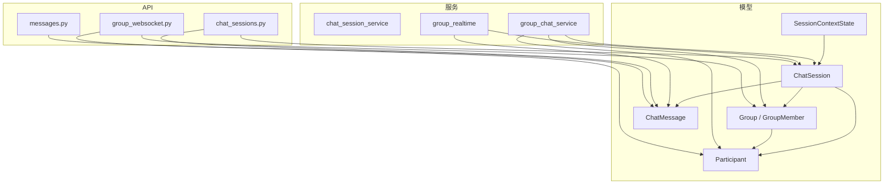

图表来源
- [chat_session.py:23-116](file://backend/app/models/chat_session.py#L23-L116)
- [participant.py:13-32](file://backend/app/models/participant.py#L13-L32)
- [group.py:24-95](file://backend/app/models/group.py#L24-L95)
- [session_context_state.py:25-101](file://backend/app/models/session_context_state.py#L25-L101)
- [audit.py:46-72](file://backend/app/models/audit.py#L46-L72)
- [chat_sessions.py:216-395](file://backend/app/api/chat_sessions.py#L216-L395)
- [messages.py:1-968](file://backend/app/api/messages.py#L1-L968)
- [group_websocket.py:51-118](file://backend/app/api/group_websocket.py#L51-L118)
- [group_chat_service.py:378-453](file://backend/app/services/group_chat_service.py#L378-L453)
- [group_realtime.py:40-66](file://backend/app/services/group_realtime.py#L40-L66)
- [chat_session_service.py:136-173](file://backend/app/services/chat_session_service.py#L136-L173)

章节来源
- [chat_session.py:23-116](file://backend/app/models/chat_session.py#L23-L116)
- [participant.py:13-32](file://backend/app/models/participant.py#L13-L32)
- [group.py:24-95](file://backend/app/models/group.py#L24-L95)
- [session_context_state.py:25-101](file://backend/app/models/session_context_state.py#L25-L101)
- [audit.py:46-72](file://backend/app/models/audit.py#L46-L72)
- [chat_sessions.py:216-395](file://backend/app/api/chat_sessions.py#L216-L395)
- [messages.py:1-968](file://backend/app/api/messages.py#L1-L968)
- [group_websocket.py:51-118](file://backend/app/api/group_websocket.py#L51-L118)
- [group_chat_service.py:378-453](file://backend/app/services/group_chat_service.py#L378-L453)
- [group_realtime.py:40-66](file://backend/app/services/group_realtime.py#L40-L66)
- [chat_session_service.py:136-173](file://backend/app/services/chat_session_service.py#L136-L173)

## 核心组件
- ChatSession：统一会话实体，支持 direct、group、a2a、trigger 四类会话；维护租户、代理、用户、群组、是否主会话、最后阅读时间、软删除等。
- Participant：统一身份抽象，将 User 与 Agent 抽象为可参与对话的“参与者”。
- Group/GroupMember：原生群组及其成员关系，包含角色、加入/移除时间、按会话维度的已读水位。
- SessionContextState：会话上下文压缩后的最新摘要与版本控制，用于长期记忆与快速重建上下文。
- ChatMessage：统一消息记录，承载角色、内容、关联会话、提及、思考过程等。

章节来源
- [chat_session.py:23-116](file://backend/app/models/chat_session.py#L23-L116)
- [participant.py:13-32](file://backend/app/models/participant.py#L13-L32)
- [group.py:24-95](file://backend/app/models/group.py#L24-L95)
- [session_context_state.py:25-101](file://backend/app/models/session_context_state.py#L25-L101)
- [audit.py:46-72](file://backend/app/models/audit.py#L46-L72)

## 架构总览
下图展示从 API 到模型与服务的关键交互路径，涵盖会话创建、消息写入、上下文更新与实时推送。

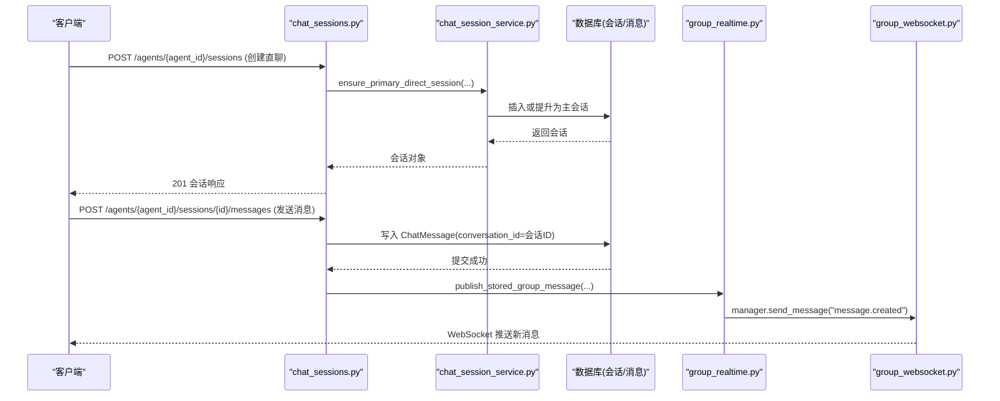

图表来源
- [chat_sessions.py:358-395](file://backend/app/api/chat_sessions.py#L358-L395)
- [chat_session_service.py:136-173](file://backend/app/services/chat_session_service.py#L136-L173)
- [audit.py:46-72](file://backend/app/models/audit.py#L46-L72)
- [group_realtime.py:69-121](file://backend/app/services/group_realtime.py#L69-L121)
- [group_websocket.py:51-118](file://backend/app/api/group_websocket.py#L51-L118)

## 详细组件分析

### ChatSession 模型与索引设计
- 字段要点
  - tenant_id、agent_id、user_id、source_channel、external_conv_id、is_group、group_name、is_primary、last_read_at_by_user、deleted_at、created_at/updated_at、last_message_at
  - session_type 限定为 direct/group/a2a/trigger
- 约束与索引
  - 唯一约束：(agent_id, external_conv_id)、(tenant_id, id)
  - 条件唯一索引：针对 primary direct 与 primary group 的主会话
  - 常用索引：tenant_id、group_id、is_primary、created_at
- 业务含义
  - is_primary 标识平台级主会话，便于“最近活跃”和“未读数”计算
  - last_read_at_by_user 驱动未读计数与红点
  - is_group 区分群会话，群会话 user_id 为空，显示 group_name

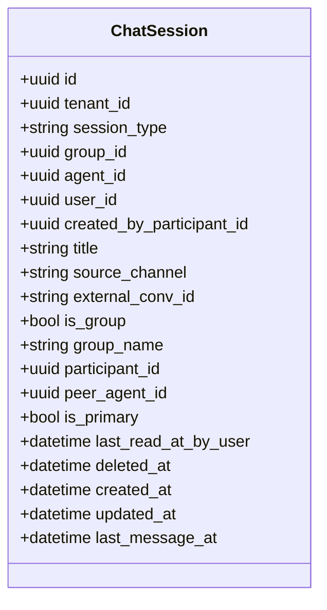

图表来源
- [chat_session.py:23-116](file://backend/app/models/chat_session.py#L23-L116)

章节来源
- [chat_session.py:23-116](file://backend/app/models/chat_session.py#L23-L116)
- [004_add_chat_sessions.py:13-33](file://backend/alembic/versions/004_add_chat_sessions.py#L13-L33)
- [023_add_group_chat_fields.py:20-42](file://backend/alembic/versions/023_add_group_chat_fields.py#L20-L42)
- [046_add_primary_chat_sessions_and_unread.py:19-115](file://backend/alembic/versions/046_add_primary_chat_sessions_and_unread.py#L19-L115)

### Participant 模型
- 作用：统一 User/Agent 的身份，供 ChatSession、ChatMessage 等引用
- 关键字段：type(user/agent)、ref_id、display_name、avatar_url

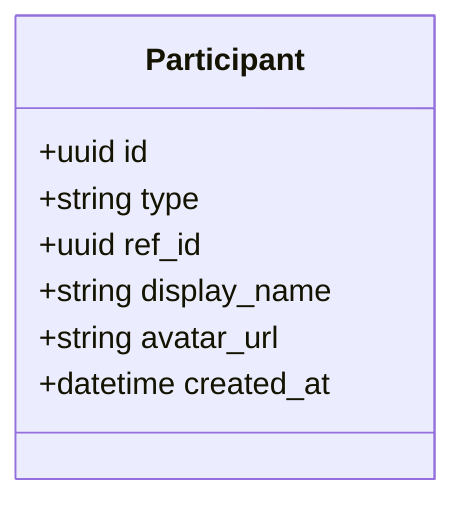

图表来源
- [participant.py:13-32](file://backend/app/models/participant.py#L13-L32)

章节来源
- [participant.py:13-32](file://backend/app/models/participant.py#L13-L32)

### Group 与 GroupMember
- Group：租户内长驻群组，含名称、描述、创建者、软删除与时间戳
- GroupMember：成员关系，角色(manager/member)、加入/移除时间、按会话维度的 session_read_state(JSONB)

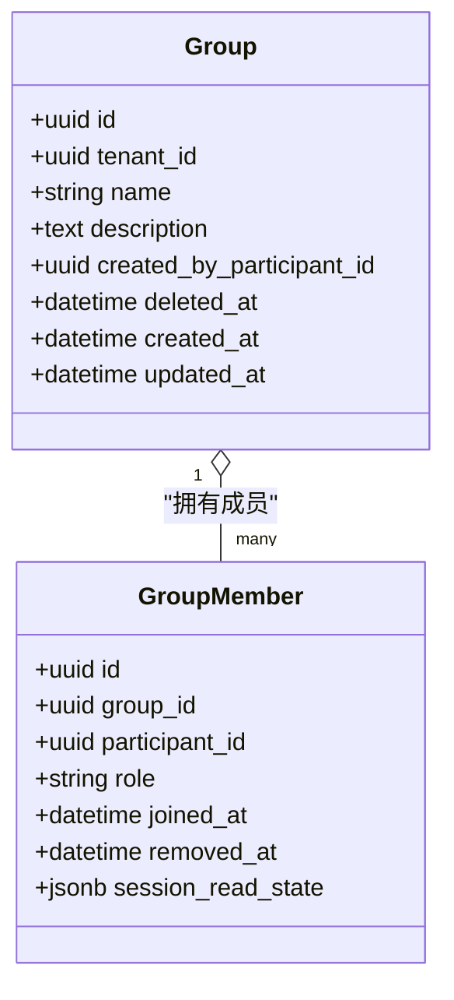

图表来源
- [group.py:24-95](file://backend/app/models/group.py#L24-L95)

章节来源
- [group.py:24-95](file://backend/app/models/group.py#L24-L95)

### SessionContextState 模型
- 作用：保存会话的最新压缩上下文（摘要、需求、决策、待办、证据与工作区引用），并维护乐观锁 version
- 关键约束：version>=1、与 chat_sessions 的联合外键、按 session_id 唯一

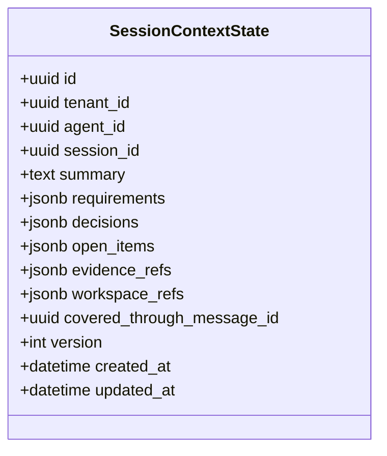

图表来源
- [session_context_state.py:25-101](file://backend/app/models/session_context_state.py#L25-L101)

章节来源
- [session_context_state.py:25-101](file://backend/app/models/session_context_state.py#L25-L101)

### ChatMessage 模型
- 作用：统一消息载体，role(user/assistant/system/tool_call)，conversation_id 指向会话 ID
- 附加信息：thinking、mentions(JSONB)、participant_id、created_at

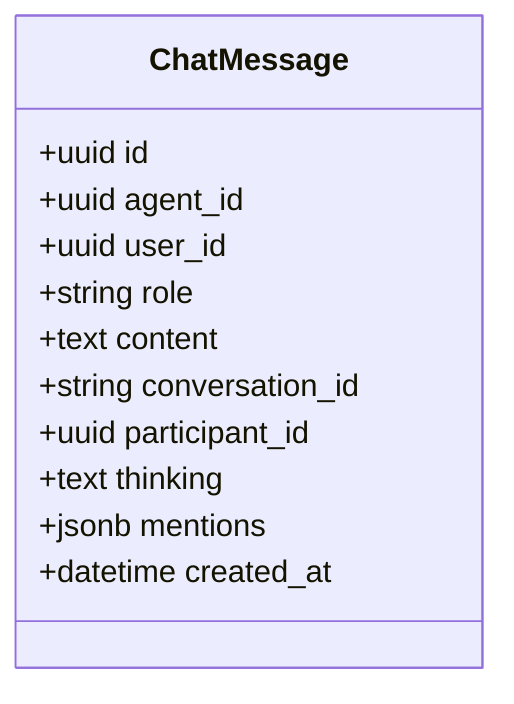

图表来源
- [audit.py:46-72](file://backend/app/models/audit.py#L46-L72)

章节来源
- [audit.py:46-72](file://backend/app/models/audit.py#L46-L72)

### 一对一聊天（Direct）数据流与状态管理
- 会话创建：确保主会话存在或提升已有会话为主会话，避免重复创建
- 消息写入：以 conversation_id=会话ID 落库，last_message_at 由上层逻辑更新
- 未读计数：基于 last_read_at_by_user 与消息 created_at 比较统计
- 运行时状态：通过 AgentRun 与运行态读取器暴露 active_run/waiting_user/cancel/reconcile 能力

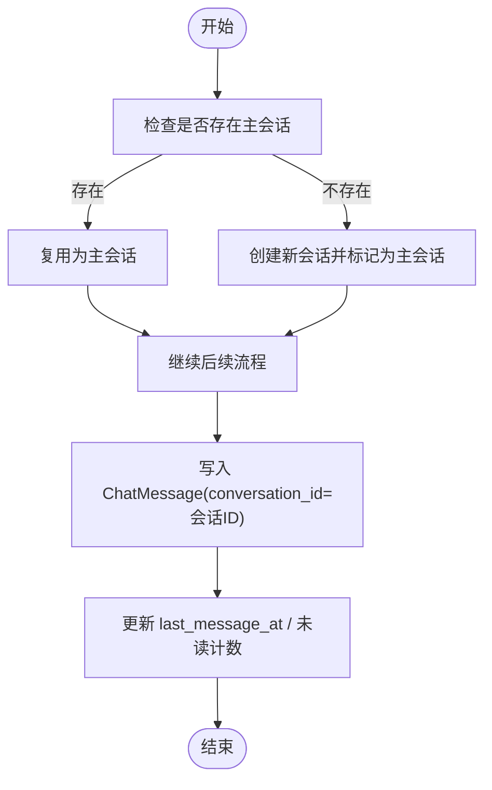

图表来源
- [chat_session_service.py:136-173](file://backend/app/services/chat_session_service.py#L136-L173)
- [chat_sessions.py:358-395](file://backend/app/api/chat_sessions.py#L358-L395)
- [audit.py:46-72](file://backend/app/models/audit.py#L46-L72)

章节来源
- [chat_session_service.py:136-173](file://backend/app/services/chat_session_service.py#L136-L173)
- [chat_sessions.py:358-395](file://backend/app/api/chat_sessions.py#L358-L395)

### 群组聊天（Group）数据流与实时通信
- 群组与会话：Group 与 GroupMember 管理成员；ChatSession(session_type=group) 承载群会话
- 消息发布：消息落库后，通过 group_realtime 广播 message.created 至 WebSocket
- 实时连接：group_websocket 校验成员资格，建立连接并按组名空间推送

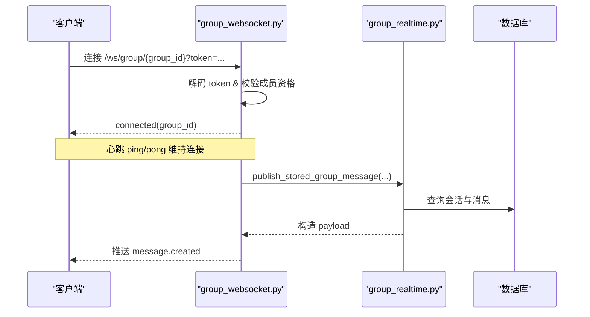

图表来源
- [group_websocket.py:51-118](file://backend/app/api/group_websocket.py#L51-L118)
- [group_realtime.py:69-121](file://backend/app/services/group_realtime.py#L69-L121)

章节来源
- [group_websocket.py:51-118](file://backend/app/api/group_websocket.py#L51-L118)
- [group_realtime.py:69-121](file://backend/app/services/group_realtime.py#L69-L121)

### 上下文状态持久化与压缩
- SessionContextState 提供滚动摘要与结构化字段（requirements/decisions/open_items/evidence_refs/workspace_refs）
- 通过 version 实现乐观并发控制，避免并发更新冲突
- covered_through_message_id 指示上下文覆盖到的消息边界，便于增量压缩

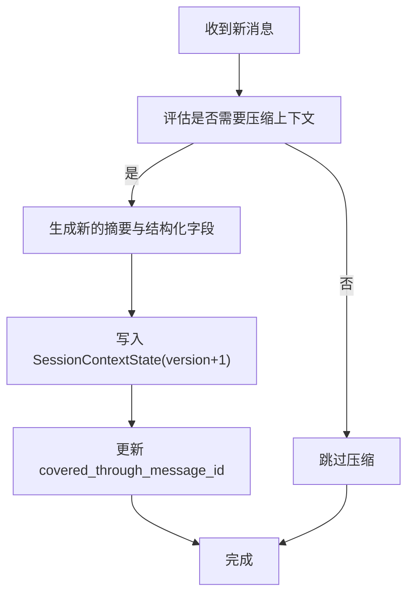

图表来源
- [session_context_state.py:25-101](file://backend/app/models/session_context_state.py#L25-L101)

章节来源
- [session_context_state.py:25-101](file://backend/app/models/session_context_state.py#L25-L101)

## 依赖关系分析
- 模型间依赖
  - ChatSession 引用 Participant、Group、Agent、User
  - ChatMessage 引用 Agent、User、Participant，并以 conversation_id 关联 ChatSession
  - SessionContextState 外键关联 ChatSession(tenant_id, session_id)
- 服务与 API
  - chat_session_service 负责直聊会话的生命周期与取消任务编排
  - group_chat_service 负责群组 CRUD、成员邀请/移除、会话授权
  - group_realtime 负责消息落库后的实时广播
  - chat_sessions API 暴露会话列表/创建/重命名/删除、运行时状态、工具执行对账
  - messages API 提供消息分页与游标

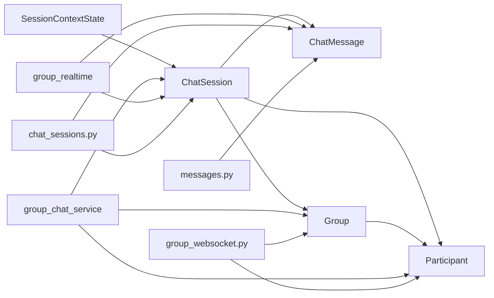

图表来源
- [chat_session.py:23-116](file://backend/app/models/chat_session.py#L23-L116)
- [audit.py:46-72](file://backend/app/models/audit.py#L46-L72)
- [group.py:24-95](file://backend/app/models/group.py#L24-L95)
- [session_context_state.py:25-101](file://backend/app/models/session_context_state.py#L25-L101)
- [chat_sessions.py:216-395](file://backend/app/api/chat_sessions.py#L216-L395)
- [messages.py:1-968](file://backend/app/api/messages.py#L1-L968)
- [group_websocket.py:51-118](file://backend/app/api/group_websocket.py#L51-L118)
- [group_chat_service.py:378-453](file://backend/app/services/group_chat_service.py#L378-L453)
- [group_realtime.py:69-121](file://backend/app/services/group_realtime.py#L69-L121)

章节来源
- [chat_session.py:23-116](file://backend/app/models/chat_session.py#L23-L116)
- [audit.py:46-72](file://backend/app/models/audit.py#L46-L72)
- [group.py:24-95](file://backend/app/models/group.py#L24-L95)
- [session_context_state.py:25-101](file://backend/app/models/session_context_state.py#L25-L101)
- [chat_sessions.py:216-395](file://backend/app/api/chat_sessions.py#L216-L395)
- [messages.py:1-968](file://backend/app/api/messages.py#L1-L968)
- [group_websocket.py:51-118](file://backend/app/api/group_websocket.py#L51-L118)
- [group_chat_service.py:378-453](file://backend/app/services/group_chat_service.py#L378-L453)
- [group_realtime.py:69-121](file://backend/app/services/group_realtime.py#L69-L121)

## 性能考虑
- 索引与查询
  - 使用 tenant_id、is_primary、created_at、last_message_at 等索引加速会话列表与未读统计
  - 条件唯一索引保障主会话唯一性，避免并发竞争
- 游标分页
  - 消息分页采用 cursor = "<ISO时间>|<UUID>"，避免深翻页性能问题
- 未读计数
  - 基于 last_read_at_by_user 与消息 created_at 的比较，减少全量扫描
- 上下文压缩
  - 通过 SessionContextState 的 version 与 covered_through_message_id 控制增量压缩，降低大上下文开销
- 实时推送
  - 推送失败不阻塞消息落库，保证最终一致性；心跳保活连接

[本节为通用指导，无需特定文件来源]

## 故障排查指南
- 会话未找到/权限不足
  - 检查会话过滤条件（tenant_id、agent_id、user_id、session_type、deleted_at）
  - 确认用户是否为会话所有者或具备管理员权限
- 主会话冲突
  - 检查 is_primary 条件唯一索引与并发锁（advisory lock）
- 未读计数异常
  - 核对 last_read_at_by_user 初始化与更新逻辑
- 实时推送失败
  - 查看 group_realtime 日志与 WebSocket 连接状态；确认组成员资格校验
- 上下文压缩失败
  - 检查 version 递增与 covered_through_message_id 的一致性

章节来源
- [chat_sessions.py:697-731](file://backend/app/api/chat_sessions.py#L697-L731)
- [group_websocket.py:51-118](file://backend/app/api/group_websocket.py#L51-L118)
- [group_realtime.py:40-66](file://backend/app/services/group_realtime.py#L40-L66)
- [session_context_state.py:25-101](file://backend/app/models/session_context_state.py#L25-L101)

## 结论
Clawith 的聊天与会话模型以 ChatSession 为核心，结合 Participant 统一身份、Group 群组管理、SessionContextState 上下文压缩与 ChatMessage 消息记录，形成一套可扩展、高性能且支持实时通信的统一聊天基座。通过完善的索引、游标分页、未读计数与乐观锁机制，系统在保证一致性的同时具备良好的扩展性与可维护性。

[本节为总结性内容，无需特定文件来源]

## 附录：数据操作示例
以下为典型数据操作的步骤说明（不包含具体代码片段，仅给出路径参考）：
- 创建一对一会话
  - 调用接口：POST /agents/{agent_id}/sessions
  - 服务方法：ensure_primary_direct_session / create_direct_session
  - 参考路径：[chat_sessions.py:358-395](file://backend/app/api/chat_sessions.py#L358-L395)、[chat_session_service.py:136-173](file://backend/app/services/chat_session_service.py#L136-L173)
- 发送消息
  - 调用接口：POST /agents/{agent_id}/sessions/{session_id}/messages
  - 写入模型：ChatMessage(conversation_id=session_id)
  - 参考路径：[messages.py:1-968](file://backend/app/api/messages.py#L1-L968)、[audit.py:46-72](file://backend/app/models/audit.py#L46-L72)
- 获取会话消息（游标分页）
  - 调用接口：GET /agents/{agent_id}/sessions/{session_id}/messages?limit=&before=
  - 游标格式：<ISO时间>|<UUID>
  - 参考路径：[chat_sessions.py:794-860](file://backend/app/api/chat_sessions.py#L794-L860)
- 更新会话标题
  - 调用接口：PATCH /agents/{agent_id}/sessions/{session_id}
  - 参考路径：[chat_sessions.py:670-695](file://backend/app/api/chat_sessions.py#L670-L695)
- 软删除会话
  - 调用接口：DELETE /agents/{agent_id}/sessions/{session_id}
  - 服务方法：soft_delete_direct_session（会编排取消运行）
  - 参考路径：[chat_sessions.py:697-731](file://backend/app/api/chat_sessions.py#L697-L731)、[chat_session_service.py:271-324](file://backend/app/services/chat_session_service.py#L271-L324)
- 群组创建与成员邀请
  - 服务方法：create_group、invite_group_member
  - 参考路径：[group_chat_service.py:378-453](file://backend/app/services/group_chat_service.py#L378-L453)、[group_chat_service.py:725-781](file://backend/app/services/group_chat_service.py#L725-L781)
- 群组实时推送
  - 服务方法：publish_stored_group_message、publish_group_message_created
  - WebSocket：/ws/group/{group_id}
  - 参考路径：[group_realtime.py:69-121](file://backend/app/services/group_realtime.py#L69-L121)、[group_websocket.py:51-118](file://backend/app/api/group_websocket.py#L51-L118)
- 上下文状态更新
  - 写入 SessionContextState（version+1），更新 covered_through_message_id
  - 参考路径：[session_context_state.py:25-101](file://backend/app/models/session_context_state.py#L25-L101)

章节来源
- [chat_sessions.py:358-395](file://backend/app/api/chat_sessions.py#L358-L395)
- [chat_session_service.py:136-173](file://backend/app/services/chat_session_service.py#L136-L173)
- [messages.py:1-968](file://backend/app/api/messages.py#L1-L968)
- [audit.py:46-72](file://backend/app/models/audit.py#L46-L72)
- [chat_sessions.py:794-860](file://backend/app/api/chat_sessions.py#L794-L860)
- [chat_sessions.py:670-695](file://backend/app/api/chat_sessions.py#L670-L695)
- [chat_sessions.py:697-731](file://backend/app/api/chat_sessions.py#L697-L731)
- [chat_session_service.py:271-324](file://backend/app/services/chat_session_service.py#L271-L324)
- [group_chat_service.py:378-453](file://backend/app/services/group_chat_service.py#L378-L453)
- [group_chat_service.py:725-781](file://backend/app/services/group_chat_service.py#L725-L781)
- [group_realtime.py:69-121](file://backend/app/services/group_realtime.py#L69-L121)
- [group_websocket.py:51-118](file://backend/app/api/group_websocket.py#L51-L118)
- [session_context_state.py:25-101](file://backend/app/models/session_context_state.py#L25-L101)