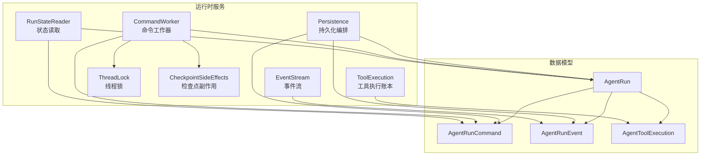
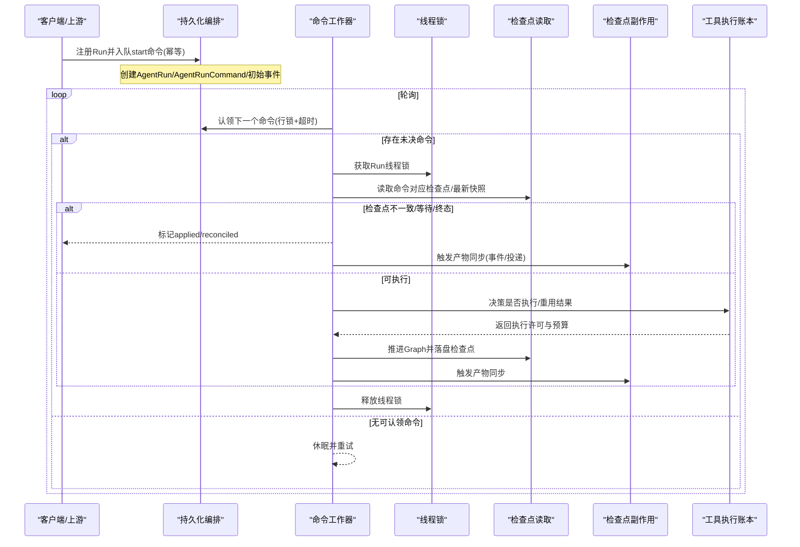
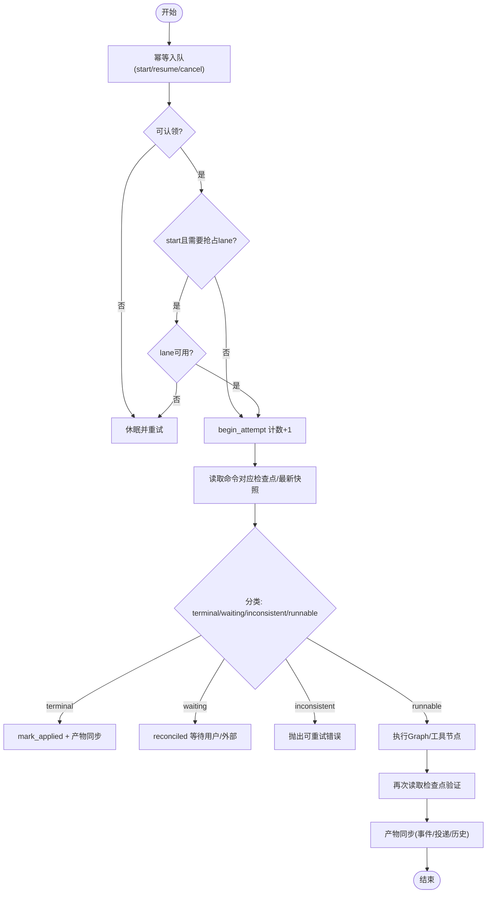
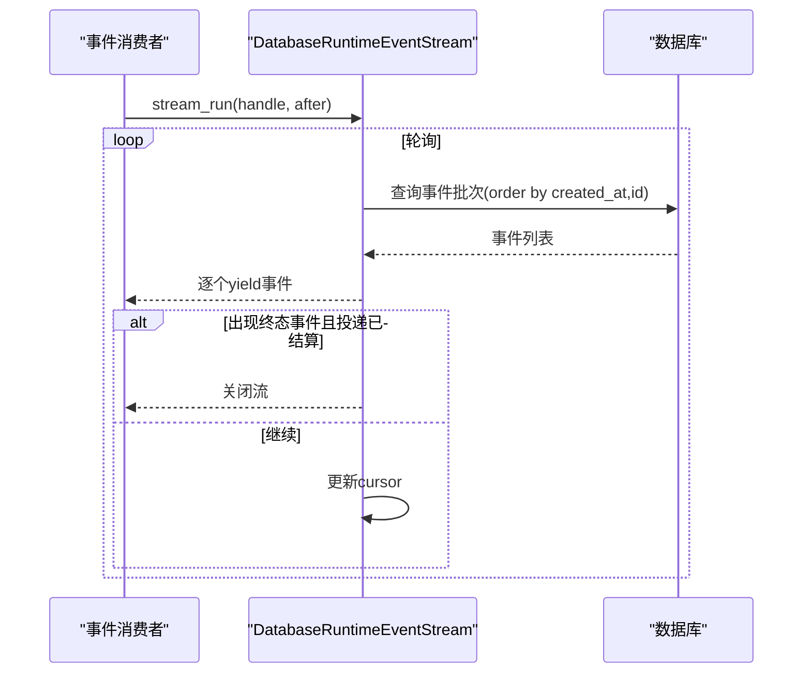
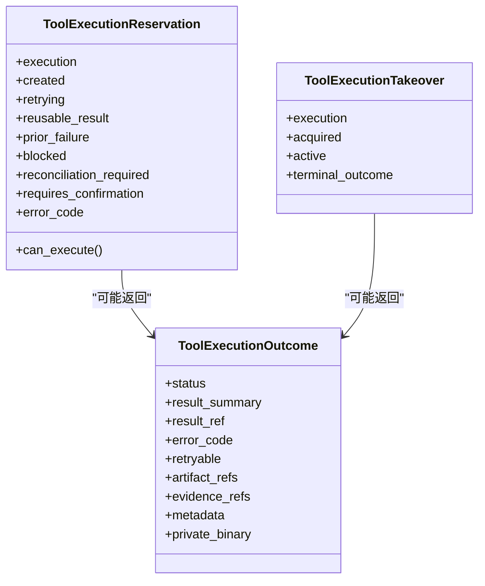
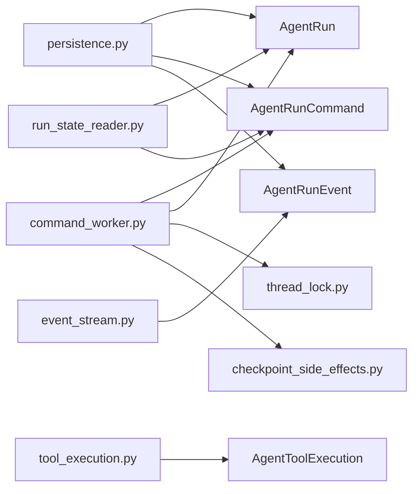

# 运行时执行模型

<cite>
**本文引用的文件**   
- [agent_run.py](file://backend/app/models/agent_run.py)
- [agent_run_command.py](file://backend/app/models/agent_run_command.py)
- [agent_run_event.py](file://backend/app/models/agent_run_event.py)
- [agent_tool_execution.py](file://backend/app/models/agent_tool_execution.py)
- [command_worker.py](file://backend/app/services/agent_runtime/command_worker.py)
- [tool_execution.py](file://backend/app/services/agent_runtime/tool_execution.py)
- [persistence.py](file://backend/app/services/agent_runtime/persistence.py)
- [state.py](file://backend/app/services/agent_runtime/state.py)
- [thread_lock.py](file://backend/app/services/agent_runtime/thread_lock.py)
- [event_stream.py](file://backend/app/services/agent_runtime/event_stream.py)
- [checkpoint_side_effects.py](file://backend/app/services/agent_runtime/checkpoint_side_effects.py)
- [run_state_reader.py](file://backend/app/services/agent_runtime/run_state_reader.py)
</cite>

## 目录
1. [简介](#简介)
2. [项目结构](#项目结构)
3. [核心组件](#核心组件)
4. [架构总览](#架构总览)
5. [详细组件分析](#详细组件分析)
6. [依赖关系分析](#依赖关系分析)
7. [性能与并发优化](#性能与并发优化)
8. [故障排查指南](#故障排查指南)
9. [结论](#结论)
10. [附录：数据操作示例](#附录数据操作示例)

## 简介
本文件系统性梳理 Clawith 平台 Agent 运行时的执行相关数据模型与实现机制，重点覆盖以下方面：
- 数据模型：AgentRun、AgentRunCommand、AgentRunEvent、AgentToolExecution 的结构定义与约束
- 生命周期管理：从命令入队、认领执行、检查点观测到产物同步的完整流程
- 命令队列管理：幂等入队、锁竞争、调度车道（lane）控制、重试与拒绝策略
- 事件追踪：基于检查点的稳定产品事件投影与流式读取
- 工具调用记录：幂等账本、参数脱敏、结果归档、重试预算与租约回收
- 持久化与并发：数据库级唯一约束、行级锁、PostgreSQL 会话级顾问锁
- 错误恢复：可重试/不可重试边界、补偿与对账、最终一致性保障
- 监控调试与性能统计：事件流、状态视图、指标埋点建议

## 项目结构
围绕运行时执行的数据模型与处理逻辑主要分布在后端服务的 models 与 services/agent_runtime 两个层次：
- 数据模型层：定义表结构与强约束，确保数据一致性与可审计性
- 服务层：命令工作器、工具执行账本、持久化编排、事件流、状态读取、线程锁等

图表来源
- [agent_run.py:27-195](file://backend/app/models/agent_run.py#L27-L195)
- [agent_run_command.py:25-104](file://backend/app/models/agent_run_command.py#L25-L104)
- [agent_run_event.py:25-99](file://backend/app/models/agent_run_event.py#L25-L99)
- [agent_tool_execution.py:25-119](file://backend/app/models/agent_tool_execution.py#L25-L119)
- [command_worker.py:312-800](file://backend/app/services/agent_runtime/command_worker.py#L312-L800)
- [tool_execution.py:1-800](file://backend/app/services/agent_runtime/tool_execution.py#L1-L800)
- [persistence.py:321-800](file://backend/app/services/agent_runtime/persistence.py#L321-L800)
- [event_stream.py:132-238](file://backend/app/services/agent_runtime/event_stream.py#L132-L238)
- [run_state_reader.py:89-386](file://backend/app/services/agent_runtime/run_state_reader.py#L89-L386)
- [thread_lock.py:60-89](file://backend/app/services/agent_runtime/thread_lock.py#L60-L89)
- [checkpoint_side_effects.py:554-815](file://backend/app/services/agent_runtime/checkpoint_side_effects.py#L554-L815)

章节来源
- [agent_run.py:27-195](file://backend/app/models/agent_run.py#L27-L195)
- [agent_run_command.py:25-104](file://backend/app/models/agent_run_command.py#L25-L104)
- [agent_run_event.py:25-99](file://backend/app/models/agent_run_event.py#L25-L99)
- [agent_tool_execution.py:25-119](file://backend/app/models/agent_tool_execution.py#L25-L119)

## 核心组件
- AgentRun：产品侧“运行注册”事实，承载租户、来源、图身份、调度车道、投递状态等元信息；执行状态实际保存在检查点中
- AgentRunCommand：可靠输入命令（start/resume/cancel），具备幂等键、认领过期、尝试次数、应用检查点ID等字段
- AgentRunEvent：追加型、可重建的产品事件，来源于检查点投影，包含类型、摘要、负载、产物引用、幂等键
- AgentToolExecution：工具调用的幂等账本，记录工具名、助手消息ID、参数指纹、效果分类、重试策略、租约、结果摘要与引用、元数据

章节来源
- [agent_run.py:27-195](file://backend/app/models/agent_run.py#L27-L195)
- [agent_run_command.py:25-104](file://backend/app/models/agent_run_command.py#L25-L104)
- [agent_run_event.py:25-99](file://backend/app/models/agent_run_event.py#L25-L99)
- [agent_tool_execution.py:25-119](file://backend/app/models/agent_tool_execution.py#L25-L119)

## 架构总览
运行时以“命令驱动 + 检查点权威”为核心：
- 命令入队：通过持久化模块保证幂等与顺序
- 命令认领：使用数据库行级锁与超时保护，避免重复消费
- 执行与观测：由命令工作器协调线程锁、检查点读取、分类与再入判断
- 产物同步：在 Graph/control 边界后，异步但幂等地生成事件、投递消息、写入历史
- 工具执行：通过独立账本决定是否可以执行或复用已有结果，支持安全读重试与外部写保护

图表来源
- [persistence.py:321-522](file://backend/app/services/agent_runtime/persistence.py#L321-L522)
- [command_worker.py:312-800](file://backend/app/services/agent_runtime/command_worker.py#L312-L800)
- [thread_lock.py:60-89](file://backend/app/services/agent_runtime/thread_lock.py#L60-L89)
- [run_state_reader.py:127-186](file://backend/app/services/agent_runtime/run_state_reader.py#L127-L186)
- [checkpoint_side_effects.py:554-815](file://backend/app/services/agent_runtime/checkpoint_side_effects.py#L554-L815)
- [tool_execution.py:568-800](file://backend/app/services/agent_runtime/tool_execution.py#L568-L800)

## 详细组件分析

### 数据模型与约束
- AgentRun
  - 关键字段：tenant_id、agent_id、session_id、source_type/source_id/source_execution_id、correlation_id、parent/root run、goal、run_kind、system_role、model_id、model_turn_limit、runtime_type、runtime_thread_id、graph_name/graph_version、scheduling_lane_key/position、lane_held/lane_claimed_at、delivery_status/delivery_target
  - 约束：枚举校验、外键、唯一索引（含条件唯一）、多列联合索引用于查询与调度
- AgentRunCommand
  - 关键字段：run_id、command_type(start/resume/cancel)、payload(JSONB)、actor_user_id/actor_agent_id、idempotency_key、status(pending/claimed/applied/rejected)、attempt_count、applied_checkpoint_id、error_code、claim_expires_at
  - 约束：唯一幂等键、状态枚举、尝试次数非负、复合索引用于认领与按run排序
- AgentRunEvent
  - 关键字段：run_id、tenant_id、agent_id、event_type、summary、payload(JSONB)、artifact_refs(JSONB)、idempotency_key、source_checkpoint_id
  - 约束：事件类型枚举、幂等键、条件唯一索引（排除投递类事件）、按run/tenant/type/time索引
- AgentToolExecution
  - 关键字段：run_id、tool_call_id、tool_name、assistant_message_id、arguments_hash、sanitized_arguments(JSONB)、request_ref、effect(read/write/external_write)、retry_policy(safe/conditional/never)、attempt_count、status、result_summary/result_ref/result_metadata(JSONB)、lease_owner/lease_expires_at、started_at/completed_at/updated_at
  - 约束：状态/效果/重试策略枚举、attempt_count>=1、唯一(run_id, tool_call_id)、索引用于租赁与状态扫描

章节来源
- [agent_run.py:27-195](file://backend/app/models/agent_run.py#L27-L195)
- [agent_run_command.py:25-104](file://backend/app/models/agent_run_command.py#L25-L104)
- [agent_run_event.py:25-99](file://backend/app/models/agent_run_event.py#L25-L99)
- [agent_tool_execution.py:25-119](file://backend/app/models/agent_tool_execution.py#L25-L119)

### 命令队列管理与执行生命周期
- 入队与幂等
  - register_run_with_start：原子创建 Run + start 命令 + 初始事件，支持 source_execution_id 去重
  - enqueue_resume/enqueue_cancel：按 run_id + idempotency_key 幂等插入
- 认领与调度
  - claim_next_command：select for update skip locked，维护 per-Run 顺序；start 命令需抢占 scheduling lane（lane_held）
  - _acquire_start_lane：防止同 lane 多个 start 并行
- 执行与观测
  - RuntimeCommandWorker：循环认领、心跳续租、begin_attempt 消耗业务尝试次数、read_for_command/read_latest 读取检查点、classify_checkpoint 判定状态
  - 终止/等待/不一致分支处理，必要时拒绝命令并持久化拒绝原因
- 产物同步
  - mark_command_applied：设置 applied_checkpoint_id 与 product_sync_pending 标记，后续异步清理
  - RuntimeCheckpointSideEffects：根据检查点生成事件、投递消息、写入直连工具历史、发布群消息

图表来源
- [persistence.py:321-522](file://backend/app/services/agent_runtime/persistence.py#L321-L522)
- [persistence.py:524-674](file://backend/app/services/agent_runtime/persistence.py#L524-L674)
- [command_worker.py:312-800](file://backend/app/services/agent_runtime/command_worker.py#L312-L800)
- [checkpoint_side_effects.py:554-815](file://backend/app/services/agent_runtime/checkpoint_side_effects.py#L554-L815)

章节来源
- [persistence.py:321-522](file://backend/app/services/agent_runtime/persistence.py#L321-L522)
- [persistence.py:524-674](file://backend/app/services/agent_runtime/persistence.py#L524-L674)
- [command_worker.py:312-800](file://backend/app/services/agent_runtime/command_worker.py#L312-L800)
- [checkpoint_side_effects.py:554-815](file://backend/app/services/agent_runtime/checkpoint_side_effects.py#L554-L815)

### 事件追踪与流式读取
- 事件生成
  - 基于检查点推导 status_changed、waiting_started、resumed、run_completed/failed/cancelled、delivery_succeeded/failed 等
  - 幂等键基于 checkpoint_id 或 command_id，避免重复写入
- 事件流
  - DatabaseRuntimeEventStream：按 created_at + id 分页拉取，遇到终态事件且投递已结算则停止
  - 校验 payload/artifact_refs 的 JSON 合法性，提供 cursor 断点续传

图表来源
- [event_stream.py:132-238](file://backend/app/services/agent_runtime/event_stream.py#L132-L238)
- [checkpoint_side_effects.py:458-552](file://backend/app/services/agent_runtime/checkpoint_side_effects.py#L458-L552)

章节来源
- [event_stream.py:132-238](file://backend/app/services/agent_runtime/event_stream.py#L132-L238)
- [checkpoint_side_effects.py:458-552](file://backend/app/services/agent_runtime/checkpoint_side_effects.py#L458-L552)

### 工具调用记录与幂等账本
- 参数处理
  - sanitize_tool_arguments：递归JSON深拷贝、控制字符归一化、敏感键/URL/DSN脱敏
  - fingerprint_arguments：规范化后的SHA-256指纹，不存储原始参数
- 执行决策
  - ToolExecutionReservation：决定是否允许执行、是否可重用结果、是否需要确认或对账
  - ToolExecutionTakeover：原子接管现有位置，处理租约与终端结果
- 结果归档
  - normalize_tool_outcome：限制metadata大小、截断长文本、计算content_hash、归档二进制内容
  - 结果元数据白名单过滤，确保序列化安全

图表来源
- [tool_execution.py:568-800](file://backend/app/services/agent_runtime/tool_execution.py#L568-L800)
- [tool_execution.py:409-566](file://backend/app/services/agent_runtime/tool_execution.py#L409-L566)

章节来源
- [tool_execution.py:1-800](file://backend/app/services/agent_runtime/tool_execution.py#L1-L800)

### 并发控制与线程锁
- PostgreSQL 会话级顾问锁
  - thread_lock_key：基于 thread_id 生成稳定 bigint 锁键
  - run_with_thread_lock：独占连接持有/释放，失败不回调，异常时仍释放
- 作用域
  - 保证同一 Run 的检查点读取/写入/对账串行化，避免竞态

章节来源
- [thread_lock.py:40-89](file://backend/app/services/agent_runtime/thread_lock.py#L40-L89)

### 状态读取与视图
- RunStateReader：基于 Command + 检查点权威，构建 RunView
  - 优先读取 applied cancel/start/resume 的检查点
  - 若存在活跃命令，尝试读取未settled检查点
  - 回退到 pending/claimed/created 等状态
- 视图字段：执行状态、当前节点、模型步数、等待信息、错误码、投递状态、检查点时间戳等

章节来源
- [run_state_reader.py:89-386](file://backend/app/services/agent_runtime/run_state_reader.py#L89-L386)

## 依赖关系分析
- 模型间关系
  - AgentRun 与 AgentRunCommand：一对多（run_id 外键）
  - AgentRun 与 AgentRunEvent：一对多（run_id 外键）
  - AgentRun 与 AgentToolExecution：一对多（run_id 外键）
- 服务间耦合
  - persistence 依赖三个模型，负责入队与幂等
  - command_worker 依赖 persistence、thread_lock、checkpoint reader 与 side effects
  - tool_execution 独立于 Graph 执行，仅与 AgentToolExecution 交互
  - event_stream 只读 AgentRunEvent，面向消费者
  - run_state_reader 组合 persistence 与 checkpointer/graph registry

图表来源
- [persistence.py:1-120](file://backend/app/services/agent_runtime/persistence.py#L1-L120)
- [command_worker.py:1-120](file://backend/app/services/agent_runtime/command_worker.py#L1-L120)
- [tool_execution.py:1-120](file://backend/app/services/agent_runtime/tool_execution.py#L1-L120)
- [event_stream.py:1-60](file://backend/app/services/agent_runtime/event_stream.py#L1-L60)
- [run_state_reader.py:1-60](file://backend/app/services/agent_runtime/run_state_reader.py#L1-L60)

章节来源
- [persistence.py:1-120](file://backend/app/services/agent_runtime/persistence.py#L1-L120)
- [command_worker.py:1-120](file://backend/app/services/agent_runtime/command_worker.py#L1-L120)
- [tool_execution.py:1-120](file://backend/app/services/agent_runtime/tool_execution.py#L1-L120)
- [event_stream.py:1-60](file://backend/app/services/agent_runtime/event_stream.py#L1-L60)
- [run_state_reader.py:1-60](file://backend/app/services/agent_runtime/run_state_reader.py#L1-L60)

## 性能与并发优化
- 高并发处理
  - 使用 with_for_update(skip_locked=True) 提升认领吞吐
  - 针对 start 命令的 lane 抢占，避免同 lane 并发启动
  - 事件流批量拉取与游标断点续传，降低延迟
- 内存优化
  - 工具结果元数据白名单与大小限制，避免大对象入库
  - 长文本截断与归档，减少主库压力
  - 参数脱敏与规范化，避免冗余与非法字符
- 故障排查
  - 命令拒绝码映射为稳定可读消息
  - 检查点不一致/缺失时抛出可重试错误，便于自动重试
  - 事件流与状态视图提供可观测性

[本节为通用指导，不直接分析具体文件]

## 故障排查指南
- 常见错误码与含义
  - 命令拒绝：unsupported_command、run_not_found、legacy_runtime、already_terminal、cancelled_before_start 等
  - 检查点问题：invalid_checkpoint_id、invalid_checkpoint_state、checkpoint_identity_mismatch、checkpoint_command_mismatch、inconsistent_checkpoint
  - 工具执行：invalid_tool_execution_input、invalid_tool_outcome、run_not_found、command_reconciliation_required
- 定位步骤
  - 查看 AgentRunCommand 的 error_code 与 attempt_count
  - 检查 AgentRunEvent 的 event_type 与 payload
  - 使用 RunStateReader.get_run_state 获取权威视图
  - 通过事件流回放确认丢失或重复
- 恢复策略
  - 对可重试错误进行指数退避重试
  - 对不可重试错误进入隔离队列人工干预
  - 利用幂等键与唯一约束避免重复执行

章节来源
- [command_worker.py:69-90](file://backend/app/services/agent_runtime/command_worker.py#L69-L90)
- [command_worker.py:592-663](file://backend/app/services/agent_runtime/command_worker.py#L592-L663)
- [tool_execution.py:177-207](file://backend/app/services/agent_runtime/tool_execution.py#L177-L207)
- [run_state_reader.py:260-386](file://backend/app/services/agent_runtime/run_state_reader.py#L260-L386)

## 结论
Clawith 运行时以“命令 + 检查点”双权威保障执行确定性，结合严格的数据库约束、幂等键与租约机制，实现了高可靠、可观测、可恢复的 Agent 执行体系。通过事件流与状态视图，系统对外暴露稳定的产品语义，同时内部保持细粒度的并发控制与资源隔离，满足大规模生产环境下的稳定性与性能要求。

[本节为总结，不直接分析具体文件]

## 附录：数据操作示例
以下为典型数据操作的说明性示例（不包含代码片段，仅提供路径参考）：
- 注册运行并入队 start 命令
  - 参考：[register_run_with_start:321-401](file://backend/app/services/agent_runtime/persistence.py#L321-L401)
- 幂等入队 resume/cancel 命令
  - 参考：[enqueue_resume:477-498](file://backend/app/services/agent_runtime/persistence.py#L477-L498)、[enqueue_cancel:500-522](file://backend/app/services/agent_runtime/persistence.py#L500-L522)
- 认领下一个命令
  - 参考：[claim_next_command:635-674](file://backend/app/services/agent_runtime/persistence.py#L635-L674)
- 标记命令已应用
  - 参考：[mark_command_applied:763-799](file://backend/app/services/agent_runtime/persistence.py#L763-L799)
- 读取运行状态视图
  - 参考：[RunStateReader.get_run_state:260-386](file://backend/app/services/agent_runtime/run_state_reader.py#L260-L386)
- 订阅事件流
  - 参考：[DatabaseRuntimeEventStream.stream_run:180-231](file://backend/app/services/agent_runtime/event_stream.py#L180-L231)
- 工具执行决策与结果归档
  - 参考：[normalize_tool_outcome:409-566](file://backend/app/services/agent_runtime/tool_execution.py#L409-L566)、[fingerprint_arguments:683-693](file://backend/app/services/agent_runtime/tool_execution.py#L683-L693)
- 检查点副作用与事件生成
  - 参考：[RuntimeCheckpointSideEffects.handle:654-815](file://backend/app/services/agent_runtime/checkpoint_side_effects.py#L654-L815)、[_record_lifecycle_events:458-552](file://backend/app/services/agent_runtime/checkpoint_side_effects.py#L458-L552)

[本节为操作指引，不直接分析具体文件]