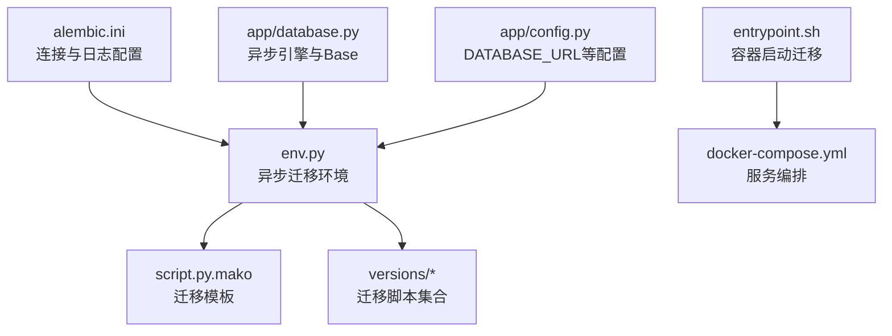
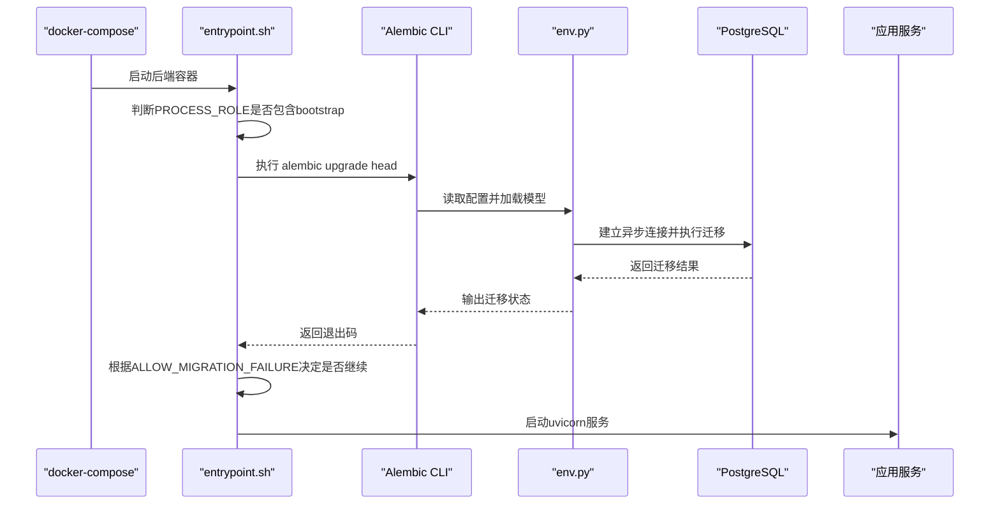
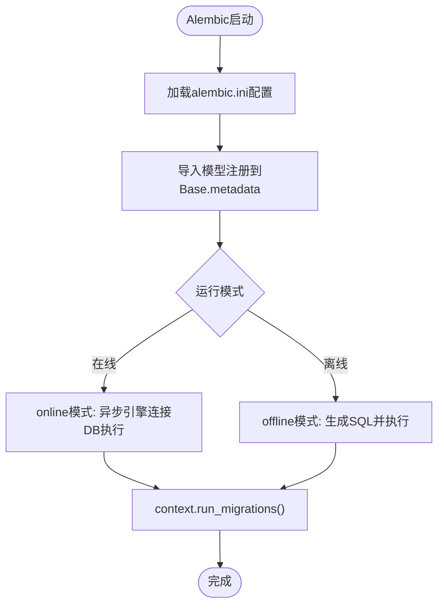
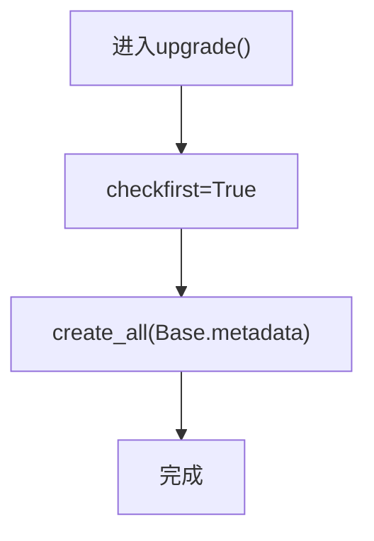
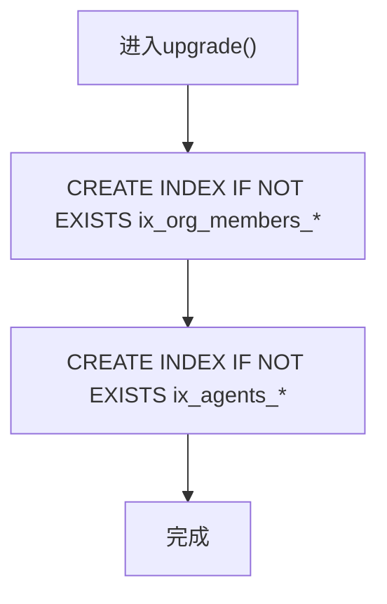
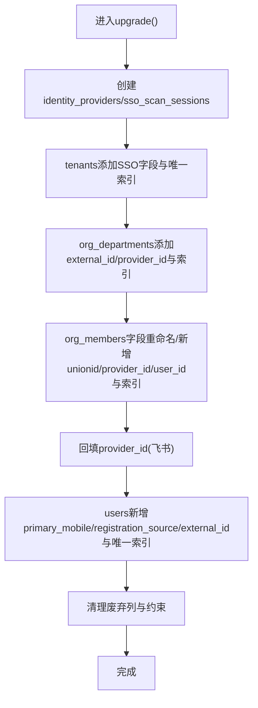
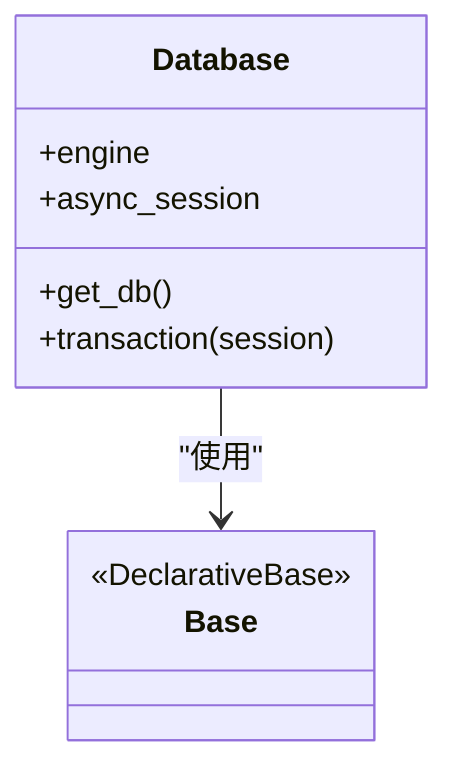
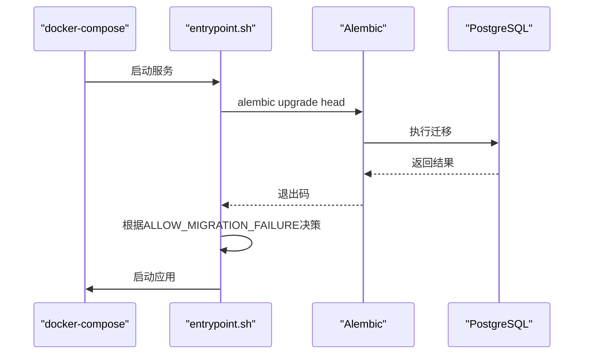
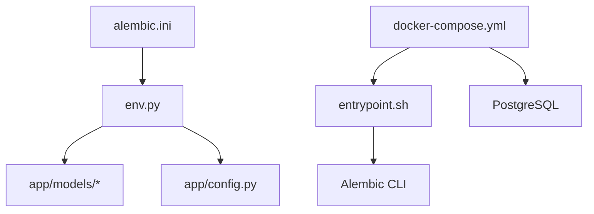

# 数据迁移

<cite>
**本文引用的文件**   
- [backend/alembic.ini](file://backend/alembic.ini)
- [backend/alembic/env.py](file://backend/alembic/env.py)
- [backend/alembic/script.py.mako](file://backend/alembic/script.py.mako)
- [backend/alembic/versions/001_initial_schema.py](file://backend/alembic/versions/001_initial_schema.py)
- [backend/alembic/versions/057_perf_indexes.py](file://backend/alembic/versions/057_perf_indexes.py)
- [backend/alembic/versions/024_user_refactor.py](file://backend/alembic/versions/024_user_refactor.py)
- [backend/app/database.py](file://backend/app/database.py)
- [backend/app/config.py](file://backend/app/config.py)
- [backend/tests/test_agent_model_deleted_at_migration.py](file://backend/tests/test_agent_model_deleted_at_migration.py)
- [backend/tests/test_channel_delivery_migration.py](file://backend/tests/test_channel_delivery_migration.py)
- [backend/entrypoint.sh](file://backend/entrypoint.sh)
- [deploy/docker-compose.yml](file://deploy/docker-compose.yml)
</cite>

## 目录
1. [简介](#简介)
2. [项目结构](#项目结构)
3. [核心组件](#核心组件)
4. [架构总览](#架构总览)
5. [详细组件分析](#详细组件分析)
6. [依赖关系分析](#依赖关系分析)
7. [性能考虑](#性能考虑)
8. [故障排查指南](#故障排查指南)
9. [结论](#结论)
10. [附录](#附录)

## 简介
本文件面向Clawith平台的数据迁移管理，聚焦Alembic迁移工具的使用方法与最佳实践。内容涵盖版本控制策略、迁移脚本编写规范、回滚机制设计、生产环境迁移流程、数据一致性保证、冲突解决策略、迁移测试方法、自动化部署集成与故障排查指南，并提供常见迁移场景的解决方案与性能优化建议。目标是帮助开发者以安全、可追溯、可回滚的方式演进数据库结构，保障线上稳定性与数据一致性。

## 项目结构
后端使用Alembic进行数据库版本化管理，迁移脚本位于backend/alembic/versions下；Alembic环境与配置在backend/alembic/env.py与backend/alembic.ini中定义；应用层通过SQLAlchemy异步引擎与Base元数据进行模型注册；Docker入口脚本在容器启动时执行迁移与初始化。

图表来源
- [backend/alembic.ini:1-40](file://backend/alembic.ini#L1-L40)
- [backend/alembic/env.py:1-99](file://backend/alembic/env.py#L1-L99)
- [backend/alembic/script.py.mako:1-26](file://backend/alembic/script.py.mako#L1-L26)
- [backend/app/database.py:1-79](file://backend/app/database.py#L1-L79)
- [backend/app/config.py:1-268](file://backend/app/config.py#L1-L268)
- [backend/entrypoint.sh:1-95](file://backend/entrypoint.sh#L1-L95)
- [deploy/docker-compose.yml:1-111](file://deploy/docker-compose.yml#L1-L111)

章节来源
- [backend/alembic.ini:1-40](file://backend/alembic.ini#L1-L40)
- [backend/alembic/env.py:1-99](file://backend/alembic/env.py#L1-L99)
- [backend/alembic/script.py.mako:1-26](file://backend/alembic/script.py.mako#L1-L26)
- [backend/app/database.py:1-79](file://backend/app/database.py#L1-L79)
- [backend/app/config.py:1-268](file://backend/app/config.py#L1-L268)
- [backend/entrypoint.sh:1-95](file://backend/entrypoint.sh#L1-L95)
- [deploy/docker-compose.yml:1-111](file://deploy/docker-compose.yml#L1-L111)

## 核心组件
- Alembic配置与运行环境
  - alembic.ini：设置脚本位置、数据库连接（PostgreSQL+asyncpg）、日志级别与处理器。
  - env.py：加载所有模型到Base.metadata，覆盖离线与在线模式，使用异步引擎执行迁移。
- 迁移模板与脚本
  - script.py.mako：生成revision、down_revision、upgrade/downgrade骨架。
  - versions/*：具体迁移实现，包含建表、索引、字段变更、数据回填与回滚逻辑。
- 应用数据库层
  - app/database.py：异步引擎、会话工厂、事务上下文管理器。
  - app/config.py：集中化环境变量与默认值，提供DATABASE_URL等关键配置。
- 容器化与自动化
  - entrypoint.sh：按进程角色决定是否执行迁移与LangGraph检查点初始化。
  - docker-compose.yml：编排Postgres、Redis、Backend、Frontend，注入环境变量。

章节来源
- [backend/alembic.ini:1-40](file://backend/alembic.ini#L1-L40)
- [backend/alembic/env.py:1-99](file://backend/alembic/env.py#L1-L99)
- [backend/alembic/script.py.mako:1-26](file://backend/alembic/script.py.mako#L1-L26)
- [backend/alembic/versions/001_initial_schema.py:1-27](file://backend/alembic/versions/001_initial_schema.py#L1-L27)
- [backend/alembic/versions/057_perf_indexes.py:1-30](file://backend/alembic/versions/057_perf_indexes.py#L1-L30)
- [backend/alembic/versions/024_user_refactor.py:1-377](file://backend/alembic/versions/024_user_refactor.py#L1-L377)
- [backend/app/database.py:1-79](file://backend/app/database.py#L1-L79)
- [backend/app/config.py:1-268](file://backend/app/config.py#L1-L268)
- [backend/entrypoint.sh:1-95](file://backend/entrypoint.sh#L1-L95)
- [deploy/docker-compose.yml:1-111](file://deploy/docker-compose.yml#L1-L111)

## 架构总览
下图展示从容器启动到数据库迁移执行的端到端流程，以及Alembic与环境变量的交互。

图表来源
- [backend/entrypoint.sh:1-95](file://backend/entrypoint.sh#L1-L95)
- [backend/alembic/env.py:1-99](file://backend/alembic/env.py#L1-L99)
- [deploy/docker-compose.yml:1-111](file://deploy/docker-compose.yml#L1-L111)

## 详细组件分析

### Alembic环境与配置
- alembic.ini
  - 指定脚本位置为alembic，数据库URL使用postgresql+asyncpg，日志级别与处理器配置清晰。
- env.py
  - 导入全部模型至Base.metadata，确保metadata完整。
  - 支持离线与在线两种模式：离线模式直接生成SQL，在线模式通过异步引擎执行。
  - 动态覆盖sqlalchemy.url为settings.DATABASE_URL，便于环境变量驱动。
- script.py.mako
  - 标准模板，自动生成revision标识、上下分支与升级/降级函数骨架。

图表来源
- [backend/alembic.ini:1-40](file://backend/alembic.ini#L1-L40)
- [backend/alembic/env.py:1-99](file://backend/alembic/env.py#L1-L99)
- [backend/alembic/script.py.mako:1-26](file://backend/alembic/script.py.mako#L1-L26)

章节来源
- [backend/alembic.ini:1-40](file://backend/alembic.ini#L1-L40)
- [backend/alembic/env.py:1-99](file://backend/alembic/env.py#L1-L99)
- [backend/alembic/script.py.mako:1-26](file://backend/alembic/script.py.mako#L1-L26)

### 初始迁移与幂等性
- 001_initial_schema.py
  - 首次部署创建全量表结构，使用Base.metadata.create_all(checkfirst=True)避免重复创建。
  - downgrade为空，表示不主动删除初始结构，降低风险。

图表来源
- [backend/alembic/versions/001_initial_schema.py:1-27](file://backend/alembic/versions/001_initial_schema.py#L1-L27)

章节来源
- [backend/alembic/versions/001_initial_schema.py:1-27](file://backend/alembic/versions/001_initial_schema.py#L1-L27)

### 性能索引迁移
- 057_perf_indexes.py
  - 为高频查询添加索引，如org_members(email/phone/user_id)、agents(tenant_id,is_system,name)。
  - 使用IF NOT EXISTS保证幂等，downgrade对应DROP INDEX IF EXISTS。

图表来源
- [backend/alembic/versions/057_perf_indexes.py:1-30](file://backend/alembic/versions/057_perf_indexes.py#L1-L30)

章节来源
- [backend/alembic/versions/057_perf_indexes.py:1-30](file://backend/alembic/versions/057_perf_indexes.py#L1-L30)

### 复杂用户系统重构迁移
- 024_user_refactor.py
  - 新增identity_providers、sso_scan_sessions表，扩展tenants/org_departments/org_members/users等字段与约束。
  - 使用DO $$...$$块进行条件判断与数据回填，避免重复操作。
  - 对部分列进行重命名与清理，增加唯一索引与部分唯一索引。
  - downgrade尝试恢复旧结构与数据映射，但明确标注非幂等，生产需谨慎。

图表来源
- [backend/alembic/versions/024_user_refactor.py:1-377](file://backend/alembic/versions/024_user_refactor.py#L1-L377)

章节来源
- [backend/alembic/versions/024_user_refactor.py:1-377](file://backend/alembic/versions/024_user_refactor.py#L1-L377)

### 应用数据库层与事务
- app/database.py
  - 异步引擎与会话工厂，支持连接池与溢出配置。
  - Base作为声明式基类，供Alembic收集metadata。
  - transaction上下文管理器提供事务边界，异常自动回滚。

图表来源
- [backend/app/database.py:1-79](file://backend/app/database.py#L1-L79)

章节来源
- [backend/app/database.py:1-79](file://backend/app/database.py#L1-L79)

### 配置与环境变量
- app/config.py
  - Settings集中管理环境变量，包括DATABASE_URL、DEBUG、存储与运行时参数。
  - 提供默认值与校验，确保配置合法性。

章节来源
- [backend/app/config.py:1-268](file://backend/app/config.py#L1-L268)

### 容器化与自动化部署
- entrypoint.sh
  - 根据PROCESS_ROLE决定是否执行alembic upgrade head与LangGraph检查点初始化。
  - 支持ALLOW_MIGRATION_FAILURE容错，便于灰度或特殊场景。
- docker-compose.yml
  - 编排Postgres、Redis、Backend、Frontend，注入DATABASE_URL等关键环境变量。

图表来源
- [backend/entrypoint.sh:1-95](file://backend/entrypoint.sh#L1-L95)
- [deploy/docker-compose.yml:1-111](file://deploy/docker-compose.yml#L1-L111)

章节来源
- [backend/entrypoint.sh:1-95](file://backend/entrypoint.sh#L1-L95)
- [deploy/docker-compose.yml:1-111](file://deploy/docker-compose.yml#L1-L111)

## 依赖关系分析
- Alembic依赖应用模型注册（Base.metadata）与数据库连接（DATABASE_URL）。
- env.py通过import models将所有模型注册，确保metadata完整。
- entrypoint.sh依赖环境变量PROCESS_ROLE与ALLOW_MIGRATION_FAILURE控制迁移行为。
- docker-compose.yml提供Postgres健康检查与服务依赖顺序。

图表来源
- [backend/alembic.ini:1-40](file://backend/alembic.ini#L1-L40)
- [backend/alembic/env.py:1-99](file://backend/alembic/env.py#L1-L99)
- [backend/app/config.py:1-268](file://backend/app/config.py#L1-L268)
- [backend/entrypoint.sh:1-95](file://backend/entrypoint.sh#L1-L95)
- [deploy/docker-compose.yml:1-111](file://deploy/docker-compose.yml#L1-L111)

章节来源
- [backend/alembic.ini:1-40](file://backend/alembic.ini#L1-L40)
- [backend/alembic/env.py:1-99](file://backend/alembic/env.py#L1-L99)
- [backend/app/config.py:1-268](file://backend/app/config.py#L1-L268)
- [backend/entrypoint.sh:1-95](file://backend/entrypoint.sh#L1-L95)
- [deploy/docker-compose.yml:1-111](file://deploy/docker-compose.yml#L1-L111)

## 性能考虑
- 索引策略
  - 针对高频查询列添加复合索引，如org_members(email, phone, user_id)、agents(tenant_id, is_system, name)。
  - 使用IF NOT EXISTS保证幂等，避免重复创建开销。
- 迁移粒度
  - 将大迁移拆分为多个小迁移，减少锁持有时间与失败影响范围。
- 连接池与超时
  - 合理配置连接池大小与溢出，避免迁移期间连接耗尽。
- 数据回填
  - 大批量更新分批执行，避免长事务与锁竞争。

[本节为通用指导，无需特定文件引用]

## 故障排查指南
- 迁移失败处理
  - 检查alembic.ini中的DATABASE_URL是否正确。
  - 查看entrypoint.sh输出的迁移日志与退出码。
  - 使用ALLOW_MIGRATION_FAILURE临时跳过失败，定位问题后修复。
- 版本冲突
  - 确认down_revision链正确，避免多分支合并导致冲突。
  - 使用alembic heads与current命令检查当前版本。
- 数据不一致
  - 检查迁移中的条件判断与数据回填逻辑，确保幂等。
  - 对关键表添加唯一约束与检查约束，防止脏数据。
- 回滚策略
  - 谨慎执行downgrade，尤其是涉及数据丢失的迁移。
  - 在生产环境优先采用正向修复而非回滚。

章节来源
- [backend/alembic.ini:1-40](file://backend/alembic.ini#L1-L40)
- [backend/entrypoint.sh:1-95](file://backend/entrypoint.sh#L1-L95)
- [backend/alembic/versions/024_user_refactor.py:1-377](file://backend/alembic/versions/024_user_refactor.py#L1-L377)

## 结论
Clawith平台通过Alembic实现了规范的数据库版本化管理，结合异步SQLAlchemy与容器化部署，形成了安全、可追溯、可回滚的迁移体系。通过完善的测试与自动化流程，保障了生产环境的稳定性与数据一致性。建议持续遵循幂等性、小粒度、强约束的原则，优化迁移性能与可靠性。

[本节为总结，无需特定文件引用]

## 附录

### 版本控制策略
- 版本号命名
  - 使用递增数字或时间戳前缀，确保唯一性与可读性。
- 分支与合并
  - 主分支保持线性历史，特性分支合并前需验证迁移链。
- 头节点管理
  - 定期合并多分支头节点，避免分裂。

章节来源
- [backend/alembic/versions/057_perf_indexes.py:1-30](file://backend/alembic/versions/057_perf_indexes.py#L1-L30)
- [backend/alembic/versions/024_user_refactor.py:1-377](file://backend/alembic/versions/024_user_refactor.py#L1-L377)

### 迁移脚本编写规范
- 幂等性
  - 使用IF NOT EXISTS、条件判断与检查约束，确保多次执行安全。
- 数据完整性
  - 添加必要索引与约束，避免脏数据。
- 回滚设计
  - 提供完整的downgrade逻辑，注意数据不可逆操作的警告。

章节来源
- [backend/alembic/versions/057_perf_indexes.py:1-30](file://backend/alembic/versions/057_perf_indexes.py#L1-L30)
- [backend/alembic/versions/024_user_refactor.py:1-377](file://backend/alembic/versions/024_user_refactor.py#L1-L377)

### 回滚机制设计
- 原则
  - 优先正向修复，谨慎回滚。
  - 数据迁移类回滚需评估数据丢失风险。
- 实践
  - 在downgrade中仅删除对象，不恢复业务数据。
  - 对复杂回滚提供独立脚本与验证步骤。

章节来源
- [backend/alembic/versions/024_user_refactor.py:1-377](file://backend/alembic/versions/024_user_refactor.py#L1-L377)

### 生产环境迁移流程
- 预检
  - 备份数据库，验证迁移脚本在测试环境通过。
- 执行
  - 通过entrypoint.sh或CI/CD流水线执行alembic upgrade head。
- 验证
  - 检查应用健康状态与关键接口可用性。
- 回滚预案
  - 准备快速回滚方案，必要时重建实例。

章节来源
- [backend/entrypoint.sh:1-95](file://backend/entrypoint.sh#L1-L95)
- [deploy/docker-compose.yml:1-111](file://deploy/docker-compose.yml#L1-L111)

### 数据一致性保证
- 约束
  - 使用唯一索引、检查约束与外键（谨慎）保证数据完整性。
- 事务
  - 将相关变更放入同一事务，确保原子性。
- 幂等
  - 迁移脚本具备幂等性，避免重复执行导致不一致。

章节来源
- [backend/alembic/versions/024_user_refactor.py:1-377](file://backend/alembic/versions/024_user_refactor.py#L1-L377)

### 冲突解决策略
- 分支合并
  - 使用alembic merge合并分支，生成合并迁移。
- 依赖管理
  - 明确depends_on与branch_labels，避免循环依赖。
- 测试验证
  - 合并后执行完整测试套件，确保无回归。

章节来源
- [backend/alembic/env.py:1-99](file://backend/alembic/env.py#L1-L99)

### 迁移测试方法
- 静态契约测试
  - 验证迁移文件的revision链与模型结构。
- 模拟执行
  - 使用monkeypatch模拟op方法，验证调用序列。
- 幂等性测试
  - 模拟已存在结构与索引，确保无重复操作。

章节来源
- [backend/tests/test_agent_model_deleted_at_migration.py:1-189](file://backend/tests/test_agent_model_deleted_at_migration.py#L1-L189)
- [backend/tests/test_channel_delivery_migration.py:1-79](file://backend/tests/test_channel_delivery_migration.py#L1-L79)

### 自动化部署集成
- CI/CD
  - 在流水线中执行迁移与测试，失败则阻断发布。
- 容器化
  - 通过entrypoint.sh自动执行迁移，支持环境变量控制。
- 健康检查
  - 结合Postgres健康检查与服务依赖，确保顺序启动。

章节来源
- [backend/entrypoint.sh:1-95](file://backend/entrypoint.sh#L1-L95)
- [deploy/docker-compose.yml:1-111](file://deploy/docker-compose.yml#L1-L111)

### 常见迁移场景解决方案
- 新增字段与索引
  - 使用ALTER TABLE ADD COLUMN与CREATE INDEX IF NOT EXISTS。
- 字段重命名与类型变更
  - 先复制数据到新列，再切换约束与删除旧列。
- 数据回填与清洗
  - 分批更新，避免长事务与锁竞争。
- 软删除与逻辑删除
  - 添加deleted_at字段与索引，配合查询过滤。

章节来源
- [backend/alembic/versions/057_perf_indexes.py:1-30](file://backend/alembic/versions/057_perf_indexes.py#L1-L30)
- [backend/alembic/versions/024_user_refactor.py:1-377](file://backend/alembic/versions/024_user_refactor.py#L1-L377)

### 性能优化建议
- 索引优化
  - 分析慢查询，添加复合索引与覆盖索引。
- 迁移拆分
  - 将大迁移拆分为多个小迁移，减少锁持有时间。
- 连接池调优
  - 根据负载调整pool_size与max_overflow。
- 批量操作
  - 使用批量插入与更新，减少往返次数。

[本节为通用指导，无需特定文件引用]