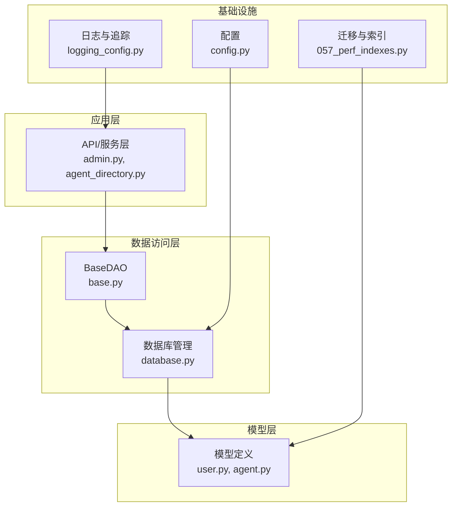
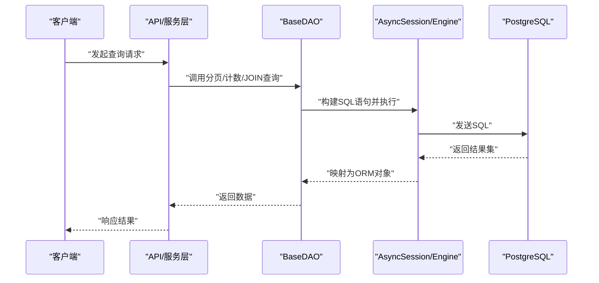
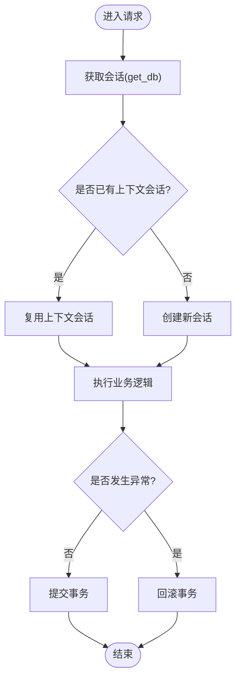
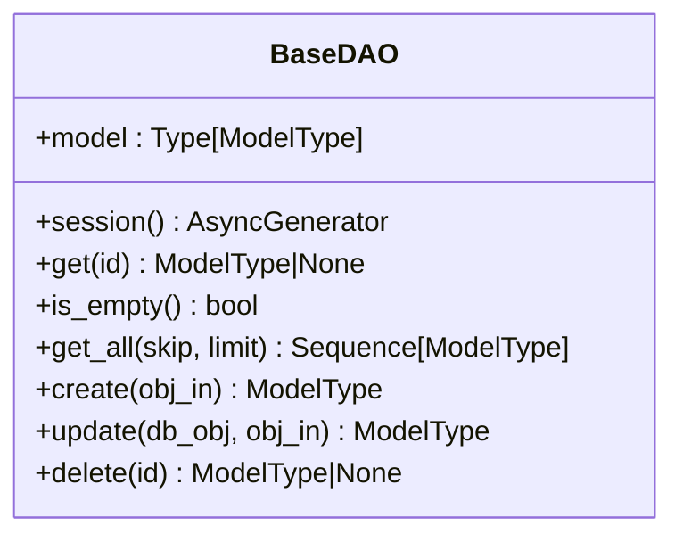
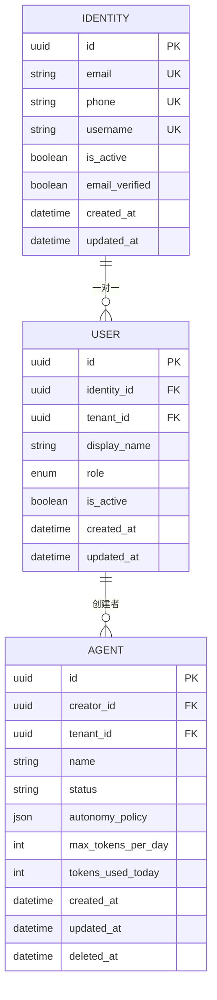
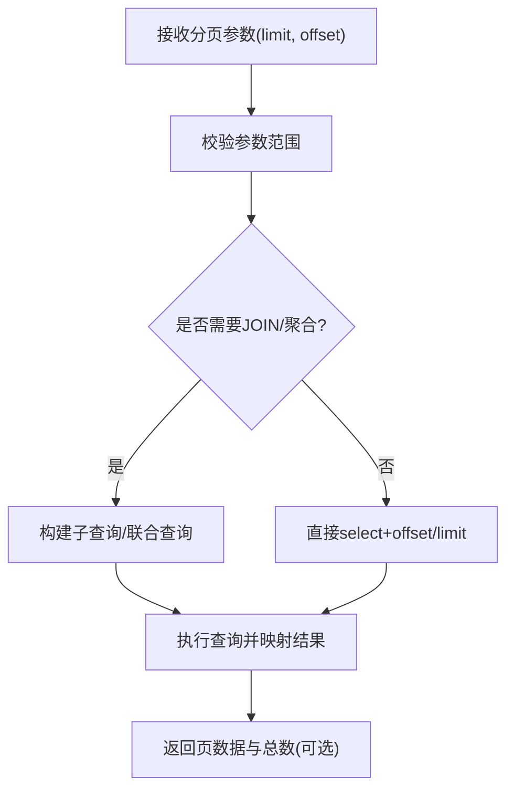
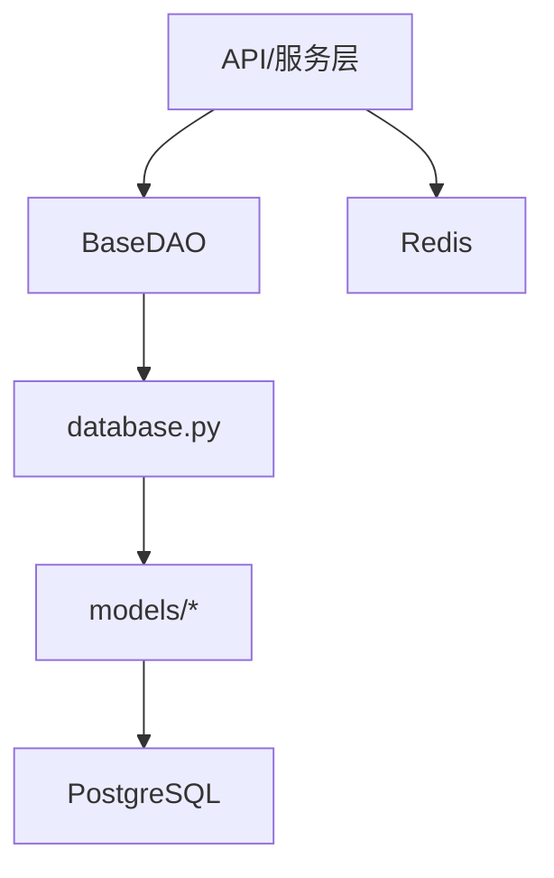

# 查询优化

<cite>
**本文引用的文件**   
- [backend/app/database.py](file://backend/app/database.py)
- [backend/app/dao/base.py](file://backend/app/dao/base.py)
- [backend/app/config.py](file://backend/app/config.py)
- [backend/app/core/logging_config.py](file://backend/app/core/logging_config.py)
- [backend/app/models/user.py](file://backend/app/models/user.py)
- [backend/app/models/agent.py](file://backend/app/models/agent.py)
- [backend/alembic/versions/057_perf_indexes.py](file://backend/alembic/versions/057_perf_indexes.py)
- [backend/app/api/admin.py](file://backend/app/api/admin.py)
- [backend/app/services/agent_directory.py](file://backend/app/services/agent_directory.py)
</cite>

## 目录
1. [简介](#简介)
2. [项目结构](#项目结构)
3. [核心组件](#核心组件)
4. [架构总览](#架构总览)
5. [详细组件分析](#详细组件分析)
6. [依赖关系分析](#依赖关系分析)
7. [性能考量](#性能考量)
8. [故障排查指南](#故障排查指南)
9. [结论](#结论)
10. [附录](#附录)

## 简介
本文件面向Clawith平台的数据库查询优化，聚焦慢查询识别、执行计划分析、索引优化策略，以及N+1查询问题、批量操作、缓存策略、分页与复杂JOIN优化、聚合查询优化技巧。同时涵盖查询性能监控、SQL日志分析与调试工具使用，并给出常见查询模式的最佳实践与性能基准测试建议。内容基于后端代码库中的数据库连接管理、DAO基类、模型定义、迁移索引与典型API查询实现进行系统化总结。

## 项目结构
后端采用异步SQLAlchemy（asyncpg）作为ORM与驱动，通过统一的会话管理与事务边界控制，配合Alembic进行数据库版本管理与索引优化。关键路径包括：
- 数据库引擎与会话管理：engine、sessionmaker、get_db、transaction
- DAO基类：提供通用CRUD、分页、上下文会话复用
- 模型层：用户、组织成员、Agent等实体及索引定义
- 迁移脚本：性能相关索引创建
- API与服务层：统计计数、分页列表、复杂JOIN示例

图表来源
- [backend/app/database.py:14-21](file://backend/app/database.py#L14-L21)
- [backend/app/dao/base.py:13-38](file://backend/app/dao/base.py#L13-L38)
- [backend/app/models/user.py:16-47](file://backend/app/models/user.py#L16-L47)
- [backend/app/models/agent.py:19-33](file://backend/app/models/agent.py#L19-L33)
- [backend/alembic/versions/057_perf_indexes.py:16-25](file://backend/alembic/versions/057_perf_indexes.py#L16-L25)

章节来源
- [backend/app/database.py:14-21](file://backend/app/database.py#L14-L21)
- [backend/app/dao/base.py:13-38](file://backend/app/dao/base.py#L13-L38)
- [backend/app/config.py:89-95](file://backend/app/config.py#L89-L95)
- [backend/app/core/logging_config.py:61-79](file://backend/app/core/logging_config.py#L61-L79)
- [backend/alembic/versions/057_perf_indexes.py:16-25](file://backend/alembic/versions/057_perf_indexes.py#L16-L25)

## 核心组件
- 数据库连接与会话管理
  - 异步引擎与连接池：pool_size、max_overflow、echo开关
  - 会话工厂：expire_on_commit=False减少重复加载开销
  - get_db依赖注入：自动提交或回滚，异常安全
  - transaction上下文管理器：支持嵌套事务与上下文变量传递
- BaseDAO通用数据访问
  - session上下文复用：优先使用当前上下文会话，避免多余连接
  - 基础CRUD：get、create、update、delete、is_empty
  - 分页查询：offset/limit统一封装
- 模型与索引
  - User/Identity关联与selectin懒加载规避
  - Agent表复合索引与软删除过滤条件
- 配置与日志
  - DATABASE_URL、DEBUG控制SQL输出
  - loguru集中日志与trace_id贯穿请求链路

章节来源
- [backend/app/database.py:14-21](file://backend/app/database.py#L14-L21)
- [backend/app/database.py:30-42](file://backend/app/database.py#L30-L42)
- [backend/app/database.py:47-79](file://backend/app/database.py#L47-L79)
- [backend/app/dao/base.py:19-38](file://backend/app/dao/base.py#L19-L38)
- [backend/app/dao/base.py:56-61](file://backend/app/dao/base.py#L56-L61)
- [backend/app/models/user.py:100-111](file://backend/app/models/user.py#L100-L111)
- [backend/app/models/agent.py:26-33](file://backend/app/models/agent.py#L26-L33)
- [backend/app/config.py:89-95](file://backend/app/config.py#L89-L95)
- [backend/app/core/logging_config.py:61-79](file://backend/app/core/logging_config.py#L61-L79)

## 架构总览
下图展示从API到数据库的调用链路与关键优化点：

图表来源
- [backend/app/api/admin.py:82-94](file://backend/app/api/admin.py#L82-L94)
- [backend/app/dao/base.py:56-61](file://backend/app/dao/base.py#L56-L61)
- [backend/app/database.py:14-21](file://backend/app/database.py#L14-L21)

## 详细组件分析

### 数据库连接与会话管理
- 连接池参数：pool_size=20、max_overflow=10，适合中等并发；可通过配置调整
- echo开关：DEBUG模式下打印SQL，便于调试
- 会话生命周期：get_db确保每次请求一个独立会话，异常时回滚
- transaction上下文：支持跨函数共享会话，避免重复commit/rollback

图表来源
- [backend/app/database.py:30-42](file://backend/app/database.py#L30-L42)
- [backend/app/database.py:47-79](file://backend/app/database.py#L47-L79)

章节来源
- [backend/app/database.py:14-21](file://backend/app/database.py#L14-L21)
- [backend/app/database.py:30-42](file://backend/app/database.py#L30-L42)
- [backend/app/database.py:47-79](file://backend/app/database.py#L47-L79)

### BaseDAO通用数据访问
- 上下文会话复用：优先使用_context会话，减少连接创建
- 分页查询：统一offset/limit，避免全量拉取
- 批量写入：create/update内部flush，可结合业务批量组装减少往返

图表来源
- [backend/app/dao/base.py:13-38](file://backend/app/dao/base.py#L13-L38)
- [backend/app/dao/base.py:56-61](file://backend/app/dao/base.py#L56-L61)

章节来源
- [backend/app/dao/base.py:19-38](file://backend/app/dao/base.py#L19-L38)
- [backend/app/dao/base.py:56-61](file://backend/app/dao/base.py#L56-L61)

### 模型与索引优化
- Identity/User：email/phone/username唯一索引，加速登录与查找
- Agent：复合索引(tenant_id, created_at)带软删除过滤，提升租户内排序与分页
- 迁移索引：org_members(email/phone/user_id)、agents(tenant_id,is_system,name)

图表来源
- [backend/app/models/user.py:16-47](file://backend/app/models/user.py#L16-L47)
- [backend/app/models/agent.py:19-33](file://backend/app/models/agent.py#L19-L33)
- [backend/alembic/versions/057_perf_indexes.py:16-25](file://backend/alembic/versions/057_perf_indexes.py#L16-L25)

章节来源
- [backend/app/models/user.py:16-47](file://backend/app/models/user.py#L16-L47)
- [backend/app/models/agent.py:26-33](file://backend/app/models/agent.py#L26-L33)
- [backend/alembic/versions/057_perf_indexes.py:16-25](file://backend/alembic/versions/057_perf_indexes.py#L16-L25)

### 分页查询与复杂JOIN优化
- 分页：BaseDAO.get_all使用offset/limit；agent_directory中组合子查询与排序字段，避免大偏移
- JOIN：admin.py中使用count与join进行统计与关联查询；注意选择必要字段，减少数据传输
- 聚合：使用func.count/select_from简化计数查询，避免不必要的列加载

图表来源
- [backend/app/dao/base.py:56-61](file://backend/app/dao/base.py#L56-L61)
- [backend/app/services/agent_directory.py:414-445](file://backend/app/services/agent_directory.py#L414-L445)
- [backend/app/api/admin.py:82-94](file://backend/app/api/admin.py#L82-L94)

章节来源
- [backend/app/dao/base.py:56-61](file://backend/app/dao/base.py#L56-L61)
- [backend/app/services/agent_directory.py:414-445](file://backend/app/services/agent_directory.py#L414-L445)
- [backend/app/api/admin.py:82-94](file://backend/app/api/admin.py#L82-L94)

### N+1查询问题与批量操作优化
- N+1问题：User.identity使用selectin避免异步上下文同步IO；在列表查询中尽量一次性加载关联
- 批量操作：DAO.create/update内部flush，可在服务层批量构造对象后统一flush，减少往返
- 推荐：对高频读取的关联使用selectin或joinedload，避免循环中逐条加载

章节来源
- [backend/app/models/user.py:100-111](file://backend/app/models/user.py#L100-L111)
- [backend/app/dao/base.py:63-79](file://backend/app/dao/base.py#L63-L79)

### 缓存策略设计
- Redis用于实时路由与事件发布，可作为热点数据缓存层（如会话状态、权限缓存）
- 建议在服务层引入Redis缓存键：按租户+资源ID+版本号，设置合理TTL
- 写穿透：更新时失效缓存键，读多写少场景收益明显

章节来源
- [backend/app/core/events.py:14-33](file://backend/app/core/events.py#L14-L33)

### 慢查询识别与执行计划分析
- 启用SQL日志：DEBUG=True时engine.echo输出SQL，结合loguru trace_id定位请求
- PostgreSQL层面：开启slow_query_log或使用EXPLAIN/EXPLAIN ANALYZE分析执行计划
- 指标监控：关注扫描行数、临时表使用、排序方式、索引命中率

章节来源
- [backend/app/config.py:89-95](file://backend/app/config.py#L89-L95)
- [backend/app/core/logging_config.py:61-79](file://backend/app/core/logging_config.py#L61-L79)

### 聚合查询优化技巧
- 使用select(func.count()).select_from(Table).where(...)避免不必要列加载
- 复杂统计：将分组与过滤下推到数据库侧，减少Python端处理
- 分页计数：先count再分页，必要时缓存count结果

章节来源
- [backend/app/api/admin.py:82-94](file://backend/app/api/admin.py#L82-L94)

## 依赖关系分析
- 模块耦合：API/服务层依赖DAO，DAO依赖database；models定义表结构与索引
- 外部依赖：PostgreSQL（驱动asyncpg）、Redis（事件与缓存）
- 潜在循环：models间存在前向引用，需延迟导入避免循环依赖

图表来源
- [backend/app/api/admin.py:82-94](file://backend/app/api/admin.py#L82-L94)
- [backend/app/dao/base.py:13-38](file://backend/app/dao/base.py#L13-L38)
- [backend/app/database.py:14-21](file://backend/app/database.py#L14-L21)

章节来源
- [backend/app/api/admin.py:82-94](file://backend/app/api/admin.py#L82-L94)
- [backend/app/dao/base.py:13-38](file://backend/app/dao/base.py#L13-L38)
- [backend/app/database.py:14-21](file://backend/app/database.py#L14-L21)

## 性能考量
- 连接池调优：根据并发与查询耗时调整pool_size与max_overflow
- 索引策略：针对高频WHERE/ORDER BY/GROUP BY字段建立合适索引，避免过度索引
- 查询裁剪：只select必要字段，减少网络与序列化开销
- 分页限制：限制最大limit，防止大偏移导致性能退化
- 缓存命中：热点数据缓存TTL与失效策略需平衡一致性与性能

## 故障排查指南
- SQL日志：DEBUG=True输出SQL，结合trace_id快速定位
- 慢查询：使用EXPLAIN ANALYZE查看执行计划，关注全表扫描与临时表
- 连接泄漏：检查会话是否正确提交/回滚，确保异常分支也释放
- 缓存不一致：核对缓存键命名与失效时机，必要时加版本号

章节来源
- [backend/app/config.py:89-95](file://backend/app/config.py#L89-L95)
- [backend/app/core/logging_config.py:61-79](file://backend/app/core/logging_config.py#L61-L79)

## 结论
通过统一的会话管理、DAO抽象、模型索引与迁移脚本，Clawith平台已具备良好查询优化基础。建议持续监控慢查询、完善索引覆盖、引入缓存层，并结合EXPLAIN分析迭代优化，以获得稳定高效的数据库访问性能。

## 附录
- 最佳实践清单
  - 分页查询始终使用offset/limit，并限制最大页数
  - 关联查询使用selectin/joinedload避免N+1
  - 聚合查询仅select必要字段，使用func.count优化计数
  - 高频查询字段建立合适索引，定期评估索引有效性
  - 热点数据引入Redis缓存，设置合理TTL与失效策略
- 基准测试建议
  - 使用压测工具模拟真实负载，记录P95/P99延迟与错误率
  - 对比优化前后EXPLAIN输出，验证索引命中与扫描行数下降
  - 监控连接池利用率与CPU/内存占用，避免资源瓶颈