# 前端架构

<cite>
**本文引用的文件**   
- [frontend/package.json](file://frontend/package.json)
- [frontend/src/main.tsx](file://frontend/src/main.tsx)
- [frontend/src/App.tsx](file://frontend/src/App.tsx)
- [frontend/vite.config.ts](file://frontend/vite.config.ts)
- [frontend/tsconfig.json](file://frontend/tsconfig.json)
- [frontend/src/stores/index.ts](file://frontend/src/stores/index.ts)
- [frontend/src/services/api.ts](file://frontend/src/services/api.ts)
- [frontend/src/services/apiError.ts](file://frontend/src/services/apiError.ts)
- [frontend/src/i18n/index.ts](file://frontend/src/i18n/index.ts)
- [frontend/src/utils/theme.ts](file://frontend/src/utils/theme.ts)
- [frontend/src/hooks/useGroupRealtime.ts](file://frontend/src/hooks/useGroupRealtime.ts)
- [frontend/src/pages/Layout.tsx](file://frontend/src/pages/Layout.tsx)
- [frontend/src/styles/atlas.css](file://frontend/src/styles/atlas.css)
- [frontend/Dockerfile](file://frontend/Dockerfile)
</cite>

## 目录
1. [简介](#简介)
2. [项目结构](#项目结构)
3. [核心组件](#核心组件)
4. [架构总览](#架构总览)
5. [详细组件分析](#详细组件分析)
6. [依赖关系分析](#依赖关系分析)
7. [性能考虑](#性能考虑)
8. [故障排查指南](#故障排查指南)
9. [结论](#结论)
10. [附录](#附录)

## 简介
本技术文档面向 Clawith 前端工程，基于 React 19 + TypeScript + Vite 构建，采用 Zustand 进行状态管理、React Router v7 进行路由组织、TanStack Query 进行数据请求与缓存。文档覆盖：
- 组件分层与路由设计
- API 客户端封装、错误处理与请求拦截器
- 国际化（i18next）与主题系统、样式架构
- WebSocket 实时通信（聊天与群组）、文件上传处理
- 构建配置、代码分割与性能优化
- 开发工具链、测试策略与部署优化

## 项目结构
前端工程位于 frontend 目录，关键入口与配置如下：
- 应用入口 main.tsx：初始化 React 根节点、错误边界、QueryClient、路由、i18n、主题色加载以及全局 Provider。
- 路由与页面 App.tsx：集中式路由表、懒加载页面、受保护路由、通知栏等。
- 构建与开发 vite.config.ts：插件、别名、版本注入、分包策略、开发与代理配置。
- TypeScript 配置 tsconfig.json：严格模式、模块解析、路径别名等。
- 包管理 package.json：依赖与脚本定义。

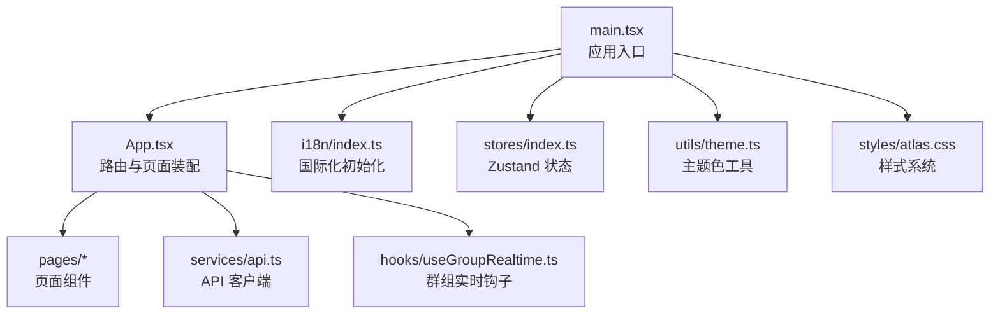

**图表来源** 
- [frontend/src/main.tsx:1-38](file://frontend/src/main.tsx#L1-L38)
- [frontend/src/App.tsx:1-307](file://frontend/src/App.tsx#L1-L307)
- [frontend/src/i18n/index.ts:1-31](file://frontend/src/i18n/index.ts#L1-L31)
- [frontend/src/stores/index.ts:1-53](file://frontend/src/stores/index.ts#L1-L53)
- [frontend/src/utils/theme.ts:1-97](file://frontend/src/utils/theme.ts#L1-L97)
- [frontend/src/styles/atlas.css:1-200](file://frontend/src/styles/atlas.css#L1-L200)

**章节来源**
- [frontend/src/main.tsx:1-38](file://frontend/src/main.tsx#L1-L38)
- [frontend/src/App.tsx:1-307](file://frontend/src/App.tsx#L1-L307)
- [frontend/vite.config.ts:1-59](file://frontend/vite.config.ts#L1-L59)
- [frontend/tsconfig.json:1-33](file://frontend/tsconfig.json#L1-L33)
- [frontend/package.json:1-37](file://frontend/package.json#L1-L37)

## 核心组件
- 应用启动与上下文
  - React StrictMode、ErrorBoundary、QueryClientProvider、BrowserRouter、DialogProvider、ToastProvider 组合提供全局能力。
  - i18n 初始化与语言检测；主题色在首屏前应用。
- 路由与权限
  - 使用 React Router v7 的 Routes/Route/Navigate 实现页面导航。
  - ProtectedRoute 校验 token 与用户状态，强制公司设置或邮箱验证流程。
  - CompanyAdminRoute 限制企业级设置访问。
- 状态管理
  - useAuthStore：维护 user、token、登录/登出方法，持久化 token。
  - useAppStore：侧边栏折叠、选中 Agent 等 UI 状态，持久化到 localStorage。
- API 客户端
  - request/fetchJson：统一 fetch 封装，自动附加 Authorization，错误解析与自动登出。
  - uploadFileWithProgress：基于 XMLHttpRequest 的文件上传，支持进度回调与取消。
  - 各业务域 API 模块（authApi、agentApi、fileApi、enterpriseApi 等）。
- 错误处理
  - AppError/ApiError 统一错误类型，parseHttpErrorResponse 解析后端错误体，normalizeUnknownError 兜底未知错误。
- 国际化
  - i18next + react-i18next，支持 zh/en 双语言，localStorage 持久化语言选择。
- 主题系统
  - 通过 CSS 自定义属性与 JS 动态计算明暗对比，生成强调色变体并写入 documentElement。
- 实时通信
  - 群组聊天 useGroupRealtime：WebSocket 优先，失败回退轮询，断线重连与游标回填。
  - 聊天页 WebSocket 连接与会话 attach。

**章节来源**
- [frontend/src/main.tsx:1-38](file://frontend/src/main.tsx#L1-L38)
- [frontend/src/App.tsx:1-307](file://frontend/src/App.tsx#L1-L307)
- [frontend/src/stores/index.ts:1-53](file://frontend/src/stores/index.ts#L1-L53)
- [frontend/src/services/api.ts:1-651](file://frontend/src/services/api.ts#L1-L651)
- [frontend/src/services/apiError.ts:1-204](file://frontend/src/services/apiError.ts#L1-L204)
- [frontend/src/i18n/index.ts:1-31](file://frontend/src/i18n/index.ts#L1-L31)
- [frontend/src/utils/theme.ts:1-97](file://frontend/src/utils/theme.ts#L1-L97)
- [frontend/src/hooks/useGroupRealtime.ts:1-249](file://frontend/src/hooks/useGroupRealtime.ts#L1-L249)

## 架构总览
整体架构遵循“薄容器 + 厚服务”的分层：
- 展示层：页面与通用组件，负责交互与渲染。
- 状态层：Zustand store 管理跨组件共享状态。
- 数据层：api.ts 统一 HTTP 客户端，封装鉴权、错误处理、上传。
- 实时层：useGroupRealtime 与聊天页 WebSocket 集成。
- 基础设施：i18n、主题、错误边界、查询缓存（TanStack Query）。

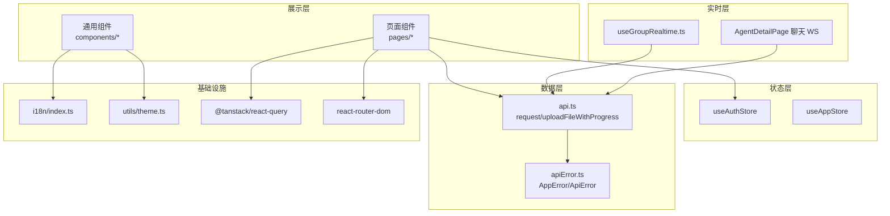

**图表来源** 
- [frontend/src/App.tsx:1-307](file://frontend/src/App.tsx#L1-L307)
- [frontend/src/stores/index.ts:1-53](file://frontend/src/stores/index.ts#L1-L53)
- [frontend/src/services/api.ts:1-651](file://frontend/src/services/api.ts#L1-L651)
- [frontend/src/services/apiError.ts:1-204](file://frontend/src/services/apiError.ts#L1-L204)
- [frontend/src/hooks/useGroupRealtime.ts:1-249](file://frontend/src/hooks/useGroupRealtime.ts#L1-L249)
- [frontend/src/i18n/index.ts:1-31](file://frontend/src/i18n/index.ts#L1-L31)
- [frontend/src/utils/theme.ts:1-97](file://frontend/src/utils/theme.ts#L1-L97)

## 详细组件分析

### 应用入口与全局上下文
- 初始化顺序：加载主题色 → 创建 QueryClient → 挂载 ErrorBoundary → 提供 QueryClientProvider、BrowserRouter、DialogProvider、ToastProvider → 渲染 App。
- 错误边界捕获渲染异常，避免白屏。
- QueryClient 默认重试次数与聚焦时不自动 refetch，减少不必要请求。

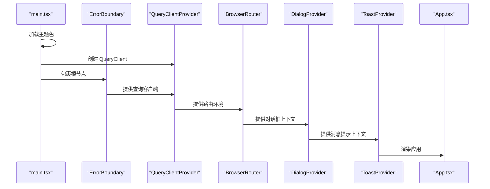

**图表来源** 
- [frontend/src/main.tsx:1-38](file://frontend/src/main.tsx#L1-L38)

**章节来源**
- [frontend/src/main.tsx:1-38](file://frontend/src/main.tsx#L1-L38)

### 路由设计与受保护路由
- 路由表集中在 App.tsx，使用 lazy() 按需加载页面，降低首屏体积。
- ProtectedRoute：无 token 跳转登录；无 tenant_id 强制公司设置；未验证邮箱跳转验证页。
- CompanyAdminRoute：仅平台管理员或组织管理员可访问企业设置。
- 通知栏 NotificationBar：从后端获取公告配置，支持滚动字幕、会话/持久化关闭。

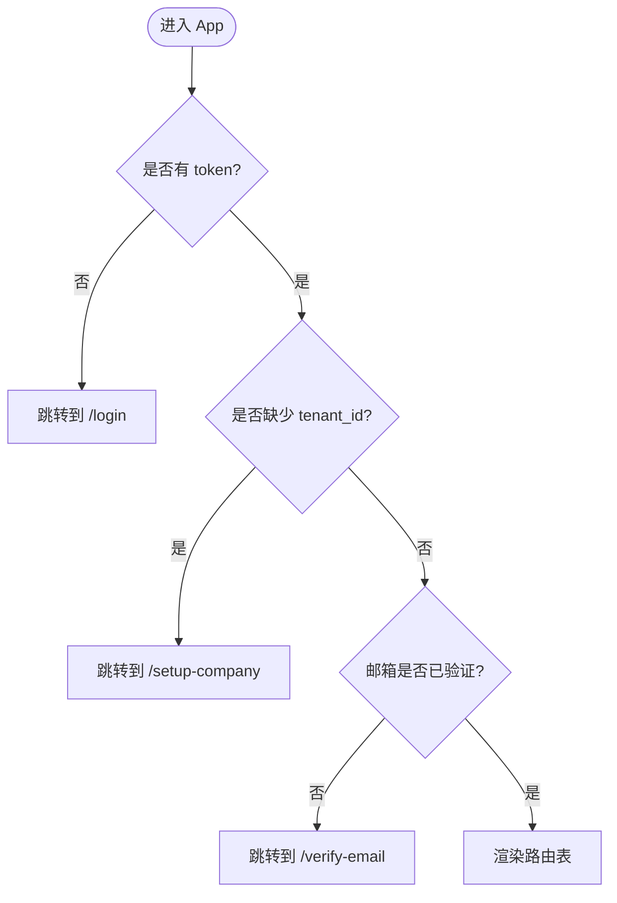

**图表来源** 
- [frontend/src/App.tsx:27-45](file://frontend/src/App.tsx#L27-L45)
- [frontend/src/App.tsx:212-307](file://frontend/src/App.tsx#L212-L307)

**章节来源**
- [frontend/src/App.tsx:1-307](file://frontend/src/App.tsx#L1-L307)

### 状态管理（Zustand）
- useAuthStore：
  - 字段：user、token
  - 方法：setAuth、setUser、logout、isAuthenticated
  - 持久化：token 读写 localStorage
- useAppStore：
  - 字段：sidebarCollapsed、selectedAgentId
  - 方法：toggleSidebar、setSelectedAgent
  - 持久化：sidebar_collapsed 读写 localStorage

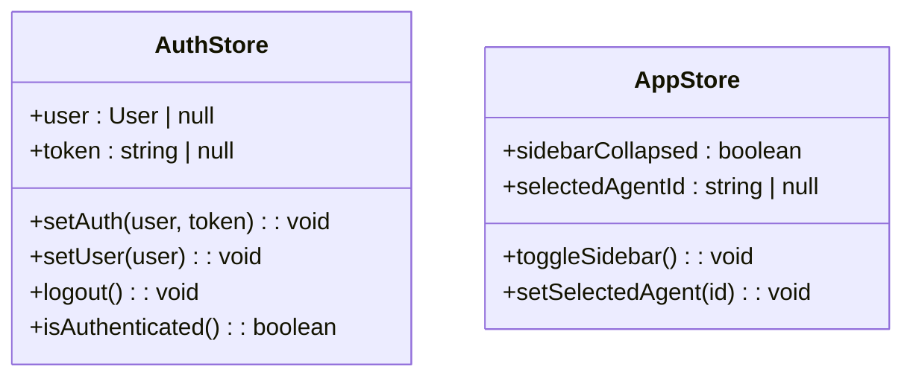

**图表来源** 
- [frontend/src/stores/index.ts:1-53](file://frontend/src/stores/index.ts#L1-L53)

**章节来源**
- [frontend/src/stores/index.ts:1-53](file://frontend/src/stores/index.ts#L1-L53)

### API 客户端与错误处理
- request(url, options)：
  - 自动附加 Authorization 头
  - 网络异常归一化为 AppError
  - HTTP 非 2xx 调用 parseHttpErrorResponse 解析错误体
  - 401 且非认证端点：清理本地存储并重定向登录
- uploadFileWithProgress(url, file, onProgress, extraFields, timeoutMs)：
  - 使用 XMLHttpRequest 实现上传进度回调
  - 支持超时、取消、处理阶段标记（101 表示服务端处理中）
- apiError.ts：
  - AppError/ApiError 统一错误模型
  - parseHttpErrorResponse 兼容多种后端错误格式
  - normalizeUnknownError 兜底未知错误

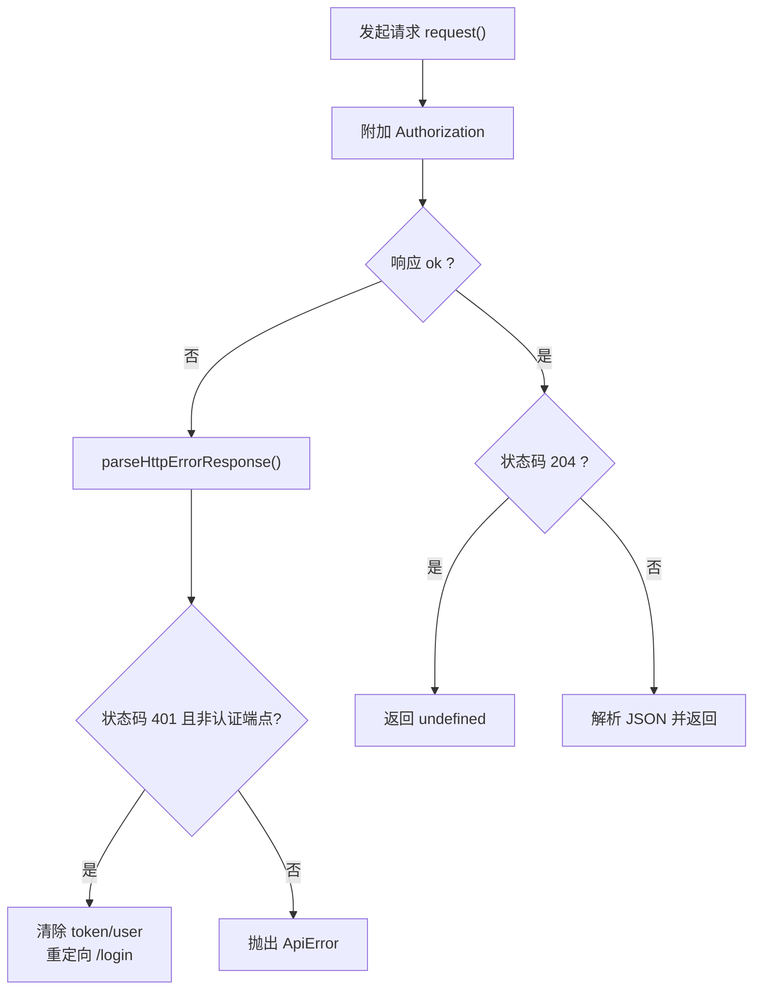

**图表来源** 
- [frontend/src/services/api.ts:11-45](file://frontend/src/services/api.ts#L11-L45)
- [frontend/src/services/apiError.ts:168-181](file://frontend/src/services/apiError.ts#L168-L181)

**章节来源**
- [frontend/src/services/api.ts:1-651](file://frontend/src/services/api.ts#L1-L651)
- [frontend/src/services/apiError.ts:1-204](file://frontend/src/services/apiError.ts#L1-L204)

### 文件上传与拖拽处理
- 聊天页与工作台均使用 uploadFileWithProgress 实现带进度的文件上传。
- 支持多文件并发上传、预览图生成、取消上传、错误提示。
- 工作区面板根据上传进度更新状态（uploading/processing），并展开目标目录。

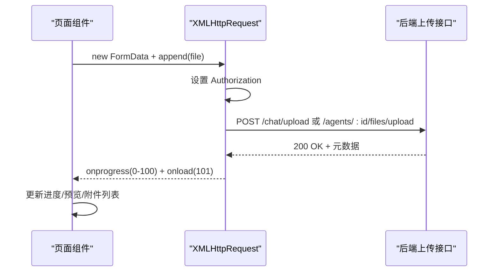

**图表来源** 
- [frontend/src/services/api.ts:78-128](file://frontend/src/services/api.ts#L78-L128)
- [frontend/src/pages/agent-detail/AgentDetailPage.tsx:4518-4590](file://frontend/src/pages/agent-detail/AgentDetailPage.tsx#L4518-L4590)
- [frontend/src/components/WorkspaceOperationPanel.tsx:812-843](file://frontend/src/components/WorkspaceOperationPanel.tsx#L812-L843)

**章节来源**
- [frontend/src/services/api.ts:78-128](file://frontend/src/services/api.ts#L78-L128)
- [frontend/src/pages/agent-detail/AgentDetailPage.tsx:4518-4590](file://frontend/src/pages/agent-detail/AgentDetailPage.tsx#L4518-L4590)
- [frontend/src/components/WorkspaceOperationPanel.tsx:812-843](file://frontend/src/components/WorkspaceOperationPanel.tsx#L812-L843)

### 国际化（i18n）
- 使用 i18next + react-i18next，注册 zh/en 资源。
- 语言检测顺序：localStorage > navigator，支持 zh* 映射为 zh。
- 应用内通过 useTranslation 获取 t 函数与 i18n 实例。

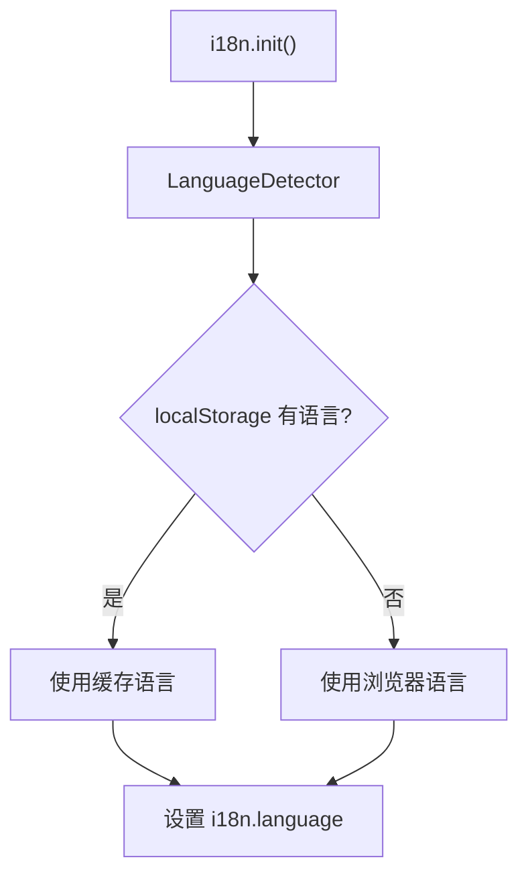

**图表来源** 
- [frontend/src/i18n/index.ts:1-31](file://frontend/src/i18n/index.ts#L1-L31)

**章节来源**
- [frontend/src/i18n/index.ts:1-31](file://frontend/src/i18n/index.ts#L1-L31)

### 主题系统与样式架构
- utils/theme.ts：
  - 将十六进制强调色转换为 RGB，计算明度，生成 hover/subtle/text/btn-text 等变量。
  - 通过 document.documentElement.style.setProperty 注入 CSS 变量。
  - 支持保存/读取/重置强调色，内置预设颜色。
- atlas.css：
  - 限定 .atlas-page 作用域，定义 Paper/Night 两套配色与字体族。
  - 提供页面入场动画、星场背景、排版与边框样式。

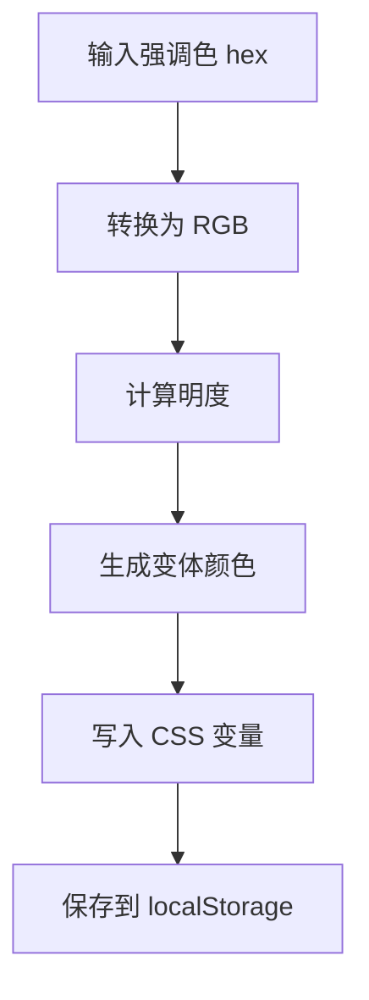

**图表来源** 
- [frontend/src/utils/theme.ts:1-97](file://frontend/src/utils/theme.ts#L1-L97)
- [frontend/src/styles/atlas.css:1-200](file://frontend/src/styles/atlas.css#L1-L200)

**章节来源**
- [frontend/src/utils/theme.ts:1-97](file://frontend/src/utils/theme.ts#L1-L97)
- [frontend/src/styles/atlas.css:1-200](file://frontend/src/styles/atlas.css#L1-L200)

### WebSocket 实时通信
- 群组聊天 useGroupRealtime：
  - 优先建立 WebSocket，失败则回退轮询（间隔 4s）。
  - 连续失败阈值后停止重连，保持轮询降级。
  - 使用 cursor 机制回填断线期间的消息，限制最大页数。
- 聊天页 WebSocket：
  - 连接 /ws/chat/{agentId}?token=...&lang=...
  - onopen 发送 attach_run 携带 run_id 与 cursor，恢复运行状态。

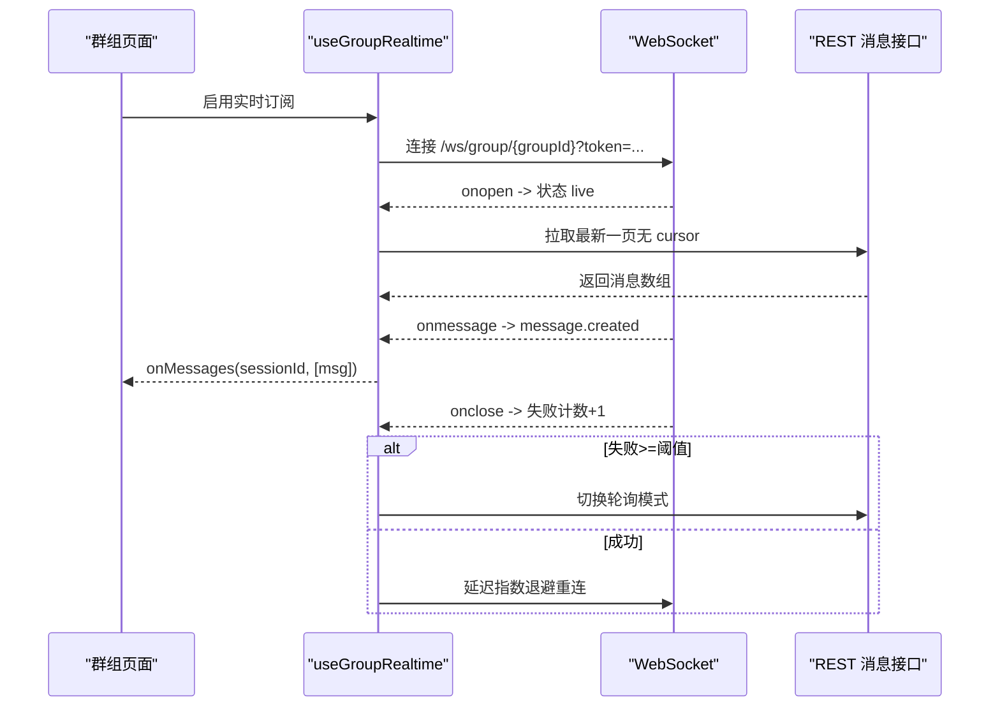

**图表来源** 
- [frontend/src/hooks/useGroupRealtime.ts:1-249](file://frontend/src/hooks/useGroupRealtime.ts#L1-L249)
- [frontend/src/pages/agent-detail/AgentDetailPage.tsx:3312-3340](file://frontend/src/pages/agent-detail/AgentDetailPage.tsx#L3312-L3340)

**章节来源**
- [frontend/src/hooks/useGroupRealtime.ts:1-249](file://frontend/src/hooks/useGroupRealtime.ts#L1-L249)
- [frontend/src/pages/agent-detail/AgentDetailPage.tsx:3312-3340](file://frontend/src/pages/agent-detail/AgentDetailPage.tsx#L3312-L3340)

### 布局与导航
- Layout.tsx：
  - 顶部导航、租户切换、通知中心、语言切换、账户设置。
  - 使用 TanStack Query 拉取未读通知、租户列表、Agent 列表。
  - 支持公司导览 Tour 与自适应定位。

**章节来源**
- [frontend/src/pages/Layout.tsx:1-800](file://frontend/src/pages/Layout.tsx#L1-L800)

## 依赖关系分析
- 运行时依赖：
  - react、react-dom、react-router-dom、@tanstack/react-query、i18next、react-i18next、zustand、recharts、@tabler/icons-react、tsparticles。
- 开发依赖：
  - typescript、vite、@vitejs/plugin-react。
- 构建产物：
  - dist 静态资源由 nginx 容器托管。

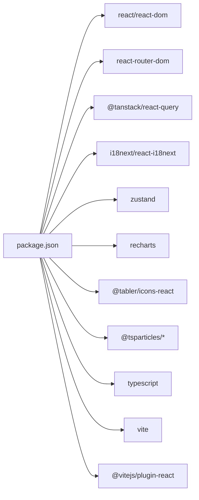

**图表来源** 
- [frontend/package.json:1-37](file://frontend/package.json#L1-L37)

**章节来源**
- [frontend/package.json:1-37](file://frontend/package.json#L1-L37)

## 性能考虑
- 代码分割与分包：
  - manualChunks 将 react、charts、i18n、icons 拆分为独立 vendor 包，提升缓存命中率。
- 懒加载：
  - 页面组件使用 lazy()，仅在路由命中时加载。
- 构建优化：
  - 版本注入 __APP_VERSION__，便于缓存控制与问题定位。
  - 开发服务器端口 3008，代理 /api 与 /ws 到后端。
- 查询缓存：
  - QueryClient 默认重试 1 次，窗口聚焦不自动 refetch，减少冗余请求。
- 实时通信降级：
  - WebSocket 失败回退轮询，避免阻塞用户体验。

**章节来源**
- [frontend/vite.config.ts:1-59](file://frontend/vite.config.ts#L1-L59)
- [frontend/src/main.tsx:17-21](file://frontend/src/main.tsx#L17-L21)
- [frontend/src/App.tsx:7-25](file://frontend/src/App.tsx#L7-L25)

## 故障排查指南
- 常见错误分类：
  - 网络错误：normalizeUnknownError 包装为 AppError，source='http'，retryable=true。
  - HTTP 错误：parseHttpErrorResponse 解析 body 与 traceId，生成 ApiError。
  - 认证失效：401 非认证端点自动清理 token 并跳转登录。
- 调试建议：
  - 检查 localStorage 中的 token 与 theme 设置。
  - 查看浏览器控制台的网络请求与 WebSocket 连接状态。
  - 关注 toast 提示与错误详情（traceId、runId、agentId 等）。

**章节来源**
- [frontend/src/services/apiError.ts:1-204](file://frontend/src/services/apiError.ts#L1-L204)
- [frontend/src/services/api.ts:11-45](file://frontend/src/services/api.ts#L11-L45)

## 结论
Clawith 前端以 React 19 + TypeScript 为基础，结合 Zustand、TanStack Query、React Router 构建了清晰的分层架构。API 客户端统一封装了鉴权、错误处理与文件上传；i18n 与主题系统提供了良好的国际化与个性化体验；WebSocket 实时通信具备健壮的重连与降级策略。构建配置与分包策略有效提升了性能与可维护性。整体方案兼顾功能完整性与工程化水平，适合持续迭代与企业级应用需求。

## 附录
- 构建与部署：
  - Dockerfile 使用 node:20-alpine 构建，nginx:1.31.2-alpine 托管静态资源。
  - 暴露端口 3000，模板化 nginx.conf 用于反向代理与缓存策略。

**章节来源**
- [frontend/Dockerfile:1-16](file://frontend/Dockerfile#L1-L16)