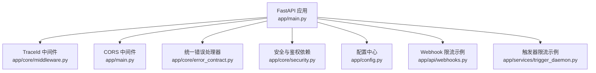
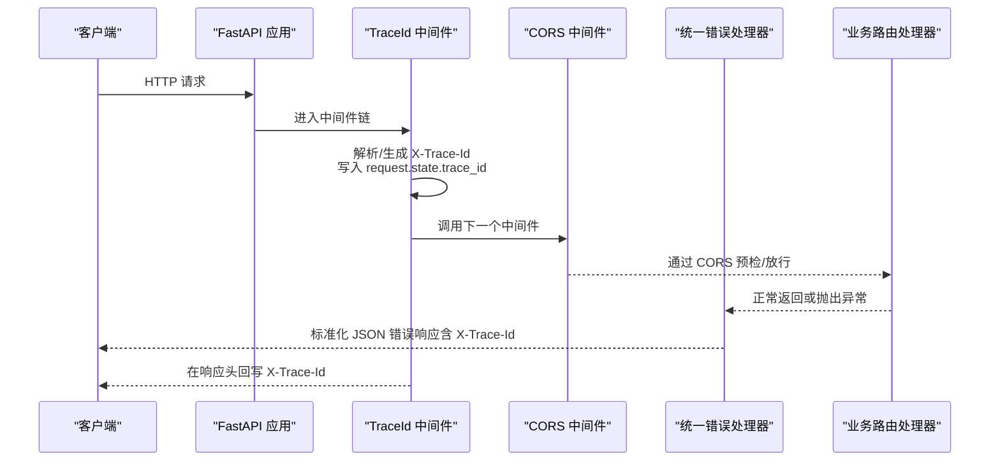
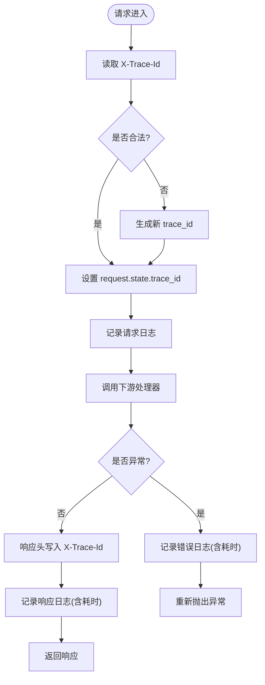
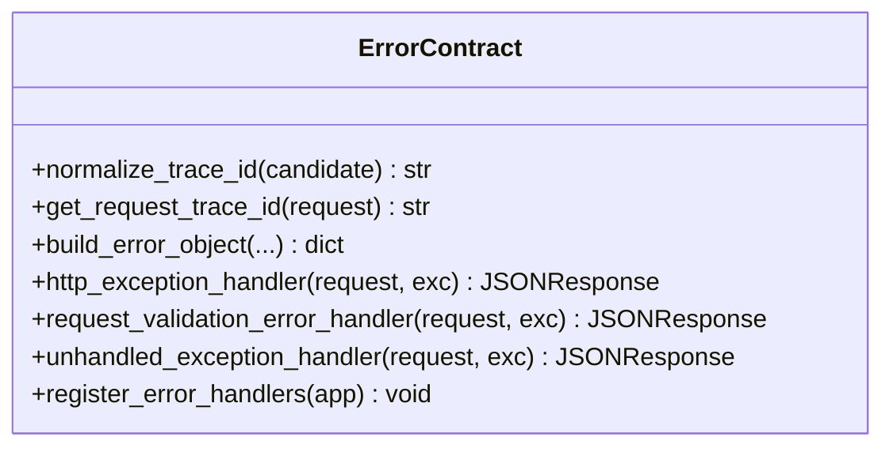
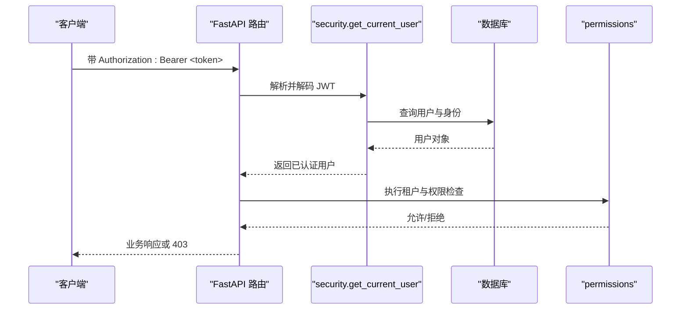
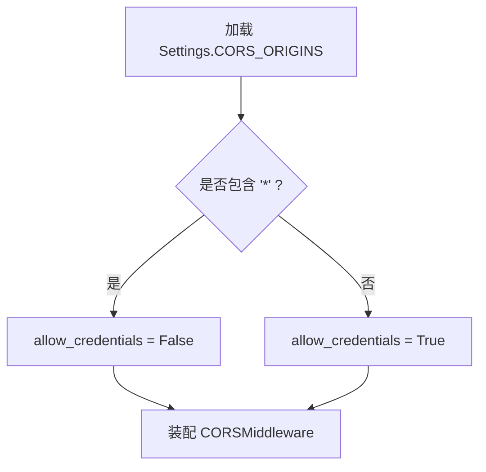
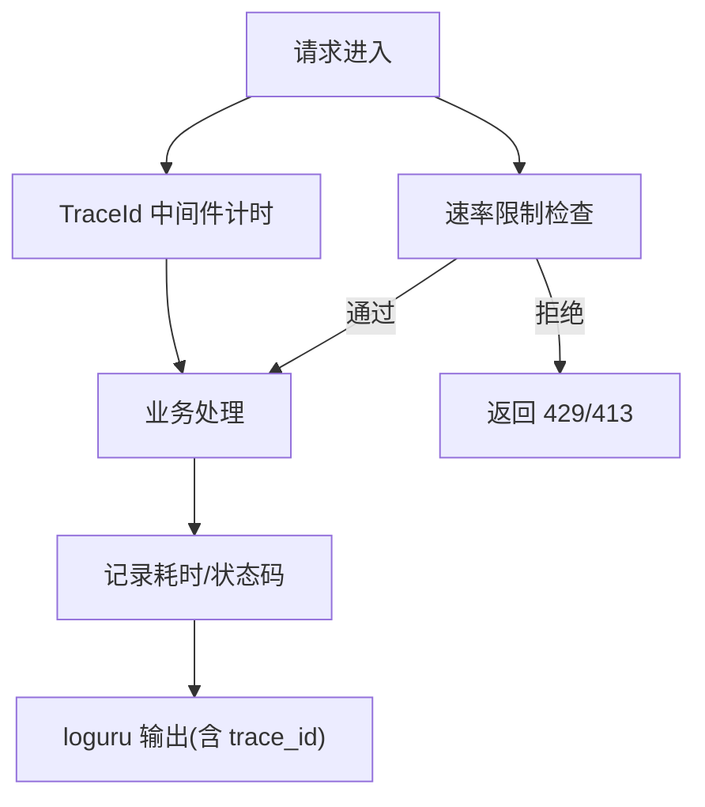
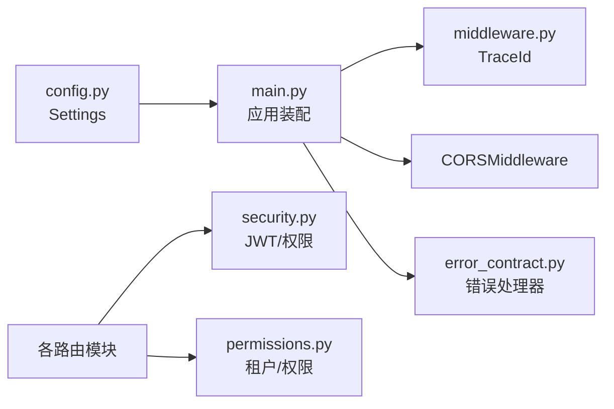

# 中间件架构

<cite>
**本文引用的文件**   
- [backend/app/core/middleware.py](file://backend/app/core/middleware.py)
- [backend/app/main.py](file://backend/app/main.py)
- [backend/app/core/error_contract.py](file://backend/app/core/error_contract.py)
- [backend/app/core/logging_config.py](file://backend/app/core/logging_config.py)
- [backend/app/core/security.py](file://backend/app/core/security.py)
- [backend/app/config.py](file://backend/app/config.py)
- [backend/app/api/webhooks.py](file://backend/app/api/webhooks.py)
- [backend/app/services/trigger_daemon.py](file://backend/app/services/trigger_daemon.py)
</cite>

## 目录
1. [简介](#简介)
2. [项目结构](#项目结构)
3. [核心组件](#核心组件)
4. [架构总览](#架构总览)
5. [详细组件分析](#详细组件分析)
6. [依赖关系分析](#依赖关系分析)
7. [性能考量](#性能考量)
8. [故障排查指南](#故障排查指南)
9. [结论](#结论)
10. [附录：自定义中间件开发指南与最佳实践](#附录自定义中间件开发指南与最佳实践)

## 简介
本技术文档围绕 Clawith 后端中间件架构展开，重点覆盖以下方面：
- TraceIdMiddleware 的请求追踪 ID 生成、传递与日志关联机制
- CORS 动态配置与安全策略
- 统一错误处理中间件的设计模式（异常捕获、错误响应格式化、调试信息控制）
- 认证授权中间件实现（JWT 令牌验证、租户隔离、权限检查）
- 性能监控、请求日志记录与速率限制机制
- 自定义中间件开发指南与最佳实践

## 项目结构
Clawith 后端基于 FastAPI 构建，中间件与横切关注点集中在 app/core 与 app/main 中。关键路径如下：
- 应用入口与中间件装配：app/main.py
- 追踪与请求日志：app/core/middleware.py
- 统一错误处理与 TraceId 规范：app/core/error_contract.py
- 日志框架与上下文 TraceId：app/core/logging_config.py
- 安全与鉴权工具：app/core/security.py
- 运行时配置（含 CORS）：app/config.py
- Webhook 速率限制示例：app/api/webhooks.py
- 触发器守护进程中的速率限制示例：app/services/trigger_daemon.py

**图表来源** 
- [backend/app/main.py:352-371](file://backend/app/main.py#L352-L371)
- [backend/app/core/middleware.py:12-52](file://backend/app/core/middleware.py#L12-L52)
- [backend/app/core/error_contract.py:1-229](file://backend/app/core/error_contract.py#L1-L229)
- [backend/app/core/logging_config.py:1-129](file://backend/app/core/logging_config.py#L1-L129)
- [backend/app/core/security.py:1-227](file://backend/app/core/security.py#L1-L227)
- [backend/app/config.py:177-179](file://backend/app/config.py#L177-L179)
- [backend/app/api/webhooks.py:45-79](file://backend/app/api/webhooks.py#L45-L79)
- [backend/app/services/trigger_daemon.py:141-164](file://backend/app/services/trigger_daemon.py#L141-L164)

**章节来源**
- [backend/app/main.py:352-371](file://backend/app/main.py#L352-L371)
- [backend/app/config.py:177-179](file://backend/app/config.py#L177-L179)

## 核心组件
- 追踪与日志中间件：TraceIdMiddleware
- 统一错误处理：HTTPException、RequestValidationError、未捕获异常的标准化处理
- 安全与鉴权：JWT 签发/校验、角色与权限依赖
- 配置与 CORS：从 Settings 读取并动态装配
- 速率限制：Webhook 与触发器的限流示例

**章节来源**
- [backend/app/core/middleware.py:12-52](file://backend/app/core/middleware.py#L12-L52)
- [backend/app/core/error_contract.py:158-228](file://backend/app/core/error_contract.py#L158-L228)
- [backend/app/core/security.py:128-227](file://backend/app/core/security.py#L128-L227)
- [backend/app/config.py:177-179](file://backend/app/config.py#L177-L179)
- [backend/app/api/webhooks.py:45-79](file://backend/app/api/webhooks.py#L45-L79)
- [backend/app/services/trigger_daemon.py:141-164](file://backend/app/services/trigger_daemon.py#L141-L164)

## 架构总览
下图展示了请求进入 FastAPI 后的中间件链路与关键横切能力：

**图表来源** 
- [backend/app/main.py:359-371](file://backend/app/main.py#L359-L371)
- [backend/app/core/middleware.py:15-52](file://backend/app/core/middleware.py#L15-L52)
- [backend/app/core/error_contract.py:158-228](file://backend/app/core/error_contract.py#L158-L228)

## 详细组件分析

### TraceIdMiddleware：请求追踪与日志关联
- 功能要点
  - 从请求头 X-Trace-Id 获取并规范化；若无效则生成新 ID
  - 将 trace_id 注入 request.state，供后续处理器与日志使用
  - 记录请求开始与结束日志，包含耗时
  - 在响应头回写 X-Trace-Id，便于前端与网关串联链路
- 与日志系统协作
  - logging_config 提供 ContextVar 存储当前 trace_id，所有日志自动携带
  - 统一格式输出，便于集中采集与检索

**图表来源** 
- [backend/app/core/middleware.py:15-52](file://backend/app/core/middleware.py#L15-L52)
- [backend/app/core/logging_config.py:28-47](file://backend/app/core/logging_config.py#L28-L47)

**章节来源**
- [backend/app/core/middleware.py:12-52](file://backend/app/core/middleware.py#L12-L52)
- [backend/app/core/logging_config.py:1-129](file://backend/app/core/logging_config.py#L1-L129)

### 统一错误处理：异常捕获、响应格式化与调试控制
- 设计模式
  - 注册三类处理器：HTTPException、RequestValidationError、通用 Exception
  - 统一构造 ErrorObject（code/message/trace_id/run_id/agent_id/stage/details/retryable）
  - 始终在响应头附加 X-Trace-Id，便于问题定位
- 调试控制
  - 内部错误对外仅返回通用消息，避免泄露敏感细节
  - 日志侧保留完整堆栈，便于运维排障

**图表来源** 
- [backend/app/core/error_contract.py:1-229](file://backend/app/core/error_contract.py#L1-L229)

**章节来源**
- [backend/app/core/error_contract.py:158-228](file://backend/app/core/error_contract.py#L158-L228)

### 认证与授权：JWT、租户隔离与权限检查
- JWT 流程
  - create_access_token：签发包含 sub、role、exp 的访问令牌
  - decode_access_token：校验签名与过期时间，失败返回 401
  - get_current_user / get_authenticated_user：从 Bearer 头解析用户并查询数据库状态
- 角色与权限
  - require_role：按角色白名单进行访问控制
  - permissions：基于租户与访问模式（company/custom/private）的细粒度控制
- 租户隔离
  - 所有资源访问均校验 tenant_id，越权直接拒绝

**图表来源** 
- [backend/app/core/security.py:128-227](file://backend/app/core/security.py#L128-L227)
- [backend/app/core/permissions.py:1-554](file://backend/app/core/permissions.py#L1-L554)

**章节来源**
- [backend/app/core/security.py:128-227](file://backend/app/core/security.py#L128-L227)
- [backend/app/core/permissions.py:1-554](file://backend/app/core/permissions.py#L1-L554)

### CORS 动态配置与安全策略
- 动态来源
  - 从 Settings.CORS_ORIGINS 读取允许的源列表
  - 根据是否包含通配符决定 allow_credentials
- 安全建议
  - 生产环境避免使用 * 作为 allow_origins
  - 明确限定方法、头部与凭据策略

**图表来源** 
- [backend/app/main.py:362-371](file://backend/app/main.py#L362-L371)
- [backend/app/config.py:177-179](file://backend/app/config.py#L177-L179)

**章节来源**
- [backend/app/main.py:362-371](file://backend/app/main.py#L362-L371)
- [backend/app/config.py:177-179](file://backend/app/config.py#L177-L179)

### 性能监控、请求日志与速率限制
- 性能监控
  - TraceIdMiddleware 记录请求耗时与状态码，便于统计 P95/P99
- 请求日志
  - loguru 统一输出，附带 trace_id，支持异步队列与回溯
- 速率限制
  - Webhook 端点：按 token 计数，硬上限防止滥用
  - 触发器守护进程：对 on_message 触发频率进行窗口限制，超限自动禁用

**图表来源** 
- [backend/app/core/middleware.py:15-52](file://backend/app/core/middleware.py#L15-L52)
- [backend/app/core/logging_config.py:61-79](file://backend/app/core/logging_config.py#L61-L79)
- [backend/app/api/webhooks.py:45-79](file://backend/app/api/webhooks.py#L45-L79)
- [backend/app/services/trigger_daemon.py:141-164](file://backend/app/services/trigger_daemon.py#L141-L164)

**章节来源**
- [backend/app/api/webhooks.py:45-79](file://backend/app/api/webhooks.py#L45-L79)
- [backend/app/services/trigger_daemon.py:141-164](file://backend/app/services/trigger_daemon.py#L141-L164)

## 依赖关系分析
- 中间件与应用的装配顺序决定了拦截时机与优先级
- TraceIdMiddleware 优先于其他中间件，确保全量请求具备 trace_id
- 错误处理器在应用层注册，覆盖所有异常路径
- 安全依赖在路由层按需注入，避免全局耦合

**图表来源** 
- [backend/app/main.py:352-371](file://backend/app/main.py#L352-L371)
- [backend/app/core/middleware.py:12-52](file://backend/app/core/middleware.py#L12-L52)
- [backend/app/core/error_contract.py:224-228](file://backend/app/core/error_contract.py#L224-L228)
- [backend/app/core/security.py:128-227](file://backend/app/core/security.py#L128-L227)
- [backend/app/core/permissions.py:1-554](file://backend/app/core/permissions.py#L1-L554)
- [backend/app/config.py:177-179](file://backend/app/config.py#L177-L179)

**章节来源**
- [backend/app/main.py:352-371](file://backend/app/main.py#L352-L371)

## 性能考量
- 中间件开销最小化
  - TraceIdMiddleware 仅做轻量字符串操作与时间测量
- 日志异步化
  - loguru 启用 enqueue，避免阻塞事件循环
- 速率限制前置
  - 在高并发入口（如 Webhook）先做限流，减少后端压力
- 连接与 I/O
  - 合理设置超时与重试策略，避免级联雪崩

[本节为通用指导，不直接分析具体文件]

## 故障排查指南
- 无法获取 trace_id
  - 检查请求头是否携带合法的 X-Trace-Id
  - 确认 logging_config 的 ContextVar 是否正确绑定
- 错误响应缺少 trace_id
  - 确认错误处理器已注册且未被覆盖
- 鉴权失败
  - 检查 JWT 签名与过期时间
  - 确认用户状态与租户匹配
- 跨域失败
  - 核对 CORS_ORIGINS 与 allow_credentials 组合是否符合规范

**章节来源**
- [backend/app/core/logging_config.py:28-47](file://backend/app/core/logging_config.py#L28-L47)
- [backend/app/core/error_contract.py:158-228](file://backend/app/core/error_contract.py#L158-L228)
- [backend/app/core/security.py:141-173](file://backend/app/core/security.py#L141-L173)
- [backend/app/config.py:177-179](file://backend/app/config.py#L177-L179)

## 结论
Clawith 的中间件架构以 TraceIdMiddleware 为核心，结合统一的错误处理、安全的鉴权依赖与可配置的 CORS，构建了稳定、可观测、可扩展的请求处理管线。配合日志与速率限制机制，既保证了可观测性与安全性，也为后续扩展提供了清晰的边界与约定。

[本节为总结性内容，不直接分析具体文件]

## 附录：自定义中间件开发指南与最佳实践
- 开发步骤
  - 继承 BaseHTTPMiddleware，实现 dispatch(request, call_next)
  - 在请求开始时注入上下文（如 trace_id、租户、审计字段）
  - 在 call_next 前后记录指标与日志
  - 异常时记录必要上下文并选择是否透传
- 最佳实践
  - 保持中间件无副作用与幂等
  - 严格控制输入长度与类型，避免注入攻击
  - 遵循统一的错误响应与 trace_id 规范
  - 将耗时逻辑下沉到服务层，中间件只做横切关注点
  - 对高吞吐路径进行基准测试，避免引入额外延迟

[本节为通用指导，不直接分析具体文件]