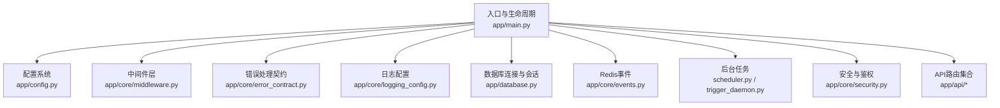
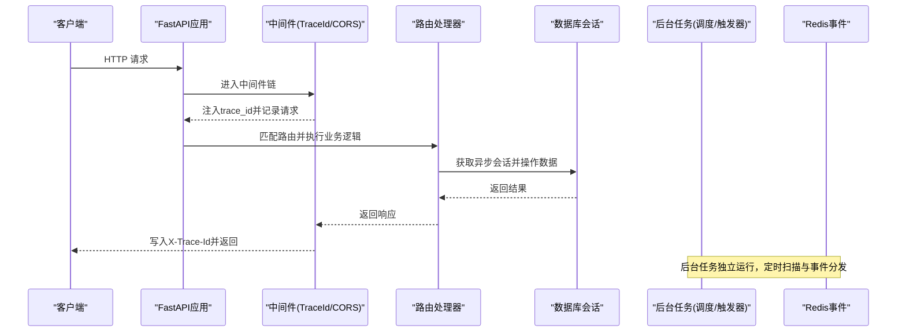
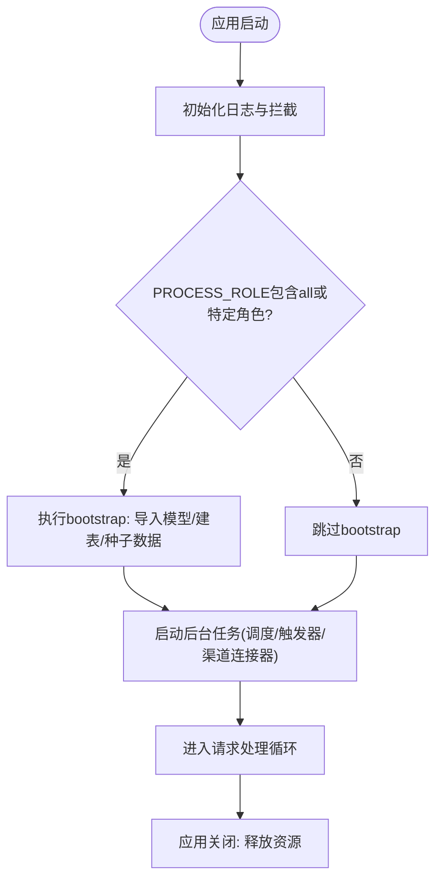
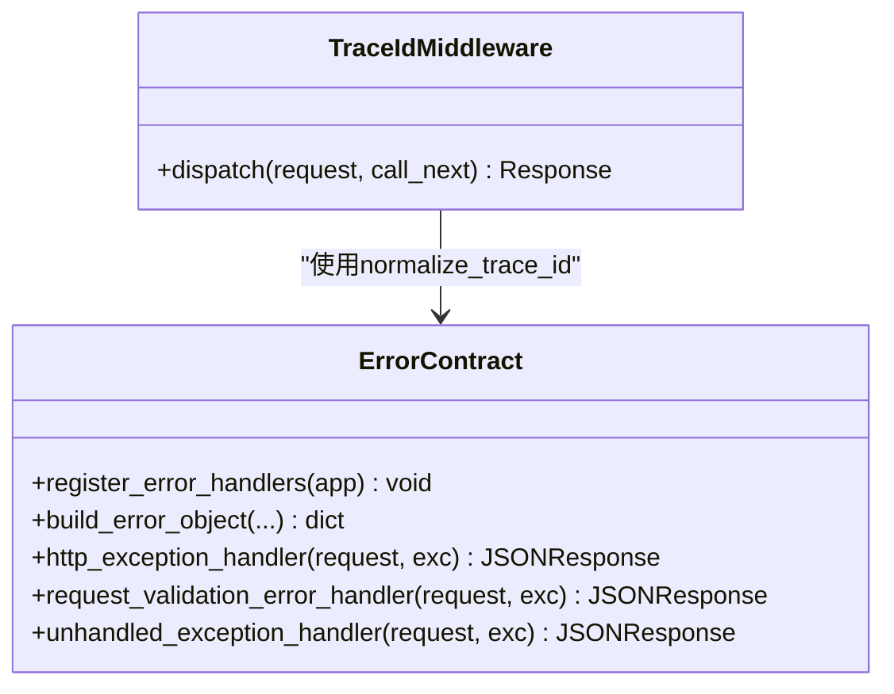
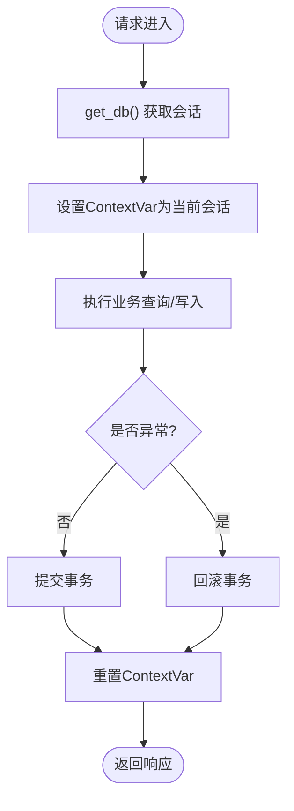
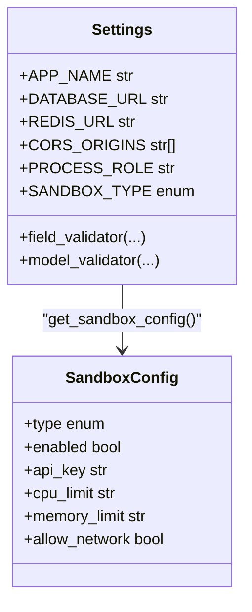
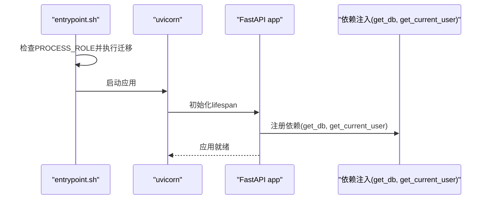
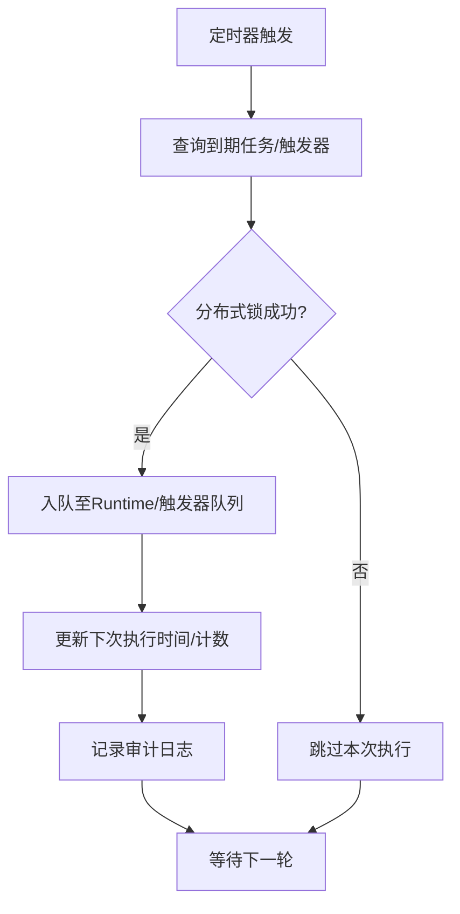
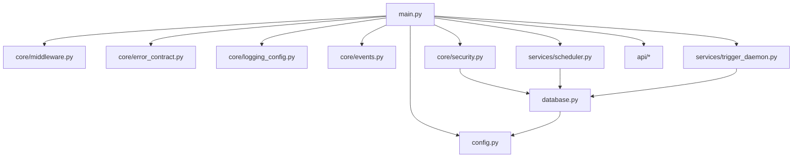

# 后端架构

<cite>
**本文引用的文件**
- [backend/app/main.py](file://backend/app/main.py)
- [backend/app/config.py](file://backend/app/config.py)
- [backend/app/core/middleware.py](file://backend/app/core/middleware.py)
- [backend/app/core/error_contract.py](file://backend/app/core/error_contract.py)
- [backend/app/core/logging_config.py](file://backend/app/core/logging_config.py)
- [backend/app/core/events.py](file://backend/app/core/events.py)
- [backend/app/database.py](file://backend/app/database.py)
- [backend/entrypoint.sh](file://backend/entrypoint.sh)
- [backend/app/services/scheduler.py](file://backend/app/services/scheduler.py)
- [backend/app/services/trigger_daemon.py](file://backend/app/services/trigger_daemon.py)
- [backend/app/core/security.py](file://backend/app/core/security.py)
- [backend/pyproject.toml](file://backend/pyproject.toml)
</cite>

## 目录
1. [简介](#简介)
2. [项目结构](#项目结构)
3. [核心组件](#核心组件)
4. [架构总览](#架构总览)
5. [详细组件分析](#详细组件分析)
6. [依赖关系分析](#依赖关系分析)
7. [性能考量](#性能考量)
8. [故障排查指南](#故障排查指南)
9. [结论](#结论)
10. [附录](#附录)

## 简介
本技术文档面向Clawith后端，系统性阐述FastAPI应用生命周期管理、进程角色分离（bootstrap、api、worker、connector）机制、中间件层设计（TraceIdMiddleware、CORS、错误处理）、数据库连接与异步会话管理、配置系统与环境变量管理、服务启动流程、依赖注入模式、模块化路由注册、性能优化策略、错误监控与日志记录架构。目标是帮助开发者快速理解并高效扩展后端能力。

## 项目结构
后端采用分层与模块化组织：
- 入口与生命周期：main.py 定义 FastAPI 应用、lifespan、中间件、路由注册与后台任务。
- 配置系统：config.py 基于 pydantic-settings 提供集中式配置与环境变量映射。
- 数据访问：database.py 提供异步引擎、会话工厂、事务上下文与上下文变量传播。
- 核心能力：core 下包含中间件、错误契约、日志配置、Redis事件等。
- 业务服务：services 下包含调度器、触发器守护进程、Agent运行时、渠道连接器等。
- API路由：api 下按领域划分路由模块，统一通过 main.py 注册。

**图表来源**
- [backend/app/main.py:121-356](file://backend/app/main.py#L121-L356)
- [backend/app/config.py:79-247](file://backend/app/config.py#L79-L247)
- [backend/app/core/middleware.py:12-53](file://backend/app/core/middleware.py#L12-L53)
- [backend/app/core/error_contract.py:224-229](file://backend/app/core/error_contract.py#L224-L229)
- [backend/app/core/logging_config.py:61-79](file://backend/app/core/logging_config.py#L61-L79)
- [backend/app/database.py:14-21](file://backend/app/database.py#L14-L21)
- [backend/app/core/events.py:14-33](file://backend/app/core/events.py#L14-L33)
- [backend/app/services/scheduler.py:119-125](file://backend/app/services/scheduler.py#L119-L125)
- [backend/app/services/trigger_daemon.py:173-201](file://backend/app/services/trigger_daemon.py#L173-L201)
- [backend/app/core/security.py:153-173](file://backend/app/core/security.py#L153-L173)

**章节来源**
- [backend/app/main.py:121-471](file://backend/app/main.py#L121-L471)
- [backend/app/config.py:79-247](file://backend/app/config.py#L79-L247)

## 核心组件
- FastAPI应用与生命周期：通过 lifespan 钩子完成日志初始化、环境检查、数据库表创建（可选）、种子数据、后台任务启动与优雅关闭。
- 进程角色分离：依据环境变量 PROCESS_ROLE 控制 bootstrap、api、worker、connector 四类角色的启用组合，支持 all 或逗号分隔的细粒度选择。
- 中间件层：TraceIdMiddleware 负责请求追踪ID注入与响应头回写；CORS 中间件根据配置动态设置允许源与凭据策略。
- 错误处理契约：统一 HTTPException、请求校验异常与未捕获异常的标准化错误体，附带 trace_id 与可选上下文字段。
- 数据库连接与异步会话：使用 asyncpg + SQLAlchemy 异步引擎，配置连接池大小与溢出；get_db 依赖提供自动提交/回滚与上下文变量传播；transaction 提供事务边界。
- 配置系统：Settings 类集中管理所有配置项，支持 .env 加载、字段校验与默认值推导（容器检测、路径推断）。
- 后台任务：调度器（cron）与触发器守护进程作为独立协程在 lifespan 中启动，具备心跳与清理逻辑。
- 安全与鉴权：JWT 令牌签发与解码、密码哈希/验证、用户获取依赖、角色权限校验。

**章节来源**
- [backend/app/main.py:22-35](file://backend/app/main.py#L22-L35)
- [backend/app/main.py:352-371](file://backend/app/main.py#L352-L371)
- [backend/app/core/middleware.py:12-53](file://backend/app/core/middleware.py#L12-L53)
- [backend/app/core/error_contract.py:158-229](file://backend/app/core/error_contract.py#L158-L229)
- [backend/app/database.py:30-79](file://backend/app/database.py#L30-L79)
- [backend/app/config.py:79-247](file://backend/app/config.py#L79-L247)
- [backend/app/services/scheduler.py:119-125](file://backend/app/services/scheduler.py#L119-L125)
- [backend/app/services/trigger_daemon.py:173-201](file://backend/app/services/trigger_daemon.py#L173-L201)
- [backend/app/core/security.py:128-173](file://backend/app/core/security.py#L128-L173)

## 架构总览
下图展示从请求进入至响应返回的关键路径，以及后台任务的并行执行。

**图表来源**
- [backend/app/main.py:352-371](file://backend/app/main.py#L352-L371)
- [backend/app/core/middleware.py:12-53](file://backend/app/core/middleware.py#L12-L53)
- [backend/app/database.py:30-42](file://backend/app/database.py#L30-L42)
- [backend/app/core/events.py:22-26](file://backend/app/core/events.py#L22-26)
- [backend/app/services/scheduler.py:119-125](file://backend/app/services/scheduler.py#L119-L125)
- [backend/app/services/trigger_daemon.py:173-201](file://backend/app/services/trigger_daemon.py#L173-L201)

## 详细组件分析

### 应用生命周期与进程角色分离
- 生命周期钩子 lifespan：
  - 初始化日志与标准库拦截，输出诊断信息。
  - 根据 PROCESS_ROLE 决定是否执行 bootstrap 阶段（导入模型、创建表、种子数据、迁移LangGraph检查点等）。
  - 根据角色启动 api、worker、connector 相关后台任务（实时路由、调度器、触发器守护、各渠道连接器）。
  - 优雅关闭时释放资源（Runtime worker、实时路由、Redis连接）。
- 进程角色解析：
  - _process_roles 将逗号分隔字符串转为集合，支持 all 通配。
  - _role_enabled 判断当前进程是否启用指定角色。

**图表来源**
- [backend/app/main.py:121-356](file://backend/app/main.py#L121-L356)
- [backend/app/main.py:22-35](file://backend/app/main.py#L22-L35)

**章节来源**
- [backend/app/main.py:121-356](file://backend/app/main.py#L121-L356)
- [backend/app/main.py:22-35](file://backend/app/main.py#L22-L35)

### 中间件层设计
- TraceIdMiddleware：
  - 从请求头 X-Trace-Id 读取并规范化，缺失则生成新ID。
  - 将 trace_id 写入 request.state 并在响应头回写。
  - 记录请求与响应耗时，异常时记录错误堆栈。
- CORS配置：
  - 根据 settings.CORS_ORIGINS 动态设置 allow_origins。
  - 若存在通配符则禁止携带凭据（遵循CORS规范）。
- 错误处理契约：
  - 统一注册 HTTPException、RequestValidationError、通用 Exception 处理器。
  - 构建标准化错误体，包含 code、message、trace_id 及可选 run_id、agent_id、stage、details、retryable。

**图表来源**
- [backend/app/core/middleware.py:12-53](file://backend/app/core/middleware.py#L12-L53)
- [backend/app/core/error_contract.py:224-229](file://backend/app/core/error_contract.py#L224-L229)
- [backend/app/core/error_contract.py:158-229](file://backend/app/core/error_contract.py#L158-L229)

**章节来源**
- [backend/app/core/middleware.py:12-53](file://backend/app/core/middleware.py#L12-L53)
- [backend/app/core/error_contract.py:158-229](file://backend/app/core/error_contract.py#L158-L229)

### 数据库连接管理与异步会话
- 引擎与会话：
  - create_async_engine 使用 settings.DATABASE_URL，开启 echo（DEBUG模式），pool_size=20，max_overflow=10。
  - async_sessionmaker 提供 expire_on_commit=False 的会话工厂。
- get_db 依赖：
  - 使用 async with 管理会话生命周期，自动 commit/rollback。
  - 通过 ContextVar 传播当前会话到调用链。
- transaction 上下文：
  - 支持传入已有会话或新建会话，确保事务边界一致。

**图表来源**
- [backend/app/database.py:14-21](file://backend/app/database.py#L14-L21)
- [backend/app/database.py:30-42](file://backend/app/database.py#L30-L42)
- [backend/app/database.py:47-79](file://backend/app/database.py#L47-L79)

**章节来源**
- [backend/app/database.py:14-79](file://backend/app/database.py#L14-L79)

### 配置系统与多环境支持
- Settings 类：
  - 基于 pydantic-settings BaseSettings，支持 .env 文件加载与字段校验。
  - 提供容器检测、路径推断、默认值推导（如 AGENT_DATA_DIR、INSTANCE_ID）。
  - 对关键字段进行非空校验与约束（如运行时图名称/版本、claim TTL与renew顺序）。
- get_settings 缓存：
  - 使用 lru_cache 避免重复实例化。
- SandboxConfig 构造：
  - 从 Settings 派生沙箱配置，合并代理设置。

**图表来源**
- [backend/app/config.py:79-247](file://backend/app/config.py#L79-L247)
- [backend/app/config.py:250-268](file://backend/app/config.py#L250-L268)

**章节来源**
- [backend/app/config.py:79-247](file://backend/app/config.py#L79-L247)
- [backend/app/config.py:250-268](file://backend/app/config.py#L250-L268)

### 服务启动流程与依赖注入
- 启动流程：
  - entrypoint.sh 根据 PROCESS_ROLE 决定是否执行 Alembic 迁移与 LangGraph 检查点初始化。
  - 最终通过 uvicorn 启动 FastAPI 应用。
- 依赖注入模式：
  - get_db 作为 FastAPI Depends 提供异步会话。
  - security.get_current_user 依赖 JWT 解码与用户查询。
  - require_role 工厂函数用于权限校验。

**图表来源**
- [backend/entrypoint.sh:42-95](file://backend/entrypoint.sh#L42-L95)
- [backend/app/main.py:352-371](file://backend/app/main.py#L352-L371)
- [backend/app/core/security.py:153-173](file://backend/app/core/security.py#L153-L173)

**章节来源**
- [backend/entrypoint.sh:42-95](file://backend/entrypoint.sh#L42-L95)
- [backend/app/core/security.py:153-173](file://backend/app/core/security.py#L153-L173)

### 模块化路由注册机制
- main.py 集中导入各路由模块并通过 app.include_router 注册。
- 部分路由带 API_PREFIX，部分公共路由（如 webhooks、pages_public）不带前缀。
- 路由按领域划分，便于维护与扩展。

```mermaid
graph LR
Main["main.py 路由注册"] --> Auth["auth_router"]
Main --> Agents["agents_router"]
Main --> Tasks["tasks_router"]
Main --> Files["files_router"]
Main --> WS["ws_router"]
Main --> Feishu["feishu_router"]
Main --> SSO["sso_router"]
Main --> Org["org_router"]
Main --> Enterprise["enterprise_router"]
Main --> Advanced["advanced_router"]
Main --> Upload["upload_router"]
Main --> Relationships["relationships_router"]
Main --> Directory["directory_router"]
Main --> Activity["activity_router"]
Main --> Messages["messages_router"]
Main --> Tenants["tenants_router"]
Main --> Schedules["schedules_router"]
Main --> Tools["tools_router"]
Main --> Skills["skills_router"]
Main --> Users["users_router"]
Main --> Slack["slack_router"]
Main --> Discord["discord_router"]
Main --> Dingtalk["dingtalk_router"]
Main --> GoogleWorkspace["google_workspace_router"]
Main --> Wecom["wecom_router"]
Main --> Wechat["wechat_router"]
Main --> Teams["teams_router"]
Main --> Atlassian["atlassian_router"]
Main --> Triggers["triggers_router"]
Main --> Focus["focus_router"]
Main --> ChatSessions["chat_sessions_router"]
Main --> Groups["groups_router"]
Main --> Plaza["plaza_router"]
Main --> Experience["experience_router"]
Main --> Notification["notification_router"]
Main --> Webhooks["webhooks_router"]
Main --> Gateway["gateway_router"]
Main --> Admin["admin_router"]
Main --> Pages["pages_router"]
Main --> Credentials["credentials_router"]
Main --> AgentBayControl["agentbay_control_router"]
Main --> OKR["okr_router"]
Main --> Onboarding["onboarding_router"]
```

**图表来源**
- [backend/app/main.py:374-471](file://backend/app/main.py#L374-L471)

**章节来源**
- [backend/app/main.py:374-471](file://backend/app/main.py#L374-L471)

### 后台任务与分布式协调
- 调度器（scheduler）：
  - 每30秒扫描因 cron 表达式到期的任务，使用 for_update(skip_locked=True) 实现分布式锁。
  - 将任务入队至 Runtime，记录审计日志与下次执行时间。
- 触发器守护进程（trigger_daemon）：
  - 每15秒评估启用的触发器，支持 on_message 速率限制与自动禁用。
  - 定期清理过期经验条目与心跳检查。

**图表来源**
- [backend/app/services/scheduler.py:27-117](file://backend/app/services/scheduler.py#L27-L117)
- [backend/app/services/trigger_daemon.py:107-172](file://backend/app/services/trigger_daemon.py#L107-L172)

**章节来源**
- [backend/app/services/scheduler.py:27-125](file://backend/app/services/scheduler.py#L27-L125)
- [backend/app/services/trigger_daemon.py:107-201](file://backend/app/services/trigger_daemon.py#L107-L201)

## 依赖关系分析
- 外部依赖：
  - FastAPI、Uvicorn、SQLAlchemy(asyncpg)、Alembic、Redis(hiredis)、Pydantic、python-jose、passlib、loguru、websockets、aiofiles、croniter、PyYAML、boto3/aioboto3、langgraph、psycopg等。
- 内部依赖：
  - main.py 依赖 config、middleware、error_contract、logging_config、events、services.*、api.*。
  - database.py 依赖 config。
  - core.security 依赖 database 与 config。
  - services.scheduler/trigger_daemon 依赖 database 与 models。

**图表来源**
- [backend/app/main.py:11-17](file://backend/app/main.py#L11-L17)
- [backend/app/database.py:10-12](file://backend/app/database.py#L10-L12)
- [backend/app/core/security.py:20-23](file://backend/app/core/security.py#L20-L23)
- [backend/app/services/scheduler.py:29-37](file://backend/app/services/scheduler.py#L29-L37)
- [backend/app/services/trigger_daemon.py:14-26](file://backend/app/services/trigger_daemon.py#L14-L26)

**章节来源**
- [backend/pyproject.toml:6-51](file://backend/pyproject.toml#L6-L51)
- [backend/app/main.py:11-17](file://backend/app/main.py#L11-L17)

## 性能考量
- 数据库连接池：
  - pool_size=20，max_overflow=10，适合高并发场景；可根据负载调整。
- 异步I/O：
  - 全链路异步（asyncpg、redis.asyncio、websockets、aiofiles），避免阻塞事件循环。
- 日志与追踪：
  - loguru 异步队列输出，减少IO阻塞；trace_id 贯穿请求与后台任务。
- 后台任务：
  - 调度器与触发器守护进程使用 skip_locked 分布式锁，避免重复执行。
- 沙箱隔离：
  - 支持 bubblewrap 与子进程沙箱，本地开发可降级以避免安全风险。

[本节为通用指导，不直接分析具体文件]

## 故障排查指南
- 启动失败：
  - 检查 PROCESS_ROLE 与 entrypoint.sh 中的迁移步骤；查看 ALLOW_MIGRATION_FAILURE 标志。
  - 确认 DATABASE_URL、REDIS_URL 连通性。
- 请求无 trace_id：
  - 检查 X-Trace-Id 头格式是否符合正则；确认 TraceIdMiddleware 已注册。
- 错误响应不一致：
  - 确认 register_error_handlers 已调用；检查 HTTPException.detail 结构。
- 后台任务未执行：
  - 查看 scheduler/trigger_daemon 日志；确认数据库锁与状态字段。
- 权限问题：
  - 检查 JWT_SECRET_KEY 与 token 有效期；确认用户角色与依赖注入。

**章节来源**
- [backend/entrypoint.sh:42-95](file://backend/entrypoint.sh#L42-L95)
- [backend/app/core/middleware.py:12-53](file://backend/app/core/middleware.py#L12-L53)
- [backend/app/core/error_contract.py:158-229](file://backend/app/core/error_contract.py#L158-L229)
- [backend/app/services/scheduler.py:114-117](file://backend/app/services/scheduler.py#L114-L117)
- [backend/app/services/trigger_daemon.py:170-172](file://backend/app/services/trigger_daemon.py#L170-L172)
- [backend/app/core/security.py:141-173](file://backend/app/core/security.py#L141-L173)

## 结论
Clawith后端以FastAPI为核心，结合pydantic-settings、SQLAlchemy异步生态与loguru日志体系，构建了高内聚、低耦合、可扩展的架构。通过进程角色分离、中间件层、统一错误契约与依赖注入，实现了清晰的职责划分与健壮的错误处理。后台任务与分布式锁保障了高并发下的稳定性。建议在生产环境中严格配置密钥、调整连接池参数、启用完整日志与监控，并持续优化后台任务性能。

[本节为总结性内容，不直接分析具体文件]

## 附录
- 环境变量清单（示例）：
  - APP_NAME、APP_VERSION、DEBUG、SECRET_KEY、API_PREFIX
  - DATABASE_URL、REDIS_URL、INSTANCE_ID
  - JWT_SECRET_KEY、JWT_ALGORITHM、JWT_ACCESS_TOKEN_EXPIRE_MINUTES
  - CORS_ORIGINS、PROCESS_ROLE
  - SANDBOX_* 系列配置
- 健康检查与版本接口：
  - /api/health 返回状态与版本
  - /api/version 返回前端版本与Git提交哈希

[本节为补充信息，不直接分析具体文件]