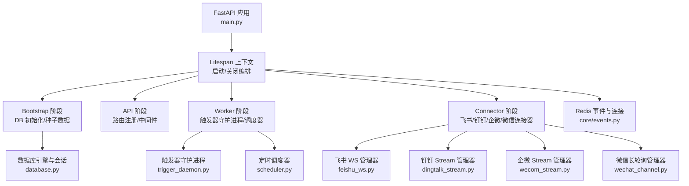
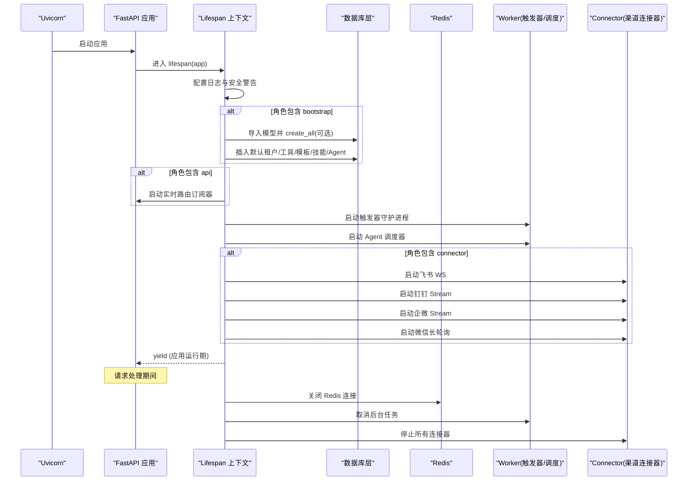
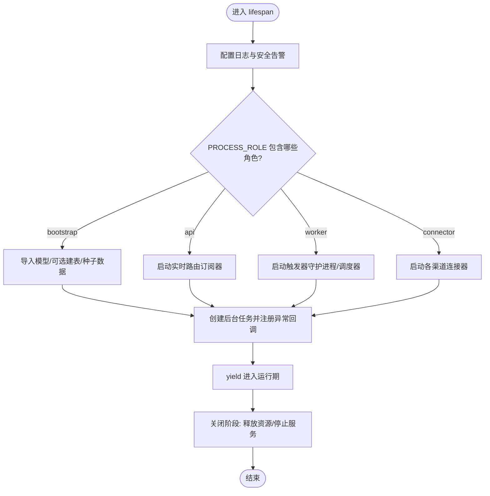
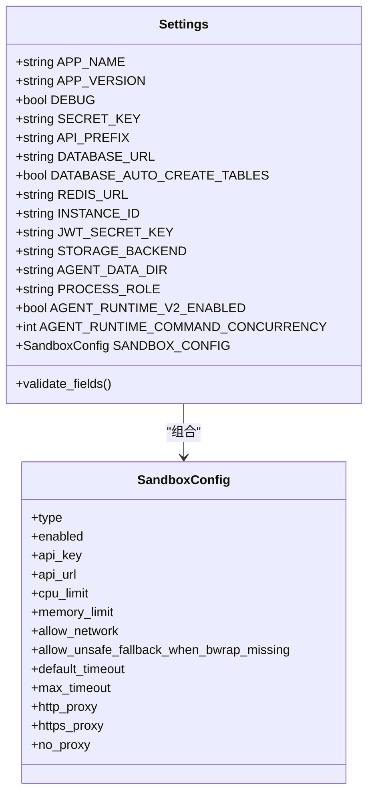
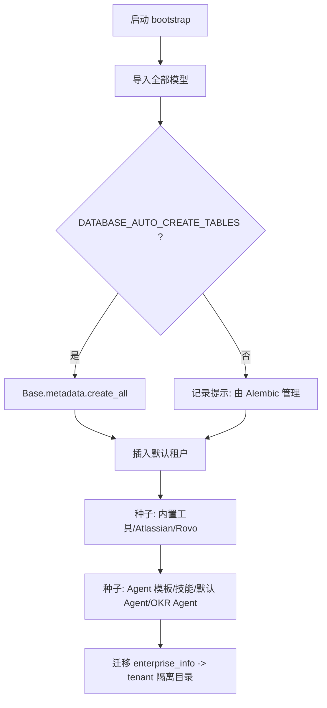
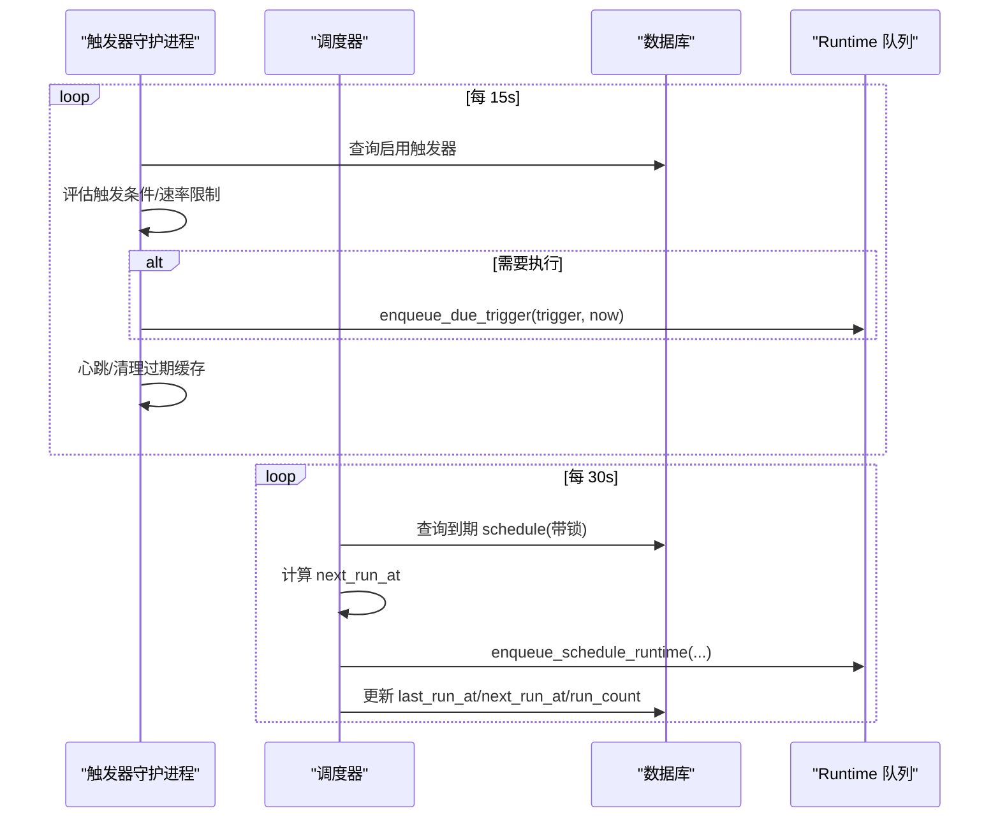
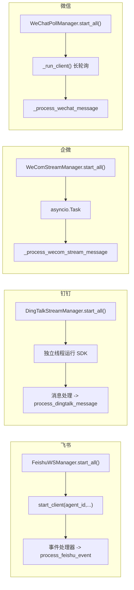
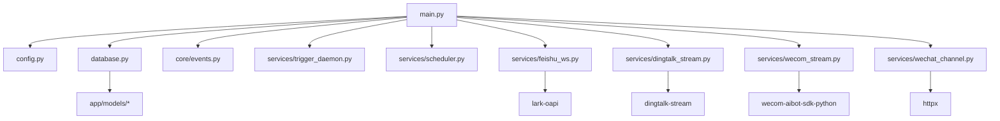

# 应用生命周期管理

<cite>
**本文引用的文件**   
- [backend/app/main.py](file://backend/app/main.py)
- [backend/app/config.py](file://backend/app/config.py)
- [backend/app/database.py](file://backend/app/database.py)
- [backend/app/core/events.py](file://backend/app/core/events.py)
- [backend/app/services/trigger_daemon.py](file://backend/app/services/trigger_daemon.py)
- [backend/app/services/scheduler.py](file://backend/app/services/scheduler.py)
- [backend/app/services/feishu_ws.py](file://backend/app/services/feishu_ws.py)
- [backend/app/services/dingtalk_stream.py](file://backend/app/services/dingtalk_stream.py)
- [backend/app/services/wecom_stream.py](file://backend/app/services/wecom_stream.py)
- [backend/app/services/wechat_channel.py](file://backend/app/services/wechat_channel.py)
</cite>

## 目录
1. [简介](#简介)
2. [项目结构](#项目结构)
3. [核心组件](#核心组件)
4. [架构总览](#架构总览)
5. [详细组件分析](#详细组件分析)
6. [依赖关系分析](#依赖关系分析)
7. [性能考量](#性能考量)
8. [故障排查指南](#故障排查指南)
9. [结论](#结论)
10. [附录](#附录)

## 简介
本技术文档围绕 Clawith 后端应用的生命周期管理展开，重点阐述 FastAPI 的 lifespan 上下文管理器在启动与关闭阶段的完整流程；进程角色分离机制（bootstrap、api、worker、connector）的职责与启动顺序；数据库初始化、表结构创建与默认数据种子加载过程；后台任务管理系统（触发器守护进程、调度器、渠道连接器）的启动与监控；错误处理策略、资源清理机制与服务健康检查；以及配置验证、环境变量检查与依赖服务可用性检测的实现细节。

## 项目结构
Clawith 后端以 FastAPI 为入口，通过 lifespan 统一编排启动与关闭阶段。关键模块包括：
- 应用入口与生命周期编排：main.py
- 配置与环境变量：config.py
- 数据库连接与会话：database.py
- Redis 事件与连接管理：core/events.py
- 后台任务：trigger_daemon.py、scheduler.py
- 渠道连接器：feishu_ws.py、dingtalk_stream.py、wecom_stream.py、wechat_channel.py

**图表来源** 
- [backend/app/main.py:121-350](file://backend/app/main.py#L121-L350)
- [backend/app/config.py:79-247](file://backend/app/config.py#L79-L247)
- [backend/app/database.py:14-21](file://backend/app/database.py#L14-L21)
- [backend/app/core/events.py:14-34](file://backend/app/core/events.py#L14-L34)
- [backend/app/services/trigger_daemon.py:173-201](file://backend/app/services/trigger_daemon.py#L173-L201)
- [backend/app/services/scheduler.py:119-125](file://backend/app/services/scheduler.py#L119-L125)
- [backend/app/services/feishu_ws.py:362-397](file://backend/app/services/feishu_ws.py#L362-L397)
- [backend/app/services/dingtalk_stream.py:662-696](file://backend/app/services/dingtalk_stream.py#L662-L696)
- [backend/app/services/wecom_stream.py:316-347](file://backend/app/services/wecom_stream.py#L316-L347)
- [backend/app/services/wechat_channel.py:301-330](file://backend/app/services/wechat_channel.py#L301-L330)

**章节来源**
- [backend/app/main.py:121-350](file://backend/app/main.py#L121-L350)
- [backend/app/config.py:79-247](file://backend/app/config.py#L79-L247)

## 核心组件
- FastAPI 应用与中间件：注册错误处理、CORS、TraceId 中间件，挂载所有 API 路由，提供健康检查与版本接口。
- 配置系统：基于 Pydantic Settings，支持 .env 文件与环境变量，内置字段校验与模型级约束。
- 数据库层：异步 SQLAlchemy 引擎与会话工厂，事务上下文与 ContextVar 会话传播。
- Redis 事件：单例客户端、发布/订阅封装、优雅关闭。
- 后台任务：触发器守护进程与定时调度器，按角色按需启动。
- 渠道连接器：多平台长连接或轮询管理器，负责消息入站与状态维护。

**章节来源**
- [backend/app/main.py:352-471](file://backend/app/main.py#L352-L471)
- [backend/app/config.py:79-247](file://backend/app/config.py#L79-L247)
- [backend/app/database.py:14-79](file://backend/app/database.py#L14-L79)
- [backend/app/core/events.py:14-34](file://backend/app/core/events.py#L14-L34)

## 架构总览
下图展示 FastAPI lifespan 启动与关闭的关键路径，以及各角色的启动顺序与职责边界。

**图表来源** 
- [backend/app/main.py:121-350](file://backend/app/main.py#L121-L350)
- [backend/app/database.py:14-21](file://backend/app/database.py#L14-L21)
- [backend/app/core/events.py:28-34](file://backend/app/core/events.py#L28-L34)
- [backend/app/services/trigger_daemon.py:173-201](file://backend/app/services/trigger_daemon.py#L173-L201)
- [backend/app/services/scheduler.py:119-125](file://backend/app/services/scheduler.py#L119-L125)
- [backend/app/services/feishu_ws.py:362-397](file://backend/app/services/feishu_ws.py#L362-L397)
- [backend/app/services/dingtalk_stream.py:662-696](file://backend/app/services/dingtalk_stream.py#L662-L696)
- [backend/app/services/wecom_stream.py:316-347](file://backend/app/services/wecom_stream.py#L316-L347)
- [backend/app/services/wechat_channel.py:301-330](file://backend/app/services/wechat_channel.py#L301-L330)

## 详细组件分析

### FastAPI 生命周期与角色编排
- 启动阶段：
  - 配置日志与标准日志拦截
  - bubblewrap 可用性诊断与警告
  - 安全密钥默认值告警
  - Bootstrap：导入全部模型、可选自动建表、默认租户与种子数据（工具、模板、技能、Agent、OKR Agent）
  - API：启动实时路由订阅器
  - Worker：启动触发器守护进程与 Agent 调度器
  - Connector：启动飞书、钉钉、企微、微信等渠道连接器
  - 其他：审计日志写入、ss-local 代理（非致命）
- 关闭阶段：
  - 使用 AsyncExitStack 统一释放运行时资源
  - 停止实时路由、关闭 Redis 连接

**图表来源** 
- [backend/app/main.py:121-350](file://backend/app/main.py#L121-L350)

**章节来源**
- [backend/app/main.py:121-350](file://backend/app/main.py#L121-L350)

### 配置系统与验证
- 读取来源：.env、../.env 与环境变量，大小写敏感，忽略多余字段
- 关键字段：
  - 应用：APP_NAME、APP_VERSION、DEBUG、SECRET_KEY、API_PREFIX
  - 数据库：DATABASE_URL、DATABASE_AUTO_CREATE_TABLES
  - Redis：REDIS_URL、INSTANCE_ID
  - JWT：JWT_SECRET_KEY、算法与过期时间
  - 存储：STORAGE_BACKEND、本地根目录、S3 相关参数
  - 进程角色：PROCESS_ROLE（all/bootstrap/api/worker/connector）
  - 沙箱：类型、CPU/内存限制、网络开关、超时、代理
  - 运行时：Graph 名称/版本、并发、TTL、扫描间隔、阈值等
- 校验规则：
  - 空字符串可选字段规范化为 None
  - Graph 名称/版本非空校验
  - Claim 续期小于过期时间的逻辑约束
- 容器检测与默认路径：根据容器环境选择默认数据目录与模板目录

**图表来源** 
- [backend/app/config.py:79-247](file://backend/app/config.py#L79-L247)

**章节来源**
- [backend/app/config.py:79-247](file://backend/app/config.py#L79-L247)

### 数据库初始化与种子数据
- 引擎与会话：异步引擎、会话工厂、事务上下文与 ContextVar 传播
- 自动建表：当 DATABASE_AUTO_CREATE_TABLES=True 时，导入全部模型后执行 Base.metadata.create_all
- 默认数据：
  - 默认租户（slug=default）
  - 内置工具与 Atlassian Rovo 工具
  - Agent 模板、技能、默认 Agent、OKR Agent 与补丁
- 迁移兼容：enterprise_info 目录迁移至 tenant 隔离目录

**图表来源** 
- [backend/app/main.py:153-281](file://backend/app/main.py#L153-L281)
- [backend/app/database.py:14-21](file://backend/app/database.py#L14-L21)

**章节来源**
- [backend/app/main.py:153-281](file://backend/app/main.py#L153-L281)
- [backend/app/database.py:14-79](file://backend/app/database.py#L14-L79)

### 后台任务管理系统
- 触发器守护进程：
  - 每 15 秒 tick，评估启用的触发器，去重窗口与速率限制（on_message 每小时上限）
  - 特殊处理 OKR 收集与报告触发器
  - 每日清理已下架经验条目（超过 TTL）
  - 心跳与健康检查（约 60 秒一次）
- 调度器：
  - 每 30 秒 tick，查询到期 schedule，锁定避免重复执行
  - 计算下次运行时间，更新计数与审计日志
  - 将调度事件入队到 Runtime

**图表来源** 
- [backend/app/services/trigger_daemon.py:107-201](file://backend/app/services/trigger_daemon.py#L107-L201)
- [backend/app/services/scheduler.py:27-125](file://backend/app/services/scheduler.py#L27-L125)

**章节来源**
- [backend/app/services/trigger_daemon.py:107-201](file://backend/app/services/trigger_daemon.py#L107-L201)
- [backend/app/services/scheduler.py:27-125](file://backend/app/services/scheduler.py#L27-L125)

### 渠道连接器（Connector）
- 飞书 WebSocket：
  - 按 agent 建立 WS 客户端，SDK 内部自动重连
  - 事件分发到业务处理函数，健康监控连接状态变化
  - 针对 websockets 代理进行作用域内绕过，避免系统代理干扰
- 钉钉 Stream：
  - 独立线程运行 SDK 事件循环，主事件循环中派发协程
  - 支持文本、图片、语音、视频、文件等多媒体处理与上传
  - 指数退避重试与最大重试次数控制
- 企微 Stream：
  - 纯异步在主事件循环运行，无限重连与心跳
  - 文本消息处理与欢迎语，图像/文件暂不支持
  - 作用域内禁用系统代理
- 微信 iLink：
  - 长轮询拉取消息，cursor 推进与上下文缓存
  - 会话过期处理与自动恢复
  - 文本分片发送与路由标签支持

**图表来源** 
- [backend/app/services/feishu_ws.py:362-397](file://backend/app/services/feishu_ws.py#L362-L397)
- [backend/app/services/dingtalk_stream.py:662-696](file://backend/app/services/dingtalk_stream.py#L662-L696)
- [backend/app/services/wecom_stream.py:316-347](file://backend/app/services/wecom_stream.py#L316-L347)
- [backend/app/services/wechat_channel.py:301-330](file://backend/app/services/wechat_channel.py#L301-L330)

**章节来源**
- [backend/app/services/feishu_ws.py:91-397](file://backend/app/services/feishu_ws.py#L91-L397)
- [backend/app/services/dingtalk_stream.py:397-696](file://backend/app/services/dingtalk_stream.py#L397-L696)
- [backend/app/services/wecom_stream.py:65-430](file://backend/app/services/wecom_stream.py#L65-L430)
- [backend/app/services/wechat_channel.py:275-450](file://backend/app/services/wechat_channel.py#L275-L450)

### 健康检查与版本接口
- 健康检查：/api/health 返回状态与版本
- 版本接口：/api/version 返回前端版本与 Git commit（优先读取文件，回退 git 命令）

**章节来源**
- [backend/app/main.py:473-513](file://backend/app/main.py#L473-L513)

## 依赖关系分析
- 模块耦合：
  - main.py 作为编排中心，依赖 config、database、core/events、services/* 中的后台任务与连接器
  - database.py 被多个服务用于会话与事务
  - core/events.py 提供 Redis 单例与发布/订阅能力
- 外部依赖：
  - 数据库（PostgreSQL）、Redis、第三方 SDK（lark-oapi、dingtalk-stream、wecom-aibot-sdk-python、httpx）
  - 可选工具：bubblewrap、ss-local

**图表来源** 
- [backend/app/main.py:121-350](file://backend/app/main.py#L121-L350)
- [backend/app/database.py:14-21](file://backend/app/database.py#L14-L21)
- [backend/app/core/events.py:14-34](file://backend/app/core/events.py#L14-L34)

**章节来源**
- [backend/app/main.py:121-350](file://backend/app/main.py#L121-L350)
- [backend/app/database.py:14-21](file://backend/app/database.py#L14-L21)
- [backend/app/core/events.py:14-34](file://backend/app/core/events.py#L14-L34)

## 性能考量
- 数据库连接池：pool_size=20、max_overflow=10，减少连接竞争
- 后台任务：
  - 触发器守护进程 15s tick，心跳约 60s，避免频繁 IO
  - 调度器 30s tick，使用行级锁 skip_locked 防止重复执行
- 连接器：
  - 飞书/企微/钉钉均具备自动重连与指数退避
  - 微信长轮询 cursor 推进与上下文缓存降低重复请求
- 日志与审计：仅关键路径写入审计日志，避免过度 IO

[本节为通用指导，不直接分析具体文件]

## 故障排查指南
- 启动失败常见原因：
  - 数据库不可用或权限不足：检查 DATABASE_URL 与权限
  - Redis 不可用：检查 REDIS_URL 与网络连通性
  - 缺少第三方 SDK：安装 lark-oapi、dingtalk-stream、wecom-aibot-sdk-python
- 连接器问题：
  - 飞书：确认 App ID/Secret、WebSocket 模式、代理设置
  - 钉钉：确认 App Key/Secret、媒体下载与上传权限
  - 企微：确认 Bot ID/Secret、系统代理绕过
  - 微信：确认 bot_token、baseurl、session 是否过期
- 后台任务：
  - 触发器未触发：检查 is_enabled、expires_at、on_message 速率限制
  - 调度器未执行：检查 cron 表达式、Agent 状态与过期策略
- 健康检查：
  - /api/health 返回 ok 表示基础可用
  - /api/version 可辅助定位版本与构建信息

**章节来源**
- [backend/app/core/events.py:28-34](file://backend/app/core/events.py#L28-L34)
- [backend/app/services/trigger_daemon.py:173-201](file://backend/app/services/trigger_daemon.py#L173-L201)
- [backend/app/services/scheduler.py:119-125](file://backend/app/services/scheduler.py#L119-L125)
- [backend/app/services/feishu_ws.py:362-397](file://backend/app/services/feishu_ws.py#L362-L397)
- [backend/app/services/dingtalk_stream.py:662-696](file://backend/app/services/dingtalk_stream.py#L662-L696)
- [backend/app/services/wecom_stream.py:316-347](file://backend/app/services/wecom_stream.py#L316-L347)
- [backend/app/services/wechat_channel.py:301-330](file://backend/app/services/wechat_channel.py#L301-L330)
- [backend/app/main.py:473-513](file://backend/app/main.py#L473-L513)

## 结论
Clawith 的生命周期管理通过 FastAPI lifespan 实现了清晰的启动与关闭编排，结合进程角色分离（bootstrap/api/worker/connector）实现职责解耦与弹性扩展。数据库与 Redis 的初始化与关闭均在统一上下文中管理，确保资源安全释放。后台任务与连接器具备健壮的重连与监控机制，配合健康检查与审计日志，便于运维与排障。配置系统提供了完善的校验与默认值策略，保障部署稳定性。

[本节为总结性内容，不直接分析具体文件]

## 附录
- 环境变量与配置键参考：
  - 应用：APP_NAME、APP_VERSION、DEBUG、SECRET_KEY、API_PREFIX
  - 数据库：DATABASE_URL、DATABASE_AUTO_CREATE_TABLES
  - Redis：REDIS_URL、INSTANCE_ID
  - JWT：JWT_SECRET_KEY、JWT_ALGORITHM、过期时间
  - 存储：STORAGE_BACKEND、AGENT_DATA_DIR、S3_*
  - 进程角色：PROCESS_ROLE
  - 沙箱：SANDBOX_*
  - 运行时：AGENT_RUNTIME_*、LANGGRAPH_CHECKPOINT_*、MULTI_AGENT_*
- 健康与版本接口：
  - GET /api/health
  - GET /api/version

**章节来源**
- [backend/app/config.py:79-247](file://backend/app/config.py#L79-L247)
- [backend/app/main.py:473-513](file://backend/app/main.py#L473-L513)